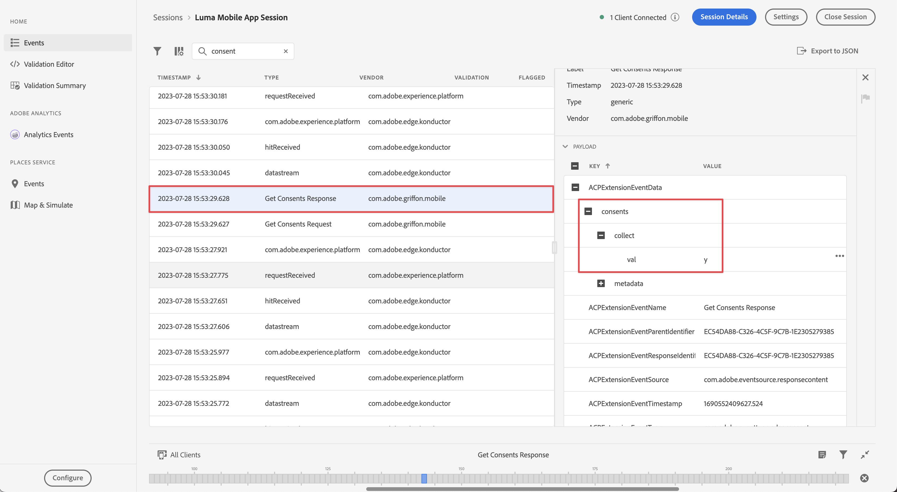

# Implementieren des Einverständnisses

Erfahren Sie, wie Sie das Einverständnis in einer Mobile App implementieren.

Die Adobe Experience Platform Consent Mobile-Erweiterung ermöglicht die Erfassung von Einverständnisvoreinstellungen über Ihre Mobile App bei Verwendung der Adobe Experience Platform Mobile SDK und der Edge Network-Erweiterung. Weitere Informationen zur [Einverständniserweiterung](https://developer.adobe.com/client-sdks/documentation/consent-for-edge-network/) finden Sie in der Dokumentation.

## Voraussetzungen

* App mit installierten und konfigurierten SDKs erfolgreich erstellt und ausgeführt.

## Lernziele

In dieser Lektion erfahren Sie Folgendes:

* Fordern Sie den Benutzer zur Zustimmung auf.
* Aktualisieren Sie die Erweiterung basierend auf der Benutzerantwort.
* Erfahren Sie, wie Sie den aktuellen Einverständnisstatus abrufen.

## Einverständnis einholen

Wenn Sie das Tutorial von Anfang an verfolgt haben, erinnern Sie sich vielleicht, dass Sie das Standardeinverständnis in der Einverständniserweiterung auf **[!UICONTROL Ausstehend - Warteschlangenereignisse festgelegt haben, die auftreten, bevor der Benutzer die Einverständnisvoreinstellungen festlegt.]**

Um mit der Datenerfassung beginnen zu können, müssen Sie die Zustimmung des Benutzers einholen. In einer realen App sollten Sie die Best Practices zum Einverständnis für Ihre Region konsultieren. In diesem Tutorial erhalten Sie die Zustimmung der Benutzenden, indem Sie sie einfach mit einem Warnhinweis darum bitten:

1. Sie möchten den Benutzer nur einmal um Zustimmung bitten. Sie können dies tun, indem Sie das SDK-Einverständnis für Mobile mit der erforderlichen Autorisierung für das Tracking mit dem Tracking-[-Framework von Apple kombinieren](https://developer.apple.com/documentation/apptrackingtransparency). Bei dieser App gehen Sie davon aus, dass der Benutzer mit der Erfassung von Ereignissen einverstanden ist, wenn er das Tracking autorisiert.

1. Navigieren Sie im Xcode-Projekt ]**Navigator zu **[!DNL Luma]**>**[!DNL Luma]**>**[!DNL Utils]**>**[!UICONTROL  MobileSDK“.

   Fügen Sie diesen Code zur `updateConsent` hinzu.

   ```swift
   // Update consent
   let collectConsent = ["collect": ["val": value]]
   let currentConsents = ["consents": collectConsent]
   Consent.update(with: currentConsents)
   MobileCore.updateConfigurationWith(configDict: currentConsents)
   ```

1. Navigieren Sie zu **[!DNL Luma]** > **[!DNL Luma]** > **[!DNL Views]** > **[!DNL General]** > **[!UICONTROL DisclaimerView]** im Projektnavigator von Xcode. Dies ist die Ansicht, die angezeigt wird, nachdem die Anwendung installiert oder neu installiert und die App zum ersten Mal gestartet wurde. Der Benutzer wird aufgefordert, das Tracking gemäß dem Apple-Framework [App Tracking Transparency](https://developer.apple.com/documentation/apptrackingtransparency) zu genehmigen. Wenn der Benutzer autorisiert, aktualisieren Sie auch das Einverständnis.

   Fügen Sie den folgenden Code zum `ATTrackingManager.requestTrackingAuthorization { status in` hinzu.

   ```swift
   // Add consent based on authorization
   if status == .authorized {
      // Set consent to yes
      MobileSDK.shared.updateConsent(value: "y")
   }
   else {
      // Set consent to yes
      MobileSDK.shared.updateConsent(value: "n")
   }
   ```

## Aktuellen Einverständnisstatus abrufen

Die Mobile Consent-Erweiterung unterdrückt automatisch das Tracking / ausstehend / ermöglicht es basierend auf dem aktuellen Einverständniswert. Sie können auch selbst auf den aktuellen Einverständnisstatus zugreifen:

1. Navigieren Sie im Projekt-Navigator von Xcode zu **[!DNL Luma]** > **[!DNL Luma]** > **[!DNL Utils]** **[!UICONTROL Mobile]** SDK).

   Fügen Sie der `getConsents`-Funktion den folgenden Code hinzu:

   ```swift
   // Get consents
   Consent.getConsents { consents, error in
      guard error == nil, let consents = consents else { return }
      guard let jsonData = try? JSONSerialization.data(withJSONObject: consents, options: .prettyPrinted) else { return }
      guard let jsonStr = String(data: jsonData, encoding: .utf8) else { return }
      Logger.aepMobileSDK.info("Consent getConsents: \(jsonStr)")
   }
   ```

2. Navigieren Sie im Projekt-Navigator von Xcode zu **[!DNL Luma]** > **[!DNL Luma]** > **[!DNL Views]** > **[!DNL General]** **[!UICONTROL HomeView]**.

   Fügen Sie dem `.task`-Modifikator den folgenden Code hinzu:

   ```swift
   // Ask status of consents
   MobileSDK.shared.getConsents()   
   ```

Im obigen Beispiel protokollieren Sie einfach den Einverständnisstatus in der Konsole in Xcode. In einem realen Szenario können Sie damit ändern, welche Menüs oder Optionen dem Benutzer angezeigt werden.

## Mit Assurance validieren

1. Löschen Sie die Anwendung von Ihrem Gerät oder Simulator, um das Tracking und das Einverständnis ordnungsgemäß zurückzusetzen und zu initialisieren.
1. Um Ihren Simulator oder Ihr Gerät mit Assurance zu verbinden, lesen Sie den Abschnitt [Setup-Anweisungen](assurance.md#connecting-to-a-session).
1. Wenn Sie in der App vom Bildschirm **[!UICONTROL Startseite]** zum Bildschirm **[!UICONTROL Produkte]** und zurück zum Bildschirm **[!UICONTROL Startseite]** wechseln, sollte in der Benutzeroberfläche von Assurance ein Ereignis **[!UICONTROL Antwort zum Einverständnis]** angezeigt werden.
   


>[!SUCCESS]
>
>Sie haben jetzt Ihre App aktiviert, um den Benutzer beim ersten Start nach der Installation (oder Neuinstallation) aufzufordern, mit der Adobe Experience Platform Mobile SDK zuzustimmen.
>
>Vielen Dank, dass Sie sich Zeit genommen haben, um mehr über Adobe Experience Platform Mobile SDK zu erfahren. Wenn Sie Fragen haben, allgemeines Feedback geben möchten oder Vorschläge für zukünftige Inhalte haben, teilen Sie diese auf diesem [Experience League Community-Diskussionsbeitrag](https://experienceleaguecommunities.adobe.com/t5/adobe-experience-platform-data/tutorial-discussion-implement-adobe-experience-cloud-in-mobile/td-p/443796)

Weiter: **[Erfassen von Lebenszyklusdaten](lifecycle-data.md)**
