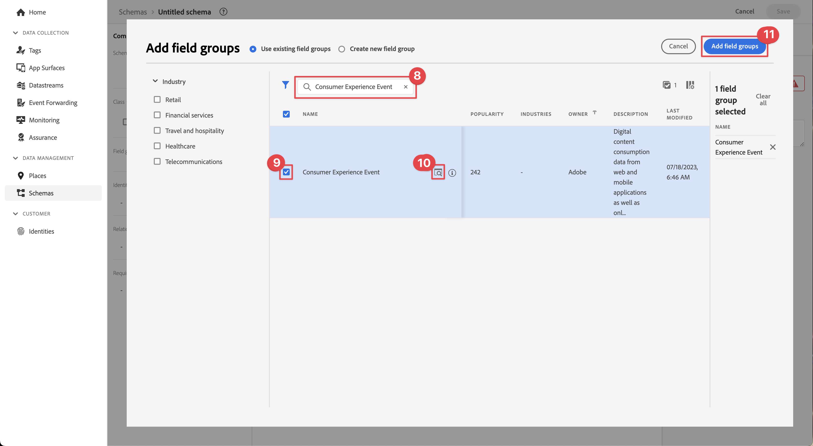
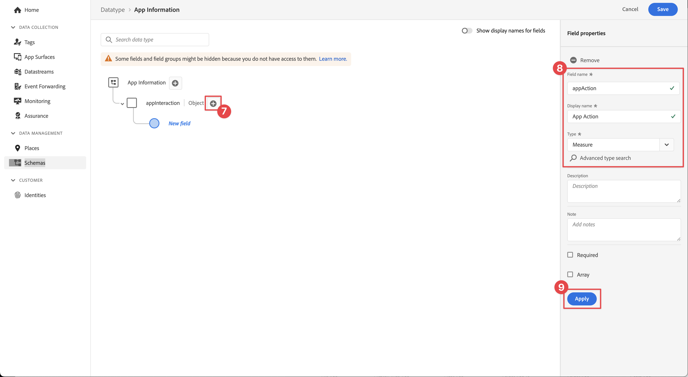

# Erstellen eines XDM-Schemas

Erfahren Sie, wie Sie ein XDM-Schema für App-Ereignisse erstellen.

Standardisierung und Interoperabilität sind Schlüsselkonzepte von Adobe Experience Platform. Das von Adobe unterstützte Experience-Datenmodell (XDM) ermöglicht die Standardisierung von Kundenerlebnisdaten und die Definition von Schemata für das Customer Experience Management.

## Was sind XDM-Schemata?

XDM ist eine öffentlich dokumentierte Spezifikation, die die Leistungsfähigkeit digitaler Erlebnisse verbessern soll. Es bietet allgemeine Strukturen und Definitionen, die es jeder Anwendung ermöglichen, mit Platform-Diensten zu kommunizieren. Durch die Einhaltung von XDM-Standards können alle Kundenerlebnisdaten in ein gemeinsames System integriert werden, wodurch Erkenntnisse schneller und besser integriert verfügbar werden. Sie erhalten wertvolle Einblicke aus Kundenaktionen, definieren Kundenzielgruppen über Segmente und verwenden Kundenattribute für Personalisierungszwecke.

Schemata dienen in Experience Platform zur konsistenten und wiederverwendbaren Beschreibung der Struktur von Daten. Durch die systemübergreifende einheitliche Definition von Daten wird es einfacher, deren Bedeutung beizubehalten und somit Wert aus Daten zu ziehen.

Bevor Daten in Platform aufgenommen werden können, muss ein Schema erstellt werden, das die Datenstruktur beschreibt und den Datentyp entsprechend des jeweiligen Feldes einschränkt. Schemata bestehen aus einer Basisklasse und keiner oder mehreren Schema-Feldergruppen.

Weitere Informationen zum Schema-Kompositionsmodell, einschließlich Designprinzipien und Best Practices, finden Sie in den [Grundlagen der Schemakomposition](https://experienceleague.adobe.com/docs/experience-platform/xdm/schema/composition.html?lang=de) oder der Wiedergabeliste [Modellieren Ihrer Kundenerlebnisdaten mit XDM](https://experienceleague.adobe.com/en/playlists/experience-platform-model-your-customer-experience-data-with-xdm).

>[!TIP]
>
>Wenn Sie mit Analytics Solution Design Reference (SDRs) vertraut sind, können Sie sich ein Schema als robustere SDR vorstellen. Weitere Informationen finden Sie im Dokument [Erstellen und Verwalten einer Lösungs-Design-Referenz (SDR)](https://experienceleague.adobe.com/docs/analytics-learn/tutorials/implementation/implementation-basics/creating-and-maintaining-an-sdr.html?lang=en) .

## Voraussetzungen

Um die Lektion abzuschließen, müssen Sie über die Berechtigung zum Erstellen eines Experience Platform-Schemas verfügen.

## Lernziele

In dieser Lektion werden Sie:

* Erstellen eines Schemas in der Datenerfassungsoberfläche
* Hinzufügen einer Standardfeldgruppe zum Schema
* Erstellen und Hinzufügen einer benutzerdefinierten Feldergruppe zum Schema

## Navigieren zu Schemata

1. Melden Sie sich bei der Adobe Experience Cloud an.

1. Stellen Sie sicher, dass Sie sich in der Experience Platform-Sandbox befinden, die Sie für dieses Tutorial verwenden.

1. Öffnen Sie den App-Umschalter  (oben rechts),

1. Wählen Sie **[!UICONTROL Datenerfassung]** aus dem Menü aus.

   

   >[!NOTE]
   >
   > Kunden von Platform-basierten Anwendungen wie Real-Time CDP sollten für dieses Tutorial eine Entwicklungs-Sandbox verwenden. Andere Kunden verwenden die standardmäßige Produktions-Sandbox.

1. Wählen Sie in der linken Leiste unter **[!UICONTROL Data Management]** die Option **[!UICONTROL Schemas]** aus.

   

Sie befinden sich nun auf der Hauptseite der Schemas und erhalten eine Liste der vorhandenen Schemas. Sie können auch Registerkarten sehen, die den Kernbausteinen eines Schemas entsprechen:

* **Feldergruppen** sind wiederverwendbare Komponenten, die ein oder mehrere Felder definieren, um bestimmte Daten zu erfassen, z. B. persönliche Details, Hotelpräferenzen oder Adressen.
* **Klassen** definieren die Verhaltensaspekte der Daten, die das Schema enthält. Beispiel: `XDM ExperienceEvent` erfasst Zeitreihen, Ereignisdaten und `XDM Individual Profile` erfasst Attributdaten zu einer Person.
* **Datentypen** werden in Klassen oder Feldergruppen wie einfache literale Felder als Referenzfeldtypen verwendet.

Die obigen Beschreibungen geben einen Überblick auf hoher Ebene. Weitere Informationen finden Sie im Video [Schema-Bausteine](https://experienceleague.adobe.com/docs/platform-learn/tutorials/schemas/schema-building-blocks.html?lang=de) oder lesen Sie [Grundlagen der Schemakomposition](https://experienceleague.adobe.com/docs/experience-platform/xdm/schema/composition.html?lang=de) in der Produktdokumentation.

In diesem Tutorial verwenden Sie die Feldergruppe &quot;Consumer Experience Event&quot;und erstellen eine benutzerdefinierte, um den Prozess zu demonstrieren.

>[!NOTE]
>
>Adobe fügt weiterhin mehr Standardfeldgruppen hinzu und sollten nach Möglichkeit verwendet werden, da diese Felder implizit von Experience Platform-Diensten verstanden werden und bei der Verwendung über Plattformkomponenten hinweg eine größere Konsistenz gewährleistet ist. Die Verwendung von Standardfeldgruppen bietet greifbare Vorteile wie die automatische Zuordnung in Analytics- und AI-Funktionen in Platform.

## Architektur des Luma-App-Schemas

In einem realen Szenario könnte der Schemaentwurfsprozess wie folgt aussehen:

* Sammeln Sie Geschäftsanforderungen.
* Suchen Sie nach vordefinierten Feldergruppen, um so viele Anforderungen wie möglich abzudecken.
* Erstellen Sie benutzerdefinierte Feldergruppen für Lücken.

Zu Lernzwecken verwenden Sie vordefinierte und benutzerdefinierte Feldergruppen.

* **Consumer Experience Event**: Vordefinierte Feldergruppe mit vielen gemeinsamen Feldern.
* **App-Informationen**: Benutzerdefinierte Feldergruppe, die entwickelt wurde, um TrackState-/TrackAction-Analytics-Konzepte zu imitieren.

<!--Later in the tutorial, you can [update the schema](lifecycle-data.md) to include the **[!UICONTROL AEP Mobile Lifecycle Details]** field group.-->

## Erstellen eines Schemas

1. Wählen Sie **[!UICONTROL Schema erstellen]** aus.

1. Wählen Sie im Schritt **[!UICONTROL Select a class]** des Assistenten **[!UICONTROL Create schema]** die Option **[!UICONTROL Experience Event]** unter **[!UICONTROL Select a base class for this schema]**.

1. Klicken Sie auf **[!UICONTROL Weiter]**.

   

1. Geben Sie im Schritt **[!UICONTROL Name und Überprüfung]** des Assistenten **[!UICONTROL Schema erstellen]** einen **[!UICONTROL Anzeigenamen des Schemas]** ein, z. B. `Luma Mobile Event Schema` und einen [!UICONTROL Beschreibung], z. B. `Schema for Luma mobile app experience events`.

   >[!NOTE]
   >
   >Wenn Sie dieses Tutorial mit mehreren Personen in einer Sandbox durchlaufen oder ein freigegebenes Konto verwenden, sollten Sie erwägen, im Rahmen Ihrer Benennungskonventionen eine Identität anzuhängen oder vorzustellen. Verwenden Sie beispielsweise anstelle von `Luma Mobile App Event Schema` `Luma Mobile App Event Schema - Joe Smith`. Siehe auch den Hinweis unter [Überblick](overview.md).

1. Wählen Sie **[!UICONTROL Beenden]** aus, um den Assistenten abzuschließen.

   

1. Wählen Sie  **Hinzufügen** neben **[!UICONTROL Feldergruppen]** aus.

   

1. Suchen Sie nach `Consumer Experience Event`.

1. Wählen Sie  aus, um eine Vorschau der Felder anzuzeigen und/oder die Beschreibung zu lesen, um weitere Details zu erhalten, bevor Sie eine Feldergruppe auswählen.

1. Wählen Sie **Consumer Experience Event** aus.

1. Wählen Sie **[!UICONTROL Feldergruppen hinzufügen]** aus.

   

   Sie gelangen zurück zum Bildschirm zur Hauptschemakomposition, wo Sie alle verfügbaren Felder sehen können.

1. Wählen Sie **[!UICONTROL Speichern]** aus.

>[!NOTE]
>
>Beachten Sie, dass nicht alle Felder einer Gruppe verwendet werden müssen. Sie können auch Felder entfernen, um das Schema kurz und verständlich zu halten. Wenn es hilfreich ist, können Sie sich ein Schema als leere Datenschicht vorstellen. In Ihrer App füllen Sie die entsprechenden Werte zum richtigen Zeitpunkt aus.

Die Feldergruppe [!UICONTROL Consumer Experience Event] enthält den Datentyp [!UICONTROL Web information] , der Ereignisse wie Seitenansichten und Link-Klicks beschreibt. Zum Zeitpunkt des Schreibens gibt es keine App-Parität für diese Funktion. Daher erstellen Sie Ihre eigene.

## Erstellen eines benutzerdefinierten Datentyps

Erstellen Sie zunächst einen benutzerdefinierten Datentyp, der die beiden Ereignisse beschreibt:

* Bildschirmansicht
* App-Interaktion

1. Wählen Sie die Registerkarte **[!UICONTROL Datentypen]** aus.

1. Wählen Sie **[!UICONTROL Datentyp erstellen]** aus.

   

1. Geben Sie einen **[!UICONTROL Anzeigenamen]** und **[!UICONTROL Beschreibung]** an, z. B. `App Information` und `Custom data type describing "Screen Views" & "App Actions"`

   

   >[!TIP]
   >
   > Verwenden Sie immer lesbare, beschreibende [!UICONTROL Anzeigenamen] für Ihre benutzerdefinierten Felder, da diese Vorgehensweise Marketern den Zugriff auf sie erleichtert, wenn die Felder in nachgelagerten Diensten wie dem Segment-Builder angezeigt werden.

1. Um ein Feld hinzuzufügen, wählen Sie die Schaltfläche  aus.

1. Dieses Feld ist ein Container-Objekt für App-Interaktionen. Geben Sie daher **[!UICONTROL Feldname]** `appInteraction`, **[!UICONTROL Anzeigename]** `App Interaction` in Binnenmajuskel ein und wählen Sie `Object` aus der Liste **[!UICONTROL Typ]** aus.

1. Wählen Sie **[!UICONTROL Anwenden]** aus.

   

1. Um zu messen, wie oft eine Aktion aufgetreten ist, fügen Sie ein Feld hinzu, indem Sie die Schaltfläche  neben dem von Ihnen erstellten Objekt **[!UICONTROL appInteraction]** auswählen.

1. Geben Sie ihr die Groß-/Kleinschreibung **[!UICONTROL Feldname]** `appAction`, **[!UICONTROL Anzeigename]** von `App Action` und **[!UICONTROL Typ]** `Measure`.

   Dieser Schritt entspricht einem Erfolgsereignis in Adobe Analytics.

1. Wählen Sie **[!UICONTROL Anwenden]** aus.

   

1. Fügen Sie ein Feld hinzu, das den Interaktionstyp beschreibt, indem Sie die Schaltfläche  neben dem Objekt **[!UICONTROL appInteraction]** auswählen.

1. Geben Sie ihr den **[!UICONTROL Feldnamen]** `name`, den **[!UICONTROL Anzeigenamen]** von `Name` und den **[!UICONTROL Typ]** `String`.

   Dieser Schritt entspricht einer Dimension in Adobe Analytics.

   

1. Scrollen Sie nach unten in der rechten Leiste und wählen Sie **[!UICONTROL Anwenden]** aus.

1. Um ein `appStateDetails` -Objekt zu erstellen, das ein **[!UICONTROL Measure]** -Feld namens `screenView` und zwei **[!UICONTROL String]** -Felder namens `screenName` und `screenType` enthält, führen Sie dieselben Schritte wie beim Erstellen des **[!UICONTROL appInteraction]** -Objekts aus.

1. Wählen Sie **[!UICONTROL Speichern]** aus.

   

## Benutzerdefinierte Feldergruppe hinzufügen

Fügen Sie nun mithilfe Ihres benutzerdefinierten Datentyps eine benutzerdefinierte Feldergruppe hinzu:

1. Öffnen Sie das Schema, das Sie zuvor in dieser Lektion erstellt haben.

1. Wählen Sie  **[!UICONTROL Hinzufügen]** neben **[!UICONTROL Feldergruppen]** aus.

   

1. Wählen Sie **[!UICONTROL Neue Feldergruppe erstellen]** aus.

1. Geben Sie einen **[!UICONTROL Anzeigenamen]** und **[!UICONTROL Beschreibung]** an, z. B. `App Interactions` und `Fields for app interactions`.

1. Wählen Sie **Feldergruppen hinzufügen** aus.

   

1. Wählen Sie im Bildschirm &quot;Hauptkomposition&quot;die Option **[!UICONTROL App-Interaktionen*].

1. Fügen Sie dem Stammverzeichnis des Schemas ein Feld hinzu, indem Sie neben dem Schemanamen die Schaltfläche  auswählen.

1. Geben Sie in der rechten Leiste einen **[!UICONTROL Feldnamen]** von `appInformation`, einen **[!UICONTROL Anzeigenamen]** von `App Information` und einen **[!UICONTROL Typ]** von `App Information` ein.

1. Wählen Sie **[!UICONTROL App-Interaktionen]** aus der Dropdown-Liste **[!UICONTROL Feldergruppe]** aus, um die Felder Ihrer neuen Feldergruppe zuzuweisen.

1. Wählen Sie **[!UICONTROL Anwenden]** aus.

1. Wählen Sie **[!UICONTROL Speichern]** aus.

   

>[!NOTE]
>
>Benutzerdefinierte Feldergruppen werden immer unter Ihrer Experience Cloud-Organisationskennung platziert.

>[!SUCCESS]
>
>Sie verfügen jetzt über ein Schema, das für den Rest des Tutorials verwendet werden kann.
>
>Vielen Dank, dass Sie Ihre Zeit investiert haben, um mehr über das Adobe Experience Platform Mobile SDK zu erfahren. Wenn Sie Fragen haben, allgemeine Rückmeldungen oder Anregungen zu zukünftigen Inhalten haben möchten, teilen Sie diese in diesem [Experience League Community-Diskussionbeitrag](https://experienceleaguecommunities.adobe.com/t5/adobe-experience-platform-data/tutorial-discussion-implement-adobe-experience-cloud-in-mobile/td-p/443796) mit.

Weiter: **[Erstellen eines [!UICONTROL Datastream]](create-datastream.md)**
