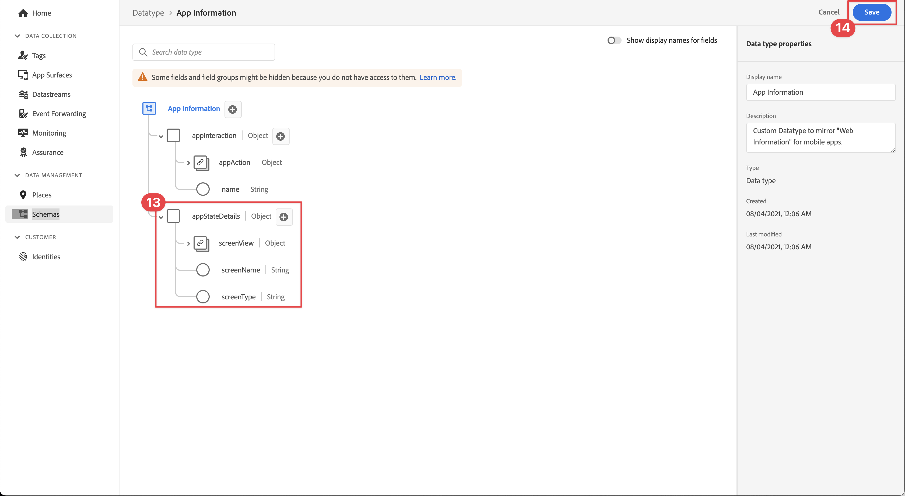

# Erstellen eines XDM-Schemas

Erfahren Sie, wie Sie ein XDM-Schema für Ereignisse von Mobile Apps erstellen.

Standardisierung und Interoperabilität sind Schlüsselkonzepte von Adobe Experience Platform. Das von Adobe unterstützte Experience-Datenmodell (XDM) ermöglicht die Standardisierung von Kundenerlebnisdaten und die Definition von Schemata für das Customer Experience Management.

## Was sind XDM-Schemata?

XDM ist eine öffentlich dokumentierte Spezifikation, die die Leistungsfähigkeit digitaler Erlebnisse verbessern soll. Sie bietet allgemeine Strukturen und Definitionen, mit denen jede Anwendung mit Platform-Services kommunizieren kann. Durch die Einhaltung von XDM-Standards können alle Kundenerlebnisdaten in ein gemeinsames System integriert werden, wodurch Erkenntnisse schneller und besser integriert verfügbar werden. Sie erhalten wertvolle Einblicke aus Kundenaktionen, definieren Zielgruppen über Segmente und verwenden Kundenattribute für Personalisierungszwecke.

Schemata dienen in Experience Platform zur konsistenten und wiederverwendbaren Beschreibung der Struktur von Daten. Durch die systemübergreifende einheitliche Definition von Daten wird es einfacher, deren Bedeutung beizubehalten und somit Wert aus Daten zu ziehen.

Bevor Daten in Platform aufgenommen werden können, muss ein Schema erstellt werden, das die Datenstruktur beschreibt und den Datentyp entsprechend des jeweiligen Feldes einschränkt. Schemata bestehen aus einer Basisklasse und keiner oder mehreren Schema-Feldergruppen.

Weitere Informationen zum Schemakompositionsmodell, einschließlich Planungsgrundsätzen und Best Practices, finden Sie in den [Grundlagen der Schemakomposition](https://experienceleague.adobe.com/docs/experience-platform/xdm/schema/composition.html?lang=de) oder der Wiedergabeliste [Modellieren Ihrer Kundenerlebnisdaten mit XDM](https://experienceleague.adobe.com/en/playlists/experience-platform-model-your-customer-experience-data-with-xdm).

>[!TIP]
>
>Wenn Sie mit Analytics Solution Design Reference (SDRs) vertraut sind, können Sie sich ein Schema als robustere SDR vorstellen. Weitere [ finden Sie unter „Erstellen und Verwalten einer Lösungs-Design-Referenz (](https://experienceleague.adobe.com/docs/analytics-learn/tutorials/implementation/implementation-basics/creating-and-maintaining-an-sdr.html?lang=en))“.

## Voraussetzungen

Um die Lektion abzuschließen, benötigen Sie die Berechtigung zum Erstellen eines Experience Platform-Schemas.

## Lernziele

In dieser Lektion erfahren Sie Folgendes:

* Erstellen eines Schemas in der Datenerfassungs-Benutzeroberfläche
* Hinzufügen einer Standardfeldgruppe zum Schema
* Erstellen einer benutzerdefinierten Feldergruppe und Hinzufügen einer benutzerdefinierten Feldergruppe zum Schema

## Zu Schemata navigieren

1. Melden Sie sich bei Adobe Experience Cloud an.

1. Stellen Sie sicher, dass Sie sich in der Experience Platform-Sandbox befinden, die Sie für dieses Tutorial verwenden.

1. Öffnen Sie den App Switcher  (oben rechts),

1. Wählen **[!UICONTROL Datenerfassung]** aus dem Menü aus.

   

   >[!NOTE]
   >
   > Kunden von Platform-basierten Programmen wie Real-Time CDP sollten für dieses Tutorial eine Entwicklungs-Sandbox verwenden. Andere Kunden verwenden die standardmäßige Produktions-Sandbox.

1. Wählen Sie **[!UICONTROL Schemata]** unter **[!UICONTROL Daten-Management]** in der linken Leiste aus.

   

Sie befinden sich nun auf der Hauptseite für Schemata und erhalten eine Liste aller vorhandenen Schemata. Außerdem werden Registerkarten angezeigt, die den Grundbausteinen eines Schemas entsprechen:

* **Feldergruppen** sind wiederverwendbare Komponenten, die ein oder mehrere Felder definieren, um bestimmte Daten wie persönliche Details, Hotelvoreinstellungen oder Adressen zu erfassen.
* **Klassen** definieren die Verhaltensaspekte der Daten, die das Schema enthält. Beispiel: `XDM ExperienceEvent` erfasst Zeitreihen- und Ereignisdaten und `XDM Individual Profile` Attributdaten zu einem Kontakt.
* **Datentypen** werden als Referenzfeldtypen in Klassen oder Feldergruppen auf dieselbe Weise wie grundlegende Literalfelder verwendet.

Die obigen Beschreibungen bieten einen allgemeinen Überblick. Weitere Informationen finden Sie im [Schemabausteine](https://experienceleague.adobe.com/docs/platform-learn/tutorials/schemas/schema-building-blocks.html?lang=de) Video oder lesen Sie [Grundlagen der Schemakomposition](https://experienceleague.adobe.com/docs/experience-platform/xdm/schema/composition.html?lang=de) in der Produktdokumentation.

In diesem Tutorial verwenden Sie die Feldergruppe Consumer Experience Event und erstellen eine benutzerdefinierte Feldergruppe, um den Prozess zu demonstrieren.

>[!NOTE]
>
>Beim Adobe werden weiterhin mehr Standardfeldgruppen hinzugefügt. Diese sollten nach Möglichkeit verwendet werden, da diese Felder von Experience Platform-Services implizit verstanden werden und eine größere Konsistenz bei der Verwendung über Platform-Komponenten hinweg bieten. Die Verwendung von Standardfeldgruppen bietet greifbare Vorteile wie die automatische Zuordnung in Analytics- und KI-Funktionen in Platform.

## Architektur des Luma-App-Schemas

In einem realen Szenario könnte der Schema-Design-Prozess wie folgt aussehen:

* Sammeln Sie Geschäftsanforderungen.
* Suchen Sie nach vordefinierten Feldergruppen, um so viele Anforderungen wie möglich abzudecken.
* Erstellen Sie benutzerdefinierte Feldergruppen für alle Lücken.

Zu Lernzwecken verwenden Sie vorgefertigte und benutzerdefinierte Feldergruppen.

* **Consumer Experience Event**: Vordefinierte Feldergruppe mit vielen gemeinsamen Feldern.
* **App-Informationen**: Benutzerdefinierte Feldergruppe, die TrackState-/TrackAction-Analytics-Konzepte imitieren soll.

<!--Later in the tutorial, you can [update the schema](lifecycle-data.md) to include the **[!UICONTROL AEP Mobile Lifecycle Details]** field group.-->

## Erstellen eines Schemas

1. Wählen Sie **[!UICONTROL Schema erstellen]** aus.

1. Wählen Sie im **[!UICONTROL Klasse auswählen]** des Assistenten **[!UICONTROL Schema erstellen]** die Option **[!UICONTROL Erlebnisereignis]** unter **[!UICONTROL Basisklasse für dieses Schema auswählen]**.

1. Klicken Sie auf **[!UICONTROL Weiter]**.

   

1. Geben Sie im **[!UICONTROL Name und]**) des Assistenten **[!UICONTROL Schema erstellen]** einen **[!UICONTROL Schema-Anzeigenamen]** ein, z. B. `Luma Mobile Event Schema` und eine [!UICONTROL Beschreibung], z. B. `Schema for Luma mobile app experience events`.

   >[!NOTE]
   >
   >Wenn Sie dieses Tutorial mit mehreren Personen in einer einzelnen Sandbox durchlaufen oder ein freigegebenes Konto verwenden, sollten Sie erwägen, eine Identifizierung als Teil Ihrer Namenskonventionen anzuhängen oder voranzustellen. Verwenden Sie beispielsweise anstelle von `Luma Mobile App Event Schema` `Luma Mobile App Event Schema - Joe Smith`. Siehe auch den Hinweis in [Übersicht](overview.md).

1. Wählen Sie **[!UICONTROL Beenden]** aus, um den Assistenten abzuschließen.

   

1. Wählen Sie  **Hinzufügen** neben **[!UICONTROL Feldergruppen]**.

   

1. Suchen Sie nach `Consumer Experience Event`.

1. Wählen Sie , um eine Vorschau der Felder anzuzeigen und/oder die Beschreibung zu lesen, bevor Sie eine Feldergruppe auswählen.

1. Wählen Sie **Consumer Experience Event** aus.

1. Wählen Sie **[!UICONTROL Feldergruppen hinzufügen]** aus.

   

   Sie gelangen zurück zum Hauptbildschirm für die Schemakomposition, wo Sie alle verfügbaren Felder sehen können.

1. Wählen Sie **[!UICONTROL Speichern]** aus.

>[!NOTE]
>
>Beachten Sie, dass Sie nicht alle Felder in einer Gruppe verwenden müssen. Sie können auch Felder entfernen, damit das Schema kurz und verständlich bleibt. Wenn es hilfreich ist, können Sie sich ein Schema als leere Datenschicht vorstellen. In Ihrer App füllen Sie die entsprechenden Werte zum richtigen Zeitpunkt aus.

Die [!UICONTROL Consumer Experience Event]-Feldergruppe verfügt über einen Datentyp namens [!UICONTROL Web-Informationen] der Ereignisse wie Seitenansichten und Link-Klicks beschreibt. Zum Zeitpunkt des Verfassens gibt es keine Parität zwischen Mobile Apps für diese Funktion, sodass Sie eine eigene erstellen werden.

## Erstellen eines benutzerdefinierten Datentyps

Sie erstellen zunächst einen benutzerdefinierten Datentyp, der die beiden Ereignisse beschreibt:

* Bildschirmansicht
* App-Interaktion

1. Wählen Sie die **[!UICONTROL Datentypen]** aus.

1. Wählen **[!UICONTROL Datentyp erstellen]**.

   

1. Geben Sie einen **[!UICONTROL Anzeigenamen]** und **[!UICONTROL Beschreibung]** an, z. B. `App Information` und `Custom data type describing "Screen Views" & "App Actions"`

   

   >[!TIP]
   >
   > Verwenden Sie immer lesbare, beschreibende [!UICONTROL Anzeigenamen] für Ihre benutzerdefinierten Felder, da diese Praxis sie für Marketing-Experten leichter zugänglich macht, wenn die Felder in nachgelagerten Services wie Segment Builder angezeigt werden.

1. Um ein Feld hinzuzufügen, klicken Sie auf die Schaltfläche .

1. Dieses Feld ist ein Container-Objekt für die App-Interaktion. Geben Sie daher einen **[!UICONTROL (Feldname]** `appInteraction`, **[!UICONTROL Anzeigename]** `App Interaction` an und wählen Sie `Object` aus der **[!UICONTROL Type]**-Liste aus.

1. Wählen Sie **[!UICONTROL Anwenden]** aus.

   

1. Um zu messen, wie oft eine Aktion stattgefunden hat, fügen Sie ein Feld hinzu, indem Sie die -Schaltfläche neben dem **[!UICONTROL appInteraction]**-Objekt auswählen.

1. Geben Sie ihm einen **[!UICONTROL (Feldname]** `appAction`, **[!UICONTROL Anzeigename]** von `App Action` und **** Typ`Measure`.

   Dieser Schritt entspricht einem Erfolgsereignis in Adobe Analytics.

1. Wählen Sie **[!UICONTROL Anwenden]** aus.

   

1. Fügen Sie ein Feld hinzu, das den Interaktionstyp beschreibt, indem Sie auf die Schaltfläche  neben dem Objekt **[!UICONTROL appInteraction]** klicken.

1. Geben Sie ihm **[!UICONTROL Feldname]** `name`, **[!UICONTROL Anzeigename]** der `Name` und **[!UICONTROL Typ]** `String`.

   Dieser Schritt entspricht einer Dimension in Adobe Analytics.

   

1. Scrollen Sie nach unten in der rechten Leiste und wählen Sie **[!UICONTROL Anwenden]** aus.

1. Um ein `appStateDetails`-Objekt zu erstellen, das ein **[!UICONTROL Measure]**-Feld namens `screenView` und zwei **[!UICONTROL String]**-Felder namens `screenName` und `screenType` enthält, führen Sie dieselben Schritte aus wie beim Erstellen des **[!UICONTROL appInteraction]**-Objekts.

1. Wählen Sie **[!UICONTROL Speichern]** aus.

   

## Hinzufügen einer benutzerdefinierten Feldergruppe

Fügen Sie jetzt eine benutzerdefinierte Feldergruppe mit Ihrem benutzerdefinierten Datentyp hinzu:

1. Öffnen Sie das Schema, das Sie zuvor in dieser Lektion erstellt haben.

1. Wählen Sie  **[!UICONTROL Hinzufügen]** neben **[!UICONTROL Feldergruppen]**.

   

1. Wählen Sie **[!UICONTROL Neue Feldergruppe erstellen]** aus.

1. Geben Sie einen **[!UICONTROL Anzeigenamen]** und **[!UICONTROL Beschreibung]** an, z. B. `App Interactions` und `Fields for app interactions`.

1. Wählen Sie **Feldergruppen hinzufügen** aus.

   

1. Wählen Sie im Hauptkompositionsbildschirm **[!UICONTROL App Interactions**] aus.

1. Fügen Sie ein Feld zum Stammverzeichnis des Schemas hinzu, indem Sie die Schaltfläche  neben dem Schemanamen auswählen.

1. Geben Sie in der rechten Leiste einen **[!UICONTROL Feldnamen]** von `appInformation`, einen **[!UICONTROL Anzeigenamen]** von `App Information` und einen **[!UICONTROL Typ]** von `App Information` an.

1. Wählen Sie **[!UICONTROL App Interactions]** aus der Dropdown **[!UICONTROL Liste „Feldergruppe]** aus, um die Felder Ihrer neuen Feldergruppe zuzuweisen.

1. Wählen Sie **[!UICONTROL Anwenden]** aus.

1. Wählen Sie **[!UICONTROL Speichern]** aus.

   

>[!NOTE]
>
>Benutzerdefinierte Feldergruppen werden immer unter Ihrer Experience Cloud-Organisationskennung platziert.

>[!SUCCESS]
>
>Sie haben jetzt ein Schema, das Sie für den Rest des Tutorials verwenden können.
>
>Vielen Dank, dass Sie sich Zeit genommen haben, um mehr über Adobe Experience Platform Mobile SDK zu erfahren. Wenn Sie Fragen haben, allgemeines Feedback geben möchten oder Vorschläge für zukünftige Inhalte haben, teilen Sie diese auf diesem [Experience League Community-Diskussionsbeitrag](https://experienceleaguecommunities.adobe.com/t5/adobe-experience-platform-data/tutorial-discussion-implement-adobe-experience-cloud-in-mobile/td-p/443796).

Weiter: **[Erstellen eines [!UICONTROL Datenstroms]](create-datastream.md)**
