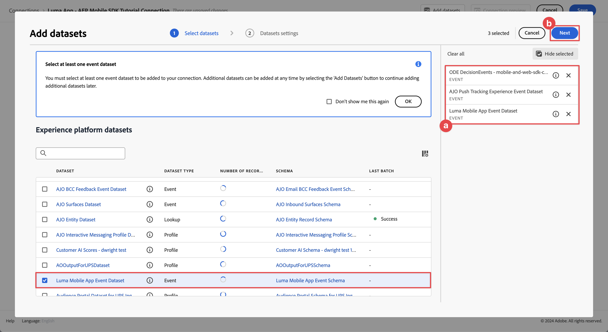
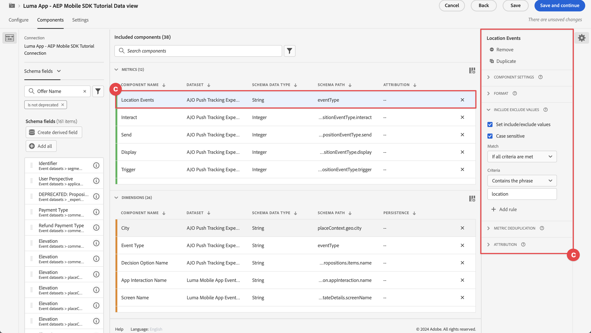
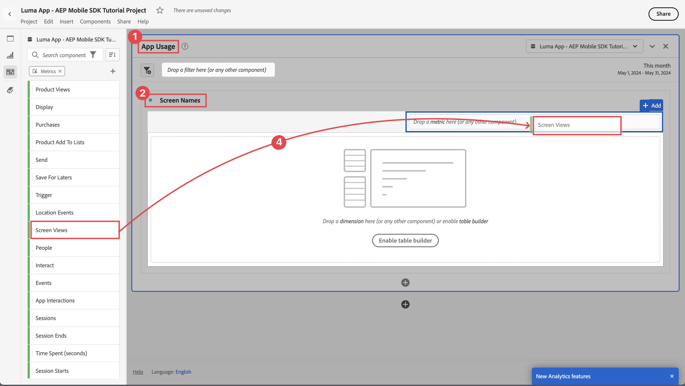
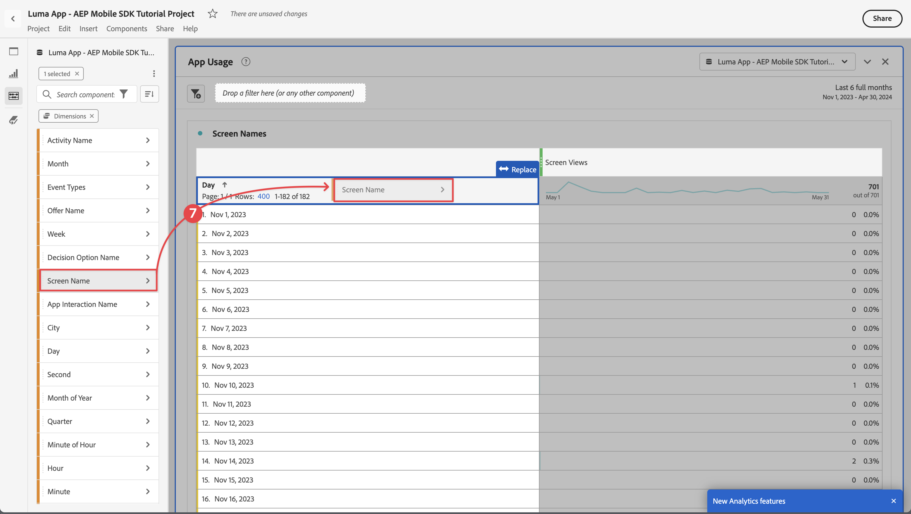

# Reporting und Analyse mit Customer Journey Analytics

Erfahren Sie, wie Sie Ihre Mobile-App-Interaktionen mit Customer Journey Analytics melden und analysieren können.

Die Mobile-App-Ereignisdaten, die Sie in früheren Lektionen erfasst und an Platform Edge Network gesendet haben, werden an die in Ihrem Datenstrom konfigurierten Services weitergeleitet. Wenn Sie der Lektion [Daten an Experience Platform senden](platform.md) gefolgt sind, werden diese Daten jetzt in einem Experience Platform-Datensatz gespeichert und stehen Customer Journey Analytics für Berichte und Analysen zur Verfügung.

Im Gegensatz zu Adobe Analytics *Customer Journey Analytics Daten* in Experience Platform erstellten Datensätzen (verwendet). Daten werden mit Adobe Experience Platform Mobile SDK nicht direkt an Customer Journey Analytics gesendet. Stattdessen werden die Daten an Datensätze gesendet. Verbindungen werden dann in Customer Journey Analytics konfiguriert, um die Datensätze auszuwählen, die Sie in Ihren Reporting- und Analyseprojekten verwenden werden.

Diese Lektion im Tutorial konzentriert sich auf das Reporting und die Analyse der Daten, die von der Luma-Tutorial-App erfasst werden. Eine der einzigartigen Funktionen von Customer Journey Analytics ist die Kombination von Daten aus verschiedenen Quellen (CRM, Point-of-Sale, Treueprogramm, Callcenter) und Kanälen (Web, Mobile, Offline), um detaillierte Einblicke in die Journey der Kunden zu erhalten. Diese Fähigkeit würde den Rahmen dieser Lektion sprengen. Weitere Informationen finden Sie unter Übersicht über [&#128279;](https://experienceleague.adobe.com/de/docs/analytics-platform/using/cja-overview/cja-overview)Customer Journey Analytics .

## Voraussetzungen

Für Ihr Unternehmen müssen Berechtigungen bereitgestellt und die Berechtigung für Customer Journey Analytics erteilt werden. Sie benötigen Administratorzugriff auf Customer Journey Analytics.

## Lernziele

In dieser Lektion erfahren Sie Folgendes:

- Erstellen Sie eine Verbindung, um die Datensätze aus Experience Platform zu definieren, die Sie in Customer Journey Analytics verwenden möchten.
- Datenansicht erstellen, um die Daten aus den Datensätzen für die Berichterstellung und Analyse vorzubereiten
- Erstellen Sie ein Projekt, um Berichte und Visualisierungen zu erstellen, damit Sie die Daten aus Ihrer Mobile App analysieren können.

Die Sequenz ist beabsichtigt. Verbindungen verwenden Datensätze, und Datenansichten verwenden Verbindungen.

## Verbindung erstellen

Eine Verbindung in Customer Journey Analytics definiert die Datensätze (und die Daten in diesen Datensätzen) aus Experience Platform, die Sie für die Berichterstellung und Analyse verwenden möchten.

1. Navigieren Sie zur Customer Journey Analytics-Benutzeroberfläche über das Menü  oben rechts.

1. Wählen **[!UICONTROL Verbindungen]** in der oberen Menüleiste aus.

1. Wählen Sie unbedingt die **[!UICONTROL Liste]** in der Verbindungsschnittstelle aus. Es wird eine Liste der vorhandenen Verbindungen angezeigt.

1. Wählen Sie **[!UICONTROL Neue Verbindung erstellen]** aus.

1. Im Bildschirm **[!UICONTROL Verbindungen]** > **[!UICONTROL Nicht benannte Verbindung]** in **[!UICONTROL Verbindungseinstellungen]**

   1. Geben Sie einen **[!UICONTROL Verbindungsnamen]** ein, z. B. `Luma App - AEP Mobile SDK Tutorial Connection`.
   2. Geben Sie eine **[!UICONTROL Verbindungsbeschreibung]** ein, z. B. `Connection for the Luma app used in the AEP Mobile SDK tutorial`.

      In **[!UICONTROL Dateneinstellungen]**:

   3. Wählen Sie die Sandbox aus, die Sie zum Erfassen Ihrer Mobile-App-Daten verwendet haben, z. B **[!UICONTROL „Mobile- und Web-SDK-Kurse]**.
   4. Wählen Sie **[!UICONTROL weniger als 1 Million]** aus der **[!UICONTROL Durchschnittliche Anzahl der täglichen Ereignisse]**.

   5. Wählen Sie **[!UICONTROL Datensätze hinzufügen]** aus, um die Datensätze aus Experience Platform auszuwählen, die Sie in Customer Journey Analytics verwenden möchten.

      {zoomable="yes"}

   6. Im **[!UICONTROL Hinzufügen von Datensätzen]** des Assistenten **[!UICONTROL Auswählen von]**)

      1. Die folgenden Datensätze auswählen:

         - **[!UICONTROL Luma Mobile App Event Dataset]** der Datensatz, den Sie im Rahmen des Abschnitts [Erstellen eines ](platform.md#create-a-dataset)&quot; in der Experience Platform-Lektion erstellt haben.
         - **[!UICONTROL ODE DecisionEvents - *Sandbox-Name*] Decisioning**
         - **[!UICONTROL AJO-Push-Tracking-Ereignisdatensätze]**

      1. Klicken Sie auf **[!UICONTROL Weiter]**.

         {zoomable="yes"}

   7. Im Schritt **[!UICONTROL Hinzufügen von]** Assistenten **[!UICONTROL Datensatzeinstellungen]** müssen Sie die Details für jeden Ereignisdatensatz definieren.
      1. In den folgenden Tabellen finden Sie Informationen zur korrekten Einrichtung:

         | Datensatz | Personen-ID ① | Zeitstempel ② | Datenquellentyp-③ | Alle neuen ④ importieren | Aufstockung aller vorhandenen ⑤ |
         |---|---|---|---|---|---|
         | Luma Mobile App-Ereignisdatensatz | identityMap | Zeitstempel | Mobile-App-Daten | aktivieren | aktivieren |
         | ODE DecisionEvents - *Sandbox-Name* decisioning | identityMap | Zeitstempel | Mobile-App-Daten | aktivieren | aktivieren |
         | Ereignisdatensatz zu Erfahrungen beim AJO-Push-Tracking | identityMap | Zeitstempel | Mobile-App-Daten | aktivieren | aktivieren |

      1. Wählen Sie **[!UICONTROL Datensätze hinzufügen]** aus.

         {zoomable="yes"}

1. Wählen Sie zurück in **[!UICONTROL Verbindungen]** > **[!UICONTROL Luma-App - AEP Mobile SDK Tutorial Connection]** die Option **[!UICONTROL Speichern]** aus, um Ihre Verbindung zu speichern.

   {zoomable="yes"}

Sie haben jetzt Ihre Verbindung definiert und Customer Journey Analytics fügt die Daten aus den Datensätzen zu seiner eigenen internen Datenbank hinzu. Diese Datenerfassung kann je nach Datenmenge einige Zeit dauern. Nehmen Sie für Ihre Tutorial-App einige Stunden Zeit in Anspruch, bis die Daten in Customer Journey Analytics angezeigt werden.

So zeigen Sie den Status Ihrer Verbindung an:

1. Wählen **[!UICONTROL Verbindungen]** in der Hauptbenutzeroberfläche von Customer Journey Analytics aus.
1. Wählen Sie den Namen Ihrer Verbindung aus, z. B. **[!UICONTROL Luma-App - AEP Mobile SDK Tutorial Connection]**.

Unter **[!UICONTROL Verbindungen]** > **[!UICONTROL Luma App - AEP Mobile SDK Tutorial Connection]** sehen Sie:

1. Informationen zur Gesamtzahl der hinzugefügten, übersprungenen und gelöschten Datensätze. Stellen Sie sicher **[!UICONTROL dass Sie „Alle Datensätze]** und einen geeigneten Zeitraum auswählen, um Details zu Ihrer Verbindung anzuzeigen. Sie können  verwenden, um ein Dialogfeld zur Auswahl des Zeitraums zu öffnen.
1. Informationen zu einzelnen Datensätzen zu hinzugefügten, übersprungenen und gelöschten Datensätzen und mehr.

   {zoomable="yes"}

## Datenansicht erstellen

Nachdem die Datensätze aus den Datensätzen zu Customer Journey Analytics hinzugefügt wurden, können Sie eine Datenansicht erstellen, um zu definieren, für welche Komponenten der Daten Sie einen Bericht erstellen möchten.

Eine Datenansicht ist ein für Customer Journey Analytics spezifischer Container, mit dem Sie bestimmen können, wie Daten aus einer Verbindung interpretiert werden. Sie können Standard- und Schemafelder aus jedem Datensatz konfigurieren, den Sie in Ihrer Verbindung als Komponenten (Dimensionen, Metriken) in Analysis Workspace definiert haben.

Eine Datenansicht in Customer Journey Analytics bietet eine enorme Flexibilität beim ordnungsgemäßen Einrichten und Definieren der Daten aus Ihrer Verbindung. In diesem Tutorial verwenden Sie nur die Funktionen, die für Ihre Berichterstellung und Analyse erforderlich sind. Weitere Informationen finden [ unter ](https://experienceleague.adobe.com/de/docs/analytics-platform/using/cja-dataviews/data-views)Datenansichten“.

So erstellen Sie eine Datenansicht:

1. Navigieren Sie zur Customer Journey Analytics-Benutzeroberfläche über das Menü  oben rechts.

1. Wählen **[!UICONTROL Datenansichten]** in der oberen Menüleiste aus.
1. Wählen **[!UICONTROL Neue Datenansicht erstellen]**.
1. Stellen **[!UICONTROL unter Datenansichten >]** sicher, dass die Registerkarte **[!UICONTROL Konfigurieren]** ausgewählt ist.

   1. Wählen Sie Ihre Verbindung in der Dropdown-Liste Verbindungseinstellungen aus, z. B. **[!UICONTROL Luma-App - AEP Mobile SDK Tutorial Connection]**.
   1. Geben Sie einen Namen für Ihre Datenansicht ein, z. B.: `Luma App - AEP Mobile SDK Tutorial Data view`.
   1. Wählen Sie **[!UICONTROL Speichern und fortfahren]**.

      {zoomable="yes"}

1. Auf der Registerkarte **[!UICONTROL Komponenten]** der Datenansicht **[!UICONTROL Luma App - AEP Mobile SDK Tutorial]** können Sie die Metriken und Dimensionen definieren, die Sie beim Reporting über Ihre Mobile App verwenden möchten. Standardmäßig sind bereits eine Reihe von Standardmetriken und -dimensionen (die gemeinsam als Komponenten bezeichnet werden) für Ihre Datenansicht konfiguriert. Ihre Datenansicht erfordert jedoch mehr Komponenten.  So fügen Sie ein Schemafeld aus Ihrem zuvor definierten Schema oder aus vordefinierten Schemata (siehe [Schema erstellen](create-schema.md) Lektion) als Komponente (Dimension oder Metrik) hinzu:

   1. Suchen des Schemafelds:

      - Suchen Sie mithilfe des Suchfelds  ***[!UICONTROL Schemafelder]*** Suche“ nach der Komponente. Zum Beispiel `productListAdd` oder

        {zoomable="yes"}

      - Wechseln Sie zum Schemafeld in  **[!UICONTROL Ereignis-]** .  Beispiel:  **[!UICONTROL Ereignisdatensätze]** **&#x200B;** Chevron **&#x200B;**&#x200B;productListAdds

        {zoomable="yes"}

   1. Ziehen Sie das spezifische Schemafeld aus dem Bereich Schemafelder und legen Sie es auf der Liste **[!UICONTROL METRIKEN]** oder **[!UICONTROL DIMENSIONEN]** im Bereich [!UICONTROL Enthaltene Komponenten] ab.

      {zoomable="yes"}

   1. Sie können die Einstellungen einer Komponente konfigurieren. Wählen Sie die Komponente aus und konfigurieren Sie die Einstellungen im rechten Bereich.  Sie können beispielsweise **[!UICONTROL commerce.productListAdds]** in `Product Add To Lists` umbenennen, indem Sie das Feld **[!UICONTROL KOMPONENTENEINSTELLUNGEN]** > **[!UICONTROL Komponentenname]** im rechten Bereich verwenden.

      {zoomable="yes"}

      Oder konfigurieren Sie **[!UICONTROL WERTE EINSCHLIESSEN/AUSSCHLIESSEN]**.

      {zoomable="yes"}

   1. Nachdem Sie nun wissen, wie Sie Ihrer Datenansicht Felder hinzufügen und die resultierende Komponente konfigurieren, können Sie die folgenden Tabellen für eine Liste von Schemafeldern verwenden, die als Metriken oder Dimensionen hinzugefügt werden sollen. Verwenden Sie den **Schemapfad** Spaltenwert aus der folgenden Tabelle, um nach dem bestimmten Schemafeld zu suchen oder es zu durchlaufen. Nachdem Metriken und Dimensionen hinzugefügt wurden, überprüfen Sie den Spaltenwert **Komponenteneinstellungen** in der Tabelle, ob bestimmte Einstellungen für eine Komponente erforderlich sind, z. B. ihr **[!UICONTROL Komponentenname]** oder die Definition **[!UICONTROL AUSSCHLUSSWERTE EINSCHLIESSEN]**.

      **METRIKEN**

      | Name der Komponente | Datensatz | Datentyp des Schemas | Pfad des Schemas | Komponenteneinstellungen |
      |---|---|---|---|---|
      | Schließen | AJO-Push-Tracking-Erlebnisereignis-Datensatz, Luma Mobile-App-Ereignisdatensatz | Ganzzahl | _experience.decisioning. propositionEventType.dismiss | Komponentenname: `Dismiss` |
      | Abonnement beenden | AJO-Push-Tracking-Erlebnisereignis-Datensatz, Luma Mobile-App-Ereignisdatensatz | Ganzzahl | _experience.decisioning. propositionEventType.unsubscribe | Komponentenname: `Unsubscribe` |
      | Auslöser | AJO-Push-Tracking-Erlebnisereignis-Datensatz, Luma Mobile-App-Ereignisdatensatz | Ganzzahl | _experience.decisioning. propositionEventType.Trigger | Komponentenname: `Trigger` |
      | Anzeige | AJO-Push-Tracking-Erlebnisereignis-Datensatz, Luma Mobile-App-Ereignisdatensatz | Ganzzahl | _experience.decisioning. propositionEventType.display | Komponentenname: `Display` |
      | Senden | AJO-Push-Tracking-Erlebnisereignis-Datensatz, Luma Mobile-App-Ereignisdatensatz | Ganzzahl | _experience.decisioning. propositionEventType.send | Komponentenname: `Send` |
      | interagieren | AJO-Push-Tracking-Erlebnisereignis-Datensatz, Luma Mobile-App-Ereignisdatensatz | Ganzzahl | _experience.decisioning. propositionEventType.interact | Komponentenname: `Interact` |
      | Standortereignisse | AJO-Push-Tracking-Erlebnisereignis-Datensatz, Luma-Mobile-App-Ereignisdatensatz, ODE-Entscheidungsereignisse - Entscheidungsfindung bei Mobile- und Web-SDK-Kursen | String | Ereignistyp | Komponentenname: `Location Events`  {zoomable="yes"} |
      | Produktansichten | Luma Mobile App-Ereignisdatensatz | Double | commerce.productViews.value | Komponentenname: `Product Views` |
      | Produkt zu Listen hinzufügen | Luma Mobile App-Ereignisdatensatz | Double | commerce.productListAdds.value | Komponentenname: `Product Add To Lists` |
      | Käufe | Luma Mobile App-Ereignisdatensatz | Double | commerce.purchases.value | Komponentenname: `Purchases` |
      | Für später speichern | Luma Mobile App-Ereignisdatensatz | Double | commerce.saveForLaters.value | Komponentenname: `Save For Laters` |
      | App-Interaktionen | Luma Mobile App-Ereignisdatensatz | Double | _techmarketingdemos.appInformation. appInteraction.appAction.value | Komponentenname: `App Interactions` |
      | Bildschirmansichten | Luma Mobile App-Ereignisdatensatz | Double | _techmarketingdemos.appInformation. appStateDetails.screenView.value | Komponentenname: `Screen Views` |

      {style="table-layout:auto"}

      >[!NOTE]
      >
      >Beachten Sie, wie das Schemafeld für die Metrik Standortereignisse verwendet **[!UICONTROL WERTE EINSCHLIESSEN/AUSSCHLIESSEN]** um Ereignistypen zu zählen, die `location` enthalten.

      Ihre Datenansichtskonfiguration für **[!UICONTROL METRIKEN]** sollte mit der folgenden übereinstimmen, nachdem Sie alle Schemafelder aus der obigen Tabelle als Metrikkomponente hinzugefügt haben:

      {zoomable="yes"}

      **DIMENSIONEN**

      | Name der Komponente | Datensatz | Datentyp des Schemas | Pfad des Schemas | Komponenteneinstellungen |
      |---|---|---|---|---|
      | Stadt | AJO-Push-Tracking-Erlebnisereignis-Datensatz, Luma Mobile-App-Ereignisdatensatz | String | placeContext.geo.city | Komponentenname: `City` |
      | Ereignistypen | AJO-Push-Tracking-Erlebnisereignis-Datensatz, Luma-Mobile-App-Ereignisdatensatz, ODE-Entscheidungsereignisse - Entscheidungsfindung bei Mobile- und Web-SDK-Kursen | String | eventType | Komponentenname: `Event Types` |
      | Name der Entscheidungsoption | AJO-Push-Tracking-Erlebnisereignis-Datensatz, Luma-Mobile-App-Ereignisdatensatz, ODE-Entscheidungsereignisse - Entscheidungsfindung bei Mobile- und Web-SDK-Kursen | String | _experience.decisioning. propositions.items.name | Komponentenname: `Decision Option Name` |
      | App Interaction-Name | Luma Mobile App-Ereignisdatensatz | String | _techmarketingdemos.appInformation. appInteraction.name | Komponentenname: `App Interaction Name` |
      | Name des Bildschirms | Luma Mobile App-Ereignisdatensatz | String | _techmarketingdemos.appInformation. appStateDetails.screenName | Komponentenname: `Screen Name` |
      | Aktivitätsname | ODE DecisionEvents - Mobile-and-Web-sdk-courses decisioning | String | _experience.decisioning. propositionDetails.activity.name | Komponentenname: `Activity Name` |
      | Angebotsname | ODE DecisionEvents - Mobile-and-Web-sdk-courses decisioning | String | _experience.decisioning. propositionDetails.selections.name | Komponentenname: `Offer Name` |

      {style="table-layout:auto"}

      Ihre Datenansichtskonfiguration für **[!UICONTROL DIMENSIONEN]** sollte mit der folgenden übereinstimmen, nachdem Sie alle Schemafelder aus der obigen Tabelle als Dimensionskomponente hinzugefügt haben:

      {zoomable="yes"}

   1. Wählen Sie **[!UICONTROL Speichern und fortfahren]**.

1. Auf der Registerkarte **[!UICONTROL Einstellungen]** der Datenansicht **[!UICONTROL Luma App - AEP Mobile SDK Tutorial]** können Sie Filter und Sitzungseinstellungen konfigurieren. Für dieses Tutorial ist keine zusätzliche Konfiguration erforderlich.

   - Wählen Sie **[!UICONTROL Speichern und beenden]**.

Sie haben Ihre Datenansicht definiert und alles ist bereit, um mit der Erstellung Ihrer Berichte und Visualisierungen zu beginnen.

## Erstellen eines Projekts

Workspace-Projekte werden in Customer Journey Analytics zum Erstellen von Berichten und Visualisierungen verwendet. Es gibt viele Möglichkeiten, umfassende Berichte und ansprechende Visualisierungen zu erstellen, aber dies überschreitet den Rahmen dieses Tutorials. Workspace Weitere Informationen finden Sie unter {[}Übersicht über ](https://experienceleague.adobe.com/de/docs/customer-journey-analytics-learn/tutorials/analysis-workspace/workspace-projects/analysis-workspace-overview) und [Neues Projekt erstellen“.](https://experienceleague.adobe.com/de/docs/customer-journey-analytics-learn/tutorials/analysis-workspace/workspace-projects/build-a-new-project)

In diesem Abschnitt der Lektion erstellen Sie ein Projekt, das Berichte und Visualisierungen zu folgenden Themen anzeigt:

- App-Nutzung: Verwendung der Informationen auf dem Bildschirm und der App-Interaktionen.
- Commerce: Verwenden der Commerce-Ereignisse, z. B. Produktansicht, zum Warenkorb hinzufügen und kaufen.
- Angebote: Verwenden der in der App angezeigten Angebote - Ereignisse.
- Besuche speichern: mithilfe der (simulierten) Geofence-Ereignisse aus der App.

So erstellen Sie ein Projekt:

1. Navigieren Sie zur Customer Journey Analytics-Benutzeroberfläche über das Menü  oben rechts.

1. Wählen Sie **[!UICONTROL Workspace]** in der oberen Menüleiste aus.

1. Wählen Sie **[!UICONTROL Projekt erstellen]** aus.

   1. Wählen **[!UICONTROL Leeres Workspace-Projekt]** im Popup-Dialogfeld aus.

   1. Wählen Sie **[!UICONTROL Erstellen]** aus.

      {zoomable="yes"}

1. Die Benutzeroberfläche „Neues Projekt **[!UICONTROL wird]**. In dieser Benutzeroberfläche erstellen Sie Ihre Berichte und Visualisierungen.

1. Wählen Sie den Projektnamen (**[!UICONTROL Neues Projekt]**) und geben Sie einen eigenen Namen für das Projekt ein. Beispiel: `Luma App - AEP Mobile SDK Tutorial Project`.
   {zoomable="yes"}

1. Um das Projekt zu speichern, wählen Sie **[!UICONTROL Projekt]** > **[!UICONTROL Speichern]** aus.
   {zoomable="yes"}

1. Ignorieren Sie im **[!UICONTROL Speichern]**-Dialogfeld alle anderen Felder und wählen Sie **[!UICONTROL Speichern]**.
   {zoomable="yes"}

>[!IMPORTANT]
>
>   Denken Sie daran, Ihr Projekt regelmäßig zu speichern, da Ihre Änderungen sonst verloren gehen. Sie können Ihr Projekt schnell mit **[!UICONTROL Strg + S]** (Windows) oder **[!UICONTROL ⌘(Befehlstaste) + S]** (macOS) speichern.

Sie haben jetzt Ihr Projekt eingerichtet. Eine Freiformtabelle wird standardmäßig bereitgestellt. Bevor Sie Komponenten hinzufügen, stellen Sie sicher, dass Ihr Freiform-Bedienfeld die richtige Datenansicht und den richtigen Zeitraum verwendet.

1. Wählen Sie Ihre Datenansicht aus der Dropdown-Liste aus. Beispiel: **[!UICONTROL Luma-App - AEP Mobile SDK Tutorial Datenansicht]**. Wenn Ihre Datenansicht nicht in der Liste angezeigt wird, wählen **[!UICONTROL unten in]** Dropdown-Liste die Option „Alle anzeigen“ aus.
   {zoomable="yes"}

1. Um den entsprechenden Zeitraum für das Bedienfeld festzulegen, wählen Sie die Standardvorgabe **[!UICONTROL Diesen Monat]** geben Sie ein benutzerdefiniertes Start- und Enddatum ein oder verwenden Sie eine **[!UICONTROL Vorgabe]** (z. B. **[!UICONTROL Letzte 6 volle Monate]**) und wählen Sie **[!UICONTROL Übernehmen]**.
   {zoomable="yes"}

### App Usage

Jetzt können Sie einen Bericht über die Verwendung der App erstellen. Sie haben den erforderlichen Code in der App hinzugefügt, um App-Interaktionen zu registrieren und zu ermitteln, welche Bildschirme in der App verwendet werden (siehe [Lektion „Ereignisse ](events.md) verfolgen„), und Sie möchten nun über diese Daten berichten.

#### Bildschirmnamen

So erstellen Sie Berichte zu den in der App angezeigten Bildschirmen:

1. Benennen Sie Ihr **[!UICONTROL Freiform]**-Bedienfeld in `App Usage` um.

1. Benennen Sie Ihre **[!UICONTROL Freiformtabelle]** in `Screen Names` um.

1. Wählen Sie **[!UICONTROL Alle anzeigen]** unter der Liste **[!UICONTROL METRIKEN]** aus.

1. Ziehen Sie die Komponente **[!UICONTROL Bildschirmansichten]** per Drag-and-Drop auf [!UICONTROL _Legen Sie eine **Metrik**(oder eine andere Komponente_)].
   {zoomable="yes"}
Ihre Freiformtabelle zeigt jetzt für jeden Tag für Ihren ausgewählten Zeitraum eine Bildschirmansicht an. Sie möchten jedoch die Anzahl der Bildschirmansichten für jeden der verschiedenen in der App verwendeten Bildschirme anzeigen.

1. Um die Komponentenliste **[!UICONTROL DIMENSIONEN]** anzuzeigen, wählen Sie  aus, um den Filter  **[!UICONTROL Metriken]** aus der Komponentenleiste zu entfernen.
   {zoomable="yes"}

1. Wählen Sie **[!UICONTROL Alle anzeigen]** unter der Liste **[!UICONTROL DIMENSIONEN]** aus.

1. Ziehen Sie die Komponente **[!UICONTROL Bildschirmname]** per Drag-and-Drop auf die **[!UICONTROL Day]**-Kopfzeile. Der Vorgang zeigt  **[!UICONTROL Ersetzen]** an, um die Ersetzung der Dimension anzugeben.
   {zoomable="yes"}

Ihre erste Freiformtabelle in Ihrem Bericht ist vollständig.

{zoomable="yes"}

>[!NOTE]
>
>Speichern Sie das Projekt, bevor Sie fortfahren.

#### App-Interaktionen

Als Nächstes erstellen Sie eine Freiformtabelle, in der die Interaktion der Benutzer mit der App erfasst wird.

1. Wählen Sie  und im Popup  aus, um eine neue Freiformtabelle hinzuzufügen.
   {zoomable="yes"}

1. Benennen **[!UICONTROL Freiformtabelle (2))]** &quot;`App Interactions`&quot; um.

1. Ziehen Sie die Metrik **[!UICONTROL App Interactions]** per Drag-and-Drop auf [!UICONTROL _Legen Sie eine **Metrik**&#x200B;hier (oder eine andere Komponente_)].

1. Ziehen Sie die Dimension **[!UICONTROL App Interaction Name]** in die Kopfzeile **[!UICONTROL Day]**, um diese Dimension zu ersetzen.

Ihr zweiter Bericht ist jetzt bereit und zeigt App-Interaktionen an.
{zoomable="yes"}

Die Informationen sind hauptsächlich deshalb begrenzt, weil Sie `MobileSDK.shared.sendAppInteractionEvent(actionName: "<actionName>")` API-Aufrufe nur auf dem Anmeldebildschirm implementiert haben. Wenn Sie diesen API-Aufruf zu weiteren Bildschirmen Ihrer App hinzufügen, wird dieser Bericht informativer.

>[!NOTE]
>
>Speichern Sie das Projekt, bevor Sie fortfahren.

### Commerce

Jetzt möchten Sie in einem separaten Bereich über in der App auftretende Commerce-Ereignisse berichten.

#### Commerce-Ereignisse

1. Wählen Sie  außerhalb des aktuellen Bedienfelds [!UICONTROL App-Nutzung] aus, um ein neues Bedienfeld zu erstellen.
   {zoomable="yes"}

1. Stellen Sie sicher, dass Sie den entsprechenden Zeitraum auswählen.

1. Wählen Sie  **[!UICONTROL Freiformtabelle]** aus, um eine neue Freiformtabelle zu erstellen.
   {zoomable="yes"}

1. Benennen Sie **[!UICONTROL Panel]** in `Commerce` um.

1. Benennen Sie **[!UICONTROL Freiformtabelle]** in `Commerce Events` um.

1. Ziehen Sie die Metrik **[!UICONTROL Produktansichten]** per Drag-and-Drop auf [!UICONTROL _Legen Sie eine **Metrik**(oder eine andere Komponente)_].

1. Ziehen Sie die Metrik **[!UICONTROL Produkt zu Listen hinzufügen]** rechts neben die Spalte **[!UICONTROL Produktansichten]**, um diese Spalte in die Freiformtabelle einzufügen. Stellen Sie sicher, **[!UICONTROL beim Einfügen der Spalte]**+ Hinzufügen (in Blau) angezeigt wird.
   {zoomable="yes"}

1. Wiederholen Sie den vorherigen Schritt, um die Metrik **[!UICONTROL Für später speichern]** und die Metrik **[!UICONTROL Käufe]** zur Freiformtabelle hinzuzufügen.

1. Ziehen Sie die Dimension **[!UICONTROL Monat]** per Drag-and-Drop auf die Dimension **[!UICONTROL Tag]**, um die Berichterstellung von täglich auf monatlich zu ändern.

Ihr Commerce-Ereignisbericht ist abgeschlossen.

{zoomable="yes"}

>[!NOTE]
>
>Speichern Sie das Projekt, bevor Sie fortfahren.

#### Fallout

Als Nächstes erstellen Sie eine Fallout-Visualisierung für den Commerce-Trichter, die zeigt, wie viele Benutzende, die Produkte angesehen und zu ihrem Warenkorb hinzugefügt haben, diese Produkte anschließend für später gespeichert haben.

1. Wählen  im Bedienfeld **[!UICONTROL Commerce]** und wählen Sie im Popup die Option  (die die Fallout-Visualisierung darstellt) aus.

1. Wählen **[!UICONTROL Produktansichten]** aus der Dropdown-Liste [!UICONTROL *Touchpoint hinzufügen*] aus.
   {zoomable="yes"}
Alternativ können Sie die Dimension **[!UICONTROL Produktansicht]** unter die Dimension **[!UICONTROL Alle Personen]** in der **[!UICONTROL Fallout]**-Visualisierung ziehen.

1. Wiederholen Sie den obigen Schritt für die Dimensionen **[!UICONTROL Produkt zu Listen hinzufügen]** und **[!UICONTROL Bestellungen]**.

Ihr Fallout-Visualisierungsbericht ist abgeschlossen.
{zoomable="yes"}

>[!NOTE]
>
>Speichern Sie das Projekt, bevor Sie fortfahren.

### Angebote

Sie möchten berichten, wie viele Angebote und welche Angebote den Benutzern Ihrer App angezeigt werden.

#### Monthly Overview

1. Wählen  außerhalb des aktuellen Commerce-Bedienfelds aus, um ein neues Bedienfeld zu erstellen.

1. Benennen Sie **[!UICONTROL Bedienfeld]** in `Offers` um.

1. Stellen Sie sicher, dass Sie den entsprechenden Zeitraum auswählen.

1. Wählen Sie  Freiformtabelle aus, um eine neue Freiformtabelle zu erstellen.

1. Benennen Sie die **[!UICONTROL Freiformtabelle]** in `Monthly Overview` um.

1. Ziehen Sie die Metrik **[!UICONTROL Anzeige]** per Drag-and-Drop auf [!UICONTROL _Legen Sie eine **Metrik**(oder eine beliebige andere Komponente_) &#x200B;].

1. Ziehen Sie die Dimension **[!UICONTROL Monat]** per Drag-and-Drop auf die Spalte **[!UICONTROL Tag]**, um die Dimension zu ersetzen.

Die monatliche Übersicht der Angebote ist vollständig.

{zoomable="yes"}

>[!NOTE]
>
>Speichern Sie das Projekt, bevor Sie fortfahren.

#### Angebote für Personen

Sie möchten auch einen Bericht, der den Benutzern der App zeigt, welche Angebote in welchen Zahlen angezeigt wurden.

1. Wählen Sie  im **[!UICONTROL Angebote]**-Bedienfeld und  aus dem Popup, um eine neue Freiformtabelle hinzuzufügen.

1. Benennen **[!UICONTROL Freiformtabelle (2))]** &quot;`People`&quot; um.

1. Ziehen Sie die Metrik **[!UICONTROL Personen]** per Drag-and-Drop auf [!UICONTROL _Legen Sie eine **Metrik**&#x200B;hier (oder eine beliebige andere Komponente_ ab)].

1. Ziehen Sie den **[!UICONTROL Aktivitätsnamen]** per Drag-and-Drop auf die Spalte **[!UICONTROL Tag]**, um die Dimension zu ersetzen.

1. Klicken Sie mit der rechten Maustaste auf die Zeile, und identifizieren Sie eine oder mehrere der Angebotsentscheidungen, die Sie in der Lektion [Erstellen und Anzeigen von Angeboten mit Entscheidungs-Management](journey-optimizer-offers.md) definiert haben. Beispiel: **[!UICONTROL Luma - Mobile-App-Entscheidung]**.

1. Wählen Sie im Kontextmenü die Option **[!UICONTROL Aufschlüsselung]** > **[!UICONTROL Dimensionen]** > **[!UICONTROL Angebotsname]** aus. Diese Auswahl unterteilt die Dimension Aktivitätsname in Angebotsnamen.
   {zoomable="yes"}

Der Bericht „Angebote an Personen“ ist abgeschlossen.

{zoomable="yes"}

>[!NOTE]
>
>Speichern Sie das Projekt, bevor Sie fortfahren.

### Besuche speichern

Abschließend möchten Sie einen Bericht zu Store-Besuchen erstellen.

1. Wählen  außerhalb des aktuellen Bedienfelds „Angebote“ aus, um ein neues Bedienfeld zu erstellen.

1. Benennen Sie **[!UICONTROL Bedienfeld]** in `Store Visits` um.

1. Stellen Sie sicher, dass Sie den entsprechenden Zeitraum auswählen.

1. Wählen Sie  Freiformtabelle aus, um eine neue Freiformtabelle zu erstellen.

1. Benennen Sie **[!UICONTROL Freiformtabelle]** in `Store Entries / Exits Across Cities` um.

1. Ziehen Sie die Metrik **[!UICONTROL Standortereignisse]** per Drag-and-Drop auf [!UICONTROL _Legen Sie eine **Metrik**(oder eine andere Komponente)_]. Der Bericht zeigt jetzt einen täglichen Überblick über alle Standortereignisse an, die in der App aufgetreten sind. Denken Sie daran, wie Sie diese Dimension speziell im Rahmen Ihrer [Datenansicht“ konfiguriert ](#create-a-data-view).

1. Ziehen Sie die Dimension **[!UICONTROL Stadt]** per Drag-and-Drop auf die **[!UICONTROL Tag]**-Spaltenüberschrift, um die Dimension zu ersetzen. Der Bericht zeigt nun die Städte für die Standortereignisse an.

1. Um Geolokalisierungsereignisse zu entfernen, denen keine Städte zugeordnet sind, wählen Sie  aus und deaktivieren Sie im **[!UICONTROL Suche]**-Popup **[!UICONTROL Einschließen von „Kein Wert“]** und klicken Sie dann auf **[!UICONTROL Anwenden]**.

   {zoomable="yes"}

   Diese Aktion entfernt die Zeile **[!UICONTROL Kein Wert]** aus dem Bericht.

1. Wählen Sie alle Zeilen in der Tabelle aus, klicken Sie mit der rechten Maustaste und wählen Sie im Kontextmenü Aufschlüsselung > Dimension > Ereignistypen aus.

Der Bericht zu Ihren Store-Besuchen ist abgeschlossen. Jetzt verfügen Sie über einen Bericht, der zeigt, wie viele Benutzer sich in und außerhalb der Nähe Ihrer Filialstandorte befinden (wie Sie diese Standorte in der Lektion [Orte](places.md) definiert haben).

{zoomable="yes"}

Beachten Sie, dass Sie Beacons verwenden können, wenn Sie wirklich über Personen berichten möchten, die Ihren Laden physisch besuchen. Aber hoffentlich haben Sie das Konzept des Reportings über die Geolokalisierungsdaten erfasst.

## Nächste Schritte

Sie sollten jetzt ein grundlegendes Verständnis davon haben, wie Sie Berichte und Visualisierungen über die Nutzung Ihrer Mobile App, Interaktionen und mehr mit Customer Journey Analytics erstellen.

>[!SUCCESS]
>
>
>Vielen Dank, dass Sie sich Zeit genommen haben, um mehr über Adobe Experience Platform Mobile SDK zu erfahren. Wenn Sie Fragen haben, allgemeines Feedback geben möchten oder Vorschläge für zukünftige Inhalte haben, teilen Sie diese auf diesem [Experience League Community-Diskussionsbeitrag](https://experienceleaguecommunities.adobe.com/t5/adobe-experience-platform-data/tutorial-discussion-implement-adobe-experience-cloud-in-mobile/td-p/443796?profile.language=de).

Weiter: **[Abschluss und nächste Schritte](conclusion.md)**
