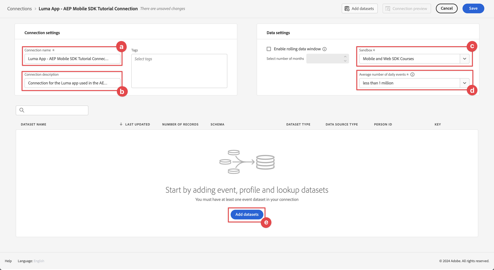
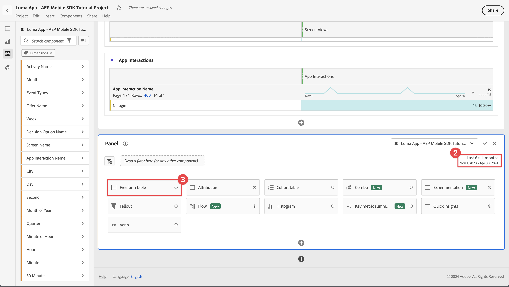

# Bericht und Analyse mithilfe von Customer Journey Analytics

Erfahren Sie, wie Sie Ihre Interaktionen mit mobilen Apps mit Customer Journey Analytics melden und analysieren können.

Die Ereignisdaten der Mobile App, die Sie in früheren Lektionen erfasst und an Platform Edge Network gesendet haben, werden an die in Ihrem Datastream konfigurierten Dienste weitergeleitet. Wenn Sie der [Daten an Experience Platform senden](platform.md) -Lektion verwenden, werden diese Daten nun als Datensätze im Data Lake von Experience Platform gespeichert. Ab diesem Zeitpunkt sind die Daten für Customer Journey Analytics zur Berichterstellung und Analyse verfügbar.

Im Gegensatz zu Adobe Analytics, Customer Journey Analytics *uses* Daten aus Datensätzen, die in Experience Platform erstellt wurden. Daten werden nicht direkt mit dem Adobe Experience Platform Mobile SDK an Customer Journey Analytics gesendet, sondern an Datensätze. Verbindungen werden dann im Customer Journey Analytics konfiguriert, um die Datensätze auszuwählen, die Sie in Ihren Berichts- und Analyseprojekten verwenden werden.

Diese Lektion im Tutorial konzentriert sich auf die Berichterstellung und Analyse der Daten, die aus der Tutorial-App &quot;Luma&quot;erfasst wurden. Eine der einzigartigen Möglichkeiten von Customer Journey Analytics besteht darin, Daten aus verschiedenen Quellen (CRM, Point-of-Sale, Treueprogramm, Callcenter) und Kanälen (Web, mobil, offline) zu kombinieren, um tiefgründige Einblicke in die Journey zu erhalten. Diese Fähigkeit geht über den Rahmen dieser Lektion hinaus. Siehe [Customer Journey Analytics - Übersicht](https://experienceleague.adobe.com/en/docs/analytics-platform/using/cja-overview/cja-overview) für weitere Informationen.

## Voraussetzungen

Ihr Unternehmen muss für Customer Journey Analytics freigeschaltet und über entsprechende Berechtigungen verfügen. Sie benötigen Administratorzugriff auf Customer Journey Analytics.

## Lernziele

In dieser Lektion werden Sie:

- Erstellen Sie eine Verbindung, um die Datensätze von Experience Platform zu definieren, die Sie im Customer Journey Analytics verwenden möchten.
- Erstellen Sie eine Datenansicht, um die Daten aus den Datensätzen für Ihre Berichterstellung und Analyse vorzubereiten.
- Erstellen Sie ein Projekt, um Berichte und Visualisierungen zu erstellen, damit Sie die Daten aus Ihrer mobilen App analysieren können.

Die Sequenz ist absichtlich. Verbindungen verwenden Datensätze, und Datenansichten verwenden Verbindungen.

## Verbindung erstellen

Eine Verbindung in Customer Journey Analytics definiert die Datensätze (und die Daten in diesen Datensätzen) von Experience Platform, die Sie für die Berichterstellung und Analyse verwenden möchten.

1. Navigieren Sie mithilfe der Apps zur Customer Journey Analytics-Oberfläche.  Menü oben rechts.

1. Auswählen **[!UICONTROL Verbindungen]** aus der oberen Menüleiste.

1. Stellen Sie sicher, dass Sie die **[!UICONTROL Liste]** in der Benutzeroberfläche &quot;Verbindungen&quot;angezeigt. Es wird eine Liste der vorhandenen Verbindungen angezeigt.

1. Auswählen **[!UICONTROL Neue Verbindung erstellen]**.

1. Im **[!UICONTROL Verbindungen]** > **[!UICONTROL Verbindung ohne Titel]** Bildschirm, in **[!UICONTROL Verbindungsparameter]**

   1. Geben Sie einen **[!UICONTROL Verbindungsname]**, beispielsweise `Luma App - AEP Mobile SDK Tutorial Connection`.
   2. Geben Sie einen **[!UICONTROL Verbindungsbeschreibung]**, beispielsweise `Connection for the Luma app used in the AEP Mobile SDK tutorial`.

      In **[!UICONTROL Dateneinstellungen]**:

   3. Wählen Sie die Sandbox aus, die Sie zum Erfassen Ihrer App-Daten verwendet haben, beispielsweise **[!UICONTROL Mobile- und Web SDK-Kurse]**.
   4. Auswählen **[!UICONTROL weniger als 1 Mio.]** aus dem **[!UICONTROL Durchschnittliche Anzahl der täglichen Ereignisse]**.

   5. Auswählen **[!UICONTROL Hinzufügen von Datensätzen]** , um die Datensätze aus der Experience Platform auszuwählen, die Sie im Customer Journey Analytics verwenden möchten.

      

   6. Im **[!UICONTROL Hinzufügen von Datensätzen]** Assistent, **[!UICONTROL Auswählen von Datensätzen]** Schritt,

      1. Wählen Sie die folgenden Datensätze aus:

         - **[!UICONTROL Ereignis-Datensatz für Luma Mobile App]**, den Datensatz, den Sie als Teil der [Datensatz erstellen](platform.md#create-a-dataset) in der Experience Platform-Lektion.
         - **[!UICONTROL ODE DecisionEvents - *Sandbox-Name*] Entscheidungsfindung**
         - **[!UICONTROL AJO-Push-Tracking-Ereignisdatensätze]**

      1. Klicken Sie auf **[!UICONTROL Weiter]**.

         

   7. Im **[!UICONTROL Hinzufügen von Datensätzen]** Assistent, **[!UICONTROL Datensatzeinstellungen]** -Schritt, müssen Sie die Details für jeden Ereignis-Datensatz definieren.
      1. Informationen zur korrekten Einrichtung finden Sie in den folgenden Tabellen:

         | Datensatz | Personen-ID Nachteile | Zeitstempel validity | Datenquellentyp - Fehler | Importieren aller neuen Daten mit | Alle vorhandenen Daten aufstocken, um alle vorhandenen Daten aufstocken |
         |---|---|---|---|---|---|
         | Ereignis-Datensatz für Luma Mobile App | identityMap | Zeitstempel | App-Daten | enable | enable |
         | ODE DecisionEvents - *Sandbox-Name* Entscheidungsfindung | identityMap | Zeitstempel | App-Daten | enable | enable |
         | Erlebnisereignisdatensatz beim AJO-Push-Tracking | identityMap | Zeitstempel | App-Daten | enable | enable |

      1. Auswählen **[!UICONTROL Hinzufügen von Datensätzen]**.

         

1. Zurück im **[!UICONTROL Verbindungen]** > **[!UICONTROL Luma App - Tutorial-Verbindung zum AEP Mobile SDK]** auswählen **[!UICONTROL Speichern]** , um Ihre Verbindung zu speichern.

   

Sie haben jetzt Ihre Verbindung definiert und Customer Journey Analytics fügt die Daten aus den Datensätzen zu seiner eigenen internen Datenbank hinzu. Diese Datenerfassung kann abhängig von der Datenmenge einige Zeit in Anspruch nehmen. Für Ihre Tutorial-App sollten Sie einige Stunden warten, bis die Daten auf dem Customer Journey Analytics angezeigt werden.

So zeigen Sie den Status Ihrer Verbindung an:

1. Auswählen **[!UICONTROL Verbindungen]** in der Hauptschnittstelle von Customer Journey Analytics.
1. Wählen Sie den Namen Ihrer Verbindung aus, beispielsweise **[!UICONTROL Luma App - Tutorial-Verbindung zum AEP Mobile SDK]**.

Im **[!UICONTROL Verbindungen]** > **[!UICONTROL Luma App - Tutorial-Verbindung zum AEP Mobile SDK]** angezeigt wird:

1. Informationen zu den hinzugefügten, übersprungenen und gelöschten Datensätzen. Wählen Sie **[!UICONTROL Alle Datensätze]** und wählen Sie einen geeigneten Zeitraum aus, um Details zu Ihrer Verbindung anzuzeigen. Sie können  , um ein Dialogfeld zur Auswahl des Zeitraums zu öffnen.
1. Informationen für einzelne Datensätze zu hinzugefügten Datensätzen, übersprungenen Datensätzen, gelöschten Datensätzen und mehr.

   

## Datenansicht erstellen

Nachdem die Datensätze aus den Datensätzen zum Customer Journey Analytics hinzugefügt wurden, können Sie eine Datenansicht erstellen, um zu definieren, über welche Komponenten der Daten Sie Berichte erstellen möchten.

Eine Datenansicht ist ein für Customer Journey Analytics spezifischer Container, mit dem Sie bestimmen können, wie Daten aus einer Verbindung interpretiert werden. Sie können Standard- und Schemafelder aus allen Datensätzen konfigurieren, die Sie in Ihrer Verbindung als Komponenten (Dimensionen, Metriken) in Analysis Workspace definiert haben.

Eine Datenansicht in Customer Journey Analytics bietet enorme Flexibilität bei der richtigen Einrichtung und Definition der Daten Ihrer Verbindung. In diesem Tutorial verwenden Sie nur die für Ihre Berichterstellung und Analyse erforderlichen Funktionen. Siehe [Datenansichten](https://experienceleague.adobe.com/en/docs/analytics-platform/using/cja-dataviews/data-views) für weitere Informationen.

So erstellen Sie Ihre Datenansicht:

1. Navigieren Sie mithilfe der Apps zur Customer Journey Analytics-Oberfläche.  Menü oben rechts.

1. Auswählen **[!UICONTROL Datenansichten]** aus der oberen Menüleiste.
1. Auswählen **[!UICONTROL Neue Datenansicht erstellen]**.
1. In **[!UICONTROL Datenansichten >]** stellen sicher, dass **[!UICONTROL Konfigurieren]** ausgewählt ist.

   1. Wählen Sie Ihre Verbindung aus der Dropdown-Liste Verbindung einstellen aus, z. B. **[!UICONTROL Luma App - Tutorial-Verbindung zum AEP Mobile SDK]**.
   1. Geben Sie einen Namen für Ihre Datenansicht ein, z. B.: `Luma App - AEP Mobile SDK Tutorial Data view`.
   1. Auswählen **[!UICONTROL Speichern und fortfahren]**.

      

1. Im **[!UICONTROL Komponenten]** des **[!UICONTROL Datenansicht der Luma App - AEP Mobile SDK-Tutorial-Anleitung für mobile Apps]** können Sie die Metriken und Dimensionen definieren, die Sie für die Berichterstellung über Ihre mobile App verwenden möchten. Standardmäßig sind mehrere Standardmetriken und -dimensionen (gemeinsam auf Komponenten verwiesen) bereits für Ihre Datenansicht konfiguriert. Ihre Datenansicht erfordert jedoch mehr Komponenten.  So fügen Sie ein Schemafeld aus Ihrem zuvor definierten Schema oder nativen Schemata hinzu (siehe [Schema erstellen](create-schema.md) Lektion) als Komponente (Dimension oder Metrik):

   1. Suchen Sie das Schemafeld:

      - Suchen Sie mithilfe der  ***[!UICONTROL Suchschemafelder]*** Suchfeld. Beispiel: `productListAdd`oder

        

      - bis zum Schemafeld in  **[!UICONTROL Ereignis-Datensätze]** .  Beispiel:  **[!UICONTROL Ereignis-Datensätze]**   **[!UICONTROL commerce]**   **[!UICONTROL productListAdds]** 

        

   1. Ziehen Sie das spezifische Schemafeld aus dem Bereich Schemafelder und legen Sie es auf der **[!UICONTROL METRIKEN]** oder **[!UICONTROL DIMENSIONEN]** in der [!UICONTROL Enthaltene Komponenten] -Bereich.

      

   1. Sie können die Einstellungen einer Komponente konfigurieren. Wählen Sie die Komponente aus und konfigurieren Sie die Einstellungen im rechten Bereich.  Sie können beispielsweise **[!UICONTROL commerce.productListAdds]** nach `Product Add To Lists` mithilfe der **[!UICONTROL KOMPONENTENEINSTELLUNGEN]** > **[!UICONTROL Komponentenname]** im rechten Bereich.

      

      Oder konfigurieren Sie **[!UICONTROL AUSSCHLIESSENDE WERTE EINSCHLIESSEN]**.

      

   1. Nachdem Sie nun wissen, wie Sie Ihrer Datenansicht Felder hinzufügen und die resultierende Komponente konfigurieren können, verwenden Sie die Tabellen unten für eine Liste von Schemafeldern, um sie als Metriken oder Dimensionen hinzuzufügen. Verwenden Sie die **Schema Path** -Spaltenwert aus der unten stehenden Tabelle, um nach dem spezifischen Schemafeld zu suchen oder es zu ihm zu durchsuchen. Nachdem Metriken und Dimensionen hinzugefügt wurden, überprüfen Sie die **Komponenteneinstellungen** Spaltenwert in der Tabelle, ob bestimmte Einstellungen für eine Komponente erforderlich sind, wie z. B. **[!UICONTROL Komponentenname]** oder definieren **[!UICONTROL AUSSCHLIESSENDE WERTE EINSCHLIESSEN]**.

      **METRIKEN**

      | Komponentenname | Datensatz | Schema-Datentyp | Schema Path | Komponenteneinstellungen |
      |---|---|---|---|---|
      | Schließen | AJO Push Tracking Erlebnis-Datensatz, Ereignis-Datensatz für Luma Mobile App | Ganzzahl | _experience.decisioning. propositionEventType.dismiss | Komponentenname: `Dismiss` |
      | Abonnement beenden | AJO Push Tracking Erlebnis-Datensatz, Ereignis-Datensatz für Luma Mobile App | Ganzzahl | _experience.decisioning. propositionEventType.unsubscribe | Komponentenname: `Unsubscribe` |
      | Auslöser | AJO Push Tracking Erlebnis-Datensatz, Ereignis-Datensatz für Luma Mobile App | Ganzzahl | _experience.decisioning. propositionEventType.Trigger | Komponentenname: `Trigger` |
      | Anzeige | AJO Push Tracking Erlebnis-Datensatz, Ereignis-Datensatz für Luma Mobile App | Ganzzahl | _experience.decisioning. propositionEventType.display | Komponentenname: `Display` |
      | Senden | AJO Push Tracking Erlebnis-Datensatz, Ereignis-Datensatz für Luma Mobile App | Ganzzahl | _experience.decisioning. propositionEventType.send | Komponentenname: `Send` |
      | Interact | AJO Push Tracking Erlebnis-Datensatz, Ereignis-Datensatz für Luma Mobile App | Ganzzahl | _experience.decisioning. propositionEventType.interact | Komponentenname: `Interact` |
      | Standortereignisse | AJO Push Tracking Experience Event Datensatz, Luma Mobile App Event Datensatz, ODE Decision Events - mobile-and-web-sdk-kurse Decisioning | Zeichenfolge | Ereignistyp | Komponentenname: `Location Events`   |
      | Produktansichten | Ereignis-Datensatz für Luma Mobile App | Double | commerce.productViews.value | Komponentenname: `Product Views` |
      | Produkt zu Listen hinzufügen | Ereignis-Datensatz für Luma Mobile App | Double | commerce.productListAdds.value | Komponentenname: `Product Add To Lists` |
      | Käufe | Ereignis-Datensatz für Luma Mobile App | Double | commerce.purchases.value | Komponentenname: `Purchases` |
      | Für später speichern | Ereignis-Datensatz für Luma Mobile App | Double | commerce.saveForLaters.value | Komponentenname: `Save For Laters` |
      | App-Interaktionen | Ereignis-Datensatz für Luma Mobile App | Double | _techmarketingdemos.appInformation. appInteraction.appAction.value | Komponentenname: `App Interactions` |
      | Bildschirmansichten | Ereignis-Datensatz für Luma Mobile App | Double | _techmarketingdemos.appInformation. appStateDetails.screenView.value | Komponentenname: `Screen Views` |

      {style="table-layout:auto"}

      >[!NOTE]
      >
      >Beachten Sie, wie das Schemafeld für die Metrik &quot;Standortereignisse&quot;verwendet **[!UICONTROL AUSSCHLIESSENDE WERTE EINSCHLIESSEN]** zum Zählen von Ereignistypen, die `location`.

      Ihre Datenansichtskonfiguration für **[!UICONTROL METRIKEN]** sollte mit unten übereinstimmen, nachdem Sie alle Schemafelder aus der obigen Tabelle als Metrikkomponente hinzugefügt haben:

      

      **DIMENSIONEN**

      | Komponentenname | Datensatz | Schema-Datentyp | Schema Path | Komponenteneinstellungen |
      |---|---|---|---|---|
      | Stadt | AJO Push Tracking Erlebnis-Datensatz, Ereignis-Datensatz für Luma Mobile App | Zeichenfolge | placeContext.geo.city | Komponentenname: `City` |
      | Ereignistypen | AJO Push Tracking Experience Event Datensatz, Luma Mobile App Event Datensatz, ODE Decision Events - mobile-and-web-sdk-kurse Decisioning | Zeichenfolge | eventType | Komponentenname: `Event Types` |
      | Name der Entscheidungsoption | AJO Push Tracking Experience Event Datensatz, Luma Mobile App Event Datensatz, ODE Decision Events - mobile-and-web-sdk-kurse Decisioning | Zeichenfolge | _experience.decisioning. propositions.items.name | Komponentenname: `Decision Option Name` |
      | App-Interaktionsname | Ereignis-Datensatz für Luma Mobile App | Zeichenfolge | _techmarketingdemos.appInformation. appInteraction.name | Komponentenname: `App Interaction Name` |
      | Bildschirmname | Ereignis-Datensatz für Luma Mobile App | Zeichenfolge | _techmarketingdemos.appInformation. appStateDetails.screenName | Komponentenname: `Screen Name` |
      | Aktivitätsname | ODE DecisioningEvents - mobile-and-web-sdk-kurse decisioning | Zeichenfolge | _experience.decisioning. propositionDetails.activity.name | Komponentenname: `Activity Name` |
      | Angebotsname | ODE DecisioningEvents - mobile-and-web-sdk-kurse decisioning | Zeichenfolge | _experience.decisioning. propositionDetails.selections.name | Komponentenname: `Offer Name` |

      {style="table-layout:auto"}

      Ihre Datenansichtskonfiguration für **[!UICONTROL DIMENSIONEN]** sollte mit unten übereinstimmen, nachdem Sie alle Schemafelder aus der obigen Tabelle als Dimensionskomponente hinzugefügt haben:

      

   1. Auswählen **[!UICONTROL Speichern und fortfahren]**.

1. Die **[!UICONTROL Einstellungen]** des **[!UICONTROL Datenansicht der Luma App - AEP Mobile SDK-Tutorial-Anleitung für mobile Apps]** ermöglicht die Konfiguration von Filtern und Sitzungseinstellungen. Für dieses Tutorial ist keine zusätzliche Konfiguration erforderlich.

   - Auswählen **[!UICONTROL Speichern und beenden]**.

Sie haben Ihre Datenansicht definiert und alles ist vorhanden, um Ihre Berichte und Visualisierungen zu erstellen.

## Projekt erstellen

Workspace-Projekte werden im Customer Journey Analytics zum Erstellen von Berichten und Visualisierungen verwendet. Es gibt viele Möglichkeiten, umfassende Berichte und ansprechende Visualisierungen zu erstellen. Dies fällt jedoch nicht in den Rahmen dieses Tutorials. Siehe [Workspace - Überblick](https://experienceleague.adobe.com/en/docs/customer-journey-analytics-learn/tutorials/analysis-workspace/workspace-projects/analysis-workspace-overview) und [Neues Projekt erstellen](https://experienceleague.adobe.com/en/docs/customer-journey-analytics-learn/tutorials/analysis-workspace/workspace-projects/build-a-new-project) für weitere Informationen.

In diesem Abschnitt der Lektion erstellen Sie ein Projekt, das Berichte und Visualisierungen zu folgenden Themen anzeigt:

- App-Nutzung: Verwendung der Informationen auf Bildschirm- und App-Interaktionen.
- Commerce: Durch die Verwendung der Commerce-Ereignisse, wie z. B. der Produktansicht, werden zum Warenkorb und zum Kauf hinzugefügt.
- Angebote: Verwendung der in der App angezeigten Angebote.
- Besuche speichern: Verwendung der (simulierten) Geofence-Ereignisse aus der App.

So erstellen Sie Ihr Projekt:

1. Navigieren Sie mithilfe der Apps zur Customer Journey Analytics-Oberfläche.  Menü oben rechts.

1. Auswählen **[!UICONTROL Arbeitsbereich]** aus der oberen Menüleiste.

1. Auswählen **[!UICONTROL Projekt erstellen]**.

   1. Auswählen **[!UICONTROL Leeres Workspace-Projekt]** aus dem Popup-Dialogfeld.

   1. Wählen Sie **[!UICONTROL Erstellen]** aus.

      

1. Sie erhalten die **[!UICONTROL Neues Projekt]** -Schnittstelle. Auf dieser Oberfläche erstellen Sie Ihre Berichte und Visualisierungen.

1. Wählen Sie den Namen des Projekts aus (**[!UICONTROL Neues Projekt]**) und geben Sie Ihren eigenen Namen für das Projekt an. Beispiel: `Luma App - AEP Mobile SDK Tutorial Project`.
   

1. Um das Projekt zu speichern, wählen Sie **[!UICONTROL Projekt]** > **[!UICONTROL Speichern]**.
   

1. Im **[!UICONTROL Speichern]** Dialogfeld, alle anderen Felder ignorieren und auswählen **[!UICONTROL Speichern]**.
   

>[!IMPORTANT]
>
>   Vergessen Sie nicht, Ihr Projekt regelmäßig zu speichern, da ansonsten Ihre Änderungen verloren gehen. Sie können Ihr Projekt schnell mit **[!UICONTROL Strg + S]** (Windows) oder **[!UICONTROL η (cmd) + s]** (macOS).

Sie haben jetzt Ihr Projekt eingerichtet. Standardmäßig wird eine Freiformtabelle bereitgestellt. Bevor Sie Komponenten hinzufügen, stellen Sie sicher, dass Ihr Freiform-Bedienfeld die richtige Datenansicht und den richtigen Zeitraum verwendet.

1. Wählen Sie Ihre Datenansicht aus der Dropdownliste aus. Beispiel: **[!UICONTROL Datenansicht der Luma App - AEP Mobile SDK-Tutorial-Anleitung für mobile Apps]**. Wenn Ihre Datenansicht nicht in der Liste angezeigt wird, wählen Sie **[!UICONTROL Alle anzeigen]** unten in der Dropdown-Liste.
   

1. Um den geeigneten Zeitraum für das Bedienfeld zu definieren, wählen Sie die Standardvorgabe aus **[!UICONTROL Diesen Monat]** Geben Sie ein benutzerdefiniertes Start- und Enddatum ein oder verwenden Sie eine **[!UICONTROL Voreinstellung]** (like **[!UICONTROL Letzte 6 volle Monate]**) und wählen Sie **[!UICONTROL Anwenden]**.
   

### App-Nutzung

Jetzt können Sie Berichte zur Verwendung der App erstellen. Sie haben den erforderlichen Code in der App hinzugefügt, um App-Interaktionen zu registrieren und herauszufinden, welche Bildschirme in der App verwendet werden (siehe [Ereignisse verfolgen](events.md) Lektion) und Sie möchten jetzt einen Bericht zu diesen Daten erstellen.

#### Bildschirmnamen

So melden Sie die in der App angezeigten Bildschirme:

1. Benennen Sie Ihre **[!UICONTROL Freiform]** Bedienfeld zu `App Usage`.

1. Benennen Sie Ihre **[!UICONTROL Freiformtabelle]** nach `Screen Names`.

1. Auswählen **[!UICONTROL Alle anzeigen]** unterhalb der **[!UICONTROL METRIKEN]** Liste.

1. Ziehen Sie die **[!UICONTROL Bildschirmansichten]** Komponente auf [!UICONTROL _Ziehen Sie eine **Metrik**hier (oder einer anderen Komponente)_)].
   
In Ihrer Freiformtabelle werden nun für jeden Tag des ausgewählten Zeitraums Bildschirmansichten angezeigt. Sie möchten jedoch die Anzahl der Bildschirmansichten für jeden der in der App verwendeten Bildschirme anzeigen.

1. So zeigen Sie **[!UICONTROL DIMENSIONEN]** Liste von Komponenten auswählen  , um die  **[!UICONTROL Metriken]** aus der Komponentenleiste.
   

1. Auswählen **[!UICONTROL Alle anzeigen]** unterhalb der **[!UICONTROL DIMENSIONEN]** Liste.

1. Ziehen Sie die **[!UICONTROL Bildschirmname]** -Komponente auf **[!UICONTROL Tag]** -Kopfzeile. Der Vorgang zeigt  **[!UICONTROL Ersetzen]** um die Ersetzung der Dimension anzugeben.
   

Ihre erste Freiformtabelle in Ihrem Bericht ist abgeschlossen.

>[!NOTE]
>
>Speichern Sie das Projekt, bevor Sie fortfahren.

#### App-Interaktionen

Als Nächstes erstellen Sie eine Freiformtabelle, in der die Interaktion der Benutzer mit der App beschrieben wird.

1. Auswählen  und aus dem Popup  , um eine neue Freiformtabelle hinzuzufügen.
   

1. Umbenennen **[!UICONTROL Freiformtabelle (2)]** nach `App Interactions`.

1. Ziehen Sie die **[!UICONTROL App-Interaktionen]** Metrik auf [!UICONTROL _Ziehen Sie eine **Metrik**hier (oder einer anderen Komponente)_)].

1. Ziehen Sie die **[!UICONTROL App-Interaktionsname]** Dimension auf der **[!UICONTROL Tag]** -Kopfzeile, um diese Dimension zu ersetzen.

Ihr zweiter Bericht ist jetzt fertig und zeigt App-Interaktionen an.

Die Informationen sind hauptsächlich deshalb begrenzt, weil Sie `MobileSDK.shared.sendAppInteractionEvent(actionName: "<actionName>")` API-Aufrufe nur auf dem Anmeldebildschirm. Wenn Sie diesen API-Aufruf in mehr Bildschirmen Ihrer App hinzufügen, wird dieser Bericht informativer.

>[!NOTE]
>
>Speichern Sie das Projekt, bevor Sie fortfahren.

### Commerce

Sie möchten nun in einem separaten Bedienfeld Berichte zu Commerce-Ereignissen erstellen, die in der App aufgetreten sind.

#### Commerce-Ereignisse

1. Auswählen  außerhalb des aktuellen [!UICONTROL App-Nutzung] um einen neuen Bereich zu erstellen.
   

1. Stellen Sie sicher, dass Sie den entsprechenden Zeitraum auswählen.

1. Auswählen  **[!UICONTROL Freiformtabelle]** , um eine neue Freiformtabelle zu erstellen.
   

1. Umbenennen **[!UICONTROL Bedienfeld]** nach `Commerce`.

1. Umbenennen **[!UICONTROL Freiformtabelle]** nach `Commerce Events`.

1. Drag &amp; Drop **[!UICONTROL Produktansichten]** Metrik auf [!UICONTROL _Ziehen Sie eine **Metrik**hier (oder einer anderen Komponente)_)].

1. Ziehen Sie die **[!UICONTROL Produkt zu Listen hinzufügen]** Metrik rechts neben dem **[!UICONTROL Produktansichten]** -Spalte, um diese Spalte in die Freiformtabelle einzufügen. Sichern **[!UICONTROL + Hinzufügen]** (blau) wird beim Einfügen der Spalte angezeigt.
   

1. Wiederholen Sie den vorherigen Schritt, um die **[!UICONTROL Für neuere speichern]** und die **[!UICONTROL Käufe]** Metrik zur Freiformtabelle hinzu.

1. Ziehen Sie die **[!UICONTROL Monat]** Dimension über der **[!UICONTROL Tag]** Dimension , um die Berichterstellung von täglich in monatlich zu ändern.

Ihr Commerce-Ereignisbericht ist abgeschlossen.

>[!NOTE]
>
>Speichern Sie das Projekt, bevor Sie fortfahren.

#### Fallout

Als Nächstes erstellen Sie eine Fallout-Visualisierung für den Commerce-Trichter, die anzeigt, wie viele Benutzer, die Produkte angesehen haben, diese Produkte zu ihrem Warenkorb hinzugefügt haben und wie viele Benutzer diese Produkte zu einem späteren Zeitpunkt gespeichert haben.

1. Auswählen  innerhalb der **[!UICONTROL Commerce]** und wählen Sie im Popup-Fenster  (Darstellung der Fallout-Visualisierung).

1. Auswählen **[!UICONTROL Produktansichten]** aus dem [!UICONTROL *Touchpoint hinzufügen*] Dropdown-Liste.
   
Alternativ können Sie die **[!UICONTROL Produktansicht]** Dimension unterhalb der **[!UICONTROL Alle Personen]** Dimension in der **[!UICONTROL Fallout]** Visualisierung.

1. Wiederholen Sie den obigen Schritt für **[!UICONTROL Produkt zu Listen hinzufügen]** und **[!UICONTROL Käufe]** Dimensionen.

Ihr Fallout-Visualisierungsbericht ist abgeschlossen.

>[!NOTE]
>
>Speichern Sie das Projekt, bevor Sie fortfahren.

### Angebote

Sie möchten Berichte dazu erstellen, wie viele Angebote und welche Angebote den Benutzern Ihrer App angezeigt werden.

#### Monatsübersicht

1. Auswählen  außerhalb des aktuellen Commerce-Bedienfelds, um ein neues Bedienfeld zu erstellen.

1. Benennen Sie die **[!UICONTROL Bedienfeld]** nach `Offers`.

1. Stellen Sie sicher, dass Sie den entsprechenden Zeitraum auswählen.

1. Auswählen  Freiformtabelle , um eine neue Freiformtabelle zu erstellen.

1. Benennen Sie die **[!UICONTROL Freiformtabelle]** nach `Monthly Overview`.

1. Ziehen Sie die **[!UICONTROL Anzeige]** Metrik auf [!UICONTROL _Ziehen Sie eine **Metrik**hier (oder einer anderen Komponente)_)].

1. Ziehen Sie die **[!UICONTROL Monat]** Dimension auf der **[!UICONTROL Tag]** -Spalte, um die Dimension zu ersetzen.

Ihre monatliche Angebotsübersicht ist abgeschlossen.

>[!NOTE]
>
>Speichern Sie das Projekt, bevor Sie fortfahren.

#### Angebote für Personen

Sie möchten auch einen Bericht erstellen, der anzeigt, welche Angebote in welchen Zahlen den Benutzern der App angezeigt wurden.

1. Auswählen  innerhalb der **[!UICONTROL Angebote]** Bedienfeld und aus dem Popup, um eine neue Freiformtabelle hinzuzufügen.

1. Umbenennen **[!UICONTROL Freiformtabelle (2)]** nach `People`.

1. Ziehen Sie die **[!UICONTROL Personen]** Metrik auf [!UICONTROL _Ziehen Sie eine **Metrik**hier (oder einer anderen Komponente)_)].

1. Ziehen Sie die **[!UICONTROL Aktivitätsname]** auf **[!UICONTROL Tag]** -Spalte, um die Dimension zu ersetzen.

1. Klicken Sie mit der rechten Maustaste auf die Zeile, um eine oder mehrere der in der Variablen [Erstellen und Anzeigen von Angeboten mit der Entscheidungsverwaltung](journey-optimizer-offers.md) Lektion. Beispiel: **[!UICONTROL Luma - Entscheidung für mobile Apps]**.

1. Wählen Sie im Kontextmenü die Option **[!UICONTROL Verteilung]** > **[!UICONTROL Dimensionen]** > **[!UICONTROL Angebotsname]**. Durch diese Auswahl wird die Dimension &quot;Aktivitätsname&quot;in Angebotsnamen unterteilt.
   

Der Bericht Angebote für Personen ist abgeschlossen.

>[!NOTE]
>
>Speichern Sie das Projekt, bevor Sie fortfahren.

### Store-Besuche

Schließlich möchten Sie Berichte zu Store-Besuchen erstellen.

1. Auswählen  außerhalb des aktuellen Bedienfelds Angebote , um ein neues Bedienfeld zu erstellen.

1. Benennen Sie die **[!UICONTROL Bedienfeld]** nach `Store Visits`.

1. Stellen Sie sicher, dass Sie den entsprechenden Zeitraum auswählen.

1. Auswählen  Freiformtabelle , um eine neue Freiformtabelle zu erstellen.

1. Umbenennen **[!UICONTROL Freiformtabelle]** nach `Store Entries / Exits Across Cities`.

1. Ziehen Sie die **[!UICONTROL Standortereignisse]** Metrik auf [!UICONTROL _Ziehen Sie eine **Metrik**hier (oder einer anderen Komponente)_)]. Der Bericht zeigt nun einen täglichen Überblick über alle Standortereignisse, die in der App aufgetreten sind. Denken Sie daran, wie Sie diese Dimension als Teil Ihrer [Datenansicht](#create-a-data-view).

1. Ziehen Sie die **[!UICONTROL Ort]** Dimension auf der **[!UICONTROL Tag]** Spaltenüberschrift, um die Dimension zu ersetzen. Der Bericht zeigt nun die Städte für die Standortereignisse an.

1. Um Geolocation-Ereignisse ohne zugehörige Städte zu entfernen, wählen Sie und von der **[!UICONTROL Suche]** Popup, ausschalten **[!UICONTROL &quot;Kein Wert&quot; einschließen]**, wählen Sie **[!UICONTROL Anwenden]**.

   

   Durch diese Aktion wird die **[!UICONTROL Kein Wert]** aus dem Bericht.

1. Wählen Sie alle Zeilen in der Tabelle aus, klicken Sie mit der rechten Maustaste darauf und wählen Sie im Kontextmenü Aufschlüsselung > Dimension > Ereignistypen aus.

Ihre Berichte zu Store-Besuchen sind abgeschlossen. Sie verfügen jetzt über einen Bericht, der zeigt, dass Benutzer sich in und außerhalb der Nähe Ihrer Speicherorte befinden (wie Sie diese Speicherorte in der [Orte](places.md) Lektion).

Beachten Sie, dass Sie Beacons verwenden können, wenn Sie wirklich über Personen berichten möchten, die Ihren Store physisch besuchen. Aber hoffentlich haben Sie das Konzept der Berichterstattung über Geolocation-Daten erfasst.

## Nächste Schritte

Sie sollten jetzt über grundlegende Kenntnisse verfügen, wie Sie Berichte und Visualisierungen über die Nutzung Ihrer App, Interaktionen und mehr mithilfe von Customer Journey Analytics erstellen können.

>[!SUCCESS]
>
>
>Vielen Dank, dass Sie Ihre Zeit investiert haben, um mehr über das Adobe Experience Platform Mobile SDK zu erfahren. Wenn Sie Fragen haben, ein allgemeines Feedback oder Vorschläge zu künftigen Inhalten teilen möchten, teilen Sie diese hier mit. [Experience League Community-Diskussionsbeitrag](https://experienceleaguecommunities.adobe.com/t5/adobe-experience-platform-data/tutorial-discussion-implement-adobe-experience-cloud-in-mobile/td-p/443796).

Weiter: **[Schlussfolgerung und nächste Schritte](conclusion.md)**
