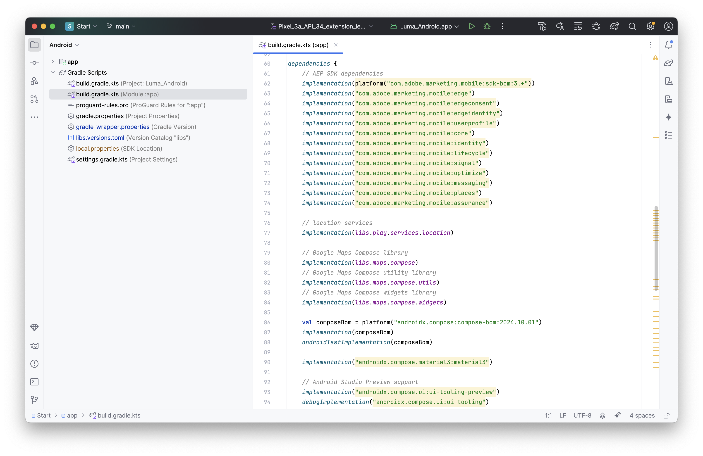

# Installieren von Adobe Experience Platform Mobile SDKs {#tutorial_install_mobile_sdks}

>[!CONTEXTUALHELP]
>
>id="platform_mobile_sdk_tutorial_install"
>title="Installieren von Adobe Experience Platform Mobile SDKs"
>abstract="Erfahren Sie, wie Sie das Adobe Experience Platform Mobile SDK in einer App implementieren."

Erfahren Sie, wie Sie das Adobe Experience Platform Mobile SDK in einer App implementieren.

## Voraussetzungen

* Eine Tag-Bibliothek mit den in der vorherigen Lektion beschriebenen Erweiterungen wurde [ erstellt](configure-tags.md).
* Datei-ID der Entwicklungsumgebung aus der [Installationsanweisungen für Mobilgeräte](configure-tags.md#generate-sdk-install-instructions).
* hat die [Beispielanwendung für iOS](https://github.com/Adobe-Marketing-Cloud/Luma-iOS-Mobile-App) oder [Beispielanwendung für Android&quot; ](https://github.com/adobe/Luma-Android).
* Erfahrung mit [Xcode](https://developer.apple.com/xcode/) (iOS) oder [Android Studio](https://developer.android.com/studio/intro?utm_source=android-studio) (Android)

## Lernziele

In dieser Lektion erfahren Sie Folgendes:

* Fügen Sie Ihrem Projekt die erforderlichen SDKs hinzu.
* Registrieren Sie die Erweiterungen.

>[!NOTE]
>
>Bei einer Implementierung von Mobile Apps *die Begriffe* und *SDKs* nahezu austauschbar.

>[!BEGINTABS]

>[!TAB iOS]

## Swift Package Manager

Anstatt CocoaPods und eine Pod-Datei zu verwenden (wie unter [Generate SDK install instructions](./configure-tags.md#generate-sdk-install-instructions) beschrieben), fügen Sie einzelne Pakete mit dem nativen Swift Package Manager von Xcode hinzu. Dem Xcode-Projekt wurden bereits alle Paketabhängigkeiten hinzugefügt. Der Bildschirm Xcode **[!UICONTROL Paketabhängigkeiten]** sollte wie folgt aussehen:

{zoomable="yes"}


In Xcode können Sie **[!UICONTROL Datei]** > **[!UICONTROL Pakete hinzufügen…]** verwenden. Die nachstehende Tabelle enthält Links zu den URLs, die Sie zum Hinzufügen von Paketen verwenden würden. Über die Links gelangen Sie zu weiteren Informationen zu den einzelnen Paketen.

| Paket | Beschreibung |
|---|---|
| [AEP Core](https://github.com/adobe/aepsdk-core-ios) | Die `AEPCore`-, `AEPServices`- und `AEPIdentity`-Erweiterungen bilden die Grundlage des Adobe Experience Platform SDKS. Jede App, die SDK verwendet, muss diese Erweiterungen enthalten. Diese Module enthalten einen gemeinsamen Satz von Funktionen und Services, die für alle SDK-Erweiterungen erforderlich sind.<br/><ul><li>`AEPCore` enthält die Implementierung des Event Hub. Der Event Hub ist der Mechanismus, der zum Bereitstellen von Ereignissen zwischen der Mobile App und der SDK verwendet wird. Der Event Hub wird auch für die Datenfreigabe zwischen Erweiterungen verwendet.</li><li>`AEPServices` bietet mehrere wiederverwendbare Implementierungen, die für die Plattformunterstützung erforderlich sind, einschließlich Netzwerk, Festplattenzugriff und Datenbankverwaltung.</li><li>`AEPIdentity` implementiert die Integration mit Adobe Experience Platform Identity Services.</li><li>`AEPSignal` stellt die Signalerweiterung der Adobe Experience Platform SDKs dar, die es Marketing-Experten ermöglicht, ein „Signal“ an ihre Apps zu senden, um Daten an externe Ziele zu senden oder URLs zu öffnen.</li><li>`AEPLifecycle` stellt die Adobe Experience Platform SDKs-Lebenszykluserweiterung dar, mit der Lebenszyklusmetriken von Anwendungen wie Informationen zur Anwendungsinstallation oder -aktualisierung, Informationen zum Anwendungsstart und zur Sitzung, Geräteinformationen und zusätzliche vom Anwendungsentwickler bereitgestellte Kontextdaten erfasst werden können.</li></ul> |
| [AEP Edge](https://github.com/adobe/aepsdk-edge-ios) | Mit der Adobe Experience Platform Edge Network Mobile-Erweiterung (`AEPEdge`) können Sie Daten von einer Mobile App an das Adobe Edge Network senden. Mit dieser Erweiterung können Sie Adobe Experience Cloud-Funktionen robuster implementieren, mehrere Adobe-Lösungen über einen Netzwerkaufruf bereitstellen und diese Informationen gleichzeitig an Adobe Experience Platform weiterleiten.<br/>Die Edge Network Mobile-Erweiterung ist eine Erweiterung für Adobe Experience Platform SDK. Die Erweiterung erfordert die `AEPCore`- und `AEPServices`-Erweiterungen für die Ereignisverarbeitung sowie die `AEPEdgeIdentity`-Erweiterung zum Abrufen der Identitäten (z. B. ECID). |
| [AEP Edge Identity](https://github.com/adobe/aepsdk-edgeidentity-ios) | Die Adobe Experience Platform Edge Identity Mobile-Erweiterung (`AEPEdgeIdentity`) ermöglicht die Verarbeitung von Benutzeridentitätsdaten aus einer Mobile App bei Verwendung der Adobe Experience Platform SDK und der Edge Network-Erweiterung. |
| [Einverständnis mit AEP Edge](https://github.com/adobe/aepsdk-edgeconsent-ios) | Die Adobe Experience Platform Consent Collection Mobile Extension (`AEPConsent`) ermöglicht die Erfassung von Einverständnisvoreinstellungen über die Mobile App bei Verwendung der Adobe Experience Platform SDK und der Edge Network-Erweiterung. |
| [AEP-Benutzerprofil](https://github.com/adobe/aepsdk-userprofile-ios) | Die Adobe Experience Platform User Profile Mobile-Erweiterung (`AEPUserProfile`) ist eine Erweiterung zur Verwaltung von Benutzerprofilen für die Adobe Experience Platform SDK. |
| [AEP Places](https://github.com/adobe/aepsdk-places-ios) | Mit der Adobe Experience Platform Places-Erweiterung (`AEPPlaces`) können Sie Geolokalisierungsereignisse verfolgen, wie sie in der Adobe Places-Benutzeroberfläche und in Datenerfassungs-Tag-Regeln von Adobe definiert sind. |
| [AEP-Nachrichten](https://github.com/adobe/aepsdk-messaging-ios) | Mit der Adobe Experience Platform Messaging-Erweiterung (`AEPMessaging`) können Sie Push-Benachrichtigungs-Token und Clickthrough-Feedback für Push-Benachrichtigungen an die Adobe Experience Platform senden. |
| [AEP Optimize](https://github.com/adobe/aepsdk-optimize-ios) | Die Adobe Experience Platform Optimize-Erweiterung (`AEPOptimize`) stellt APIs bereit, um Echtzeit-Personalisierungs-Workflows in den Adobe Experience Platform Mobile SDKs mit Adobe Target oder Adobe Journey Optimizer Offer Decisioning zu ermöglichen. Es sind `AEPCore`- und `AEPEdge`-Erweiterungen erforderlich, um Personalisierungsabfrageereignisse an Experience Edge Network zu senden. |
| [AEP Assurance](https://github.com/adobe/aepsdk-assurance-ios) | Adobe Experience Platform Assurance ist ein Produkt von Adobe Experience Cloud, mit dem Sie die Datenerfassung und die Bereitstellung von Erlebnissen in Ihrer Mobile App untersuchen, testen, simulieren und validieren können. |


## Erweiterungen importieren

Öffnen Sie in Xcode das Projekt im **[!UICONTROL Start]**-Ordner der Beispielanwendung.

Navigieren Sie in Xcode zu **[!DNL Luma]** > **[!DNL Luma]** > **[!UICONTROL AppDelegate]** und stellen Sie sicher, dass die folgenden Importe Teil dieser Quelldatei sind.

```swift
// import AEP MobileSDK libraries
import AEPCore
import AEPServices
import AEPIdentity
import AEPSignal
import AEPLifecycle
import AEPEdge
import AEPEdgeIdentity
import AEPEdgeConsent
import AEPUserProfile
import AEPPlaces
import AEPMessaging
import AEPOptimize
import AEPAssurance
```

Tun Sie dasselbe für **[!DNL Luma]** > **[!DNL Luma]** > **[!DNL Utils]** > **[!UICONTROL MobileSDK]**.

## AppDelegate aktualisieren

Navigieren Sie im Xcode-Projekt **[!DNL Luma]** Navigator zu **[!DNL Luma]** > **>** AppDelegate.

1. Ersetzen Sie den `@AppStorage` Wert `YOUR_ENVIRONMENT_ID_GOES_HERE` für `environmentFileId` durch den Wert für die Umgebungsdatei-ID, den Sie von Tags in [Installationsanweisungen für SDK generieren](configure-tags.md#generate-sdk-install-instructions) abgerufen haben.

   ```swift
   @AppStorage("environmentFileId") private var environmentFileId = "YOUR_ENVIRONMENT_ID_GOES_HERE"
   ```

1. Fügen Sie der `application(_, didFinishLaunchingWithOptions)`-Funktion den folgenden Code hinzu.

   ```swift
   // Define extensions
   let extensions = [
       AEPIdentity.Identity.self,
       Lifecycle.self,
       Signal.self,
       Edge.self,
       AEPEdgeIdentity.Identity.self,
       Consent.self,
       UserProfile.self,
       Places.self,
       Messaging.self,
       Optimize.self,
       Assurance.self
   ]
   
   // Register extensions
   MobileCore.registerExtensions(extensions, {
       // Use the environment file id assigned to this application via Adobe Experience Platform Data Collection
       Logger.aepMobileSDK.info("Luma - using mobile config: \(self.environmentFileId)")
       MobileCore.configureWith(appId: self.environmentFileId)
   
       // set this to false or comment it when deploying to TestFlight (default is false),
       // set this to true when testing on your device.
       MobileCore.updateConfigurationWith(configDict: ["messaging.useSandbox": true])
       if appState != .background {
           // only start lifecycle if the application is not in the background
           MobileCore.lifecycleStart(additionalContextData: nil)
       }
   
       // assume unknown, adapt to your needs.
       MobileCore.setPrivacyStatus(.unknown)
   })
   ```

Der obige Code bewirkt Folgendes:

1. Registriert die erforderlichen Erweiterungen.
1. Konfiguriert MobileCore und andere Erweiterungen für die Verwendung Ihrer Tag-Eigenschaftskonfiguration.
1. Aktiviert die Debug-Protokollierung. Weitere Informationen und Optionen finden Sie in der Dokumentation zu [Adobe Experience Platform Mobile SDK](https://developer.adobe.com/client-sdks/documentation/getting-started/enable-debug-logging/).
1. Startet die Lebenszyklusüberwachung. Weitere [ finden Sie ](lifecycle-data.md) Schritt „Lebenszyklus“ im Tutorial .
1. Setzt das Standard-Einverständnis auf unbekannt. Weitere [ finden Sie ](consent.md) Schritt „Einverständnis“ im Tutorial .

Stellen Sie sicher, dass Sie `MobileCore.configureWith(appId: self.environmentFileId)` mit der `appId` aktualisieren, basierend auf der `environmentFileId` aus der Tag-Umgebung, für die Sie sie erstellen (Entwicklung, Staging oder Produktion).

>[!TAB Android]

## Gradle

Wenn Sie die Abhängigkeiten aus den [Installationsanweisungen für SDK generieren](./configure-tags.md#generate-sdk-install-instructions) verwenden, um mithilfe der Integration von Gradle in Android individuelle Pakete hinzuzufügen, wurden im Android Studio-Projekt bereits alle Paketabhängigkeiten hinzugefügt.

1. Wählen Sie  als Tool aus.
1. Ansicht **[!UICONTROL Android]** auswählen.
1. Wählen Sie **[!UICONTROL Gradle scripts]** > **[!UICONTROL build.gradle.kts (Module :app)]** im linken Bereich aus. Scrollen Sie dann im rechten Bereich, bis Sie `dependencies` sehen.

   {zoomable="yes"}

In Android Studio können Sie mit **[!UICONTROL Datei]** > **[!UICONTROL Projektstruktur…]** Modulabhängigkeiten hinzufügen. Wählen Sie **[!UICONTROL Abhängigkeiten]** aus und verwenden Sie dann **[!UICONTROL Module]** , um Module hinzuzufügen. Die nachstehende Tabelle enthält Links zu den URLs, die Sie zum Hinzufügen von Abhängigkeitsmodulen verwenden würden. Über die Links gelangen Sie zu weiteren Informationen zu den einzelnen Modulen.

| package<br/>com.adobe<br/>marketing.mobile: | Beschreibung |
|---|---|
| [core](https://github.com/adobe/aepsdk-core-android) | Die `MobileCore`- und `Identity`-Erweiterungen bilden die Grundlage der Adobe Experience Platform SDK. Jede App, die SDK verwendet, muss diese enthalten. Diese Module enthalten einen gemeinsamen Satz von Funktionen und Services, die für alle SDK-Erweiterungen erforderlich sind.<ul><li>`MobileCore` enthält die Implementierung des Event Hub. Der Event Hub ist der Mechanismus, der zum Bereitstellen von Ereignissen zwischen der Mobile App und der SDK verwendet wird. Der Event Hub wird auch für die Datenfreigabe zwischen Erweiterungen verwendet und bietet mehrere wiederverwendbare Implementierungen, die für die Plattformunterstützung erforderlich sind, einschließlich Netzwerk, Festplattenzugriff und Datenbankverwaltung.</li><li>`Identity` implementiert die Integration mit Adobe Experience Platform Identity Services.</li><li>`Signal` stellt die Signalerweiterung von Adobe Experience Platform SDK dar, die es Marketing-Experten ermöglicht, ein „Signal“ an ihre Apps zu senden, um Daten an externe Ziele zu senden oder URLs zu öffnen.</li><li>`Lifecycle` stellt die Lebenszykluserweiterung von Adobe Experience Platform SDK dar, mit der Lebenszyklusmetriken von Anwendungen wie Informationen zur Anwendungsinstallation oder -aktualisierung, Informationen zum Anwendungsstart und zur Sitzung, Geräteinformationen und zusätzliche vom Anwendungsentwickler bereitgestellte Kontextdaten erfasst werden können.</li></ul> |
| [edge](https://github.com/adobe/aepsdk-edge-android) | Mit der Adobe Experience Platform Edge Network Mobile-Erweiterung (`AEPEdge`) können Sie Daten von einer Mobile App an das Adobe Edge Network senden. Mit dieser Erweiterung können Sie Adobe Experience Cloud-Funktionen robuster implementieren, mehrere Adobe-Lösungen über einen Netzwerkaufruf bereitstellen und diese Informationen gleichzeitig an Adobe Experience Platform weiterleiten.<br/>Die Edge Network Mobile-Erweiterung ist eine Erweiterung für Adobe Experience Platform SDK. Für die Ereignisbehandlung sind die Erweiterungen `Mobile Core` und `Services` erforderlich. Und die `Identity for Edge Network`-Erweiterung zum Abrufen der Identitäten, z. B. ECID. |
| [EdgeIdentity](https://github.com/adobe/aepsdk-edgeidentity-android) | Die Adobe Experience Platform Edge Identity Mobile-Erweiterung ermöglicht die Verarbeitung von Benutzeridentitätsdaten aus einer Mobile App unter Verwendung der Adobe Experience Platform SDK und der Edge Network-Erweiterung. |
| [edgeConsent](https://github.com/adobe/aepsdk-edgeconsent-android) | Die Adobe Experience Platform-Erweiterung für Mobilgeräte zur Einverständniserfassung ermöglicht die Erfassung von Einverständnisvoreinstellungen über die Mobile App bei Verwendung der Adobe Experience Platform SDK und der Edge Network-Erweiterung. |
| [userprofile](https://github.com/adobe/aepsdk-userprofile-android) | Die Adobe Experience Platform-Erweiterung Benutzerprofil für Mobilgeräte ist eine Erweiterung zur Verwaltung von Benutzerprofilen für Adobe Experience Platform SDK. |
| [aepplaces](https://github.com/adobe/aepsdk-places-android) | Adobe Places Service ist ein Standortdienst, der mobile Apps mit Standorterkennung ermöglicht. Außerdem erhalten Sie ein Verständnis des Standortkontexts durch die Verwendung umfangreicher und benutzerfreundlicher SDK-Schnittstellen sowie einer flexiblen Datenbank mit Interessensschwerpunkten (POIs). Weitere Informationen finden Sie in der Dokumentation zum Places-Service .<br/>Dieser Service ist die Places Mobile-Erweiterung für Android 2.x Adobe Experience Platform SDK und erfordert die Core-Erweiterung für die Ereignisverarbeitung. |
| [Messaging](https://github.com/adobe/aepsdk-messaging-android) | Die Adobe Experience Platform Messaging-Erweiterung ermöglicht Push-Benachrichtigungen, In-App-Nachrichten und Code-basierte Erlebnisse für Ihre Mobile Apps. Diese Erweiterung hilft Ihnen auch bei der Erfassung von Benutzer-Push-Token und verwaltet die Interaktionsmessung mit Adobe Experience Platform-Services. |
| [Optimieren](https://github.com/adobe/aepsdk-optimize-android) | Die Adobe Experience Platform Optimize-Erweiterung bietet APIs, um Echtzeit-Personalisierungs-Workflows in den Adobe Experience Platform SDKs mit Adobe Target oder Adobe Journey Optimizer Offer Decisioning zu ermöglichen. Dies hängt vom Mobile Core ab und erfordert, dass die Edge-Erweiterung Personalisierungsabfrageereignisse an Experience Edge Network sendet. |
| [Assurance](https://github.com/adobe/aepsdk-assurance-android) | Assurance (auch bekannt als Projekt Griffon) ist eine mobile Erweiterung für Adobe Experience Platform, die die Integration mit Adobe Experience Platform Assurance ermöglicht. Die Erweiterung hilft beim Überprüfen, Testen, Simulieren und Überprüfen der Art und Weise, wie Sie Daten erfassen oder Erlebnisse in Ihrer Mobile App bereitstellen. Diese Erweiterung erfordert MobileCore. |

## Erweiterungen importieren

Navigieren Sie in Android Studio zu **[!UICONTROL app]** > **[!UICONTROL kotlin+java]** > **[!UICONTROL com.adobe.luma.tutorial.android]** > **[!UICONTROL LumaApplication]** und stellen Sie sicher, dass die folgenden Importe Teil der Quelldatei sind.

```kotlin
import com.adobe.marketing.mobile.Assurance
import com.adobe.marketing.mobile.Edge
import com.adobe.marketing.mobile.Lifecycle
import com.adobe.marketing.mobile.LoggingMode
import com.adobe.marketing.mobile.Messaging
import com.adobe.marketing.mobile.MobileCore
import com.adobe.marketing.mobile.MobilePrivacyStatus
import com.adobe.marketing.mobile.Places
import com.adobe.marketing.mobile.Signal
import com.adobe.marketing.mobile.UserProfile
import com.adobe.marketing.mobile.edge.consent.Consent
import com.adobe.marketing.mobile.edge.identity.Identity
import com.adobe.marketing.mobile.optimize.Optimize
```

Tun Sie dasselbe für **[!UICONTROL app]** > **[!UICONTROL kotlin+java]** > **[!UICONTROL com.adobe.luma.tutorial.android]** > **[!UICONTROL models]** > **[!UICONTROL MobileSDK]**.


## LumaApplication aktualisieren

In der Ansicht **[!UICONTROL Android]** navigieren Sie zu **[!UICONTROL app]** > **[!UICONTROL kotlin+java]** > **[!UICONTROL com.adobe.luma.tutorial.android]** > **[!UICONTROL LumaApplication]** in Android Studio.

1. Ersetzen Sie `"YOUR_ENVIRONMENT_FILE_ID"` in `private var environmentFileId = "YOUR_ENVIRONMENT_ID_GOES_HERE"` durch den Wert für die Umgebungsdatei-ID, den Sie von Tags in [Installationsanweisungen für SDK generieren](configure-tags.md#generate-sdk-install-instructions) abgerufen haben.

   ```kotlin
   private var environmentFileId = "YOUR_ENVIRONMENT_ID_GOES_HERE"
   ```

1. Fügen Sie den folgenden Code zu `override fun onCreate()` Funktion in `class LumaApplication : Application()` hinzu.

   ```kotlin
   // Define extensions
   val extensions = listOf(
      Identity.EXTENSION,
      Lifecycle.EXTENSION,
      Signal.EXTENSION,
      Edge.EXTENSION,
      Consent.EXTENSION,
      UserProfile.EXTENSION,
      Places.EXTENSION,
      Messaging.EXTENSION,
      Optimize.EXTENSION,
      Assurance.EXTENSION
   )
   
   // Register extensions
   MobileCore.registerExtensions(extensions) {
   // Use the environment file id assigned to this application via Adobe Experience Platform Data Collection
     Log.i("Luma", "Using mobile config: $environmentFileId")
     MobileCore.configureWithAppID(environmentFileId)
   
     // set this to true when testing on your device, default is false.
     //MobileCore.updateConfiguration(mapOf("messaging.useSandbox" to true))
   
     // assume unknown, adapt to your needs.
     MobileCore.setPrivacyStatus(MobilePrivacyStatus.UNKNOWN)
   }
   ```

   Der obige Code bewirkt Folgendes:

   1. Registriert die erforderlichen Erweiterungen.
   1. Konfiguriert MobileCore und andere Erweiterungen für die Verwendung Ihrer Tag-Eigenschaftskonfiguration.
   1. Aktiviert die Debug-Protokollierung. Weitere Informationen und Optionen finden Sie in der Dokumentation zu [Adobe Experience Platform Mobile SDK](https://developer.adobe.com/client-sdks/documentation/getting-started/enable-debug-logging/).
   1. Startet die Lebenszyklusüberwachung. Weitere [ finden Sie ](lifecycle-data.md) Schritt „Lebenszyklus“ im Tutorial .
   1. Setzt das Standard-Einverständnis auf unbekannt. Weitere [ finden Sie ](consent.md) Schritt „Einverständnis“ im Tutorial .

Stellen Sie sicher, dass Sie `MobileCore.configureWith(environmentFileId)` mit der `environmentFileId` aktualisieren, basierend auf der Umgebungsdatei-ID aus der Tag-Umgebung, für die Sie sie erstellen (Entwicklung, Staging oder Produktion).


>[!ENDTABS]

>[!SUCCESS]
>
>Sie haben jetzt die erforderlichen Pakete installiert und Ihr Projekt aktualisiert, um die erforderlichen Adobe Experience Platform Mobile SDK-Erweiterungen zu registrieren, die Sie für den Rest des Tutorials verwenden werden.
>
>Vielen Dank, dass Sie sich Zeit genommen haben, um mehr über Adobe Experience Platform Mobile SDK zu erfahren. Wenn Sie Fragen haben, allgemeines Feedback geben möchten oder Vorschläge für zukünftige Inhalte haben, teilen Sie diese auf diesem [Experience League Community-Diskussionsbeitrag](https://experienceleaguecommunities.adobe.com/t5/adobe-experience-platform-data/tutorial-discussion-implement-adobe-experience-cloud-in-mobile/td-p/443796?profile.language=de)

Weiter: **[Einrichten von Assurance](assurance.md)**
