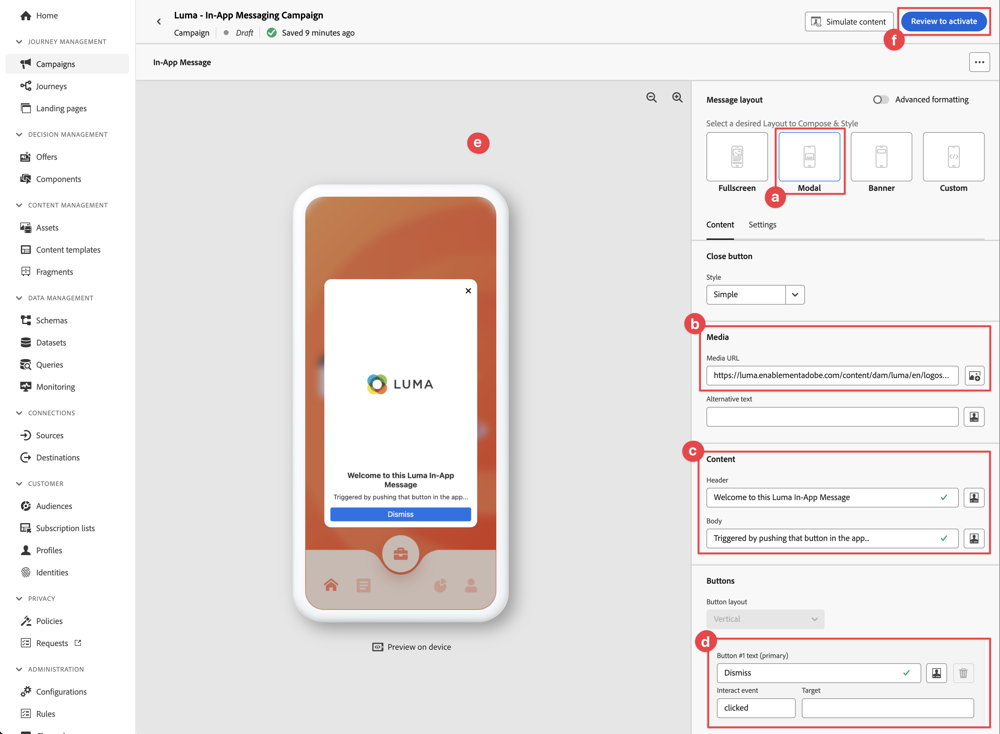

# In-App-Nachrichten erstellen und senden

Erfahren Sie, wie Sie In-App-Nachrichten für mobile Apps mit Experience Platform Mobile SDK und Journey Optimizer erstellen.

Mit Journey Optimizer können Sie Kampagnen erstellen, um In-App-Nachrichten an Zielgruppen zu senden. Kampagnen in Journey Optimizer werden verwendet, um einmalige Inhalte mithilfe verschiedener Kanäle an eine bestimmte Zielgruppe zu senden. Bei Kampagnen werden Aktionen gleichzeitig, entweder sofort oder basierend auf einem festgelegten Zeitplan ausgeführt. Bei Verwendung von Journey (siehe Lektion [Journey Optimizer-Push-Benachrichtigungen](journey-optimizer-push.md) ) werden die Aktionen nacheinander ausgeführt.


Bevor Sie In-App-Nachrichten mit Journey Optimizer senden, müssen Sie sicherstellen, dass die richtigen Konfigurationen und Integrationen vorhanden sind. Informationen zum Datenfluss von In-App-Nachrichten in Journey Optimizer finden Sie in der [Dokumentation](https://experienceleague.adobe.com/docs/journey-optimizer/using/in-app/inapp-configuration.html?lang=en).

>[!NOTE]
>
>Diese Lektion ist optional und gilt nur für Journey Optimizer-Benutzer, die In-App-Nachrichten senden möchten.


## Voraussetzungen

* App erfolgreich erstellt und ausgeführt, wobei SDKs installiert und konfiguriert sind.
* Richten Sie die App für Adobe Experience Platform ein.
* Zugriff auf Journey Optimizer und ausreichende Berechtigungen wie in [hier](https://experienceleague.adobe.com/docs/journey-optimizer/using/push/push-config/push-configuration.html) beschrieben. Außerdem benötigen Sie ausreichende Berechtigungen für die folgenden Journey Optimizer-Funktionen.
   * Verwalten Sie Kampagnen.
* Physisches iOS-Gerät oder Simulator zum Testen.


## Lernziele

In dieser Lektion werden Sie

* Erstellen Sie eine App-Oberfläche in AJO.
* Installieren und konfigurieren Sie die Journey Optimizer-Tag-Erweiterung.
* Aktualisieren Sie Ihre App, um die Journey Optimizer-Tag-Erweiterung zu registrieren.
* Validieren Sie die Einrichtung in &quot;Assurance&quot;.
* Definieren Sie Ihr eigenes Kampagnen- und In-App-Nachrichtenerlebnis in Journey Optimizer.
* Senden Sie Ihre eigene In-App-Nachricht aus der App heraus.

## Einrichten

>[!TIP]
>
>Wenn Sie Ihre Umgebung bereits im Rahmen der Lektion [Journey Optimizer-Push-Nachrichten](journey-optimizer-push.md) eingerichtet haben, haben Sie möglicherweise bereits einige der Schritte in diesem Einrichtungsabschnitt ausgeführt.


### App-Oberfläche zur Datenerfassung hinzufügen

1. Wählen Sie in der [Datenerfassungsoberfläche](https://experience.adobe.com/data-collection/) im linken Bereich die Option **[!UICONTROL App-Oberflächen]** aus.
1. Um eine Konfiguration zu erstellen, wählen Sie **[!UICONTROL App-Oberfläche erstellen]** aus.
   
1. Geben Sie einen **[!UICONTROL Namen]** für die Konfiguration ein, z. B. `Luma App Tutorial` .
1. Wählen Sie in **[!UICONTROL Mobile Application Configuration]** die Option **[!UICONTROL Apple iOS]** aus.
1. Geben Sie im Feld **[!UICONTROL App-ID (iOS Bundle ID)]** die App-Paket-ID ein. Beispiel: `com.adobe.luma.tutorial.swiftui`.
1. Wählen Sie **[!UICONTROL Speichern]** aus.

   

### Aktualisierung der Konfiguration des Datenspeichers

Um sicherzustellen, dass Daten, die von Ihrer App an das Edge Network gesendet werden, an Journey Optimizer weitergeleitet werden, aktualisieren Sie Ihre Experience Edge-Konfiguration.


1. Wählen Sie in der Datenerfassungs-Benutzeroberfläche **[!UICONTROL Datastreams]** aus und wählen Sie Ihren Datastream aus, z. B. **[!DNL Luma Mobile App]**.
1. Wählen Sie  für **[!UICONTROL Experience Platform]** und dann  **[!UICONTROL Bearbeiten]** aus dem Kontextmenü.
1. Stellen Sie im Bildschirm **[!UICONTROL Datastreams]** >  > **[!UICONTROL Adobe Experience Platform]** sicher, dass **[!UICONTROL Adobe Journey Optimizer]** ausgewählt ist. Weitere Informationen finden Sie unter [Adobe Experience Platform-Einstellungen](https://experienceleague.adobe.com/docs/experience-platform/datastreams/configure.html?lang=en#aep) .
1. Wählen Sie **[!UICONTROL Speichern]** aus, um Ihre Datastream-Konfiguration zu speichern.


   


### Journey Optimizer-Tag-Erweiterung installieren

Damit Ihre App mit Journey Optimizer verwendet werden kann, müssen Sie Ihre Tag-Eigenschaft aktualisieren.

1. Navigieren Sie zu **[!UICONTROL Tags]** > **[!UICONTROL Erweiterungen]** > **[!UICONTROL Katalog]**.
1. Öffnen Sie Ihre Eigenschaft, z. B. **[!DNL Luma Mobile App Tutorial]**.
1. Wählen Sie **[!UICONTROL Katalog]** aus.
1. Suchen Sie nach der Erweiterung **[!UICONTROL Adobe Journey Optimizer]** .
1. Installieren Sie die -Erweiterung.

Wenn *nur* In-App-Nachrichten in Ihrer App verwendet, müssen Sie in **[!UICONTROL Install Extension]** oder **[!UICONTROL Configure Extension]** nichts konfigurieren. Wenn Sie jedoch bereits die Lektion [Push-Benachrichtigungen](journey-optimizer-push.md) im Tutorial befolgt haben, sehen Sie, dass für die Umgebung **[!UICONTROL Entwicklung]** der Datensatz **[!UICONTROL AJO Push Tracking Experience Event Datensatz]** aus der Liste **[!UICONTROL Ereignisdatensatz]** ausgewählt ist.


### Implementieren von Journey Optimizer in die App

Wie in den vorherigen Lektionen erläutert, bietet die Installation einer mobilen Tag-Erweiterung nur die Konfiguration. Als Nächstes müssen Sie das Messaging SDK installieren und registrieren. Wenn diese Schritte nicht klar sind, lesen Sie den Abschnitt [SDKs installieren](install-sdks.md) .

>[!NOTE]
>
>Wenn Sie den Abschnitt [SDK installieren](install-sdks.md) abgeschlossen haben, ist das SDK bereits installiert und Sie können diesen Schritt überspringen.
>

1. Stellen Sie in Xcode sicher, dass [AEP Messaging](https://github.com/adobe/aepsdk-messaging-ios) zur Liste der Pakete in Package-Abhängigkeiten hinzugefügt wird. Siehe [Swift Package Manager](install-sdks.md#swift-package-manager).
1. Navigieren Sie im Xcode Project-Navigator zu **[!DNL Luma]** > **[!DNL Luma]** > **[!UICONTROL AppDelegate]** .
1. Stellen Sie sicher, dass `AEPMessaging` Teil Ihrer Importliste ist.

   `import AEPMessaging`

1. Stellen Sie sicher, dass `Messaging.self` Teil des Arrays von Erweiterungen ist, die Sie registrieren.

   ```swift
   let extensions = [
       AEPIdentity.Identity.self,
       Lifecycle.self,
       Signal.self,
       Edge.self,
       AEPEdgeIdentity.Identity.self,
       Consent.self,
       UserProfile.self,
       Places.self,
       Messaging.self,
       Optimize.self,
       Assurance.self
   ]
   ```


## Validieren der Einrichtung mit Assurance

1. Lesen Sie den Abschnitt [Setup instructions](assurance.md#connecting-to-a-session) , um Ihren Simulator oder Ihr Gerät mit Assurance zu verbinden.
1. Wählen Sie in der Assurance-Benutzeroberfläche **[!UICONTROL Konfigurieren]** aus.
   
1. Wählen Sie die Schaltfläche  neben **[!UICONTROL In-App-Nachrichten]**.
1. Wählen Sie **[!UICONTROL Speichern]** aus.
   
1. Wählen Sie im linken Navigationsbereich **[!UICONTROL In-App-Nachrichten]** aus.
1. Wählen Sie die Registerkarte **[!UICONTROL Validierung]** aus. Vergewissern Sie sich, dass keine Fehler auftreten.

   


## Erstellen einer eigenen In-App-Nachricht

Um eine eigene In-App-Nachricht zu erstellen, müssen Sie eine Kampagne in Journey Optimizer definieren, in der eine In-App-Nachricht auf der Grundlage der Ereignisse Trigger wird. Diese Ereignisse können:

* an Adobe Experience Platform gesendete Daten,
* Core-Tracking-Ereignisse wie Aktionen oder Status oder Erfassung von PII-Daten über die generischen Mobile Core-APIs,
* Anwendungslebenszyklusereignisse wie Start, Installation, Aktualisierung, Schließen oder Absturz,
* Geolocation-Ereignisse, z. B. das Eintreten oder Beenden eines Zielpunkts.

In diesem Tutorial verwenden Sie die generischen und erweiterungsunabhängigen Mobile Core-APIs (siehe [Mobile Core-APIs](https://developer.adobe.com/client-sdks/documentation/mobile-core/#mobile-core-generic-apis)), um die Ereignisverfolgung von Benutzerbildschirmen, Aktionen und PII-Daten zu erleichtern. Von diesen APIs generierte Ereignisse werden in den SDK-Ereignis-Hub veröffentlicht und können von Erweiterungen verwendet werden. Der SDK-Ereignis-Hub bietet die Kerndatenstruktur, die mit allen Mobile Platform SDK-Erweiterungen verknüpft ist, und verwaltet eine Liste registrierter Erweiterungen und interner Module, eine Liste registrierter Ereignis-Listener und eine freigegebene Statusdatenbank.

Der SDK-Ereignis-Hub veröffentlicht und empfängt Ereignisdaten von registrierten Erweiterungen, um die Integration mit Adobe- und Drittanbieterlösungen zu vereinfachen. Wenn beispielsweise die Optimize-Erweiterung installiert ist, werden alle Anforderungen und Interaktionen mit dem Journey Optimizer - Decision Management-Angebotsmodul vom Event Hub verarbeitet.

1. Wählen Sie in der Journey Optimizer-Benutzeroberfläche in der linken Leiste **[!UICONTROL Kampagnen]** aus.
1. Wählen Sie **[!UICONTROL Kampagne erstellen]** aus.
1. Im Bildschirm **[!UICONTROL Kampagne erstellen]** :
   1. Wählen Sie **[!UICONTROL In-App-Nachricht]** und wählen Sie eine App-Oberfläche aus der Liste **[!UICONTROL App-Oberfläche]** aus, z. B. **[!DNL Luma Mobile App]**.
   1. Wählen Sie **[!UICONTROL Erstellen]**
      
1. Geben Sie im Bildschirm &quot;Kampagnendefinition&quot;unter **[!UICONTROL Eigenschaften]** einen **[!UICONTROL Namen]** für die Kampagne ein, z. B. `Luma - In-App Messaging Campaign`, und eine **[!UICONTROL Beschreibung]**, z. B. `In-app messaging campaign for Luma app`.
   
1. Scrollen Sie nach unten zu **[!UICONTROL Aktion]** und wählen Sie **[!UICONTROL Inhalt bearbeiten]** aus.
1. Im Bildschirm **[!UICONTROL In-App-Nachricht]**:
   1. Wählen Sie **[!UICONTROL Modal]** als **[!UICONTROL Nachrichten-Layout]** aus.
   2. Geben Sie `https://luma.enablementadobe.com/content/dam/luma/en/logos/Luma_Logo.png` für die **[!UICONTROL Medien-URL]** ein.
   3. Geben Sie einen **[!UICONTROL Header]** ein, z. B. `Welcome to this Luma In-App Message`, und geben Sie einen **[!UICONTROL Hauptteil]** ein, z. B. `Triggered by pushing that button in the app...`.
   4. Geben Sie **[!UICONTROL Beenden]** als Text für Schaltfläche 1 (primär) **[!UICONTROL ein.]**
   5. Beachten Sie, wie die Vorschau aktualisiert wird.
   6. Wählen Sie **[!UICONTROL Überprüfen, um zu aktivieren]**.
      
1. Wählen Sie im Bildschirm **[!UICONTROL Überprüfung zur Aktivierung (Luma - In-App Messaging Campaign)]** die Option  in der Kachel **[!UICONTROL Plan]** aus.
   
1. Wählen Sie im Bildschirm **[!DNL Luma - In-App Messaging Campaign]** die Option  **[!UICONTROL Trigger bearbeiten]** aus.
1. Im Dialogfeld **[!UICONTROL In-App-Nachricht-Trigger]** konfigurieren Sie die Details der Verfolgungsaktion, mit der die In-App-Nachricht Trigger wird:
   1. Um das **[!UICONTROL Anwendungsstartereignis]** zu entfernen, wählen Sie  aus.
   1. Verwenden Sie wiederholt  **[!UICONTROL Add condition]** (Bedingung hinzufügen), um die folgende Logik für **[!UICONTROL Show message if]** zu erstellen.
   1. Klicken Sie auf **[!UICONTROL Fertig]**.
      

   Sie haben eine Verfolgungsaktion definiert, bei der **[!UICONTROL Aktion]** gleich `in-app` und die **[!UICONTROL Kontextdaten]** mit der Aktion ein Schlüsselwertpaar von `"showMessage" : "true"` ist.

1. Wählen Sie im Bildschirm **[!DNL Luma - In-App Messaging Campaign]** die Option **[!UICONTROL Überprüfen, um zu aktivieren]**.
1. Wählen Sie im Bildschirm **[!UICONTROL Überprüfung zur Aktivierung (Luma - In-App Messaging Campaign)]** die Option **[!UICONTROL Aktivieren]**.
1. Ihr **[!DNL Luma - In-App Messaging Campaign]** mit dem Status **[!UICONTROL Live]** wird in der Liste **[!UICONTROL Kampagnen]** angezeigt.
   


## Trigger der In-App-Nachricht

Sie verfügen über alle nötigen Ressourcen, um eine In-App-Nachricht zu senden. Es bleibt jedoch die Möglichkeit, diese In-App-Nachricht in Ihrer App Trigger.

1. Navigieren Sie im Xcode-Projektnavigator zu **[!DNL Luma]** > **[!DNL Luma]** > **[!DNL Utils]** > **[!UICONTROL MobileSDK]** . Suchen Sie die Funktion `func sendTrackAction(action: String, data: [String: Any]?)` und fügen Sie den folgenden Code hinzu, der die Funktion [`MobileCore.track`](https://developer.adobe.com/client-sdks/documentation/mobile-core/api-reference/#trackaction) basierend auf den Parametern `action` und `data` aufruft.


   ```swift
   // Send trackAction event
   MobileCore.track(action: action, data: data)
   ```

1. Wechseln Sie im Xcode Project Navigator zu **[!DNL Luma]** > **[!DNL Luma]** > **[!DNL Views]** > **[!DNL General]** > **[!UICONTROL ConfigView]** . Suchen Sie den Code für die Schaltfläche In-App-Nachricht und fügen Sie den folgenden Code hinzu:

   ```swift
   // Setting parameters and calling function to send in-app message
   Task {
       MobileSDK.shared.sendTrackAction(action: "in-app", data: ["showMessage": "true"])
   }
   ```

## Validieren mit Ihrer App

1. Erstellen Sie die App im Simulator oder auf einem physischen Gerät aus Xcode neu und führen Sie sie mit  aus.

1. Gehen Sie zur Registerkarte **[!UICONTROL Einstellungen]** .

1. Tippen Sie auf **[!UICONTROL In-App-Nachricht]**. Die In-App-Nachricht wird in Ihrer App angezeigt.

   


## Validieren der Implementierung in Assurance

Sie können Ihre In-App-Nachrichten in der Assurance-Benutzeroberfläche validieren.

1. Lesen Sie den Abschnitt [Setup instructions](assurance.md#connecting-to-a-session) , um Ihren Simulator oder Ihr Gerät mit Assurance zu verbinden.
1. Wählen Sie **[!UICONTROL In-App-Nachrichten]** aus.
1. Wählen Sie **[!UICONTROL Ereignisliste]** aus.
1. Wählen Sie einen Eintrag für **[!UICONTROL Display message]** aus.
1. Inspect das Rohereignis, insbesondere das `html`, das das vollständige Layout und den gesamten Inhalt der In-App-Nachricht enthält.
   


## Nächste Schritte

Sie sollten jetzt über alle Tools verfügen, um gegebenenfalls In-App-Nachrichten hinzuzufügen. Beispielsweise die Promotion von Produkten basierend auf bestimmten Interaktionen, die Sie in Ihrer App verfolgen.

>[!SUCCESS]
>
>Sie haben die App für In-App-Nachrichten aktiviert und eine In-App-Nachrichtenkampagne mit Journey Optimizer und der Journey Optimizer-Erweiterung für das Experience Platform Mobile SDK hinzugefügt.
>
>Vielen Dank, dass Sie Ihre Zeit investiert haben, um mehr über das Adobe Experience Platform Mobile SDK zu erfahren. Wenn Sie Fragen haben, allgemeine Rückmeldungen oder Anregungen zu zukünftigen Inhalten haben möchten, teilen Sie diese in diesem [Experience League Community-Diskussionbeitrag](https://experienceleaguecommunities.adobe.com/t5/adobe-experience-platform-data/tutorial-discussion-implement-adobe-experience-cloud-in-mobile/td-p/443796) mit.

Weiter: **[Angebote erstellen und anzeigen](journey-optimizer-offers.md)**
