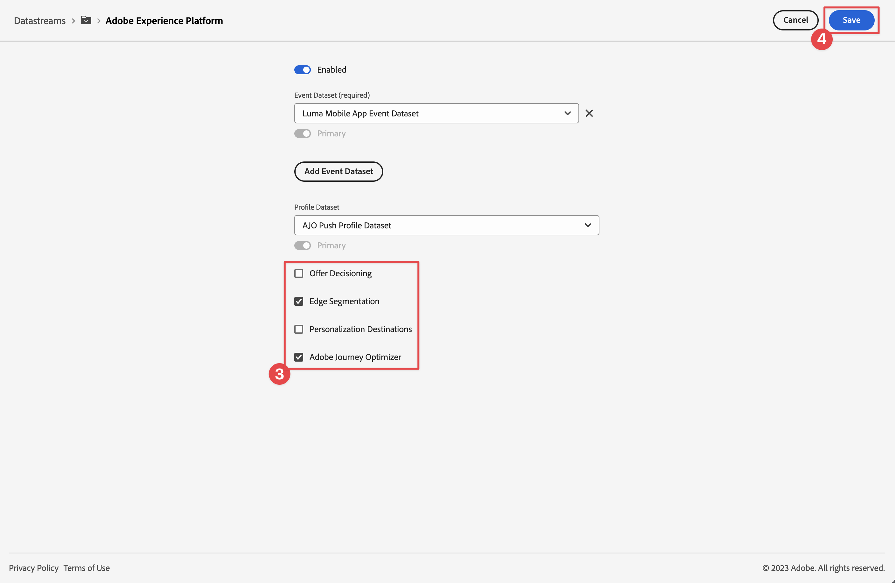

# Erstellen und Senden von In-App-Nachrichten

Erfahren Sie, wie Sie In-App-Nachrichten für Mobile Apps mit Experience Platform Mobile SDK und Journey Optimizer erstellen.

Mit Journey Optimizer können Sie Kampagnen erstellen, um In-App-Nachrichten an ausgewählte Zielgruppen zu senden. Kampagnen in Journey Optimizer werden verwendet, um einmalige Inhalte mithilfe verschiedener Kanäle für eine bestimmte Zielgruppe bereitzustellen. Bei Kampagnen werden Aktionen gleichzeitig ausgeführt, entweder sofort oder nach einem festgelegten Zeitplan. Bei Verwendung von Journey (siehe Lektion [Journey Optimizer-Push](journey-optimizer-push.md)Benachrichtigungen) werden die Aktionen nacheinander ausgeführt.

{zoomable="yes"}

Bevor Sie In-App-Nachrichten mit Journey Optimizer senden, müssen Sie sicherstellen, dass die richtigen Konfigurationen und Integrationen vorhanden sind. Informationen zum Datenfluss von In-App-Nachrichten in Journey Optimizer finden Sie in [Dokumentation](https://experienceleague.adobe.com/de/docs/journey-optimizer/using/in-app/inapp-configuration).

>[!NOTE]
>
>Diese Lektion ist optional und gilt nur für Journey Optimizer-Benutzende, die In-App-Nachrichten senden möchten.


## Voraussetzungen

* App mit installierten und konfigurierten SDKs erfolgreich erstellt und ausgeführt.
* Richten Sie die App für Adobe Experience Platform ein.
* Zugriff auf Journey Optimizer und [ausreichende Berechtigungen für Push-Benachrichtigungen](https://experienceleague.adobe.com/de/docs/journey-optimizer/using/push/push-config/push-configuration). Außerdem benötigen Sie ausreichende Berechtigungen für die folgenden Journey Optimizer-Funktionen.
   * Verwalten von Kampagnen.
* Physikalisches iOS-Gerät oder Simulator für Tests.


## Lernziele

In dieser Lektion werden Sie

* Erstellen Sie eine Kanalkonfiguration in Journey Optimizer.
* Installieren und konfigurieren Sie die Tag-Erweiterung von Journey Optimizer.
* Aktualisieren Sie Ihre App, um die Journey Optimizer-Tag-Erweiterung zu registrieren.
* Überprüfen Sie das Setup in Assurance.
* Definieren Sie Ihr eigenes Kampagnen- und In-App-Nachrichtenerlebnis in Journey Optimizer.
* Senden Sie Ihre eigene In-App-Nachricht aus der App heraus.

## Einrichten

>[!TIP]
>
>Wenn Sie Ihre Umgebung bereits im Rahmen der Lektion [Journey Optimizer-Push-Messaging](journey-optimizer-push.md) eingerichtet haben, haben Sie möglicherweise bereits einige der Schritte in diesem Setup-Abschnitt ausgeführt.


### Erstellen einer Kanalkonfiguration

Zunächst müssen Sie eine Kanalkonfiguration erstellen, damit Sie über Journey Optimizer Benachrichtigungen zu Mobile Apps senden können.

1. Öffnen Sie in der Journey Optimizer-Benutzeroberfläche das Menü **[!UICONTROL Kanäle]** > **[!UICONTROL Allgemeine Einstellungen]** > **[!UICONTROL Kanalkonfigurationen]** und wählen Sie dann **[!UICONTROL Kanalkonfiguration erstellen]**.

1. Geben Sie einen Namen und eine Beschreibung (optional) für die Konfiguration ein. Zum Beispiel `LumaInAppMessaging` und `Channel for in-app messaging`.

   >[!NOTE]
   >
   > Namen müssen mit einem Buchstaben (A–Z) beginnen. Ein Name darf nur alphanumerische Zeichen enthalten. Sie können auch die Zeichen Unterstrich `_`, Punkt `.` und Bindestrich `-` verwenden.

1. Um der Konfiguration benutzerdefinierte oder grundlegende Datennutzungs-Labels zuzuweisen, können Sie **[!UICONTROL Zugriff verwalten]** auswählen. [Erfahren Sie mehr über die Zugriffssteuerung auf Objektebene (Object Level Access Control, OLAC)](https://experienceleague.adobe.com/de/docs/journey-optimizer/using/access-control/object-based-access).

1. Wählen Sie den **In-App-Messaging** Kanal aus.

1. Wählen Sie **[!UICONTROL Marketing-Aktion]**, um mit dieser Konfiguration Einverständnisrichtlinien mit den Nachrichten zu verknüpfen. Alle mit der Marketing-Aktion verknüpften Einverständnisrichtlinien werden genutzt, um die Voreinstellungen Ihrer Kundinnen und Kunden zu berücksichtigen. [Weitere Informationen zu Marketing-Aktionen](https://experienceleague.adobe.com/de/docs/journey-optimizer/using/privacy/consent/consent#surface-marketing-actions). Beispiel: Push-Targeting.

1. Wählen Sie die Plattform aus, für die Sie die Einstellungen definieren möchten. Mit dieser Einstellung können Sie die Ziel-App für jede Plattform angeben und eine konsistente Inhaltsbereitstellung über mehrere Plattformen hinweg sicherstellen.

   >[!NOTE]
   >
   >Bei iOS- und Android-Plattformen basiert der Versand ausschließlich auf der App-ID. Wenn beide Apps dieselbe App-ID verwenden, werden Inhalte für beide bereitgestellt, unabhängig von der in der **[!UICONTROL Kanalkonfiguration“ ausgewählten Plattform]**.

1. Geben Sie die App-IDs für die Plattform ein, die Sie unterstützen möchten.

   {zoomable="yes"}

1. Klicken Sie **[!UICONTROL Senden]**, um Ihre Änderungen zu speichern.

### Aktualisieren der Datenstromkonfiguration

Aktualisieren Sie Ihre Experience Edge-Konfiguration, um sicherzustellen, dass Daten von Ihrer Mobile App an Edge Network Journey Optimizer weitergeleitet werden.


1. Wählen Sie in der Datenerfassungs-Benutzeroberfläche **[!UICONTROL Datenströme]** und wählen Sie Ihren Datenstrom aus, z. B. **[!DNL Luma Mobile App]**.
1. Wählen Sie  für **[!UICONTROL Experience Platform]** und wählen Sie  **[!UICONTROL Bearbeiten]** aus dem Kontextmenü.
1. Stellen Sie **[!UICONTROL Bildschirm]** Datenströme“ >  > **[!UICONTROL Adobe Experience Platform]** sicher, dass **[!UICONTROL Adobe Journey Optimizer]** ausgewählt ist. Weitere Informationen finden Sie unter {[}Adobe Experience Platform-Einstellungen.](https://experienceleague.adobe.com/de/docs/experience-platform/datastreams/configure)
1. Um Ihre Datenstromkonfiguration zu speichern, wählen Sie **[!UICONTROL Speichern]** aus.


   {zoomable="yes"}


### Installieren der Journey Optimizer Tags-Erweiterung

Damit Ihre App mit Journey Optimizer verwendet werden kann, müssen Sie Ihre Tag-Eigenschaft aktualisieren.

1. Navigieren Sie **[!UICONTROL Tags]** > **[!UICONTROL Erweiterungen]** > **[!UICONTROL Katalog]**.
1. Öffnen Sie die Eigenschaft, z. B. **[!DNL Luma Mobile App Tutorial]**.
1. Wählen Sie **[!UICONTROL Katalog]** aus.
1. Suchen Sie nach der Erweiterung **[!UICONTROL Adobe Journey Optimizer]**.
1. Installieren Sie die Erweiterung .

Wenn *nur* In-App-Nachrichten in Ihrer App, in **[!UICONTROL Erweiterung installieren]** oder **[!UICONTROL Erweiterung konfigurieren]**, müssen Sie nichts konfigurieren. Wenn Sie die Lektion [Push-Benachrichtigungen](journey-optimizer-push.md) im Tutorial bereits befolgt haben, sehen Sie, dass für die **[!UICONTROL Entwicklungs]**-Umgebung der **[!UICONTROL AJO Push-Tracking-Erlebnisereignis-Datensatz]** aus der Liste **[!UICONTROL Ereignisdatensatz]** ist.


### Implementieren von Journey Optimizer in der App

Wie in den vorherigen Lektionen erläutert, wird bei der Installation einer mobilen Tag-Erweiterung nur die Konfiguration bereitgestellt. Als Nächstes müssen Sie Messaging SDK installieren und registrieren. Wenn diese Schritte nicht klar sind, lesen Sie den Abschnitt [Installieren von SDKs](install-sdks.md).

>[!NOTE]
>
>Wenn Sie den Abschnitt [Installieren von SDKs](install-sdks.md) abgeschlossen haben, ist die SDK bereits installiert und Sie können diesen Schritt überspringen.
>

>[!BEGINTABS]

>[!TAB iOS]

1. Stellen Sie in Xcode sicher, dass [AEP Messaging](https://github.com/adobe/aepsdk-messaging-ios) zur Liste der Pakete in den Paketabhängigkeiten hinzugefügt wird. Siehe [Swift Package Manager](install-sdks.md#swift-package-manager).
1. Navigieren Sie im Xcode-Projekt **[!DNL Luma]** Navigator zu **[!DNL Luma]** > **[!UICONTROL >]** AppDelegate.
1. Stellen Sie sicher, dass `AEPMessaging` Teil Ihrer Importliste ist.

   `import AEPMessaging`

1. Stellen Sie sicher, dass `Messaging.self` Teil des Arrays von Erweiterungen ist, die Sie registrieren.

   ```swift
   let extensions = [
       AEPIdentity.Identity.self,
       Lifecycle.self,
       Signal.self,
       Edge.self,
       AEPEdgeIdentity.Identity.self,
       Consent.self,
       UserProfile.self,
       Places.self,
       Messaging.self,
       Optimize.self,
       Assurance.self
   ]
   ```

>[!TAB Android]

1. Stellen Sie in Android Studio sicher, dass [aepsdk-messaging-](https://github.com/adobe/aepsdk-messaging-android)android) Teil der Abhängigkeiten in **[!UICONTROL build.gradle.kts]** in **[!UICONTROL Android]**  > **[!UICONTROL Gradle Scripts]** ist. Siehe [Gradle](install-sdks.md#gradle).
1. Navigieren Sie zu **[!UICONTROL Android]**  **[!DNL app]** > **[!DNL kotlin+java]** > **[!UICONTROL com.adobe.luma.tutorial.android]** > **[!UICONTROL LumaApplication]** im Android Studio-Projektnavigator.
1. Stellen Sie sicher, dass `com.adobe.marketing.mobile.Messaging` Teil Ihrer Importliste ist.

   `import import com.adobe.marketing.mobile.Messaging`

1. Stellen Sie sicher, dass `Messaging.EXTENSION` Teil des Arrays von Erweiterungen ist, die Sie registrieren.

   ```kotlin
   val extensions = listOf(
       Identity.EXTENSION,
       Lifecycle.EXTENSION,
       Signal.EXTENSION,
       Edge.EXTENSION,
       Consent.EXTENSION,
       UserProfile.EXTENSION,
       Places.EXTENSION,
       Messaging.EXTENSION,
       Optimize.EXTENSION,
       Assurance.EXTENSION
   )
   ```

>[!ENDTABS]

## Überprüfen des Setups mit Assurance

1. Lesen Sie den Abschnitt [Setup-Anweisungen](assurance.md#connecting-to-a-session), um Ihren Simulator oder Ihr Gerät mit Assurance zu verbinden.
1. Wählen Sie in der Assurance-Benutzeroberfläche **[!UICONTROL Konfigurieren]** aus.
   {zoomable="yes"}
1. Klicken Sie auf die -Schaltfläche neben **[!UICONTROL In-App-Messaging]**.
1. Wählen Sie **[!UICONTROL Speichern]** aus.
   {zoomable="yes"}
1. Wählen Sie **[!UICONTROL In-App-]**) im linken Navigationsbereich aus.
1. Wählen Sie die **[!UICONTROL Validierung]** aus. Vergewissern Sie sich, dass Sie keine Fehler erhalten.

   {zoomable="yes"}


## Erstellen einer eigenen In-App-Nachricht

Um eine eigene In-App-Nachricht zu erstellen, müssen Sie eine Kampagne in Journey Optimizer definieren, über die Trigger eine In-App-Nachricht basierend auf eingetretenen Ereignissen erstellen. Diese Ereignisse können sein:

* Daten an Adobe Experience Platform gesendet,
* Core-Tracking-Ereignisse wie Aktion, Status oder Sammlung von personenbezogenen Daten über die generischen Mobile Core-APIs,
* Anwendungslebenszyklusereignisse wie Start, Installation, Upgrade, Schließen oder Absturz,
* Geolocation-Ereignisse, wie das Betreten oder Verlassen eines Points of Interest.

In diesem Tutorial verwenden Sie die generischen und erweiterungsunabhängigen APIs von Mobile Core (siehe [Generische Mobile Core-APIs](https://developer.adobe.com/client-sdks/documentation/mobile-core/#mobile-core-generic-apis)), um das Ereignis-Tracking von Benutzerbildschirmen, Aktionen und PII-Daten zu erleichtern. Von diesen APIs generierte Ereignisse werden im SDK Event Hub veröffentlicht und stehen Erweiterungen zur Verfügung. Der SDK Event Hub bietet die zentrale Datenstruktur, die an alle SDK-Erweiterungen von Mobile Platform gebunden ist. Der Event Hub verwaltet eine Liste registrierter Erweiterungen und interner Module, eine Liste registrierter Ereignis-Listener und eine freigegebene Statusdatenbank.

Der SDK Event Hub veröffentlicht und empfängt Ereignisdaten von registrierten Erweiterungen, um die Integration mit Adobe- und Drittanbieterlösungen zu vereinfachen. Wenn beispielsweise die Erweiterung Optimieren installiert ist, verarbeitet der Event Hub alle Anfragen und Interaktionen mit dem Angebotsmodul Journey Optimizer - Entscheidungs-Management .

1. Wählen Sie in der Journey Optimizer-Benutzeroberfläche **[!UICONTROL Kampagnen]** in der linken Leiste aus.
1. Wählen Sie **[!UICONTROL Kampagne erstellen]** aus.
1. Wählen **[!UICONTROL Dialogfeld „Kampagne erstellen]** die Option  **[!UICONTROL Geplant - Marketing]** und wählen Sie **[!UICONTROL Bestätigen]**.
1. Im Bildschirm **[!UICONTROL Kampagne - *JJJJ-MM-TT HH:MM:SS UTC+XX:XX*]**:

   1. Auf der Registerkarte **[!UICONTROL Eigenschaften]**:

      1. Geben Sie einen Namen für die Kampagne ein, z. B. `Luma Mobile In-App Campaign`.
      1. Fügen Sie optional eine Beschreibung hinzu.


   1. Wählen Sie die **[!UICONTROL Aktion]** aus.

      1. Wählen Sie unter **[!UICONTROL Meldung anzeigen, wenn]** die Option  **[!UICONTROL Aktion hinzufügen]** aus. Wählen Sie aus dem Dropdown-Menü **[!UICONTROL In-App-Nachricht]** aus.
      1. Wählen Sie im Dropdown **[!UICONTROL Menü]** Konfiguration von In-App-Nachrichten“ Ihre Konfiguration aus. Beispiel: **[!UICONTROL LumaInAppMessaging]**.
      1. Wählen Sie  **[!UICONTROL Trigger bearbeiten]** aus.
      1. Im **[!UICONTROL In-App-Nachrichten-Trigger]** Dialogfeld:

         1. Wählen Sie **[!UICONTROL Anwendungsstart]** und wählen Sie **[!UICONTROL Aktion nachverfolgen]** aus dem Dropdown-Menü aus.
         1. Wählen Sie  **[!UICONTROL Bedingung hinzufügen]**.
         1. Wählen **[!UICONTROL Aktion]** und **[!UICONTROL gleich]** aus den Dropdown-Menüs aus.
         1. `in-app` eingeben.
         1. Wählen Sie  **[!UICONTROL Bedingung hinzufügen]**.
         1. Wählen Sie **[!UICONTROL Kontextdaten]** aus dem Dropdown-Menü aus und geben Sie `showMessage` ein.
         1. Wählen **[!UICONTROL gleich]** aus dem Dropdown-Menü aus und geben Sie `true` ein.

            {zoomable="yes"}
         1. Wählen Sie **[!UICONTROL Fertig]** aus.

   1. Wählen Sie im Hauptbildschirm der Kampagnendefinition die Registerkarte **[!UICONTROL Inhalt]** aus.

      1. Aktivieren Sie **[!UICONTROL Erweiterte Formatierung]**.
      1. Wählen Sie **[!UICONTROL Modal]** als **[!UICONTROL Messaging-Layout]**. Wählen Sie im Dialogfeld **[!UICONTROL Layout wechseln]** die Option **[!UICONTROL Layout ändern]** aus.
      1. Auf der Registerkarte **[!UICONTROL Inhalt]**.
         1. Geben Sie `https://luma.enablementadobe.com/content/dam/luma/en/logos/Luma_Logo.png` für die **[!UICONTROL Medien-URL]** ein.
         1. Geben Sie einen **[!UICONTROL Header]** ein, z. B. `Welcome to this Luma In-App Message`, und geben Sie einen **[!UICONTROL Body]** ein, z. B. `Triggered by pushing that button in the app...`.

         {zoomable="yes"}

      1. Wählen Sie **[!UICONTROL Registerkarte]** Einstellungen“ aus.
         1. Wählen Sie **[!UICONTROL Größe anpassen]** in **[!UICONTROL Nachricht]** aus.
         1. Deaktivieren Sie **[!UICONTROL An Inhalt anpassen]**.
         1. Legen Sie **[!UICONTROL Höhe]** auf **[!UICONTROL 75%]** fest.

         {zoomable="yes"}

1. Wählen Sie **[!UICONTROL Zum Aktivieren überprüfen]** aus. Um optional eine der Konfigurationen für **[!UICONTROL Inhalt]**, **[!UICONTROL Eigenschaften]**, **[!UICONTROL Aktionen]** oder mehr zu bearbeiten, wählen Sie .
1. Wählen Sie **[!UICONTROL Bildschirm Zu aktivierendes *Kampagnenname*]** die Option **[!UICONTROL Aktivieren]**.
1. Nach einiger Zeit wird Ihr **_Kampagnenname_** mit Status **[!UICONTROL Live]** in der Liste **[!UICONTROL Kampagnen]**.
   {zoomable="yes"}


## Trigger der In-App-Nachricht

Sie verfügen über alle Voraussetzungen, um eine In-App-Nachricht zu senden. Übrig bleibt, wie Sie diese In-App-Nachricht in Ihrer App Trigger haben.

>[!BEGINTABS]

>[!TAB iOS]

1. Wechseln Sie zu **[!DNL Luma]** > **[!DNL Luma]** > **[!DNL Utils]** > **[!UICONTROL MobileSDK]** im Xcode-Projekt-Navigator. Suchen Sie die Funktion `func sendTrackAction(action: String, data: [String: Any]?)` und fügen Sie den folgenden Code hinzu, der die Funktion [`MobileCore.track`](https://developer.adobe.com/client-sdks/documentation/mobile-core/api-reference/#trackaction) aufruft, basierend auf den Parametern `action` und `data`.


   ```swift
   // Send trackAction event
   MobileCore.track(action: action, data: data)
   ```

1. Wechseln Sie zu **[!DNL Luma]** > **[!DNL Luma]** > **[!DNL Views]** > **[!DNL General]** > **[!UICONTROL ConfigView]** im Xcode-Projekt-Navigator. Suchen Sie den Code für die Schaltfläche In-App-Nachricht und fügen Sie den folgenden Code hinzu:

   ```swift
   // Setting parameters and calling function to send in-app message
   Task {
       MobileSDK.shared.sendTrackAction(action: "in-app", data: ["showMessage": "true"])
   }
   ```

>[!TAB Android]

1. Wechseln Sie zu **[!UICONTROL Android]**  > **[!DNL app]** > **[!DNL kotlin+java]** > **[!DNL com.adobe.luma.tutorial.android]** > **[!DNL models]** > **[!UICONTROL MobileSDK]** im Android Studio-Navigator. Suchen Sie die Funktion `fun sendTrackAction(action: String, data: Map<String, String>?)` und fügen Sie den folgenden Code hinzu, der die Funktion [`MobileCore.track`](https://developer.adobe.com/client-sdks/documentation/mobile-core/api-reference/#trackaction) aufruft, basierend auf den Parametern `action` und `data`.


   ```kotlin
   // Send trackAction event
   MobileCore.track(action, data)
   ```

1. Wechseln Sie zu **[!UICONTROL Android]**  > **[!DNL app]** > **[!DNL kotlin+java]** > **[!DNL com.adobe.luma.tutorial.androi]** > **[!DNL views]** > **[!UICONTROL ConfigView.kt]** im Android Studio-Navigator. Suchen Sie den Code für die Schaltfläche „Handler `onInAppMessageClick`&quot; und fügen Sie den folgenden Code hinzu:

   ```kotlin
   // Setting parameters and calling function to send in-app message
   MobileSDK.shared.sendTrackAction(
       "in-app",
       mapOf("showMessage" to "true")
   )
   ```

>[!ENDTABS]

## Validieren mit der App

Sie können die In-App-Nachrichten innerhalb der App selbst validieren.

>[!BEGINTABS]

>[!TAB iOS]

1. Erstellen Sie die App neu und führen Sie sie im Simulator oder auf einem physischen Gerät aus Xcode mithilfe von  aus.

1. Navigieren Sie zur Registerkarte **[!UICONTROL Einstellungen]**.

1. Tippen Sie auf **[!UICONTROL In-App-Nachricht]**. Die In-App-Nachricht wird nun in der App angezeigt.

   


>[!TAB Android]

1. Erstellen Sie die App neu und führen Sie sie im Simulator oder auf einem physischen Gerät aus Android Studio mithilfe von  aus.

1. Navigieren Sie zur Registerkarte **[!UICONTROL Einstellungen]**.

1. Tippen Sie auf **[!UICONTROL In-App-Nachricht]**. Die In-App-Nachricht wird nun in der App angezeigt.

   


>[!ENDTABS]


## Implementierung in Assurance validieren

Sie können Ihre In-App-Nachrichten über die Benutzeroberfläche von Assurance validieren.

1. Lesen Sie den Abschnitt [Setup-Anweisungen](assurance.md#connecting-to-a-session), um Ihren Simulator oder Ihr Gerät mit Assurance zu verbinden.
1. Wählen Sie **[!UICONTROL In-App-Messaging]** aus.
1. Wählen Sie **[!UICONTROL Ereignisliste]** aus.
1. Wählen Sie einen **[!UICONTROL Nachricht anzeigen]**-Eintrag aus.
1. Überprüfen Sie das Rohereignis, insbesondere das `html`, das das vollständige Layout und den Inhalt der In-App-Nachricht enthält.
   {zoomable="yes"}


## Nächste Schritte

Sie sollten jetzt über alle Tools verfügen, um ggf. In-App-Nachrichten hinzuzufügen. Beispielsweise die Förderung von Produkten basierend auf bestimmten Interaktionen, die Sie in Ihrer App verfolgen.

>[!SUCCESS]
>
>Sie haben die App für In-App-Nachrichten aktiviert und eine In-App-Nachrichtenkampagne mit Journey Optimizer und der Journey Optimizer-Erweiterung für Experience Platform Mobile SDK hinzugefügt.
>
>Vielen Dank, dass Sie sich Zeit genommen haben, um mehr über Adobe Experience Platform Mobile SDK zu erfahren. Wenn Sie Fragen haben, allgemeines Feedback geben möchten oder Vorschläge für zukünftige Inhalte haben, teilen Sie diese auf diesem [Experience League Community-Diskussionsbeitrag](https://experienceleaguecommunities.adobe.com/t5/adobe-experience-platform-data/tutorial-discussion-implement-adobe-experience-cloud-in-mobile/td-p/443796?profile.language=de).

Weiter: **[Angebote erstellen und anzeigen](journey-optimizer-offers.md)**
