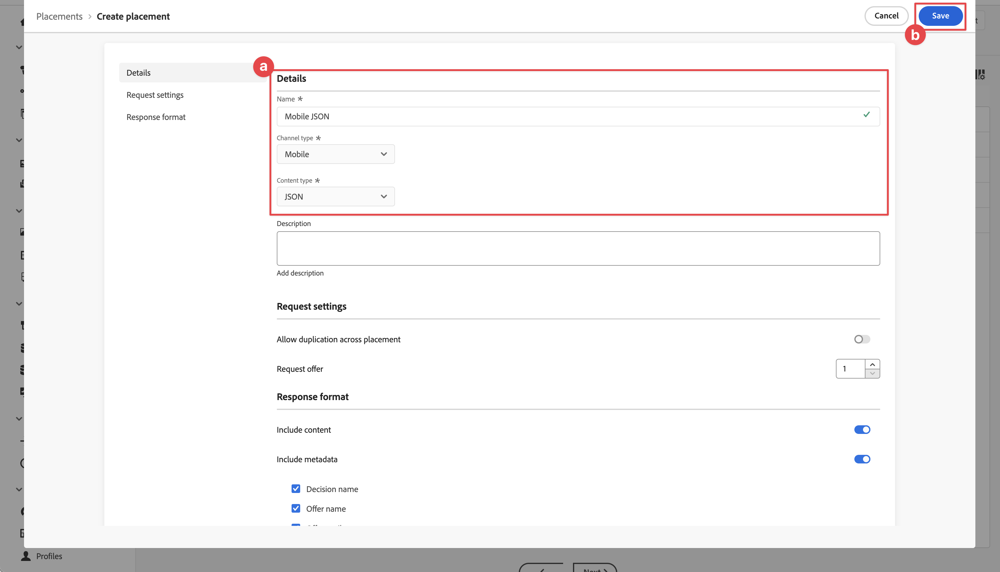
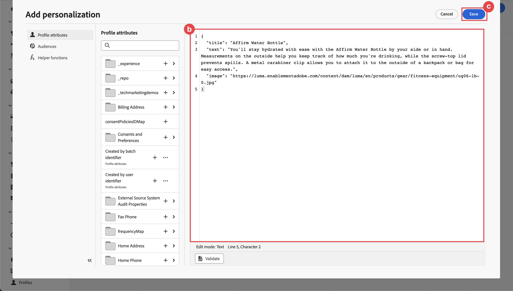
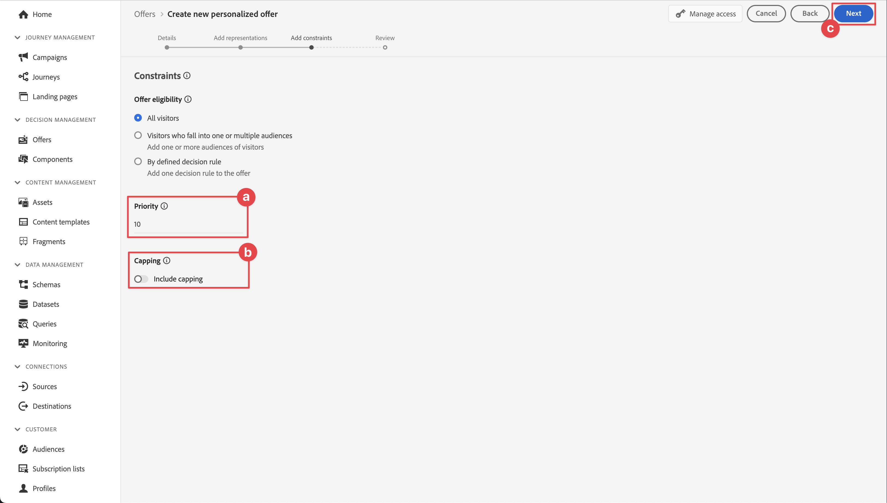

# Angebote mit Entscheidungs-Management erstellen und anzeigen

Erfahren Sie, wie Sie mit Experience Platform Mobile SDK Angebote aus dem Journey Optimizer-Entscheidungs-Management in Ihren Mobile Apps anzeigen können.

Mit dem Journey Optimizer Entscheidungs-Management können Sie Ihren Kunden über alle Touchpoints hinweg zur richtigen Zeit das beste Angebot und Erlebnis bieten. Nach der Erstellung können Sie personalisierte Angebote an Ihre Audience senden.

{zoomable="yes"}

Entscheidungs-Management erleichtert die Personalisierung durch eine zentrale Bibliothek mit Marketing-Angeboten und eine Entscheidungs-Engine, die Regeln und Einschränkungen auf die von Adobe Experience Platform erstellten Echtzeitprofile anwendet. Dadurch können Sie Ihren Kunden das richtige Angebot zum richtigen Zeitpunkt senden. Weitere Informationen [ Sie unter ](https://experienceleague.adobe.com/de/docs/journey-optimizer/using/decisioning/offer-decisioning/get-started-decision/starting-offer-decisioning)Über das Entscheidungs-Management“.


>[!NOTE]
>
>Diese Lektion ist optional und gilt nur für Journey Optimizer-Benutzende, die die Entscheidungs-Management-Funktion verwenden möchten, um Angebote in einer Mobile App anzuzeigen.


## Voraussetzungen

* App mit installierten und konfigurierten SDKs erfolgreich erstellt und ausgeführt.
* Richten Sie die App für Adobe Experience Platform ein.
* Zugriff auf Journey Optimizer - Entscheidungs-Management mit den [entsprechenden Berechtigungen zum Verwalten von Angeboten und Entscheidungen](https://experienceleague.adobe.com/de/docs/journey-optimizer/using/access-control/high-low-permissions).


## Lernziele

In dieser Lektion werden Sie

* Aktualisieren Sie Ihre Edge-Konfiguration für das Entscheidungs-Management.
* Aktualisieren Sie Ihre Tag-Eigenschaft mit der Offer Decisioning- und Target-Erweiterung.
* Schema zur Erfassung von Vorschlagsereignissen aktualisieren
* Überprüfen Sie das Setup in Assurance.
* Erstellen einer Angebotsentscheidung basierend auf Angeboten in Journey Optimizer - Entscheidungs-Management.
* Aktualisieren Sie Ihre App, um die Optimizer-Erweiterung zu registrieren.
* Implementieren Sie Angebote aus dem Entscheidungs-Management in Ihrer App.


## Einrichten

>[!TIP]
>
>Wenn Sie Ihre Umgebung bereits im Rahmen der Lektion [Einrichten von A/B-Tests mit Target](target.md) eingerichtet haben, haben Sie möglicherweise bereits einige der Schritte in diesem Abschnitt Setup ausgeführt.

### Aktualisieren der Datenstromkonfiguration

Um sicherzustellen, dass Daten, die von Ihrer Mobile App an Platform Edge Network gesendet werden, an Journey Optimizer - Entscheidungs-Management weitergeleitet werden, aktualisieren Sie Ihren Datenstrom.

1. Wählen Sie in der Datenerfassungs-Benutzeroberfläche **[!UICONTROL Datenströme]** und wählen Sie Ihren Datenstrom aus, z. B. **[!DNL Luma Mobile App]**.
1. Wählen Sie  für **[!UICONTROL Experience Platform]** und wählen Sie  **[!UICONTROL Bearbeiten]** aus dem Kontextmenü.
1. Stellen Sie sicher **[!UICONTROL dass im Bildschirm]** Datenströme > **[!UICONTROL Adobe Experience Platform]** **[!UICONTROL Offer Decisioning]**, **[!UICONTROL Edge-Segmentierung]** und **[!UICONTROL Adobe Journey Optimizer]** ausgewählt sind. Wenn Sie die Target-Lektion durchführen, wählen Sie auch &lbrace;0 **[!UICONTROL Personalization Destinations aus.]** Weitere Informationen finden Sie unter {[}Adobe Experience Platform-Einstellungen.](https://experienceleague.adobe.com/de/docs/experience-platform/datastreams/configure)
1. Um Ihre Datenstromkonfiguration zu speichern, wählen Sie **[!UICONTROL Speichern]** aus.

   {zoomable="yes"}


### Installieren der Tags-Erweiterung für Offer Decisioning und Target

1. Navigieren Sie zu **[!UICONTROL Tags]**, suchen Sie die Eigenschaft für mobile Tags und öffnen Sie sie.
1. Wählen Sie **[!UICONTROL Erweiterungen]** aus.
1. Wählen Sie **[!UICONTROL Katalog]** aus.
1. Suchen Sie nach der Erweiterung **[!UICONTROL Offer Decisioning und Target]**.
1. Installieren Sie die Erweiterung . Die Erweiterung erfordert keine zusätzliche Konfiguration.

   {zoomable="yes"}


### Schema aktualisieren

1. Navigieren Sie zur Datenerfassungs-Oberfläche und wählen Sie **[!UICONTROL Schemas]** in der linken Leiste aus.
1. Wählen **[!UICONTROL Durchsuchen]** in der oberen Leiste aus.
1. Wählen Sie Ihr Schema aus, um es zu öffnen.
1. Wählen Sie im Schema-Editor  **[!UICONTROL Hinzufügen]** neben Feldergruppen aus.
1. Suchen Sie im **[!UICONTROL Feldergruppen hinzufügen]**-Dialogfeld nach  und wählen Sie `proposition`**[!UICONTROL Erlebnisereignis - Vorschlagsinteraktionen]** und dann **[!UICONTROL Feldergruppen hinzufügen]**. Diese Feldergruppe erfasst die Erlebnisereignisdaten, die für Angebote relevant sind, z. B. welches Angebot als Teil welcher Sammlung, Entscheidung und anderer Parameter angezeigt wird (siehe weiter unten in dieser Lektion)? Aber auch was passiert mit dem Angebot? Wird sie angezeigt, interagiert, abgelehnt usw.?
   {zoomable="yes"}
1. Klicken Sie **[!UICONTROL Speichern]**, um die Änderungen an Ihrem Schema zu speichern.


## Überprüfen des Setups in Assurance

So validieren Sie das Setup in Assurance:

1. Navigieren Sie zur Assurance-Benutzeroberfläche.
1. Wählen Sie **[!UICONTROL Konfigurieren]** in der linken Leiste und wählen Sie  neben **[!UICONTROL Setup überprüfen]** unter **[!UICONTROL OFFER DECISIONING AND TARGET]**.
1. Wählen Sie **[!UICONTROL Speichern]** aus.
1. Wählen **[!UICONTROL in der]** Leiste Setup validieren aus. Sowohl die Datenstromeinrichtung als auch die SDK-Einrichtung in Ihrem Programm werden validiert.
   {zoomable="yes"}


## Platzierung erstellen

Bevor Sie tatsächlich Angebote erstellen können, müssen Sie definieren, wie und wo diese Angebote in der Mobile App platziert werden können. Im Entscheidungs-Management definieren Sie zu diesem Zweck Platzierungen und eine Platzierung für den mobilen Kanal, der eine JSON-Payload unterstützt:

1. Wählen Sie in der Benutzeroberfläche von Journey Optimizer  **[!UICONTROL Komponenten]** in **[!UICONTROL ENTSCHEIDUNGS-]** in der linken Leiste aus.

1. Wählen **[!UICONTROL Platzierungen]** in der oberen Leiste aus.

1. Wenn keine Platzierung mit dem Namen **[!UICONTROL Mobile JSON]**, **[!UICONTROL Mobile]** als **[!UICONTROL Kanaltyp]** und **[!UICONTROL JSON]** als **[!UICONTROL Inhaltstyp]** aufgeführt ist, müssen Sie eine Platzierung erstellen. Fahren Sie andernfalls mit [Angebote erstellen](#create-offers) fort.

So erstellen Sie die mobile JSON-Platzierung:

1. Wählen Sie  Platzierung erstellen aus.

   1. Geben Sie im Abschnitt **[!UICONTROL Details]** den `Mobile JSON` als **[!UICONTROL Name]** ein, wählen Sie **[!UICONTROL Mobile]** aus **[!UICONTROL Kanaltyp]** und **[!UICONTROL JSON]** aus **[!UICONTROL Content-Typ]**.
   1. Wählen **[!UICONTROL Speichern]**, um die Platzierung zu speichern.

   {zoomable="yes"}


## Erstellen der Angebote

1. Wählen Sie in der Benutzeroberfläche von Journey Optimizer  **[!UICONTROL Angebote]** in **[!UICONTROL ENTSCHEIDUNGS-]** in der linken Leiste aus.
1. Wählen Sie auf dem **[!UICONTROL Angebote]** die Option **[!UICONTROL Durchsuchen]**, um die Liste der Angebote anzuzeigen.
1. Wählen Sie **[!UICONTROL Angebot erstellen]** aus.
1. Wählen Sie im **[!UICONTROL Neues Angebot]** die Option **[!UICONTROL Personalisiertes Angebot]** und klicken Sie auf **[!UICONTROL Weiter]**.
1. Im Schritt **[!UICONTROL Details]** von **[!UICONTROL Neues personalisiertes Angebot erstellen]**:
   1. Geben Sie einen **[!UICONTROL Namen]** für das Angebot ein, z. B. `Luma - Juno Jacket`, und geben Sie ein **[!UICONTROL Startdatum und -zeit]** und ein **[!UICONTROL Enddatum und -zeit]** ein. Nur Angebote innerhalb dieser Daten werden von der Decisioning-Engine ausgewählt.
   1. Klicken Sie auf **[!UICONTROL Weiter]**.
      {zoomable="yes"}

1. Im Schritt **[!UICONTROL Darstellungen hinzufügen]** von **[!UICONTROL Neues personalisiertes Angebot erstellen]**:
   1. Wählen Sie  **[!UICONTROL Mobil]** aus der Liste **[!UICONTROL Kanal]** und wählen Sie **[!UICONTROL Mobil-JSON]** aus der Liste **[!UICONTROL Platzierung]** aus.
   1. Wählen Sie **[!UICONTROL Benutzerdefiniert]** für **[!UICONTROL Inhalt]** aus.
   1. Wählen Sie **[!UICONTROL Inhalt hinzufügen]** aus. Im Dialogfeld **[!UICONTROL Personalisierung hinzufügen]**:
      1. Ist ein [!UICONTROL Modus]-Selektor verfügbar, stellen Sie sicher, dass er auf &quot;**[!UICONTROL &quot;]**.
      1. Geben Sie die folgende JSON ein:

         ```json
         { 
             "title": "Juno Jacket",
             "text": "On colder-than-comfortable mornings, you'll love warming up in the Juno All-Ways Performance Jacket, designed to compete with wind and chill. Built-in Cocona&trade; technology aids evaporation, while a special zip placket and stand-up collar keep your neck protected.", 
             "image": "https://luma.enablementadobe.com/content/dam/luma/en/products/women/tops/jackets/wj06-purple_main.jpg" 
         }  
         ```

      1. Wählen Sie **[!UICONTROL Speichern]** aus.
         {zoomable="yes"}
   1. Klicken Sie auf **[!UICONTROL Weiter]**.
      {zoomable="yes"}

1. Im Schritt **[!UICONTROL Einschränkungen hinzufügen]** des **[!UICONTROL Neues personalisiertes Angebot erstellen]**:
   1. Legen **[!UICONTROL Priorität]** auf `10` fest.
   1. Schalten Sie **[!UICONTROL Begrenzung einschließen]** aus.
   1. Klicken Sie auf **[!UICONTROL Weiter]**.
      {zoomable="yes"}

1. Im Schritt **[!UICONTROL Überprüfen]** von **[!UICONTROL Neues personalisiertes]** erstellen:
   1. Überprüfen Sie das Angebot und wählen Sie dann **[!UICONTROL Beenden]** aus.
   1. Wählen Sie im **[!UICONTROL Angebot speichern]** die Option **[!UICONTROL Speichern und genehmigen]** aus.

1. Wiederholen Sie die Schritte 3 bis 8, um vier weitere Angebote mit unterschiedlichen Namen und Inhalten zu erstellen. Alle anderen Konfigurationswerte, z. B. Startdatum und -zeit oder Priorität, ähneln dem ersten von Ihnen erstellten Angebot. Sie können Angebote schnell duplizieren und bearbeiten.

   1. Wählen Sie in der Journey OptimizerAngebote **[!UICONTROL Angebote]** in der linken Leiste und dann Angebote in der oberen Leiste aus.
   1. Wählen Sie die Zeile des erstellten Angebots aus.
   1. Wählen Sie im rechten Bereich  **[!UICONTROL Mehr Aktionen]** und wählen Sie im Kontextmenü  **[!UICONTROL Duplizieren]**.

      Definieren Sie anhand der folgenden Tabelle die vier anderen Angebote.

      | Name des Angebots | Angebotsinhalte in JSON |
      |---|---|
      | Luma - Flasche Wasser bestätigen | `{ "title": "Affirm Water Bottle", "text": "You'll stay hydrated with ease with the Affirm Water Bottle by your side or in hand. Measurements on the outside help you keep track of how much you're drinking, while the screw-top lid prevents spills. A metal carabiner clip allows you to attach it to the outside of a backpack or bag for easy access.", "image": "https://luma.enablementadobe.com/content/dam/luma/en/products/gear/fitness-equipment/ug06-lb-0.jpg" }` |
      | Luma - Desiree Fitness-T-Shirt | `{ "title": "Desiree Fitness Tee", "text": "When you're too far to turn back, thank yourself for choosing the Desiree Fitness Tee. Its ultra-lightweight, ultra-breathable fabric wicks sweat away from your body and helps keeps you cool for the distance.", "image": "https://luma.enablementadobe.com/content/dam/luma/en/products/women/tops/tees/ws05-yellow_main.jpg" }` |
      | Luma - Adrienne Trek Jacke | `{ "title": "Adrienne Trek Jacket", "text": "You're ready for a cross-country jog or a coffee on the patio in the Adrienne Trek Jacket. Its style is unique with stand collar and drawstrings, and it fits like a jacket should.", "image": "https://luma.enablementadobe.com/content/dam/luma/en/products/women/tops/jackets/wj08-gray_main.jpg" }` |
      | Luma - Aero Daily Fitness-T-Shirt | `{ "title": "Aero Daily Fitness Tee", "text": "Need an everyday action tee that helps keep you dry? The Aero Daily Fitness Tee is made of 100% polyester wicking knit that funnels moisture away from your skin. Don't be fooled by its classic style; this tee hides premium performance technology beneath its unassuming look.", "image": "https://luma.enablementadobe.com/content/dam/luma/en/products/men/tops/tees/ms01-black_main.jpg" }` |

      {style="table-layout:fixed"}

1. Als letzten Schritt müssen Sie ein Fallback-Angebot erstellen, bei dem es sich um ein Angebot handelt, das an Kunden gesendet wird, wenn sie für andere Angebote nicht infrage kommen.
   1. Wählen Sie **[!UICONTROL Angebot erstellen]** aus.
   1. Wählen Sie **[!UICONTROL Dialogfeld]** Neues Angebot“ **[!UICONTROL Personalisiertes Angebot]** und klicken Sie auf **[!UICONTROL Weiter]**.
   1. Geben Sie im **[!UICONTROL Details]** von **[!UICONTROL Neues Fallback-Angebot erstellen]** einen **[!UICONTROL Namen]** für das Angebot ein, z. B. `Luma - Fallback Offer`, und wählen Sie **[!UICONTROL Weiter]**.

   1. Im Schritt **[!UICONTROL Darstellungen hinzufügen]** von **[!UICONTROL Neues Fallback-Angebot erstellen]**:
      1. Wählen Sie  **[!UICONTROL Mobil]** aus der Liste **[!UICONTROL Kanal]** und wählen Sie **[!UICONTROL Mobil-JSON]** aus der Liste **[!UICONTROL Platzierung]** aus.
      1. Wählen Sie **[!UICONTROL Benutzerdefiniert]** für **[!UICONTROL Inhalt]** aus.
      1. Wählen Sie **[!UICONTROL Inhalt hinzufügen]** aus.
      1. Geben Sie im Dialogfeld **[!UICONTROL Personalisierung hinzufügen]** die folgende JSON ein und wählen Sie **[!UICONTROL Speichern]**:

         ```json
         {  
            "title": "Luma",
            "text": "Your store for sports wear and equipment.", 
            "image": "https://luma.enablementadobe.com/content/dam/luma/en/logos/Luma_Logo.png" 
         }  
         ```

      1. Klicken Sie auf **[!UICONTROL Weiter]**.


1. Im Schritt **[!UICONTROL Überprüfen]** von **[!UICONTROL Neues Fallback erstellen]** Angebot:
   1. Überprüfen Sie das Angebot und wählen Sie dann **[!UICONTROL Beenden]** aus.
   1. Wählen Sie im **[!UICONTROL Angebot speichern]** die Option **[!UICONTROL Speichern und genehmigen]** aus.

Sie sollten jetzt über die folgende Liste von Angeboten verfügen:
{zoomable="yes"}


## Erstellen einer Sammlung

Um Ihrem Mobile-App-Benutzer ein Angebot zu unterbreiten, müssen Sie eine Angebotssammlung definieren, die aus einem oder mehreren der von Ihnen erstellten Angebote besteht.

1. Wählen Sie in der Journey Optimizer-Benutzeroberfläche **[!UICONTROL Angebote]** in der linken Leiste aus.
1. Wählen **[!UICONTROL Sammlungen]** in der oberen Leiste aus.
1. Wählen Sie  **[!UICONTROL Sammlung erstellen]** aus.
1. Geben Sie im Dialogfeld **[!UICONTROL Neue Sammlung]** einen **[!UICONTROL Namen]** für Ihre Sammlung ein, z. B. `Luma - Mobile App Collection`, wählen Sie **[!UICONTROL Statische Sammlung erstellen]** und klicken Sie auf **[!UICONTROL Weiter]**.
1. Wählen Sie **[!DNL Luma - Mobile App Collection]** die Angebote aus, die Sie in die Sammlung aufnehmen möchten. Wählen Sie für dieses Tutorial die fünf von Ihnen erstellten Angebote aus. Sie können die Liste einfach mithilfe des Suchfelds filtern, indem Sie z. B. **[!DNL Luma]** eingeben.
1. Wählen Sie **[!UICONTROL Speichern]** aus.

   {zoomable="yes"}


## Eine Entscheidung erstellen

Der letzte Schritt besteht darin, eine Entscheidung zu definieren, bei der es sich um die Kombination aus einem oder mehreren Entscheidungsumfängen und Ihrem Fallback-Angebot handelt.

Ein Entscheidungsumfang ist eine Kombination aus einer bestimmten Platzierung (z. B. HTML in einer E-Mail oder JSON in einer Mobile App) und einem oder mehreren Auswertungskriterien.

Ein Bewertungskriterium ist die Kombination aus

* eine Angebotssammlung,
* Eignungsregeln: Ist das Angebot beispielsweise nur für eine bestimmte Zielgruppe verfügbar,
* eine Ranking-Methode: Wenn mehrere Angebote zur Auswahl verfügbar sind, nach welcher Methode werden sie sortiert (z. B. nach Angebotspriorität, mithilfe einer Formel oder eines KI-Modells)?

Siehe [Wichtige Schritte zum Erstellen und Verwalten von ](https://experienceleague.adobe.com/de/docs/journey-optimizer/using/decisioning/offer-decisioning/get-started-decision/key-steps)), wenn Sie verstehen möchten, wie Platzierungen, Regeln, Rankings, Angebote, Darstellungen, Sammlungen, Entscheidungen usw. interagieren und miteinander in Beziehung stehen. Diese Lektion konzentriert sich ausschließlich auf die Verwendung der Ausgabe einer Entscheidung und nicht auf die Flexibilität bei der Definition von Entscheidungen innerhalb von Journey Optimizer - Entscheidungs-Management.

1. Wählen Sie in der Journey Optimizer-Benutzeroberfläche **[!UICONTROL Angebote]** in der linken Leiste aus.
1. Wählen Sie **[!UICONTROL Entscheidungen]** in der oberen Leiste aus.
1. Wählen Sie  **[!UICONTROL Entscheidung erstellen]** aus.
1. Im Schritt **[!UICONTROL Details]** von **[!UICONTROL Neue Angebotsentscheidung erstellen]**:
   1. Geben Sie einen **[!UICONTROL Namen]** für die Entscheidung ein, z. B. `Luma - Mobile App Decision`, geben Sie **[!UICONTROL Startdatum und -zeit]** und **[!UICONTROL Enddatum und -zeit]** ein.
   1. Klicken Sie auf **[!UICONTROL Weiter]**.

1. Im **[!UICONTROL Entscheidungsumfänge hinzufügen]** von **[!UICONTROL Neue Angebotsentscheidung erstellen]**:
   1. Wählen Sie **[!UICONTROL Mobile JSON]** in der Liste **[!UICONTROL Platzierung]** aus.
   1. Wählen **[!UICONTROL in der Kachel]** Auswertungskriterien“  **[!UICONTROL Hinzufügen]** aus.
      1. Wählen **[!UICONTROL im Dialogfeld &quot;]** hinzufügen“ Ihre Angebotssammlung aus. Beispiel: **[!DNL Luma - Mobile App Collection]**.
      1. Wählen Sie **[!UICONTROL Hinzufügen]** aus.

         {zoomable="yes"}

   1. Stellen Sie sicher **[!UICONTROL dass]** Keine“ für **[!UICONTROL Eignung]** und **[!UICONTROL Angebotspriorität]** als **[!UICONTROL ausgewählt ist]**.
   1. Klicken Sie auf **[!UICONTROL Weiter]**.

      {zoomable="yes"}

1. Im Schritt **[!UICONTROL Fallback-Angebot hinzufügen]** von **[!UICONTROL Neue Angebotsentscheidung erstellen]**:
   1. Wählen Sie Ihr Fallback-Angebot aus, z. B. die **[!DNL Luma - Fallback offer]**.
   1. Klicken Sie auf **[!UICONTROL Weiter]**.
1. Im Schritt **[!UICONTROL Zusammenfassung]** von **[!UICONTROL Neue Angebotsentscheidung erstellen]**:
   1. Wählen Sie **[!UICONTROL Beenden]** aus.
   1. Wählen Sie im **[!UICONTROL Angebotsentscheidung speichern]** die Option **[!UICONTROL Speichern und aktivieren]**.
   1. Auf der Registerkarte **[!UICONTROL Entscheidungen]** wird Ihre Entscheidung mit dem Status **[!UICONTROL Live]** angezeigt.

Ihre Angebotsentscheidung, die aus einer Reihe von Angeboten besteht, ist jetzt einsatzbereit. Um die Entscheidung in Ihrer App zu verwenden, müssen Sie in Ihrem Code auf den Entscheidungsumfang verweisen.

1. Wählen Sie in der Journey Optimizer-Benutzeroberfläche **[!UICONTROL Angebote]**.
1. Wählen Sie **[!UICONTROL Entscheidungen]** in der oberen Leiste aus.
1. Wählen Sie Ihre Entscheidung aus, z. B. **[!DNL Luma - Mobile App Decision]**.
1. Wählen **[!UICONTROL in der Kachel]** Entscheidungsumfänge“ die Option  **[!UICONTROL Kopieren]**.
1. Wählen Sie im Kontextmenü die Option **[!UICONTROL Entscheidungsumfang]** aus.

   {zoomable="yes"}

1. Verwenden Sie einen beliebigen Texteditor, um den Entscheidungsumfang zur späteren Verwendung einzufügen. Der Entscheidungsumfang hat das folgende JSON-Format.

   ```json
   {
       "xdm:activityId":"xcore:offer-activity:xxxxxxxxxxxxxxx",
       "xdm:placementId":"xcore:offer-placement:xxxxxxxxxxxxxxx"
   }
   ```

## Implementieren von Angeboten in Ihrer App

Wie in den vorherigen Lektionen erläutert, wird bei der Installation einer mobilen Tag-Erweiterung nur die Konfiguration bereitgestellt. Als Nächstes müssen Sie die Optimize SDK installieren und registrieren. Wenn diese Schritte nicht klar sind, lesen Sie den Abschnitt [Installieren von SDKs](install-sdks.md).

>[!NOTE]
>
>Wenn Sie den Abschnitt [Installieren von SDKs](install-sdks.md) abgeschlossen haben, ist die SDK bereits installiert und Sie können diesen Schritt überspringen.
>

>[!BEGINTABS]

>[!TAB iOS]

1. Stellen Sie in Xcode sicher, dass [AEP Optimize](https://github.com/adobe/aepsdk-messaging-ios) zur Liste der Pakete in den Paketabhängigkeiten hinzugefügt wird. Siehe [Swift Package Manager](install-sdks.md#swift-package-manager).
1. Navigieren Sie im Xcode-Projekt **[!DNL Luma]** Navigator zu **[!DNL Luma]** > **[!UICONTROL >]** AppDelegate.
1. Stellen Sie sicher, dass `AEPOptimize` Teil Ihrer Importliste ist.

   ```swift
   import AEPOptimize
   ```

1. Stellen Sie sicher, dass `Optimize.self` Teil des Arrays von Erweiterungen ist, die Sie registrieren.

   ```swift
   let extensions = [
       AEPIdentity.Identity.self,
       Lifecycle.self,
       Signal.self,
       Edge.self,
       AEPEdgeIdentity.Identity.self,
       Consent.self,
       UserProfile.self,
       Places.self,
       Messaging.self,
       Optimize.self,
       Assurance.self
   ]
   ```

1. Navigieren Sie im Xcode-Projekt-Navigator zu **[!DNL Luma]** > **[!DNL Luma]** > **[!DNL Model]** > **[!DNL Data]** **[!UICONTROL Entscheidungen]**. Aktualisieren Sie die `activityId`- und `placementId` mit den Details zum Entscheidungsumfang , die Sie aus der Journey Optimizer-Oberfläche kopiert haben.

1. Navigieren Sie im Xcode-Projekt **[!DNL Luma]** Navigator zu **[!DNL Luma]** > **[!DNL Utils]** > **[!UICONTROL >]** MobileSDK“. Suchen Sie die `func updatePropositionOD(ecid: String, activityId: String, placementId: String, itemCount: Int) async`. Fügen Sie den folgenden Code hinzu:

   ```swift
   // set up the XDM dictionary, define decision scope and call update proposition API
   Task {
      let ecid = ["ECID" : ["id" : ecid, "primary" : true] as [String : Any]]
      let identityMap = ["identityMap" : ecid]
      let xdmData = ["xdm" : identityMap]
      let decisionScope = DecisionScope(activityId: activityId, placementId: placementId, itemCount: UInt(itemCount))
      Optimize.clearCachedPropositions()
      Optimize.updatePropositions(for: [decisionScope], withXdm: xdmData) { data, error in
            if let error = error {
               Logger.aepMobileSDK.error("MobileSDK - updatePropositionsAT: Error updating propositions: \(error.localizedDescription)")
            }
      }
   }
   ```

   Diese Funktion:

   * richtet eine XDM-`xdmData` ein, die die ECID enthält, um das Profil zu identifizieren, für das Sie Angebote unterbreiten müssen.
   * definiert `decisionScope`, ein Objekt, das auf der von Ihnen in der Benutzeroberfläche von Journey Optimizer - Entscheidungs-Management definierten Entscheidung basiert und mithilfe des kopierten Entscheidungsumfangs aus [Entscheidung erstellen“ definiert ](#create-a-decision).  Die Luma-App verwendet eine Konfigurationsdatei (`decisions.json`), die die Bereichsparameter basierend auf dem folgenden JSON-Format abruft:

     ```json
     "scopes": [
         {
             "name": "name of the scope",
             "activityId": "xcore:offer-activity:xxxxxxxxxxxxxxx",
             "placementId": "xcore:offer-placement:xxxxxxxxxxxxxxx",
             "itemCount": 2
         }
     ]
     ```

     Sie können jedoch jede Art von Implementierung verwenden, um sicherzustellen, dass die Optimieren-APIs die richtigen Parameter (`activityId`, `placementId` und `itemCount`) erhalten, um ein gültiges [`DecisionScope`](https://developer.adobe.com/client-sdks/documentation/adobe-journey-optimizer-decisioning/api-reference/#decisionscope) für Ihre Implementierung zu erstellen. <br/>Zu Ihrer Information: Die anderen Schlüsselwerte in der `decisions.json`-Datei sind für die zukünftige Verwendung vorgesehen und sind nicht relevant und werden derzeit in dieser Lektion und als Teil des Tutorials verwendet.

   * ruft zwei APIs auf: [`Optimize.clearCachePropositions`](https://developer.adobe.com/client-sdks/edge/adobe-journey-optimizer-decisioning/api-reference/#clearpropositions) und [`Optimize.updatePropositions`](https://developer.adobe.com/client-sdks/edge/adobe-journey-optimizer-decisioning/api-reference/#updatepropositionswithcompletionhandler).  Diese Funktionen löschen alle zwischengespeicherten Vorschläge und aktualisieren die Vorschläge für dieses Profil.

1. Navigieren Sie im Xcode-Projekt-Navigator zu **[!DNL Luma]** > **[!DNL Luma]** > **[!DNL Views]** > {**[!UICONTROL }Personalization>]** EdgeOffersView **[!UICONTROL .]** Suchen Sie die Funktion `func onPropositionsUpdateOD(activityId: String, placementId: String, itemCount: Int) async` und überprüfen Sie den Code dieser Funktion. Der wichtigste Teil dieser Funktion ist der [`Optimize.onPropositionsUpdate`](https://developer.adobe.com/client-sdks/documentation/adobe-journey-optimizer-decisioning/api-reference/#onpropositionsupdate)-API-Aufruf, der

   * ruft die Vorschläge für das aktuelle Profil basierend auf dem Entscheidungsumfang ab (den Sie unter Journey Optimizer - Entscheidungs-Management definiert haben),
   * das Angebot aus dem Vorschlag abruft,
   * den Inhalt des Angebots entpackt, damit es ordnungsgemäß in der App angezeigt werden kann, und
   * Trigger : Die `displayed()` für das Angebot, das ein Ereignis zurück an Edge Network sendet, das darüber informiert, dass das Angebot angezeigt wird.

1. Fügen Sie in **[!DNL EdgeOffersView]** den folgenden Code zum Modifikator `.onFirstAppear` hinzu. Dieser Code stellt sicher, dass der Callback zum Aktualisieren der Angebote nur einmal registriert wird.

   ```swift
   // Invoke callback for offer updates
   Task {
       await self.onPropositionsUpdateOD(activityId: decision.activityId, placementId: decision.placementId, itemCount: decision.itemCount)
   }
   ```

1. Fügen Sie **[!UICONTROL EdgeOffersView]** noch den folgenden Code zum Modifikator `.task` hinzu. Dieser Code aktualisiert die Angebote, wenn die Ansicht aktualisiert wird.

   ```swift
   // Clear and update offers
   await self.updatePropositionsOD(ecid: currentEcid, activityId: decision.activityId, placementId: decision.placementId, itemCount: decision.itemCount)
   ```

>[!TAB Android]


1. Stellen Sie in Android Studio sicher, dass [aepsdk-optimize-](https://github.com/adobe/aepsdk-optimize-android)android) Teil der Abhängigkeiten in **[!UICONTROL build.gradle.kts (Module :app)]** in **[!UICONTROL Android]**  > **[!UICONTROL Gradle Scripts]** ist. Siehe [Gradle](install-sdks.md#gradle).
1. Navigieren Sie zu **[!UICONTROL Android]**  > **[!DNL app]** > **[!DNL kotlin+java]** > **[!UICONTROL com.adobe.luma.tutorial.android]** > **[!UICONTROL MainActivity]** im Android Studio-Navigator.
1. Stellen Sie sicher, dass `Optimize` Teil Ihrer Importliste ist.

   ```kotlin
   import com.adobe.marketing.mobile.optimize.Optimize
   ```

1. Stellen Sie sicher, dass `Optimize.EXTENSION` Teil des Arrays von Erweiterungen ist, die Sie registrieren.

   ```kotlin
   val extensions = listOf(
      Identity.EXTENSION,
      Lifecycle.EXTENSION,
      Signal.EXTENSION,
      Edge.EXTENSION,
      Consent.EXTENSION,
      UserProfile.EXTENSION,
      Places.EXTENSION,
      Messaging.EXTENSION,
      Optimize.EXTENSION,
      Assurance.EXTENSION
   )
   ```

1. Android Navigieren Sie im Xcode-Projekt **[!UICONTROL Navigator zu {}]** ChevronDown > **[!DNL app]** > **[!DNL assets]** > **[!DNL data]** decisions.json **[!UICONTROL .]** Aktualisieren Sie die `activityId`- und `placementId` mit den Details zum Entscheidungsumfang , die Sie aus der Journey Optimizer-Oberfläche kopiert haben.

1. Android Navigieren Sie im Android **[!UICONTROL -Navigator zu {]**}ChevronDown > **[!DNL app]** > **[!DNL kotlin+java]** > **[!DNL com.adobe.luma.tutorial.android]** models **[!UICONTROL >]** MobileSDK **[!UICONTROL .]** Suchen Sie die `suspend fun updatePropositionsOD(ecid: String,        activityId: String, placementId: String, itemCount: Int) `. Fügen Sie den folgenden Code hinzu:

   ```kotlin
   // set up the XDM dictionary, define decision scope and call update proposition API
   withContext(Dispatchers.IO) {
      val ecidMap = mapOf("ECID" to mapOf("id" to ecid, "primary" to true))
      val identityMap = mapOf("identityMap" to ecidMap)
      val xdmData = mapOf("xdm" to identityMap)
      val decisionScope = DecisionScope(activityId, placementId, itemCount)
      Optimize.clearCachedPropositions()
      Optimize.updatePropositions(listOf(decisionScope), xdmData, null, object :
            AdobeCallbackWithOptimizeError<MutableMap<DecisionScope?, OptimizeProposition?>?> {
            override fun fail(optimizeError: AEPOptimizeError?) {
               val responseError = optimizeError
               Log.i("MobileSDK", "updatePropositionsOD error: ${responseError}")
            }
            override fun call(propositionsMap: MutableMap<DecisionScope?, OptimizeProposition?>?) {
               val responseMap = propositionsMap
               Log.i("MobileSDK", "updatePropositionsOD call: ${responseMap}")
            }
      })
   }
   ```

   Diese Funktion:

   * richtet eine XDM-`xdmData` ein, die die ECID enthält, um das Profil zu identifizieren, für das Sie Angebote unterbreiten müssen.
   * definiert `decisionScope`, ein Objekt, das auf der von Ihnen in der Benutzeroberfläche von Journey Optimizer - Entscheidungs-Management definierten Entscheidung basiert und mithilfe des kopierten Entscheidungsumfangs aus [Entscheidung erstellen“ definiert ](#create-a-decision).  Die Luma-App verwendet eine Konfigurationsdatei (`decisions.json`), die die Bereichsparameter basierend auf dem folgenden JSON-Format abruft:

     ```json
     "scopes": [
         {
             "name": "name of the scope",
             "activityId": "xcore:offer-activity:xxxxxxxxxxxxxxx",
             "placementId": "xcore:offer-placement:xxxxxxxxxxxxxxx",
             "itemCount": 2
         }
     ]
     ```

     Sie können jedoch jede Art von Implementierung verwenden, um sicherzustellen, dass die Optimieren-APIs die richtigen Parameter (`activityId`, `placementId` und `itemCount`) erhalten, um ein gültiges [`DecisionScope`](https://developer.adobe.com/client-sdks/documentation/adobe-journey-optimizer-decisioning/api-reference/#decisionscope) für Ihre Implementierung zu erstellen. <br/>Zu Ihrer Information: Die anderen Schlüsselwerte in der `decisions.json`-Datei sind für die zukünftige Verwendung vorgesehen und sind nicht relevant und werden derzeit in dieser Lektion und als Teil des Tutorials verwendet.

   * ruft zwei APIs auf: [`Optimize.clearCachePropositions`](https://developer.adobe.com/client-sdks/edge/adobe-journey-optimizer-decisioning/api-reference/#clearpropositions) und [`Optimize.updatePropositions`](https://developer.adobe.com/client-sdks/edge/adobe-journey-optimizer-decisioning/api-reference/#updatepropositionswithcompletionhandler).  Diese Funktionen löschen alle zwischengespeicherten Vorschläge und aktualisieren die Vorschläge für dieses Profil.

1. Android Navigieren Sie im Xcode-Projekt **[!UICONTROL Navigator zu {]**}ChevronDown > **[!DNL app]** > **[!DNL kotlin+java]** > **[!DNL com.adobe.luma.tutorial.android]** views **[!UICONTROL >]** EdgeOffers.**[!UICONTROL .]** Suchen Sie die Funktion `suspend fun onPropositionsUpdateOD(ecid: String, activityId: String, placementId: String, itemCount: Int)` und überprüfen Sie den Code dieser Funktion. Der wichtigste Teil dieser Funktion ist der [`Optimize.onPropositionsUpdate`](https://developer.adobe.com/client-sdks/documentation/adobe-journey-optimizer-decisioning/api-reference/#onpropositionsupdate)-API-Aufruf, der

   * ruft die Vorschläge für das aktuelle Profil basierend auf dem Entscheidungsumfang ab (den Sie unter Journey Optimizer - Entscheidungs-Management definiert haben),
   * das Angebot aus dem Vorschlag abruft,
   * den Inhalt des Angebots entpackt, damit es ordnungsgemäß in der App angezeigt werden kann, und
   * Gibt die Angebote zurück.

1. Fügen Sie noch in **[!DNL EdgeOffers.kt]** die Funktion `LaunchedEffect` hinzu, um sicherzustellen, dass Angebote beim Starten der Registerkarte Personalization aktualisiert werden.

   ```kotlin
   // recompose the view when the number of received offers changes
   LaunchedEffect(offersOD.count()) {
       updatePropositionsOD(
           currentEcid,
           decision.activityId,
           decision.placementId,
           decision.itemCount
       )
       offersOD =
           onPropositionsUpdateOD(decision.activityId, decision.placementId, decision.itemCount)
   }
   ```

>[!ENDTABS]

## Validieren mit der App

>[!BEGINTABS]

>[!TAB iOS]

1. Erstellen Sie die App neu und führen Sie sie im Simulator oder auf einem physischen Gerät aus Xcode mithilfe von  aus.

1. Navigieren Sie zur Registerkarte **[!DNL Personalization]**.

1. Scrollen Sie nach oben, und Sie sehen zwei zufällige Angebote aus der Sammlung, die Sie in der Kachel **[!DNL DECISION LUMA - MOBILE APP DECISION]** definiert haben.

   

   Die Angebote sind zufällig, da Sie allen Angeboten dieselbe Priorität eingeräumt haben und die Rangfolge für die Entscheidung auf der Priorität basiert.


>[!TAB Android]

1. Erstellen Sie die App neu und führen Sie sie im Simulator oder auf einem physischen Gerät aus Android Studio mithilfe von  aus.

1. Navigieren Sie zur Registerkarte **[!DNL Personalization]**.

1. Scrollen Sie nach oben, und Sie sehen zwei zufällige Angebote im oberen Feld aus der Sammlung, die Sie in der **[!DNL DECISION LUMA - MOBILE APP DECISION]**-Kachel definiert haben.

   

   Die Angebote sind zufällig, da Sie allen Angeboten dieselbe Priorität eingeräumt haben und die Rangfolge für die Entscheidung auf der Priorität basiert.

>[!ENDTABS]

## Implementierung in Assurance validieren

So validieren Sie die Angebotsimplementierung in Assurance:

1. Lesen Sie den Abschnitt [Setup-Anweisungen](assurance.md#connecting-to-a-session), um Ihren Simulator oder Ihr Gerät mit Assurance zu verbinden.
1. Wählen Sie **[!UICONTROL Konfigurieren]** in der linken Leiste und wählen Sie  neben **[!UICONTROL Überprüfen und Simulieren]** unter **[!UICONTROL ADOBE JOURNEY OPTIMIZER DECISIONING]**.
1. Wählen Sie **[!UICONTROL Speichern]** aus.
1. Wählen **[!UICONTROL Überprüfen und]**) in der linken Leiste aus. Sowohl die Datenstromeinrichtung als auch die SDK-Einrichtung in Ihrer Anwendung werden validiert.
1. Wählen **[!UICONTROL Anfragen]** in der oberen Leiste aus. Sie sehen Ihre **[!UICONTROL Angebote]** Anfragen.
   {zoomable="yes"}

1. Sie können die Registerkarten **[!UICONTROL Simulieren]** und **[!UICONTROL Ereignisliste]** für weitere Funktionen durchsuchen und Ihre Einrichtung von Journey Optimizer Entscheidungs-Management überprüfen.

## Nächste Schritte

Sie sollten jetzt über alle Tools verfügen, um Ihrer Implementierung von Journey Optimizer - Entscheidungs-Management mehr Funktionen hinzuzufügen. Beispiel:

* Anwenden verschiedener Parameter auf Ihre Angebote (z. B. Priorität, Begrenzung)
* Erfassen Sie Profilattribute in der App (siehe [Profile](profile.md)) und verwenden Sie diese Profilattribute, um Zielgruppen zu erstellen. Verwenden Sie diese Zielgruppen dann als Teil der Eignungsregeln in Ihrer Entscheidung.
* mehr als einen Entscheidungsumfang kombinieren.

>[!SUCCESS]
>
>Sie haben die App aktiviert, um Angebote mithilfe der Offer Decisioning- und Target-Erweiterung für Experience Platform Mobile SDK anzuzeigen.
>
>Vielen Dank, dass Sie sich Zeit genommen haben, um mehr über Adobe Experience Platform Mobile SDK zu erfahren. Wenn Sie Fragen haben, allgemeines Feedback geben möchten oder Vorschläge für zukünftige Inhalte haben, teilen Sie diese auf diesem [Experience League Community-Diskussionsbeitrag](https://experienceleaguecommunities.adobe.com/t5/adobe-experience-platform-data/tutorial-discussion-implement-adobe-experience-cloud-in-mobile/td-p/443796?profile.language=de).

Weiter: **[Durchführen von A/B-Tests](target.md)**
