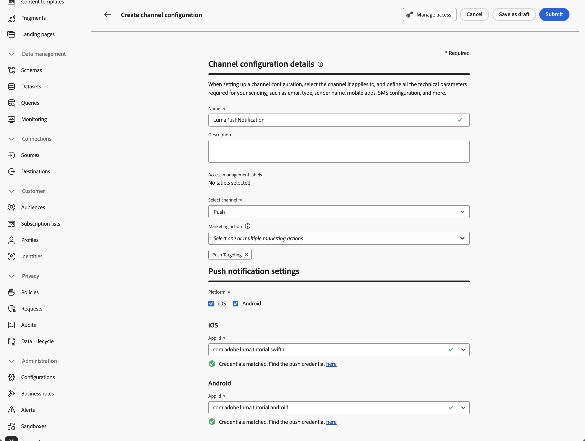

# Erstellen und Versenden von Push-Benachrichtigungen

Erfahren Sie, wie Sie mit Experience Platform Mobile SDK und Journey Optimizer Push-Benachrichtigungen für Mobile Apps erstellen.

Mit Journey Optimizer können Sie Journey erstellen und Nachrichten an ausgewählte Zielgruppen senden. Bevor Sie Push-Benachrichtigungen mit Journey Optimizer senden, müssen Sie sicherstellen, dass die richtigen Konfigurationen und Integrationen vorhanden sind. Informationen zum Datenfluss von Push-Benachrichtigungen in Journey Optimizer finden Sie in der [Dokumentation](https://experienceleague.adobe.com/en/docs/journey-optimizer/using/channels/push/push-config/push-gs).

{zoomable="yes"}

>[!NOTE]
>
>Diese Lektion ist optional und gilt nur für Journey Optimizer-Benutzende, die Push-Benachrichtigungen senden möchten.


## Voraussetzungen

* Die App wurde erfolgreich erstellt und ausgeführt, wobei SDKs installiert und konfiguriert wurden.
* Richten Sie die App für Adobe Experience Platform ein.
* Zugriff auf Journey Optimizer und [ausreichende ](https://experienceleague.adobe.com/en/docs/journey-optimizer/using/channels/push/push-config/push-configuration)) Außerdem benötigen Sie ausreichende Berechtigungen für die folgenden Journey Optimizer-Funktionen.
   * Erstellen Sie Push-Anmeldedaten.
   * Erstellen Sie eine Konfiguration für den Push-Kanal.
   * Erstellen Sie eine Journey.
   * Erstellen einer Nachricht.
   * Erstellen von Nachrichtenvoreinstellungen.
* Für iOS ein **gebührenpflichtiges Apple-Entwicklerkonto** mit ausreichendem Zugriff zum Erstellen von Zertifikaten, Kennungen und Schlüsseln.
* Für Android ein Google-Entwicklerkonto mit ausreichendem Zugriff zum Erstellen von Zertifikaten und Schlüsseln.
* Physikalisches iOS- oder Android-Gerät oder Simulator für Tests.

## Lernziele

In dieser Lektion werden Sie

* Registrieren der App-ID beim Apple Push Notification Service (APNs).
* Erstellen Sie eine Kanalkonfiguration in Journey Optimizer.
* Aktualisieren Sie Ihr Schema, um Push-Messaging-Felder einzuschließen.
* Installieren und konfigurieren Sie die Tag-Erweiterung von Journey Optimizer.
* Aktualisieren Sie Ihre App, um die Journey Optimizer-Tag-Erweiterung zu registrieren.
* Überprüfen Sie das Setup in Assurance.
* Senden einer Testnachricht von Assurance
* Definieren Sie Ihr eigenes Push-Benachrichtigungsereignis, Journey und Erlebnis in Journey Optimizer.
* Senden Sie Ihre eigene Push-Benachrichtigung aus der App heraus.


## Einrichten

>[!TIP]
>
>Wenn Sie Ihre Umgebung bereits im Rahmen der Lektion [Journey Optimizer-In-App-Messaging](journey-optimizer-inapp.md) eingerichtet haben, haben Sie möglicherweise bereits einige der Schritte in diesem Setup-Abschnitt ausgeführt.

### Push-Anmeldedaten erstellen

Für Push-Benachrichtigungen müssen Sie zunächst Ihre App für Push-Benachrichtigungen registrieren.

>[!BEGINTABS]

>[!TAB iOS]

Die folgenden Schritte sind nicht Adobe Experience Cloud-spezifisch und sollen Sie durch die APNs-Konfiguration führen.

1. Navigieren Sie im Apple-Entwicklerportal zu **[!UICONTROL Keys]**.
1. Um einen Schlüssel zu erstellen, wählen Sie **[!UICONTROL +]** aus.

   {zoomable="yes"}

1. Geben Sie einen **[!UICONTROL Schlüsselnamen“]**.
1. Wählen Sie **[!UICONTROL Apple Push Notification Service] (APNs)** und wählen Sie **[!UICONTROL Konfigurieren]**.
   1. Wählen Sie auf dem **[!UICONTROL Schlüssel konfigurieren]** die Option **[!UICONTROL Sandbox und]**) aus dem Dropdown-Menü **[!UICONTROL Umgebung]** aus.
   1. Wählen Sie **[!UICONTROL Speichern]** aus.
1. Wählen Sie **[!UICONTROL Weiter]** aus.

   {zoomable="yes"}

1. Überprüfen Sie die Konfiguration und wählen Sie **[!UICONTROL Registrieren]**.
1. Laden Sie den privaten `.p8`-Schlüssel herunter. Er wird in der nächsten Übung verwendet, wenn Sie Ihre Journey Optimizer-Push-Anmeldedaten konfigurieren.
1. Notieren Sie sich die **[!UICONTROL Schlüssel-ID]**. Er wird in der nächsten Übung verwendet, wenn Sie Ihre Journey Optimizer-Push-Anmeldedaten konfigurieren.
1. Notieren Sie sich die **[!UICONTROL Team ID]**. Er wird in der nächsten Übung verwendet, wenn Sie Ihre Journey Optimizer-Push-Anmeldedaten konfigurieren. Die Team-ID finden Sie oben rechts auf dem Bildschirm neben Ihrem Anmeldenamen.
   {zoomable="yes"}

Weitere Dokumentationen finden Sie [hier](https://help.apple.com/developer-account/#/devcdfbb56a3).

>[!TAB Android]

Die folgenden Schritte sind nicht Adobe Experience Cloud-spezifisch und sollen Sie durch die Firebase-Konfiguration führen.

1. Zugriff auf die Firebase-Konsole.
1. Wählen Sie **[!UICONTROL Erstellen eines Firebase-Projekts]**.
   1. Geben Sie einen **[!UICONTROL Projektnamen]** ein.
   1. Wählen Sie **[!UICONTROL Fortfahren]** in **[!UICONTROL Projekt erstellen]** - **[!UICONTROL Beginnen wir mit einem Namen für Ihr Projekt]**. Beispiel: `Luma Android App.`
   1. Deaktivieren Sie **[!UICONTROL Gemini in Firebase]** und wählen Sie **[!UICONTROL Weiter]** in **[!UICONTROL Projekt erstellen]** - **[!UICONTROL KI-Unterstützung für Ihr Firebase-Projekt]**.
   1. Deaktivieren Sie **[!UICONTROL Google Analytics für]** Projekt und wählen Sie **[!UICONTROL Weiter]** in **[!UICONTROL Projekt erstellen]** - **[!UICONTROL Google Analytics für Ihr Firebase-Projekt]**.
   1. Wählen Sie **[!UICONTROL Projekt erstellen]** aus.
   1. Wenn das Projekt fertig ist, wählen Sie **[!UICONTROL Weiter]** aus.

1. Stellen Sie in der Firebase-Konsole sicher, dass Ihr Projekt oben ausgewählt ist. Beispiel: **[!UICONTROL Luma Android App]**.

   {zoomable="yes"}

1. Wählen Sie  > **[!UICONTROL Projekteinstellungen]** aus.

1. Wählen **[!UICONTROL in]** Projekteinstellungen“ **[!UICONTROL App hinzufügen]** aus.
   1. Wählen **[!UICONTROL in „Firebase zu Ihrer App hinzufügen]** **[!UICONTROL Android]** als Plattform aus.
   1. Im **[!UICONTROL Firebase zu Ihrer Android-App hinzufügen:]**
      1. In Schritt 1, **[!UICONTROL App registrieren]**:
         1. Geben Sie einen Android-Paketnamen ein, ähnlich Ihrer App-Kennung. Beispiel: `com.adobe.luma.tutorial.android`.
         1. Geben Sie einen optionalen **[!UICONTROL App-Spitznamen]** ein.
         1. Wählen Sie **[!UICONTROL App registrieren]** aus.
      1. In Schritt 2, **[!UICONTROL Herunterladen und dann Konfigurationsdatei hinzufügen]**.
         1. Wählen Sie  **[!UICONTROL Download google-services.json]** aus. Wenn Sie Ihre eigene Version der Android-App erstellen, sollten Sie die aktuelle `google-services.json` im Android Studio-Beispielprojekt durch die Version der Datei ersetzen, die von dieser neuen App-Konfiguration generiert wird.
Die anderen Schritte werden bereits in der Beispiel-App durchgeführt.

   Ihr Bildschirm sollte wie folgt aussehen:

   {zoomable="yes"}

1. Wählen **[!UICONTROL in]** Projekteinstellungen“ **[!UICONTROL Service-Konten]** aus.
1. Wählen Sie **[!UICONTROL Neuen privaten Schlüssel generieren]** aus. Es wird eine `luma-android-app-firebase-adminsdk-xxxx-xxxxxxxx.json`-Datei generiert. Bewahren Sie diese Datei an einem sicheren Ort auf, da Sie die Datei zu einem späteren Zeitpunkt benötigen.

Weitere Informationen finden Sie in der [Firebase Developer-](https://firebase.google.com/docs).

>[!ENDTABS]

### Hinzufügen von Push-Anmeldeinformationen für Ihre Mobile App in der Datenerfassung

Als Nächstes müssen Sie Ihre Push-Anmeldedaten für Mobile Apps hinzufügen, um Adobe zu autorisieren, Push-Benachrichtigungen in Ihrem Namen zu senden. Sie können Push-Anmeldeinformationen entweder in der Datenerfassung oder in Journey Optimizer hinzufügen. In diesem Tutorial wird die Datenerfassungsschnittstelle verwendet. Die Push-Anmeldeinformationen werden dann mit einer Kanalkonfiguration in Journey Optimizer verknüpft.

1. Wählen Sie in der Datenerfassung **[!UICONTROL App-Oberflächen]** aus.
1. Wählen Sie **[!UICONTROL Programmoberfläche erstellen]** aus.
1. In der Benutzeroberfläche **[!UICONTROL App-Oberfläche erstellen]**:
   1. Geben Sie einen &quot;**[!UICONTROL &quot;]**.
   1. Wählen Sie **[!UICONTROL Apple iOS]** aus, wenn Sie Push-Benachrichtigungen für iOS senden möchten.
      1. Geben Sie Ihre **[!UICONTROL App-ID]** ein, z. B. `com.adobe.luma.tutorial.swiftui`.
      1. Wählen Sie die Sandbox aus (optional).
      1. Aktivieren Sie **[!UICONTROL Push-Anmeldedaten]**.
      1. Legen Sie die gespeicherte Datei `.p8` privaten Schlüssels auf **[!UICONTROL Drag-and-Drop Your File)]**.
      1. Geben Sie die **[!UICONTROL Schlüssel-ID]** ein.
      1. Geben Sie die **[!UICONTROL Team-ID]** ein.
   1. Wählen Sie **[!UICONTROL Android]** aus, wenn Sie Push-Benachrichtigungen für Android senden möchten.
      1. Geben Sie Ihre **[!UICONTROL App-ID]** ein, z. B. `com.adobe.luma.tutorial.android`.
      1. Wählen Sie die Sandbox aus (optional).
      1. Aktivieren Sie **[!UICONTROL Push-Anmeldedaten]**.
      1. Legen Sie die gespeicherte `luma-android-app-firebase-adminsdk-xxxx-xxxxxxxx.json`-Datei auf **[!UICONTROL Drag-and-Drop Your File]** ab.

   {zoomable="yes"}

1. Wählen Sie **[!UICONTROL Speichern]** aus. Wenn alle Informationen korrekt sind, haben Sie Push-Anmeldedaten erstellt, um sie mit einer Kanalkonfiguration zu verknüpfen.


### Erstellen einer Kanalkonfiguration für Push-Benachrichtigungen in Journey Optimizer

Nachdem Sie eine Konfiguration für Push-Anmeldeinformationen erstellt haben, müssen Sie eine Konfiguration erstellen, um Push-Benachrichtigungen von Journey Optimizer senden zu können.

1. Öffnen Sie in der Journey Optimizer-Benutzeroberfläche das Menü **[!UICONTROL Kanäle]** > **[!UICONTROL Allgemeine Einstellungen]** > **[!UICONTROL Kanalkonfigurationen]** und wählen Sie dann **[!UICONTROL Kanalkonfiguration erstellen]**.

   {zoomable="yes"}

1. Geben Sie einen Namen und eine Beschreibung (optional) für die Konfiguration an.

   >[!NOTE]
   >
   > Namen müssen mit einem Buchstaben (A–Z) beginnen. Ein Name darf nur alphanumerische Zeichen enthalten. Sie können auch die Zeichen Unterstrich `_`, Punkt `.` und Bindestrich `-` verwenden.


1. Um der Konfiguration benutzerdefinierte oder grundlegende Datennutzungs-Labels zuzuweisen, können Sie **[!UICONTROL Zugriff verwalten]** auswählen. [Erfahren Sie mehr über die Zugriffssteuerung auf Objektebene (Object Level Access Control, OLAC)](https://experienceleague.adobe.com/en/docs/journey-optimizer/using/access-control/object-based-access).

1. Wählen Sie den Kanal **Push** aus.


1. Wählen Sie **[!UICONTROL Marketing-Aktion(en)]** aus, um mit dieser Konfiguration Einverständnisrichtlinien mit den Nachrichten zu verknüpfen. Alle mit den Marketing-Aktionen verknüpften Einverständnisrichtlinien werden genutzt, um die Voreinstellungen Ihrer Kundinnen und Kunden zu berücksichtigen. [Weitere Informationen zu Marketing-Aktionen](https://experienceleague.adobe.com/en/docs/journey-optimizer/using/privacy/consent/consent#surface-marketing-actions).

1. Wählen Sie Ihre **[!UICONTROL Plattform]**. Sie können sowohl **[!UICONTROL iOS]** als auch **[!UICONTROL Android]** für eine Kanalkonfiguration konfigurieren.

1. Wählen Sie die entsprechende **[!UICONTROL App-ID]** aus, die Sie zuvor zum Definieren Ihrer Push-Anmeldeinformationen verwendet haben. Zum Beispiel **[!UICONTROL com.adobe.luma.tutorial.swiftui]** für iOS und **[!UICONTROL com.adobe.luma.tutorial.android]** für Android. Der grüne  zeigt an, dass einer Kanalkonfiguration gültige Push-Anmeldeinformationen zugeordnet sind.


   {zoomable="yes"}

1. Klicken Sie **[!UICONTROL Senden]**, um Ihre Änderungen zu speichern.


### Aktualisieren der Datenstromkonfiguration

Aktualisieren Sie Ihre Experience Edge-Konfiguration , um sicherzustellen, dass Daten von Ihrer Mobile App an Edge Network Journey Optimizer weitergeleitet werden.

1. Wählen Sie in der Datenerfassungs-Benutzeroberfläche **[!UICONTROL Datenströme]** und wählen Sie Ihren Datenstrom aus, z. B. **[!DNL Luma Mobile App]**.
1. Wählen Sie  für **[!UICONTROL Experience Platform]** und wählen Sie  **[!UICONTROL Bearbeiten]** aus dem Kontextmenü.
1. Im Bildschirm **[!UICONTROL Datenströme]** >  > **[!UICONTROL Adobe Experience Platform]**:

   1. Wählen Sie, falls noch nicht ausgewählt, **[!UICONTROL AJO Push Profile Dataset]** aus **[!UICONTROL Profile Dataset]**. Dieser Profildatensatz ist bei Verwendung des `MobileCore.setPushIdentifier`-API-Aufrufs erforderlich (siehe [Registrieren des Geräte-Tokens für Push-Benachrichtigungen](#register-device-token-for-push-notifications)). Durch diese Auswahl wird auch sichergestellt, dass die eindeutige Kennung für Push-Benachrichtigungen (auch als Push-Kennung bezeichnet) als Teil des Profils des Benutzers gespeichert wird.

   1. **[!UICONTROL Adobe Journey Optimizer]** ist ausgewählt. Weitere Informationen finden Sie unter {[}Adobe Experience Platform-Einstellungen.](https://experienceleague.adobe.com/de/docs/experience-platform/datastreams/configure)

   1. Um Ihre Datenstromkonfiguration zu speichern, wählen Sie **[!UICONTROL Speichern]** aus.

   {zoomable="yes"}


### Installieren der Journey Optimizer Tags-Erweiterung

Damit Ihre App mit Journey Optimizer verwendet werden kann, müssen Sie Ihre Tag-Eigenschaft aktualisieren.

1. Navigieren Sie **[!UICONTROL Tags]** > **[!UICONTROL Erweiterungen]** > **[!UICONTROL Katalog]**,
1. Öffnen Sie die Eigenschaft, z. B. **[!DNL Luma Mobile App Tutorial]**.
1. Wählen Sie **[!UICONTROL Katalog]** aus.
1. Suchen Sie nach der Erweiterung **[!UICONTROL Adobe Journey Optimizer]**.
1. Installieren Sie die Erweiterung .
1. Im Dialogfeld **[!UICONTROL Erweiterung installieren]**
   1. Wählen Sie eine Umgebung aus, zum Beispiel **[!UICONTROL Entwicklung]**.
   1. Wählen Sie den Datensatz **[!UICONTROL AJO Push-Tracking-Erlebnisereignis-]** aus der Liste **[!UICONTROL Ereignisdatensatz]** aus.
   1. Wählen Sie **[!UICONTROL In Bibliothek speichern und erstellen]**.
      {zoomable="yes"}

>[!NOTE]
>
>Wenn Sie **[!UICONTROL AJO Push-Tracking-Erlebnisereignis-Datensatz]** nicht als Option sehen, wenden Sie sich an die Kundenunterstützung.
>

## Überprüfen des Setups mit Assurance

1. Lesen Sie den Abschnitt [Setup-Anweisungen](assurance.md#connecting-to-a-session), um Ihren Simulator oder Ihr Gerät mit Assurance zu verbinden.
1. Wählen Sie in der Assurance-Benutzeroberfläche **[!UICONTROL Konfigurieren]** aus.
   {zoomable="yes"}
1. Wählen Sie  neben **[!UICONTROL Push-Debugging]** aus.
1. Wählen Sie **[!UICONTROL Speichern]** aus.
   {zoomable="yes"}
1. Wählen **[!UICONTROL Debug pushen]** in der linken Navigationsleiste aus.
1. Wählen Sie die Registerkarte **[!UICONTROL Einrichtung überprüfen]** aus.
1. Wählen Sie Ihr Gerät in der Liste **[!UICONTROL Client]** aus.
1. Vergewissern Sie sich, dass Sie keine Fehler erhalten.
   {zoomable="yes"}
1. Wählen Sie die Registerkarte **[!UICONTROL Test-Push senden]** aus.
1. (Optional) Ändern Sie die Standarddetails für **[!UICONTROL Titel]** und **[!UICONTROL Hauptteil]** und stellen Sie sicher, dass Sie alle Parameter angeben, die Ihre App erwartet, **[!UICONTROL Erweitert]** > **[!UICONTROL Benachrichtigungskanal]** (erforderlich für Android, z. B. `LUMA_CHANNEL_ID`).
1. Wählen Sie  **[!UICONTROL Test-Push-Benachrichtigung senden]**.
1. Überprüfen Sie **[!UICONTROL Testergebnisse]**.

   {zoomable="yes"}
1. Die Test-Push-Benachrichtigung sollte nun in Ihrer App angezeigt werden.

>[!BEGINTABS]

>[!TAB iOS]


>[!TAB Android]


>[!ENDTABS]

## Signieren

>[!IMPORTANT]
>
>Das Signieren einer iOS-App ist erforderlich, um Push-Benachrichtigungen auf iOS zu senden **erfordert ein gebührenpflichtiges Apple-Entwicklerkonto**. Sie müssen keine Android-App signieren, um Push-Benachrichtigungen zu senden.


So aktualisieren Sie die Signatur für Ihre App:

1. Rufen Sie Ihre App in Xcode auf.
1. Wählen Sie **[!DNL Luma]** im Projekt-Navigator aus.
1. Wählen Sie die **[!DNL Luma]** aus.
1. Wählen Sie die Registerkarte **Signierung und Funktionen** aus.
1. Konfigurieren Sie **[!UICONTROL Automatische Signaturverwaltung]**, **[!UICONTROL Team]** und **[!UICONTROL Bundle-]** oder verwenden Sie Ihre spezifischen Bereitstellungsdetails für die Apple-Entwicklung.

   >[!IMPORTANT]
   >
   >Stellen Sie sicher _dass Sie eine_ eindeutige“ Bundle-Kennung verwenden und die `com.adobe.luma.tutorial.swiftui` Bundle-Kennung ersetzen, da jede Bundle-Kennung eindeutig sein muss. Normalerweise verwenden Sie ein Reverse-DNS-Format für Paket-ID-Zeichenfolgen wie `com.organization.brand.uniqueidentifier`. Die fertige Version dieses Tutorials verwendet beispielsweise `com.adobe.luma.tutorial.swiftui`.


   {zoomable="yes"}


## Hinzufügen von Push-Benachrichtigungsfunktionen zu Ihrer App

>[!IMPORTANT]
>
>Um Push-Benachrichtigungen in einer iOS-Mobile-App zu implementieren und zu testen, benötigen Sie ein **-** Apple-Entwicklerkonto.

>[!BEGINTABS]

>[!TAB iOS]

1. Wählen Sie in Xcode **[!DNL Luma]** aus der Liste **[!UICONTROL TARGETS]**, wählen Sie die Registerkarte **[!UICONTROL Signierung und Funktionen]** aus, klicken Sie auf die Schaltfläche **[!UICONTROL + Funktion]** und klicken Sie dann auf **[!UICONTROL Push-Benachrichtigungen]**. Mit dieser Auswahl kann Ihre App Push-Benachrichtigungen erhalten.

1. Als Nächstes müssen Sie der App eine Benachrichtigungserweiterung hinzufügen. Gehen Sie zurück zur Registerkarte &quot;**[!DNL General]**&quot; und wählen Sie unten im Abschnitt „ZIELE **[!UICONTROL das Symbol]**+**&#x200B;** aus.

1. Sie werden aufgefordert, die Vorlage für Ihre neue Zielgruppe auszuwählen. Wählen Sie **[!UICONTROL Erweiterung für den Benachrichtigungsdienst]** und dann **[!UICONTROL Weiter]** aus.

1. Verwenden Sie im nächsten Fenster `NotificationExtension` als Namen der Erweiterung und klicken Sie auf die Schaltfläche **[!UICONTROL Beenden]**.

Ihrer App sollte jetzt eine Push-Benachrichtigungs-Erweiterung hinzugefügt werden, ähnlich wie im folgenden Bildschirm.

{zoomable="yes"}

>[!TAB Android]

Das Android Studio-Projekt ist bereits für Push-Benachrichtigungen eingerichtet. Sie müssen keine zusätzlichen Schritte ausführen, um die Android-Version der Luma-App für Push-Benachrichtigungen zu aktivieren. Weitere Informationen finden [ unter ](https://developer.android.com/develop/ui/views/notifications)Über Benachrichtigungen“.

Android-Push-Benachrichtigungen erfordern, dass Sie eine Benachrichtigungskanal-ID definieren, sowohl in Ihrer Mobile App als auch beim Senden einer Push-Benachrichtigung. Die in der Android Luma-App verwendete Kanalbenachrichtigungs-ID ist `LUMA_CHANNEL ID`.

>[!ENDTABS]


## Implementieren von Journey Optimizer in der App

Wie in den vorherigen Lektionen erläutert, wird bei der Installation einer mobilen Tag-Erweiterung nur die Konfiguration bereitgestellt. Als Nächstes müssen Sie Messaging SDK installieren und registrieren. Wenn diese Schritte nicht klar sind, lesen Sie den Abschnitt [Installieren von SDKs](install-sdks.md).

>[!NOTE]
>
>Wenn Sie den Abschnitt [Installieren von SDKs](install-sdks.md) abgeschlossen haben, ist die SDK bereits installiert und Sie können diesen Schritt überspringen.
>

>[!BEGINTABS]

>[!TAB iOS]

1. Stellen Sie in Xcode sicher, dass [AEP Messaging](https://github.com/adobe/aepsdk-messaging-ios) zur Liste der Pakete in den Paketabhängigkeiten hinzugefügt wird. Siehe [Swift Package Manager](install-sdks.md#swift-package-manager).
1. Navigieren Sie im Xcode-Projekt **[!DNL Luma]** Navigator zu **[!DNL Luma]** > **[!UICONTROL >]** AppDelegate.
1. Stellen Sie sicher, dass `AEPMessaging` Teil Ihrer Importliste ist.

   `import AEPMessaging`

1. Stellen Sie sicher, dass `Messaging.self` Teil des Arrays von Erweiterungen ist, die Sie registrieren.

   ```swift
   let extensions = [
       AEPIdentity.Identity.self,
       Lifecycle.self,
       Signal.self,
       Edge.self,
       AEPEdgeIdentity.Identity.self,
       Consent.self,
       UserProfile.self,
       Places.self,
       Messaging.self,
       Optimize.self,
       Assurance.self
   ]
   ```

>[!TAB Android]

1. Stellen Sie in Android Studio sicher, dass [aepsdk-messaging-android](https://github.com/adobe/aepsdk-messaging-android) Teil der Abhängigkeiten in **[!UICONTROL build.gradle.kts (Module :app)]** in **[!UICONTROL Android]** **[!UICONTROL Gradle Scripts]** ist. Siehe [Gradle](install-sdks.md#gradle).
1. Navigieren Sie zu **[!UICONTROL Android]**  > **[!DNL app]** > **[!DNL kotlin+java]** > **[!UICONTROL com.adobe.luma.tutorial.android]** > **[!UICONTROL LumaApplication]** im Android Studio-Projektnavigator.
1. Stellen Sie sicher, dass `com.adobe.marketing.mobile.Messaging` Teil Ihrer Importliste ist.

   `import import com.adobe.marketing.mobile.Messaging`

1. Stellen Sie sicher, dass `Messaging.EXTENSION` Teil des Arrays von Erweiterungen ist, die Sie registrieren.

   ```kotlin
   val extensions = listOf(
       Identity.EXTENSION,
       Lifecycle.EXTENSION,
       Signal.EXTENSION,
       Edge.EXTENSION,
       Consent.EXTENSION,
       UserProfile.EXTENSION,
       Places.EXTENSION,
       Messaging.EXTENSION,
       Optimize.EXTENSION,
       Assurance.EXTENSION
   )
   ```

>[!ENDTABS]


## Registrieren eines Geräte-Tokens für Push-Benachrichtigungen

Sie müssen das Geräte-Token für Push-Benachrichtigungen registrieren.

>[!BEGINTABS]

>[!TAB iOS]

1. Navigieren Sie im Xcode-Projekt **[!DNL Luma]** Navigator zu **[!DNL Luma]** > **[!UICONTROL >]** AppDelegate.
1. Fügen Sie die [`MobileCore.setPushIdentifier`](https://developer.adobe.com/client-sdks/documentation/mobile-core/api-reference/#setpushidentifier)-API zur `func application(_ application: UIApplication, didRegisterForRemoteNotificationsWithDeviceToken deviceToken: Data)` hinzu.

   ```swift
   // Send push token to Mobile SDK
   MobileCore.setPushIdentifier(deviceToken)
   ```

   Diese Funktion ruft das Geräte-Token ab, das für das Gerät, auf dem die App installiert ist, eindeutig ist. Anschließend legt das Token für den Versand von Push-Benachrichtigungen unter Verwendung der Konfiguration fest, die Sie eingerichtet haben und die auf dem Push Notification Service (APNs) von Apple basiert.

>[!TAB Android]

1. Navigieren Sie zu **[!UICONTROL Android]**  > **[!DNL app]** > **[!DNL kotlin+java]** > **[!UICONTROL com.adobe.luma.tutorial.android]** > **[!UICONTROL LumaApplication]** im Android Studio-Projektnavigator.
1. Fügen Sie die [`MobileCore.setPushIdentifier`](https://developer.adobe.com/client-sdks/documentation/mobile-core/api-reference/#setpushidentifier)-API in der `override fun onCreate()` zur `class LumaAplication : Application` in `FirebaseMessaging.getInstance().token.addOnCompleteListener` hinzu.

   ```kotlin
   // Send push token to Mobile SDK
   MobileCore.setPushIdentifier(token)
   ```

   Diese Funktion ruft das Geräte-Token ab, das für das Gerät, auf dem die App installiert ist, eindeutig ist. Legt dann das Token für den Versand von Push-Benachrichtigungen mithilfe der Konfiguration fest, die Sie eingerichtet haben und die auf Firebase Cloud Messaging (FCM) basiert.

>[!ENDTABS]

>[!IMPORTANT]
>
>**Nur für iOS**: Die `MobileCore.updateConfigurationWith(configDict: ["messaging.useSandbox": true])` bestimmt, ob Push-Benachrichtigungen eine APNs-Sandbox oder einen Produktions-Server zum Senden von Push-Benachrichtigungen verwenden. Stellen Sie beim Testen Ihrer App im Simulator oder auf einem Gerät sicher, dass die `messaging.useSandbox` auf `true` eingestellt ist, damit Sie Push-Benachrichtigungen erhalten. Stellen Sie beim Bereitstellen Ihrer App für Produktions- oder Testzwecke mit Apple Testflight sicher, dass Sie `messaging.useSandbox` auf `false` setzen, da Ihre Produktions-App sonst keine Push-Benachrichtigungen empfangen kann.<br/><br/>
>&#x200B;>Firebase Cloud Messaging (FCM) unterstützt **nicht** das Konzept von Sandboxes für Push-Benachrichtigungen.


## Erstellen einer eigenen Push-Benachrichtigung

Um Ihre eigene Push-Benachrichtigung zu erstellen, müssen Sie in Journey Optimizer ein Ereignis definieren, das eine Journey zum Senden einer Push-Benachrichtigung Trigger.

### Schema aktualisieren

Sie werden einen neuen Ereignistyp definieren, der noch nicht als Teil der Liste der Ereignisse verfügbar ist, die in Ihrem Schema definiert sind. Diesen Ereignistyp können Sie später beim Auslösen von Push-Benachrichtigungen verwenden.

1. Wählen Sie in der Journey Optimizer-Benutzeroberfläche **[!UICONTROL Schemata]** in der linken Leiste aus.
1. Wählen **[!UICONTROL Durchsuchen]** in der Registerkartenleiste aus.
1. Wählen Sie Ihr Schema aus, um es beispielsweise **[!DNL Luma Mobile App Event Schema]** zu öffnen.
1. Im Schema-Editor:
   1. Wählen Sie das Feld **[!UICONTROL eventType]** aus.
   1. Scrollen **[!UICONTROL im Bereich]** Feldeigenschaften“ nach unten, um die Liste der möglichen Werte für den Ereignistyp anzuzeigen. Wählen Sie **[!UICONTROL Zeile hinzufügen]** aus und fügen Sie `application.test` als **[!UICONTROL WERT]** und `[!UICONTROL Test event for push notification]` als `DISPLAY NAME` hinzu.
   1. Wählen Sie **[!UICONTROL Anwenden]** aus.
   1. Wählen Sie **[!UICONTROL Speichern]** aus.

      {zoomable="yes"}

### Ereignis definieren

Mit Ereignissen in Journey Optimizer können Sie Trigger-Journey zum Senden von Nachrichten, z. B. Push-Benachrichtigungen, hinzufügen. Weitere Informationen finden [ unter ](https://experienceleague.adobe.com/en/docs/journey-optimizer/using/configure-journeys/events-journeys/about-events)Über Ereignisse“.

1. Wählen Sie in der Benutzeroberfläche von Journey Optimizer **[!UICONTROL Konfigurationen]** in der linken Leiste aus.

1. Wählen Sie im **[!UICONTROL Dashboard]** die Schaltfläche **[!UICONTROL Verwalten]** in der Kachel **[!UICONTROL Ereignisse]** aus.

1. Wählen Sie im **[!UICONTROL Ereignisse]** die Option **[!UICONTROL Ereignis erstellen]** aus.

1. Im Bereich **[!UICONTROL Ereignis bearbeiten1]**:

   1. Geben Sie `LumaTestEvent` als **[!UICONTROL Name]** des Ereignisses ein.
   1. Geben Sie **[!UICONTROL Beschreibung]** ein, z. B. `Test event to trigger push notifications in Luma app`.

   1. Wählen Sie in der Liste [Schema“ das Erlebnisereignisschema der Mobile App aus](create-schema.md) **[!UICONTROL das Sie zuvor unter „Erstellen eines XDM]** Schemas“ erstellt haben, z. B. **[!DNL Luma Mobile App Event Schema v.1]**.
   1. Wählen  neben der Liste **[!UICONTROL Felder]** aus.

      {zoomable="yes"}

      Stellen Sie **[!UICONTROL Dialogfeld „Felder]** sicher, dass die folgenden Felder ausgewählt sind (zusätzlich zu den Standardfeldern, die immer ausgewählt sind (**[!UICONTROL _id]**, **[!UICONTROL id]** und **[!UICONTROL timestamp]**). Sie können mithilfe der Dropdown-Liste zwischen **[!UICONTROL Ausgewählt]**, **[!UICONTROL Alle]** und **[!UICONTROL Primär]** wechseln oder das Feld  verwenden.

      * **[!UICONTROL Kennung der Anwendung (ID]**,
      * **[!UICONTROL Ereignistyp (eventType)]**,
      * **[!UICONTROL Primär (primär)]**.

      {zoomable="yes"}

      Wählen Sie dann **[!UICONTROL OK]** aus.

   1. Klicken Sie  neben dem Feld **[!UICONTROL Ereignis-ID-Bedingung]**.

      1. Ziehen Sie **[!UICONTROL Dialogfeld „Ereignis-ID-Bedingung hinzufügen]** per Drag-and-Drop **[!UICONTROL Ereignistyp (eventType)]** auf **[!UICONTROL Ziehen Sie ein Element hierher]**.
      1. Scrollen Sie im Popover nach unten und wählen Sie **[!UICONTROL application.test]** aus (dies ist der Ereignistyp, den Sie zuvor als Teil von „Schema aktualisieren[ zur Liste der Ereignistypen hinzugefügt ](#update-your-schema)). Scrollen Sie dann nach oben und wählen Sie **[!UICONTROL OK]** aus.
      1. Klicken Sie **[!UICONTROL OK]**, um die Bedingung zu speichern.
         {zoomable="yes"}

   1. Wählen Sie **[!UICONTROL ECID (ECID)]** aus der Liste **[!UICONTROL Namespace]** aus. Das Feld **[!UICONTROL Profilkennung]** wird automatisch mit **[!UICONTROL Die ID des ersten Elements der ECID des Schlüssels für die identityMap -Zuordnung]** ausgefüllt.
   1. Wählen Sie **[!UICONTROL Speichern]** aus.
      {zoomable="yes"}

Sie haben soeben eine Ereigniskonfiguration erstellt, die auf dem Schema Erlebnisereignisse der mobilen App basiert, das Sie zuvor im Rahmen dieses Tutorials erstellt haben. Diese Ereigniskonfiguration filtert eingehende Erlebnisereignisse anhand Ihres spezifischen Ereignistyps (`application.test`). Daher werden nur Ereignisse mit diesem bestimmten Typ, die von Ihrer Mobile App initiiert werden, den Trigger der im nächsten Schritt erstellten Journey übernehmen. In einem realen Szenario empfiehlt es sich, Push-Benachrichtigungen über einen externen Service zu senden. Es gelten jedoch die gleichen Konzepte: Senden Sie in der externen Anwendung ein Erlebnisereignis an Experience Platform, das bestimmte Felder enthält, auf die Sie Bedingungen anwenden können, bevor diese Ereignisse eine Journey zum Trigger bringen.

### Erstellen der Journey

Als Nächstes erstellen Sie die Journey, die den Versand der Push-Benachrichtigung beim Empfang des entsprechenden Ereignisses Trigger.

1. Wählen Sie in der Journey Optimizer-Benutzeroberfläche in der **[!UICONTROL Leiste die Option]** Journey.
1. Wählen Sie **[!UICONTROL Journey erstellen]** aus.
1. Im Bedienfeld **[!UICONTROL Journey]** Eigenschaften:

   1. Geben Sie einen **[!UICONTROL Namen]** für die Journey ein, z. B. `Luma - Test Push Notification Journey`.
   1. Geben Sie eine **[!UICONTROL Beschreibung]** für die Journey ein, z. B. `Journey for test push notifications in Luma mobile app`.
   1. Stellen Sie sicher **[!UICONTROL dass „Erneuten]** zulassen“ ausgewählt ist und **[!UICONTROL Wartezeit bis zum erneuten Eintritt]** auf **[!UICONTROL 30]** **[!UICONTROL Sekunden]**.
   1. Klicken Sie auf **[!UICONTROL OK]**.
      {zoomable="yes"}

1. Ziehen Sie auf der Journey-Arbeitsfläche von **[!UICONTROL EREIGNISSE]** Ihren Ereignis **[!DNL LumaTestEvent]** auf die Arbeitsfläche, auf der er angezeigt wird **[!UICONTROL Wählen Sie ein Eintrittsereignis oder eine Aktivität zum Lesen einer Zielgruppe aus]**.

   * Geben Sie im **[!UICONTROL Ereignisse: LumaTestEvent]** einen **[!UICONTROL Titel]** ein, z. B. `Luma Test Event`.

1. Ziehen Sie aus dem **[!UICONTROL AKTIONEN]**-Dropdown  **[!UICONTROL Push]** auf die , die rechts neben Ihrer **[!DNL LumaTestEvent]** angezeigt wird. Im Bereich **[!UICONTROL Aktionen: Push]**:

   1. Geben Sie einen **[!UICONTROL Titel]** ein, z. B. `Luma Test Push Notification` einen **[!UICONTROL Beschreibung]**, z. B. `Test push notification for Luma mobile app`, wählen Sie **[!UICONTROL Transaktion]** aus der Liste **[!UICONTROL Kategorie]** und wählen Sie **[!DNL Luma]** aus der **[!UICONTROL Push-Oberfläche]**.
   1. Wählen Sie  **[!UICONTROL Inhalt bearbeiten]**, um mit der Bearbeitung der eigentlichen Push-Benachrichtigung zu beginnen.

      {zoomable="yes"}

      Im Editor **[!UICONTROL Push]** Benachrichtigung):

      1. Geben Sie einen **[!UICONTROL Titel]** ein, z. B. `Luma Test Push Notification`, und geben Sie einen **[!UICONTROL Hauptteil]** ein, z. B. `Test push notification for Luma mobile app`.
      1. Optional können Sie einen Link zu einem Bild (.png oder .jpg) in **[!UICONTROL Medien hinzufügen]** eingeben. In diesem Fall ist das Bild Teil der Push-Benachrichtigung. Beachten Sie, dass Sie in diesem Fall darauf achten müssen, dass das Bild in Ihrer Mobile App ordnungsgemäß verarbeitet wird.
      1. Um den Editor zu speichern und zu verlassen, wählen Sie  aus.

         {zoomable="yes"}

   1. Um die Definition der Push-Benachrichtigung zu speichern und abzuschließen, klicken Sie auf **[!UICONTROL OK]**.

1. Ihr Journey sollte wie folgt aussehen. Wählen Sie **[!UICONTROL Veröffentlichen]** aus, um Ihren Journey zu veröffentlichen und zu aktivieren.
   {zoomable="yes"}


## Trigger der Push-Benachrichtigung

Sie verfügen über alle erforderlichen Komponenten, um eine Push-Benachrichtigung zu senden. Übrig bleibt, wie diese Push-Benachrichtigung Trigger wird. Im Wesentlichen ist es dasselbe wie zuvor: Senden Sie einfach ein Erlebnisereignis mit der richtigen Payload (wie in [Events](events.md)).

Dieses Mal ist das Erlebnisereignis, das Sie senden möchten, nicht mit dem Aufbau eines einfachen XDM-Wörterbuchs konstruiert. Sie verwenden ein `struct`, das die Payload einer Push-Benachrichtigung darstellt. Die Definition eines dedizierten Datentyps ist eine alternative Möglichkeit, die Erstellung von Erlebnisereignis-Payloads in Ihrer Anwendung zu implementieren.

Beachten Sie, dass Sie ausschließlich zu Illustrationszwecken eine Push-Benachrichtigung aus der App heraus senden. Ein typischeres Szenario ist es, das Erlebnisereignis (das den Trigger der Push-Benachrichtigungs-Journey bildet) von einer anderen Anwendung oder einem anderen Service zu senden.

>[!BEGINTABS]

>[!TAB iOS]

1. Navigieren Sie im Xcode-Projekt-Navigator zu **[!DNL Luma]** > **[!DNL Luma]** **[!UICONTROL Modell]** > **[!UICONTROL XDM]** > **[!UICONTROL TestPushPayload]** und überprüfen Sie den Code.

   ```swift
   import Foundation
   
   // MARK: - TestPush
   struct TestPushPayload: Codable {
      let application: Application
      let eventType: String
   }
   
   // MARK: - Application
   struct Application: Codable {
      let id: String
   }
   ```

   Der Code ist eine Darstellung der folgenden einfachen Payload, die Sie an den Trigger Ihrer Test-Push-Benachrichtigungs-Journey senden werden.

   ```json
   {
      "eventType": string,
      "application" : [
          "id": string
      ]
   }
   ```

1. Navigieren Sie im Xcode-Projekt-**[!DNL Luma]** zu **[!DNL Luma]** > **[!DNL Utils]** > **[!UICONTROL >]** MobileSDK) und fügen Sie `func sendTestPushEvent(applicationId: String, eventType: String)` den folgenden Code hinzu:

   ```swift
   // Create payload and send experience event
   Task {
       let testPushPayload = TestPushPayload(
           application: Application(
               id: applicationId
           ),
           eventType: eventType
       )
       // send the final experience event
       await sendExperienceEvent(
           xdm: testPushPayload.asDictionary() ?? [:]
       )
   }
   ```

   Dieser Code erstellt eine `testPushPayload`-Instanz mit den Parametern, die für die Funktion (`applicationId` und `eventType`) bereitgestellt werden, und ruft dann `sendExperienceEvent` beim Konvertieren der Payload in ein Wörterbuch auf. Dieser Code berücksichtigt auch die asynchronen Aspekte des Aufrufs der Adobe Experience Platform SDK durch die Verwendung des Swift-Parallelitätsmodells, das auf `await` und `async` basiert.

1. Navigieren Sie im Xcode-Projekt-Navigator zu **[!DNL Luma]** > **[!DNL Luma]** > **[!DNL Views]** > **[!DNL General]** **[!UICONTROL ConfigView]**. Fügen Sie der Definition der Schaltfläche „Push-Benachrichtigung“ den folgenden Code hinzu, um die Payload des Erlebnisereignisses „Push-Benachrichtigung testen“ an Ihren Journey-Trigger zu senden, wenn auf diese Schaltfläche getippt wird.

   ```swift
   // Setting parameters and calling function to send push notification
   Task {
       let eventType = testPushEventType
       let applicationId = Bundle.main.bundleIdentifier ?? "No bundle id found"
       await MobileSDK.shared.sendTestPushEvent(applicationId: applicationId, eventType: eventType)
   }
   ```

>[!TAB Android]

1. Navigieren Sie zu **[!UICONTROL Android]**  > **[!DNL app]** > **[!DNL kotlin+java]** > **[!UICONTROL com.adobe.luma.tutorial.android]** > **[!UICONTROL xdm]** > **[!UICONTROL TestPushPayload.kt]** im Android Studio-Navigator und überprüfen Sie den Code.

   ```kotlin
   import com.google.gson.annotations.SerializedName
   
   data class TestPushPayload(
      @SerializedName("application") val application: Application,
      @SerializedName("eventType") val eventType: String
   ) {
      fun asMap(): Map<String, Any> {
         return mapOf(
               "application" to application.asMap(),
               "eventType" to eventType
         )
      }
   }
   
   data class Application(
      @SerializedName("id") val id: String
   ) {
      fun asMap(): Map<String, Any> {
         return mapOf(
               "id" to id
         )
      }
   }
   ```

   Der Code ist eine Darstellung der folgenden einfachen Payload, die Sie an den Trigger Ihrer Test-Push-Benachrichtigungs-Journey senden werden.

   ```json
   {
      "eventType": string,
      "application" : [
          "id": string
      ]
   }
   ```

1. Android Navigieren Sie im Android Studio-Navigator zu **&#x200B;** > **[!DNL app]** > **[!DNL kotlin+java]** > **[!DNL com.adobe.luma.tutorial.android]** > **[!UICONTROL models]** > **[!UICONTROL MobileSDK]** und fügen Sie den folgenden Code zu `func sendTestPushEvent(applicationId: String, eventType: String)` hinzu:

   ```kotlin
   // Create payload and send experience event
   val testPushPayload = TestPushPayload(
      Application(applicationId),
      eventType
   )
   sendExperienceEvent(testPushPayload.asMap())
   ```

   Dieser Code erstellt eine `testPushPayload`-Instanz mit den Parametern, die für die Funktion (`applicationId` und `eventType`) bereitgestellt werden, und ruft dann `sendExperienceEvent` beim Konvertieren der Payload in eine Zuordnung auf.

1. Navigieren Sie zu **[!UICONTROL Android]**  > **[!DNL app]** > **[!DNL kotlin+java]** > **[!DNL com.adobe.luma.android.tutorial]** > **[!DNL views]** > **[!UICONTROL ConfigView.kt]** im Android Studio-Navigator. Fügen Sie der Definition der Schaltfläche „Push-Benachrichtigung“ den folgenden Code hinzu, um die Payload des Erlebnisereignisses „Push-Benachrichtigung testen“ an Ihren Journey-Trigger zu senden, wenn auf diese Schaltfläche getippt wird.

   ```kotlin
   // Setting parameters and calling function to send push notification
   val eventType = testPushEventType
   val applicationId = context.packageName
   scope.launch {
         MobileSDK.shared.sendTestPushEvent(
            applicationId,
            eventType
         )
   }
   ```


>[!ENDTABS]

## Validieren mit der App

So validieren Sie das Push-Benachrichtigungsereignis und das Journey:

>[!BEGINTABS]

>[!TAB iOS]

1. Erstellen Sie die App neu und führen Sie sie im Simulator oder auf einem physischen Gerät aus Xcode mithilfe von  aus.

1. Navigieren Sie zur Registerkarte **[!UICONTROL Einstellungen]**.

1. Tippen Sie auf **[!UICONTROL Push-Benachrichtigung]**.


   Die Push-Benachrichtigung wird über der App angezeigt.

   

>[!TAB Android]

1. Erstellen Sie die App neu und führen Sie sie im Simulator oder auf einem physischen Gerät aus Android Studio mithilfe von  aus.

1. Navigieren Sie zur Registerkarte **[!UICONTROL Einstellungen]**.

1. Tippen Sie auf **[!UICONTROL Push-Benachrichtigung]**.

   Die Push-Benachrichtigung wird über der App angezeigt.

   

>[!ENDTABS]

Wie die Push-Benachrichtigung in der App selbst verarbeitet und angezeigt werden kann, wird in diesem Abschnitt nicht behandelt. Jede Plattform implementiert die Handhabung und zeigt Benachrichtigungen auf bestimmte Weise an. Weitere Informationen finden Sie unter:

* Für iOS: [Benutzerbenachrichtigungen](https://developer.apple.com/documentation/usernotifications)
* Für Android: [Cloud Messaging](https://firebase.google.com/docs/cloud-messaging)

## Nächste Schritte

Sie sollten jetzt über alle Tools verfügen, um Push-Benachrichtigungen in Ihrer App zu verarbeiten. Sie können beispielsweise eine Journey in Journey Optimizer erstellen, die eine Begrüßungs-Push-Benachrichtigung sendet, wenn sich ein Anwender der App anmeldet. Oder eine Bestätigungs-Push-Benachrichtigung, wenn ein Benutzer ein Produkt in der App kauft. Oder gibt den Geofence einer Position ein (wie in der Lektion [Orte](places.md)).

>[!SUCCESS]
>
>Sie haben jetzt die App für Push-Benachrichtigungen mit Journey Optimizer und die Journey Optimizer-Erweiterung für Experience Platform Mobile SDK aktiviert.
>
>Vielen Dank, dass Sie sich Zeit genommen haben, um mehr über Adobe Experience Platform Mobile SDK zu erfahren. Wenn Sie Fragen haben, allgemeines Feedback geben möchten oder Vorschläge für zukünftige Inhalte haben, teilen Sie diese auf diesem [Experience League Community-Diskussionsbeitrag](https://experienceleaguecommunities.adobe.com/t5/adobe-experience-platform-data/tutorial-discussion-implement-adobe-experience-cloud-in-mobile/td-p/443796).

Weiter: **[Erstellen und Senden von In-App-Nachrichten](journey-optimizer-inapp.md)**
