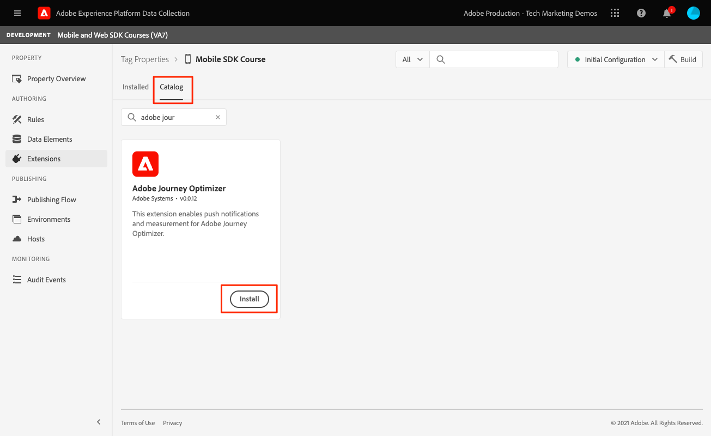
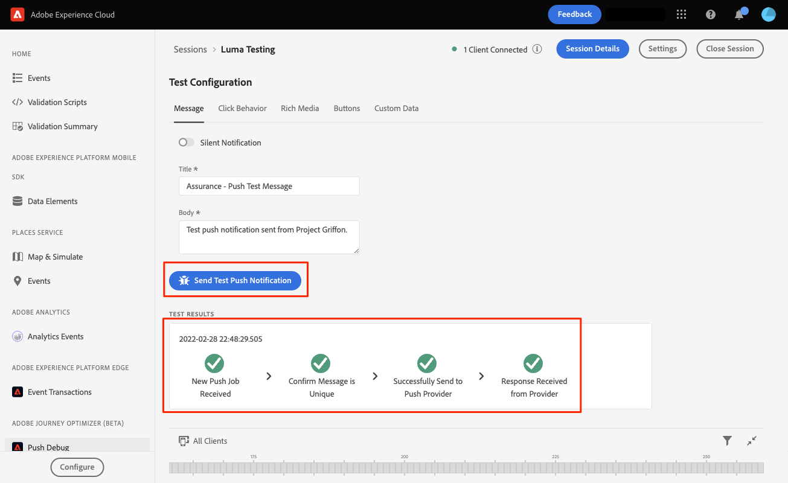

# Push-Nachrichten in Adobe Journey Optimizer

Erfahren Sie, wie Sie mit dem Platform Mobile SDK und Adobe Journey Optimizer Push-Nachrichten für mobile Apps erstellen.

Mit Journey Optimizer können Sie Ihre Journey erstellen und Nachrichten an Zielgruppen senden. Bevor Sie Push-Benachrichtigungen mit Journey Optimizer senden, müssen Sie sicherstellen, dass die richtigen Konfigurationen und Integrationen vorhanden sind. Informationen zum Datenfluss von Push-Benachrichtigungen in Adobe Journey Optimizer finden Sie unter [die Dokumentation](https://experienceleague.adobe.com/docs/journey-optimizer/using/configuration/configuration-message/push-config/push-gs.html).

>[!NOTE]
>
>Diese Lektion ist optional und gilt nur für Adobe Journey Optimizer-Benutzer, die Push-Nachrichten senden möchten.


## Voraussetzungen

* Erfolgreiche Erstellung und Ausführung der App mit installierten und konfigurierten SDKs.
* Zugriff auf Adobe Journey Optimizer und ausreichende Berechtigungen wie beschrieben [here](https://experienceleague.adobe.com/docs/journey-optimizer/using/configuration/configuration-message/push-config/push-configuration.html?lang=en). Außerdem benötigen Sie ausreichende Berechtigungen für die folgenden Adobe Journey Optimizer-Funktionen.
   * Erstellen Sie eine App-Oberfläche.
   * Erstellen einer Journey
   * Erstellen einer Nachricht.
   * Erstellen von Nachrichtenvoreinstellungen.
* Bezahltes Apple-Entwicklerkonto mit ausreichendem Zugriff zum Erstellen von Zertifikaten, Kennungen und Schlüsseln.
* Physisches iOS-Gerät zum Testen.

## Lernziele

In dieser Lektion werden Sie:

* Registrieren der App-ID beim Apple Push Notification Service (APN).
* Erstellen Sie eine **[!UICONTROL App-Oberfläche]** in AJO.
* Aktualisieren Sie Ihre **[!UICONTROL schema]** , um Push-Nachrichten einzuschließen.
* Installieren und konfigurieren Sie die **[!UICONTROL Adobe Journey Optimizer]** Tag-Erweiterung.
* Aktualisieren Sie Ihre App, um die AJO-Tag-Erweiterung einzuschließen.
* Validieren Sie die Einrichtung in &quot;Assurance&quot;.
* Senden Sie eine Testnachricht.


## App-ID mit APN registrieren

Die folgenden Schritte sind nicht Adobe Experience Cloud-spezifisch und sollen Sie durch die APN-Konfiguration führen.

### Erstellen Sie eine `.p8` privater Schlüssel

1. Navigieren Sie im Apple-Entwicklerportal zu **[!UICONTROL Schlüssel]**.
1. Wählen Sie das Symbol + aus, um einen Schlüssel zu erstellen.
   

1. Bereitstellung einer **[!UICONTROL Schlüsselname]**.
1. Wählen Sie die **[!UICONTROL APN]** aktivieren.
1. Klicken Sie auf **[!UICONTROL Weiter]**.
   
1. Überprüfen Sie die Konfiguration und wählen Sie **[!UICONTROL registrieren]**.
1. Laden Sie die `.p8` privater Schlüssel. Sie wird in der App Surface-Konfiguration verwendet.
1. Beachten Sie die **[!UICONTROL Schlüssel-ID]**. Sie wird in der App Surface-Konfiguration verwendet.

Zusätzliche Dokumentation kann [hier finden](https://help.apple.com/developer-account/#/devcdfbb56a3).

### Abrufen der Apple-Entwicklerteam-ID

1. Navigieren Sie im Apple-Entwicklerportal zu **[!UICONTROL Mitgliedschaft]**.
1. Ihre **[!UICONTROL Team-ID]** neben Ihren anderen Mitgliedseinformationen aufgeführt. Sie wird in der App Surface-Konfiguration verwendet.

## App-Push-Anmeldedaten zur Datenerfassung hinzufügen

1. Aus dem [Datenerfassungsoberfläche](https://experience.adobe.com/data-collection/)wählen Sie im linken Bereich die Registerkarte App-Oberflächen aus.
1. Auswählen **[!UICONTROL Erstellen von App-Oberflächen]** , um eine Konfiguration zu erstellen.
   
1. Geben Sie einen **[!UICONTROL Name]** für die Konfiguration, beispielsweise `Luma App Tutorial`  .
1. Wählen Sie in der Konfiguration der Mobile App die Option **[!UICONTROL Apple iOS]**.
1. Geben Sie die Bundle ID der Mobile App im Feld App-ID (iOS Bundle ID) ein. Wenn Sie der Luma-App folgen, lautet der Wert `com.adobe.luma.tutorial`.
1. Schalten Sie die **[!UICONTROL Push-Anmeldedaten]** -Schaltfläche, um Ihre Anmeldedaten hinzuzufügen.
1. Ziehen und ablegen `.p8` **Authentifizierungsschlüssel für Apple-Push-Benachrichtigungen** -Datei.
1. Geben Sie die Schlüssel-ID an, eine 10-stellige Zeichenfolge, die bei der Erstellung von `p8` Authentifizierungsschlüssel. Sie finden sie auf der Registerkarte Schlüssel auf der Seite **Zertifikate, Kennungen und Profile**.
1. Geben Sie die Team ID an. Dies ist ein string -Wert, der unter der **Mitgliedschaft** Registerkarte.
1. Wählen Sie **[!UICONTROL Speichern]** aus.
   

## Adobe Journey Optimizer-Tag-Erweiterung installieren

1. Navigieren Sie zu [!UICONTROL Tags] > [!UICONTROL Erweiterungen] > [!UICONTROL Katalog]und suchen Sie nach **[!UICONTROL Adobe Journey Optimizer]** -Erweiterung.
1. Installieren der Erweiterung.
   
1. Auswählen `CJM Push Tracking Experience Event Dataset` den Adobe Experience Platform-Datensatz.
   
1. Auswählen **[!UICONTROL In Bibliothek speichern und erstellen]**.

>[!NOTE]
>Wenn Sie &quot;CJM Push Tracking Experience Event Datensatz&quot;nicht als Option sehen, wenden Sie sich an die Kundenunterstützung.

## Implementieren von Adobe Journey Optimizer in die App

Wie in den vorherigen Lektionen erläutert, bietet die Installation einer mobilen Tag-Erweiterung nur die Konfiguration. Als Nächstes müssen Sie das Messaging SDK installieren und registrieren. Wenn diese Schritte nicht klar sind, lesen Sie bitte die [SDKs installieren](install-sdks.md) Abschnitt.

>[!NOTE]
>
>Wenn Sie die [SDKs installieren](install-sdks.md) -Abschnitt, ist das SDK bereits installiert und Sie können zu Schritt 7 überspringen.

1. Öffnen Sie Ihre `Podfile` und fügen Sie die folgende Zeile hinzu und speichern Sie die Datei.

   `pod 'AEPMessaging', '~>1'`
1. Öffnen Sie das Terminal und navigieren Sie zum Ordner, der Ihre `Podfile`.
1. Installieren des SDK durch Ausführen des Befehls `pod install`.
   
1. Öffnen Sie XCode und navigieren Sie zu `AppDelegate.swift`.
1. Fügen Sie Ihrer Importliste Folgendes hinzu.

   `import AEPMessaging`
1. Hinzufügen `Messaging.self` zum Array der Erweiterungen, die Sie registrieren.
1. Fügen Sie der Datei die folgende Funktion hinzu.

   ```swift
   func application(_: UIApplication, didRegisterForRemoteNotificationsWithDeviceToken deviceToken: Data) {
       MobileCore.setPushIdentifier(deviceToken)
   }
   ```

   Diese Funktion ruft das Geräte-Token ab, das für das Gerät eindeutig ist, auf dem die App installiert ist, und sendet es zur Push-Nachrichtenbereitstellung an Adobe/Apple.

## Validieren durch Senden einer Test-Push-Nachricht

1. Überprüfen Sie die [Einrichtungsanweisungen](assurance.md) Abschnitt.
1. Installieren Sie die App auf Ihrem physischen Gerät.
1. Starten Sie die App mithilfe der durch die Versicherung generierten URL.
1. Senden Sie die App in den Hintergrund.
1. Wählen Sie in der Assurance-Benutzeroberfläche die Option **[!UICONTROL Konfigurieren]**.
   
1. Wählen Sie die **[!UICONTROL +]** Schaltfläche neben **[!UICONTROL Push Debug]**.
1. Wählen Sie **[!UICONTROL Speichern]** aus.
   
1. Auswählen **[!UICONTROL Push Debug]** über die linke Navigation.
1. Wählen Sie Ihr Gerät aus der **[!UICONTROL Client-Liste]**.
1. Vergewissern Sie sich, dass keine Fehler auftreten.
   
1. Scrollen Sie nach unten und wählen Sie **[!UICONTROL Push-Benachrichtigung zum Testversand senden]**.
1. Vergewissern Sie sich, dass Sie keine Fehler und empfangen und dass Sie die Nachricht auf Ihrem Gerät erhalten.
   

Weiter: **[Schlussfolgerung und nächste Schritte](conclusion.md)**

>[!NOTE]
>
>Vielen Dank, dass Sie Ihre Zeit investiert haben, um mehr über das Adobe Experience Platform Mobile SDK zu erfahren. Wenn Sie Fragen haben, ein allgemeines Feedback teilen möchten oder Vorschläge zu künftigen Inhalten haben, teilen Sie diese bitte mit. [Diskussionsbeitrag der Experience League](https://experienceleaguecommunities.adobe.com/t5/adobe-experience-platform-launch/tutorial-discussion-implement-adobe-experience-cloud-in-mobile/td-p/443796)