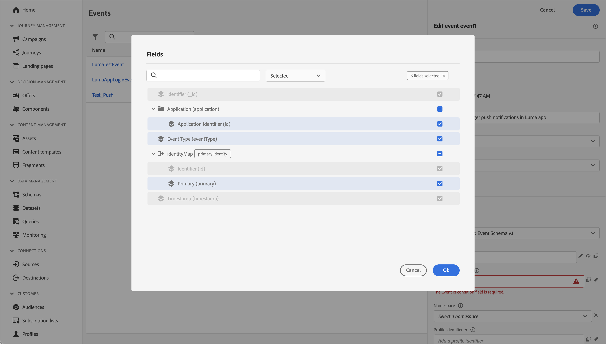

# Erstellen und Versenden von Push-Benachrichtigungen

Erfahren Sie, wie Sie Push-Benachrichtigungen für mobile Apps mit dem Experience Platform Mobile SDK und Journey Optimizer erstellen.

Mit Journey Optimizer können Sie Journey erstellen und Nachrichten an Zielgruppen senden. Bevor Sie Push-Benachrichtigungen mit Journey Optimizer senden, müssen Sie sicherstellen, dass die richtigen Konfigurationen und Integrationen vorhanden sind. Informationen zum Datenfluss von Push-Benachrichtigungen in Journey Optimizer finden Sie in der [Dokumentation](https://experienceleague.adobe.com/docs/journey-optimizer/using/push/push-config/push-gs.html).


>[!NOTE]
>
>Diese Lektion ist optional und gilt nur für Journey Optimizer-Benutzer, die Push-Benachrichtigungen versenden möchten.


## Voraussetzungen

* Die App wurde erfolgreich erstellt und mit installierten und konfigurierten SDKs ausgeführt.
* Richten Sie die App für Adobe Experience Platform ein.
* Zugriff auf Journey Optimizer und ausreichende Berechtigungen wie in [hier](https://experienceleague.adobe.com/docs/journey-optimizer/using/push/push-config/push-configuration.html?lang=en) beschrieben. Außerdem benötigen Sie ausreichende Berechtigungen für die folgenden Journey Optimizer-Funktionen.
   * Erstellen Sie eine App-Oberfläche.
   * Erstellen Sie eine Journey.
   * Erstellen Sie eine Nachricht.
   * Erstellen Sie Nachrichtenvorgaben.
* **Bezahltes Apple-Entwicklerkonto** mit ausreichendem Zugriff zum Erstellen von Zertifikaten, Kennungen und Schlüsseln.
* Physisches iOS-Gerät oder Simulator zum Testen.

## Lernziele

In dieser Lektion werden Sie

* Registrieren Sie die App-ID beim Apple Push Notification Service (APNs).
* Erstellen Sie eine App-Oberfläche in Journey Optimizer.
* Aktualisieren Sie Ihr Schema, um Push-Nachrichtenfelder einzuschließen.
* Installieren und konfigurieren Sie die Journey Optimizer-Tag-Erweiterung.
* Aktualisieren Sie Ihre App, um die Journey Optimizer-Tag-Erweiterung zu registrieren.
* Validieren Sie die Einrichtung in &quot;Assurance&quot;.
* Testnachricht aus Assurance senden
* Definieren Sie Ihr eigenes Push-Benachrichtigungsereignis, Ihre eigene Journey und Ihr eigenes Erlebnis in Journey Optimizer.
* Senden Sie Ihre eigene Push-Benachrichtigung aus der App heraus.


## Einrichten

>[!TIP]
>
>Wenn Sie Ihre Umgebung bereits im Rahmen der Lektion [Journey Optimizer-In-App-Messaging](journey-optimizer-inapp.md) eingerichtet haben, haben Sie möglicherweise bereits einige der Schritte in diesem Einrichtungsabschnitt ausgeführt.

### App-ID mit APNS registrieren

Die folgenden Schritte sind nicht Adobe Experience Cloud-spezifisch und dienen als Orientierung für die Konfiguration von APNs.

#### Privaten Schlüssel erstellen

1. Navigieren Sie im Apple-Entwicklerportal zu **[!UICONTROL Schlüssel]**.
1. Um einen Schlüssel zu erstellen, wählen Sie **[!UICONTROL +]** aus.
   

1. Geben Sie einen **[!UICONTROL Schlüsselnamen]** an.
1. Aktivieren Sie das Kontrollkästchen **[!UICONTROL Apple Push Notification Service] (APNs)** .
1. Wählen Sie **[!UICONTROL Weiter]** aus.
   
1. Überprüfen Sie die Konfiguration und wählen Sie **[!UICONTROL Registrieren]** aus.
1. Laden Sie den privaten Schlüssel `.p8` herunter. Sie wird später in dieser Lektion in der App Surface-Konfiguration verwendet.
1. Notieren Sie sich die **[!UICONTROL Schlüssel-ID]**. Sie wird in der App Surface-Konfiguration verwendet.
1. Notieren Sie sich die **[!UICONTROL Team-ID]**. Sie wird in der App Surface-Konfiguration verwendet.
   

Weitere Dokumentationen finden Sie unter ](https://help.apple.com/developer-account/#/devcdfbb56a3).[

#### App-Oberfläche zur Datenerfassung hinzufügen

1. Wählen Sie in der [Datenerfassungsoberfläche](https://experience.adobe.com/data-collection/) im linken Bereich die Option **[!UICONTROL App-Oberflächen]** aus.
1. Um eine Konfiguration zu erstellen, wählen Sie **[!UICONTROL App-Oberfläche erstellen]** aus.
   
1. Geben Sie einen **[!UICONTROL Namen]** für die Konfiguration ein, z. B. `Luma App Tutorial` .
1. Wählen Sie in **[!UICONTROL Mobile Application Configuration]** die Option **[!UICONTROL Apple iOS]** aus.
1. Geben Sie im Feld **[!UICONTROL App-ID (iOS Bundle ID)]** die App-Paket-ID ein. Beispiel: `com.adobe.luma.tutorial.swiftui`.
1. Schalten Sie den Umschalter **[!UICONTROL Push-Anmeldedaten]** ein, um Ihre Anmeldedaten hinzuzufügen.
1. Ziehen Sie die Datei `.p8` **Apple Push Notification Authentication Key** in den Arbeitsbereich.
1. Geben Sie die **[!UICONTROL Schlüssel-ID]** an, eine 10-stellige Zeichenfolge, die bei der Erstellung des `p8`-Authentifizierungsschlüssels zugewiesen wurde. Sie finden sie auf der Registerkarte **[!UICONTROL Schlüssel]** auf der Seite **Zertifikate, Kennungen und Profile** der Apple-Portal-Seiten für Entwickler. Siehe auch [Erstellen eines privaten Schlüssels](#create-a-private-key).
1. Geben Sie die **[!UICONTROL Team ID]** an. Die Team-ID ist ein Wert, der auf der Registerkarte **Mitgliedschaft** oder oben auf der Apple Developer Portal-Seite zu finden ist. Siehe auch [Erstellen eines privaten Schlüssels](#create-a-private-key).
1. Wählen Sie **[!UICONTROL Speichern]** aus.

   

### Aktualisierung der Konfiguration des Datenspeichers

Um sicherzustellen, dass Daten, die von Ihrer App an das Edge Network gesendet werden, an Journey Optimizer weitergeleitet werden, aktualisieren Sie Ihre Experience Edge-Konfiguration .

1. Wählen Sie in der Datenerfassungs-Benutzeroberfläche **[!UICONTROL Datastreams]** aus und wählen Sie Ihren Datastream aus, z. B. **[!DNL Luma Mobile App]**.
1. Wählen Sie  für **[!UICONTROL Experience Platform]** und dann  **[!UICONTROL Bearbeiten]** aus dem Kontextmenü.
1. Im Bildschirm **[!UICONTROL Datastreams]** >  > **[!UICONTROL Adobe Experience Platform]** :

   1. Wählen Sie, falls noch nicht ausgewählt, **[!UICONTROL AJO Push Profile DataSet]** aus dem **[!UICONTROL Profildatensatz]** aus. Dieser Profildatensatz ist bei Verwendung des API-Aufrufs `MobileCore.setPushIdentifier` erforderlich (siehe [Registrieren des Geräte-Tokens für Push-Benachrichtigungen](#register-device-token-for-push-notifications)), der sicherstellt, dass die eindeutige Kennung für Push-Benachrichtigungen (auch Push-Kennung genannt) als Teil des Benutzerprofils gespeichert wird.

   1. **[!UICONTROL Adobe Journey Optimizer]** ausgewählt ist. Weitere Informationen finden Sie unter [Adobe Experience Platform-Einstellungen](https://experienceleague.adobe.com/docs/experience-platform/datastreams/configure.html?lang=en#aep) .

   1. Wählen Sie **[!UICONTROL Speichern]** aus, um Ihre Datastream-Konfiguration zu speichern.

   


### Journey Optimizer-Tag-Erweiterung installieren

Damit Ihre App mit Journey Optimizer verwendet werden kann, müssen Sie Ihre Tag-Eigenschaft aktualisieren.

1. Navigieren Sie zu **[!UICONTROL Tags]** > **[!UICONTROL Erweiterungen]** > **[!UICONTROL Katalog]**,
1. Öffnen Sie Ihre Eigenschaft, z. B. **[!DNL Luma Mobile App Tutorial]**.
1. Wählen Sie **[!UICONTROL Katalog]** aus.
1. Suchen Sie nach der Erweiterung **[!UICONTROL Adobe Journey Optimizer]** .
1. Installieren Sie die -Erweiterung.
1. Im Dialogfeld **[!UICONTROL Erweiterung installieren]**
   1. Wählen Sie eine Umgebung aus, z. B. **[!UICONTROL Entwicklung]**.
   1. Wählen Sie den Datensatz **[!UICONTROL AJO Push Tracking Experience Event Datensatz]** aus der Liste **[!UICONTROL Ereignisdatensatz]** aus.
   1. Wählen Sie **[!UICONTROL In Bibliothek speichern und erstellen]**.
      

>[!NOTE]
>
>Wenn Sie nicht sehen, dass der AJO-Datensatz für Push-Tracking-Erlebnisereignisse ]**eine Option ist, wenden Sie sich an den Kundendienst.**[!UICONTROL 
>

## Validieren der Einrichtung mit Assurance

1. Lesen Sie den Abschnitt [Setup instructions](assurance.md#connecting-to-a-session) , um Ihren Simulator oder Ihr Gerät mit Assurance zu verbinden.
1. Wählen Sie in der Assurance-Benutzeroberfläche **[!UICONTROL Konfigurieren]** aus.
   
1. Wählen Sie &quot;&quot;neben &quot;**[!UICONTROL Push Debug]**&quot;.
1. Wählen Sie **[!UICONTROL Speichern]** aus.
   
1. Wählen Sie im linken Navigationsbereich **[!UICONTROL Debug pushen]** aus.
1. Wählen Sie die Registerkarte **[!UICONTROL Einrichtung validieren]** aus.
1. Wählen Sie Ihr Gerät aus der Liste **[!UICONTROL Client]** aus.
1. Vergewissern Sie sich, dass keine Fehler auftreten.
   
1. Wählen Sie die Registerkarte **[!UICONTROL Testversand durchführen]** aus.
1. (optional) Ändern Sie die Standarddetails für **[!UICONTROL Titel]** und **[!UICONTROL Hauptteil]**
1. Wählen Sie  **[!UICONTROL Test Push-Benachrichtigung senden]** aus.
1. Überprüfen Sie die **[!UICONTROL Testergebnisse]**.
1. Die Test-Push-Benachrichtigung sollte in Ihrer App angezeigt werden.

   


## Signing

Das Signieren der Luma-App ist zum Senden von Push-Benachrichtigungen erforderlich und **erfordert ein gebührenpflichtiges Apple-Entwicklerkonto**.

So aktualisieren Sie die Signatur für Ihre App:

1. Rufen Sie Ihre App in Xcode auf.
1. Wählen Sie im Projektnavigator **[!DNL Luma]** aus.
1. Wählen Sie das Ziel **[!DNL Luma]** aus.
1. Wählen Sie die Registerkarte **Signing &amp; Capabilities** aus.
1. Konfigurieren Sie **[!UICONTROL Automatische Verwaltung der Signierung]**, **[!UICONTROL Team]** und die **[!UICONTROL Bundle-Kennung]** oder verwenden Sie Ihre spezifischen Apple-Entwicklungsbereitstellungsdetails.

   >[!IMPORTANT]
   >
   >Stellen Sie sicher, dass Sie eine _eindeutige_ Bundle-ID verwenden und die `com.adobe.luma.tutorial.swiftui` -Bundle-ID ersetzen, da jede Bundle-ID eindeutig sein muss. Normalerweise verwenden Sie ein Reverse-DNS-Format für Bundle-ID-Zeichenfolgen, z. B. `com.organization.brand.uniqueidentifier`. Die abgeschlossene Version dieses Tutorials verwendet beispielsweise `com.adobe.luma.tutorial.swiftui`.


   {zoomable="yes"}


## Hinzufügen von Push-Benachrichtigungsfunktionen zu Ihrer App

>[!IMPORTANT]
>
>Um Push-Benachrichtigungen in eine iOS-App zu implementieren und zu testen, müssen Sie über ein Apple-Entwicklerkonto mit dem Status **paid** verfügen. Wenn Sie kein gebührenpflichtiges Apple-Entwicklerkonto haben, können Sie den Rest dieser Lektion überspringen.

1. Wählen Sie in Xcode **[!DNL Luma]** aus der Liste **[!UICONTROL ZIELGRUPPEN]**, wählen Sie die Registerkarte **[!UICONTROL Signing &amp; Capabilities]**, klicken Sie auf die Schaltfläche **[!UICONTROL + Capability]** und wählen Sie dann **[!UICONTROL Push Notifications]**. Dadurch kann Ihre App Push-Benachrichtigungen empfangen.

1. Als Nächstes müssen Sie der App eine Benachrichtigungserweiterung hinzufügen. Gehen Sie zurück zur Registerkarte **[!DNL General]** und wählen Sie das Symbol **[!UICONTROL +]** unten im Abschnitt **[!UICONTROL ZIELGRUPPEN]** aus.

1. Sie werden aufgefordert, die Vorlage für Ihr neues Ziel auszuwählen. Wählen Sie **[!UICONTROL Erweiterung des Benachrichtigungsdienstes]** und dann **[!UICONTROL Weiter]** aus.

1. Verwenden Sie im nächsten Fenster `NotificationExtension` als Namen der Erweiterung und klicken Sie auf die Schaltfläche **[!UICONTROL Beenden]** .

Sie sollten Ihrer App jetzt eine Push-Benachrichtigungs-Erweiterung hinzufügen, ähnlich dem unten stehenden Bildschirm.


## Implementieren von Journey Optimizer in die App

Wie in den vorherigen Lektionen erläutert, bietet die Installation einer mobilen Tag-Erweiterung nur die Konfiguration. Als Nächstes müssen Sie das Messaging SDK installieren und registrieren. Wenn diese Schritte nicht klar sind, lesen Sie den Abschnitt [SDKs installieren](install-sdks.md) .

>[!NOTE]
>
>Wenn Sie den Abschnitt [SDK installieren](install-sdks.md) abgeschlossen haben, ist das SDK bereits installiert und Sie können diesen Schritt überspringen.
>

1. Stellen Sie in Xcode sicher, dass [AEP Messaging](https://github.com/adobe/aepsdk-messaging-ios) zur Liste der Pakete in Package-Abhängigkeiten hinzugefügt wird. Siehe [Swift Package Manager](install-sdks.md#swift-package-manager).
1. Navigieren Sie im Xcode Project-Navigator zu **[!DNL Luma]** > **[!DNL Luma]** > **[!UICONTROL AppDelegate]** .
1. Stellen Sie sicher, dass `AEPMessaging` Teil Ihrer Importliste ist.

   `import AEPMessaging`

1. Stellen Sie sicher, dass `Messaging.self` Teil des Arrays von Erweiterungen ist, die Sie registrieren.

   ```swift
   let extensions = [
       AEPIdentity.Identity.self,
       Lifecycle.self,
       Signal.self,
       Edge.self,
       AEPEdgeIdentity.Identity.self,
       Consent.self,
       UserProfile.self,
       Places.self,
       Messaging.self,
       Optimize.self,
       Assurance.self
   ]
   ```

## Geräte-Token für Push-Benachrichtigungen registrieren

1. Fügen Sie die API [`MobileCore.setPushIdentifier`](https://developer.adobe.com/client-sdks/documentation/mobile-core/api-reference/#setpushidentifier) zur Funktion `func application(_ application: UIApplication, didRegisterForRemoteNotificationsWithDeviceToken deviceToken: Data)` hinzu.

   ```swift
   // Send push token to Mobile SDK
   MobileCore.setPushIdentifier(deviceToken)
   ```

   Diese Funktion ruft das Geräte-Token ab, das für das Gerät eindeutig ist, auf dem die App installiert ist. Legt dann das Token für den Push-Benachrichtigungsversand mithilfe der von Ihnen eingerichteten Konfiguration fest, die sich auf den Push-Benachrichtigungsdienst (APNs) von Apple stützt.

>[!IMPORTANT]
>
>Der `MobileCore.updateConfigurationWith(configDict: ["messaging.useSandbox": true])` bestimmt, ob Push-Benachrichtigungen eine APN-Sandbox oder einen Produktionsserver zum Senden von Push-Benachrichtigungen verwenden. Stellen Sie beim Testen Ihrer App im Simulator oder auf einem Gerät sicher, dass `messaging.useSandbox` auf `true` gesetzt ist, damit Sie Push-Benachrichtigungen erhalten. Stellen Sie bei der Bereitstellung Ihrer App für Produktionstests mit Apple Testflight sicher, dass Sie `messaging.useSandbox` auf `false` setzen, da ansonsten Ihre Produktions-App keine Push-Benachrichtigungen empfangen kann.


## Erstellen einer eigenen Push-Benachrichtigung

Um eine eigene Push-Benachrichtigung zu erstellen, müssen Sie in Journey Optimizer ein Ereignis definieren, das einen Journey Trigger, der die Push-Benachrichtigung sendet.

### Schema aktualisieren

Sie werden einen neuen Ereignistyp definieren, der noch nicht als Teil der Liste der in Ihrem Schema definierten Ereignisse verfügbar ist. Sie verwenden diesen Ereignistyp später beim Auslösen von Push-Benachrichtigungen.

1. Wählen Sie in der Journey Optimizer-Benutzeroberfläche in der linken Leiste **[!UICONTROL Schemas]** aus.
1. Wählen Sie in der Registerkartenleiste **[!UICONTROL Durchsuchen]** aus.
1. Wählen Sie Ihr Schema aus, z. B. **[!DNL Luma Mobile App Event Schema]** , um es zu öffnen.
1. Im Schema-Editor:
   1. Wählen Sie das Feld **[!UICONTROL eventType]** aus.
   1. Scrollen Sie im Bereich **[!UICONTROL Feldeigenschaften]** nach unten, um die Liste der möglichen Werte für den Ereignistyp anzuzeigen. Wählen Sie **[!UICONTROL Zeile hinzufügen]** und fügen Sie `application.test` als **[!UICONTROL WERT]** und `[!UICONTROL Test event for push notification]` als `DISPLAY NAME` hinzu.
   1. Wählen Sie **[!UICONTROL Anwenden]** aus.
   1. Wählen Sie **[!UICONTROL Speichern]** aus.
      

### Ereignis definieren

Ereignisse in Journey Optimizer ermöglichen den einheitlichen Trigger Ihrer Journey, Nachrichten, z. B. Push-Benachrichtigungen, zu senden. Weitere Informationen finden Sie unter [Über Ereignisse](https://experienceleague.adobe.com/docs/journey-optimizer/using/configuration/configure-journeys/events-journeys/about-events.html?lang=en) .

1. Wählen Sie in der Journey Optimizer-Benutzeroberfläche in der linken Leiste **[!UICONTROL Konfigurationen]** aus.

1. Wählen Sie im Bildschirm **[!UICONTROL Dashboard]** die Schaltfläche **[!UICONTROL Verwalten]** in der Kachel **[!UICONTROL Ereignisse]** aus.

1. Wählen Sie im Bildschirm **[!UICONTROL Ereignisse]** die Option **[!UICONTROL Ereignis erstellen]**.

1. Im Bereich **[!UICONTROL Ereignis bearbeiten1]** :

   1. Geben Sie `LumaTestEvent` als **[!UICONTROL Name]** des Ereignisses ein.
   1. Geben Sie eine **[!UICONTROL Beschreibung]** an, z. B. `Test event to trigger push notifications in Luma app`.

   1. Wählen Sie das Erlebnisereignisschema der Mobile App aus, das Sie zuvor in [Erstellen eines XDM-Schemas](create-schema.md) aus der Liste **[!UICONTROL Schema]** erstellt haben, z. B. **[!DNL Luma Mobile App Event Schema v.1]**.
   1. Wählen Sie  neben der Liste **[!UICONTROL Felder]** aus.

      

      Stellen Sie im Dialogfeld **[!UICONTROL Felder]** sicher, dass die folgenden Felder ausgewählt sind (über den immer ausgewählten Standardfeldern (**[!UICONTROL _id]**, **[!UICONTROL id]** und **[!UICONTROL timestamp]**). Sie können mithilfe der Dropdown-Liste zwischen **[!UICONTROL Ausgewählt]**, **[!UICONTROL Alle]** und **[!UICONTROL Primär]** umschalten oder das Feld  verwenden.

      * **[!UICONTROL Application Identified (id)]**,
      * **[!UICONTROL Ereignistyp (eventType)]**,
      * **[!UICONTROL Primär (primär)]**.

      

      Wählen Sie dann **[!UICONTROL OK]** aus.

   1. Wählen Sie &quot;&quot;neben dem Feld **[!UICONTROL Ereignis-ID-Bedingung]**&quot;.

      1. Ziehen Sie im Dialogfeld **[!UICONTROL Ereignis-ID-Bedingung hinzufügen]** den Eintrag **[!UICONTROL Ereignistyp (eventType)]** auf **[!UICONTROL Element hierher ziehen und ablegen]**.
      1. Scrollen Sie im Popup-Fenster nach unten und wählen Sie **[!UICONTROL application.test]** aus (der Ereignistyp, den Sie zuvor zur Liste der Ereignistypen im Rahmen von [Schema aktualisieren](#update-your-schema) hinzugefügt haben). Scrollen Sie dann nach oben und wählen Sie **[!UICONTROL OK]** aus.
      1. Wählen Sie **[!UICONTROL OK]** aus, um die Bedingung zu speichern.
         

   1. Wählen Sie **[!UICONTROL ECID (ECID)]** aus der Liste **[!UICONTROL Namespace]** aus. Das Feld **[!UICONTROL Profilkennung]** wird automatisch mit **[!UICONTROL Die ID des ersten Elements des Schlüssels ECID für die map identityMap]** ausgefüllt.
   1. Wählen Sie **[!UICONTROL Speichern]** aus.
      

Sie haben soeben eine Ereigniskonfiguration erstellt, die auf dem Erlebnisereignisschema der Mobile App basiert, das Sie im Rahmen dieses Tutorials zuvor erstellt haben. Diese Ereigniskonfiguration filtert eingehende Erlebnisereignisse nach Ihrem spezifischen Ereignistyp (`application.test`), sodass nur Ereignisse mit diesem bestimmten Typ, die von Ihrer mobilen App aus initiiert werden, im nächsten Schritt die von Ihnen erstellte Journey Trigger werden. In einem realen Szenario möchten Sie möglicherweise Push-Benachrichtigungen von einem externen Dienst versenden. Dabei gelten jedoch die gleichen Konzepte: Von der externen Anwendung senden Sie ein Erlebnisereignis an Experience Platform, das spezifische Felder aufweist, auf die Sie Bedingungen anwenden können, bevor diese Ereignisse Trigger einer Journey werden.

### Journey erstellen

Als Nächstes erstellen Sie die Journey, die beim Empfang des entsprechenden Ereignisses den Versand der Push-Benachrichtigung an den Trigger sendet.

1. Wählen Sie in der Journey Optimizer-Benutzeroberfläche in der linken Leiste **[!UICONTROL Journey]** aus.
1. Wählen Sie **[!UICONTROL Journey erstellen]** aus.
1. Im Bereich **[!UICONTROL Journey-Eigenschaften]** :

   1. Geben Sie einen **[!UICONTROL Namen]** für die Journey ein, z. B. `Luma - Test Push Notification Journey`.
   1. Geben Sie eine **[!UICONTROL Beschreibung]** für die Journey ein, z. B. `Journey for test push notifications in Luma mobile app`.
   1. Stellen Sie sicher, dass **[!UICONTROL Neueintritt zulassen]** ausgewählt ist, und legen Sie die Wartezeit für den erneuten Eintritt ]**auf**[!UICONTROL  30 ]****[!UICONTROL  Sekunden ]**fest.**[!UICONTROL 
   1. Klicken Sie auf **[!UICONTROL OK]**.
      

1. Zurück auf der Journey-Arbeitsfläche ziehen Sie aus den **[!UICONTROL EREIGNISSEN]** Ihr  **[!DNL LumaTestEvent]** per Drag-and-Drop auf die Arbeitsfläche, auf der **[!UICONTROL Wählen Sie ein Eintrittsereignis oder die Aktivität &quot;Zielgruppe lesen&quot;]** angezeigt wird.

   * Geben Sie im Bedienfeld **[!UICONTROL Ereignisse: LumaTestEvent]** einen **[!UICONTROL Titel]** ein, z. B. `Luma Test Event`.

1. Ziehen Sie aus dem Dropdown-Menü **[!UICONTROL AKTIONEN]** den Eintrag  **[!UICONTROL Push]** auf den Eintrag  , der rechts von Ihrer **[!DNL LumaTestEvent]** -Aktivität angezeigt wird. Im Bereich **[!UICONTROL Aktionen: Push]** :

   1. Geben Sie eine **[!UICONTROL Bezeichnung]** an, z. B. `Luma Test Push Notification`, geben Sie eine **[!UICONTROL Beschreibung]** ein, z. B. `Test push notification for Luma mobile app`, wählen Sie **[!UICONTROL Transactional]** aus der Liste **[!UICONTROL Kategorie]** und wählen Sie **[!DNL Luma]** aus der Liste **[!UICONTROL Push-Oberfläche]**.
   1. Wählen Sie  **[!UICONTROL Inhalt bearbeiten]** aus, um die eigentliche Push-Benachrichtigung zu bearbeiten.
      

      Im Editor **[!UICONTROL Push Notification]** :

      1. Geben Sie einen **[!UICONTROL Titel]** ein, z. B. `Luma Test Push Notification`, und geben Sie einen **[!UICONTROL Hauptteil]** ein, z. B. `Test push notification for Luma mobile app`.
      1. Optional können Sie einen Link zu einem Bild (.png oder .jpg) in **[!UICONTROL Medien hinzufügen]** eingeben. Wenn Sie dies tun, wird das Bild Teil der Push-Benachrichtigung sein.
      1. Um den Editor zu speichern und zu verlassen, wählen Sie  aus.
         

   1. Um die Definition der Push-Benachrichtigung zu speichern und abzuschließen, wählen Sie **[!UICONTROL OK]** aus.

1. Ihre Journey sollte wie unten dargestellt aussehen. Wählen Sie **[!UICONTROL Publish]** aus, um Ihre Journey zu veröffentlichen und zu aktivieren.
   


## Trigger der Push-Benachrichtigung

Sie verfügen über alle nötigen Bestandteile, um eine Push-Benachrichtigung zu versenden. Was bleibt, ist, wie diese Push-Benachrichtigung Trigger wird. Im Wesentlichen ist dies dasselbe wie zuvor: Senden Sie einfach ein Erlebnisereignis mit der richtigen Payload (wie in [Ereignisse](events.md)).

Diesmal wird das Erlebnisereignis, das Sie senden möchten, nicht zum Erstellen eines einfachen XDM-Wörterbuchs erstellt. Sie verwenden einen `struct` , der eine Push-Benachrichtigungs-Payload darstellt. Die Definition eines dedizierten Datentyps ist eine alternative Methode zur Implementierung der Erstellung von Erlebnisereignis-Payloads in Ihrer Anwendung.

1. Navigieren Sie im Xcode Project-Navigator zu &quot;**[!DNL Luma]** > **[!DNL Luma]** > **[!UICONTROL Modell]** > **[!UICONTROL XDM]** > **[!UICONTROL TestPushPayload]**&quot;und überprüfen Sie den Code.

   ```swift
   import Foundation
   
   // MARK: - TestPush
   struct TestPushPayload: Codable {
      let application: Application
      let eventType: String
   }
   
   // MARK: - Application
   struct Application: Codable {
      let id: String
   }
   ```

   Der Code stellt die folgende einfache Payload dar, die Sie an den Trigger Ihrer Test-Push-Benachrichtigung senden werden Journey

   ```json
   {
      "eventType": string,
      "application" : [
          "id": string
      ]
   }
   ```

1. Navigieren Sie im Xcode Project-Navigator zu **[!DNL Luma]** > **[!DNL Luma]** > **[!DNL Utils]** > **[!UICONTROL MobileSDK]** und fügen Sie den folgenden Code zu `func sendTestPushEvent(applicationId: String, eventType: String)` hinzu:

   ```swift
   // Create payload and send experience event
   Task {
       let testPushPayload = TestPushPayload(
           application: Application(
               id: applicationId
           ),
           eventType: eventType
       )
       // send the final experience event
       await sendExperienceEvent(
           xdm: testPushPayload.asDictionary() ?? [:]
       )
   }
   ```

   Dieser Code erstellt eine `testPushPayload` -Instanz mithilfe der Parameter, die der Funktion (`applicationId` und `eventType`) bereitgestellt werden, und ruft dann `sendExperienceEvent` auf, während die Payload in ein Wörterbuch konvertiert wird. Dieser Code berücksichtigt diesmal auch die asynchronen Aspekte des Aufrufs des Adobe Experience Platform-SDK, indem er das Swift-Parallelitätsmodell verwendet, das auf `await` und `async` basiert.

1. Navigieren Sie im Xcode Project-Navigator zu **[!DNL Luma]** > **[!DNL Luma]** > **[!DNL Views]** > **[!DNL General]** > **[!UICONTROL ConfigView]** . Fügen Sie in der Definition der Push-Benachrichtigungsschaltfläche den folgenden Code hinzu, um die Payload des Erlebnisereignisses für Push-Benachrichtigungen zu senden, die bei jedem Tippen auf diese Schaltfläche auf Ihre Journey Trigger werden.

   ```swift
   // Setting parameters and calling function to send push notification
   Task {
       let eventType = testPushEventType
       let applicationId = Bundle.main.bundleIdentifier ?? "No bundle id found"
       await MobileSDK.shared.sendTestPushEvent(applicationId: applicationId, eventType: eventType)
   }
   ```


## Validieren mit Ihrer App

1. Erstellen Sie die App im Simulator oder auf einem physischen Gerät aus Xcode neu und führen Sie sie mit  aus.

1. Gehen Sie zur Registerkarte **[!UICONTROL Einstellungen]** .

1. Tippen Sie auf **[!UICONTROL Push-Benachrichtigung]**. Die Push-Benachrichtigung wird in Ihrer App angezeigt.

   


## Nächste Schritte

Sie sollten jetzt über alle Tools verfügen, um Push-Benachrichtigungen in Ihrer App zu verarbeiten. Sie können beispielsweise eine Journey in Journey Optimizer erstellen, die eine Willkommens-Push-Benachrichtigung sendet, wenn sich ein Anwender der App anmeldet. Oder eine Push-Benachrichtigung zur Bestätigung, wenn ein Benutzer ein Produkt in der App kauft. Oder gibt den Geofence eines Standorts ein (wie Sie in der Lektion [Places](places.md) sehen werden).

>[!SUCCESS]
>
>Sie haben die App jetzt für Push-Benachrichtigungen mit Journey Optimizer und der Journey Optimizer-Erweiterung für das Experience Platform Mobile SDK aktiviert.
>
>Vielen Dank, dass Sie Ihre Zeit investiert haben, um mehr über das Adobe Experience Platform Mobile SDK zu erfahren. Wenn Sie Fragen haben, allgemeine Rückmeldungen oder Anregungen zu zukünftigen Inhalten haben möchten, teilen Sie diese in diesem [Experience League Community-Diskussionbeitrag](https://experienceleaguecommunities.adobe.com/t5/adobe-experience-platform-data/tutorial-discussion-implement-adobe-experience-cloud-in-mobile/td-p/443796) mit.

Weiter: **[In-App-Nachrichten erstellen und senden](journey-optimizer-inapp.md)**
