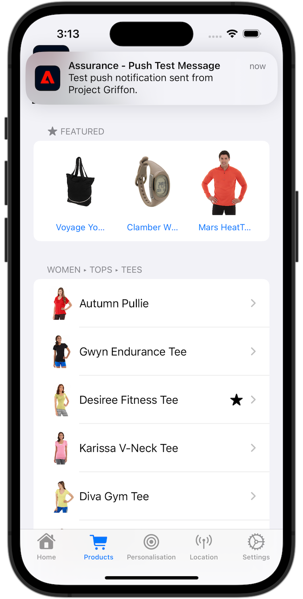

# Erstellen und Versenden von Push-Benachrichtigungen

Erfahren Sie, wie Sie Push-Benachrichtigungen für Mobile Apps mit Experience Platform Mobile SDK und Journey Optimizer erstellen.

Mit Journey Optimizer können Sie Journey erstellen und Nachrichten an ausgewählte Zielgruppen senden. Bevor Sie Push-Benachrichtigungen mit Journey Optimizer senden, müssen Sie sicherstellen, dass die richtigen Konfigurationen und Integrationen vorhanden sind. Informationen zum Datenfluss von Push-Benachrichtigungen in Journey Optimizer finden Sie in der [Dokumentation](https://experienceleague.adobe.com/docs/journey-optimizer/using/push/push-config/push-gs.html).


>[!NOTE]
>
>Diese Lektion ist optional und gilt nur für Journey Optimizer-Benutzende, die Push-Benachrichtigungen senden möchten.


## Voraussetzungen

* Die App wurde erfolgreich erstellt und ausgeführt, wobei SDKs installiert und konfiguriert wurden.
* Richten Sie die App für Adobe Experience Platform ein.
* Zugriff auf Journey Optimizer und ausreichende Berechtigungen wie [hier](https://experienceleague.adobe.com/docs/journey-optimizer/using/push/push-config/push-configuration.html?lang=en) beschrieben. Außerdem benötigen Sie ausreichende Berechtigungen für die folgenden Journey Optimizer-Funktionen.
   * Erstellen einer Programmoberfläche.
   * Erstellen Sie eine Journey.
   * Erstellen einer Nachricht.
   * Erstellen von Nachrichtenvoreinstellungen.
* **Paid Apple-**) mit ausreichendem Zugriff zum Erstellen von Zertifikaten, Kennungen und Schlüsseln.
* Physikalisches iOS-Gerät oder Simulator für Tests.

## Lernziele

In dieser Lektion werden Sie

* Registrieren der App-ID beim Apple Push Notification Service (APNs).
* Erstellen einer App-Oberfläche in Journey Optimizer.
* Aktualisieren Sie Ihr Schema, um Push-Messaging-Felder einzuschließen.
* Installieren und konfigurieren Sie die Tag-Erweiterung von Journey Optimizer.
* Aktualisieren Sie Ihre App, um die Journey Optimizer-Tag-Erweiterung zu registrieren.
* Überprüfen Sie das Setup in Assurance.
* Senden einer Testnachricht von Assurance
* Definieren Sie Ihr eigenes Push-Benachrichtigungsereignis, Journey und Erlebnis in Journey Optimizer.
* Senden Sie Ihre eigene Push-Benachrichtigung aus der App heraus.


## Einrichten

>[!TIP]
>
>Wenn Sie Ihre Umgebung bereits im Rahmen der Lektion [Journey Optimizer-In-App-Messaging](journey-optimizer-inapp.md) eingerichtet haben, haben Sie möglicherweise bereits einige der Schritte in diesem Setup-Abschnitt ausgeführt.

### App-ID bei APNs registrieren

Die folgenden Schritte sind nicht Adobe Experience Cloud-spezifisch und sollen Sie durch die APNs-Konfiguration führen.

#### Erstellen eines privaten Schlüssels

1. Navigieren Sie im Apple-Entwicklerportal zu **[!UICONTROL Keys]**.
1. Um einen Schlüssel zu erstellen, wählen Sie **[!UICONTROL +]** aus.
   

1. Geben Sie einen **[!UICONTROL Schlüsselnamen“]**.
1. Aktivieren Sie das Kontrollkästchen **[!UICONTROL Apple Push Notification Service] (APNs**.
1. Wählen Sie **[!UICONTROL Weiter]** aus.
   
1. Überprüfen Sie die Konfiguration und wählen Sie **[!UICONTROL Registrieren]**.
1. Laden Sie den privaten `.p8`-Schlüssel herunter. Sie wird in der Konfiguration der Programmoberfläche weiter unten in dieser Lektion verwendet.
1. Notieren Sie sich die **[!UICONTROL Schlüssel-ID]**. Sie wird in der App-Oberflächenkonfiguration verwendet.
1. Notieren Sie sich die **[!UICONTROL Team ID]**. Sie wird in der App-Oberflächenkonfiguration verwendet.
   

Weitere Dokumentationen finden Sie [hier](https://help.apple.com/developer-account/#/devcdfbb56a3).

#### Hinzufügen einer Programmoberfläche in der Datenerfassung

1. Wählen Sie in [Datenerfassungsoberfläche](https://experience.adobe.com/data-collection/) im linken ]**die Option**[!UICONTROL  App-Oberflächen aus.
1. Um eine Konfiguration zu erstellen, wählen Sie **[!UICONTROL App-Oberfläche erstellen]** aus.
   
1. Geben Sie einen **[!UICONTROL Namen]** für die Konfiguration ein, z. B. `Luma App Tutorial` .
1. Wählen **[!UICONTROL unter „Konfiguration von Mobile]**&quot; die Option **[!UICONTROL Apple iOS]** aus.
1. Geben Sie die Bundle ID der Mobile App im Feld **[!UICONTROL App ID (iOS Bundle ID)]** ein. Beispiel: `com.adobe.luma.tutorial.swiftui`.
1. Schalten Sie den Umschalter **[!UICONTROL Push-Anmeldeinformationen]** ein, um Ihre Anmeldeinformationen hinzuzufügen.
1. Datei mit dem `.p8` **Apple Push Notification Authentication Key** per Drag-and-Drop ablegen.
1. Geben Sie die **[!UICONTROL Schlüssel-ID]** an, eine 10-stellige Zeichenfolge, die bei der Erstellung `p8` Authentifizierungsschlüssels zugewiesen wurde. Sie finden diese auf der Registerkarte **[!UICONTROL Schlüssel]** auf der Seite **Zertifikate, Kennungen und Profile** der Apple Developer Portal-Seiten. Siehe auch [Erstellen eines privaten Schlüssels](#create-a-private-key).
1. Geben Sie die **[!UICONTROL Team ID]** an. Die Team-ID ist ein Wert, der auf der Registerkarte **Mitgliedschaft** oder oben auf der Apple Developer Portal-Seite zu finden ist. Siehe auch [Erstellen eines privaten Schlüssels](#create-a-private-key).
1. Wählen Sie **[!UICONTROL Speichern]** aus.

   

### Aktualisieren der Datenstromkonfiguration

Um sicherzustellen, dass Daten von Ihrer Mobile App an das Edge Network Journey Optimizer weitergeleitet werden, aktualisieren Sie Ihre Experience Edge-Konfiguration .

1. Wählen Sie in der Datenerfassungs-Benutzeroberfläche **[!UICONTROL Datenströme]** und wählen Sie Ihren Datenstrom aus, z. B. **[!DNL Luma Mobile App]**.
1. Experience Platform Wählen Sie  für **** und wählen Sie  **[!UICONTROL Bearbeiten]** aus dem Kontextmenü.
1. Im Bildschirm **[!UICONTROL Datenströme]** >  > **[!UICONTROL Adobe Experience Platform]**:

   1. Wählen Sie, falls noch nicht ausgewählt, **[!UICONTROL AJO Push Profile Dataset]** aus **[!UICONTROL Profile Dataset]**. Dieser Profildatensatz ist bei Verwendung des `MobileCore.setPushIdentifier`-API-Aufrufs erforderlich (siehe [Registrieren des Geräte-Tokens für Push-Benachrichtigungen](#register-device-token-for-push-notifications)), wodurch sichergestellt wird, dass die eindeutige Kennung für Push-Benachrichtigungen (auch als Push-Kennung bezeichnet) als Teil des Profils des Benutzers gespeichert wird.

   1. **[!UICONTROL Adobe Journey Optimizer]** ist ausgewählt. Weitere Informationen finden Sie unter {](https://experienceleague.adobe.com/docs/experience-platform/datastreams/configure.html?lang=en#aep)}Adobe Experience Platform-Einstellungen.[

   1. Um Ihre Datenstromkonfiguration zu speichern, wählen Sie **[!UICONTROL Speichern]** aus.

   


### Installieren der Journey Optimizer Tags-Erweiterung

Damit Ihre App mit Journey Optimizer verwendet werden kann, müssen Sie Ihre Tag-Eigenschaft aktualisieren.

1. Navigieren Sie **[!UICONTROL Tags]** > **[!UICONTROL Erweiterungen]** > **[!UICONTROL Katalog]**,
1. Öffnen Sie die Eigenschaft, z. B. **[!DNL Luma Mobile App Tutorial]**.
1. Wählen Sie **[!UICONTROL Katalog]** aus.
1. Suchen Sie nach der Erweiterung **[!UICONTROL Adobe Journey Optimizer]**.
1. Installieren Sie die Erweiterung .
1. Im Dialogfeld **[!UICONTROL Erweiterung installieren]**
   1. Wählen Sie eine Umgebung aus, zum Beispiel **[!UICONTROL Entwicklung]**.
   1. Wählen Sie den Datensatz **[!UICONTROL AJO Push-Tracking-Erlebnisereignis-]** aus der Liste **[!UICONTROL Ereignisdatensatz]** aus.
   1. Wählen Sie **[!UICONTROL In Bibliothek speichern und erstellen]**.
      

>[!NOTE]
>
>Wenn Sie **[!UICONTROL AJO Push-Tracking-Erlebnisereignis-Datensatz]** nicht als Option sehen, wenden Sie sich an die Kundenunterstützung.
>

## Überprüfen des Setups mit Assurance

1. Lesen Sie den Abschnitt [Setup-Anweisungen](assurance.md#connecting-to-a-session), um Ihren Simulator oder Ihr Gerät mit Assurance zu verbinden.
1. Wählen Sie in der Assurance-Benutzeroberfläche **[!UICONTROL Konfigurieren]** aus.
   
1. Wählen Sie  neben **[!UICONTROL Push-Debugging]** aus.
1. Wählen Sie **[!UICONTROL Speichern]** aus.
   
1. Wählen **[!UICONTROL Debug pushen]** in der linken Navigationsleiste aus.
1. Wählen Sie die Registerkarte **[!UICONTROL Einrichtung überprüfen]** aus.
1. Wählen Sie Ihr Gerät in der Liste **[!UICONTROL Client]** aus.
1. Vergewissern Sie sich, dass Sie keine Fehler erhalten.
   
1. Wählen Sie die Registerkarte **[!UICONTROL Test-Push senden]** aus.
1. (Optional) Ändern Sie die Standarddetails für **[!UICONTROL Titel]** und **[!UICONTROL Hauptteil]**
1. Wählen Sie  **[!UICONTROL Test-Push-Benachrichtigung senden]**.
1. Überprüfen Sie **[!UICONTROL Testergebnisse]**.
1. Die Test-Push-Benachrichtigung sollte nun in Ihrer App angezeigt werden.

   


## Signieren

Das Signieren der Luma-App ist erforderlich, um Push-Benachrichtigungen zu senden **erfordert ein gebührenpflichtiges Apple-Entwicklerkonto**.

So aktualisieren Sie die Signatur für Ihre App:

1. Rufen Sie Ihre App in Xcode auf.
1. Wählen Sie **[!DNL Luma]** im Projekt-Navigator aus.
1. Wählen Sie die **[!DNL Luma]** aus.
1. Wählen Sie die Registerkarte **Signierung und Funktionen** aus.
1. Konfigurieren Sie **[!UICONTROL Automatische Signaturverwaltung]**, **[!UICONTROL Team]** und **[!UICONTROL Bundle-]** oder verwenden Sie Ihre spezifischen Bereitstellungsdetails für die Apple-Entwicklung.

   >[!IMPORTANT]
   >
   >Stellen Sie sicher _dass Sie eine_ eindeutige“ Bundle-Kennung verwenden und die `com.adobe.luma.tutorial.swiftui` Bundle-Kennung ersetzen, da jede Bundle-Kennung eindeutig sein muss. Normalerweise verwenden Sie ein Reverse-DNS-Format für Paket-ID-Zeichenfolgen wie `com.organization.brand.uniqueidentifier`. Die fertige Version dieses Tutorials verwendet beispielsweise `com.adobe.luma.tutorial.swiftui`.


   {zoomable="yes"}


## Hinzufügen von Push-Benachrichtigungsfunktionen zu Ihrer App

>[!IMPORTANT]
>
>Um Push-Benachrichtigungen in einer iOS-Mobile-App zu implementieren und zu testen, benötigen Sie ein **-** Apple-Entwicklerkonto. Wenn Sie noch kein kostenpflichtiges Apple-Entwicklerkonto haben, können Sie den Rest dieser Lektion überspringen.

1. Wählen Sie in Xcode **[!DNL Luma]** aus der Liste **[!UICONTROL TARGETS]**, wählen Sie die Registerkarte **[!UICONTROL Signierung und Funktionen]** aus, klicken Sie auf die Schaltfläche **[!UICONTROL + Funktion]** und klicken Sie dann auf **[!UICONTROL Push-Benachrichtigungen]**. Dadurch kann Ihre App Push-Benachrichtigungen erhalten.

1. Als Nächstes müssen Sie der App eine Benachrichtigungserweiterung hinzufügen. Gehen Sie zurück zur Registerkarte &quot;**[!DNL General]**&quot; und wählen Sie unten im Abschnitt „ZIELE **[!UICONTROL das Symbol**[!UICONTROL +]**]** aus.

1. Sie werden aufgefordert, die Vorlage für Ihre neue Zielgruppe auszuwählen. Wählen Sie **[!UICONTROL Erweiterung für den Benachrichtigungsdienst]** und dann **[!UICONTROL Weiter]** aus.

1. Verwenden Sie im nächsten Fenster `NotificationExtension` als Namen der Erweiterung und klicken Sie auf die Schaltfläche **[!UICONTROL Beenden]**.

Ihrer App sollte jetzt eine Push-Benachrichtigungs-Erweiterung hinzugefügt werden, ähnlich wie im folgenden Bildschirm.


## Implementieren von Journey Optimizer in der App

Wie in den vorherigen Lektionen erläutert, wird bei der Installation einer mobilen Tag-Erweiterung nur die Konfiguration bereitgestellt. Als Nächstes müssen Sie Messaging SDK installieren und registrieren. Wenn diese Schritte nicht klar sind, lesen Sie den Abschnitt [Installieren von SDKs](install-sdks.md).

>[!NOTE]
>
>Wenn Sie den Abschnitt [Installieren von SDKs](install-sdks.md) abgeschlossen haben, ist die SDK bereits installiert und Sie können diesen Schritt überspringen.
>

1. Stellen Sie in Xcode sicher[ dass „AEP Messaging](https://github.com/adobe/aepsdk-messaging-ios) zur Liste der Pakete in den Paketabhängigkeiten hinzugefügt wird. Siehe [Swift Package Manager](install-sdks.md#swift-package-manager).
1. Navigieren Sie im Xcode-Projekt ]**Navigator zu **[!DNL Luma]**>**[!DNL Luma]**>**[!UICONTROL  AppDelegate.
1. Stellen Sie sicher, dass `AEPMessaging` Teil Ihrer Importliste ist.

   `import AEPMessaging`

1. Stellen Sie sicher, dass `Messaging.self` Teil des Arrays von Erweiterungen ist, die Sie registrieren.

   ```swift
   let extensions = [
       AEPIdentity.Identity.self,
       Lifecycle.self,
       Signal.self,
       Edge.self,
       AEPEdgeIdentity.Identity.self,
       Consent.self,
       UserProfile.self,
       Places.self,
       Messaging.self,
       Optimize.self,
       Assurance.self
   ]
   ```

## Registrieren des Geräte-Tokens für Push-Benachrichtigungen

1. Fügen Sie die [`MobileCore.setPushIdentifier`](https://developer.adobe.com/client-sdks/documentation/mobile-core/api-reference/#setpushidentifier)-API zur `func application(_ application: UIApplication, didRegisterForRemoteNotificationsWithDeviceToken deviceToken: Data)` hinzu.

   ```swift
   // Send push token to Mobile SDK
   MobileCore.setPushIdentifier(deviceToken)
   ```

   Diese Funktion ruft das Geräte-Token ab, das für das Gerät, auf dem die App installiert ist, eindeutig ist. Anschließend legt das Token für den Versand von Push-Benachrichtigungen unter Verwendung der Konfiguration fest, die Sie eingerichtet haben und die auf dem Push Notification Service (APNs) von Apple basiert.

>[!IMPORTANT]
>
>Die `MobileCore.updateConfigurationWith(configDict: ["messaging.useSandbox": true])` bestimmt, ob Push-Benachrichtigungen eine APNs-Sandbox oder einen Produktions-Server zum Senden von Push-Benachrichtigungen verwenden. Stellen Sie beim Testen Ihrer App im Simulator oder auf einem Gerät sicher, dass die `messaging.useSandbox` auf `true` eingestellt ist, damit Sie Push-Benachrichtigungen erhalten. Stellen Sie beim Bereitstellen Ihrer App für Produktions- oder Testzwecke mit Apple Testflight sicher, dass Sie `messaging.useSandbox` auf `false` setzen, da Ihre Produktions-App sonst keine Push-Benachrichtigungen empfangen kann.


## Erstellen einer eigenen Push-Benachrichtigung

Um Ihre eigene Push-Benachrichtigung zu erstellen, müssen Sie in Journey Optimizer ein Ereignis definieren, das eine Journey zum Senden einer Push-Benachrichtigung Trigger.

### Schema aktualisieren

Sie werden einen neuen Ereignistyp definieren, der noch nicht als Teil der Liste der Ereignisse verfügbar ist, die in Ihrem Schema definiert sind. Diesen Ereignistyp können Sie später beim Auslösen von Push-Benachrichtigungen verwenden.

1. Wählen Sie in der Journey Optimizer-Benutzeroberfläche **[!UICONTROL Schemata]** in der linken Leiste aus.
1. Wählen **[!UICONTROL Durchsuchen]** in der Registerkartenleiste aus.
1. Wählen Sie Ihr Schema aus, um es beispielsweise **[!DNL Luma Mobile App Event Schema]** zu öffnen.
1. Im Schema-Editor:
   1. Wählen Sie das Feld **[!UICONTROL eventType]** aus.
   1. Scrollen **[!UICONTROL im Bereich]** Feldeigenschaften“ nach unten, um die Liste der möglichen Werte für den Ereignistyp anzuzeigen. Wählen Sie **[!UICONTROL Zeile hinzufügen]** aus und fügen Sie `application.test` als **[!UICONTROL WERT]** und `[!UICONTROL Test event for push notification]` als `DISPLAY NAME` hinzu.
   1. Wählen Sie **[!UICONTROL Anwenden]** aus.
   1. Wählen Sie **[!UICONTROL Speichern]** aus.
      

### Ereignis definieren

Mithilfe von Ereignissen in Journey Optimizer können Sie Ihre Journey-Trigger einheitlich zum Senden von Nachrichten (z. B. Push-Benachrichtigungen) konfigurieren. Weitere Informationen finden [ unter ](https://experienceleague.adobe.com/docs/journey-optimizer/using/configuration/configure-journeys/events-journeys/about-events.html?lang=en)Über Ereignisse“.

1. Wählen Sie in der Benutzeroberfläche von Journey Optimizer **[!UICONTROL Konfigurationen]** in der linken Leiste aus.

1. Wählen Sie im **[!UICONTROL Dashboard]** die Schaltfläche **[!UICONTROL Verwalten]** in der Kachel **[!UICONTROL Ereignisse]** aus.

1. Wählen Sie im **[!UICONTROL Ereignisse]** die Option **[!UICONTROL Ereignis erstellen]** aus.

1. Im Bereich **[!UICONTROL Ereignis bearbeiten1]**:

   1. Geben Sie `LumaTestEvent` als **[!UICONTROL Name]** des Ereignisses ein.
   1. Geben Sie **[!UICONTROL Beschreibung]** ein, z. B. `Test event to trigger push notifications in Luma app`.

   1. Wählen Sie in der Liste [Schema“ das Erlebnisereignisschema der Mobile App aus](create-schema.md) **[!UICONTROL das Sie zuvor unter „Erstellen eines XDM]** Schemas“ erstellt haben, z. B. **[!DNL Luma Mobile App Event Schema v.1]**.
   1. Wählen  neben der Liste **[!UICONTROL Felder]** aus.

      

      Stellen Sie **[!UICONTROL Dialogfeld „Felder]** sicher, dass die folgenden Felder ausgewählt sind (zusätzlich zu den Standardfeldern, die immer ausgewählt sind (**[!UICONTROL _id]**, **[!UICONTROL id]** und **[!UICONTROL timestamp]**). Sie können mithilfe der Dropdown-Liste zwischen **[!UICONTROL Ausgewählt]**, **[!UICONTROL Alle]** und **[!UICONTROL Primär]** wechseln oder das Feld  verwenden.

      * **[!UICONTROL Kennung der Anwendung (ID]**,
      * **[!UICONTROL Ereignistyp (eventType)]**,
      * **[!UICONTROL Primär (primär)]**.

      

      Wählen Sie dann **[!UICONTROL OK]** aus.

   1. Klicken Sie  neben dem Feld **[!UICONTROL Ereignis-ID-Bedingung]**.

      1. Ziehen Sie **[!UICONTROL Dialogfeld „Ereignis-ID-Bedingung hinzufügen]** per Drag-and-Drop **[!UICONTROL Ereignistyp (eventType)]** auf **[!UICONTROL Ziehen Sie ein Element hierher]**.
      1. Scrollen Sie im Popover nach unten und wählen Sie **[!UICONTROL application.test]** aus (dies ist der Ereignistyp, den Sie zuvor als Teil von „Schema aktualisieren[ zur Liste der Ereignistypen hinzugefügt ](#update-your-schema)). Scrollen Sie dann nach oben und wählen Sie **[!UICONTROL OK]** aus.
      1. Klicken Sie **[!UICONTROL OK]**, um die Bedingung zu speichern.
         

   1. Wählen Sie **[!UICONTROL ECID (ECID)]** aus der Liste **[!UICONTROL Namespace]** aus. Das Feld **[!UICONTROL Profilkennung]** wird automatisch mit **[!UICONTROL Die ID des ersten Elements der ECID des Schlüssels für die identityMap -Zuordnung]** ausgefüllt.
   1. Wählen Sie **[!UICONTROL Speichern]** aus.
      

Sie haben soeben eine Ereigniskonfiguration erstellt, die auf dem Schema Erlebnisereignisse der mobilen App basiert, das Sie zuvor im Rahmen dieses Tutorials erstellt haben. Diese Ereigniskonfiguration filtert eingehende Erlebnisereignisse anhand Ihres spezifischen Ereignistyps (`application.test`). Daher werden nur Ereignisse mit diesem bestimmten Typ, die von Ihrer Mobile App initiiert werden, den Trigger der im nächsten Schritt erstellten Journey übernehmen. In einem realen Szenario empfiehlt es sich möglicherweise, Push-Benachrichtigungen über einen externen Service zu senden. Es gelten jedoch die gleichen Konzepte: Senden Sie in der externen Anwendung ein Erlebnisereignis an Experience Platform mit bestimmten Feldern, auf die Sie Bedingungen anwenden können, bevor diese Ereignisse eine Journey zum Trigger bringen.

### Erstellen der Journey

Als Nächstes erstellen Sie die Journey, die den Versand der Push-Benachrichtigung beim Empfang des entsprechenden Ereignisses Trigger.

1. Wählen Sie in der Journey Optimizer-Benutzeroberfläche in der ]**Leiste die Option**[!UICONTROL  Journey.
1. Wählen Sie **[!UICONTROL Journey erstellen]** aus.
1. Im Bedienfeld **[!UICONTROL Journey]** Eigenschaften:

   1. Geben Sie einen **[!UICONTROL Namen]** für die Journey ein, z. B. `Luma - Test Push Notification Journey`.
   1. Geben Sie eine **[!UICONTROL Beschreibung]** für die Journey ein, z. B. `Journey for test push notifications in Luma mobile app`.
   1. Stellen Sie sicher **[!UICONTROL dass „Erneuten]** zulassen“ ausgewählt ist und **[!UICONTROL Wartezeit bis zum erneuten Eintritt]** auf **[!UICONTROL 30]** **[!UICONTROL Sekunden]**.
   1. Klicken Sie auf **[!UICONTROL OK]**.
      

1. Ziehen Sie auf der Journey-Arbeitsfläche von **[!UICONTROL EREIGNISSE]** Ihren **[!DNL LumaTestEvent]**  auf die Arbeitsfläche, auf der er angezeigt wird **[!UICONTROL Wählen Sie ein Eintrittsereignis oder eine Aktivität zum Lesen einer Zielgruppe aus]**.

   * Geben Sie im **[!UICONTROL Ereignisse: LumaTestEvent]** einen **[!UICONTROL Titel]** ein, z. B. `Luma Test Event`.

1. Ziehen Sie aus dem **[!UICONTROL AKTIONEN]**-Dropdown  **[!UICONTROL Push]** auf die , die rechts neben Ihrer **[!DNL LumaTestEvent]** angezeigt wird. Im Bereich **[!UICONTROL Aktionen: Push]**:

   1. Geben Sie einen **[!UICONTROL Titel]** ein, z. B. `Luma Test Push Notification` einen **[!UICONTROL Beschreibung]**, z. B. `Test push notification for Luma mobile app`, wählen Sie **[!UICONTROL Transaktion]** aus der Liste **[!UICONTROL Kategorie]** und wählen Sie **[!DNL Luma]** aus der **[!UICONTROL Push-Oberfläche]**.
   1. Wählen Sie  **[!UICONTROL Inhalt bearbeiten]**, um mit der Bearbeitung der eigentlichen Push-Benachrichtigung zu beginnen.
      

      Im Editor **[!UICONTROL Push]** Benachrichtigung):

      1. Geben Sie einen **[!UICONTROL Titel]** ein, z. B. `Luma Test Push Notification`, und geben Sie einen **[!UICONTROL Hauptteil]** ein, z. B. `Test push notification for Luma mobile app`.
      1. Optional können Sie einen Link zu einem Bild (.png oder .jpg) in **[!UICONTROL Medien hinzufügen]** eingeben. Wenn Sie dies tun, ist das Bild Teil der Push-Benachrichtigung.
      1. Um den Editor zu speichern und zu verlassen, wählen Sie  aus.
         

   1. Um die Definition der Push-Benachrichtigung zu speichern und abzuschließen, klicken Sie auf **[!UICONTROL OK]**.

1. Ihr Journey sollte wie folgt aussehen. **[!UICONTROL Publish]** auswählen, um Ihren Journey zu veröffentlichen und zu aktivieren.
   


## Trigger der Push-Benachrichtigung

Sie verfügen über alle erforderlichen Komponenten, um eine Push-Benachrichtigung zu senden. Übrig bleibt, wie diese Push-Benachrichtigung Trigger wird. Im Wesentlichen ist es dasselbe wie zuvor: Senden Sie einfach ein Erlebnisereignis mit der richtigen Payload (wie in [Events](events.md)).

Dieses Mal ist das Erlebnisereignis, das Sie senden möchten, nicht mit dem Aufbau eines einfachen XDM-Wörterbuchs konstruiert. Sie verwenden ein `struct`, das die Payload einer Push-Benachrichtigung darstellt. Die Definition eines dedizierten Datentyps ist eine alternative Möglichkeit, die Erstellung von Erlebnisereignis-Payloads in Ihrer Anwendung zu implementieren.

1. Navigieren Sie im Xcode-Projekt-Navigator zu **[!DNL Luma]** > **[!DNL Luma]** **[!UICONTROL Modell]** > **[!UICONTROL XDM]** > **[!UICONTROL TestPushPayload]** und überprüfen Sie den Code.

   ```swift
   import Foundation
   
   // MARK: - TestPush
   struct TestPushPayload: Codable {
      let application: Application
      let eventType: String
   }
   
   // MARK: - Application
   struct Application: Codable {
      let id: String
   }
   ```

   Der Code ist eine Darstellung der folgenden einfachen Payload, die Sie an den Trigger Ihrer Test-Push-Benachrichtigungs-Journey senden werden

   ```json
   {
      "eventType": string,
      "application" : [
          "id": string
      ]
   }
   ```

1. Navigieren Sie im Xcode-Projekt-]**zu **[!DNL Luma]**>**[!DNL Luma]**>**[!DNL Utils]**>**[!UICONTROL  MobileSDK) und fügen Sie `func sendTestPushEvent(applicationId: String, eventType: String)` den folgenden Code hinzu:

   ```swift
   // Create payload and send experience event
   Task {
       let testPushPayload = TestPushPayload(
           application: Application(
               id: applicationId
           ),
           eventType: eventType
       )
       // send the final experience event
       await sendExperienceEvent(
           xdm: testPushPayload.asDictionary() ?? [:]
       )
   }
   ```

   Dieser Code erstellt eine `testPushPayload`-Instanz mit den Parametern, die für die Funktion (`applicationId` und `eventType`) bereitgestellt werden, und ruft dann `sendExperienceEvent` beim Konvertieren der Payload in ein Wörterbuch auf. Dieser Code berücksichtigt auch die asynchronen Aspekte des Aufrufs der Adobe Experience Platform-SDK mithilfe des Swift-Parallelitätsmodells, das auf `await` und `async` basiert.

1. Navigieren Sie im Xcode-Projekt-Navigator zu **[!DNL Luma]** > **[!DNL Luma]** > **[!DNL Views]** > **[!DNL General]** **[!UICONTROL ConfigView]**. Fügen Sie der Definition der Schaltfläche „Push-Benachrichtigung“ den folgenden Code hinzu, um die Payload des Erlebnisereignisses „Push-Benachrichtigung testen“ an Ihren Journey-Trigger zu senden, wenn auf diese Schaltfläche getippt wird.

   ```swift
   // Setting parameters and calling function to send push notification
   Task {
       let eventType = testPushEventType
       let applicationId = Bundle.main.bundleIdentifier ?? "No bundle id found"
       await MobileSDK.shared.sendTestPushEvent(applicationId: applicationId, eventType: eventType)
   }
   ```


## Validieren mit der App

1. Erstellen Sie die App neu und führen Sie sie im Simulator oder auf einem physischen Gerät aus Xcode mithilfe von  aus.

1. Navigieren Sie zur Registerkarte **[!UICONTROL Einstellungen]**.

1. Tippen Sie auf **[!UICONTROL Push-Benachrichtigung]**. Die Push-Benachrichtigung wird in Ihrer App angezeigt.

   


## Nächste Schritte

Sie sollten jetzt über alle Tools verfügen, um Push-Benachrichtigungen in Ihrer App zu verarbeiten. Sie können beispielsweise eine Journey in Journey Optimizer erstellen, die eine Begrüßungs-Push-Benachrichtigung sendet, wenn sich ein Anwender der App anmeldet. Oder eine Bestätigungs-Push-Benachrichtigung, wenn ein Benutzer ein Produkt in der App kauft. Oder gibt den Geofence einer Position ein (wie Sie in der Lektion [Orte](places.md) sehen werden).

>[!SUCCESS]
>
>Sie haben jetzt die App für Push-Benachrichtigungen mit Journey Optimizer und die Journey Optimizer-Erweiterung für das Experience Platform Mobile SDK aktiviert.
>
>Vielen Dank, dass Sie sich Zeit genommen haben, um mehr über Adobe Experience Platform Mobile SDK zu erfahren. Wenn Sie Fragen haben, allgemeines Feedback geben möchten oder Vorschläge für zukünftige Inhalte haben, teilen Sie diese auf diesem [Experience League Community-Diskussionsbeitrag](https://experienceleaguecommunities.adobe.com/t5/adobe-experience-platform-data/tutorial-discussion-implement-adobe-experience-cloud-in-mobile/td-p/443796).

Weiter: **[Erstellen und Senden von In-App-Nachrichten](journey-optimizer-inapp.md)**
