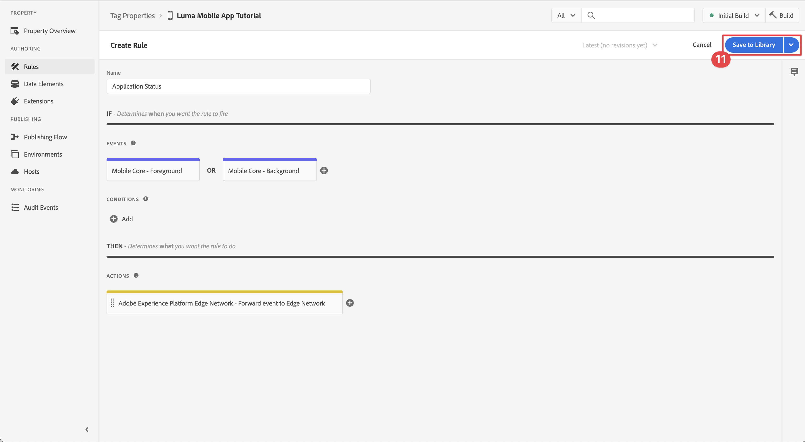

# Erfassen von Lebenszyklusdaten

Erfahren Sie, wie Sie Lebenszyklusdaten in einer Mobile App erfassen.

Die Adobe Experience Platform Mobile SDK Lifecycle-Erweiterung ermöglicht die Erfassung von Lebenszyklusdaten aus Ihrer Mobile App. Die Adobe Experience Platform Edge Network-Erweiterung sendet diese Lebenszyklusdaten an das Platform-Edge Network, wo sie dann entsprechend Ihrer Datenstromkonfiguration an andere Programme und Services weitergeleitet werden. Weitere Informationen zur [Lebenszykluserweiterung](https://developer.adobe.com/client-sdks/documentation/lifecycle-for-edge-network/) finden Sie in der Produktdokumentation.


## Voraussetzungen

* App mit installierten und konfigurierten SDKs erfolgreich erstellt und ausgeführt. Im Rahmen dieser Lektion haben Sie bereits mit der Lebenszyklusüberwachung begonnen. Siehe [Installieren von SDKs - Aktualisieren von AppDelegate](install-sdks.md#update-appdelegate) zur Überprüfung.
* Die Assurance-Erweiterung wurde wie in der vorherigen [ beschrieben registriert](install-sdks.md).

## Lernziele

In dieser Lektion erfahren Sie Folgendes:

<!--
* Add lifecycle field group to the schema.
* -->
* Aktivieren Sie genaue Lebenszyklusmetriken, indem Sie richtig starten/anhalten, während sich die App zwischen Vordergrund und Hintergrund bewegt.
* Senden von Daten aus der App an Platform Edge Network.
* Validieren in Assurance.

<!--
## Add lifecycle field group to schema

The Consumer Experience Event field group you added in the [previous lesson](create-schema.md) already contains the lifecycle fields, so you can skip this step. If you don't use Consumer Experience Event field group in your own app, you can add the lifecycle fields by doing the following:

1. Navigate to the schema interface as described in the [previous lesson](create-schema.md).
1. Open the **Luma Mobile App Event Schema** schema and select **[!UICONTROL Add]** next to Field groups.
    
1. In the search bar, enter "lifecycle".
1. Select the checkbox next to **[!UICONTROL AEP Mobile Lifecycle Details]**.
1. Select **[!UICONTROL Add field groups]**.
    
1. Select **[!UICONTROL Save]**.
    
-->

## Änderungen bei der Implementierung

Jetzt können Sie Ihr Projekt aktualisieren, um die Lebenszyklus-Ereignisse zu registrieren.

1. Navigieren Sie im Xcode-Projekt ]**Navigator zu **[!DNL Luma]**>**[!DNL Luma]**>**[!UICONTROL  SceneDelegate.

1. Wenn Ihre App nach dem Start in einem Hintergrundzustand fortgesetzt wird, ruft iOS möglicherweise Ihre `sceneWillEnterForeground:`-Delegatmethode auf, und an dieser Stelle möchten Sie ein Lebenszyklusstartereignis Trigger haben. Fügen Sie diesen Code zu `func sceneWillEnterForeground(_ scene: UIScene)` hinzu:

   ```swift
   // When in foreground start lifecycle data collection
   MobileCore.lifecycleStart(additionalContextData: nil)
   ```

1. Wenn die App in den Hintergrund eintritt, sollten Sie die Lebenszyklusdatenerfassung über die `sceneDidEnterBackground:` Delegatmethode Ihrer App pausieren. Fügen Sie diesen Code zu `func sceneDidEnterBackground(_ scene: UIScene)` hinzu:

   ```swift
   // When in background pause lifecycle data collection
   MobileCore.lifecyclePause()
   ```

## Mit Assurance validieren

1. Lesen Sie den Abschnitt [Setup-Anweisungen](assurance.md#connecting-to-a-session), um Ihren Simulator oder Ihr Gerät mit Assurance zu verbinden.
1. Senden Sie die App in den Hintergrund. Suchen Sie in **[!UICONTROL Benutzeroberfläche von Assurance nach]** LifecyclePause).
1. App in den Vordergrund bringen. Suchen Sie in **[!UICONTROL Benutzeroberfläche von Assurance nach]**LifecycleResume“-Ereignissen.
   


## Weiterleiten von Daten an das Platform-Edge Network

In der vorherigen Übung werden die Vordergrund- und Hintergrundereignisse an Adobe Experience Platform Mobile SDK gesendet. So leiten Sie diese Ereignisse an Platform Edge Network weiter:

1. Wählen Sie **[!UICONTROL Regeln]** in der Eigenschaft Tags aus.
   
1. Wählen Sie **[!UICONTROL Anfänglicher Build]** als zu verwendende Bibliothek aus.
1. Wählen Sie **[!UICONTROL Neue Regel erstellen]** aus.
   
1. Geben **[!UICONTROL im Bildschirm „Regel]**&quot; `Application Status` für **[!UICONTROL Name]** ein.
1. Wählen Sie  **[!UICONTROL Hinzufügen]** unter **[!UICONTROL EREIGNISSE]** aus.
   
1. Im Schritt **[!UICONTROL Ereigniskonfiguration]**:
   1. Wählen Sie **[!UICONTROL Mobile Core]** als **[!UICONTROL Erweiterung]**.
   1. Wählen Sie **[!UICONTROL Vordergrund]** als **[!UICONTROL Ereignistyp]**.
   1. Wählen Sie **[!UICONTROL Änderungen beibehalten]** aus.
      
1. Zurück im Bildschirm **[!UICONTROL Regel erstellen]** wählen Sie  **[!UICONTROL Hinzufügen]** neben **[!UICONTROL Mobile Core - Vordergrund]**.
   
1. Im Schritt **[!UICONTROL Ereigniskonfiguration]**:
   1. Wählen Sie **[!UICONTROL Mobile Core]** als **[!UICONTROL Erweiterung]**.
   1. Wählen Sie **[!UICONTROL Hintergrund]** als **[!UICONTROL Ereignistyp]**.
   1. Wählen Sie **[!UICONTROL Änderungen beibehalten]** aus.
      
1. Wählen Sie im Bildschirm **[!UICONTROL Regel erstellen]** unter **[!UICONTROL ACTIONS]** die Option  **[!UICONTROL Hinzufügen]**.
   
1. Im Schritt **[!UICONTROL Aktionskonfiguration]**:
   1. Wählen Sie **[!UICONTROL Adobe Experience Edge Network]** als **[!UICONTROL Erweiterung]** aus.
   1. Wählen Sie **[!UICONTROL Ereignis an Edge Network weiterleiten]** als **[!UICONTROL Aktionstyp]**.
   1. Wählen Sie **[!UICONTROL Änderungen beibehalten]** aus.
      
1. Wählen Sie **[!UICONTROL In Bibliothek speichern]**.
   
1. Wählen Sie **[!UICONTROL Erstellen]** aus, um die Bibliothek neu zu erstellen.
   

Nachdem Sie die Eigenschaft erfolgreich erstellt haben, werden die Ereignisse an das Platform-Edge Network gesendet und entsprechend Ihrer Datenstromkonfiguration an andere Programme und Services weitergeleitet.

Es sollten die Ereignisse **[!UICONTROL Anwendungsschluss (Hintergrund)]** und **[!UICONTROL Anwendungsstart (Vordergrund)]** mit XDM-Daten in Assurance angezeigt werden.


>[!SUCCESS]
>
>Sie haben jetzt Ihre App so eingerichtet, dass Anwendungsstatusereignisse (Vordergrund, Hintergrund) an das Adobe Experience Platform-Edge Network und alle Services gesendet werden, die Sie in Ihrem Datenstrom definiert haben.
>
> Vielen Dank, dass Sie sich Zeit genommen haben, um mehr über Adobe Experience Platform Mobile SDK zu erfahren. Wenn Sie Fragen haben, allgemeines Feedback geben möchten oder Vorschläge für zukünftige Inhalte haben, teilen Sie diese auf diesem [Experience League Community-Diskussionsbeitrag](https://experienceleaguecommunities.adobe.com/t5/adobe-experience-platform-data/tutorial-discussion-implement-adobe-experience-cloud-in-mobile/td-p/443796)

Weiter: **[Verfolgen von Ereignisdaten](events.md)**
