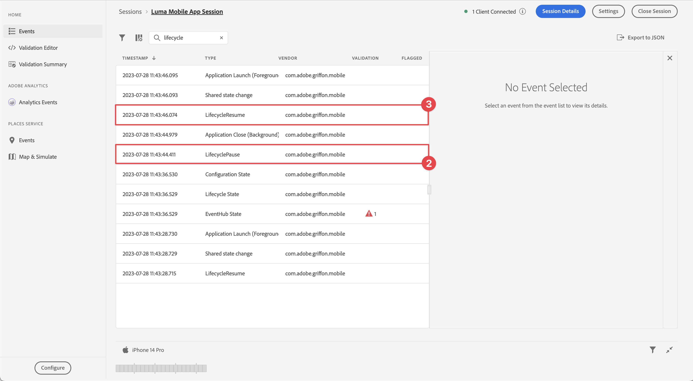

# Lebenszyklusdaten erfassen

Erfahren Sie, wie Sie Lebenszyklusdaten in einer mobilen App erfassen.

Die Adobe Experience Platform Mobile SDK Lifecycle-Erweiterung ermöglicht die Erfassung von Lebenszyklusdaten aus Ihrer mobilen App. Die Adobe Experience Platform Edge Network-Erweiterung sendet diese Lebenszyklusdaten an das Platform-Edge Network, wo sie dann gemäß Ihrer Datenspeicherkonfiguration an andere Anwendungen und Dienste weitergeleitet werden. Weitere Informationen zur [Lebenszykluserweiterung](https://developer.adobe.com/client-sdks/documentation/lifecycle-for-edge-network/) finden Sie in der Produktdokumentation.


## Voraussetzungen

* App erfolgreich erstellt und ausgeführt, wobei SDKs installiert und konfiguriert sind. Im Rahmen dieser Lektion haben Sie bereits mit der Lebenszyklusüberwachung begonnen. Weitere Informationen finden Sie unter [Installieren von SDKs - Aktualisieren von AppDelegate](install-sdks.md#update-appdelegate) .
* Registrierte Erweiterung &quot;Assurance&quot;, wie in der vorherigen Lektion ](install-sdks.md) beschrieben.[

## Lernziele

In dieser Lektion werden Sie:

<!--
* Add lifecycle field group to the schema.
* -->
* Aktivieren Sie genaue Lebenszyklusmetriken, indem Sie sie beim Wechsel zwischen Vordergrund und Hintergrund korrekt starten/anhalten.
* Senden Sie Daten aus der App an Platform Edge Network.
* Validieren Sie in &quot;Assurance&quot;.

<!--
## Add lifecycle field group to schema

The Consumer Experience Event field group you added in the [previous lesson](create-schema.md) already contains the lifecycle fields, so you can skip this step. If you don't use Consumer Experience Event field group in your own app, you can add the lifecycle fields by doing the following:

1. Navigate to the schema interface as described in the [previous lesson](create-schema.md).
1. Open the **Luma Mobile App Event Schema** schema and select **[!UICONTROL Add]** next to Field groups.
    
1. In the search bar, enter "lifecycle".
1. Select the checkbox next to **[!UICONTROL AEP Mobile Lifecycle Details]**.
1. Select **[!UICONTROL Add field groups]**.
    
1. Select **[!UICONTROL Save]**.
    
-->

## Implementierungsänderungen

Jetzt können Sie Ihr Projekt aktualisieren, um die Lebenszyklusereignisse zu registrieren.

1. Navigieren Sie im Xcode-Projektnavigator zu **[!DNL Luma]** > **[!DNL Luma]** > **[!UICONTROL SceneDelegate]** .

1. Wenn Ihre App beim Start aus einem Hintergrundstatus fortgesetzt wird, kann iOS Ihre `sceneWillEnterForeground:` -Delegierungsmethode aufrufen. In diesem Fall möchten Sie ein Lebenszyklusstartereignis Trigger haben. Fügen Sie diesen Code zu `func sceneWillEnterForeground(_ scene: UIScene)` hinzu:

   ```swift
   // When in foreground start lifecycle data collection
   MobileCore.lifecycleStart(additionalContextData: nil)
   ```

1. Wenn die App in den Hintergrund gelangt, möchten Sie die Erfassung der Lebenszyklusdaten aus der Delegate-Methode `sceneDidEnterBackground:` Ihrer App anhalten. Fügen Sie diesen Code zu `func sceneDidEnterBackground(_ scene: UIScene)` hinzu:

   ```swift
   // When in background pause lifecycle data collection
   MobileCore.lifecyclePause()
   ```

## Mit Assurance validieren

1. Lesen Sie den Abschnitt [Setup instructions](assurance.md#connecting-to-a-session) , um Ihren Simulator oder Ihr Gerät mit Assurance zu verbinden.
1. Senden Sie die App in den Hintergrund. Suchen Sie in der Assurance-Benutzeroberfläche nach **[!UICONTROL LifecyclePause]** -Ereignissen.
1. App in den Vordergrund rücken Suchen Sie in der Assurance-Benutzeroberfläche nach **[!UICONTROL LifecycleResume]** -Ereignissen.
   


## Weiterleiten von Daten an Platform Edge Network

Die vorherige Übung sendet die Vordergrund- und Hintergrundereignisse an das Adobe Experience Platform Mobile SDK. So leiten Sie diese Ereignisse an Platform Edge Network weiter:

1. Wählen Sie **[!UICONTROL Regeln]** in der Eigenschaft &quot;Tags&quot;aus.
   
1. Wählen Sie **[!UICONTROL Ursprünglicher Build]** als Bibliothek aus, die verwendet werden soll.
1. Wählen Sie **[!UICONTROL Neue Regel erstellen]** aus.
   
1. Geben Sie im Bildschirm **[!UICONTROL Regel erstellen]** den Wert `Application Status` für **[!UICONTROL Name]** ein.
1. Wählen Sie  **[!UICONTROL Hinzufügen]** unter **[!UICONTROL EREIGNISSE]** aus.
   
1. Im Schritt **[!UICONTROL Ereigniskonfiguration]** :
   1. Wählen Sie **[!UICONTROL Mobile Core]** als **[!UICONTROL Erweiterung]** aus.
   1. Wählen Sie **[!UICONTROL Vordergrund]** als **[!UICONTROL Ereignistyp]** aus.
   1. Wählen Sie **[!UICONTROL Änderungen beibehalten]** aus.
      
1. Wählen Sie im Bildschirm **[!UICONTROL Regel erstellen]** die Option  **[!UICONTROL Hinzufügen]** neben **[!UICONTROL Mobile Core - Vordergrund]**.
   
1. Im Schritt **[!UICONTROL Ereigniskonfiguration]** :
   1. Wählen Sie **[!UICONTROL Mobile Core]** als **[!UICONTROL Erweiterung]** aus.
   1. Wählen Sie **[!UICONTROL Hintergrund]** als **[!UICONTROL Ereignistyp]** aus.
   1. Wählen Sie **[!UICONTROL Änderungen beibehalten]** aus.
      
1. Wählen Sie im Bildschirm **[!UICONTROL Regel erstellen]** die Option  **[!UICONTROL Hinzufügen]** unter **[!UICONTROL AKTIONEN]** aus.
   
1. Im Schritt **[!UICONTROL Aktionskonfiguration]** :
   1. Wählen Sie **[!UICONTROL Adobe Experience Edge Network]** als **[!UICONTROL Erweiterung]** aus.
   1. Wählen Sie **[!UICONTROL Ereignis an Edge Network weiterleiten]** als **[!UICONTROL Aktionstyp]** aus.
   1. Wählen Sie **[!UICONTROL Änderungen beibehalten]** aus.
      
1. Wählen Sie **[!UICONTROL In Bibliothek speichern]** aus.
   
1. Wählen Sie **[!UICONTROL Build]** aus, um die Bibliothek neu zu erstellen.
   

Nachdem Sie die Eigenschaft erfolgreich erstellt haben, werden die Ereignisse an Platform Edge Network gesendet und die Ereignisse gemäß Ihrer Datastream-Konfiguration an andere Anwendungen und Dienste weitergeleitet.

Es sollten die Ereignisse **[!UICONTROL Anwendungsbeendigung (Hintergrund)]** und **[!UICONTROL Anwendungsstart (Vordergrund)]** angezeigt werden, die XDM-Daten in Assurance enthalten.


>[!SUCCESS]
>
>Sie haben Ihre App jetzt so eingerichtet, dass sie App-Zustandsereignisse (Vordergrund, Hintergrund) an das Adobe Experience Platform-Edge Network und alle Dienste sendet, die Sie in Ihrem Datastream definiert haben.
>
> Vielen Dank, dass Sie Ihre Zeit investiert haben, um mehr über das Adobe Experience Platform Mobile SDK zu erfahren. Wenn Sie Fragen haben, allgemeine Rückmeldungen oder Anregungen zu künftigen Inhalten teilen möchten, teilen Sie diese auf diesem [Experience League Community-Diskussionbeitrag](https://experienceleaguecommunities.adobe.com/t5/adobe-experience-platform-data/tutorial-discussion-implement-adobe-experience-cloud-in-mobile/td-p/443796) mit.

Weiter: **[Tracking von Ereignisdaten](events.md)**
