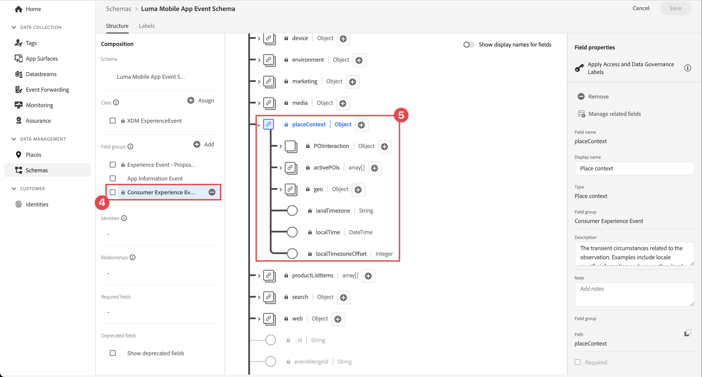
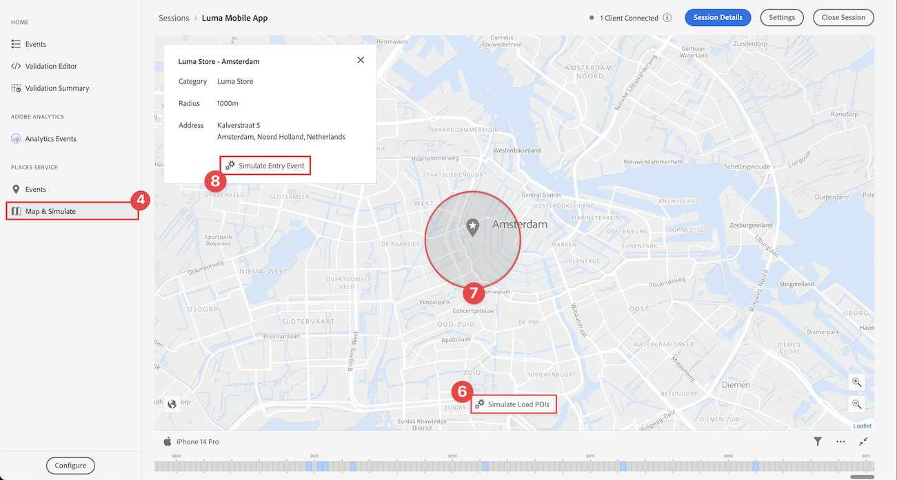

# Orte verwenden

Erfahren Sie, wie Sie den Geolocation-Dienst Places in Ihrer App verwenden.

Der Datenerfassungs-Places-Dienst von Adobe Experience Platform ist ein Geolocation-Dienst, mit dem mobile Apps mit Standorterkennung den Standortkontext verstehen können. Der Dienst verwendet umfangreiche und benutzerfreundliche SDK-Schnittstellen, die von einer flexiblen Datenbank mit Zielpunkten (POIs) begleitet werden.

## Voraussetzungen

* Alle Paketabhängigkeiten sind im Xcode-Projekt vorhanden.
* Registrierte Erweiterungen in AppDelegate.
* MobileCore für die Verwendung Ihrer Entwicklungs-AppId konfiguriert.
* Importierte SDKs
* Die App wurde erfolgreich erstellt und mit den oben genannten Änderungen ausgeführt.

## Lernziele

In dieser Lektion werden Sie

* Erfahren Sie, wie Sie Zielpunkte im Places-Dienst definieren.
* Aktualisieren Sie Ihre Tag-Eigenschaft mit der Places-Erweiterung.
* Aktualisieren Sie Ihr Schema, um Geolocation-Ereignisse zu erfassen.
* Validieren Sie die Einrichtung in &quot;Assurance&quot;.
* Aktualisieren Sie Ihre App, um die Places-Erweiterung zu registrieren.
* Implementieren Sie das Geolocation-Tracking aus dem Places-Dienst in Ihre App.


## Einrichten

Damit der Places-Dienst in Ihrer App und im Mobile SDK funktioniert, müssen Sie einige Einstellungen vornehmen.

### Festlegen von Orten

Sie definieren einige Zielpunkte im Places-Dienst.

1. Wählen Sie in der Datenerfassungs-Benutzeroberfläche **[!UICONTROL Orte]** aus.
1. Wählen Sie  aus.
1. Wählen Sie im Kontextmenü **[!UICONTROL Bibliotheken verwalten]** aus.
   
1. Wählen Sie im Dialogfeld **[!UICONTROL Bibliotheken verwalten]** die Option **[!UICONTROL Neu]** aus.
1. Geben Sie im Dialogfeld **[!UICONTROL Bibliothek erstellen]** einen **[!UICONTROL Namen]** ein, z. B. `Luma`.
1. Wählen Sie **[!UICONTROL Bestätigen]** aus.
   
1. Um das Dialogfeld **[!UICONTROL Bibliotheken verwalten]** zu schließen, wählen Sie **[!UICONTROL Schließen]** aus.
1. Wählen Sie in **[!UICONTROL POI-Verwaltung]** die Option **[!UICONTROL POIs importieren]** aus.
1. Wählen Sie **[!UICONTROL Start]** im Dialogfeld **[!UICONTROL Orte importieren]** aus.
1. Wählen Sie **[!DNL Luma]** aus der Liste der Bibliotheken,
1. Klicken Sie auf **[!UICONTROL Weiter]**.
   
1. Laden Sie die ZIP-Datei [Luma POIs](assets/luma_pois.csv.zip) herunter und extrahieren Sie sie an einen Speicherort auf Ihrem Computer.
1. Ziehen Sie im Dialogfeld **[!UICONTROL Orte importieren]** die extrahierte Datei `luma_pois.csv` per Drag-and-Drop in das Feld **[!UICONTROL CSV-Datei auswählen - Datei ziehen und ablegen]**. Sie sollten **[!UICONTROL Validierungserfolg]** - **[!UICONTROL CSV-Datei erfolgreich validiert haben]** sehen.
1. Wählen Sie **[!UICONTROL Import starten]** aus. Sie sollten **[!UICONTROL Erfolg]** - **[!UICONTROL 6 neue Zielpunkte erfolgreich hinzugefügt haben]** sehen.
1. Wählen Sie **[!UICONTROL Fertig]** aus.
1. In **[!UICONTROL POI-Verwaltung]** sollten Sie sehen, dass sechs neue Luma-Stores zur Liste hinzugefügt werden. Sie können zwischen der Liste  und der Kartenansicht  umschalten.
   .


### Installieren der Places-Erweiterung

1. Navigieren Sie zu **[!UICONTROL Tags]** , suchen Sie Ihre mobile Tag-Eigenschaft und öffnen Sie die Eigenschaft .
1. Wählen Sie **[!UICONTROL Erweiterungen]** aus.
1. Wählen Sie **[!UICONTROL Katalog]** aus.
1. Suchen Sie nach der Erweiterung **[!UICONTROL Places]** .
1. Installieren Sie die -Erweiterung.

   

1. Im Dialogfeld **[!UICONTROL Install Extension]** :
   1. Wählen Sie **[!DNL Luma]** aus der Liste **[!UICONTROL Bibliothek auswählen]** .
   1. Stellen Sie sicher, dass Sie Ihre Arbeitsbibliothek ausgewählt haben, z. B. **[!UICONTROL Ursprünglicher Build]**.
   1. Wählen Sie **[!UICONTROL In Bibliothek speichern und erstellen]** unter **[!UICONTROL In Bibliothek speichern]** aus.
      .

1. Ihre Bibliothek ist neu aufgebaut.


### Prüfen des Schemas

Überprüfen Sie, ob Ihr Schema, wie in [Schema erstellen](create-schema.md) definiert, die erforderlichen Feldergruppen und Klassen enthält, um POI- und Geolocation-Daten zu erfassen.

1. Navigieren Sie zur Datenerfassungsoberfläche und wählen Sie in der linken Leiste **[!UICONTROL Schemas]** aus.
1. Wählen Sie in der oberen Leiste **[!UICONTROL Durchsuchen]** aus.
1. Wählen Sie Ihr Schema aus, um es zu öffnen.
1. Wählen Sie im Schema-Editor **[!UICONTROL Consumer Experience Event]** aus.
1. Es wird ein **[!UICONTROL placeContext]** -Objekt mit Objekt und Feldern angezeigt, um POI-Interaktionen und Geolocation-Daten zu erfassen.
   .


### Tag-Eigenschaft aktualisieren

Die Places-Erweiterung für Tags bietet Funktionen zum Überwachen von Geolocation-Ereignissen und ermöglicht den Trigger von Aktionen, die auf diesen Ereignissen basieren. Mit dieser Funktion können Sie die API-Codierung minimieren, die Sie in der App implementieren müssen.

**Datenelemente**

Erstellen Sie zunächst mehrere Datenelemente.

1. Rufen Sie Ihre Tag-Eigenschaft in der Datenerfassungs-Benutzeroberfläche auf.
1. Wählen Sie in der linken Leiste **[!UICONTROL Datenelemente]** aus.
1. Wählen Sie **[!UICONTROL Datenelement hinzufügen]** aus.
1. Geben Sie im Bildschirm **[!UICONTROL Datenelement erstellen]** einen Namen ein, z. B. `Name - Entered`.
1. Wählen Sie **[!UICONTROL Orte]** aus der Liste **[!UICONTROL Erweiterung]** aus.
1. Wählen Sie **[!UICONTROL Name]** aus der Liste **[!UICONTROL Datenelementtyp]** aus.
1. Wählen Sie **[!UICONTROL Aktueller POI]** unter **[!UICONTROL TARGET]** aus.
1. Wählen Sie **[!UICONTROL In Bibliothek speichern]** aus.
   

1. Wiederholen Sie die Schritte 4 bis 8 anhand der Informationen aus der unten stehenden Tabelle, um zusätzliche Datenelemente zu erstellen.

   | Name | Erweiterung | Datenelementtyp | ZIEL |
   |---|---|---|---|
   | `Name - Exited` | Places | Name | Letzter ausgesetzter POI |
   | `Category - Current` | Places | Kategorie | Aktueller POI |
   | `Category - Exited` | Places | Kategorie | Letzter ausgesetzter POI |
   | `City - Current` | Places | Stadt | Aktueller POI |
   | `City - Exited` | Places | Stadt | Letzter ausgesetzter POI |

   Sie sollten über die folgende Liste von Datenelementen verfügen.

   

**Regeln**

Als Nächstes definieren Sie Regeln für die Verwendung dieser Datenelemente.

1. Wählen Sie in der Tag-Eigenschaft in der linken Leiste **[!UICONTROL Regeln]** aus.
1. Wählen Sie **[!UICONTROL Regel hinzufügen]** aus.
1. Geben Sie im Bildschirm **[!UICONTROL Regel erstellen]** einen Namen für die Regel ein, z. B. `POI - Entry`.
1. Wählen Sie  unter **[!UICONTROL EREIGNISSE]** aus.
   1. Wählen Sie **[!UICONTROL Orte]** aus der Liste **[!UICONTROL Erweiterung]** und wählen Sie **[!UICONTROL POI eingeben]** aus der Liste **[!UICONTROL Ereignistyp]** aus.
   1. Wählen Sie **[!UICONTROL Änderungen beibehalten]** aus.
      .
1. Wählen Sie  unter **[!UICONTROL AKTIONEN]** aus.
   1. Wählen Sie **[!UICONTROL Mobile Core]** aus der Liste **[!UICONTROL Erweiterung]** und wählen Sie **[!UICONTROL Daten anhängen]** aus der Liste **[!UICONTROL Aktionstyp]** aus. Diese Aktion hängt Payload-Daten an.
   1. Fügen Sie in die **[!UICONTROL JSON-Payload]** die folgende Payload ein:

      ```json
      {
          "xdm": {
              "eventType": "location.entry",
              "placeContext": {
                  "geo": {
                      "city": "{%%City - Current%%}"
                  },
                  "POIinteraction": {
                      "poiDetail": {
                          "name": "{%%Name - Current%%}",
                          "category": "{%%Category - Current%%}"
                      },
                      "poiEntries": {
                          "value": 1
                      }
                  }
              }
          }
      }
      ```

      Sie können auch `{%% ... %%}` Platzhalterwerte für Datenelemente in die JSON einfügen, indem Sie  auswählen. In einem Popup-Dialogfeld können Sie jedes von Ihnen erstellte Datenelement auswählen.

   1. Wählen Sie **[!UICONTROL Änderungen beibehalten]** aus.
      

1. Wählen Sie  neben der Aktion **[!UICONTROL Mobile Core - Attach Data]** .
   1. Wählen Sie **[!UICONTROL Adobe Experience Platform-Edge Network]** aus der Liste **[!UICONTROL Erweiterung]** und wählen Sie **[!UICONTROL Ereignis an Edge Network weiterleiten]** aus. Dadurch wird sichergestellt, dass das Ereignis und zusätzliche Payload-Daten an Platform Edge Network weitergeleitet werden.
   1. Wählen Sie **[!UICONTROL Änderungen beibehalten]** aus.

1. Um die Regel zu speichern, wählen Sie **[!UICONTROL In Bibliothek speichern]** aus.

   

Erstellen wir eine weitere Regel

1. Geben Sie im Bildschirm **[!UICONTROL Regel erstellen]** einen Namen für die Regel ein, z. B. `POI - Exit`.
1. Wählen Sie  unter **[!UICONTROL EREIGNISSE]** aus.
   1. Wählen Sie **[!UICONTROL Orte]** aus der Liste **[!UICONTROL Erweiterung]** und wählen Sie **[!UICONTROL Ausstiegspunkt]** aus der Liste **[!UICONTROL Ereignistyp]** aus.
   1. Wählen Sie **[!UICONTROL Änderungen beibehalten]** aus.
1. Wählen Sie  unter **[!UICONTROL AKTIONEN]** aus.
   1. Wählen Sie **[!UICONTROL Mobile Core]** aus der Liste **[!UICONTROL Erweiterung]** und wählen Sie **[!UICONTROL Daten anhängen]** aus der Liste **[!UICONTROL Aktionstyp]** aus.
   1. Fügen Sie in die **[!UICONTROL JSON-Payload]** die folgende Payload ein:

      ```json
      {
          "xdm": {
              "eventType": "location.exit",
              "placeContext": {
                  "geo": {
                      "city": "{%%City - Exited%%}"
                  },
                  "POIinteraction": {
                      "poiExits": {
                          "value": 1
                      },
                      "poiDetail": {
                          "name": "{%%Name - Exited%%}",
                          "category": "{%%Category - Exited%%}"
                      }
                  }
              }
          }
      }
      ```

   1. Wählen Sie **[!UICONTROL Änderungen beibehalten]** aus.

1. Wählen Sie  neben der Aktion **[!UICONTROL Mobile Core - Attach Data]** .
   1. Wählen Sie **[!UICONTROL Adobe Experience Platform-Edge Network]** aus der Liste **[!UICONTROL Erweiterung]** und wählen Sie **[!UICONTROL Ereignis an Edge Network weiterleiten]** aus.
   1. Wählen Sie **[!UICONTROL Änderungen beibehalten]** aus.

1. Um die Regel zu speichern, wählen Sie **[!UICONTROL In Bibliothek speichern]** aus.

   


Um sicherzustellen, dass alle Änderungen in Ihrem Tag veröffentlicht werden

1. Wählen Sie **[!UICONTROL Ursprünglicher Build]** als Bibliothek, die erstellt werden soll.
1. Wählen Sie **[!UICONTROL Build]** aus.
   


## Validieren der Einrichtung in der Zuverlässigkeitserklärung

So überprüfen Sie Ihre Einrichtung in Assurance:

1. Navigieren Sie zur Benutzeroberfläche &quot;Assurance&quot;.
1. Wenn dies nicht bereits in der linken Leiste verfügbar ist, wählen Sie in der linken Leiste die Option **[!UICONTROL Konfigurieren]** und dann unter **[!UICONTROL PLACES SERVICE]** die Option  neben **[!UICONTROL Ereignisse]** und **[!UICONTROL Map &amp; Simulate]**.
1. Wählen Sie **[!UICONTROL Speichern]** aus.
1. Wählen Sie in der linken Leiste **[!UICONTROL Map &amp; Simulate]** aus.
1. Verschieben Sie die Karte an die Position eines Ihrer POIs.
1. Wählen Sie  Ladepunkte simulieren aus. Ihr POI wird anhand eines Kreises und einer Nadel identifiziert.
1. Wählen Sie Ihren POI aus.
1. Wählen Sie im Popup-Fenster  **[!UICONTROL Eintrittsereignis simulieren]** aus.
   
1. Wählen Sie in der linken Leiste die Option **[!UICONTROL Ereignisse]** aus. Daraufhin sollten die simulierten Ereignisse angezeigt werden.
   


## Implementieren von Places in Ihrer App

Wie in den vorherigen Lektionen erläutert, bietet die Installation einer mobilen Tag-Erweiterung nur die Konfiguration. Als Nächstes müssen Sie das Places SDK installieren und registrieren. Wenn diese Schritte nicht klar sind, lesen Sie den Abschnitt [SDKs installieren](install-sdks.md) .

>[!NOTE]
>
>Wenn Sie den Abschnitt [SDK installieren](install-sdks.md) abgeschlossen haben, ist das Places SDK bereits installiert und Sie können diesen Schritt überspringen.
>

1. Stellen Sie in Xcode sicher, dass [AEP Places](https://github.com/adobe/aepsdk-places-ios) zur Liste der Pakete in Package-Abhängigkeiten hinzugefügt wird. Siehe [Swift Package Manager](install-sdks.md#swift-package-manager).
1. Navigieren Sie im Xcode-Projekt-Navigator zu **[!DNL Luma]** > **[!DNL Luma]** > **[!DNL AppDelegate]** .
1. Stellen Sie sicher, dass `AEPPlaces` Teil Ihrer Importliste ist.

   ```swift
   import AEPPlaces
   ```

1. Stellen Sie sicher, dass `Places.self` Teil des Arrays von Erweiterungen ist, die Sie registrieren.

   ```swift
   let extensions = [
       AEPIdentity.Identity.self,
       Lifecycle.self,
       Signal.self,
       Edge.self,
       AEPEdgeIdentity.Identity.self,
       Consent.self,
       UserProfile.self,
       Places.self,
       Messaging.self,
       Optimize.self,
       Assurance.self
   ]
   ```

1. Navigieren Sie im Xcode Project-Navigator zu **[!DNL Luma]** > **[!DNL Luma]** > **[!DNL Utils]** > **[!UICONTROL MobileSDK]** und suchen Sie die Funktion `func processRegionEvent(regionEvent: PlacesRegionEvent, forRegion region: CLRegion) async` . Fügen Sie den folgenden Code hinzu:

   ```swift
   // Process geolocation event
   Places.processRegionEvent(regionEvent, forRegion: region)
   ```

   Diese [`Places.processRegionEvent`](https://developer.adobe.com/client-sdks/documentation/places/api-reference/#processregionevent) -API übermittelt die Geolocation-Informationen an den Places-Dienst.

1. Navigieren Sie im Projektnavigator von Xcode zu **[!DNL Luma]** > **[!DNL Luma]** > **[!DNL Views]** > **[!DNL Location]** > **[!DNL GeofenceSheet]**.

   1. Geben Sie für die Schaltfläche &quot;Entry&quot;den folgenden Code ein

   ```swift
   // Simulate geofence entry event
   Task {
       await MobileSDK.shared.processRegionEvent(regionEvent: .entry, forRegion: region)
   }
   ```

   1. Geben Sie für die Schaltfläche Beenden den folgenden Code ein

   ```swift
   // Simulate geofence exit event
   Task {
       await MobileSDK.shared.processRegionEvent(regionEvent: .exit, forRegion: region)
   }
   ```

## Validieren mit Ihrer App

1. Öffnen Sie Ihre App auf einem Gerät oder im Simulator.

1. Gehen Sie zur Registerkarte **[!UICONTROL Position]** .

1. Verschieben Sie die Karte (ziehen Sie sie), um sicherzustellen, dass sich der blaue mittlere Kreis über einem der POIs befindet, z. B. London.

1. Tippen , bis die Kategorie und der Name in der Beschriftung an der roten Stelle mit dem Pin erscheinen.

1. Tippen Sie auf die Bezeichnung des POI, wodurch das Blatt **[!UICONTROL Nächster POI]** geöffnet wird.

   

1. Drücken Sie die Tasten **[!UICONTROL Einstieg]** oder **[!UICONTROL Ausstieg]** , um die Ereignisse für die Geofence-Einsendung und den Geofence-Ausstieg aus der App zu simulieren.

   

1. Sie sollten die Ereignisse in der Assurance-Benutzeroberfläche sehen.


## Nächste Schritte

Sie sollten jetzt über alle Tools verfügen, um Ihre Geolocation-Funktionalität in der App um weitere Funktionen zu erweitern. Nachdem Sie die Ereignisse an das Edge Network weitergeleitet haben, sollten nach der Einrichtung der App für [Experience Platform](platform.md) die Erlebnisereignisse für das in der App verwendete Profil angezeigt werden.

Im Journey Optimizer-Abschnitt dieses Tutorials sehen Sie, dass Erlebnisereignisse zum Trigger von Journey verwendet werden können (siehe [Push-Benachrichtigung](journey-optimizer-inapp.md) und [In-App-Nachrichten](journey-optimizer-push.md) mit Journey Optimizer). Beispielsweise das übliche Beispiel, bei dem Sie dem App-Benutzer eine Push-Benachrichtigung mit einer Produktwerbung senden, wenn dieser Benutzer den Geofence eines physischen Stores betritt.

Sie haben eine Implementierung der Funktionen für Ihre App gesehen, die hauptsächlich vom Places-Dienst sowie von den Datenelementen und Regeln gesteuert wird, die Sie in Ihrer Tag-Eigenschaft definiert haben. Minimieren Sie daher den Code in Ihrer App. Alternativ können Sie dieselbe Funktionalität direkt in Ihrer App mithilfe der API [`Edge.sendEvent`](https://developer.adobe.com/client-sdks/documentation/edge-network/api-reference/#sendevent) implementieren (weitere Informationen finden Sie unter [Ereignisse](events.md) ), wobei eine XDM-Payload ein ausgefülltes `placeContext` -Objekt enthält.

>[!SUCCESS]
>
>Sie haben die App jetzt für Geolocation-Dienste unter Verwendung der Places-Erweiterung im Experience Platform Mobile SDK aktiviert.
>
>Vielen Dank, dass Sie Ihre Zeit investiert haben, um mehr über das Adobe Experience Platform Mobile SDK zu erfahren. Wenn Sie Fragen haben, allgemeine Rückmeldungen oder Anregungen zu zukünftigen Inhalten haben möchten, teilen Sie diese in diesem [Experience League Community-Diskussionbeitrag](https://experienceleaguecommunities.adobe.com/t5/adobe-experience-platform-data/tutorial-discussion-implement-adobe-experience-cloud-in-mobile/td-p/443796) mit.

Weiter: **[Zuordnen von Daten zu Adobe Analytics](analytics.md)**
