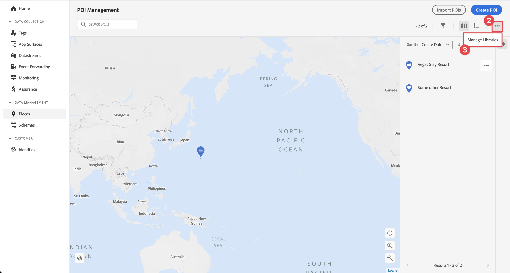

# Verwenden von Orten

Erfahren Sie, wie Sie den Orte-Geolokalisierungs-Service in Ihrer App verwenden.

Der Datenerfassungs-Orte-Service von Adobe Experience Platform ist ein Geolocation-Service, der es mobilen Apps mit Standorterkennung ermöglicht, den Standortkontext zu verstehen. Der Service verwendet umfangreiche und benutzerfreundliche SDK-Benutzeroberflächen sowie eine flexible Datenbank mit POIs (Points of Interest).

## Voraussetzungen

* Alle Paketabhängigkeiten sind im Xcode-Projekt vorhanden.
* Registrierte Erweiterungen in AppDelegate.
* MobileCore wurde für die Verwendung Ihrer Entwicklungs-App-ID konfiguriert.
* SDKs importiert.
* Die App mit den oben genannten Änderungen wurde erfolgreich erstellt und ausgeführt.

## Lernziele

In dieser Lektion werden Sie

* Erfahren Sie, wie Sie im Places-Service Zielpunkte definieren.
* Aktualisieren Sie Ihre Tag-Eigenschaft mit der Places-Erweiterung.
* Aktualisieren Sie Ihr Schema, um Geolokalisierungsereignisse zu erfassen.
* Überprüfen Sie das Setup in Assurance.
* Aktualisieren Sie Ihre App, um die Places-Erweiterung zu registrieren.
* Implementieren Sie das Geolokalisierungs-Tracking über den Places-Service in Ihrer App.


## Einrichten

Damit der Places -Service in Ihrer App und in der mobilen SDK funktioniert, müssen Sie einige Einstellungen vornehmen.

### Definieren von Orten

Einige interessante Punkte definieren Sie im Places-Service.

1. Wählen Sie in der Datenerfassungs-Benutzeroberfläche **[!UICONTROL Orte]**.
1. Wählen Sie  aus.
1. Wählen Sie im Kontextmenü die Option **[!UICONTROL Bibliotheken verwalten]** aus.
   
1. Wählen **[!UICONTROL im Dialogfeld &quot;]** verwalten“ die Option **[!UICONTROL Neu]**.
1. Geben Sie im Dialogfeld **[!UICONTROL Bibliothek erstellen]** einen **[!UICONTROL Namen]** ein, z. B. `Luma`.
1. Wählen Sie **[!UICONTROL Bestätigen]** aus.
   
1. Um das Dialogfeld **[!UICONTROL Bibliotheken verwalten]** zu schließen, wählen Sie **[!UICONTROL Schließen]** aus.
1. Zurück in **[!UICONTROL POI-Verwaltung]** wählen Sie **[!UICONTROL POIs importieren]**.
1. Wählen **[!UICONTROL Start]** im Dialogfeld **[!UICONTROL Importplätze]** aus.
1. Wählen Sie **[!DNL Luma]** aus der Liste der Bibliotheken aus.
1. Klicken Sie auf **[!UICONTROL Weiter]**.
   
1. Laden Sie die [ZIP-Datei der Luma-POIs](assets/luma_pois.csv.zip) herunter und extrahieren Sie sie an einen Speicherort auf Ihrem Computer.
1. Ziehen Sie **[!UICONTROL Dialogfeld &quot;]** importieren“ die extrahierte `luma_pois.csv`-Datei per Drag-and-Drop auf **[!UICONTROL CSV-Datei auswählen - Ziehen Sie die Datei per Drag-and-Drop]**. Sie sollten **[!UICONTROL Validierung erfolgreich]** - (**[!UICONTROL CSV-Datei erfolgreich validiert]** sehen.
1. Wählen Sie **[!UICONTROL Import beginnen]**. Sie sollten **[!UICONTROL Erfolg]** sehen **[!UICONTROL 6 neue POIs erfolgreich hinzugefügt]**.
1. Wählen Sie **[!UICONTROL Fertig]** aus.
1. In **[!UICONTROL POI-]**) sollten Sie sehen, dass der Liste sechs neue Luma-Stores hinzugefügt werden. Sie können zwischen  und Kartenansicht wechseln.
   .


### Installieren der Places-Erweiterung

1. Navigieren Sie zu **[!UICONTROL Tags]**, suchen Sie die Eigenschaft für mobile Tags und öffnen Sie sie.
1. Wählen Sie **[!UICONTROL Erweiterungen]** aus.
1. Wählen Sie **[!UICONTROL Katalog]** aus.
1. Suchen Sie nach der **[!UICONTROL Places]**-Erweiterung.
1. Installieren Sie die Erweiterung .

   

1. Im Dialogfeld **[!UICONTROL Erweiterung installieren]**:
   1. Wählen Sie **[!DNL Luma]** aus der Liste **[!UICONTROL Bibliothek]**.
   1. Stellen Sie sicher, dass Sie Ihre Arbeitsbibliothek ausgewählt haben, z. B **[!UICONTROL „Initial Build]**.
   1. Wählen Sie **[!UICONTROL In Bibliothek speichern und erstellen]** unter **[!UICONTROL In Bibliothek speichern]**.
      .

1. Die Bibliothek wurde neu erstellt.


### Prüfen des Schemas

Überprüfen Sie, ob Ihr Schema, wie in [Schema erstellen](create-schema.md) definiert, die erforderlichen Feldergruppen und Klassen zum Erfassen von POI- und Geolokalisierungsdaten enthält.

1. Navigieren Sie zur Datenerfassungs-Oberfläche und wählen Sie **[!UICONTROL Schemata]** in der linken Leiste aus.
1. Wählen **[!UICONTROL Durchsuchen]** in der oberen Leiste aus.
1. Wählen Sie Ihr Schema aus, um es zu öffnen.
1. Wählen Sie im Schema-Editor die Option **[!UICONTROL Consumer Experience Event]**.
1. Es wird ein **[!UICONTROL placeContext]**-Objekt mit Objekten und Feldern zur Erfassung von POI-Interaktions- und Geolokalisierungsdaten angezeigt.
   .


### Aktualisieren der Tag-Eigenschaft

Die Places -Erweiterung für Tags bietet Funktionen zum Überwachen von Geolokalisierungsereignissen und ermöglicht das Trigger von Aktionen, die auf diesen Ereignissen basieren. Mit dieser Funktion können Sie die API-Codierung minimieren, die Sie in der App implementieren müssen.

**Datenelemente**

Zunächst erstellen Sie mehrere Datenelemente.

1. Wechseln Sie in der Datenerfassungs-Benutzeroberfläche zu Ihrer Tag-Eigenschaft.
1. Wählen **[!UICONTROL Datenelemente]** in der linken Leiste aus.
1. Wählen **[!UICONTROL Datenelement hinzufügen]** aus.
1. Geben Sie **[!UICONTROL Bildschirm Datenelement erstellen]** einen Namen ein, z. B. `Name - Entered`.
1. Wählen Sie **[!UICONTROL Places]** in der Liste **[!UICONTROL Erweiterung]** aus.
1. Wählen **[!UICONTROL Name]** in der Liste **[!UICONTROL Datenelementtyp]** aus.
1. Wählen **[!UICONTROL Aktueller POI]** unter **[!UICONTROL TARGET]** aus.
1. Wählen Sie **[!UICONTROL In Bibliothek speichern]**.
   

1. Wiederholen Sie die Schritte 4 bis 8 anhand der Informationen aus der folgenden Tabelle, um zusätzliche Datenelemente zu erstellen.

   | Name | Erweiterung | Datenelementtyp | ZIEL |
   |---|---|---|---|
   | `Name - Exited` | Places | Name | POI für letzten Austritt |
   | `Category - Current` | Places | Kategorie | Aktueller POI |
   | `Category - Exited` | Places | Kategorie | POI für letzten Austritt |
   | `City - Current` | Places | Stadt | Aktueller POI |
   | `City - Exited` | Places | Stadt | POI für letzten Austritt |

   Sie sollten über die folgende Liste von Datenelementen verfügen.

   

**Regeln**

Als Nächstes definieren Sie Regeln für die Arbeit mit diesen Datenelementen.

1. Wählen Sie in Ihrer Tag-Eigenschaft **[!UICONTROL Regeln]** in der linken Leiste aus.
1. Wählen Sie **[!UICONTROL Regel hinzufügen]** aus.
1. Geben **[!UICONTROL im Bildschirm Regel]** einen Namen für die Regel ein, z. B. `POI - Entry`.
1. Wählen  unter **[!UICONTROL EREIGNISSE]** aus.
   1. Wählen Sie **[!UICONTROL Places]** aus der Liste **[!UICONTROL Extension]** und wählen Sie **[!UICONTROL Enter POI]** aus der Liste **[!UICONTROL Event Type]** aus.
   1. Wählen Sie **[!UICONTROL Änderungen beibehalten]** aus.
      .
1. Wählen  unter **[!UICONTROL AKTIONEN]** aus.
   1. Wählen Sie **[!UICONTROL Mobile Core]** aus der Liste **[!UICONTROL Erweiterung]** und wählen Sie **[!UICONTROL Daten anhängen]** aus **[!UICONTROL Aktionstyp]** der Liste aus. Diese Aktion hängt Payload-Daten an.
   1. Fügen Sie in **[!UICONTROL JSON]** Payload die folgende Payload ein:

      ```json
      {
          "xdm": {
              "eventType": "location.entry",
              "placeContext": {
                  "geo": {
                      "city": "{%%City - Current%%}"
                  },
                  "POIinteraction": {
                      "poiDetail": {
                          "name": "{%%Name - Current%%}",
                          "category": "{%%Category - Current%%}"
                      },
                      "poiEntries": {
                          "value": 1
                      }
                  }
              }
          }
      }
      ```

      Sie können auch `{%% ... %%}` Platzhalterwerte für Datenelemente in die JSON einfügen, indem Sie die Option  auswählen. In einem Popup-Dialogfeld können Sie jedes von Ihnen erstellte Datenelement auswählen.

   1. Wählen Sie **[!UICONTROL Änderungen beibehalten]** aus.
      

1. Wählen  neben der Aktion **[!UICONTROL Mobile Core - Daten]**) aus.
   1. Wählen Sie **[!UICONTROL Adobe Experience Platform-Edge Network]** aus der Liste **[!UICONTROL Erweiterung]** und wählen Sie **[!UICONTROL Ereignis an Edge Network weiterleiten]**. Dadurch wird sichergestellt, dass das Ereignis und die zusätzlichen Payload-Daten an das Platform-Edge Network weitergeleitet werden.
   1. Wählen Sie **[!UICONTROL Änderungen beibehalten]** aus.

1. Wählen Sie zum Speichern der Regel **[!UICONTROL In Bibliothek speichern]** aus.

   

Erstellen wir eine weitere Regel

1. Geben **[!UICONTROL im Bildschirm Regel]** einen Namen für die Regel ein, z. B. `POI - Exit`.
1. Wählen  unter **[!UICONTROL EREIGNISSE]** aus.
   1. Wählen Sie **[!UICONTROL Places]** aus der Liste **[!UICONTROL Extension]** und wählen Sie **[!UICONTROL Exit POI]** aus der Liste **[!UICONTROL Event Type]** aus.
   1. Wählen Sie **[!UICONTROL Änderungen beibehalten]** aus.
1. Wählen  unter **[!UICONTROL AKTIONEN]** aus.
   1. Wählen Sie **[!UICONTROL Mobile Core]** aus der Liste **[!UICONTROL Erweiterung]** und wählen Sie **[!UICONTROL Daten anhängen]** aus der Liste **[!UICONTROL Aktionstyp]** aus.
   1. Fügen Sie in **[!UICONTROL JSON]** Payload die folgende Payload ein:

      ```json
      {
          "xdm": {
              "eventType": "location.exit",
              "placeContext": {
                  "geo": {
                      "city": "{%%City - Exited%%}"
                  },
                  "POIinteraction": {
                      "poiExits": {
                          "value": 1
                      },
                      "poiDetail": {
                          "name": "{%%Name - Exited%%}",
                          "category": "{%%Category - Exited%%}"
                      }
                  }
              }
          }
      }
      ```

   1. Wählen Sie **[!UICONTROL Änderungen beibehalten]** aus.

1. Wählen  neben der Aktion **[!UICONTROL Mobile Core - Daten]**) aus.
   1. Wählen Sie **[!UICONTROL Adobe Experience Platform-Edge Network]** aus der Liste **[!UICONTROL Erweiterung]** und wählen Sie **[!UICONTROL Ereignis an Edge Network weiterleiten]**.
   1. Wählen Sie **[!UICONTROL Änderungen beibehalten]** aus.

1. Wählen Sie zum Speichern der Regel **[!UICONTROL In Bibliothek speichern]** aus.

   


So stellen Sie sicher, dass alle Änderungen im Tag veröffentlicht werden

1. Wählen Sie **[!UICONTROL Anfänglicher Build]** als zu erstellende Bibliothek aus.
1. Wählen Sie **[!UICONTROL Erstellen]** aus.
   


## Überprüfen des Setups in Assurance

So validieren Sie das Setup in Assurance:

1. Navigieren Sie zur Assurance-Benutzeroberfläche.
1. Falls noch nicht in der linken Leiste verfügbar, wählen Sie **[!UICONTROL Konfigurieren]** in der linken Leiste und wählen Sie  neben **[!UICONTROL Ereignisse]** und **[!UICONTROL Zuordnen und Simulieren]** unter **[!UICONTROL PLACES SERVICE]**.
1. Wählen Sie **[!UICONTROL Speichern]** aus.
1. Wählen **[!UICONTROL Map &amp; Simulate]** in der linken Leiste aus.
1. Verschieben Sie die Karte an einen Speicherort eines Ihrer POIs.
1. Wählen Sie  Lastpunkte simulieren aus. Ihr POI wird mit einem Kreis und einer Nadel identifiziert.
1. POI auswählen.
1. Wählen Sie im Popup die Option  **[!UICONTROL Eintrittsereignis simulieren]**.
   
1. Wählen Sie **[!UICONTROL Ereignisse]** in der linken Leiste aus. Die von Ihnen simulierten Ereignisse sollten angezeigt werden.
   


## Implementieren von Places in Ihrer App

Wie in den vorherigen Lektionen erläutert, wird bei der Installation einer mobilen Tag-Erweiterung nur die Konfiguration bereitgestellt. Als Nächstes müssen Sie die Places SDK installieren und registrieren. Wenn diese Schritte nicht klar sind, lesen Sie den Abschnitt [Installieren von SDKs](install-sdks.md).

>[!NOTE]
>
>Wenn Sie den Abschnitt [Installieren von SDKs](install-sdks.md) abgeschlossen haben, ist Places SDK bereits installiert und Sie können diesen Schritt überspringen.
>

1. Stellen Sie in Xcode sicher[ dass „AEP Places](https://github.com/adobe/aepsdk-places-ios) zur Liste der Pakete in den Paketabhängigkeiten hinzugefügt wird. Siehe [Swift Package Manager](install-sdks.md#swift-package-manager).
1. Navigieren Sie im Xcode-Projekt-Navigator zu **[!DNL Luma]** > **[!DNL Luma]** > **[!DNL AppDelegate]** .
1. Stellen Sie sicher, dass `AEPPlaces` Teil Ihrer Importliste ist.

   ```swift
   import AEPPlaces
   ```

1. Stellen Sie sicher, dass `Places.self` Teil des Arrays von Erweiterungen ist, die Sie registrieren.

   ```swift
   let extensions = [
       AEPIdentity.Identity.self,
       Lifecycle.self,
       Signal.self,
       Edge.self,
       AEPEdgeIdentity.Identity.self,
       Consent.self,
       UserProfile.self,
       Places.self,
       Messaging.self,
       Optimize.self,
       Assurance.self
   ]
   ```

1. Navigieren Sie im Xcode-Projekt-]**zu **[!DNL Luma]**>**[!DNL Luma]**>**[!DNL Utils]**>**[!UICONTROL  MobileSDK und suchen Sie nach der `func processRegionEvent(regionEvent: PlacesRegionEvent, forRegion region: CLRegion) async`. Fügen Sie den folgenden Code hinzu:

   ```swift
   // Process geolocation event
   Places.processRegionEvent(regionEvent, forRegion: region)
   ```

   Diese [`Places.processRegionEvent`](https://developer.adobe.com/client-sdks/documentation/places/api-reference/#processregionevent)-API übermittelt die Geolokalisierungsinformationen an den Places-Service.

1. Navigieren Sie im Projekt-Navigator von Xcode zu **[!DNL Luma]** > **[!DNL Luma]** > **[!DNL Views]** > **[!DNL Location]** > **[!DNL GeofenceSheet]**.

   1. Geben Sie für die Eingabetaste den folgenden Code ein

   ```swift
   // Simulate geofence entry event
   Task {
       await MobileSDK.shared.processRegionEvent(regionEvent: .entry, forRegion: region)
   }
   ```

   1. Geben Sie für die Schaltfläche Beenden den folgenden Code ein

   ```swift
   // Simulate geofence exit event
   Task {
       await MobileSDK.shared.processRegionEvent(regionEvent: .exit, forRegion: region)
   }
   ```

## Validieren mit der App

1. Öffnen Sie Ihre App auf einem Gerät oder im Simulator.

1. Wechseln Sie zur Registerkarte **[!UICONTROL Speicherort]**.

1. Verschieben Sie die Karte, und ziehen Sie sie, um sicherzustellen, dass sich der blaue mittlere Kreis über einem Ihrer POI befindet, z. B. in London.

1. Tippen , bis Kategorie und Name im Etikett an der roten Stelle mit der Nadel angezeigt werden.

1. Tippen Sie auf den Titel des POI, wodurch das Blatt &quot;**[!UICONTROL POI“ geöffnet]**.

   

1. Drücken Sie die **[!UICONTROL Eintritt]** oder **[!UICONTROL Austritt]**, um Geofence-Eintritts- und Geofence-Ausstiegsereignisse aus der App zu simulieren.

   

1. Die Ereignisse sollten in der Assurance-Benutzeroberfläche zu sehen sein.


## Nächste Schritte

Sie sollten jetzt über alle Tools verfügen, um Ihrer Geolocation-Funktion in der App weitere Funktionen hinzuzufügen. Nachdem Sie die Ereignisse an das Edge Network weitergeleitet haben, sollten nach dem Einrichten der App für [Experience Platform](platform.md) die Erlebnisereignisse für das in der App verwendete Profil angezeigt werden.

Im Abschnitt Journey Optimizer dieses Tutorials sehen Sie, dass Erlebnisereignisse zum Trigger von Journey verwendet werden können (siehe [Push-Benachrichtigung](journey-optimizer-inapp.md) und [In-App-Messaging](journey-optimizer-push.md) mit Journey Optimizer). Dies ist beispielsweise das übliche Beispiel für das Senden einer Push-Benachrichtigung an den App-Benutzer mit einer Produktwerbung, wenn dieser den Geofence eines physischen Geschäfts betritt.

Es wurde eine Implementierung von Funktionen für Ihre App gesehen, die hauptsächlich vom Places-Service und den Datenelementen und Regeln gesteuert werden, die Sie in Ihrer Tag-Eigenschaft definiert haben. Daher wird der Code in Ihrer App minimiert. Alternativ können Sie dieselben Funktionen auch direkt in Ihrer App implementieren, indem Sie die [`Edge.sendEvent`](https://developer.adobe.com/client-sdks/documentation/edge-network/api-reference/#sendevent)-API (weitere Informationen finden [ unter &quot;](events.md)„) mit einer XDM-Payload verwenden, die ein ausgefülltes `placeContext`-Objekt enthält.

>[!SUCCESS]
>
>Sie haben die App jetzt für Geolocation-Services mit der Places-Erweiterung in der Experience Platform Mobile SDK aktiviert.
>
>Vielen Dank, dass Sie sich Zeit genommen haben, um mehr über Adobe Experience Platform Mobile SDK zu erfahren. Wenn Sie Fragen haben, allgemeines Feedback geben möchten oder Vorschläge für zukünftige Inhalte haben, teilen Sie diese auf diesem [Experience League Community-Diskussionsbeitrag](https://experienceleaguecommunities.adobe.com/t5/adobe-experience-platform-data/tutorial-discussion-implement-adobe-experience-cloud-in-mobile/td-p/443796).

Weiter: **[Daten Adobe Analytics zuordnen](analytics.md)**
