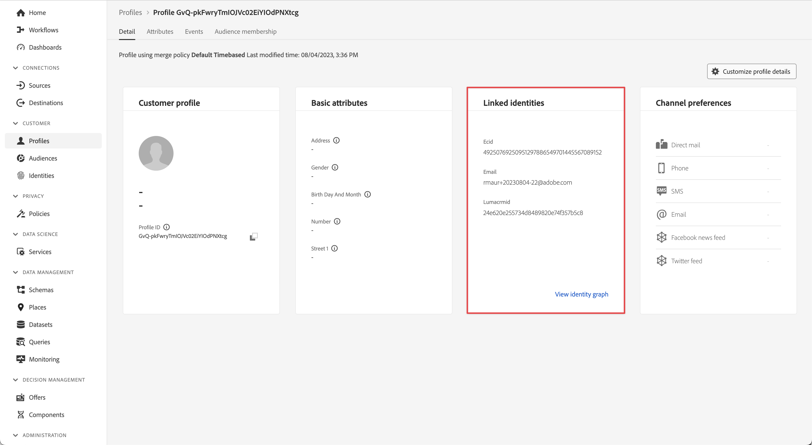

# Daten an Experience Platform senden

Erfahren Sie, wie Sie App-Daten an Adobe Experience Platform senden.

Diese optionale Lektion ist für alle Kunden von Real-time Customer Data Platform (Real-Time CDP), Journey Optimizer und Customer Journey Analytics relevant. Experience Platform, die Grundlage von Experience Cloud-Produkten, ist ein offenes System, das all Ihre Daten (Adobe und Nicht-Adobe) in robuste Kundenprofile umwandelt. Diese Kundenprofile werden in Echtzeit aktualisiert und verwenden KI-gestützte Einblicke, um Ihnen bei der Bereitstellung der richtigen Erlebnisse für alle Kanäle zu helfen.

Die [event](events.md), [lifecycle](lifecycle-data.md) und [identity](identity.md) Daten, die Sie in früheren Lektionen erfasst und an Platform Edge Network gesendet haben, werden an die in Ihrem Datenspeicher konfigurierten Dienste weitergeleitet, einschließlich Adobe Experience Platform.

## Voraussetzungen

Ihr Unternehmen muss freigeschaltet und Berechtigungen für Adobe Experience Platform gewährt werden.

Wenn Sie keinen Zugriff haben, können Sie [diese Lektion überspringen](install-sdks.md).

## Lernziele

In dieser Lektion werden Sie:

* Erstellen Sie einen Experience Platform-Datensatz.
* Konfigurieren Sie Ihren Datenspeicher, um Daten an Experience Platform weiterzuleiten.
* Validieren Sie Daten im Datensatz.
* Aktivieren Sie Ihr Schema und Ihren Datensatz für das Echtzeit-Kundenprofil.
* Daten im Echtzeit-Kundenprofil validieren
* Validieren Sie Daten im Identitätsdiagramm.

## Erstellen eines Datensatzes

Alle Daten, die erfolgreich in Adobe Experience Platform aufgenommen wurden, werden im Data Lake als Datensätze persistiert. Ein Datensatz ist ein Speicher- und Verwaltungskonstrukt für eine Datenerfassung (normalerweise eine Tabelle), die ein Schema (Spalten) und Felder (Zeilen) enthält. Datensätze enthalten auch Metadaten, die verschiedene Aspekte der in ihnen gespeicherten Daten beschreiben. Weitere Informationen finden Sie in der [Dokumentation](https://experienceleague.adobe.com/docs/experience-platform/catalog/datasets/overview.html?lang=de) .

1. Navigieren Sie zur Experience Platform-Oberfläche, indem Sie sie oben rechts im Menü Apps  auswählen.

1. Wählen Sie **[!UICONTROL Datensätze]** aus dem linken Navigationsmenü.

1. Wählen Sie  **[!UICONTROL Datensatz erstellen]**.

1. Wählen Sie **[!UICONTROL Datensatz aus Schema erstellen]** aus.
   

1. Suchen Sie nach Ihrem Schema. z. B. die Verwendung von `Luma Mobile` im Suchfeld.
1. Wählen Sie Ihr Schema aus, z. B. **[!DNL Luma Mobile App Event Schema]**.

1. Klicken Sie auf **[!UICONTROL Weiter]**.
   

1. Geben Sie einen **[!UICONTROL Namen]** an, z. B. `Luma Mobile App Events Dataset` und eine **[!UICONTROL Beschreibung]**.

1. Wählen Sie **[!UICONTROL Beenden]** aus.
   

## Hinzufügen des Adobe Experience Platform-Datenspeicherdiensts

Um Ihre XDM-Daten aus dem Edge Network an Adobe Experience Platform zu senden, fügen Sie den Adobe Experience Platform-Dienst dem Datastream hinzu, den Sie im Rahmen von [Erstellen eines Datenspeichers](create-datastream.md) eingerichtet haben.

>[!IMPORTANT]
>
>Sie können den Adobe Experience Platform-Dienst nur aktivieren, wenn Sie einen Ereignisdatensatz erstellt haben.

1. Wählen Sie in der Datenerfassungs-Benutzeroberfläche **[!UICONTROL Datastreams]** und Ihren Datenspeicher aus.

1. Wählen Sie dann  **[!UICONTROL Add Service]** aus.

1. Wählen Sie **[!UICONTROL Adobe Experience Platform]** aus der Liste [!UICONTROL Dienst] aus.

1. Aktivieren Sie den Dienst, indem Sie **[!UICONTROL Aktiviert]** aktivieren.

1. Wählen Sie den zuvor erstellten **[!UICONTROL Ereignisdatensatz]** aus, z. B. **[!DNL Luma Mobile App Event Dataset]**.

1. Wählen Sie **[!UICONTROL Speichern]** aus.

   
1. Die endgültige Konfiguration sollte ungefähr so aussehen:

   

## Daten im Datensatz validieren

Nachdem Sie einen Datensatz erstellt und Ihren Datastream aktualisiert haben, um Daten an Experience Platform zu senden, werden alle an Platform Edge Network gesendeten XDM-Daten an Platform weitergeleitet und landen im Datensatz.

Öffnen Sie die App und navigieren Sie zu Bildschirmen, auf denen Sie Ereignisse verfolgen. Sie können auch Trigger-Lebenszyklusmetriken verwenden.

Öffnen Sie Ihren Datensatz in der Platform-Oberfläche. Sie sollten die Daten sehen, die in Batches zum Datensatz eingehen. Die Daten werden in der Regel alle 15 Minuten in Mikrostapeln empfangen, sodass Ihre Daten möglicherweise nicht sofort angezeigt werden.

Sie sollten auch Beispieldatensätze und -felder mit der Funktion **[!UICONTROL Datensatz-Vorschau]** anzeigen können:

Ein robusteres Tool zur Validierung von Daten ist der [Abfragedienst](https://experienceleague.adobe.com/docs/platform-learn/tutorials/queries/explore-data.html?lang=de) von Platform.

## Echtzeit-Kundenprofil aktivieren

Mit Experience Platform Echtzeit-Kundenprofil können Sie eine ganzheitliche Ansicht jedes einzelnen Kunden erstellen, in der Daten aus mehreren Kanälen kombiniert werden, einschließlich Online-, Offline-, CRM- und Drittanbieter-Daten. Mit dem Profil können Sie Ihre unterschiedlichen Kundendaten in einer zentralen Sicht zusammenführen, die eine aussagekräftige, im Zeitverlauf gezeichnete Darstellung jeder Kundeninteraktion bietet.

### Aktivieren des Schemas

1. Öffnen Sie Ihr Schema, z. B. **[!DNL Luma Mobile App Event Schema]**.
1. Aktivieren Sie **[!UICONTROL Profil]**.
1. Wählen Sie **[!UICONTROL Daten für dieses Schema enthalten eine primäre Identität im Feld identityMap .]** im Dialogfeld.
1. **[!UICONTROL Speichern]** Sie das Schema.

   

### Aktivieren des Datensatzes

1. Öffnen Sie Ihren Datensatz, z. B. **[!DNL Luma Mobile App Event Dataset]**.
1. Aktivieren Sie **[!UICONTROL Profil]**.

   

### Daten im Profil überprüfen

Öffnen Sie die App und navigieren Sie zu Bildschirmen, auf denen Sie Ereignisse verfolgen, z. B.: Melden Sie sich bei der Luma-App an und tätigen Sie einen Kauf.

Verwenden Sie Assurance, um eine der Identitäten zu finden, die in der identityMap (E-Mail, lumaCrmId oder ECID) übergeben werden, z. B. die CRM-ID.

In der Platform-Benutzeroberfläche

1. Navigieren Sie zu **[!UICONTROL Profile]** und wählen Sie in der oberen Leiste die Option **[!UICONTROL Durchsuchen]** aus.
1. Geben Sie die Identitätsdetails an, die Sie gerade erfasst haben, z. B. `Luma CRM ID` für **[!UICONTROL Identitäts-Namespace]** und den Wert, den Sie für **[!UICONTROL Identitätswert]** kopiert haben. Wählen Sie dann **[!UICONTROL Ansicht]** aus.
1. Um Details anzuzeigen, wählen Sie das Profil aus.

Auf dem Bildschirm **[!UICONTROL Detail]** können Sie grundlegende Informationen zum Benutzer sehen, einschließlich der **[!UICONTROL ** verknüpften Identitäten **]**:

Auf der Seite **[!UICONTROL Ereignisse]** können Sie die Ereignisse sehen, die von Ihrer Mobile-App-Implementierung für diesen Benutzer erfasst wurden:

Auf dem Bildschirm mit den Profildetails:

1. Um das Identitätsdiagramm anzuzeigen, klicken Sie auf den Link oder navigieren Sie zu **[!UICONTROL Identitäten]** und wählen Sie dann **[!UICONTROL Identitätsdiagramm]** aus der oberen Leiste aus.
1. Um den Identitätswert nachzuschlagen, geben Sie `Luma CRM ID` als den **[!UICONTROL Identitäts-Namespace]** und den kopierten Wert als **[!UICONTROL Identitätswert]** an. Wählen Sie dann **[!UICONTROL Ansicht]** aus.

   Diese Visualisierung zeigt Ihnen alle Identitäten, die in einem Profil verknüpft sind, und deren Ursprung. Hier ist ein Beispiel für ein Identitätsdiagramm, das aus Daten erstellt wurde, die aus dem Abschluss dieses Mobile SDK-Tutorials (Data Source 2) und des [Web SDK-Tutorials](https://experienceleague.adobe.com/docs/platform-learn/implement-web-sdk/overview.html?lang=de) (Data Source 1) erfasst wurden:

   

## Nächste Schritte

Marketingexperten und Analytics können viel mehr mit in Experience Platform erfassten Daten tun, z. B. mit der Analyse in Customer Journey Analytics und dem Erstellen von Segmenten in Real-time Customer Data Platform. Du hast einen guten Anfang gemacht!

>[!SUCCESS]
>
>Sie haben Ihre App jetzt so eingerichtet, dass Daten nicht nur an das Edge Network, sondern auch an Adobe Experience Platform gesendet werden. Vielen Dank, dass Sie Ihre Zeit investiert haben, um mehr über das Adobe Experience Platform Mobile SDK zu erfahren. Wenn Sie Fragen haben, allgemeine Rückmeldungen oder Anregungen zu zukünftigen Inhalten haben möchten, teilen Sie diese in diesem [Experience League Community-Diskussionbeitrag](https://experienceleaguecommunities.adobe.com/t5/adobe-experience-platform-data/tutorial-discussion-implement-adobe-experience-cloud-in-mobile/td-p/443796) mit.

Weiter: **[Push-Benachrichtigungen erstellen und senden](journey-optimizer-push.md)**
