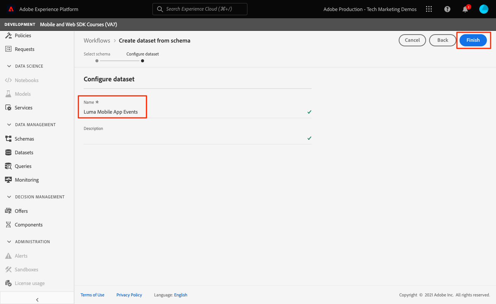

# Daten an Adobe Experience Platform senden

Erfahren Sie, wie Sie Daten an Adobe Experience Platform senden.

>[!INFO]
>
> Dieses Tutorial wird Ende November 2023 mithilfe einer neuen Beispiel-Mobile-App durch ein neues Tutorial ersetzt.

Diese optionale Lektion ist für alle Kunden von Real-time Customer Data Platform (Real-Time CDP), Journey Optimizer und Customer Journey Analytics relevant. Experience Platform, die Grundlage von Experience Cloud-Produkten, ist ein offenes System, das all Ihre Daten - Adobe und Nicht-Adobe - in robuste Kundenprofile umwandelt, die in Echtzeit aktualisiert werden und mithilfe von KI-gestützten Einblicken die richtigen Erlebnisse für alle bereitstellt.

Die [event](events.md), [Lebenszyklus](lifecycle-data.md), und [identity](identity.md) Daten, die Sie in früheren Lektionen gesammelt und an Platform Edge Network gesendet haben, werden an die in Ihrem Datastream konfigurierten Dienste weitergeleitet, einschließlich Adobe Experience Platform.

## Voraussetzungen

Ihr Unternehmen muss freigeschaltet und Berechtigungen für Adobe Experience Platform gewährt werden.

Wenn Sie keinen Zugriff haben, können Sie [Diese Lektion überspringen](install-sdks.md).

## Lernziele

In dieser Lektion werden Sie:

* Erstellen Sie einen Experience Platform-Datensatz.
* Validieren Sie Daten im Datensatz.
* Aktivieren Sie Ihr Schema und Ihren Datensatz für das Echtzeit-Kundenprofil.
* Daten im Echtzeit-Kundenprofil validieren
* Validieren Sie Daten im Identitätsdiagramm.

## Erstellen eines Datensatzes

Alle Daten, die erfolgreich in Adobe Experience Platform aufgenommen wurden, werden im Data Lake als Datensätze persistiert. Ein Datensatz ist ein Konstrukt zur Datenspeicherung und -verwaltung, in dem Daten (in der Regel) in einer Tabelle erfasst werden, die ein Schema (Spalten) und Felder (Zeilen) beinhaltet. Datensätze enthalten auch Metadaten, die verschiedene Aspekte der in ihnen gespeicherten Daten beschreiben. Siehe [Dokumentation](https://experienceleague.adobe.com/docs/experience-platform/catalog/datasets/overview.html?lang=de) für Informationen.

1. Navigieren Sie zur Experience Platform-Oberfläche, indem Sie sie aus dem Menü 3x3 oben rechts auswählen.
   

1. Auswählen **[!UICONTROL Datensätze]** aus dem linken Navigationsmenü.

1. **[!UICONTROL Datensatz erstellen]**.
   

1. Wählen Sie **[!UICONTROL Datensatz aus Schema erstellen]** aus.
   

1. Suchen Sie nach Ihrem Schema und wählen Sie aus.

1. Klicken Sie auf **[!UICONTROL Weiter]**.
   

1. Stellen Sie eine **[!UICONTROL Name]**, **[!UICONTROL Beschreibung]** und wählen Sie **[!UICONTROL Beenden]**.
   

## Aktualisieren des Datastreams

Nachdem Sie Ihren Datensatz erstellt haben, stellen Sie sicher, dass [Datenspeicher aktualisieren](create-datastream.md) , um Adobe Experience Platform hinzuzufügen. Diese Aktualisierung stellt sicher, dass Daten in Platform übertragen werden.

## Daten im Datensatz validieren

Nachdem Sie einen Datensatz erstellt und Ihren Datastream aktualisiert haben, um Daten an Experience Platform zu senden, werden alle an Platform Edge Network gesendeten XDM-Daten an Platform weitergeleitet und im Datensatz an Land gesendet.

Öffnen Sie die App und navigieren Sie zu Bildschirmen, auf denen Sie Ereignisse verfolgen. Sie können auch Trigger-Lebenszyklusmetriken verwenden.

Öffnen Sie Ihren Datensatz in der Platform-Oberfläche. Sie sollten die Daten sehen, die in Batches zum Datensatz eingehen.

Sie sollten auch Beispieldatensätze und -felder mit der **[!UICONTROL Datensatz-Vorschau]** Funktion:

Ein robusteres Tool für die Validierung von Daten ist das [Abfragedienst](https://experienceleague.adobe.com/docs/platform-learn/tutorials/queries/explore-data.html?lang=de).

## Echtzeit-Kundenprofil aktivieren

Mit Experience Platform Echtzeit-Kundenprofil können Sie eine ganzheitliche Ansicht jedes einzelnen Kunden erstellen, in der Daten aus mehreren Kanälen kombiniert werden, einschließlich Online-, Offline-, CRM- und Drittanbieter-Daten. Mit dem Profil können Sie Ihre unterschiedlichen Kundendaten in einer zentralen Sicht zusammenführen, die eine aussagekräftige, im Zeitverlauf gezeichnete Darstellung jeder Kundeninteraktion bietet.

### Aktivieren des Schemas

1. Schema öffnen
1. Aktivieren **[!UICONTROL Profil]**
1. Auswählen **[!UICONTROL Daten für dieses Schema enthalten eine primäre Identität im Feld identityMap .]** im Modal
1. **[!UICONTROL Speichern Sie das Schema]**

   

### Aktivieren des Datensatzes

1. Datensatz öffnen
1. Aktivieren **[!UICONTROL Profil]**

   

### Daten im Profil überprüfen

Öffnen Sie die App und navigieren Sie zu Bildschirmen, auf denen Sie Ereignisse verfolgen. Melden Sie sich bei der Luma-App an und tätigen Sie einen Kauf.

Verwenden Sie Assurance, um eine der Identitäten zu finden, die in der identityMap (E-Mail, lumaCrmId oder ECID) übergeben werden:

>[!TIP]
>
>   Der Wert der `lumaCrmId` is `112ca06ed53d3db37e4cea49cc45b71e`

Navigieren Sie in der Platform-Benutzeroberfläche zu **[!UICONTROL Profile]** > **[!UICONTROL Durchsuchen]**, suchen Sie den Identitätswert, den Sie gerade erfasst haben, und öffnen Sie das Profil:

Im **[!UICONTROL Detail]** -Bildschirm sehen Sie grundlegende Informationen zum Benutzer, einschließlich der **[!UICONTROL ** verknüpfte Identitäten **]**:

Im **[!UICONTROL Veranstaltungen]** können Sie die Ereignisse sehen, die von Ihrer Mobile-App-Implementierung für diesen Benutzer erfasst wurden:

Klicken Sie im Bildschirm mit den Profildetails auf den Link, um das Identitätsdiagramm anzuzeigen oder zu **[!UICONTROL Identitäten]** > **[!UICONTROL Identitätsdiagramm]** und suchen Sie den Identitätswert. Diese Visualisierung zeigt Ihnen alle Identitäten, die in einem Profil verknüpft sind, und deren Ursprung. Im Folgenden finden Sie ein Beispiel für ein Identitätsdiagramm, das aus Daten erstellt wurde, die aus dem Abschluss dieses Mobile SDK-Tutorials (Datenquelle 2) und der [Web SDK-Tutorial](https://experienceleague.adobe.com/docs/platform-learn/implement-web-sdk/overview.html?lang=de) (Datenquelle 1):

Marketingexperten und Analytics können viel mehr mit in Experience Platform erfassten Daten tun, z. B. mit der Analyse in Customer Journey Analytics und dem Erstellen von Segmenten in Real-time Customer Data Platform. Du hast einen guten Anfang gemacht!

Weiter: **[Push-Nachrichten mit Journey Optimizer](journey-optimizer-push.md)**

>[!NOTE]
>
>Vielen Dank, dass Sie Ihre Zeit investiert haben, um mehr über das Adobe Experience Platform Mobile SDK zu erfahren. Wenn Sie Fragen haben, ein allgemeines Feedback teilen möchten oder Vorschläge zu künftigen Inhalten haben, teilen Sie diese bitte mit. [Experience League Community-Diskussionsbeitrag](https://experienceleaguecommunities.adobe.com/t5/adobe-experience-platform-launch/tutorial-discussion-implement-adobe-experience-cloud-in-mobile/td-p/443796)
