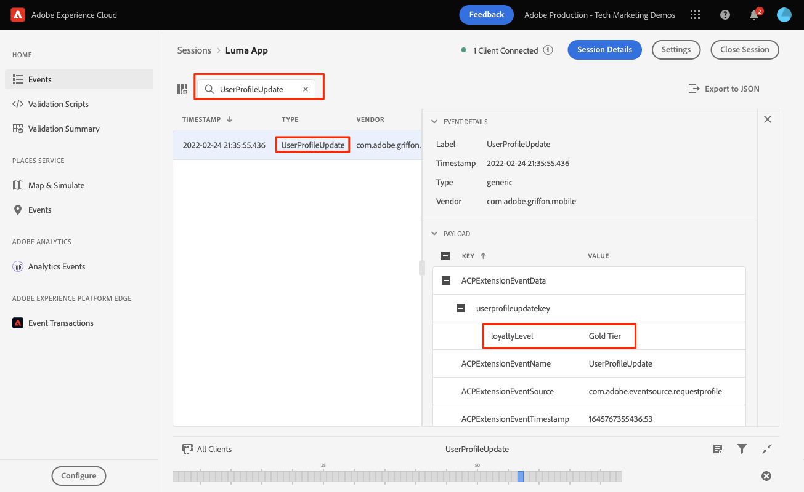

# Profil

Erfahren Sie, wie Sie Profildaten in einer Mobile App erfassen.

>[!INFO]
>
> Dieses Tutorial wird Ende November 2023 mithilfe einer neuen Beispiel-Mobile-App durch ein neues Tutorial ersetzt.

Sie können die Profil-Erweiterung verwenden, um Attribute über Ihren Benutzer auf dem Client zu speichern. Diese Informationen können später verwendet werden, um Nachrichten in Online- oder Offline-Szenarien auszuwählen und zu personalisieren, ohne dass für eine optimale Leistung eine Verbindung zu einem Server hergestellt werden muss. Die Profil-Erweiterung verwaltet das clientseitige Aktionsprofil (CSOP), bietet eine Möglichkeit, auf APIs zu reagieren, aktualisiert Benutzerprofilattribute und gibt die Benutzerprofilattribute für den Rest des Systems als generiertes Ereignis frei.

Die Profildaten werden von anderen Erweiterungen verwendet, um profilbezogene Aktionen durchzuführen. Ein Beispiel ist die Regel-Engine-Erweiterung, die die Profildaten nutzt und Regeln basierend auf den Profildaten ausführt. Weitere Informationen zum [Profilerweiterung](https://developer.adobe.com/client-sdks/documentation/profile/) in der Dokumentation

>[!IMPORTANT]
>
>Die in dieser Lektion beschriebene Profilfunktion unterscheidet sich von der Funktionalität des Echtzeit-Kundenprofils in Adobe Experience Platform und Platform-basierten Anwendungen.


## Voraussetzungen

* App erfolgreich erstellt und ausgeführt, wobei SDKs installiert und konfiguriert sind.
* Profil-SDK importiert.

  ```swift
  import AEPUserProfile
  ```

## Lernziele

In dieser Lektion werden Sie:

* Festlegen oder Aktualisieren von Benutzerattributen.
* Abrufen von Benutzerattributen.


## Festlegen und Aktualisieren

Für Targeting und/oder Personalisierung wäre es hilfreich, schnell zu wissen, ob ein Benutzer zuvor in der App gekauft hat. Legen wir das in der Luma-App fest.

1. Navigieren Sie zu `Cart.swift`

1. Fügen Sie den folgenden Code zum `processOrder() `-Funktion.

   ```swift
   var profileMap = [String: Any]()
   profileMap["isPaidUser"] = "yes"
   UserProfile.updateUserAttributes(attributeDict: profileMap)
   ```

Das Personalisierungsteam möchte möglicherweise auch das Targeting auf Grundlage der Treuestufe des Benutzers durchführen. Legen wir das in der Luma-App fest.

1. Navigieren Sie zu `Account.swift`

1. Fügen Sie den folgenden Code zum `showUserInfo()` -Funktion.

   ```swift
   var profileMap = [String: Any]()
   profileMap["loyaltyLevel"] = loyaltyLevel
   UserProfile.updateUserAttributes(attributeDict: profileMap)
   ```

Zusätzliche `updateUserAttributes` Dokumentation finden Sie [here](https://developer.adobe.com/client-sdks/documentation/profile/api-reference/#updateuserattribute).

## Abrufen

Nachdem Sie das -Attribut eines Benutzers aktualisiert haben, steht es anderen Adobe-SDKs zur Verfügung, Sie können jedoch auch Attribute explizit abrufen.

```swift
UserProfile.getUserAttributes(attributeNames: ["isPaidUser","loyaltyLevel"]){
    attributes, error in
    print("Profile: getUserAttributes: ",attributes as Any)
}
```

Zusätzliche `getUserAttributes` Dokumentation finden Sie [here](https://developer.adobe.com/client-sdks/documentation/profile/api-reference/#getuserattributes).

## Validierung mit Versicherung

1. Überprüfen Sie die [Einrichtungsanweisungen](assurance.md) Abschnitt.
1. Installieren Sie die App.
1. Starten Sie die App mithilfe der durch die Versicherung generierten URL.
1. Wählen Sie das Symbol Konto und dann Anmeldung aus. Hinweis: Sie haben keine Anmeldeinformationen angegeben.
1. Schließen Sie die Anmeldemenüs und wählen Sie dann erneut das Konto -Symbol aus. Dadurch gelangen Sie zum Bildschirm mit den Kontodetails, wo `loyaltyLevel` festgelegt ist.
1. Sie sollten eine **[!UICONTROL UserProfileUpdate]** -Ereignis in der Assurance-Benutzeroberfläche mit der aktualisierten `profileMap` -Wert.
   

Weiter: **[Zuordnen von Daten zu Adobe Analytics](analytics.md)**

>[!NOTE]
>
>Vielen Dank, dass Sie Ihre Zeit investiert haben, um mehr über das Adobe Experience Platform Mobile SDK zu erfahren. Wenn Sie Fragen haben, ein allgemeines Feedback oder Vorschläge zu künftigen Inhalten teilen möchten, teilen Sie diese hier mit. [Experience League Community-Diskussionsbeitrag](https://experienceleaguecommunities.adobe.com/t5/adobe-experience-platform-data/tutorial-discussion-implement-adobe-experience-cloud-in-mobile/td-p/443796)