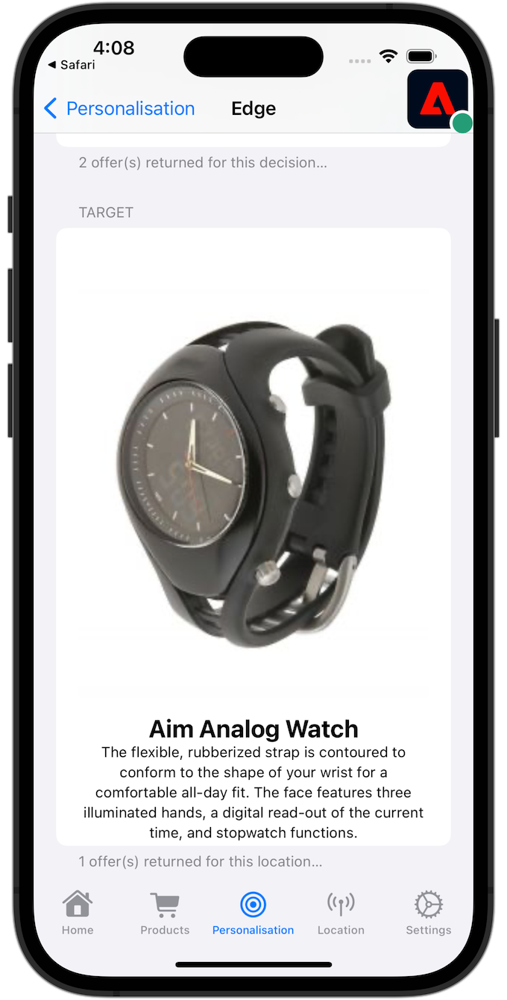

# Optimieren und Personalisieren mit Adobe Target

Erfahren Sie, wie Sie die Erlebnisse in Ihren Mobile Apps mit Platform Mobile SDK und Adobe Target optimieren und personalisieren können.

Target bietet alles, was Sie für die Anpassung und Personalisierung Ihrer Kundenerlebnisse benötigen. Mit Target können Sie den Umsatz Ihrer Websites, mobilen Sites, Apps, Social Media und anderer digitaler Kanäle maximieren. Target kann A/B-Tests durchführen, multivariate Tests durchführen, Produkte und Inhalte empfehlen, Inhalte als Ziel festlegen, Inhalte mit KI automatisch personalisieren und vieles mehr. Im Mittelpunkt dieser Lektion steht die A/B-Testfunktion von Target. Weitere Informationen finden Sie unter [A/B](https://experienceleague.adobe.com/docs/target/using/activities/abtest/test-ab.html?lang=en)Tests - Übersicht .


Bevor Sie A/B-Tests mit Target durchführen können, müssen Sie sicherstellen, dass die richtigen Konfigurationen und Integrationen vorhanden sind.

>[!NOTE]
>
>Diese Lektion ist optional und gilt nur für Adobe Target-Benutzende, die A/B-Tests durchführen möchten.


## Voraussetzungen

* App mit installierten und konfigurierten SDKs erfolgreich erstellt und ausgeführt.
* Zugriff auf Adobe Target mit Berechtigungen, ordnungsgemäß konfigurierten Rollen, Arbeitsbereichen und Eigenschaften, wie [hier](https://experienceleague.adobe.com/docs/target/using/administer/manage-users/enterprise/property-channel.html?lang=de) beschrieben.


## Lernziele

In dieser Lektion erfahren Sie Folgendes:

* Aktualisieren Sie Ihren Datenstrom für die Target-Integration.
* Aktualisieren Sie Ihre Tag-Eigenschaft mit der Journey Optimizer - Decisioning-Erweiterung.
* Schema zur Erfassung von Vorschlagsereignissen aktualisieren
* Überprüfen Sie das Setup in Assurance.
* Erstellen Sie einen einfachen A/B-Test in Target.
* Aktualisieren Sie Ihre App, um die Optimizer-Erweiterung zu registrieren.
* Implementieren Sie den A/B-Test in Ihrer App.
* Implementierung in Assurance validieren


## Einrichten

>[!TIP]
>
>Wenn Sie Ihre App bereits im Rahmen der Lektion [Journey Optimizer-Angebote](journey-optimizer-offers.md) eingerichtet haben, haben Sie möglicherweise bereits einige der Schritte in diesem Setup-Abschnitt ausgeführt.

### Aktualisieren der Datenstromkonfiguration

#### Adobe Target

Um sicherzustellen, dass Daten, die von Ihrer Mobile App an das Experience Platform-Edge Network gesendet werden, an Adobe Target weitergeleitet werden, müssen Sie Ihre Datenstromkonfiguration aktualisieren.

1. Wählen Sie in der Datenerfassungs-Benutzeroberfläche **[!UICONTROL Datenströme]** und wählen Sie Ihren Datenstrom aus, z. B. **[!DNL Luma Mobile App]**.
1. Wählen Sie **[!UICONTROL Service hinzufügen]** und wählen Sie **[!UICONTROL Adobe Target]** aus der Liste **[!UICONTROL Service]** aus.
1. Wenn Sie Target Premium-Kunde sind und Eigenschafts-Token verwenden möchten, geben Sie den Target-Wert **[!UICONTROL Eigenschafts-Token]** ein, den Sie für diese Integration verwenden möchten. Target Standard-Benutzer können diesen Schritt überspringen.

   Ihre Eigenschaften finden Sie in der Target-Benutzeroberfläche unter **[!UICONTROL Administration]** > **[!UICONTROL Eigenschaften]**. Wählen Sie  aus, um das Eigenschafts-Token für die Eigenschaft anzuzeigen, die Sie verwenden möchten. Das Eigenschafts-Token hat ein Format wie `"at_property": "xxxxxxxx-xxxx-xxxxx-xxxx-xxxxxxxxxxxx"`. Sie dürfen nur den Wert `xxxxxxxx-xxxx-xxxxx-xxxx-xxxxxxxxxxxx` eingeben.

   Optional können Sie eine Zielumgebungs-ID angeben. Target nutzt Umgebungen, um Ihre Sites und Vorproduktionsumgebungen zu organisieren, und ermöglicht so ein einfaches Management und separates Reporting. Zu den voreingestellten Umgebungen gehören Produktion, Staging und Entwicklung. Weitere Informationen finden [ unter ](https://experienceleague.adobe.com/docs/target/using/administer/environments.html?lang=en) und [Target](https://experienceleague.adobe.com/docs/platform-learn/implement-web-sdk/applications-setup/setup-target.html?lang=en#target-environment-id)Umgebungs-ID).

   Optional können Sie einen Target-ID-Namespace eines Drittanbieters angeben, um die Profilsynchronisierung mit einem Identity-Namespace (z. B. einer CRM-ID) zu unterstützen. Weitere Informationen finden [ unter ](https://experienceleague.adobe.com/docs/platform-learn/implement-web-sdk/applications-setup/setup-target.html?lang=en#target-third-party-id-namespace)-Namespace für Target-Drittanbieter-ID .

1. Wählen Sie **[!UICONTROL Speichern]** aus.

   


#### Adobe Journey Optimizer

Aktualisieren Sie Ihre Datenstromkonfiguration, um sicherzustellen, dass Daten von Ihrer Mobile App an das Edge Network an Journey Optimizer - Entscheidungs-Management weitergeleitet werden.

1. Wählen Sie in der Datenerfassungs-Benutzeroberfläche **[!UICONTROL Datenströme]** und wählen Sie Ihren Datenstrom aus, z. B. **[!DNL Luma Mobile App]**.
1. Experience Platform Wählen Sie  für **&#x200B;**&#x200B;und wählen Sie  **[!UICONTROL Bearbeiten]** aus dem Kontextmenü.
1. Stellen Sie im Bildschirm **[!UICONTROL Datenströme]** >  > **[!UICONTROL Adobe Experience Platform]** sicher, dass **[!UICONTROL Offer decisioning]**, **[!UICONTROL Edge-Segmentierung]** und **[!UICONTROL Personalization-Ziele]** ausgewählt sind. Wenn Sie auch den Journey Optimizer-Lektionen folgen, wählen Sie **[!UICONTROL Adobe Journey Optimizer]**. Weitere Informationen finden Sie unter {[&#128279;](https://experienceleague.adobe.com/docs/experience-platform/datastreams/configure.html?lang=en#aep)}Adobe Experience Platform-Einstellungen.
1. Um Ihre Datenstromkonfiguration zu speichern, wählen Sie **[!UICONTROL Speichern]** aus.

   


### Installieren der Erweiterung &quot;Adobe Journey Optimizer - Decisioning Tags“

1. Navigieren Sie zu **[!UICONTROL Tags]**, suchen Sie die Eigenschaft für mobile Tags und öffnen Sie die Eigenschaft .
1. Wählen Sie **[!UICONTROL Erweiterungen]** aus.
1. Wählen Sie **[!UICONTROL Katalog]** aus.
1. Suchen Sie nach der Erweiterung **[!UICONTROL Adobe Journey Optimizer - Decisioning]**.
1. Installieren Sie die Erweiterung . Die Erweiterung erfordert keine zusätzliche Konfiguration.

   


### Schema aktualisieren

1. Navigieren Sie zur Datenerfassungs-Oberfläche und wählen Sie **[!UICONTROL Schemata]** in der linken Leiste aus.
1. Wählen **[!UICONTROL Durchsuchen]** in der oberen Leiste aus.
1. Wählen Sie Ihr Schema aus, um es zu öffnen.
1. Wählen Sie im Schema-Editor  **[!UICONTROL Hinzufügen]** neben **[!UICONTROL Feldergruppen]**.
1. Suchen Sie im **[!UICONTROL Feldergruppen hinzufügen]** nach `proposition`, wählen Sie **[!UICONTROL Erlebnisereignis - Vorschlagsinteraktionen]** und wählen Sie **[!UICONTROL Feldergruppen hinzufügen]**.
   
1. Um die Änderungen an Ihrem Schema zu speichern, klicken Sie auf **[!UICONTROL Speichern]**.


### Überprüfen des Setups in Assurance

So validieren Sie das Setup in Assurance:

1. Navigieren Sie zur Assurance-Benutzeroberfläche.
1. Wählen Sie **[!UICONTROL Konfigurieren]** in der linken Leiste und wählen Sie  neben **[!UICONTROL Setup überprüfen]** unter **[!UICONTROL ADOBE JOURNEY OPTIMIZER DECISIONING]**.
1. Wählen Sie **[!UICONTROL Speichern]** aus.
1. Wählen **[!UICONTROL in der]** Leiste Setup validieren aus. Sowohl die Datenstromeinrichtung als auch die SDK-Einrichtung in Ihrer Anwendung werden validiert.
   

## Erstellen eines A/B-Tests

Es gibt viele Arten von Aktivitäten, die Sie in Adobe Target erstellen und in einer mobilen App implementieren können, wie in der Einführung erwähnt. In dieser Lektion implementieren Sie einen A/B-Test.

1. Wählen Sie in der Target-Benutzeroberfläche **[!UICONTROL Aktivitäten]** in der oberen Leiste aus.
1. Wählen **[!UICONTROL Aktivität erstellen]** und **[!UICONTROL A/B-Test]** aus dem Kontextmenü aus.
1. Wählen Sie im Dialogfeld **[!UICONTROL A/B-Test]**-Aktivität erstellen als **[!UICONTROL Typ]** die Option **[!UICONTROL Mobile]** aus, wählen Sie einen Arbeitsbereich aus der Liste **[!UICONTROL Workspace auswählen]** aus und wählen Sie Ihre Eigenschaft aus der Liste **[!UICONTROL Eigenschaft auswählen]** aus, wenn Sie Target Premium-Kunde sind und ein Eigenschafts-Token im Datenstrom angegeben haben.
1. Wählen Sie **[!UICONTROL Erstellen]** aus.
   

1. Im Bildschirm **[!UICONTROL Nicht benannte Aktivität]** im Schritt **[!UICONTROL Erlebnisse]**:

   1. Geben Sie `luma-mobileapp-abtest` in **[!UICONTROL Speicherort auswählen]** unter **[!UICONTROL ORT 1]** ein. Dieser Speicherort-Name (oft als Mbox bezeichnet) wird später in der App-Implementierung verwendet.
   1. Wählen Sie  neben **[!UICONTROL Standardinhalt]** und **[!UICONTROL JSON-Angebot erstellen]** aus dem Kontextmenü aus.
   1. Kopieren Sie die folgende JSON nach **[!UICONTROL Geben Sie ein gültiges JSON-Objekt ein]**.

      ```json
      { 
          "title": "Luma Anaolog Watch",
          "text": "Designed to stand up to your active lifestyle, this women's Luma Analog Watch features a tasteful brushed chrome finish and a stainless steel, water-resistant construction for lasting durability.", 
          "image": "https://luma.enablementadobe.com/content/dam/luma/en/products/gear/watches/Luma_Analog_Watch.jpg" 
      }
      ```

   1. Wählen Sie **[!UICONTROL + Erlebnis hinzufügen]**.

      

   1. Wiederholen Sie die Schritte b und c für Erlebnis B, verwenden Sie jedoch stattdessen die folgende JSON-Datei:

      ```json
      { 
          "title": "Aim Analog Watch",
          "text": "The flexible, rubberized strap is contoured to conform to the shape of your wrist for a comfortable all-day fit. The face features three illuminated hands, a digital read-out of the current time, and stopwatch functions.", 
          "image": "https://luma.enablementadobe.com/content/dam/luma/en/products/gear/watches/Aim_Watch.jpg" 
      }
      ```

   1. Klicken Sie auf **[!UICONTROL Weiter]**.

      

1. Überprüfen Sie im **[!DNL Targeting]** Schritt die Einrichtung Ihres A/B-Tests. Standardmäßig werden beide Angebote gleichmäßig allen Besuchern zugewiesen. Klicken Sie auf **[!UICONTROL Weiter]**, um fortzufahren.

   

1. Im Schritt **[!UICONTROL Ziele und Einstellungen]**:

   1. Benennen Sie die unbenannte Aktivität um, z. B. in `Luma Mobile SDK Tutorial - A/B Test Example`.
   1. Geben Sie ein **[!UICONTROL Ziel]** für Ihren A/B-Test ein, z. B. `A/B Test for Luma mobile app tutorial`.
   1. Wählen Sie **[!UICONTROL Konversion]**, **[!UICONTROL Eine Mbox angezeigt]** in der Kachel **[!UICONTROL Zielmetrik]** > **[!UICONTROL MEIN PRIMÄRES ZIEL]** aus und geben Sie Ihren Speicherort (mbox)-Namen ein, z. B. `luma-mobileapp-abtest`.
   1. Wählen Sie **[!UICONTROL Speichern und schließen]** aus.

      

1. Zurück im Bildschirm **[!UICONTROL Alle Aktivitäten]**:

   1. Wählen Sie Mehr“ aus.
   1. Wählen Sie  **[!UICONTROL Activate]** aus, um Ihren A/B-Test zu aktivieren.

   


## Target in die App implementieren

Wie in den vorherigen Lektionen erläutert, wird bei der Installation einer mobilen Tag-Erweiterung nur die Konfiguration bereitgestellt. Als Nächstes müssen Sie die Optimize SDK installieren und registrieren. Wenn diese Schritte nicht klar sind, lesen Sie den Abschnitt [Installieren von SDKs](install-sdks.md).

>[!NOTE]
>
>Wenn Sie den Abschnitt [Installieren von SDKs](install-sdks.md) abgeschlossen haben, ist die SDK bereits installiert und Sie können diesen Schritt überspringen.
>

1. Stellen Sie in Xcode sicher[ dass „AEP Optimize](https://github.com/adobe/aepsdk-messaging-ios) zur Liste der Pakete in den Paketabhängigkeiten hinzugefügt wird. Siehe [Swift Package Manager](install-sdks.md#swift-package-manager).
1. Navigieren Sie im Xcode-Projekt-Navigator zu **[!DNL Luma]** > **[!DNL Luma]** > **[!DNL AppDelegate]** .
1. Stellen Sie sicher, dass `AEPOptimize` Teil Ihrer Importliste ist.

   `import AEPOptimize`

1. Stellen Sie sicher, dass `Optimize.self` Teil des Arrays von Erweiterungen ist, die Sie registrieren.

   ```swift
   let extensions = [
       AEPIdentity.Identity.self,
       Lifecycle.self,
       Signal.self,
       Edge.self,
       AEPEdgeIdentity.Identity.self,
       Consent.self,
       UserProfile.self,
       Places.self,
       Messaging.self,
       Optimize.self,
       Assurance.self
   ]
   ```

1. Navigieren Sie im Xcode-Projekt-Navigator zu **[!DNL Luma]** > **[!DNL Luma]** > **[!DNL Utils]** > **[!DNL MobileSDK]** . Suchen Sie die ` func updatePropositionAT(ecid: String, location: String) async`. Fügen Sie den folgenden Code hinzu:

   ```swift
   // set up the XDM dictionary, define decision scope and call update proposition API
   Task {
       let ecid = ["ECID" : ["id" : ecid, "primary" : true] as [String : Any]]
       let identityMap = ["identityMap" : ecid]
       let xdmData = ["xdm" : identityMap]
       let decisionScope = DecisionScope(name: location)
       Optimize.clearCachedPropositions()
       Optimize.updatePropositions(for: [decisionScope], withXdm: xdmData)
   }
   ```

   Diese Funktion:

   * ein XDM-`xdmData` einrichtet, das die ECID zur Identifizierung des Profils enthält, für das Sie den A/B-Test durchführen müssen, und
   * definiert eine `decisionScope`, ein Array von Orten, an denen der A/B-Test präsentiert werden soll.

   Dann ruft die Funktion zwei APIs auf: [`Optimize.clearCachedPropositions`](https://developer.adobe.com/client-sdks/documentation/adobe-journey-optimizer-decisioning/api-reference/#clearpropositions) und [`Optimize.updatePropositions`](https://developer.adobe.com/client-sdks/documentation/adobe-journey-optimizer-decisioning/api-reference/#updatepropositions). Diese Funktionen löschen alle zwischengespeicherten Vorschläge und aktualisieren die Vorschläge für dieses Profil. Ein Vorschlag in diesem Zusammenhang ist das Erlebnis (Angebot), das aus der Target-Aktivität (Ihrem A/B-Test) ausgewählt wird und das Sie unter [Erstellen eines A/B-Tests](#create-an-ab-test) definiert haben.

1. Navigieren Sie im Xcode-Projekt-Navigator zu **[!DNL Luma]** > **[!DNL Luma]** > **[!DNL Views]** > **[!DNL Personalization]** > **[!DNL TargetOffersView]** . Suchen Sie die Funktion `func onPropositionsUpdateAT(location: String) async {` und überprüfen Sie den Code dieser Funktion. Der wichtigste Teil dieser Funktion ist der [`Optimize.onPropositionsUpdate`](https://developer.adobe.com/client-sdks/documentation/adobe-journey-optimizer-decisioning/api-reference/#onpropositionsupdate)-API-Aufruf, der:
   * ruft die Vorschläge für das aktuelle Profil basierend auf dem Entscheidungsumfang ab (d. h. dem Ort, den Sie im A/B-Test definiert haben),
   * das Angebot aus dem Vorschlag abruft,
   * den Inhalt des Angebots entpackt, damit es ordnungsgemäß in der App angezeigt werden kann, und
   * Trigger : Die `displayed()` für das Angebot, das ein Ereignis zurück an das Platform-Edge Network sendet und darüber informiert, dass das Angebot angezeigt wird.

1. Fügen Sie in **[!DNL TargetOffersView]** den folgenden Code zum Modifikator `.onFirstAppear` hinzu. Dieser Code stellt sicher, dass der Callback zum Aktualisieren der Angebote nur einmal registriert wird.

   ```swift
   // Invoke callback for offer updates
   Task {
       await self.onPropositionsUpdateAT(location: location)
   }
   ```

1. Fügen Sie in **[!DNL TargetOffersView]** den folgenden Code zum Modifikator `.task` hinzu. Dieser Code aktualisiert die Angebote, wenn die Ansicht aktualisiert wird.

   ```swift
   // Clear and update offers
   await self.updatePropositionsAT(ecid: currentEcid, location: location)
   ```

Sie können zusätzliche Zielgruppenparameter (z. B. Mbox-, Profil-, Produkt- oder Bestellparameter) in einer Personalisierungsabfrage an das Experience Edge-Netzwerk senden, indem Sie sie beim Aufruf der [`Optimize.updatePropositions`](https://developer.adobe.com/client-sdks/documentation/adobe-journey-optimizer-decisioning/api-reference/#updatepropositions)-API in einem Datenwörterbuch hinzufügen. Weitere Informationen finden Sie unter [Zielparameter](https://developer.adobe.com/client-sdks/documentation/adobe-journey-optimizer-decisioning/#target-parameters).


## Validieren mit der App

1. Erstellen Sie die App neu und führen Sie sie im Simulator oder auf einem physischen Gerät aus Xcode mithilfe von  aus.

1. Navigieren Sie zur Registerkarte **[!UICONTROL Personalisierung]** .

1. Scrollen Sie nach unten zum unteren Rand, und auf der Kachel **[!UICONTROL TARGET“ wird eines der beiden Angebote angezeigt, die Sie im A/B-Test definiert]**.

   


## Implementierung in Assurance validieren

So validieren Sie den A/B-Test in Assurance:

1. Lesen Sie den Abschnitt [Setup-Anweisungen](assurance.md#connecting-to-a-session), um Ihren Simulator oder Ihr Gerät mit Assurance zu verbinden.
1. Wählen Sie **[!UICONTROL Konfigurieren]** in der linken Leiste und wählen Sie  neben **[!UICONTROL Überprüfen und Simulieren]** unter **[!UICONTROL ADOBE JOURNEY OPTIMIZER DECISIONING]**.
1. Wählen Sie **[!UICONTROL Speichern]** aus.
1. Wählen **[!UICONTROL Überprüfen und]**) in der linken Leiste aus. Sowohl die Datenstromeinrichtung als auch die SDK-Einrichtung in Ihrer Anwendung werden validiert.
1. Wählen **[!UICONTROL Anfragen]** in der oberen Leiste aus. Ihre **[!DNL Target]** Anfragen werden angezeigt.
   

1. Sie können die Registerkarten **[!UICONTROL Simulieren]** und **[!UICONTROL Ereignisliste]** für weitere Funktionen zur Überprüfung Ihrer Einrichtung für Target-Angebote durchsuchen.

## Nächste Schritte

Sie sollten jetzt über alle Tools verfügen, um Ihrer App weitere A/B-Tests oder andere Target-Aktivitäten (wie Erlebnis-Targeting, Multivarianz-Tests usw.) hinzuzufügen, sofern relevant und anwendbar. Ausführlichere Informationen finden Sie im GitHub[Repository für die Erweiterung „Optimieren](https://github.com/adobe/aepsdk-optimize-ios) wo Sie auch einen Link zu einem speziellen [Tutorial](https://opensource.adobe.com/aepsdk-optimize-ios/#/tutorials/README) zum Nachverfolgen von Adobe Target-Angeboten finden.

>[!SUCCESS]
>
>Sie haben die App für A/B-Tests aktiviert und die Ergebnisse eines A/B-Tests mit Adobe Target und der Adobe Journey Optimizer - Decisioning-Erweiterung für Adobe Experience Platform Mobile SDK angezeigt.
>
>Vielen Dank, dass Sie sich Zeit genommen haben, um mehr über Adobe Experience Platform Mobile SDK zu erfahren. Wenn Sie Fragen haben, allgemeines Feedback geben möchten oder Vorschläge für zukünftige Inhalte haben, teilen Sie diese auf diesem [Experience League Community-Diskussionsbeitrag](https://experienceleaguecommunities.adobe.com/t5/adobe-experience-platform-data/tutorial-discussion-implement-adobe-experience-cloud-in-mobile/td-p/443796).

Weiter: **[Abschluss und nächste Schritte](conclusion.md)**
