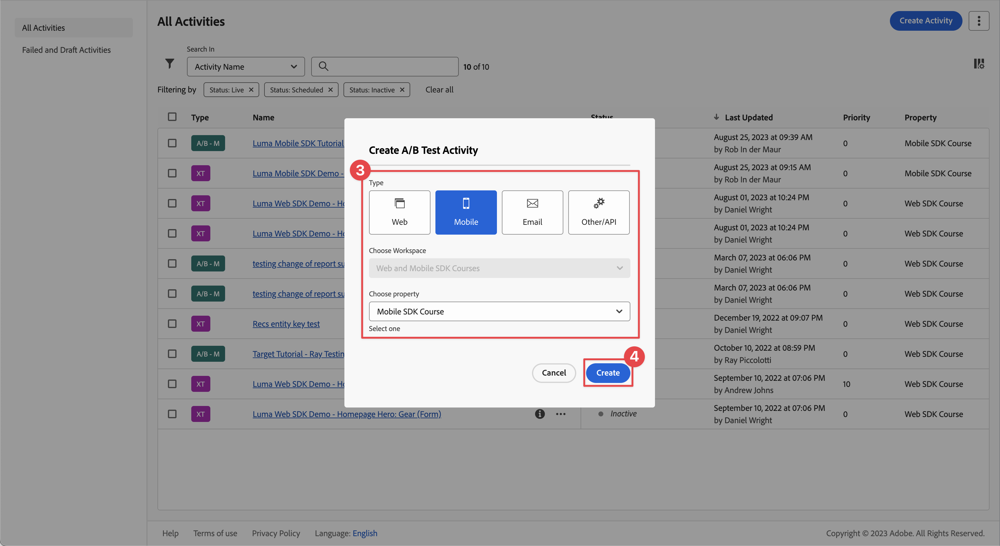

# Optimieren und Personalisieren mit Adobe Target

Erfahren Sie, wie Sie die Erlebnisse in Ihren mobilen Apps mit dem Platform Mobile SDK und Adobe Target optimieren und personalisieren können.

Target bietet alles, was Sie an die Erlebnisse Ihrer Kunden anpassen und personalisieren müssen. Mit Target können Sie den Umsatz Ihrer Web- und mobilen Sites, Apps, sozialen Medien und anderer digitaler Kanäle maximieren. Target kann A/B-Tests durchführen, Multivarianz-Tests durchführen, Produkte und Inhalte empfehlen, Inhalte auf Zielgruppen ausrichten, Inhalte mit KI automatisch personalisieren und vieles mehr. Der Schwerpunkt dieser Lektion liegt auf der A/B-Test-Funktionalität von Target. Weitere Informationen finden Sie in der [A/B-Test - Übersicht](https://experienceleague.adobe.com/docs/target/using/activities/abtest/test-ab.html?lang=en) .


Bevor Sie A/B-Tests mit Target durchführen können, müssen Sie sicherstellen, dass die richtigen Konfigurationen und Integrationen vorhanden sind.

>[!NOTE]
>
>Diese Lektion ist optional und gilt nur für Adobe Target-Benutzer, die A/B-Tests durchführen möchten.


## Voraussetzungen

* App erfolgreich erstellt und ausgeführt, wobei SDKs installiert und konfiguriert sind.
* Zugriff auf Adobe Target mit Berechtigungen, ordnungsgemäß konfigurierten Rollen, Arbeitsbereichen und Eigenschaften, wie [hier](https://experienceleague.adobe.com/docs/target/using/administer/manage-users/enterprise/property-channel.html?lang=de) beschrieben.


## Lernziele

In dieser Lektion werden Sie:

* Aktualisieren Sie Ihren Datastream für die Target-Integration.
* Aktualisieren Sie Ihre Tag-Eigenschaft mit der Journey Optimizer - Decisioning-Erweiterung.
* Aktualisieren Sie Ihr Schema, um Projektereignisse zu erfassen.
* Validieren Sie die Einrichtung in &quot;Assurance&quot;.
* Erstellen Sie einen einfachen A/B-Test in Target.
* Aktualisieren Sie Ihre App, um die Optimizer-Erweiterung zu registrieren.
* Implementieren Sie den A/B-Test in Ihre App.
* Validieren Sie die Implementierung in Assurance.


## Einrichten

>[!TIP]
>
>Wenn Sie Ihre App bereits als Teil der Lektion [Journey Optimizer-Angebote](journey-optimizer-offers.md) eingerichtet haben, haben Sie möglicherweise bereits einige der Schritte in diesem Einrichtungsabschnitt ausgeführt.

### Aktualisierung der Konfiguration des Datenspeichers

#### Adobe Target

Um sicherzustellen, dass Daten, die von Ihrer mobilen App an das Experience Platform-Edge Network gesendet werden, an Adobe Target weitergeleitet werden, müssen Sie Ihre Datenspeicherkonfiguration aktualisieren.

1. Wählen Sie in der Datenerfassungs-Benutzeroberfläche **[!UICONTROL Datastreams]** aus und wählen Sie Ihren Datastream aus, z. B. **[!DNL Luma Mobile App]**.
1. Wählen Sie **[!UICONTROL Dienst hinzufügen]** und dann **[!UICONTROL Adobe Target]** aus der Liste **[!UICONTROL Dienst]**.
1. Wenn Sie Target Premium-Kunde sind und Eigenschafts-Token verwenden möchten, geben Sie den Target-Wert **[!UICONTROL Eigenschafts-Token]** ein, den Sie für diese Integration verwenden möchten. Target Standard-Benutzer können diesen Schritt überspringen.

   Sie finden Ihre Eigenschaften in der Target-Benutzeroberfläche unter **[!UICONTROL Administration]** > **[!UICONTROL Eigenschaften]**. Wählen Sie  aus, um das Eigenschafts-Token für die Eigenschaft anzuzeigen, die Sie verwenden möchten. Das Eigenschafts-Token hat ein Format wie `"at_property": "xxxxxxxx-xxxx-xxxxx-xxxx-xxxxxxxxxxxx"`; Sie dürfen nur den Wert `xxxxxxxx-xxxx-xxxxx-xxxx-xxxxxxxxxxxx` eingeben.

   Optional können Sie eine Target-Umgebungs-ID angeben. Target verwendet Umgebungen, um Ihre Sites und Umgebungen vor der Produktion zu organisieren und so eine einfache Verwaltung und separate Berichterstellung zu ermöglichen. Zu den vordefinierten Umgebungen gehören Produktion, Staging und Entwicklung. Weitere Informationen finden Sie unter [Umgebungen](https://experienceleague.adobe.com/docs/target/using/administer/environments.html?lang=en) und [Ziel-Umgebungs-ID](https://experienceleague.adobe.com/docs/platform-learn/implement-web-sdk/applications-setup/setup-target.html?lang=en#target-environment-id) .

   Optional können Sie einen Target-Drittanbieter-ID-Namespace angeben, um die Profilsynchronisierung für einen Identitäts-Namespace zu unterstützen (z. B. CRM-ID). Weitere Informationen finden Sie unter [Target Third Party ID namespace](https://experienceleague.adobe.com/docs/platform-learn/implement-web-sdk/applications-setup/setup-target.html?lang=en#target-third-party-id-namespace) .

1. Wählen Sie **[!UICONTROL Speichern]** aus.

   


#### Adobe Journey Optimizer

Um sicherzustellen, dass Daten, die von Ihrer mobilen App an das Edge Network gesendet werden, an Journey Optimizer weitergeleitet werden - Entscheidungsverwaltung, aktualisieren Sie Ihre Datenspeicherkonfiguration.

1. Wählen Sie in der Datenerfassungs-Benutzeroberfläche **[!UICONTROL Datastreams]** aus und wählen Sie Ihren Datastream aus, z. B. **[!DNL Luma Mobile App]**.
1. Wählen Sie  für **[!UICONTROL Experience Platform]** und dann  **[!UICONTROL Bearbeiten]** aus dem Kontextmenü.
1. Stellen Sie im Bildschirm **[!UICONTROL Datastreams]** >  > **[!UICONTROL Adobe Experience Platform]** sicher, dass **[!UICONTROL Offer decisioning]**, **[!UICONTROL Edge Segmentation]** und **[!UICONTROL Personalization Destinations]** ausgewählt sind. Wenn Sie auch den Journey Optimizer-Lektionen folgen, wählen Sie **[!UICONTROL Adobe Journey Optimizer]**. Weitere Informationen finden Sie unter [Adobe Experience Platform-Einstellungen](https://experienceleague.adobe.com/docs/experience-platform/datastreams/configure.html?lang=en#aep) .
1. Wählen Sie **[!UICONTROL Speichern]** aus, um Ihre Datastream-Konfiguration zu speichern.

   


### Installieren von Adobe Journey Optimizer - Decisioning Tags-Erweiterung

1. Navigieren Sie zu **[!UICONTROL Tags]**, suchen Sie Ihre mobile Tag-Eigenschaft und öffnen Sie die Eigenschaft .
1. Wählen Sie **[!UICONTROL Erweiterungen]** aus.
1. Wählen Sie **[!UICONTROL Katalog]** aus.
1. Suchen Sie nach der Erweiterung **[!UICONTROL Adobe Journey Optimizer - Decisioning]** .
1. Installieren Sie die -Erweiterung. Die Erweiterung erfordert keine zusätzliche Konfiguration.

   


### Schema aktualisieren

1. Navigieren Sie zur Datenerfassungsoberfläche und wählen Sie in der linken Leiste **[!UICONTROL Schemas]** aus.
1. Wählen Sie in der oberen Leiste **[!UICONTROL Durchsuchen]** aus.
1. Wählen Sie Ihr Schema aus, um es zu öffnen.
1. Wählen Sie im Schema-Editor  **[!UICONTROL Hinzufügen]** neben **[!UICONTROL Feldergruppen]** aus.
1. Suchen Sie im Dialogfeld **[!UICONTROL Feldergruppen hinzufügen]** nach `proposition`, wählen Sie **[!UICONTROL Erlebnisereignis - Vorschlagsinteraktionen]** und wählen Sie **[!UICONTROL Feldergruppen hinzufügen]** aus.
   
1. Um die Änderungen am Schema zu speichern, wählen Sie **[!UICONTROL Speichern]** aus.


### Validieren der Einrichtung in der Zuverlässigkeitserklärung

So überprüfen Sie Ihre Einrichtung in Assurance:

1. Navigieren Sie zur Benutzeroberfläche &quot;Assurance&quot;.
1. Wählen Sie **[!UICONTROL Konfigurieren]** in der linken Leiste und klicken Sie auf  neben **[!UICONTROL Einrichtung validieren]** unter **[!UICONTROL ADOBE JOURNEY OPTIMIZER-ENTSCHEIDUNG]**.
1. Wählen Sie **[!UICONTROL Speichern]** aus.
1. Wählen Sie in der linken Leiste **[!UICONTROL Setup überprüfen]** aus. Beide Datastream-Einstellungen werden validiert und das SDK-Setup in Ihrer Anwendung.
   

## Erstellen eines A/B-Tests

Es gibt viele Aktivitätstypen, die Sie in Adobe Target erstellen und in einer App implementieren können, wie in der Einführung beschrieben. Für diese Lektion implementieren Sie einen A/B-Test.

1. Wählen Sie in der Target-Benutzeroberfläche in der oberen Leiste **[!UICONTROL Aktivitäten]** aus.
1. Wählen Sie **[!UICONTROL Aktivität erstellen]** und **[!UICONTROL A/B-Test]** aus dem Kontextmenü.
1. Wählen Sie im Dialogfeld **[!UICONTROL A/B-Test-Aktivität erstellen]** die Option **[!UICONTROL Mobil]** als **[!UICONTROL Typ]**, wählen Sie einen Arbeitsbereich aus der Liste **[!UICONTROL Workspace auswählen]** aus und wählen Sie Ihre Eigenschaft aus der Liste **[!UICONTROL Eigenschaft auswählen]** aus, wenn Sie Target Premium-Kunde sind und im Datastream ein Eigenschafts-Token angegeben haben.
1. Wählen Sie **[!UICONTROL Erstellen]** aus.
   

1. Im Bildschirm **[!UICONTROL Untitled activity]** beim Schritt **[!UICONTROL Erlebnisse]**:

   1. Geben Sie `luma-mobileapp-abtest` in **[!UICONTROL Position auswählen]** unter **[!UICONTROL POSITION 1]** ein. Dieser Ortsname (häufig als Mbox bezeichnet) wird später in der App-Implementierung verwendet.
   1. Wählen Sie &quot;&quot;neben &quot;**[!UICONTROL Standardinhalt]**&quot;und wählen Sie im Kontextmenü die Option &quot;**[!UICONTROL JSON-Angebot erstellen]**&quot;.
   1. Kopieren Sie die folgende JSON in **[!UICONTROL Geben Sie ein gültiges JSON-Objekt ein]**.

      ```json
      { 
          "title": "Luma Anaolog Watch",
          "text": "Designed to stand up to your active lifestyle, this women's Luma Analog Watch features a tasteful brushed chrome finish and a stainless steel, water-resistant construction for lasting durability.", 
          "image": "https://luma.enablementadobe.com/content/dam/luma/en/products/gear/watches/Luma_Analog_Watch.jpg" 
      }
      ```

   1. Wählen Sie **[!UICONTROL + Erlebnis hinzufügen]** aus.

      

   1. Wiederholen Sie Schritt b und c für Erlebnis B, verwenden Sie stattdessen die folgende JSON:

      ```json
      { 
          "title": "Aim Analog Watch",
          "text": "The flexible, rubberized strap is contoured to conform to the shape of your wrist for a comfortable all-day fit. The face features three illuminated hands, a digital read-out of the current time, and stopwatch functions.", 
          "image": "https://luma.enablementadobe.com/content/dam/luma/en/products/gear/watches/Aim_Watch.jpg" 
      }
      ```

   1. Klicken Sie auf **[!UICONTROL Weiter]**.

      

1. Überprüfen Sie im Schritt **[!DNL Targeting]** die Einrichtung Ihres A/B-Tests. Standardmäßig werden beide Angebote gleichmäßig allen Besuchern zugeordnet. Klicken Sie auf **[!UICONTROL Weiter]**, um fortzufahren.

   

1. Im Schritt **[!UICONTROL Ziele und Einstellungen]** :

   1. Benennen Sie Ihre unbenannte Aktivität um, z. B. &quot;`Luma Mobile SDK Tutorial - A/B Test Example`&quot;.
   1. Geben Sie einen **[!UICONTROL Ziel]** für Ihren A/B-Test ein, z. B. `A/B Test for Luma mobile app tutorial`.
   1. Wählen Sie **[!UICONTROL Konversion]**, **[!UICONTROL Anzeige einer Mbox]** in der Kachel **[!UICONTROL Zielmetrik]** > **[!UICONTROL MY PRIMÄRES ZIEL]** aus und geben Sie den Namen Ihrer Position (Mbox) ein, z. B. `luma-mobileapp-abtest`.
   1. Wählen Sie **[!UICONTROL Speichern und schließen]** aus.

      

1. Zurück im Bildschirm **[!UICONTROL Alle Aktivitäten]** :

   1. Wählen Sie  in Ihrer Aktivität aus.
   1. Wählen Sie  **[!UICONTROL Aktivieren]** aus, um Ihren A/B-Test zu aktivieren.

   


## Implementieren von Target in Ihre App

Wie in den vorherigen Lektionen erläutert, bietet die Installation einer mobilen Tag-Erweiterung nur die Konfiguration. Als Nächstes müssen Sie das Optimize SDK installieren und registrieren. Wenn diese Schritte nicht klar sind, lesen Sie den Abschnitt [SDKs installieren](install-sdks.md) .

>[!NOTE]
>
>Wenn Sie den Abschnitt [SDK installieren](install-sdks.md) abgeschlossen haben, ist das SDK bereits installiert und Sie können diesen Schritt überspringen.
>

1. Stellen Sie in Xcode sicher, dass [AEP Optimize](https://github.com/adobe/aepsdk-messaging-ios) zur Liste der Pakete in Package-Abhängigkeiten hinzugefügt wird. Siehe [Swift Package Manager](install-sdks.md#swift-package-manager).
1. Navigieren Sie im Xcode-Projekt-Navigator zu **[!DNL Luma]** > **[!DNL Luma]** > **[!DNL AppDelegate]** .
1. Stellen Sie sicher, dass `AEPOptimize` Teil Ihrer Importliste ist.

   `import AEPOptimize`

1. Stellen Sie sicher, dass `Optimize.self` Teil des Arrays von Erweiterungen ist, die Sie registrieren.

   ```swift
   let extensions = [
       AEPIdentity.Identity.self,
       Lifecycle.self,
       Signal.self,
       Edge.self,
       AEPEdgeIdentity.Identity.self,
       Consent.self,
       UserProfile.self,
       Places.self,
       Messaging.self,
       Optimize.self,
       Assurance.self
   ]
   ```

1. Navigieren Sie im Xcode Project-Navigator zu **[!DNL Luma]** > **[!DNL Luma]** > **[!DNL Utils]** > **[!DNL MobileSDK]** . Suchen Sie die Funktion ` func updatePropositionAT(ecid: String, location: String) async` . Fügen Sie den folgenden Code hinzu:

   ```swift
   // set up the XDM dictionary, define decision scope and call update proposition API
   Task {
       let ecid = ["ECID" : ["id" : ecid, "primary" : true] as [String : Any]]
       let identityMap = ["identityMap" : ecid]
       let xdmData = ["xdm" : identityMap]
       let decisionScope = DecisionScope(name: location)
       Optimize.clearCachedPropositions()
       Optimize.updatePropositions(for: [decisionScope], withXdm: xdmData)
   }
   ```

   Diese Funktion:

   * richtet ein XDM-Wörterbuch `xdmData` ein, das die ECID enthält, um das Profil zu identifizieren, für das Sie den A/B-Test vorlegen müssen, und
   * definiert einen &quot;`decisionScope`&quot;, ein Array von Orten, an denen der A/B-Test präsentiert werden soll.

   Anschließend ruft die Funktion zwei APIs auf: [`Optimize.clearCachedPropositions`](https://developer.adobe.com/client-sdks/documentation/adobe-journey-optimizer-decisioning/api-reference/#clearpropositions) und [`Optimize.updatePropositions`](https://developer.adobe.com/client-sdks/documentation/adobe-journey-optimizer-decisioning/api-reference/#updatepropositions). Mit diesen Funktionen werden zwischengespeicherte Vorschläge gelöscht und die Vorschläge für dieses Profil aktualisiert. Ein Vorschlag in diesem Zusammenhang ist das Erlebnis (Angebot), das aus der Target-Aktivität ausgewählt wurde (Ihr A/B-Test) und das Sie in [Erstellen eines A/B-Tests](#create-an-ab-test) definiert haben.

1. Navigieren Sie im Xcode-Projekt-Navigator zu **[!DNL Luma]** > **[!DNL Luma]** > **[!DNL Views]** > **[!DNL Personalization]** > **[!DNL TargetOffersView]** . Suchen Sie die Funktion `func onPropositionsUpdateAT(location: String) async {` und überprüfen Sie den Code dieser Funktion. Der wichtigste Teil dieser Funktion ist der [`Optimize.onPropositionsUpdate`](https://developer.adobe.com/client-sdks/documentation/adobe-journey-optimizer-decisioning/api-reference/#onpropositionsupdate) -API-Aufruf, der:
   * ruft die Vorschläge für das aktuelle Profil basierend auf dem Entscheidungsbereich ab (dem Ort, den Sie im A/B-Test definiert haben),
   * ruft das Angebot aus dem Vorschlag ab,
   * entpackt den Inhalt des Angebots, damit er ordnungsgemäß in der App angezeigt werden kann, und
   * Triggers die Aktion &quot;`displayed()`&quot; im Angebot, mit der ein Ereignis an Platform Edge Network zurückgesendet wird, das das Angebot informiert, wird angezeigt.

1. Fügen Sie in **[!DNL TargetOffersView]** den folgenden Code zum Modifikator `.onFirstAppear` hinzu. Dieser Code stellt sicher, dass der Callback zur Aktualisierung der Angebote nur einmal registriert wird.

   ```swift
   // Invoke callback for offer updates
   Task {
       await self.onPropositionsUpdateAT(location: location)
   }
   ```

1. Fügen Sie in **[!DNL TargetOffersView]** den folgenden Code zum Modifikator `.task` hinzu. Dieser Code aktualisiert die Angebote, wenn die Ansicht aktualisiert wird.

   ```swift
   // Clear and update offers
   await self.updatePropositionsAT(ecid: currentEcid, location: location)
   ```

Sie können zusätzliche Target-Parameter (wie Mbox-, Profil-, Produkt- oder Bestellparameter) in einer Personalisierungsabfrageanfrage an das Experience Edge-Netzwerk senden, indem Sie sie beim Aufruf der API [`Optimize.updatePropositions`](https://developer.adobe.com/client-sdks/documentation/adobe-journey-optimizer-decisioning/api-reference/#updatepropositions) in einem Datenwörterbuch hinzufügen. Weitere Informationen finden Sie unter [Zielparameter](https://developer.adobe.com/client-sdks/documentation/adobe-journey-optimizer-decisioning/#target-parameters).


## Validieren mit der App

1. Erstellen Sie die App im Simulator oder auf einem physischen Gerät aus Xcode neu und führen Sie sie mit  aus.

1. Navigieren Sie zur Registerkarte **[!UICONTROL Personalization]** .

1. Scrollen Sie nach unten, und eines der beiden Angebote, die Sie in Ihrem A/B-Test definiert haben, wird in der Kachel **[!UICONTROL TARGET]** angezeigt.

   


## Validieren der Implementierung in Assurance

So validieren Sie den A/B-Test in Assurance:

1. Lesen Sie den Abschnitt [Setup instructions](assurance.md#connecting-to-a-session) , um Ihren Simulator oder Ihr Gerät mit Assurance zu verbinden.
1. Wählen Sie **[!UICONTROL Konfigurieren]** in der linken Leiste und klicken Sie auf  neben **[!UICONTROL Überprüfen und Simulieren]** unter **[!UICONTROL ADOBE JOURNEY OPTIMIZER DECISIONING]**.
1. Wählen Sie **[!UICONTROL Speichern]** aus.
1. Wählen Sie in der linken Leiste **[!UICONTROL Überprüfen und simulieren]** aus. Beide Datastream-Einstellungen werden validiert und das SDK-Setup in Ihrer Anwendung.
1. Wählen Sie in der oberen Leiste **[!UICONTROL Anforderungen]** aus. Sie sehen Ihre **[!DNL Target]** -Anfragen.
   

1. Auf den Registerkarten **[!UICONTROL Simulieren]** und **[!UICONTROL Ereignisliste]** finden Sie weitere Informationen zur Funktionsprüfung Ihrer Einrichtung für Target-Angebote.

## Nächste Schritte

Sie sollten jetzt über alle Tools verfügen, um Ihrer App, sofern relevant und zutreffend, weitere A/B-Tests oder andere Target-Aktivitäten (wie Erlebnis-Targeting, Multivarianz-Test) hinzuzufügen. Detailliertere Informationen finden Sie im [GitHub-Repository für die Optimize-Erweiterung](https://github.com/adobe/aepsdk-optimize-ios) , wo Sie auch einen Link zu einem dedizierten [Tutorial](https://opensource.adobe.com/aepsdk-optimize-ios/#/tutorials/README) zur Verfolgung von Adobe Target-Angeboten finden.

>[!SUCCESS]
>
>Sie haben die App für A/B-Tests aktiviert und die Ergebnisse eines A/B-Tests mit Adobe Target und der Adobe Journey Optimizer - Decisioning-Erweiterung für das Adobe Experience Platform Mobile SDK angezeigt.
>
>Vielen Dank, dass Sie Ihre Zeit investiert haben, um mehr über das Adobe Experience Platform Mobile SDK zu erfahren. Wenn Sie Fragen haben, allgemeine Rückmeldungen oder Anregungen zu zukünftigen Inhalten haben möchten, teilen Sie diese in diesem [Experience League Community-Diskussionbeitrag](https://experienceleaguecommunities.adobe.com/t5/adobe-experience-platform-data/tutorial-discussion-implement-adobe-experience-cloud-in-mobile/td-p/443796) mit.

Weiter: **[Abschluss und nächste Schritte](conclusion.md)**
