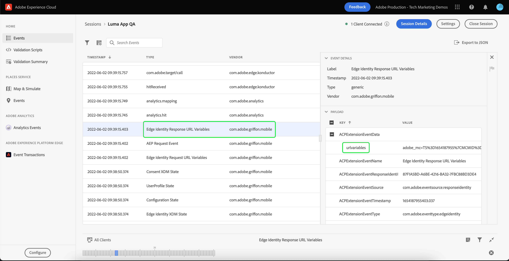

# WebViews verarbeiten

Erfahren Sie, wie Sie die Datenerfassung mit WebViews in einer mobilen App durchführen.

>[!INFO]
>
> Dieses Tutorial wird Ende November 2023 mithilfe einer neuen Beispiel-Mobile-App durch ein neues Tutorial ersetzt.

## Voraussetzungen

* App erfolgreich erstellt und ausgeführt, wobei SDKs installiert und konfiguriert sind.

## Lernziele

In dieser Lektion werden Sie:

* Erfahren Sie, warum Sie besondere Überlegungen zu WebViews vornehmen müssen.
* Machen Sie sich mit dem Code vertraut, der zur Vermeidung von Tracking-Problemen erforderlich ist.

## Potenzielle Tracking-Probleme

Wenn Sie Daten aus dem nativen Teil der App und einer WebView senden, generiert jede einzelne eine eigene Experience Cloud-ID (ECID). Dies führt zu getrennten Treffern und zu überhöhten Besuchs-/Besucherdaten. Weitere Informationen über die ECID finden Sie im [ECID-Übersicht](https://experienceleague.adobe.com/docs/experience-platform/identity/ecid.html?lang=en).

Um diese unerwünschte Situation zu beheben, ist es wichtig, die ECID des Benutzers aus dem nativen Teil an WebView zu übergeben.

Die JavaScript-Erweiterung &quot;Experience Cloud ID-Dienst&quot;in WebView extrahiert die ECID aus der URL, anstatt eine Anfrage an Adobe für eine neue ID zu senden. Der ID-Dienst verwendet diese ECID zur Besucherverfolgung.

## Implementierung

Suchen Sie in der Beispielanwendung &quot;Luma&quot;die `TermsOfService.swift` -Datei (in der `Intro-Login_SignUp` -Ordner) und suchen Sie den folgenden Code:

```swift
// Show tou.html
let url = Bundle.main.url(forResource: "tou", withExtension: "html")
let myRequest = URLRequest(url: url!)
self.webView.load(myRequest)
```

Dies ist eine einfache Möglichkeit, eine WebView zu laden. In diesem Fall handelt es sich um eine lokale Datei, für Remote-Seiten gelten jedoch die gleichen Konzepte.

Ändern Sie den Webansichtscode wie unten gezeigt:

```swift
let url = Bundle.main.url(forResource: "tou", withExtension: "html")
if var urlString = url?.absoluteString {
    // Adobe Experience Platform - Handle Web View
    AEPEdgeIdentity.Identity.getUrlVariables {(urlVariables, error) in
        if let error = error {
            self.simpleAlert("\(error.localizedDescription)")
            return;
        }

        if let urlVariables: String = urlVariables {
            urlString.append("?" + urlVariables)
        }

        DispatchQueue.main.async {
            self.webView.load(URLRequest(url: URL(string: urlString)!))
        }
        print("Successfully retrieved urlVariables for WebView, final URL: \(urlString)")
    }
} else {
    self.simpleAlert("Failed to create URL for webView")
}
```

Weitere Informationen zum `Identity.getUrlVariables` API im [Referenzhandbuch zur Identity für die Edge Network Extension-API](https://developer.adobe.com/client-sdks/documentation/identity-for-edge-network/api-reference/#geturlvariables).

## Validierung

Nach der Überprüfung der [Einrichtungsanweisungen](assurance.md) und das Verbinden Ihres Simulators oder Geräts mit Assurance, laden Sie die WebView und suchen Sie nach der `Edge Identity Response URL Variables` -Ereignis aus `com.adobe.griffon.mobile` -Anbieter.

Um die WebView zu laden, wechseln Sie zur Startseite der Luma-App, wählen Sie das Symbol &quot;Konto&quot;und dann die &quot;Nutzungsbedingungen&quot;in der Fußzeile aus.

Wählen Sie nach dem Laden der WebView das Ereignis aus und überprüfen Sie die `urlvariables` im Feld `ACPExtensionEventData` -Objekt, das bestätigt, dass die folgenden Parameter in der URL vorhanden sind: `adobe_mc`, `mcmid`, und `mcorgid`.



Beispiel `urvariables` -Feld sehen Sie unten:

```html
// Original (with escaped characters)
adobe_mc=TS%3D1636526122%7CMCMID%3D79076670946787530005526183384271520749%7CMCORGID%3D7ABB3E6A5A7491460A495D61%40AdobeOrg

// Beautified
adobe_mc=TS=1636526122|MCMID=79076670946787530005526183384271520749|MCORGID=7ABB3E6A5A7491460A495D61@AdobeOrg
```

>[!NOTE]
>
>Die Besucherzuordnung über diese URL-Parameter wird derzeit im Platform Web SDK (Versionen 2.11.0 oder höher) unterstützt und `VisitorAPI.js`.


Weiter: **[Identität](identity.md)**

>[!NOTE]
>
>Vielen Dank, dass Sie Ihre Zeit investiert haben, um mehr über das Adobe Experience Platform Mobile SDK zu erfahren. Wenn Sie Fragen haben, ein allgemeines Feedback teilen möchten oder Vorschläge zu künftigen Inhalten haben, teilen Sie diese bitte mit. [Experience League Community-Diskussionsbeitrag](https://experienceleaguecommunities.adobe.com/t5/adobe-experience-platform-launch/tutorial-discussion-implement-adobe-experience-cloud-in-mobile/td-p/443796)