# 1.6.1 Erste Schritte mit AEM-Agenten

>[!IMPORTANT]
>
>Um diese Übung abzuschließen, benötigen Sie Zugriff auf eine funktionierende Umgebung für AEM Sites und Assets CS mit EDS, und die verschiedenen AEM-Agenten müssen für die von Ihnen verwendete IMS-Organisation aktiviert sein.
>
>Wenn Sie noch keine solche Umgebung haben, gehen Sie zu Übung [Adobe Experience Manager Cloud Service &amp; Edge Delivery Services](./../../../modules/asset-mgmt/module2.1/aemcs.md){target="_blank"}. Folgen Sie den Anweisungen dort, und Sie haben Zugriff auf eine solche Umgebung.

>[!IMPORTANT]
>
>Wenn Sie zuvor ein AEM CS-Programm mit einer AEM Sites- und Assets CS-Umgebung konfiguriert haben, wurde Ihre AEM CS-Sandbox möglicherweise in den Ruhezustand versetzt. Da der Ruhezustand einer solchen Sandbox 10-15 Minuten dauert, ist es ratsam, den Ruhezustand jetzt zu beenden, damit Sie nicht zu einem späteren Zeitpunkt warten müssen.

## 1.6.1.1

Der Adobe Experience Manager (AEM) Discovery Agent ist ein KI-gestütztes Tool in AEM as a Cloud Service, mit dem Anwender Inhalte - einschließlich Assets, Inhaltsfragmenten und adaptivem Forms - mithilfe natürlicher Sprachaufforderungen finden, abrufen und verwenden können. Dadurch entfällt die Notwendigkeit manueller, klickintensiver oder komplexer Filter, da Intent und Suche im gesamten Repository verstanden werden.

Um den **Discovery Agent** verwenden zu können, erstellen Sie zunächst einige Tags in Adobe Experience Manager, die Sie dann mit Tags versehen. Sobald dies geschehen ist, können Sie den KI-Assistenten verwenden, um Assets auf einfache und geschäftsfreundliche Weise zu finden.

Navigieren Sie zu [https://my.cloudmanager.adobe.com](https://my.cloudmanager.adobe.com){target="_blank"}. Die gewünschte Organisation ist `--aepImsOrgName--`.

### Erstellen und Verwenden von Tags mit Assets

Klicken Sie hier, um Ihr Cloud Manager-Programm zu öffnen, das `--aepUserLdap-- - CitiSignal AEM+ACCS` heißen sollte.

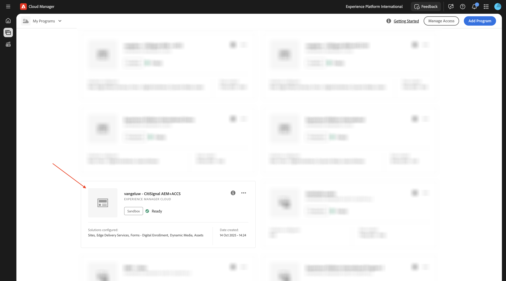

Klicken Sie auf die URL Ihrer Umgebung, um sie zu öffnen.

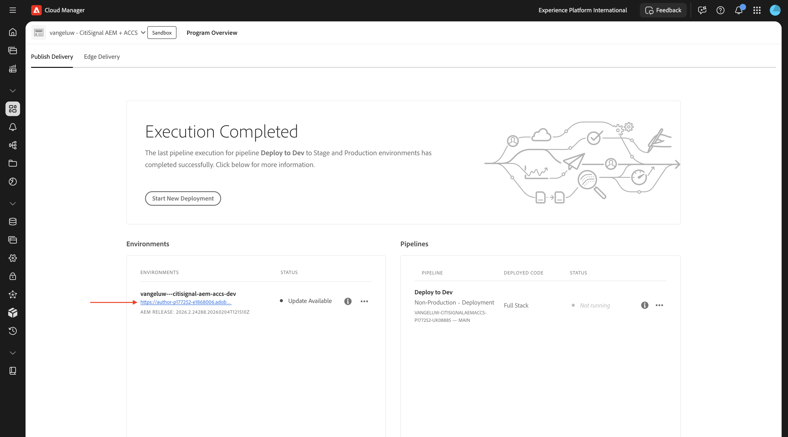

Klicken Sie auf **Symbol** Hammer“.


Klicken **unter** Allgemein **auf**.


Sie sollten das dann sehen. Klicken Sie auf **Erstellen** und wählen Sie dann **Namespace erstellen** aus.

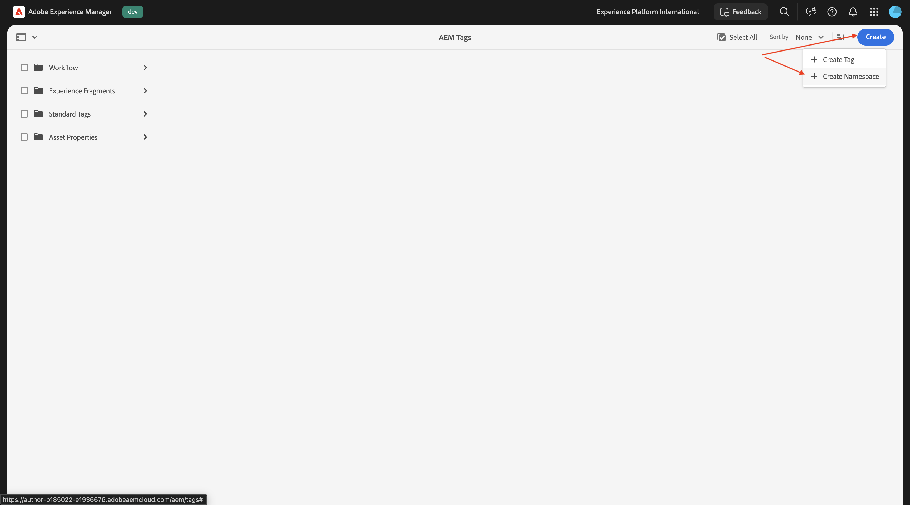

Geben Sie im Feld **Titel** Folgendes ein: `CitiSignal`. Klicken Sie auf **Erstellen**.


Drilldown in den Namespace **CitiSignal** durch Klicken darauf. Klicken Sie **Erstellen** und wählen Sie dann **Tag erstellen** aus.

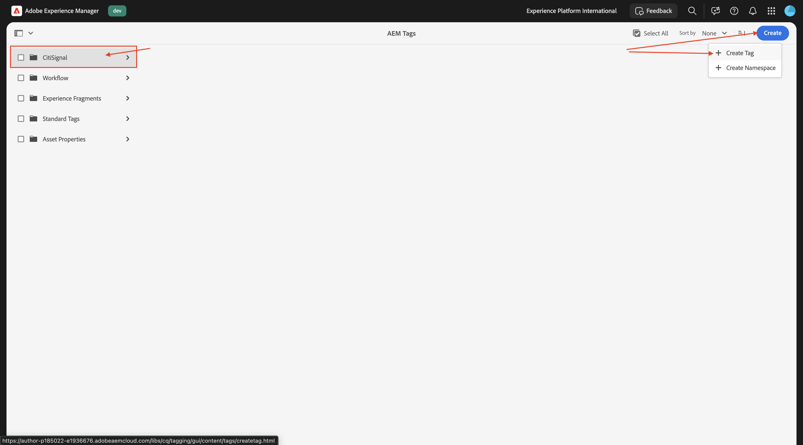

Geben Sie im Feld **Titel** Folgendes ein: `Campaign`. Klicken Sie auf **Senden**.

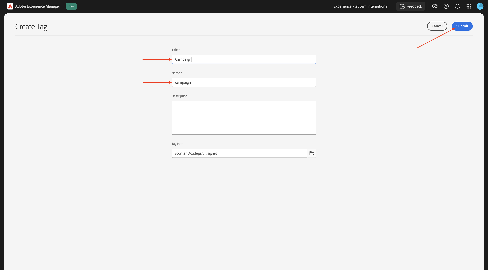

Wählen Sie das Tag **Kampagne** aus, indem Sie darauf klicken. Klicken Sie **Erstellen** und wählen Sie dann **Tag erstellen** aus.


Geben Sie im Feld **Titel** Folgendes ein: `Winter 2026`. Klicken Sie auf **Senden**.

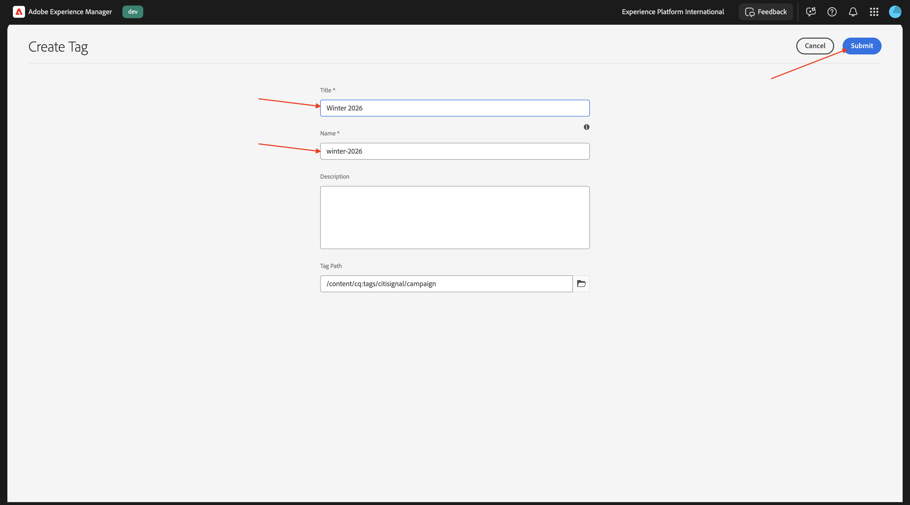

Wählen Sie das Tag **Kampagne** aus, indem Sie darauf klicken. Klicken Sie **Erstellen** und wählen Sie dann **Tag erstellen** aus.

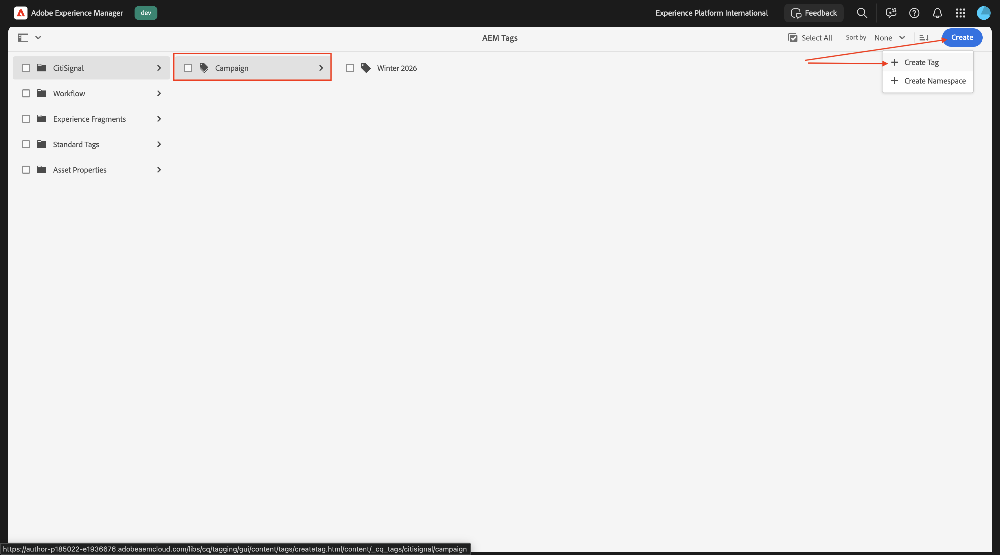

Geben Sie im Feld **Titel** Folgendes ein: `Spring 2026`. Klicken Sie auf **Senden**.


Du solltest das jetzt haben.

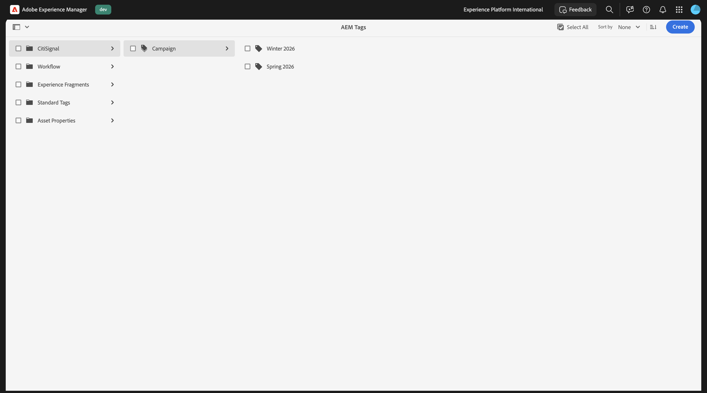

Klicken Sie auf **Adobe Experience Manager** und dann auf **Assets**.

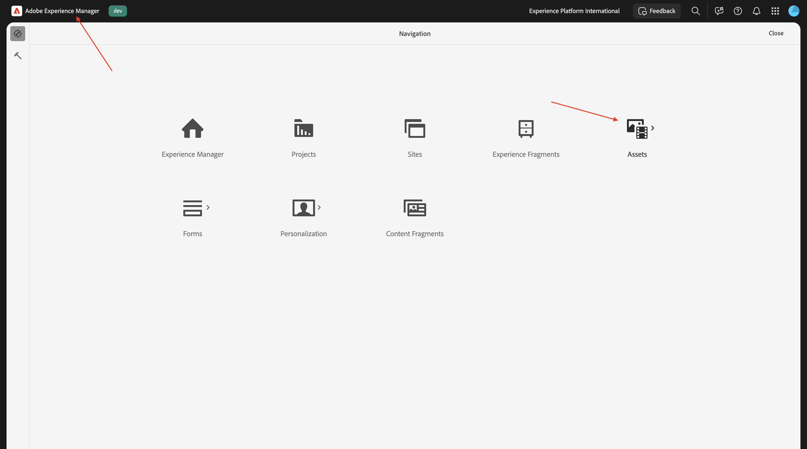

Klicken Sie auf **Dateien**.


Doppelklicken Sie auf den Ordner **CitiSignal**, um ihn zu öffnen.

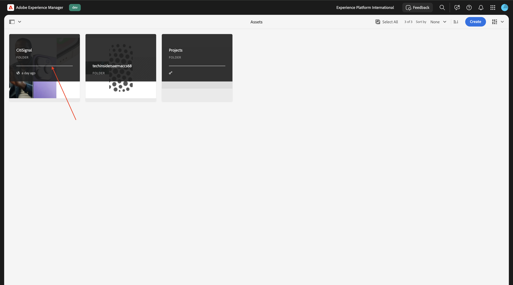

Klicken Sie **Erstellen** und wählen Sie dann **Dateien** aus.

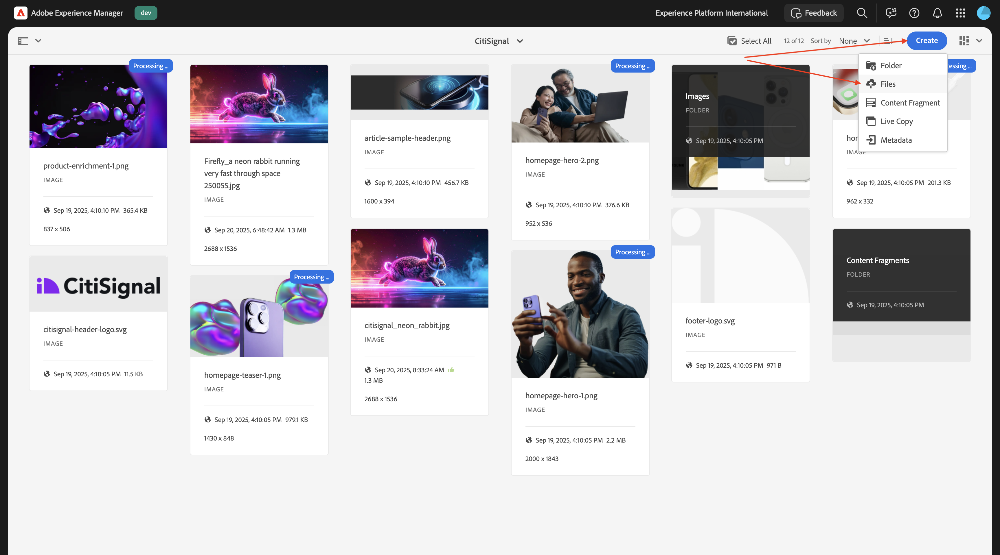

Laden Sie die Datei [Citisignal-images-campaign.zip](./assets/citisignal-images-campaign.zip) herunter und entpacken Sie sie auf Ihren Desktop.


Auswählen. Die 3 Dateien, die Sie gerade heruntergeladen haben, und klicken Sie auf **Öffnen**.

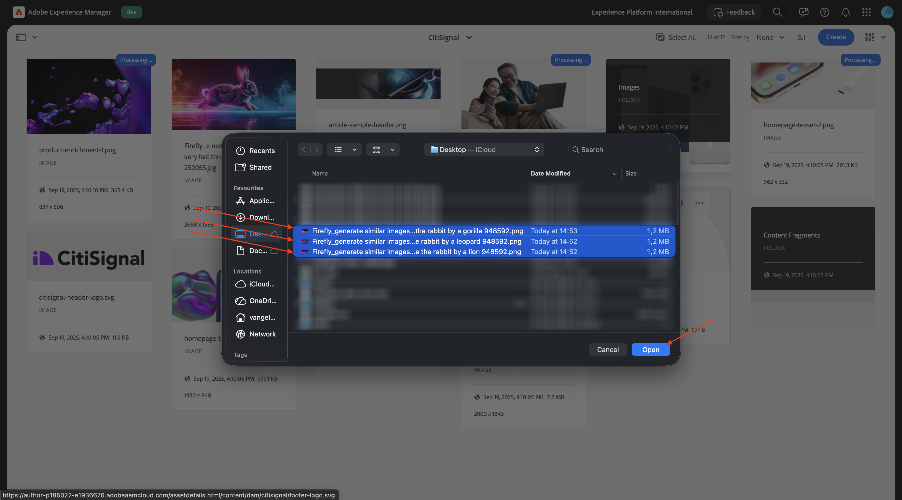

Klicken Sie **Hochladen**.


Sie sollten das dann sehen.


Wählen Sie das erste Bild aus und klicken Sie dann auf **Eigenschaften**.


Klicken Sie auf **Ordner**-Symbol unter Tags.


Wählen Sie das Tag **Frühling 2026** aus und klicken Sie auf **Auswählen**. Wiederholen Sie diesen Vorgang für die folgenden Bilder:

- Citisignal_lion.png
- Citisignal_Leopard.png
- Citisignal_Gorilla.png
- Citisignal_rabbit.png

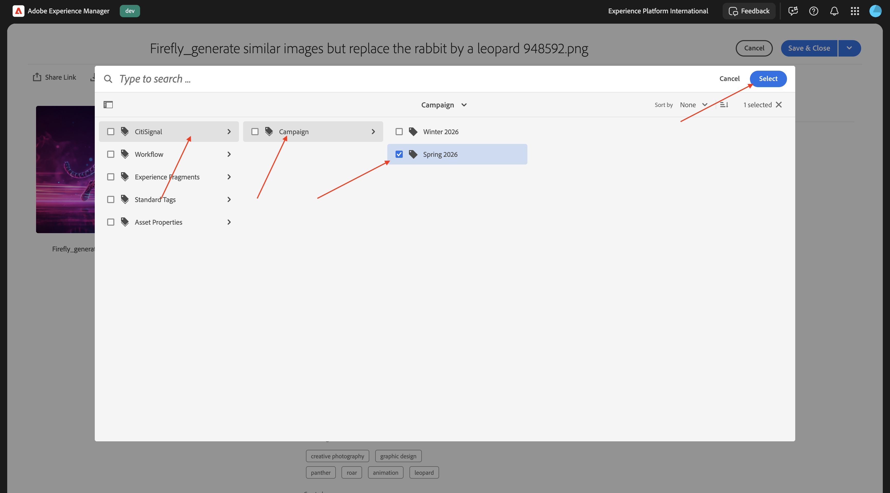

Nachdem Sie dieses Tag für alle Bilder ausgewählt haben, navigieren Sie zu **Experience Manager Assets**.


Wählen Sie das verwendete Repository aus.


Wechseln Sie zu **Assets** und öffnen Sie den Ordner **CitiSignal**.

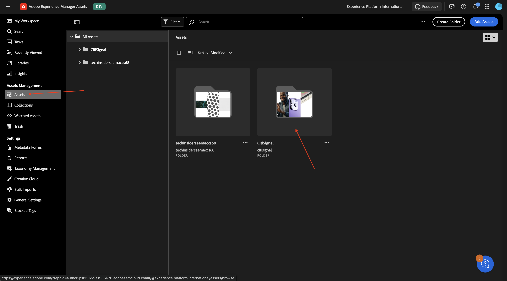

Öffnen Sie das erste Bild.


Wählen Sie **Genehmigt** und klicken Sie dann auf **Speichern**.


Unter **Tags** wird das zuvor ausgewählte Tag angezeigt.


Wiederholen Sie diesen Vorgang, damit alle vier Bilder validiert werden.

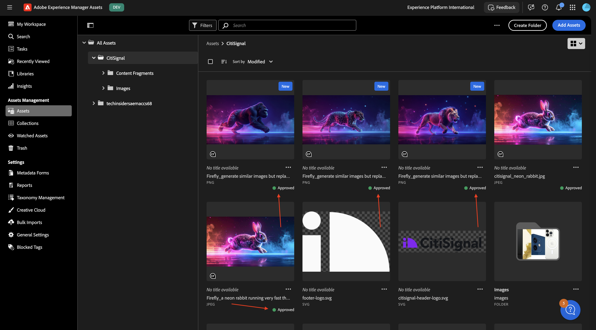

Navigieren Sie dann zu **Mein Arbeitsbereich** und klicken Sie zum Öffnen auf **KI-Assistent**.


Geben Sie die folgende Eingabeaufforderung ein und klicken Sie auf **Senden**.

```javascript
find all assets tagged with 'Spring 2026'
```

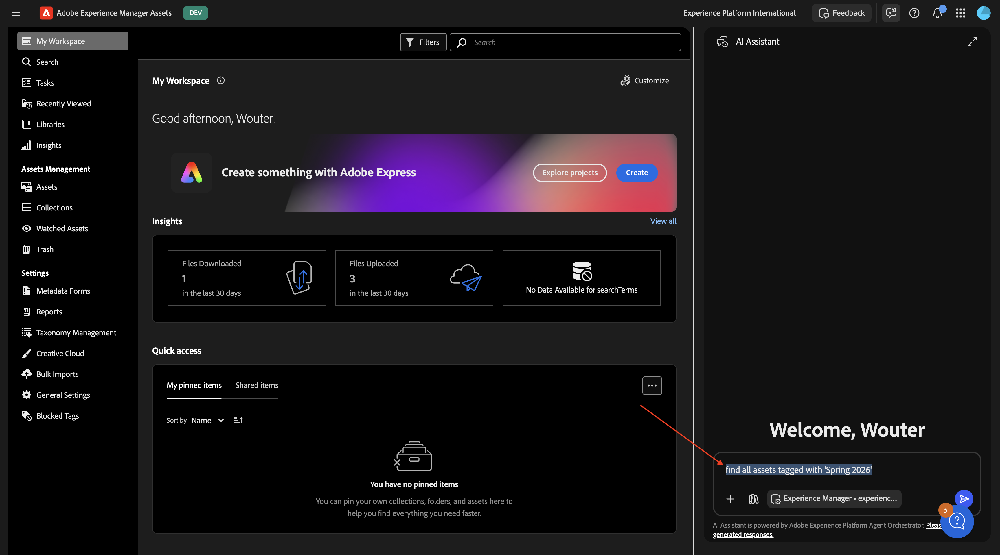

Wenn Sie Zugriff auf mehrere AEM Assets CS-Umgebungen haben, sehen Sie Folgendes. Klicken Sie auf die vorgeschlagene Antwort für die gewünschte Umgebung und dann auf **Senden**.

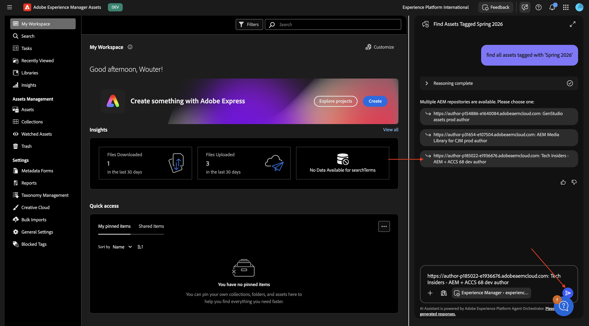

Sie sollten dann eine ähnliche Antwort sehen. Klicken Sie auf das Symbol , um den KI-Assistenten auf den Vollbildmodus zu erweitern.


Überprüfen Sie die Antworten.

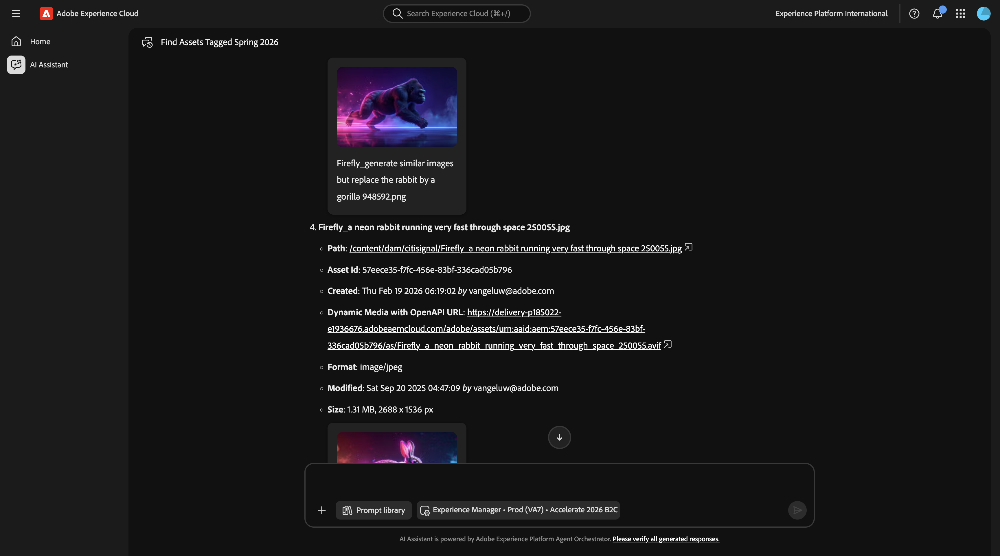

Sie können im Fenster des KI-Assistenten auf eines dieser Assets klicken, um es anzuzeigen.

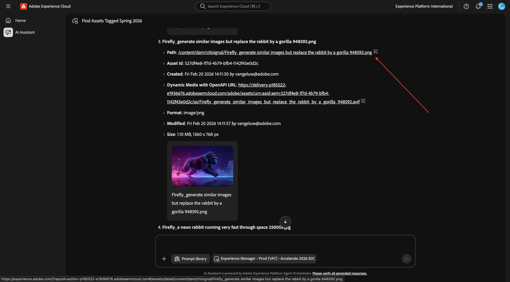

Sie werden dann direkt zu AEM Assets CS weitergeleitet, zu diesem spezifischen Bild.

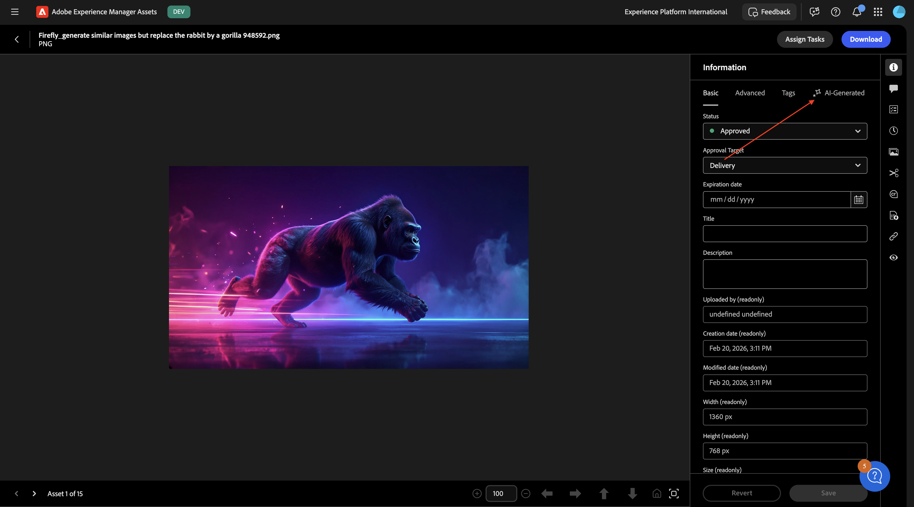

Sie können dann auch alle anderen verfügbaren Metadaten überprüfen.


## 1.6.1.2 Experience Production Agent

### Inhaltsaktualisierung - Assets

Die Fähigkeit zur Inhaltsaktualisierung aktualisiert vorhandene Inhalte - einschließlich Inhaltsfragmenten, Seiten, Formularen und Assets - mit Leichtigkeit. Der Agent kann Aktionen wie das Aktualisieren, Entfernen, Ersetzen oder Hinzufügen von Inhaltselementen durchführen, um Erlebnisse genau und aktuell zu halten. Eingaben können Beschreibungen in natürlicher Sprache sein und bei Verwendung mit Jira-PDFs und Screenshots auch Eingaben liefern.

Kehren Sie zum Bildschirm KI-Assistent zurück.


Geben Sie die folgende Eingabeaufforderung ein und klicken Sie auf **Senden**.

`Generate multiple social media formats (Instagram 1080x1920, Facebook 1200x630, Twitter 1200x675) for the third image`


Nach einigen Minuten sollten Sie eine ähnliche Antwort sehen.


Überprüfen Sie die generierten Bilder.


### Inhaltsaktualisierung - Seiten

Gehen Sie zurück zu Ihrer Adobe Experience Manager-Autorenumgebung und dann zu **Sites**.


Gehen Sie zu **CitiSignal**. Klicken Sie **Erstellen** und wählen Sie **Seite** aus.

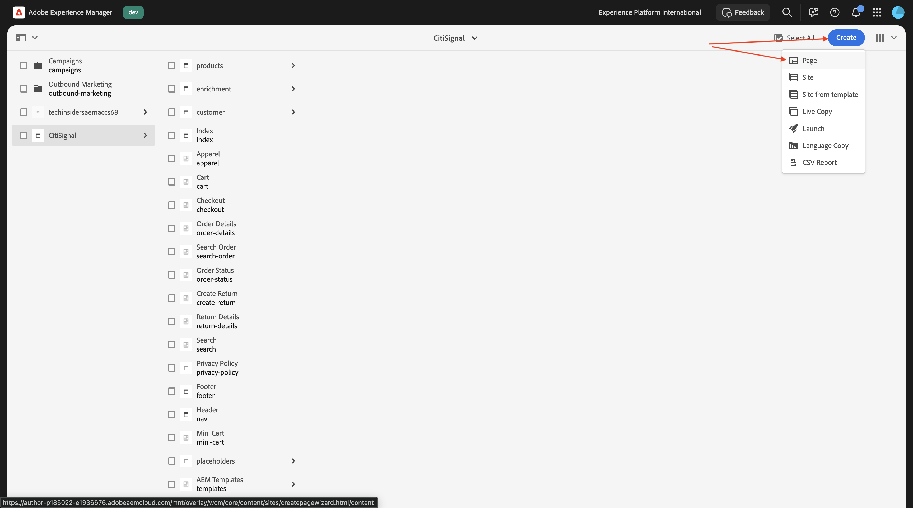

Wählen Sie **Seite** aus und klicken Sie auf **Weiter**.

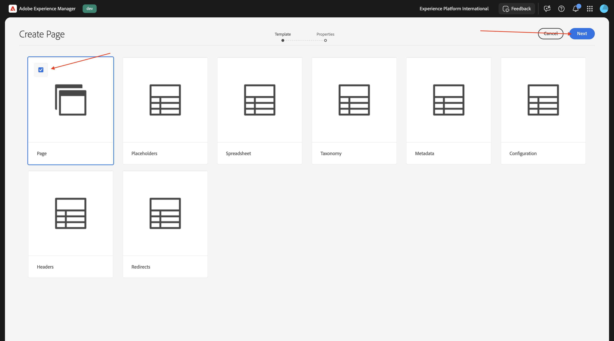

Geben Sie die folgenden Werte ein:

- Titel: **Fibre Max**
- Name: **fiber-max**
- Seitentitel: **Fibre Max**

Klicken Sie auf **Erstellen**.

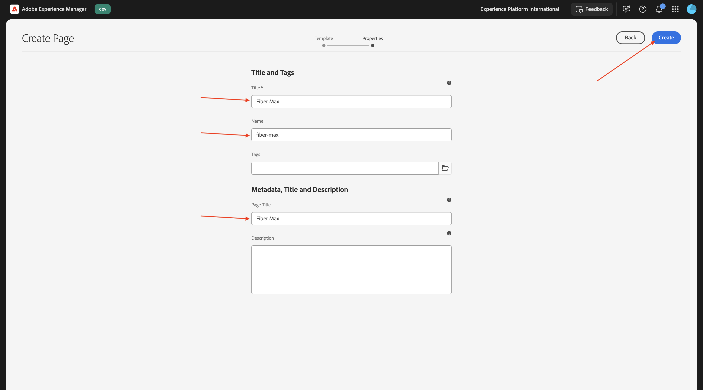

Wählen Sie **Öffnen** aus.


Sie sollten das dann sehen.


Klicken Sie in den leeren Bereich, um die Komponente **Abschnitt** auszuwählen. Klicken Sie dann auf das Pluszeichen **+** im rechten Menü und wählen Sie **Hero**.


Sie sollten das dann sehen. Klicken Sie auf **+**, um ein Bild hinzuzufügen.


Wählen Sie Ihr Assets-Repository aus. Öffnen Sie dann den Ordner **CitiSignal**.


Wählen Sie das Bild des Löwen, das Sie zuvor hochgeladen haben. Klicken Sie auf **Auswählen**.

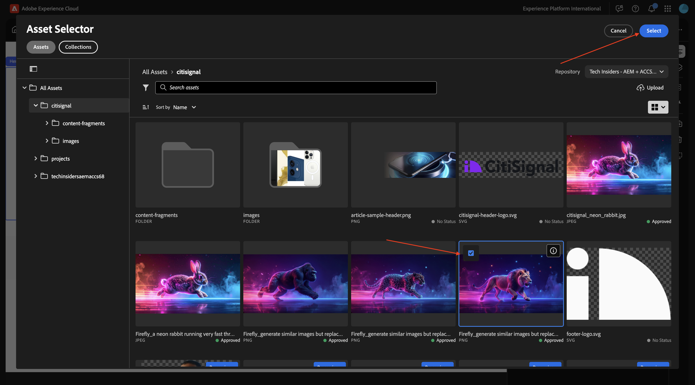

Sie sollten das dann sehen. Klicken Sie auf **Text**-Bereich, um den Text zu ändern.


Fügen Sie diesen Text in den Bereich ein:

```
This winter, be as fast as a lion.
```

Wählen Sie **Überschrift 1** aus und klicken Sie dann auf **Fertig**.


Sie sollten das dann sehen. Navigieren Sie **Inhaltsstruktur** und wählen Sie den Bereich **Abschnitt** aus.


Klicken Sie auf das Symbol **+** und wählen Sie dann **Karten** aus.


Sie sollten das dann sehen. Stellen Sie sicher, dass in der **Inhaltsstruktur** die Option **Karten** ausgewählt ist.

Klicken Sie dann viermal auf die Schaltfläche **+**.


Sie sollten dies nun sehen, wo es vier **Card**-Objekte im **Cards**-Objekt gibt.


Wählen Sie die erste **Karte** aus. Klicken Sie auf **Text**-Bereich, um den Text zu ändern.


Fügen Sie den folgenden Text ein. Stellen Sie sicher, dass in der ersten Textzeile „Überschrift **&quot; verwendet**. Klicken Sie auf **Fertig**.

```
99.9% network reliability

Game, video chat and stream on multiple devices with ultra low lag.
```

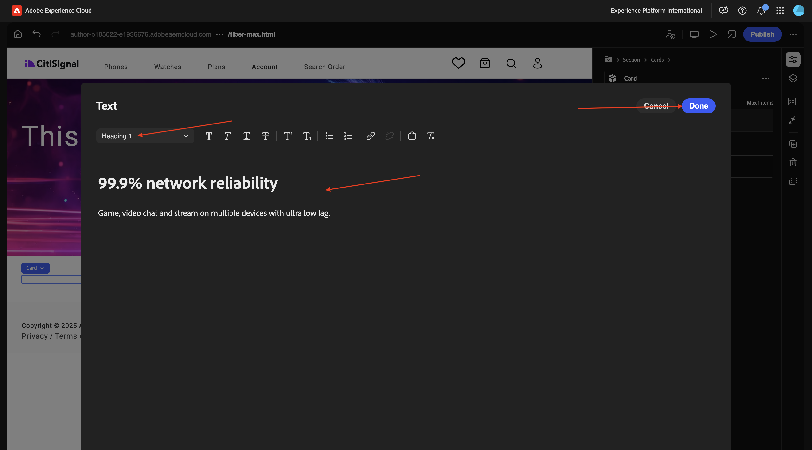

Wählen Sie die zweite **Karte** aus. Klicken Sie auf **Text**-Bereich, um den Text zu ändern.


Fügen Sie den folgenden Text ein. Stellen Sie sicher, dass in der ersten Textzeile „Überschrift **&quot; verwendet**. Klicken Sie auf **Fertig**.

```
3-year

price lock guarantee

For new and existing Fiber Max customers on all internet plans.

No hidden fees.
```


Wählen Sie die dritte **Karte** aus. Klicken Sie auf **Text**-Bereich, um den Text zu ändern.


Fügen Sie den folgenden Text ein. Stellen Sie sicher, dass in der ersten Textzeile „Überschrift **&quot; verwendet**. Klicken Sie auf **Fertig**.

```
More ways to save

Save over 45% on the best entertainment with CitiSignal
```


Wählen Sie die vierte **Karte** aus. Klicken Sie auf **Text**-Bereich, um den Text zu ändern.


Fügen Sie den folgenden Text ein. Stellen Sie sicher, dass in der ersten Textzeile „Überschrift **&quot; verwendet**. Klicken Sie auf **Fertig**.

```
Get Fiber Max now!

Fill out the form here to get started.
```


Du solltest das jetzt haben. Klicken Sie auf **Veröffentlichen**.


Klicken **erneut auf** Veröffentlichen“.


Klicken Sie **Seite öffnen**.


Kopieren Sie die URL der Seite so, wie Sie sie als Nächstes benötigen.

Die URL sollte etwa wie folgt lauten: `https://author-pXXXXXX-eXXXXXXX.adobeaemcloud.com/content/CitiSignal/fiber-max.html`.


Navigieren Sie zu [https://experience.adobe.com/#/experiencemanager/](https://experience.adobe.com/#/experiencemanager/). Klicken, um **KI-Assistent** zu öffnen.

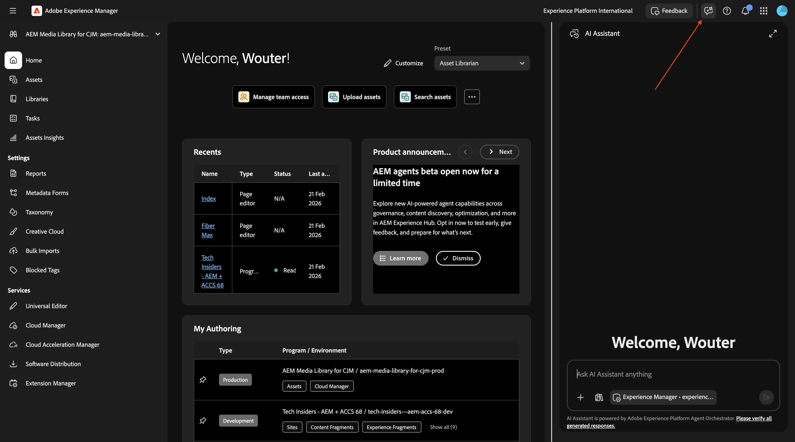

Fügen Sie die folgende Eingabeaufforderung ein und klicken Sie auf **Senden**. Ersetzen Sie XXX in dieser Eingabeaufforderung durch die URL, die Sie im vorherigen Schritt kopiert haben.

```
On the page XXX, please make the following changes:

- change the word 'winter' to 'spring'
- change the word 'lion' to 'leopard'
- change the image in the hero block to use the image 'citisignal_leopard.png'
- change the text '99.9% network reliability' to '99.999% network reliability'
```


Nach 1-2 Minuten sollten Sie dies sehen. Geben Sie den `generate` ein und klicken Sie auf **Senden**.


Einige Minuten später sollten Sie eine Bestätigung wie die folgende sehen, dass die Änderungen durchgeführt wurden. Klicken Sie **Vorschau der aktualisierten Seite anzeigen**.


Sie erhalten jetzt eine visuelle Bestätigung der vorgenommenen Änderungen. Diese Vorschauseite dient nur zu Informationszwecken. Sie können von dieser Seite aus keine Aktion ausführen.


Um eine Aktion durchzuführen, klicken Sie auf **In AEM bearbeiten**.


Im universellen Editor sehen Sie nun alle Änderungen im Detail, mit der Möglichkeit, alles zu ändern. Nachdem Sie die Seite überprüft haben, klicken Sie auf **Veröffentlichen**.


Klicken **erneut auf** Veröffentlichen“. Die von Ihnen vorgenommene Änderung wird noch nicht in Ihrer Produktionsumgebung veröffentlicht. Stattdessen wurde es unter &quot;**&quot;** AEM veröffentlicht.

Launches ermöglichen die effiziente Entwicklung von Inhalten für eine zukünftige Version. Ein Launch wird erstellt, damit Sie Änderungen in Vorbereitung auf eine zukünftige Veröffentlichung vornehmen und gleichzeitig Ihre aktuellen Seiten pflegen können. Das bedeutet, dass Sie effektiv zwei Versionen gleichzeitig bearbeiten: Seiten, die derzeit veröffentlicht sind, und eine Version dieser Seiten, die zu einem späteren Zeitpunkt veröffentlicht werden sollen. Sobald diese Zeit gekommen ist, können Sie die Originalseiten ersetzen und die neue Version veröffentlichen.


Um **ausstehenden** für eine zukünftige Version zu bewerben, gehen Sie zurück zu AEM. Klicken Sie oben auf **Seite auf** Adobe Experience Manager, klicken Sie auf das **Hammer**-Symbol und wählen Sie dann **Launches** aus.

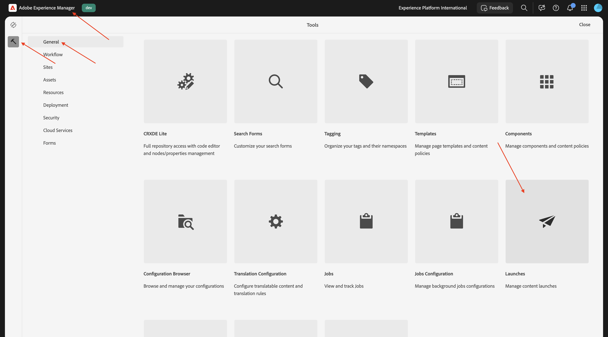

Es sollte jetzt ein ausstehender &quot;**&quot;**. Aktivieren Sie das Kontrollkästchen vor dem ausstehenden **Launch**.


Klicken Sie auf **Bewerben**.

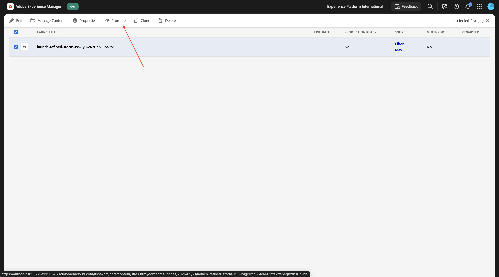

Wählen Sie **Vollständigen Launch hochstufen** und klicken Sie auf **Weiter**.


Klicken Sie auf **Bewerben**.


Sie sollten das jetzt sehen. Ihre Änderungen sind jetzt in Produktion.


Aktualisieren Sie Ihre Seite. Jetzt sollten alle Ihre Änderungen auf der veröffentlichten Seite angezeigt werden.


Anstatt den manuellen Weiterleitungsprozess zu durchlaufen, können Sie auch die `accept` im KI-Assistenten eingeben.


Sie sollten dann eine Bestätigung erhalten, dass Änderungen veröffentlicht werden.

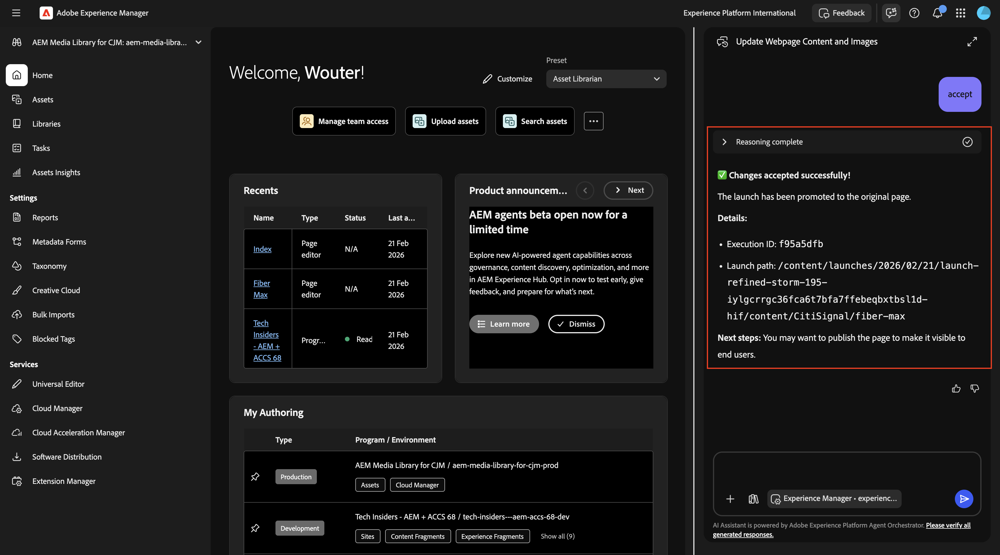

### Inhaltsaktualisierung - Formularerstellung

Im Modul [Adobe Experience Manager Forms mit Edge Delivery Services ](./../../asset-mgmt/module1.3/aemforms.md){target="_blank"} Sie die Schritte, die bei der manuellen Erstellung eines Formulars erforderlich sind.

Die Fähigkeit zur Formularerstellung ermöglicht es Benutzenden jetzt, adaptive Formulare über Eingabeaufforderungen in natürlicher Sprache zu erstellen, ohne von Entwicklungs- oder IT-Teams abhängig zu sein. Diese Funktion beschleunigt die Formularentwicklung, während die Markenkonsistenz gewahrt bleibt und es Geschäftsbenutzern ermöglicht wird, Formulare ohne fundierte technische Produktkenntnisse zu erstellen.

Navigieren Sie zu [https://experience.adobe.com/#/ai-assistant/chat](https://experience.adobe.com/#/ai-assistant/chat).


Geben Sie die folgende Eingabeaufforderung ein und klicken Sie auf **Senden**.

```
Create a new adaptive form using Edge Delivery Services with the following details:
- Form name: "citisignal-fiber-max-interest-2"
- Form fields: 4 text input fields are needed, for "first-name", "last-name", "email" and "city"
- When the form is submitted, send the submission to a spreadsheet, with this URL: https://docs.google.com/spreadsheets/d/1WwKrcM8mZ2d_W3sMheUAw3nFhP_OFk05TsqxhHkudfQ/edit?usp=sharing.
```


## Nächste Schritte

Zurück zu [AEM und Agenten](./aemagents.md){target="_blank"}

[Zurück zu „Alle Module“](./../../../overview.md){target="_blank"}
