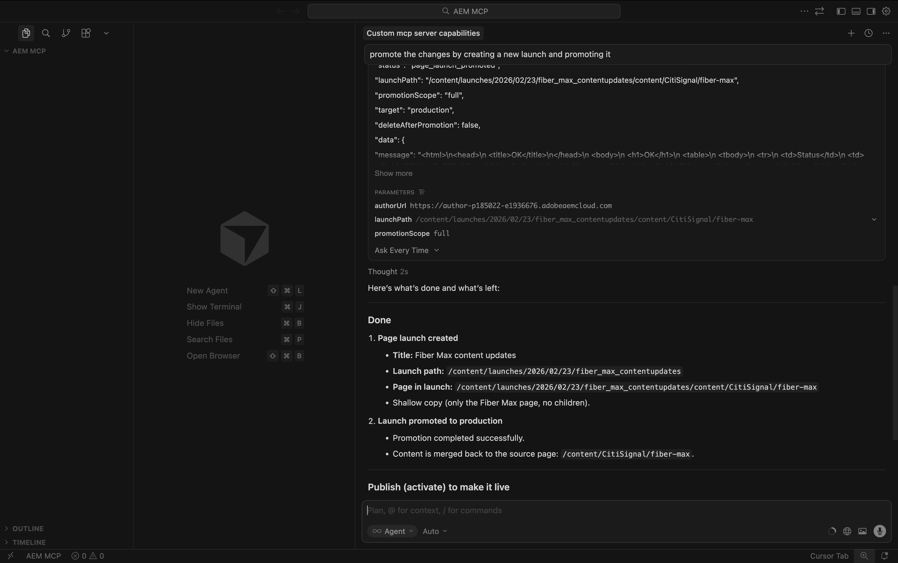

# 1.6.2 AEM MCP-Server und Cursor

>[!IMPORTANT]
>
>Um diese Übung abzuschließen, benötigen Sie Zugriff auf eine funktionierende Umgebung für AEM Sites und Assets CS mit EDS, und die verschiedenen AEM-Agenten müssen für die von Ihnen verwendete IMS-Organisation aktiviert sein.
>
>Wenn Sie noch keine solche Umgebung haben, gehen Sie zu Übung [Adobe Experience Manager Cloud Service &amp; Edge Delivery Services](./../../../modules/asset-mgmt/module2.1/aemcs.md){target="_blank"}. Folgen Sie den Anweisungen dort, und Sie haben Zugriff auf eine solche Umgebung.

>[!IMPORTANT]
>
>Wenn Sie zuvor ein AEM CS-Programm mit einer AEM Sites- und Assets CS-Umgebung konfiguriert haben, wurde Ihre AEM CS-Sandbox möglicherweise in den Ruhezustand versetzt. Da der Ruhezustand einer solchen Sandbox 10-15 Minuten dauert, ist es ratsam, den Ruhezustand jetzt zu beenden, damit Sie nicht zu einem späteren Zeitpunkt warten müssen.


Im Folgenden finden Sie alle verfügbaren AEM MCP-Server:

- https://mcp.adobeaemcloud.com/adobe/mcp/content
- https://mcp.adobeaemcloud.com/adobe/mcp/content-readonly (schreibgeschützte Inhaltsvorgänge)
- https://mcp.adobeaemcloud.com/adobe/mcp/content-updater (legt die entsprechende Qualifikation vom Experience Production Agent offen)
- https://mcp.adobeaemcloud.com/adobe/mcp/experience-governance (stellt Fähigkeiten bereit, um die Markenrichtlinie für eine Seite abzurufen und zu überprüfen)
- https://mcp.adobeaemcloud.com/adobe/mcp/discovery (stellt Fähigkeiten zur Erkennung von Inhalten in einer AEM-Umgebung bereit)

In dieser Übung finden Sie Anweisungen zur Verwendung dieser spezifischen MCP-Server:

- https://mcp.adobeaemcloud.com/adobe/mcp/content
- https://mcp.adobeaemcloud.com/adobe/mcp/discovery

Sie können die folgenden Anweisungen verwenden, um ähnliche MCP-Server für die anderen verfügbaren AEM-MCP-Server einzurichten, da der Prozess sehr ähnlich ist.

## Setup für 1.6.2.1 Experience Production Agent Cursor MCP Server

Erstellen Sie einen neuen leeren Ordner auf Ihrem Desktop.


Cursor öffnen. Klicken Sie **Projekt öffnen**.


Wählen Sie den zuvor erstellten Ordner aus und klicken Sie auf **Öffnen**.


Klicken Sie **Ja, ich vertraue den Autoren**.


Sie sollten das dann sehen. Verwenden Sie den Tastaturbefehl `Cmd + Shift + J`, um die Cursor-Einstellungen zu öffnen. Sie sollten das dann sehen. Navigieren Sie zu **Tools und MCP**.


Klicken Sie auf **+ Neuer MCP-Server**.


Fügen Sie den folgenden MCP-Server zur Datei **mcp.json** hinzu. Möglicherweise sind bereits andere MCP-Server in dieser Datei angegeben. Entfernen Sie diese nicht und fügen Sie einfach die folgenden neuen Zeilen hinzu. Speichern Sie Ihre Änderungen.

```json
"aem": {
	"url": "https://mcp.adobeaemcloud.com/adobe/mcp/content"
	}
```


Wechseln Sie zurück zur Registerkarte **Cursoreinstellungen**. In der Liste der MCP **Server sollte nun ein Tool** aem) hinzugefügt werden. Klicken Sie auf **Verbinden**, um sich mit Ihrem Adobe-Konto zu authentifizieren.


Klicken Sie **Öffnen**, falls diese Meldung angezeigt wird. Anschließend sollten Sie sich in Ihrem Browser authentifizieren.


Nach erfolgreicher Authentifizierung sollten Sie Folgendes sehen.


Schließen Sie die **Cursor-Einstellungen** und **mcp.json**. Fügen Sie die folgende Aufforderung in den Chat ein und klicken Sie auf **Senden**.

```
I just created a new custom mcp server named 'aem'. what can I do with that?
```


Klicken Sie auf **Ausführen**.


Anschließend sollten Sie eine ähnliche Antwort sehen.


Wie Sie sehen können, werden ähnliche Funktionen über den MCP-Server in Cursor verfügbar gemacht, im Vergleich zu dem, was mit dem KI-Assistenten in der vorherigen Übung möglich war.

Geben Sie die folgende Eingabeaufforderung ein und klicken Sie auf **Senden**.

```javascript
List AEM Author instances
```


Sie sollten dann so etwas sehen. Suchen Sie nach der gewünschten Umgebung, geben Sie dann die folgende Eingabeaufforderung ein und klicken Sie auf **Senden**.

```javascript
use environment number X
```


Sie sollten das dann sehen.


Fügen Sie die folgende Eingabeaufforderung ein und klicken Sie auf **Senden**. Ersetzen Sie XXX in dieser Eingabeaufforderung durch die URL, die Sie in der vorherigen Übung kopiert haben.

```
On the page https://author-p185022-e1936676.adobeaemcloud.com/content/CitiSignal/fiber-max.html, please make the following changes:

- change the word 'winter' to 'summer'
- change the text 'be as fast as a leopard' to 'dominate your internet like a gorilla'
- change the image in the hero block to use the image 'citisignal_gorilla.png'
- change the text '99.9% network reliability' to '99.998% network reliability'
```


Nach 1-2 Minuten sollten Sie eine ähnliche Antwort erhalten. Kopieren Sie die URL und öffnen Sie die Seite in Ihrem Browser.


Sie sollten das dann sehen.


Geben Sie die folgende Eingabeaufforderung ein und klicken Sie auf **Senden**.

```javascript
promote the changes by creating a new launch and promoting it
```


Nach 1-2 Minuten wurden die Änderungen hochgestuft.



Sie können die Änderungen jetzt live auf Ihrer Website sehen.


Erkunden Sie auch die anderen Funktionen des AEM MCP-Servers.

## 1.6.2.2 Discovery Agent Cursor MCP Server-Setup

Verwenden Sie den Tastaturbefehl `Cmd + Shift + J`, um die Cursor-Einstellungen zu öffnen. Sie sollten das dann sehen. Navigieren Sie zu **Tools und MCP**. Klicken Sie auf **+ Neuer MCP-Server**.


Fügen Sie den folgenden MCP-Server zur Datei **mcp.json** hinzu. Möglicherweise sind bereits andere MCP-Server in dieser Datei angegeben. Entfernen Sie diese nicht und fügen Sie einfach die folgenden neuen Zeilen hinzu. Speichern Sie Ihre Änderungen.

```
,
"aem-discovery": {
	"url": "https://mcp.adobeaemcloud.com/adobe/mcp/discovery"
}
```


Wechseln Sie zurück zur Registerkarte **Cursoreinstellungen**. In der Liste der MCP **Server sollte nun ein Tool** aem) hinzugefügt werden. Klicken Sie auf **Verbinden**, um sich mit Ihrem Adobe-Konto zu authentifizieren.


Nach der Authentifizierung sollte Folgendes angezeigt werden.


Schließen Sie die **Cursor-Einstellungen** und **mcp.json**. Fügen Sie die folgende Aufforderung in den Chat ein und klicken Sie auf **Senden**.

```
I just created a new custom mcp server named 'aem-discovery'. what can I do with that?
```


```
for the environment https://author-pXXXXXX-eXXXXXXX.adobeaemcloud.com/, list all assets tagged with 'Spring 2026'
```


Sie sollten dann so etwas sehen.


## Nächste Schritte

Zurück zu [AEM und Agenten](./aemagents.md){target="_blank"}

[Zurück zu „Alle Module“](./../../../overview.md){target="_blank"}