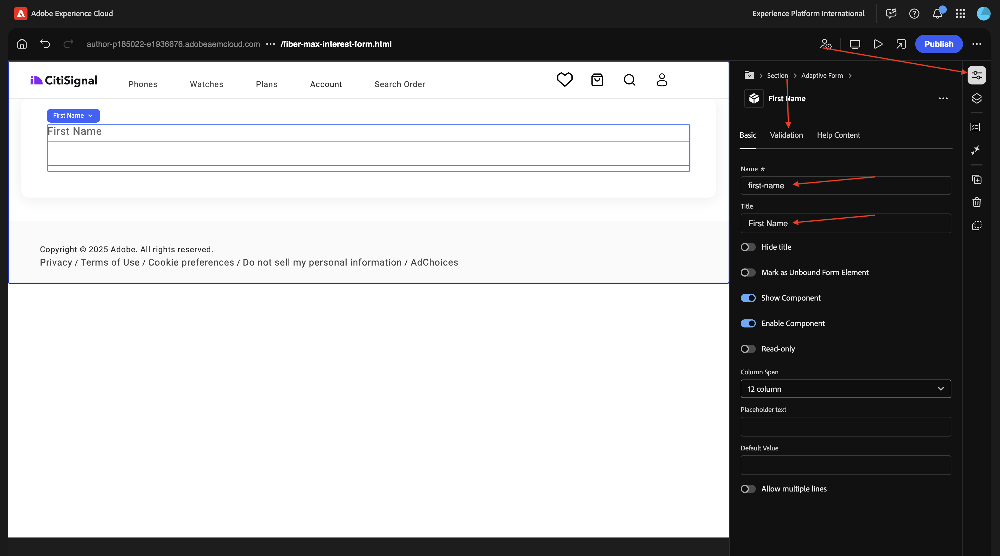
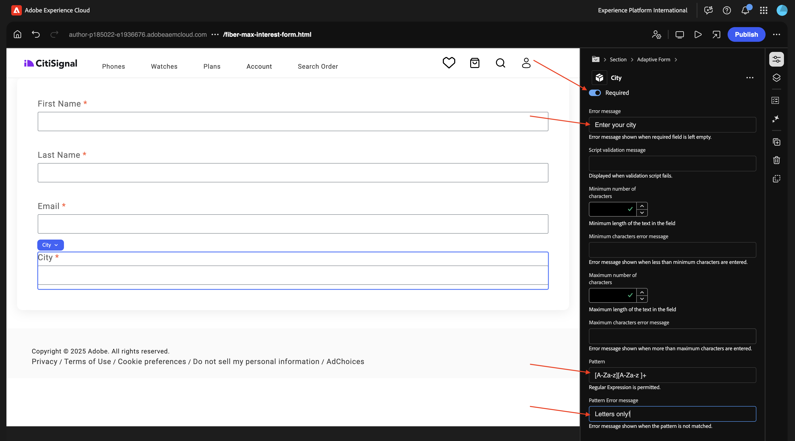

# 1.3.1 Erstellen des ersten Formulars

>[!IMPORTANT]
>
>Um diese Übung abzuschließen, benötigen Sie Zugriff auf eine funktionierende AEM Assets CS-Autorenumgebung mit aktiviertem AEM Assets Dynamic Media.
>
>Wenn Sie keine solche Umgebung haben, navigieren Sie zu [Adobe Experience Manager Cloud Service und Edge Delivery Services](./../../../modules/asset-mgmt/module2.1/aemcs.md){target="_blank"}. Folgen Sie den Anweisungen dort, und Sie haben Zugriff auf eine solche Umgebung.

>[!IMPORTANT]
>
>Wenn Sie zuvor ein AEM CS-Programm mit einer AEM Assets CS-Umgebung konfiguriert haben, kann es sein, dass Ihre AEM CS-Sandbox in den Ruhezustand versetzt wurde. Da der Ruhezustand einer solchen Sandbox 10-15 Minuten dauert, ist es ratsam, den Ruhezustand jetzt zu beenden, damit Sie nicht zu einem späteren Zeitpunkt warten müssen.

## 1.3.1.1 -

Navigieren Sie zu [https://my.cloudmanager.adobe.com](https://my.cloudmanager.adobe.com){target="_blank"}. Die gewünschte Organisation ist `--aepImsOrgName--`. Öffnen Sie Ihre Umgebung.

Zu **Forms**.

Zu **Forms und Dokumenten**.

Klicken Sie **Erstellen** und wählen Sie dann **Adaptives Formular** aus.

Wählen Sie **Edge Delivery Services** und dann **Leere Seite**. Klicken Sie auf **Erstellen**.

Sie sollten das dann sehen. Füllen Sie die folgenden Felder aus:

- **Titel**: `Fiber Max Interest Form`
- **Name**: sollte automatisch basierend auf dem Feld **Titel** ausgefüllt werden.
- **GitHub-**: Geben Sie den Pfad zum GitHub-Repository an, das mit Ihrer Website verknüpft ist

Klicken Sie auf **Erstellen**.

Nachdem Sie auf **Erstellen** geklickt haben, sollte **universelle Editor** automatisch geöffnet werden und Folgendes sollte angezeigt werden. Klicken Sie auf das Symbol, um die **Inhaltsstruktur“ zu**.

Wählen Sie in **Inhaltsstruktur** das Objekt **adaptives Formular**.

Klicken Sie dann auf das Symbol **+** , um ein neues Element hinzuzufügen, und wählen Sie **Texteingabe** aus.

Wählen Sie in **Inhaltsstruktur** das Feld **Texteingabe**.

Navigieren Sie zur **Standard** Ansicht. Das solltest du dir ansehen.

Füllen Sie die folgenden Felder aus:

- **Name**: `first-name`
- **Titel**: `First Name`

Navigieren Sie dann zu **Validierung**.

Wechseln Sie den Schalter, um dies zu einem erforderlichen Feld zu machen. Füllen Sie die folgenden Felder aus:

- **Fehlermeldung**: `Enter your first name`
- **Muster**: `[A-Za-z][A-Za-z ]+`
- **Fehlermeldung für Muster**: `Letters only!`

Wählen Sie in **Inhaltsstruktur** das Feld **adaptives Formular**. Klicken Sie auf das Symbol **+** und wählen Sie dann **Texteingabe** aus.

Wählen Sie in **Inhaltsstruktur** das neu erstellte Feld **Texteingabe**. Navigieren Sie zu **Eigenschaften**.

Navigieren Sie zur **Standard** Ansicht. Das solltest du dir ansehen.

Füllen Sie die folgenden Felder aus:

- **Name**: `last-name`
- **Titel**: `Last Name`

Navigieren Sie dann zu **Validierung**.

Wechseln Sie den Schalter, um dies zu einem erforderlichen Feld zu machen. Füllen Sie die folgenden Felder aus:

- **Fehlermeldung**: `Enter your last name`
- **Muster**: `[A-Za-z][A-Za-z ]+`
- **Fehlermeldung für Muster**: `Letters only!`

Wählen Sie in **Inhaltsstruktur** das Feld **adaptives Formular**. Klicken Sie auf das Symbol **+** und wählen Sie dann **Texteingabe** aus.

Wählen Sie in **Inhaltsstruktur** das neu erstellte Feld **Texteingabe**. Navigieren Sie zu **Eigenschaften**.

Navigieren Sie zur **Standard** Ansicht. Das solltest du dir ansehen.

Füllen Sie die folgenden Felder aus:

- **Name**: `email`
- **Titel**: `Email`

Navigieren Sie dann zu **Validierung**.

Wechseln Sie den Schalter, um dies zu einem erforderlichen Feld zu machen. Füllen Sie die folgenden Felder aus:

- **Fehlermeldung**: `Enter your email address`
- **Muster**: `^[^@]+@[^@]+\.[^@]+$`
- **Fehlermeldung für Muster**: `Please verify your email address!`

Wählen Sie in **Inhaltsstruktur** das Feld **adaptives Formular**. Klicken Sie auf das Symbol **+** und wählen Sie dann **Texteingabe** aus.

Wählen Sie in **Inhaltsstruktur** das neu erstellte Feld **Texteingabe**.

Navigieren Sie zur **Standard** Ansicht. Das solltest du dir ansehen.

Füllen Sie die folgenden Felder aus:

- **Name**: `city`
- **Titel**: `city`

Navigieren Sie dann zu **Validierung**.

Wechseln Sie den Schalter, um dies zu einem erforderlichen Feld zu machen. Füllen Sie die folgenden Felder aus:

- **Fehlermeldung**: `Enter your city`
- **Muster**: `[A-Za-z][A-Za-z ]+`
- **Fehlermeldung für Muster**: `Letters only!`

Klicken Sie auf **Veröffentlichen**.

Klicken **erneut auf** Veröffentlichen“.

Klicken Sie, um das Formular zu öffnen.

Sie können das Formular dann ausfüllen, es jedoch noch nicht abschicken.

## Nächste Schritte

Nächster Schritt: [-](./ex1.md){target="_blank"}

Zurück zu [Adobe Experience Manager Forms mit Edge Delivery Services](./aemforms.md){target="_blank"}

[Zurück zu „Alle Module“](./../../../overview.md){target="_blank"}
