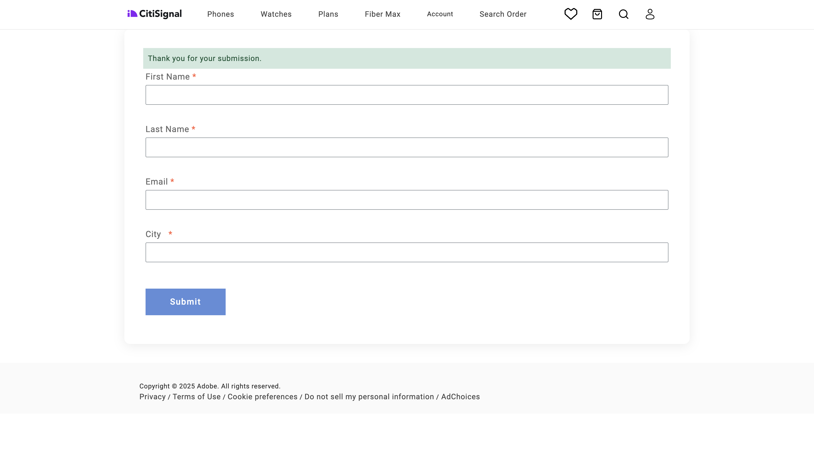

# 1.3.1 Erstellen des ersten Formulars

>[!IMPORTANT]
>
>Um diese Übung abzuschließen, benötigen Sie Zugriff auf eine funktionierende AEM Assets CS-Autorenumgebung mit aktiviertem AEM Assets Dynamic Media.
>
>Wenn Sie keine solche Umgebung haben, navigieren Sie zu [Adobe Experience Manager Cloud Service und Edge Delivery Services](./../../../modules/asset-mgmt/module2.1/aemcs.md){target="_blank"}. Folgen Sie den Anweisungen dort, und Sie haben Zugriff auf eine solche Umgebung.

>[!IMPORTANT]
>
>Wenn Sie zuvor ein AEM CS-Programm mit einer AEM Assets CS-Umgebung konfiguriert haben, kann es sein, dass Ihre AEM CS-Sandbox in den Ruhezustand versetzt wurde. Da der Ruhezustand einer solchen Sandbox 10-15 Minuten dauert, ist es ratsam, den Ruhezustand jetzt zu beenden, damit Sie nicht zu einem späteren Zeitpunkt warten müssen.

## 1.3.1.1 Umgebungsanforderungen für die Verwendung von AEM Forms mit Edge Delivery Services

Bevor Sie Ihr erstes Formular konfigurieren, müssen Sie eine Reihe von Anforderungen erfüllen, bevor Sie die folgenden Schritte ausführen können.

### Programm-Setup

In den **Lösungen und Add** ons Ihres Cloud Manager Forms-Programms muss **&#x200B;**&#x200B;aktiviert sein.


### Bausteine

In Ihrem GitHub-Repository müssen die folgenden Blöcke verfügbar sein:

- **form**
- **embed-adaptive-form**


### Skripte

In Ihrem GitHub-Repository müssen die folgenden Skripte verfügbar sein:

- **form-editor-support.css**
- **form-editor-support.js**


Darüber hinaus müssen in der Datei **editor-support.js** die folgenden Änderungen vorgenommen werden, um die Bearbeitung von Formularen im universellen Editor zu ermöglichen.

- Ändern Sie die Funktionsdeklaration von **function attacheventListners(main)** in **async function attacheventListners(main)**
- Fügen Sie die Zeilen 152 und 153 hinzu:

```
const module = await import('./form-editor-support.js');
module.attachEventListners(main);
```


Ändern Sie außerdem in der Datei **editor-support.js** die Zeilen 90-92 wie folgt:

```
if (block.dataset.aueModel === 'form') {
        return true;
      } else if (newBlock) {
```


### paths.json

Überprüfen Sie Ihre GitHub Repo-Konfiguration, insbesondere in der Datei **path.json**. Diese Zeilen müssen in der Datei vorhanden sein:

- Unter den Zuordnungen: **&quot;/content/forms/af/:/forms/&quot;**
- Unter umfasst: **&quot;/content/forms/af/&quot;**

```json
{
  "mappings": [
    "/content/CitiSignal/:/",
    "/content/CitiSignal/configuration:/.helix/config.json",
    "/content/CitiSignal/headers:/.helix/headers.json",
    "/content/CitiSignal/metadata:/metadata.json",
    "/content/CitiSignal.resource/enrichment/enrichment.json:/enrichment/enrichment.json",
    "/content/forms/af/:/forms/"
  ],
  "includes": [
    "/content/CitiSignal/",
    "/content/forms/af/"
  ]
}
```


Wenn diese Anforderungen erfüllt sind, können Sie Ihr erstes Formular erstellen.

## 1.3.1.2 Formular erstellen

Navigieren Sie zu [https://my.cloudmanager.adobe.com](https://my.cloudmanager.adobe.com){target="_blank"}. Die gewünschte Organisation ist `--aepImsOrgName--`. Öffnen Sie Ihre Umgebung.


Zu **Forms**.


Zu **Forms und Dokumenten**.


Klicken Sie **Erstellen** und wählen Sie dann **Adaptives Formular** aus.


Wählen Sie **Edge Delivery Services** und dann **Leere Seite**. Klicken Sie auf **Erstellen**.


Sie sollten das dann sehen. Füllen Sie die folgenden Felder aus:

- **Titel**: `Fiber Max Interest Form`
- **Name**: sollte automatisch basierend auf dem Feld **Titel** ausgefüllt werden.
- **GitHub-**: Geben Sie den Pfad zum GitHub-Repository an, das mit Ihrer Website verknüpft ist

Klicken Sie auf **Erstellen**.


Nachdem Sie auf **Erstellen** geklickt haben, sollte **universelle Editor** automatisch geöffnet werden und Folgendes sollte angezeigt werden. Klicken Sie auf das Symbol, um die **Inhaltsstruktur“ zu**.


Wählen Sie in **Inhaltsstruktur** das Objekt **adaptives Formular**.


Klicken Sie dann auf das Symbol **+** , um ein neues Element hinzuzufügen, und wählen Sie **Texteingabe** aus.


Wählen Sie in **Inhaltsstruktur** das Feld **Texteingabe**.


Navigieren Sie zur **Standard** Ansicht. Das solltest du dir ansehen.

Füllen Sie die folgenden Felder aus:

- **Name**: `first-name`
- **Titel**: `First Name`

Navigieren Sie dann zu **Validierung**.


Wechseln Sie den Schalter, um dies zu einem erforderlichen Feld zu machen. Füllen Sie die folgenden Felder aus:

- **Fehlermeldung**: `Enter your first name`
- **Muster**: `[A-Za-z][A-Za-z ]+`
- **Fehlermeldung für Muster**: `Letters only!`


Wählen Sie in **Inhaltsstruktur** das Feld **adaptives Formular**. Klicken Sie auf das Symbol **+** und wählen Sie dann **Texteingabe** aus.


Wählen Sie in **Inhaltsstruktur** das neu erstellte Feld **Texteingabe**. Navigieren Sie zu **Eigenschaften**.


Navigieren Sie zur **Standard** Ansicht. Das solltest du dir ansehen.

Füllen Sie die folgenden Felder aus:

- **Name**: `last-name`
- **Titel**: `Last Name`

Navigieren Sie dann zu **Validierung**.


Wechseln Sie den Schalter, um dies zu einem erforderlichen Feld zu machen. Füllen Sie die folgenden Felder aus:

- **Fehlermeldung**: `Enter your last name`
- **Muster**: `[A-Za-z][A-Za-z ]+`
- **Fehlermeldung für Muster**: `Letters only!`


Wählen Sie in **Inhaltsstruktur** das Feld **adaptives Formular**. Klicken Sie auf das Symbol **+** und wählen Sie dann **Texteingabe** aus.


Wählen Sie in **Inhaltsstruktur** das neu erstellte Feld **Texteingabe**. Navigieren Sie zu **Eigenschaften**.


Navigieren Sie zur **Standard** Ansicht. Das solltest du dir ansehen.

Füllen Sie die folgenden Felder aus:

- **Name**: `email`
- **Titel**: `Email`

Navigieren Sie dann zu **Validierung**.


Wechseln Sie den Schalter, um dies zu einem erforderlichen Feld zu machen. Füllen Sie die folgenden Felder aus:

- **Fehlermeldung**: `Enter your email address`
- **Muster**: `^[^@]+@[^@]+\.[^@]+$`
- **Fehlermeldung für Muster**: `Please verify your email address!`


Wählen Sie in **Inhaltsstruktur** das Feld **adaptives Formular**. Klicken Sie auf das Symbol **+** und wählen Sie dann **Texteingabe** aus.


Wählen Sie in **Inhaltsstruktur** das neu erstellte Feld **Texteingabe**.


Navigieren Sie zur **Standard** Ansicht. Das solltest du dir ansehen.

Füllen Sie die folgenden Felder aus:

- **Name**: `city`
- **Titel**: `city`

Navigieren Sie dann zu **Validierung**.


Wechseln Sie den Schalter, um dies zu einem erforderlichen Feld zu machen. Füllen Sie die folgenden Felder aus:

- **Fehlermeldung**: `Enter your city`
- **Muster**: `[A-Za-z][A-Za-z ]+`
- **Fehlermeldung für Muster**: `Letters only!`


Klicken Sie auf **Veröffentlichen**.


Klicken **erneut auf** Veröffentlichen“.


Klicken Sie, um das Formular zu öffnen.


Sie können das Formular dann ausfüllen, es jedoch noch nicht abschicken.


Nach dem Veröffentlichen des Formulars ist es jetzt auch in Ihrer Edge Delivery Services-Domain verfügbar, die wie folgt aussieht:

`https://main--techinsidersXX-citisignal-aem-accs--woutervangeluwe.aem.page/forms/fiber-max-interest-form`


## 1.3.1.3 Formular senden

Um Ihr Formular abschicken zu können, sind zwei Dinge erforderlich:

- eine **Senden**-Schaltfläche
- eine **Senden**-Aktion

Außerdem sollten Sie in dieser Übung eine Google-Tabelle verwenden, um Übermittlungen dieses Formulars aufzuzeichnen.

### Google-Tabelle

Wechseln Sie zu [https://drive.google.com](https://drive.google.com) und erstellen Sie eine neue leere Tabelle.


Benennen Sie Ihre Datei `citisignal-fiber-max-interest`.

Geben Sie in Zeile 1 in den Zellen A-B-C-D die folgenden Feldnamen ein:

- Vorname
- Nachname
- email
- city

Klicken Sie dann auf **Freigeben**.


Geben Sie die Datei für **forms@adobe.com** mit Zugriffsrechten auf **Editor**-Ebene frei.

Klicken Sie dann auf **Link kopieren**.

Klicken Sie auf **Senden**.


Sie müssen den kopierten Link im nächsten Schritt verwenden.

### Senden-Schaltfläche

Um die Schaltfläche **Senden** zu konfigurieren, gehen Sie zu **Inhaltsstruktur**, wählen Sie **Adaptives Formular**, klicken Sie auf das Symbol **+** und wählen Sie dann **Senden**.


Sie sollten das dann sehen.


### Sende-Aktion

Übermittlungsaktionen sind Teil einer Erweiterung für den universellen Editor.

>[!NOTE]
>
>Wenn Sie das Symbol **Formulareigenschaften bearbeiten** nicht sehen, bedeutet dies, dass diese Erweiterung für Ihre Umgebung noch nicht aktiviert ist. Um diese Erweiterung zu aktivieren, gehen Sie zu [https://experience.adobe.com/#/aem/extension-manager](https://experience.adobe.com/#/aem/extension-manager) und aktivieren Sie die Erweiterung **Formulareigenschaften bearbeiten**.
>
>

Klicken Sie auf das **Formulareigenschaften bearbeiten**.


Wählen **An Tabelle übermitteln**. Fügen Sie die URL des zuvor erstellten Google-Blatts ein.

Klicken Sie auf **Speichern und Schließen**.


>[!NOTE]
>
>Wenn Sie den Fehler 401 - Nicht autorisiert erhalten, kann es sein. da Ihre Umgebung nicht für die Arbeit mit Google Sheets aktiviert wurde. Wenden Sie sich an den Adobe-Support, um Ihre Umgebung aktivieren zu lassen.

Klicken Sie auf **Veröffentlichen**.


Klicken **erneut auf** Veröffentlichen“.


Anschließend können Sie Ihre Site aktualisieren, die Formulare ausfüllen und auf **Senden** klicken.


Ihre Übermittlung sollte dann erfolgreich sein.



Wenn Sie sich dann Ihr Google-Blatt ansehen, sollten Sie auch dort die erfolgreiche Übermittlung sehen.


Sie haben diese Übung jetzt erfolgreich abgeschlossen.

## Nächste Schritte

Zurück zu [Adobe Experience Manager Forms mit Edge Delivery Services](./aemforms.md){target="_blank"}

[Zurück zu „Alle Module“](./../../../overview.md){target="_blank"}
