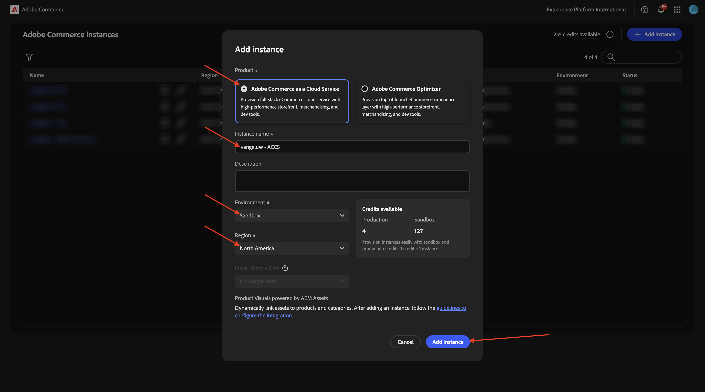
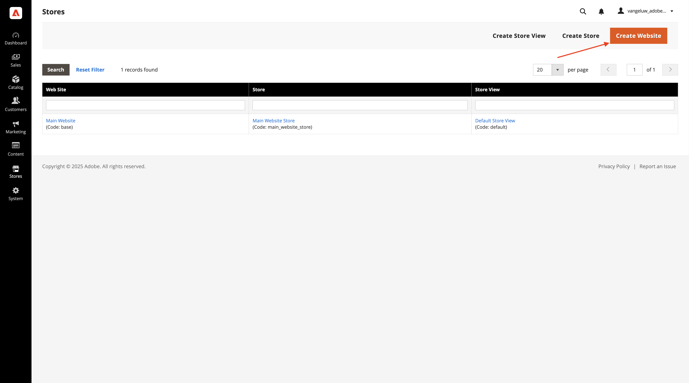
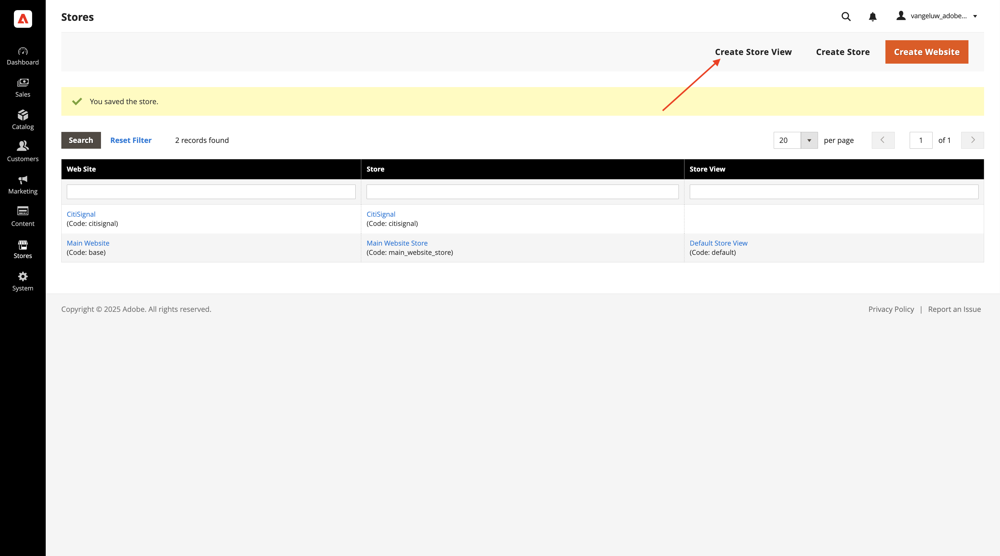
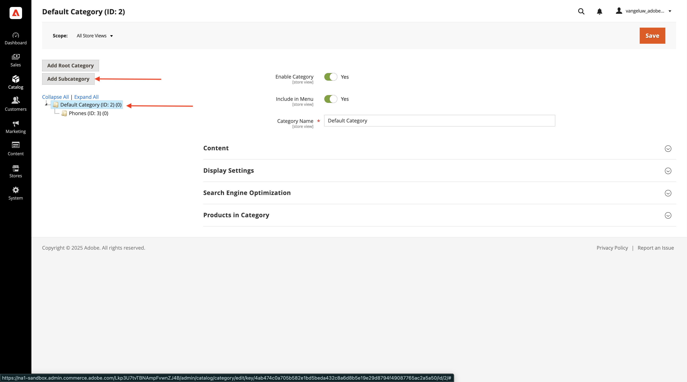
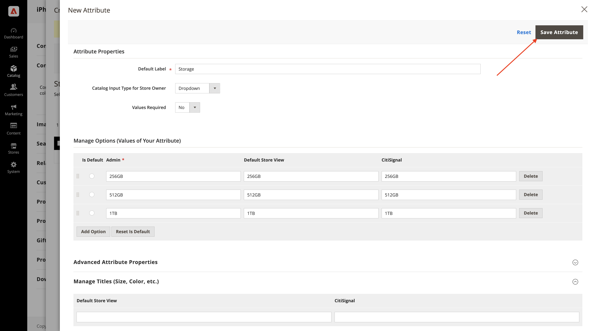
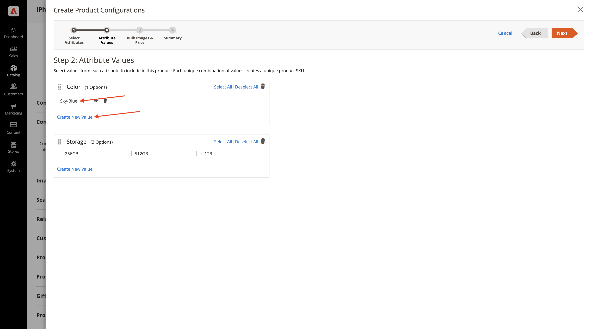
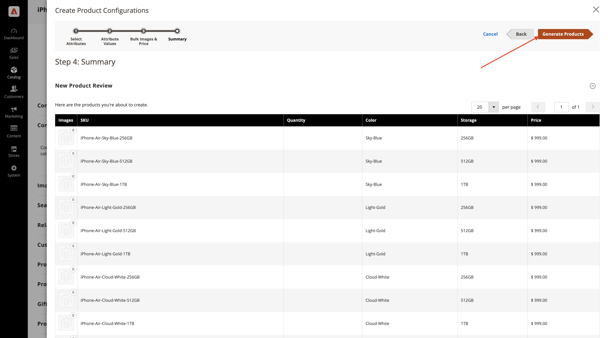

# 1.5.1 Erste Schritte mit Adobe Commerce as a Cloud Service

Navigieren Sie zu [https://experience.adobe.com/](https://experience.adobe.com/){target="_blank"}. Stellen Sie sicher, dass Sie sich in der richtigen Umgebung befinden, die `--aepImsOrgName--` benannt werden sollte. Auf **Commerce**.

## 1.5.1.1 ACS-Instanz erstellen

Sie sollten das dann sehen. Klicken Sie auf **+ Instanz**.

Füllen Sie die Felder wie folgt aus:

- **Instanzname**: `--aepUserLdap-- - ACCS`
- **Umgebung**: `Sandbox`
- **Region**: `North America`

Klicken Sie **Instanz hinzufügen**.

Ihre Instanz wird jetzt erstellt. Dies kann 5 bis 10 Minuten dauern.

Sobald die Instanz fertig ist, klicken Sie auf Ihre Instanz, um sie zu öffnen.

## 1.5.1.2 Einrichten des CitiSignal-Shops

Sie sollten das dann sehen. Klicken Sie **Mit Adobe ID anmelden** und melden Sie sich an.

Sobald Sie eingeloggt sind, sollten Sie diese Homepage sehen. Der erste Schritt besteht darin, Ihren CitiSignal-Store in Commerce einzurichten. Klicken Sie auf **Stores**.

Klicken Sie auf **Alle Stores**.

Klicken Sie **Website erstellen**.

Füllen Sie die Felder wie folgt aus:

- **Name**: `CitiSignal`
- **Code**: `citisignal`

Klicken Sie **Website speichern**.

Dann solltest du wieder hier sein. Klicken Sie **Store erstellen**.

Füllen Sie die Felder wie folgt aus:

- **Website**: `CitiSignal`
- **Name**: `CitiSignal`
- **Code**: `citisignal`
- **Stammkategorie**: `Default Category`

Klicken Sie **Speichern**.

Dann solltest du wieder hier sein. Klicken Sie **Store-Ansicht erstellen**.

Füllen Sie die Felder wie folgt aus:

- **Store**: `CitiSignal`
- **Name**: `CitiSignal`
- **Code**: `citisignal`
- **Status**: `Enabled`

Klicken Sie **Store-Ansicht speichern**.

Sie sollten dann diese Meldung sehen. Klicken Sie auf **OK**.

Dann solltest du wieder hier sein.

## Kategorien und Produkte 1.5.1.3 konfigurieren

Navigieren Sie zu **Katalog** und wählen Sie dann **Kategorien** aus.

Wählen Sie **Standardkategorie** und klicken Sie dann auf **Unterkategorie hinzufügen**.

Geben Sie den `Phones` ein und klicken Sie dann auf **Speichern**.

Wählen Sie **Standardkategorie** und klicken Sie erneut **Unterkategorie**.

Geben Sie den `Watches` ein und klicken Sie dann auf **Speichern**.

Anschließend sollten zwei Kategorien erstellt werden.

Gehen Sie dann zu **Katalog** und wählen Sie **Produkte** aus.

Sie sollten das dann sehen. Klicken Sie **Produkt hinzufügen**.

Konfigurieren Sie Ihr Produkt wie folgt:

- **Produktname**: `iPhone Air`
- **SKU**: `iPhone-Air`
- **Preis**: `999`
- **Menge**: `10000`
- **Kategorien**: `Phones` auswählen

Klicken Sie auf **Speichern**.

Scrollen Sie nach unten zu **Konfigurationen** und klicken Sie auf **Konfigurationen erstellen**.

Sie sollten das dann sehen. Klicken Sie **Neues Attribut erstellen**.

Legen Sie die **Standardbeschriftung** auf `Storage` fest und klicken Sie dann auf **Option hinzufügen** unter **Optionen verwalten**.

Konfigurieren Sie die erste Option mit dem in allen 3 Spalten `256GB` Namen und klicken Sie dann erneut **Option hinzufügen**.

Konfigurieren Sie die zweite Option mit dem in allen 3 Spalten `512GB` Namen und klicken Sie dann erneut **Option hinzufügen**.

Konfigurieren Sie die dritte Option mit dem in allen 3 Spalten `1TB` Namen und klicken Sie dann erneut **Option hinzufügen**.

Scrollen Sie nach unten zu **Storefront-Eigenschaften**. Legen Sie die folgenden Optionen auf &quot;**&quot;**:

- **Bei der Suche verwenden**
- **HTML-Tags in der Storefront zulassen**
- **Auf Katalogseiten in der Storefront sichtbar**
- **Verwendung in der Produktliste**

Scrollen Sie nach oben und klicken Sie auf **Attribut speichern**.

Sie sollten das dann sehen. Wählen Sie beide Attribute für **color** und **storage** aus und klicken Sie auf **Weiter**.

Sie sollten das dann sehen. Jetzt müssen Sie die verfügbaren Farboptionen hinzufügen. Klicken Sie dazu auf &quot;**Wert erstellen**.

Geben Sie den Wert `Sky-Blue` ein und klicken Sie auf **Neuen Wert erstellen**.

Geben Sie den Wert `Light-Gold` ein und klicken Sie auf **Neuen Wert erstellen**.

Geben Sie den Wert `Cloud-White` ein und klicken Sie auf **Neuen Wert erstellen**.

Geben Sie den Wert `Space-Black` ein. Klicken Sie **Alle auswählen**

Wählen Sie alle drei Optionen unter **&#x200B;**&#x200B;aus und klicken Sie auf **Weiter**.

Behalten Sie die Standardeinstellungen bei und klicken Sie auf **Weiter**.

Sie sollten das dann sehen. Klicken Sie **Produkte generieren**.

Klicken Sie auf **Speichern**.

Scrollen Sie nach unten **Produkt in Websites** und aktivieren Sie das Kontrollkästchen für **CitiSignal**.

Klicken Sie auf **Speichern**.

Klicken Sie auf **Bestätigen**.

Sie sollten das dann sehen. Klicken Sie auf **Zurück**.

Jetzt sehen Sie das Produkt **iPhone Air** und seine Varianten im Produktkatalog.

Nächster Schritt: [Verbinden von ACCS mit der AEM Sites CS/EDS-Storefront](./ex2.md){target="_blank"}

Zurück zu [Adobe Commerce as a Cloud Service](./accs.md){target="_blank"}

[Zurück zu „Alle Module“](./../../../overview.md){target="_blank"}
