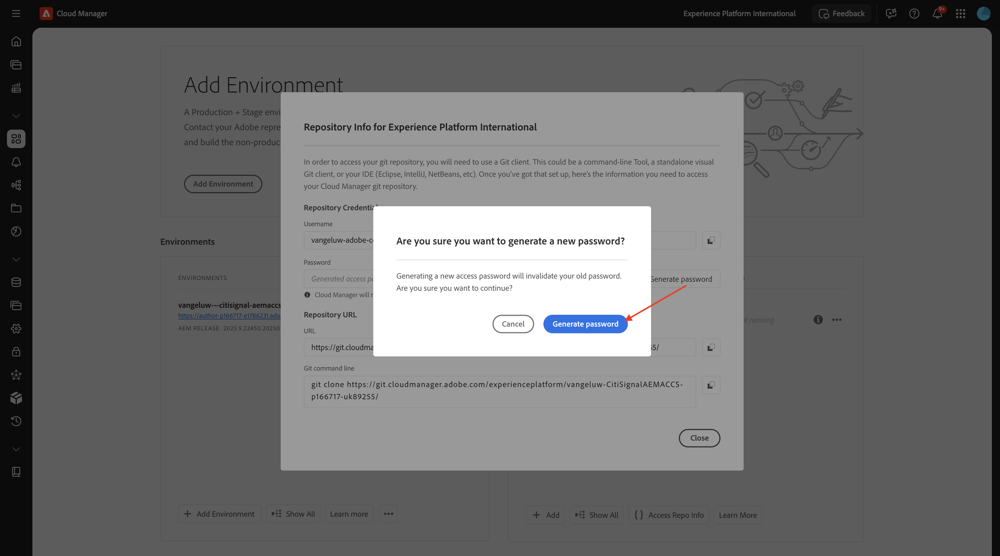
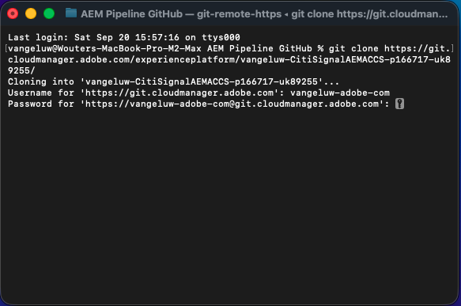
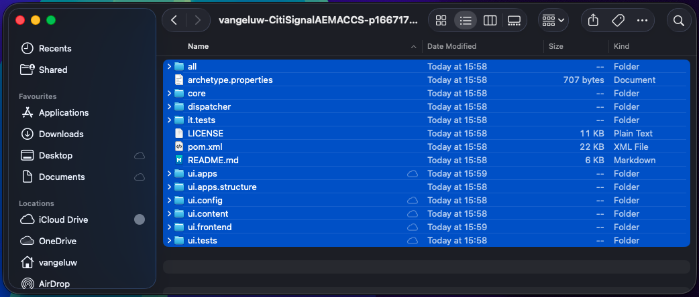
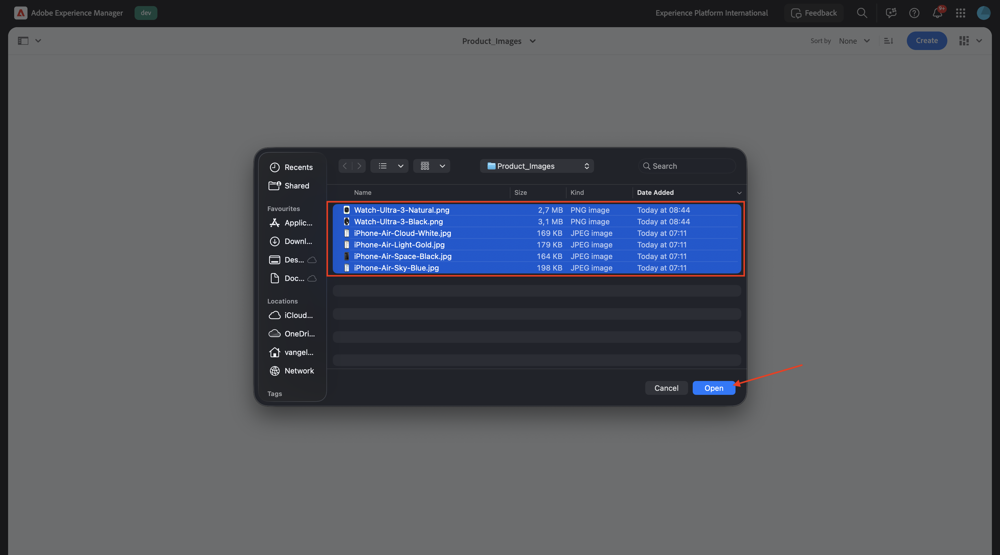

# 1.5.3 Verbinden von ACCS mit AEM Assets CS

>[!IMPORTANT]
>
>Um diese Übung abzuschließen, benötigen Sie Zugriff auf eine funktionierende Umgebung für AEM Sites und Assets CS mit EDS.
>
>Wenn Sie noch keine solche Umgebung haben, gehen Sie zu Übung [Adobe Experience Manager Cloud Service &amp; Edge Delivery Services](./../../../modules/asset-mgmt/module2.1/aemcs.md){target="_blank"}. Folgen Sie den Anweisungen dort, und Sie haben Zugriff auf eine solche Umgebung.

>[!IMPORTANT]
>
>Wenn Sie zuvor ein AEM CS-Programm mit einer AEM Sites- und Assets CS-Umgebung konfiguriert haben, wurde Ihre AEM CS-Sandbox möglicherweise in den Ruhezustand versetzt. Da der Ruhezustand einer solchen Sandbox 10-15 Minuten dauert, ist es ratsam, den Ruhezustand jetzt zu beenden, damit Sie nicht zu einem späteren Zeitpunkt warten müssen.

Nach Abschluss der vorherigen Übung konnten Sie sehen, dass ein Produkt von ACS an Ihre Website zurückgegeben wurde, aber es hatte noch kein Bild. Am Ende dieser Übung sollte auch ein Bild zurückgegeben werden.


## Pipeline-Konfiguration 1.5.3.1 aktualisieren

Navigieren Sie zu [https://my.cloudmanager.adobe.com](https://my.cloudmanager.adobe.com){target="_blank"}. Die gewünschte Organisation ist `--aepImsOrgName--`.

Klicken Sie hier, um Ihr Cloud Manager-Programm zu öffnen, das `--aepUserLdap-- - CitiSignal AEM+ACCS` heißen sollte.


Scrollen Sie ein wenig nach unten und klicken Sie dann auf **Auf Repository-Informationen zugreifen** auf der Registerkarte **Pipelines** .


Sie sollten das dann sehen. Klicken Sie **Kennwort generieren**.


Klicken Sie **erneut auf** Kennwort generieren“.



Sie sollten dann ein Kennwort zur Verfügung haben. Klicken Sie anschließend auf das **Kopieren**-Symbol neben dem Feld **Git-Befehlszeile**.


Erstellen Sie ein neues Verzeichnis an einem beliebigen Speicherort auf Ihrem Computer und benennen Sie es **AEM Pipeline GitHub**.


Klicken Sie mit der rechten Maustaste auf den Ordner und wählen Sie **Neues Terminal unter Ordner**.


Sie sollten das dann sehen.


Fügen Sie den **Git-Befehl** den Sie zuvor im Terminal-Fenster kopiert haben, ein.


Sie müssen einen Benutzernamen eingeben. Kopieren Sie den Benutzernamen aus der Cloud Manager-Programm-Pipeline **Auf Repository-Informationen zugreifen** und drücken Sie **Eingabetaste**.


Als Nächstes müssen Sie das Kennwort eingeben. Kopieren Sie das Kennwort aus der Cloud Manager-Programm-Pipeline **Zugriff auf Repo Info** und drücken Sie **Eingabetaste**.



Das kann eine Minute dauern. Nach Abschluss des Vorgangs verfügen Sie über eine lokale Kopie des Git-Repositorys, die mit der Pipeline Ihres Programms verknüpft ist.


Im Verzeichnis **AEM-Pipeline-GitHub** wird ein neues Verzeichnis angezeigt. Öffnen Sie das Verzeichnis.


Wählen Sie alle Dateien in diesem Verzeichnis aus und löschen Sie alle.



Stellen Sie sicher, dass das Verzeichnis leer ist.


Navigieren Sie zu [https://github.com/ankumalh/assets-commerce](https://github.com/ankumalh/assets-commerce).

Kopieren Sie als Nächstes die Datei **assets-commerce-main.zip** auf Ihren Desktop und entpacken Sie sie. Öffnen Sie den Ordner **assets-commerce-main**.


Kopieren Sie alle Dateien aus dem Verzeichnis **assets-commerce-main** in das leere Verzeichnis des Pipeline-Repository-Verzeichnisses Ihres Programms.


Öffnen Sie anschließend **Microsoft Visual Studio Code** und öffnen Sie den Ordner, der das Pipeline-Repository Ihres Programms enthält, in **Microsoft Visual Studio Code**.


Navigieren Sie **linken Menü zu** Suchen“ und suchen Sie nach `<my-app>`. Sie müssen alle Vorkommen von `<my-app>` durch `--aepUserLdap--citisignalaemaccs` ersetzen.

Klicken Sie auf **Symbol „Alle**&quot;.


Klicken Sie **Ersetzen**.


Die neuen Dateien können jetzt wieder in das Git-Repository hochgeladen werden, das mit dem Pipeline-Repository Ihres Programms verknüpft ist. Öffnen Sie dazu den Ordner **AEM Pipeline GitHub** und klicken Sie mit der rechten Maustaste auf den Ordner, der die neuen Dateien enthält. Wählen Sie **Neues Terminal im Ordner**.


Sie sollten das dann sehen. Fügen Sie den `git add .` ein und drücken Sie **enter**.


Sie sollten das dann sehen. Fügen Sie den `git commit -m "add assets integration"` ein und drücken Sie **enter**.


Sie sollten das dann sehen. Fügen Sie den `git push origin main` ein und drücken Sie **enter**.


Sie sollten das dann sehen. Ihre Änderungen wurden jetzt im Pipeline-Git-Repository Ihres Programms bereitgestellt.


Gehen Sie zurück zu Cloud Manager und klicken Sie auf **Schließen**.


Nachdem Sie Änderungen am Git-Repository der Pipeline vorgenommen haben, müssen Sie die Pipeline **Für Entwicklung bereitstellen** erneut ausführen. Klicken Sie auf die 3 Punkte **…** und wählen Sie **Ausführen**.


Klicken Sie auf **Ausführen**. Das Ausführen einer Pipeline-Bereitstellung kann 10-15 Minuten dauern. Sie müssen warten, bis die Pipeline-Bereitstellung erfolgreich abgeschlossen wurde, bevor Sie fortfahren.


## 1.5.3.2 Aktivieren der AEM Assets-Integration in ACS

Kehren Sie zu Ihrer ACS-Instanz zurück. Gehen Sie im linken Menü zu **Stores** und wählen Sie dann **Konfiguration** aus.


Scrollen Sie im Menü nach unten zu **ADOBE SERVICES** und öffnen Sie dann **AEM Assets-Integration**. Sie sollten das dann sehen.


Füllen Sie die folgenden Variablen aus:

- **AEM Assets-Programm-ID**: Sie können die Programm-ID von der AEM CS-Autoren-URL abrufen. In diesem Beispiel wird die Programm-ID `166717`.


- **AEM Assets-Umgebungs-ID**: Sie können die Umgebungs-ID aus der AEM CS-Autoren-URL abrufen. In diesem Beispiel wird die Umgebungs-ID `1786231`.


- **Asset-Wähler IMS-Client-ID**: auf `1` gesetzt
- **Synchronisierung aktiviert**: auf `Yes` gesetzt
- **Visualisierungsinhaber**: auf `AEM Assets` gesetzt
- **Regel für den Asset-Abgleich**: `Match by product SKU`
- **Übereinstimmung nach Produkt-SKU-Attributname**: `commerce:skus`

Klicken Sie **Konfiguration speichern**.


Sie sollten das dann sehen.


## 1.5.3.3 Aktualisierung von config.json

Gehen Sie zum GitHub-Repository, das beim Einrichten Ihrer AEM Sites CS/EDS-Umgebung erstellt wurde. Dieses Repository wurde in der Übung [1.1.2 Einrichten der AEM CS-Umgebung erstellt ](./../../../modules/asset-mgmt/module2.1/ex3.md){target="_blank"} sollte den Namen &quot;**-aem-accs** erhalten.

Scrollen Sie im Stammverzeichnis nach unten und klicken Sie, um die Datei (**.json)** öffnen. Klicken Sie auf **Bearbeiten**, um Änderungen an der Datei vorzunehmen.


Fügen Sie das folgende Codefragment unter Zeile 5 `"commerce-endpoint": "https://na1-sandbox.api.commerce.adobe.com/XXX/graphql",`:

```json
 "commerce-assets-enabled": "true",
```

Klicken Sie **Änderungen übernehmen…**.


Klicken Sie **Änderungen übernehmen**.


Ihre Änderung wird jetzt gespeichert und in Kürze veröffentlicht. Es kann einige Minuten dauern, bis die Änderung in der Storefront sichtbar wird.


## 1.5.3.4 Überprüfen von Commerce-Feldern in AEM Assets CS

Melden Sie sich bei Ihrer AEM CS-Autorenumgebung an und wechseln Sie zu **Assets**.


Navigieren Sie zu **Dateien**.


Öffnen Sie den Ordner **CitiSignal**.


Bewegen Sie den Mauszeiger über ein beliebiges Asset und klicken Sie auf **info**-Symbol.


Es sollte jetzt eine Registerkarte **Commerce** angezeigt werden, die zwei neue Metadatenattribute enthält.


Ihre AEM Assets CS-Umgebung unterstützt jetzt die Commerce-Integration. Sie können jetzt mit dem Hochladen von Produktbildern beginnen.

## 1.5.3.4 Produkt-Assets hochladen und mit Produkten verknüpfen

[Laden Sie hier die Produktbilder ](./images/Product_Images.zip). Exportieren Sie die Dateien nach dem Download auf Ihren Desktop.


Klicken Sie **Erstellen** und wählen Sie dann **Ordner** aus.


Geben Sie den Wert **product_images** für die Felder **Titel** und **Name** ein. Klicken Sie auf **Erstellen**.


Klicken Sie auf , um den soeben erstellten Ordner zu öffnen.


Klicken Sie **Erstellen** und wählen Sie dann **Dateien** aus.


Navigieren Sie zum Ordner **product_images** auf Ihrem Desktop, wählen Sie alle Dateien aus und klicken Sie dann auf **Öffnen**.



Klicken Sie **Hochladen**.


Die Bilder stehen dann in Ihrem Ordner zur Verfügung. Bewegen Sie den Mauszeiger über das Produkt **iPhone-Air-Light-Gold.png** und klicken Sie auf das Symbol **Eigenschaften**.


Scrollen Sie nach unten und legen Sie das Feld **Prüfungsstatus** auf **Genehmigt** fest. Die AEM Assets CS - ACCS-Integration funktioniert nur für genehmigte Images.


Scrollen Sie nach oben, wechseln Sie zur Registerkarte **Commerce** und klicken Sie dann **Hinzufügen** unter **Produkt-SKUs**.


Fügen Sie die folgenden SKUs für dieses Produkt hinzu:

| Schlüssel | Wert | Nutzung |
|:-------------:| :---------------:| :---------------:| 
| `iPhone-Air-Light-Gold` | `1` | `thumbnail, image, swatch_image, small_image` |
| `iPhone-Air-Light-Gold-256GB` | `1` | `thumbnail, image, swatch_image, small_image` |
| `iPhone-Air-Light-Gold-512GB` | `1` | `thumbnail, image, swatch_image, small_image` |
| `iPhone-Air-Light-Gold-1TB` | `1` | `thumbnail, image, swatch_image, small_image` |

Sie sollten dann diese haben. Klicken Sie **Speichern und schließen**.


Bewegen Sie den Mauszeiger über das Produkt **iPhone-Air-Space-Black.png** und klicken Sie auf das Symbol **Eigenschaften**.


Scrollen Sie nach unten und legen Sie das Feld **Prüfungsstatus** auf **Genehmigt** fest. Die AEM Assets CS - ACCS-Integration funktioniert nur für genehmigte Images.


Scrollen Sie nach oben, wechseln Sie zur Registerkarte **Commerce** und klicken Sie dann **Hinzufügen** unter **Produkt-SKUs**.


Fügen Sie die folgenden SKUs für dieses Produkt hinzu:

| Schlüssel | Wert | Nutzung |
|:-------------:| :---------------:| :---------------:| 
| `iPhone-Air-Space-Black` | `1` | `thumbnail, image, swatch_image, small_image` |
| `iPhone-Air-Space-Black-256GB` | `1` | `thumbnail, image, swatch_image, small_image` |
| `iPhone-Air-Space-Black-512GB` | `1` | `thumbnail, image, swatch_image, small_image` |
| `iPhone-Air-Space-Black-1TB` | `1` | `thumbnail, image, swatch_image, small_image` |
| `iPhone-Air` | `1` | `thumbnail, image, swatch_image, small_image` |

Sie sollten dann diese haben. Klicken Sie **Speichern und schließen**.


Bewegen Sie den Mauszeiger über das Produkt **iPhone-Air-Sky-Blue.png** und klicken Sie auf das Symbol **Eigenschaften**.


Scrollen Sie nach unten und legen Sie das Feld **Prüfungsstatus** auf **Genehmigt** fest. Die AEM Assets CS - ACCS-Integration funktioniert nur für genehmigte Images.


Scrollen Sie nach oben, wechseln Sie zur Registerkarte **Commerce** und klicken Sie dann **Hinzufügen** unter **Produkt-SKUs**.


Fügen Sie die folgenden SKUs für dieses Produkt hinzu:

| Schlüssel | Wert | Nutzung |
|:-------------:| :---------------:| :---------------:| 
| `iPhone-Air-Sky-Blue` | `1` | `thumbnail, image, swatch_image, small_image` |
| `iPhone-Air-Sky-Blue-256GB` | `1` | `thumbnail, image, swatch_image, small_image` |
| `iPhone-Air-Sky-Blue-512GB` | `1` | `thumbnail, image, swatch_image, small_image` |
| `iPhone-Air-Sky-Blue-1TB` | `1` | `thumbnail, image, swatch_image, small_image` |

Sie sollten dann diese haben. Klicken Sie **Speichern und schließen**.


Bewegen Sie den Mauszeiger über das Produkt **iPhone-Air-Cloud-White.png** und klicken Sie auf das Symbol **Eigenschaften**.


Scrollen Sie nach unten und legen Sie das Feld **Prüfungsstatus** auf **Genehmigt** fest. Die AEM Assets CS - ACCS-Integration funktioniert nur für genehmigte Images.


Scrollen Sie nach oben, wechseln Sie zur Registerkarte **Commerce** und klicken Sie dann **Hinzufügen** unter **Produkt-SKUs**.


Fügen Sie die folgenden SKUs für dieses Produkt hinzu:

| Schlüssel | Wert | Nutzung |
|:-------------:| :---------------:| :---------------:| 
| `iPhone-Air-Cloud-White` | `1` | `thumbnail, image, swatch_image, small_image` |
| `iPhone-Air-Cloud-White-256GB` | `1` | `thumbnail, image, swatch_image, small_image` |
| `iPhone-Air-Cloud-White-512GB` | `1` | `thumbnail, image, swatch_image, small_image` |
| `iPhone-Air-Cloud-White-1TB` | `1` | `thumbnail, image, swatch_image, small_image` |

Sie sollten dann diese haben. Klicken Sie **Speichern und schließen**.


Jedes iPhone Air **-Bild vom Typ** sollte jetzt einen **grünen Daumen nach oben** aufweisen, was anzeigt, dass das Asset genehmigt wurde.


## 1.5.3.5 Überprüfen von Produktbildern in der AEM Sites CS/EDS-Storefront

>[!NOTE]
>
>Es kann bis zu 15 Minuten dauern, bevor die von Ihnen oben vorgenommenen Änderungen erfolgreich bereitgestellt werden. Wenn Ihr Bild noch nicht angezeigt wird, warten Sie 15 Minuten und versuchen Sie es dann erneut.

Um sicherzustellen, dass die Integration funktioniert, müssen Sie Ihre CitiSignal-Website öffnen.

Um auf Ihre Website zuzugreifen, wechseln Sie zu `main--citisignal-aem-accs--XXX.aem.page` und/oder `main--citisignal-aem-accs--XXX.aem.live`, nachdem Sie XXX durch Ihr GitHub-Benutzerkonto ersetzt haben, das in diesem Beispiel `woutervangeluwe` ist.

In diesem Beispiel lautet die vollständige URL wie folgt:
`https://main--citisignal-aem-accs--woutervangeluwe.aem.page` und/oder `https://main--citisignal-aem-accs--woutervangeluwe.aem.live`.

Sie sollten das dann sehen. Gehe zu **Telefone**.


Anschließend sollte ein Produktbild für die **iPhone Air** angezeigt werden. Klicken Sie auf **iPhone Air**.


Sie sollten das dann sehen. Nehmen Sie eine Änderung an den Farb- und Speicheroptionen vor, und Sie sehen, wie sich die Bilder basierend auf den von Ihnen getroffenen Entscheidungen dynamisch ändern.


Im Folgenden finden Sie ein Beispiel für die Änderung der Farbe in **Light-Gold** und der Speichergröße auf **256 GB**.


Nächster Schritt: [Zusammenfassung und Vorteile](./summary.md){target="_blank"}

Zurück zu [Adobe Commerce as a Cloud Service](./accs.md){target="_blank"}

[Zurück zu „Alle Module“](./../../../overview.md){target="_blank"}
