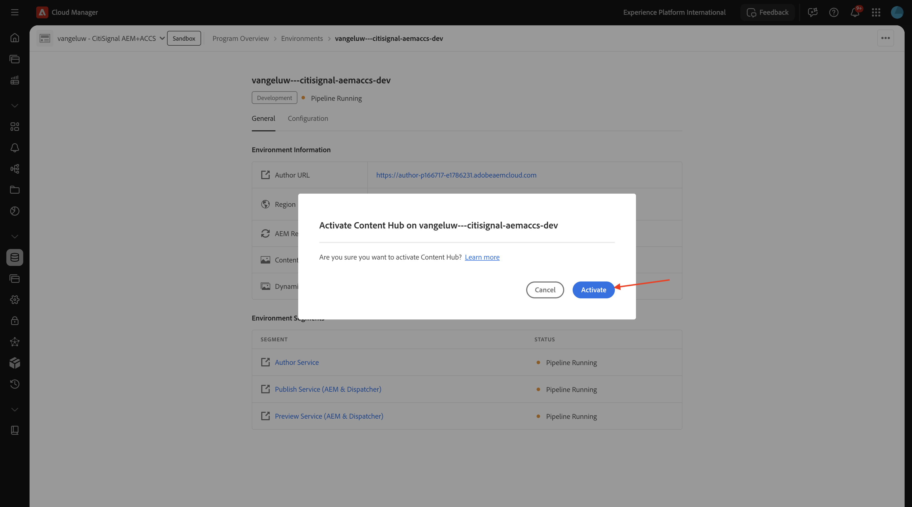
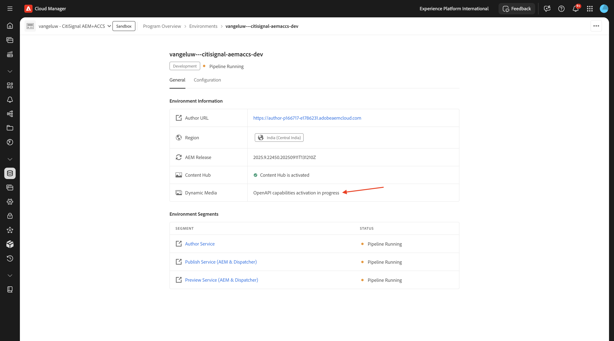

# 1.1.1 Cloud Manager-Programm erstellen

Navigieren Sie zu [https://my.cloudmanager.adobe.com](https://my.cloudmanager.adobe.com){target="_blank"}. Die gewünschte Organisation ist `--aepImsOrgName--`. Sie werden dann so etwas sehen. Klicken Sie **Programm hinzufügen**.

Verwenden Sie für **Programmnamen** &quot;`--aepUserLdap-- - CitiSignal AEM+ACCS`&quot;. Wählen Sie die Option **Einrichten einer Sandbox**. Klicken Sie auf **Fortfahren**.

Stellen Sie sicher, dass die folgenden Optionen ausgewählt sind:

- Sites
- Formulare
- Assets

Klicken Sie auf den Pfeil für **Assets**, um die Optionsliste zu öffnen.

Stellen Sie sicher, dass die folgenden Optionen ausgewählt sind:

- Content Hub

Scrollen Sie in der Liste nach unten.

Stellen Sie sicher, dass die folgenden Optionen ausgewählt sind:

- Edge-Bereitstellungsdienste
- Dynamic Media

Klicken Sie auf **Erstellen**.

Das Erstellen Ihrer Umgebung dauert einige Zeit, 10-20mins.

Sobald die Umgebungen erstellt und einsatzbereit sind, erhalten Sie eine E-Mail-Bestätigung, nach der Sie hierher zurückkehren können.

Nachdem Sie Ihre E-Mail-Bestätigung erhalten haben, gehen Sie zurück zu [https://my.cloudmanager.adobe.com](https://my.cloudmanager.adobe.com){target="_blank"}. Anschließend sehen Sie, dass der Status Ihres Programms in &quot;**&quot;** wurde. Klicken Sie auf das Programm, um es zu öffnen.

Sehen Sie sich die Registerkarte **Pipelines** an. Klicken Sie auf die 3 Punkte **…** und dann auf **Ausführen**.

Klicken Sie auf **Ausführen**.

Klicken Sie anschließend auf der Registerkarte **Umgebungen** auf die **mit den drei Punkten** und anschließend auf **Details anzeigen**.

Anschließend werden die Details Ihrer Umgebung angezeigt, einschließlich der URL Ihrer **Author**-Umgebung, die Sie in der nächsten Übung benötigen.

Sehen Sie sich die Zeile **Content Hub** an und wählen Sie **Zum Aktivieren klicken**.

Klicken Sie **Aktivieren**.

Die Aktivierung von **&#x200B;**&#x200B;Content Hub&quot; wurde jetzt gestartet. Dies kann 10 Minuten oder länger dauern.

Nach etwa 10 Minuten wird **Content Hub** aktiviert.
Sehen Sie sich als Nächstes die Zeile **Dynamic Media** an und wählen Sie **Zum Aktivieren klicken** aus.

Klicken Sie **Aktivieren**.

**Dynamic Media**-Aktivierung wurde jetzt gestartet. Dies kann 10 Minuten oder länger dauern.

Nach etwa 10 Minuten erfolgt die Aktivierung **Dynamic Media**.

Sobald die Pipeline-Ausführung abgeschlossen ist, können Sie mit der nächsten Übung fortfahren.

Nächster Schritt: [Einrichten der AEM CS-Umgebung](./ex2.md){target="_blank"}

Zurück zu [Adobe Experience Manager Cloud Service und Edge Delivery Services](./aemcs.md){target="_blank"}

[Zurück zu „Alle Module“](./../../../overview.md){target="_blank"}
