# 1.1.2 Einrichten der AEM CS-Umgebung

## 1.1.2.1 Einrichten des GitHub-Repositorys

Navigieren Sie zu [https://github.com](https://github.com){target="_blank"}. Klicken Sie auf **Anmelden**.

Geben Sie Ihre Anmeldedaten ein. Klicken Sie auf **Anmelden**.

Nach der Anmeldung sehen Sie Ihr GitHub-Dashboard.

Navigieren Sie zu [https://github.com/adobe-rnd/aem-boilerplate-xcom](https://github.com/adobe-rnd/aem-boilerplate-xcom){target="_blank"}. Sie werden es dann sehen. Klicken Sie **Diese Vorlage verwenden** und anschließend auf **Neues Repository erstellen**.

Für den **Repository-Namen** verwenden Sie `citisignal-aem-accs`. Setzen Sie die Sichtbarkeit auf **Privat**. Klicken Sie **Repository erstellen**.

Nach einigen Sekunden wird dann Ihr Repository erstellt.

Navigieren Sie anschließend zu [https://github.com/apps/aem-code-sync](https://github.com/apps/aem-code-sync){target="_blank"}. Klicken Sie **Installieren** oder **Konfigurieren**.

Klicken Sie auf **Schaltfläche &quot;**&quot; neben Ihrem GitHub-Benutzerkonto.

Klicken Sie **Konfigurieren** neben Ihrem GitHub-Benutzerkonto auf.

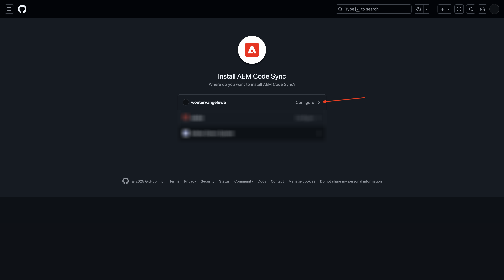

Klicken Sie **Nur Repositorys auswählen** und fügen Sie dann das soeben erstellte Repository hinzu.

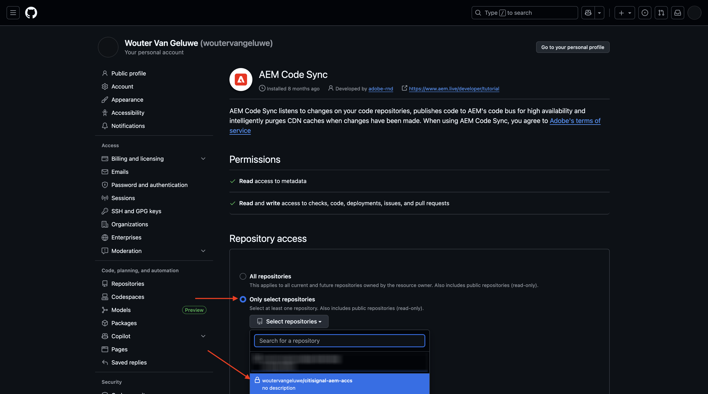

Scrollen Sie nach unten und klicken Sie auf **Speichern**.

Sie erhalten dann diese Bestätigung.

## 1.1.2.2 Aktualisierungsdatei fstab.yaml

Klicken Sie in Ihrem GitHub-Repository auf , um die Datei `fstab.yaml` zu öffnen.

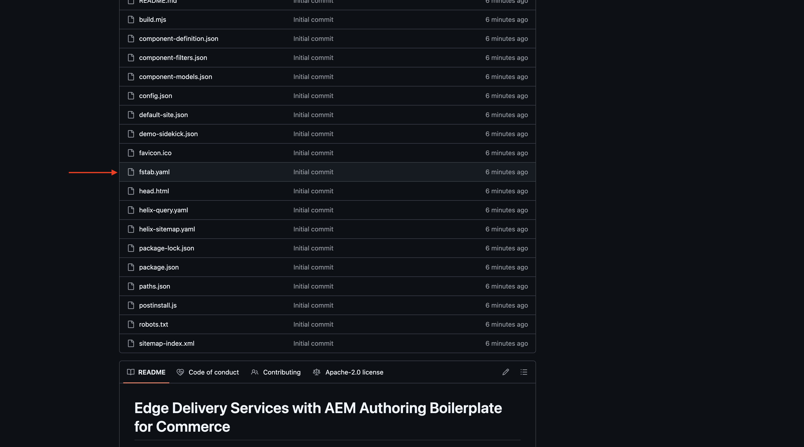

Klicken Sie auf **Symbol** Bearbeiten“.

Jetzt müssen Sie den Wert für das Feld (URL **in** 3 aktualisieren.

Sie müssen den aktuellen Wert durch die URL Ihrer spezifischen AEM Sites CS-Umgebung in Kombination mit den Einstellungen Ihres GitHub-Repositorys ersetzen.

Dies ist der aktuelle Wert der URL: `https://author-p130360-e1272151.adobeaemcloud.com/bin/franklin.delivery/adobe-rnd/aem-boilerplate-xcom/main`.

Es gibt drei Teile der URL, die aktualisiert werden müssen

`https://XXX/bin/franklin.delivery/YYY/ZZZ/main`

XXX sollte durch die URL Ihrer AEM CS-Autorenumgebung ersetzt werden.

JJJJ sollte durch Ihr GitHub-Benutzerkonto ersetzt werden.

ZZZ sollte durch den Namen des GitHub-Repositorys ersetzt werden, das Sie in der vorherigen Übung verwendet haben.

Die URL Ihrer AEM CS-Autorenumgebung finden Sie unter [https://my.cloudmanager.adobe.com](https://my.cloudmanager.adobe.com){target="_blank"}. Klicken Sie auf **Programm**, um es zu öffnen.

Klicken Sie anschließend auf der Registerkarte **Umgebungen** auf die **mit den drei Punkten** und anschließend auf **Details anzeigen**.

Anschließend werden die Details Ihrer Umgebung angezeigt, einschließlich der URL Ihrer **Author**-Umgebung. Kopieren Sie die URL.

XXX = `author-p166717-e1786231.adobeaemcloud.com`

Den Namen des GitHub-Benutzerkontos finden Sie leicht in der URL Ihres Browsers. In diesem Beispiel ist der Name des Benutzerkontos `woutervangeluwe`.

JJJJ = `woutervangeluwe`

Den GitHub-Repository-Namen finden Sie auch im Browser-Fenster, das Sie in GitHub geöffnet haben. In diesem Fall ist der Repository-Name `citisignal`.

ZZZ = `citisignal-aem-accs`

Diese drei Werte zusammen führen zu dieser neuen URL, die im `fstab.yaml` konfiguriert werden muss.

`https://author-p166717-e1786231.adobeaemcloud.com/bin/franklin.delivery/woutervangeluwe/citisignal-aem-accs/main`

Klicken Sie **Änderungen übernehmen…**.

Klicken Sie **Änderungen übernehmen**.

Die Datei `fstab.yaml` wurde aktualisiert.

## 1.1.2.3 Hochladen von CitiSignal-Assets und -Sites

Navigieren Sie zu [https://my.cloudmanager.adobe.com](https://my.cloudmanager.adobe.com){target="_blank"}. Klicken Sie auf **Programm**, um es zu öffnen.

Klicken Sie anschließend auf die URL Ihrer Autorenumgebung.

Klicken Sie **Mit Adobe anmelden**.

Anschließend wird Ihre Autorenumgebung angezeigt.

Ihre URL sieht dann wie folgt aus: `https://author-p166717-e1786231.adobeaemcloud.com/ui#/aem/aem/start.html?appId=aemshell`

Sie müssen jetzt auf die Umgebung **CRX Package Manager** von AEM zugreifen. Entfernen Sie dazu `ui#/aem/aem/start.html?appId=aemshell` aus der URL und ersetzen Sie sie durch `crx/packmgr`. Ihre URL sollte jetzt wie folgt aussehen:
`https://author-p166717-e1786231.adobeaemcloud.com/crx/packmgr`.
Drücken Sie **Eingabetaste**, um die Package Manager-Umgebung zu laden

Klicken Sie anschließend auf **Paket hochladen**.

Klicken Sie **Durchsuchen**, um das hochzuladende Paket zu suchen.

Das Paket, das hochgeladen werden soll, heißt **Citisignal-assets.zip** und kann hier heruntergeladen werden: [https://one-adobe-tech-insiders.s3.us-west-2.amazonaws.com/one-adobe/citisignal_aem_accs.zip](https://one-adobe-tech-insiders.s3.us-west-2.amazonaws.com/one-adobe/citisignal_aem_accs.zip){target="_blank"}.

Wählen Sie die `citisignal_aem_accs.zip` aus und klicken Sie auf **Öffnen**.

Klicken Sie anschließend auf **OK**.

Das Paket wird dann hochgeladen. Klicken Sie anschließend auf **Installieren** auf dem soeben hochgeladenen Paket.

Klicken Sie auf **Installieren**.

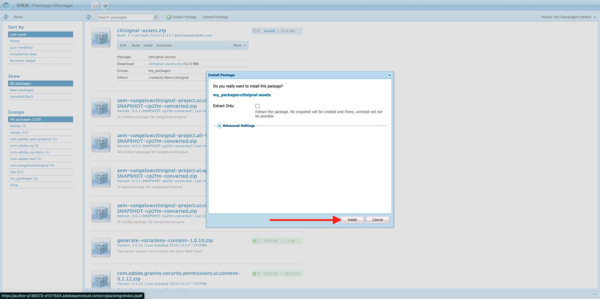

Nach einigen Minuten wird Ihr Paket installiert.

Sie können dieses Fenster jetzt schließen.

## 1.1.2.4 Veröffentlichen von CitiSignal-Assets

Navigieren Sie zu [https://my.cloudmanager.adobe.com](https://my.cloudmanager.adobe.com){target="_blank"}. Klicken Sie auf **Programm**, um es zu öffnen.

Klicken Sie anschließend auf die URL Ihrer Autorenumgebung.

Klicken Sie **Mit Adobe anmelden**.

Anschließend wird Ihre Autorenumgebung angezeigt. Auf **Assets**.

Klicken Sie auf **Dateien**.

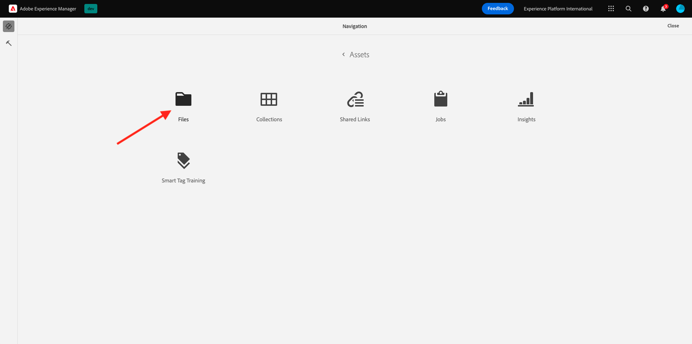

Klicken Sie auf den Ordner **CitiSignal** und dann auf **Veröffentlichung verwalten**.

Klicken Sie auf **Weiter**.

Klicken Sie auf **Veröffentlichen**.

Ihre Assets wurden veröffentlicht.

## 1.1.2.5 Publish CitiSignal-Website

Klicken Sie auf den **Adobe Experience Manager**-Produktnamen oben links im Bildschirm und anschließend auf den **Pfeil** neben **Assets**.

Klicken Sie anschließend auf **Sites**.

Sie sollten dann Ihre **CitiSignal**-Website sehen, die nach der Installation des Pakets erstellt wurde.

Um Ihre Site mit dem zuvor erstellten GitHub-Repository zu verknüpfen, müssen Sie eine **Edge Delivery Services-Konfiguration erstellen**.

Der erste Schritt dazu besteht darin, eine **Cloud-Konfiguration** zu erstellen.

Klicken Sie dazu auf den **Adobe Experience Manager** Produktnamen oben links im Bildschirm, klicken Sie dann auf das Symbol **Tools** und wählen Sie dann **Allgemein** aus. Klicken, um **Konfigurationsbrowser** zu öffnen.

Sie sollten das dann sehen. Klicken Sie auf **Erstellen**

Legen Sie die Felder **Titel** und **Name** auf `CitiSignal` fest. Aktivieren Sie das Kontrollkästchen für **Cloud-Konfigurationen**.

Klicken Sie auf **Erstellen**.

Sie sollten dann diese haben.

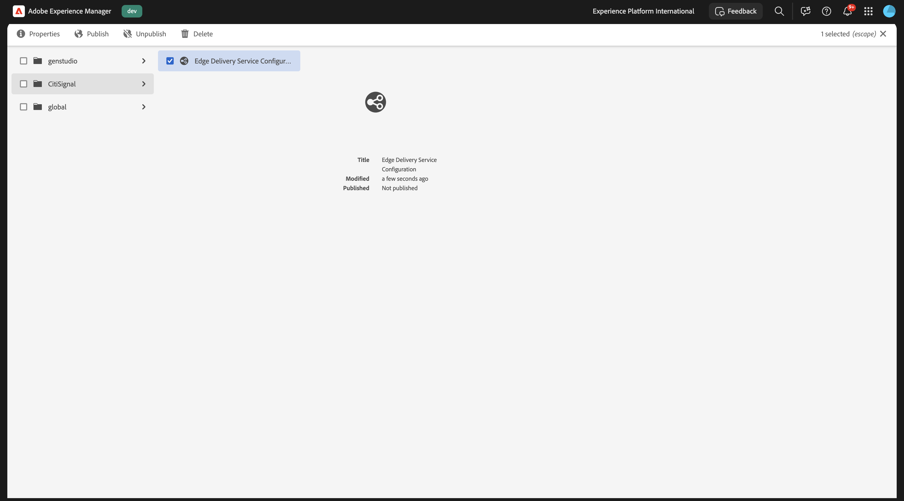

Als Nächstes müssen Sie einige Felder der soeben erstellten **Cloud-Konfiguration** aktualisieren.

Klicken Sie dazu auf den **Adobe Experience Manager**-Produktnamen oben links im Bildschirm, klicken Sie dann auf das Symbol **Tools** und wählen Sie dann **Cloud Services** aus. Klicken, um **Edge Delivery Services-Konfiguration zu**.

Wählen Sie **CitiSignal**, klicken Sie auf **Erstellen** und wählen Sie **Konfiguration**.

Füllen Sie jetzt die Felder **Organisation** und **Site-Name** aus. Sehen Sie sich dazu zunächst die URL Ihres GitHub-Repositorys an.

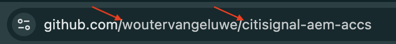

- **Organisation**: Verwenden Sie den Namen Ihrer GitHub-Organisation, in diesem Beispiel ist er `woutervangeluwe`
- **Site-Name**: Verwenden Sie den Namen des GitHub-Repositorys, der `citisignal-aem-accs` werden soll.

Klicken Sie **Speichern und schließen**.

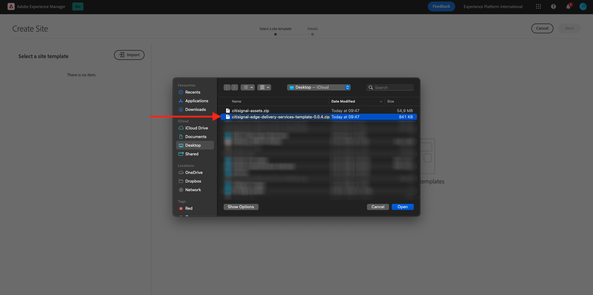

Sie sollten dann diese haben. Aktivieren Sie das Kontrollkästchen vor Ihrer neu erstellten Edge-Cloud-Konfiguration und klicken Sie auf **Veröffentlichen**.

## 1.1.2.6 Aktualisieren der Datei „pfads.json“

Klicken Sie in Ihrem GitHub-Repository auf , um die Datei `paths.json` zu öffnen.

Klicken Sie auf **Symbol** Bearbeiten“.

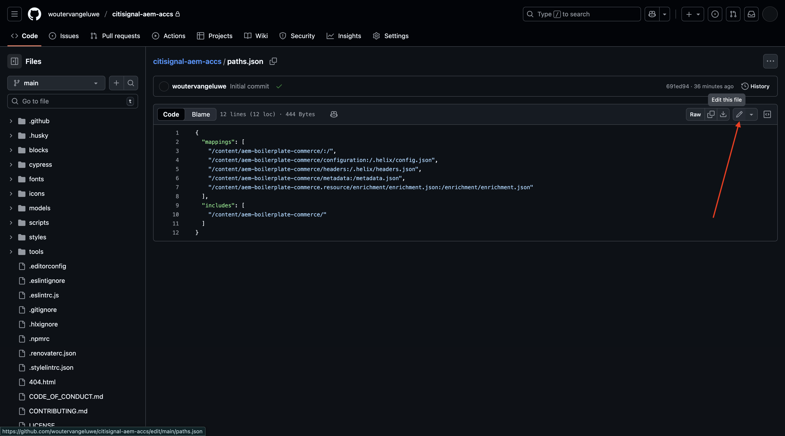

Aktualisieren Sie nun den `aem-boilerplate-commerce` durch `CitiSignal` ersetzen in den Zeilen 3, 4, 5, 6, 7 und 10.

Klicken Sie **Änderungen übernehmen**.

Klicken Sie **Änderungen übernehmen**.

Die Datei `paths.json` wurde aktualisiert.

## 1.1.2.7 Publish CitiSignal-Website

Klicken Sie auf den **Adobe Experience Manager**-Produktnamen oben links im Bildschirm und anschließend auf **Sites**.

Klicken Sie anschließend auf das Kontrollkästchen vor **CitiSignal**. Klicken Sie dann auf **Veröffentlichung verwalten**.

Klicken Sie auf **Weiter**.

Klicken Sie auf **Untergeordnete Einstellungen einschließen**.

Aktivieren Sie das Kontrollkästchen **Untergeordnete Elemente einbeziehen** und heben Sie dann die Auswahl der anderen Kontrollkästchen auf. Klicken Sie auf **OK**.

Klicken Sie auf **Veröffentlichen**.

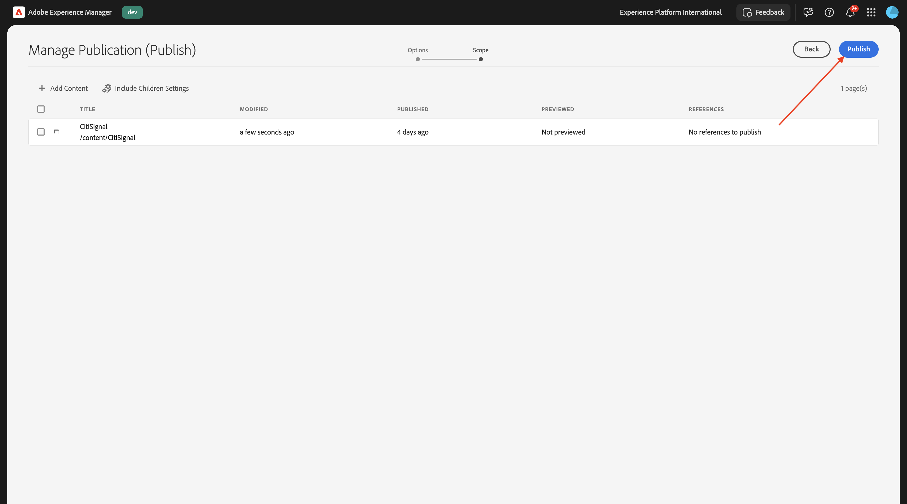

Sie werden dann hierher zurückgeschickt. Klicken Sie auf **CitiSignal**, aktivieren Sie das Kontrollkästchen vor **index** und klicken Sie dann auf **Bearbeiten**.

Ihre Website wird dann im **universellen Editor** geöffnet.

Sie können nun auf Ihre Website zugreifen, indem Sie zu `main--citisignal-aem-accs--XXX.aem.page` und/oder `main--citisignal-aem-accs--XXX.aem.live` wechseln, nachdem Sie XXX durch Ihr GitHub-Benutzerkonto ersetzt haben, was in diesem Beispiel `woutervangeluwe` ist.

In diesem Beispiel lautet die vollständige URL wie folgt:
`https://main--citisignal-aem-accs--woutervangeluwe.aem.page` und/oder `https://main--citisignal-aem-accs--woutervangeluwe.aem.live`.

Es kann einige Zeit dauern, bis alle Assets korrekt angezeigt werden, da sie zuerst veröffentlicht werden müssen.

Sie sehen dann Folgendes:

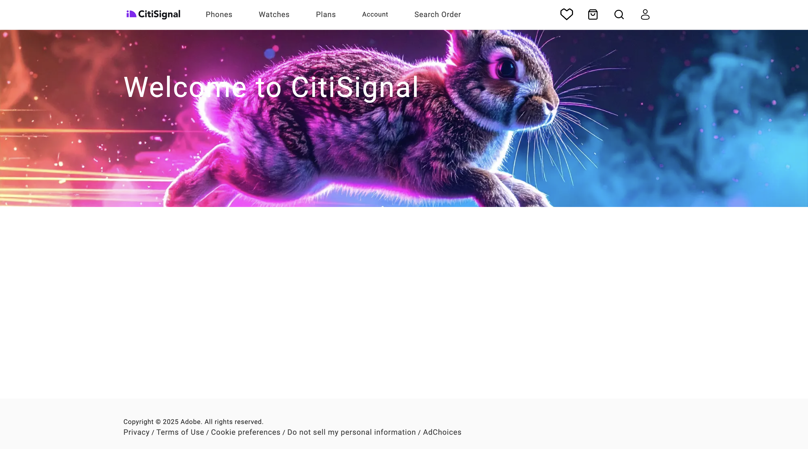

## 1.1.2.8 der Testseitenleistung

Navigieren Sie zu [https://pagespeed.web.dev/](https://pagespeed.web.dev/){target="_blank"}. Geben Sie Ihre URL ein und klicken Sie auf **Analysieren**.

Anschließend sehen Sie, dass Ihre Website sowohl in einer Mobile- als auch in einer Desktop-Visualisierung einen Highscore erhält:

**Mobil**:

**Desktop**:

Nächster Schritt: [Entwickeln eines benutzerdefinierten Blocks](./ex3.md){target="_blank"}

Zurück zu [Adobe Experience Manager Cloud Service und Edge Delivery Services](./aemcs.md){target="_blank"}

[Zurück zu „Alle Module“](./../../../overview.md){target="_blank"}
