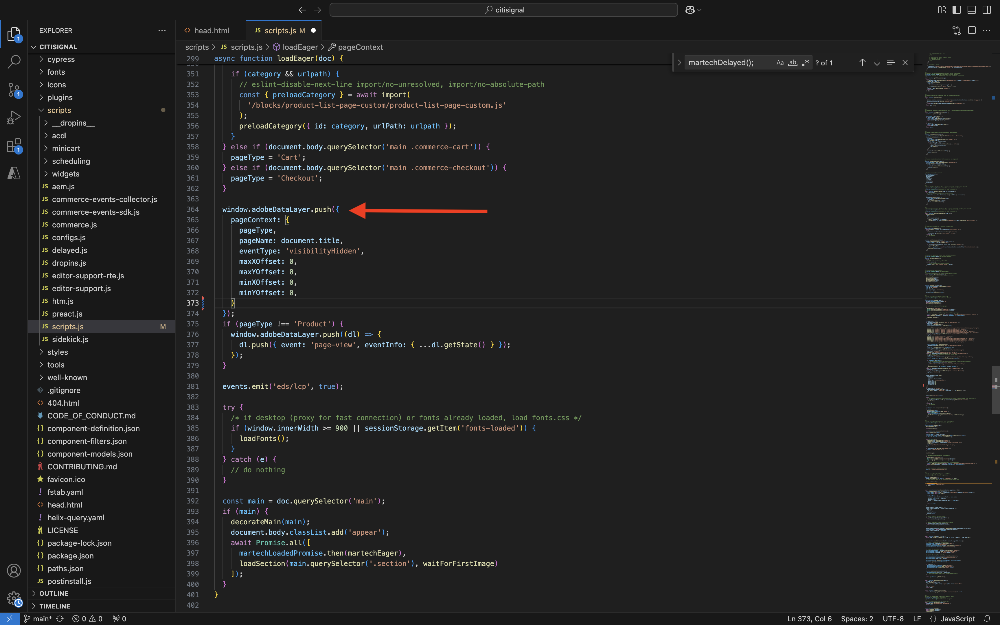
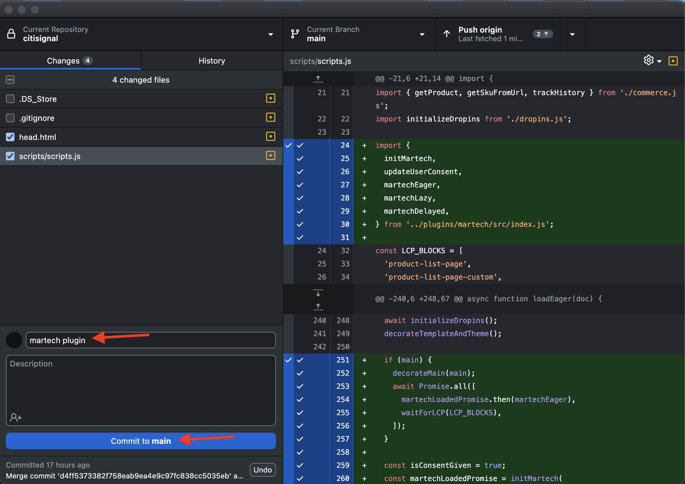

# 1.1.5 AEM Edge Delivery Services MarTech-Plug-in

Mit dem AEM MarTech-Plug-in können Sie schnell einen vollständigen MarTech-Stack für Ihr AEM-Projekt einrichten.

>[!NOTE]
>
>Dieses Plug-in steht Kunden derzeit in Zusammenarbeit mit AEM Engineering über Co-Innovationsprojekte zur Verfügung. Weitere Informationen finden Sie unter [https://github.com/adobe-rnd/aem-martech](https://github.com/adobe-rnd/aem-martech).

## 1.1.5.1 Hinzufügen des Plug-ins zu Ihrem Repository

Navigieren Sie zu dem Ordner, den Sie für Ihr GitHub-Repository **Citisignal** verwenden. Klicken Sie mit der rechten Maustaste auf den Ordnernamen und wählen Sie **Neues Terminal unter Ordner**.

{zoomable="yes"}

Sie werden es dann sehen. Fügen Sie den folgenden Befehl ein und drücken Sie **enter**.

```
git subtree add --squash --prefix plugins/martech https://github.com/adobe-rnd/aem-martech.git main
```

Sie sollten das dann sehen.

{zoomable="yes"}

Navigieren Sie zu dem Ordner, den Sie für Ihr GitHub-Repository **Citisignal** verwenden, und öffnen Sie den Ordner **plugins**. Jetzt sollte ein Ordner mit dem Namen **martech** angezeigt werden.

{zoomable="yes"}

## 1.1.5.2 head.html

Öffnen Sie in Visual Studio Code die Datei **head.html**. Kopieren Sie den folgenden Code und fügen Sie ihn in die Datei **head.html** ein.

```javascript
<link rel="preload" as="script" crossorigin="anonymous" href="/plugins/martech/src/index.js"/>
<link rel="preload" as="script" crossorigin="anonymous" href="/plugins/martech/src/alloy.min.js"/>
<link rel="preconnect" href="https://edge.adobedc.net"/>
<!-- change to adobedc.demdex.net if you enable third party cookies -->
```

Speichern Sie Ihre Änderungen.

{zoomable="yes"}

## 1.1.5.3 scripts.js

Wechseln Sie in Visual Studio Code zum Ordner **scripts** und öffnen Sie die Datei **scripts.js**. Kopieren Sie den folgenden Code und fügen Sie ihn in die Datei **scripts.js** unter den vorhandenen Importskripten ein.

```javascript
import {
  initMartech,
  updateUserConsent,
  martechEager,
  martechLazy,
  martechDelayed,
} from '../plugins/martech/src/index.js';
```

Speichern Sie Ihre Änderungen.

{zoomable="yes"}

Suchen Sie in Visual Studio Code in der Datei **scripts.js** den folgenden Code:

```javascript
const AUDIENCES = {
  mobile: () => window.innerWidth < 600,
  desktop: () => window.innerWidth >= 600,
  // define your custom audiences here as needed
};
```

Fügen Sie **const AUDIENCES = {...};** folgenden Code ein:

```javascript
  const isConsentGiven = true;
  const martechLoadedPromise = initMartech(
    // The WebSDK config
    // Documentation: https://experienceleague.adobe.com/en/docs/experience-platform/web-sdk/commands/configure/overview#configure-js
    {
      datastreamId: "XXX",
      orgId: "XXX",
      defaultConsent: 'in',
      onBeforeEventSend: (payload) => {
        // set custom Target params 
        // see doc at https://experienceleague.adobe.com/en/docs/platform-learn/migrate-target-to-websdk/send-parameters#parameter-mapping-summary
        payload.data.__adobe.target ||= {};

        // set custom Analytics params
        // see doc at https://experienceleague.adobe.com/en/docs/analytics/implementation/aep-edge/data-var-mapping
        payload.data.__adobe.analytics ||= {};
      },

      // set custom datastream overrides
      // see doc at:
      // - https://experienceleague.adobe.com/en/docs/experience-platform/web-sdk/commands/datastream-overrides
      // - https://experienceleague.adobe.com/en/docs/experience-platform/datastreams/overrides
      edgeConfigOverrides: {
        // Override the datastream id
        // datastreamId: '...'

        // Override AEP event datasets
        // com_adobe_experience_platform: {
        //   datasets: {
        //     event: {
        //       datasetId: '...'
        //     }
        //   }
        // },

        // Override the Analytics report suites
        // com_adobe_analytics: {
        //   reportSuites: ['...']
        // },

        // Override the Target property token
        // com_adobe_target: {
        //   propertyToken: '...'
        // }
      },
    },
    // The library config
    {
      launchUrls: ["XXX"],
      personalization: !!getMetadata('target') && isConsentGiven,
    },
  );
```

{zoomable="yes"}

Es gibt einige Variablen, die Sie im obigen Code durch die Variablen Ihrer eigenen Umgebung ersetzen müssen:

- `datastreamId: "XXX"`
- `orgId: "XXX"`
- `launchUrls: ["XXX"]`

Sie können diese Variablen anhand der folgenden Anweisungen finden:

### datastreamId

Wechseln Sie zu [https://platform.adobe.com/](https://platform.adobe.com/) und dann zu **Datenströme** im linken Menü. Stellen Sie sicher, dass Sie sich in der richtigen Sandbox befinden, die `--aepSandboxName--` werden sollte. Suchen Sie den Datenstrom, der im Abschnitt Erste Schritte dieses Tutorials erstellt wurde. Dieser sollte den Namen `--aepUserLdap-- - One Adobe Datastream` haben. Klicken Sie auf das **copy**-Symbol, um die **Datenstrom-ID** zu kopieren und in Visual Studio Code in die Datei **scripts.js** einzufügen, indem Sie den Platzhalterwert `XXX` neben `datastreamId:` ersetzen.

{zoomable="yes"}

### orgId

Wechseln Sie zu [](https://platform.adobe.com/)https://platform.adobe.com/&quot; und dann **Menü links zu** Abfragen“. Unter **Anmeldeinformationen** finden Sie die **IMS-Organisations-ID** als **Benutzername**. Klicken Sie auf **copy**, um die **IMS-Organisations-ID** zu kopieren und in Visual Studio Code in die Datei **scripts.js** einzufügen, indem Sie den Platzhalterwert `XXX` neben `orgId:` ersetzen.

{zoomable="yes"}

### launchUrls

Wechseln Sie zu [https://platform.adobe.com/](https://platform.adobe.com/) und dann im linken Menü zu **Tags**. Suchen Sie mithilfe Ihres LDAP nach Ihrer Eigenschaft, die `--aepUserLdap--` werden sollte. Öffnen Sie die Web-Eigenschaft.

{zoomable="yes"}

Wechseln Sie im linken Menü zu **Umgebungen** und klicken Sie dann auf das **Installieren**-Symbol für die **Entwicklungsumgebung**.

{zoomable="yes"}

Anschließend finden Sie die URL, die Sie benötigen, sie befindet sich jedoch in einem HTML `<script></script>`-Tag. Kopieren Sie nur das Teil, das mit `https` beginnt, bis `.min.js`.

{zoomable="yes"}

Die URL sieht wie folgt aus: `https://assets.adobedtm.com/b754ed1bed61/b9f7c7c484de/launch-5fcd90e5b482-development.min.js`. Bitte stellen Sie sicher, dass kein anderer Text mitkopiert wird, da dies zu Fehlern führen würde. Ersetzen Sie in Visual Studio Code in der Datei **scripts.js** den im `XXX`-Array `launchUrls:` Platzhalterwert.

Jetzt verfügen Sie über die drei erforderlichen Variablen. Ihre `scripts.js` sollte jetzt wie folgt aussehen:

{zoomable="yes"}

Suchen Sie anschließend nach diesem Code-Block:

```javascript
const main = doc.querySelector('main');
  if (main) {
    decorateMain(main);
    document.body.classList.add('appear');
    await loadSection(main.querySelector('.section'), waitForFirstImage);	
  }
```

{zoomable="yes"}

Ersetzen Sie sie durch diesen Codeblock:

```javascript
const main = doc.querySelector('main');
  if (main) {
    decorateMain(main);
    document.body.classList.add('appear');
    await Promise.all([
      martechLoadedPromise.then(martechEager),
      loadSection(main.querySelector('.section'), waitForFirstImage)
    ]);
  }
```

{zoomable="yes"}

Suchen Sie dann nach und scrollen Sie nach unten zu `async function loadLazy(doc) {`.

{zoomable="yes"}

Fügen Sie unter der Zeile `autolinkModals(doc);` diese Codezeile hinzu:

```javascript
await martechLazy();
```

{zoomable="yes"}

Suchen Sie dann nach und scrollen Sie nach unten zur Zeile `function loadDelayed() {`.

{zoomable="yes"}

Fügen Sie diesen Codeblock unter der `// load anything that can be postponed to the latest here` hinzu.

```javascript
window.setTimeout(() => {
    martechDelayed();
    return import('./delayed.js');
  }, 3000);
```

{zoomable="yes"}

Suchen Sie dann nach und navigieren Sie zur Zeile, die `window.adobeDataLayer.push` enthält.

{zoomable="yes"}

Sie werden sehen, dass das Objekt `pageContext` wie folgt definiert wird. Sie müssen jetzt zwei -Objekte unter `pageContext` hinzufügen.

```javascript
	pageContext: {
      pageType,
      pageName: document.title,
      eventType: 'visibilityHidden',
      maxXOffset: 0,
      maxYOffset: 0,
      minXOffset: 0,
      minYOffset: 0,
    }
```

Dies ist der Code, der hinzugefügt werden muss:

```javascript
	,
    _experienceplatform: {
      identification:{
        core:{
          ecid: sessionStorage.getItem("com.adobe.reactor.dataElements.ECID")
        }
      }
    },
    web: {
      webPageDetails:{
        name: document.title,
        URL: window.location.href
      }
    }
```

**window.adobeDataLayer.Push** sollte jetzt wie folgt aussehen:

```javascript
  window.adobeDataLayer.push({
    pageContext: {
      pageType,
      pageName: document.title,
      eventType: 'visibilityHidden',
      maxXOffset: 0,
      maxYOffset: 0,
      minXOffset: 0,
      minYOffset: 0,
    },
    _experienceplatform: {
      identification:{
        core:{
          ecid: sessionStorage.getItem("com.adobe.reactor.dataElements.ECID")
        }
      }
    },
    web: {
      webPageDetails:{
        name: document.title,
        URL: window.location.href
      }
    }
  });
```

{zoomable="yes"}

Sie haben nun alle erforderlichen Änderungen in der Datei „scripts.**&quot;**.

Öffnen Sie den GitHub-Desktop-Client und übertragen Sie Ihre Änderungen.

{zoomable="yes"}

Klicken Sie **Ursprung per Push übertragen**, um Ihre Änderungen an Ihr GitHub-Repository zu übertragen.

{zoomable="yes"}

## 1.1.5.4 der ACDL-Erweiterung in der Tags-Eigenschaft

Damit das MarTech-Plug-in von AEM Edge Delivery Services ordnungsgemäß funktioniert, müssen Sie die Erweiterung für hinzufügen.

Navigieren Sie zu [https://experience.adobe.com/#/data-collection/](https://experience.adobe.com/#/data-collection/). Suchen Sie nach Ihrer Tags-Eigenschaft für das Web, die `--aepUserLdap-- - One Adobe (DD/MM/YYYY)` heißt, und öffnen Sie sie.

{zoomable="yes"}

Navigieren Sie zu **Erweiterungen**, zu **Katalog**. Klicken Sie auf die Erweiterung **Adobe Client Data Layer** und dann auf **Installieren**.

{zoomable="yes"}

Sie sollten das dann sehen. Es ist im Moment nicht nötig, etwas zu ändern. Klicken Sie **In Bibliothek speichern**.

{zoomable="yes"}

Ihre Erweiterung wird dann Ihrer Tags-Eigenschaft hinzugefügt.

{zoomable="yes"}

Wechseln Sie zu **Veröffentlichungsfluss** und öffnen Sie Ihre **Main**-Bibliothek. Klicken Sie auf **Alle geänderten Ressourcen hinzufügen** und anschließend auf **Für Entwicklung speichern und erstellen**.

{zoomable="yes"}

Ihre Änderungen werden jetzt bereitgestellt.

## 1.1.5.5 Senden von Daten an Adobe Experience Platform Edge Network

Sie können nun die Änderungen an Ihrer Website anzeigen, indem Sie zu `main--citisignal--XXX.aem.page/us/en/` und/oder `main--citisignal--XXX.aem.live/us/en/` wechseln, nachdem Sie XXX durch Ihr GitHub-Benutzerkonto ersetzt haben, was in diesem Beispiel `woutervangeluwe` ist.

In diesem Beispiel lautet die vollständige URL wie folgt:
`https://main--citisignal--woutervangeluwe.aem.page/us/en/` und/oder `https://main--citisignal--woutervangeluwe.aem.live/us/en/`.

>[!NOTE]
>
>Erwägen Sie, eine Inkognito-Web-Seite zu öffnen, um sicherzustellen, dass Sie die Datenerfassung mit einem neuen, sauberen Profil beginnen. Dies erleichtert das Debugging und die Fehlerbehebung.

{zoomable="yes"}

Öffnen Sie in Chrome **Entwickler-**), indem Sie zu **Weitere Tools** > **Entwickler-Tools** wechseln.

{zoomable="yes"}

In **Konsolenansicht** wird eine Reihe von Zeilen angezeigt, die mit `[alloy]` beginnen. Schauen Sie sich die Anfragen an. Eine davon sollte wie folgt aussehen und den Anfragetext haben, wie in der Abbildung dargestellt.

`[alloy] Request 55a9ddbc-0521-4ba3-b527-3da2cb35328a: Sending request.`

Öffnen Sie die Payload, schlüsseln Sie den Drilldown in die `events[0].xdm._experienceplatform.identification.core.ecid` auf und kopieren Sie die ECID.

{zoomable="yes"}

## 1.1.5.6 Kundenprofil in Adobe Experience Platform anzeigen

Melden Sie sich über die folgende URL bei Adobe Experience Platform an: [https://experience.adobe.com/platform](https://experience.adobe.com/platform).

Nach dem Login landen Sie auf der Homepage von Adobe Experience Platform.

{zoomable="yes"}

Bevor Sie fortfahren, müssen Sie eine **Sandbox“**. Die auszuwählende Sandbox hat den Namen ``--aepSandboxName--``. Nach Auswahl der entsprechenden Sandbox wird der Bildschirm geändert und Sie befinden sich nun in Ihrer dedizierten Sandbox.

{zoomable="yes"}

Gehen Sie im linken Menü zu **Kunde** > **Profile** > **Durchsuchen**. Wählen Sie den **Identity-Namespace** von **ECID** aus und übergeben Sie dann die **ECID**, die Sie im vorherigen Schritt kopiert haben. Klicken Sie **Anzeigen**. Anschließend sollte in der Liste ein Profil angezeigt werden. Klicken Sie darauf, um sie zu öffnen.

{zoomable="yes"}

Anschließend wird die Übersicht **Profil-Dashboard** angezeigt, in der die ECID angezeigt wird. Navigieren Sie anschließend zu **Ereignisse**.

{zoomable="yes"}

Unter **Ereignisse** werden mehrere Erlebnisereignisse angezeigt, darunter ein Ereignis mit eventType **web.webpagedetails.pageViews**. Klicken Sie **JSON anzeigen**, um alle erfassten Ereignisse anzuzeigen.

{zoomable="yes"}

Überprüfen Sie in **JSON**-Ansicht das Ereignis mit eventType **web.webpagedetails.pageViews**, um z. B. den **Seitennamen** und die **Seiten-URL** anzuzeigen.

{zoomable="yes"}

Sie haben jetzt diese Übung abgeschlossen.

Nächster Schritt: [Zusammenfassung und Vorteile](./summary.md){target="_blank"}

Zurück zu [Adobe Experience Manager Cloud Service und Edge Delivery Services](./aemcs.md){target="_blank"}

[Zurück zu „Alle Module“](./../../../overview.md){target="_blank"}
