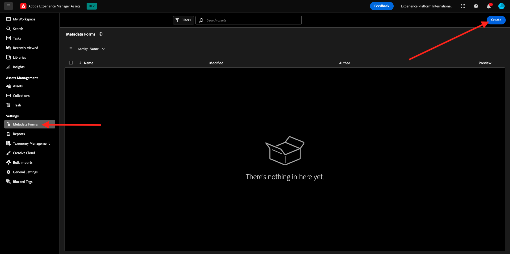
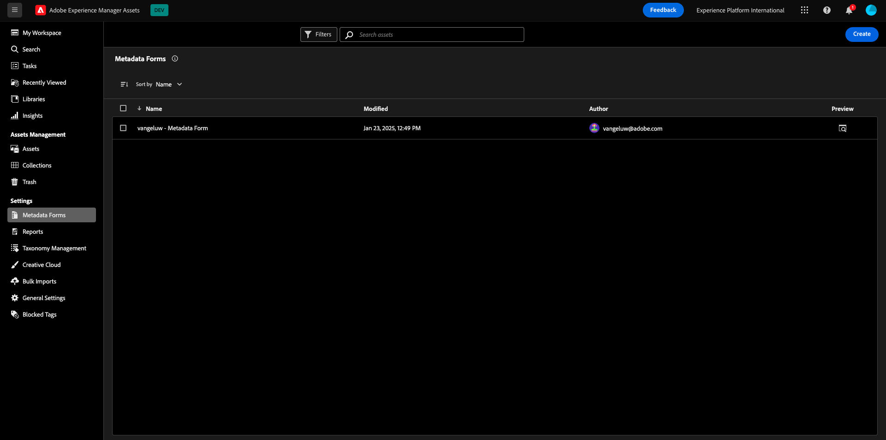

# 1.2.1 Erste Schritte mit Workfront

Melden Sie sich unter [https://experienceplatform.my.workfront.com/](https://experienceplatform.my.workfront.com/){target="_blank"} bei Adobe Workfront an.

Dann sehen Sie das hier.

## 1.2.1.1 Konfigurieren der AEM Assets-Integration

Klicken Sie auf das 9-Punkte **Hamburger**-Symbol und wählen Sie dann **Setup** aus.

Scrollen Sie im linken Menü nach unten zu **Dokumente** und klicken Sie dann auf **Experience Manager Assets**.

Klicken Sie auf **+ Experience Manager-Integration**.

Verwenden Sie für den Namen Ihrer Integration `--aepUserLdap-- - Citi Signal AEM`.

Öffnen Sie das Dropdown-**** Experience Manager-Repository und wählen Sie Ihre AEM CS-Instanz aus, die `--aepUserLdap-- - Citi Signal` benannt werden soll.

Konfigurieren **unter &quot;**&quot; die folgende Zuordnung:

| Workfront-Feld | Experience Manager Assets-Feld |
| --------------- | ------------------------------ | 
| **Dokument** > **Name** | **wm:documentName** |
| **Projekt** > **Beschreibung** | **wm:projectDescription** |
| **Aufgabe** > **Name** | **wm:taskName** |
| **Aufgabe** > **Beschreibung** | **wm:taskDescription** |

Aktivieren Sie den Schalter für **Objektmetadaten synchronisieren**.

Klicken Sie auf **Speichern**.

Ihre Integration von Workfront in AEM Assets CS ist jetzt konfiguriert.

## 1.2.1.2 Konfigurieren der Metadatenintegration mit AEM Assets

Als Nächstes müssen Sie AEM Assets so konfigurieren, dass die Metadatenfelder aus dem Asset in Workfront für AEM freigegeben werden.

Navigieren Sie dazu zu [https://experience.adobe.com/](https://experience.adobe.com/). Auf **Experience Manager Assets**.

Klicken Sie, um Ihre AEM Assets-Umgebung auszuwählen, die `--aepUserLdap-- - Citi Signal dev` benannt werden sollte.

Sie sollten das dann sehen. Wechseln Sie im linken Menü zu **Assets** klicken Sie auf **Ordner erstellen**.

Benennen Sie den Ordner `--aepUserLdap-- - Workfront Assets` und klicken Sie auf **Erstellen**.

Navigieren Sie dann im linken Menü zu **Metadaten-** Forms) und klicken Sie auf **Erstellen**.

Verwenden Sie den `--aepUserLdap-- - Metadata Form` und klicken Sie auf **Erstellen**.

Fügen Sie dem Formular **drei neue Felder** einzeiliger Text“ hinzu und wählen Sie das erste Feld aus. Klicken Sie dann auf das Symbol **Schema** neben dem Feld **Metadateneigenschaft**.

Geben Sie im Suchfeld `wm:project` ein und wählen Sie dann das Feld **Projektbeschreibung** aus. Klicken Sie auf **Auswählen**.

Ändern Sie die Bezeichnung des Felds in **Projektbeschreibung**.

Wählen Sie als Nächstes das zweite **Einzeiliger Text**-Feld aus und klicken Sie erneut auf das **Schema**-Symbol neben dem **Metadateneigenschaft**-Feld.

Anschließend wird dieses Popup erneut angezeigt. Geben Sie im Suchfeld `wm:project` ein und wählen Sie dann das Feld **Projekt-ID** aus. Klicken Sie auf **Auswählen**.

Ändern Sie die Bezeichnung des Felds in **Projekt-ID**.

Wählen Sie das dritte **Einzeiliger Text**-Feld aus und klicken Sie erneut auf das **Schema**-Symbol neben dem **Metadateneigenschaft**-Feld.

Anschließend wird dieses Popup erneut angezeigt. Geben Sie im Suchfeld `wm:project` ein und wählen Sie dann das Feld **Projektname** aus. Klicken Sie auf **Auswählen**.

Ändern Sie die Bezeichnung des Felds in **Projektname**. Klicken Sie auf **Speichern**.

Ändern Sie den **Registerkartennamen** im Formular in `--aepUserLdap-- - Workfront Metadata`. Klicken Sie auf **Speichern** und **Schließen**.

Ihr **Metadatenformular** ist jetzt konfiguriert.

Als Nächstes müssen Sie das Metadatenformular dem Ordner zuweisen, den Sie zuvor erstellt haben. Aktivieren Sie das Kontrollkästchen für Ihr Metadatenformular und klicken Sie auf **Ordner zuweisen**.

Wählen Sie den Ordner aus, der `--aepUserLdap-- - Workfront Assets` benannt werden soll. Klicken Sie **Zuweisen**.

Das Metadatenformular wurde jetzt erfolgreich Ihrem Ordner zugewiesen.

## 1.2.1.2 Konfigurieren der AEM Sites-Integration

>[!NOTE]
>
>Dieses Plug-in befindet sich derzeit im **Early Access**-Modus und ist noch nicht allgemein verfügbar.
>
>Dieses Plug-in ist möglicherweise bereits mit Ihrer in der Workfront-Instanz installiert. Wenn es bereits installiert ist, können Sie die folgenden Anweisungen lesen, aber Sie müssen dann nichts an Ihrer Konfiguration ändern.

Navigieren Sie zu [https://experience.adobe.com/#/@experienceplatform/aem/extension-manager/universal-editor](https://experience.adobe.com/#/@experienceplatform/aem/extension-manager/universal-editor){target="_blank"}.

Stellen Sie sicher, **der** für dieses Plug-in auf &quot;**&quot;**. Klicken Sie anschließend auf das **Zahnrad**-Symbol.

Es wird ein Popup **Erweiterungskonfiguration** angezeigt. Konfigurieren Sie die folgenden Felder für die Verwendung dieses Plug-ins.

| Schlüssel | Wert |
| --------------- | ------------------------------ | 
| **`IMS_ENV`** | **PROD** |
| **`WORKFRONT_INSTANCE_URL`** | **https://experienceplatform.my.workfront.com** |
| **`SHOW_CUSTOM_FORMS`** | **&#39;{„previewUrl“: true, „publishUrl“: true}&#39;** |

Klicken Sie auf **Speichern**.

Gehen Sie zurück zu Ihrer Workfront-Benutzeroberfläche und klicken Sie auf das 9-Punkte **Hamburger**-Symbol. Wählen Sie **Setup** aus.

Wechseln Sie im linken Menü zu **Benutzerdefinierte Forms** und wählen Sie **Formular**. Klicken Sie auf **+ Neues benutzerdefiniertes Formular**.

Wählen Sie **Aufgabe** aus und klicken Sie auf **Weiter**.

Anschließend wird ein leeres benutzerdefiniertes Formular angezeigt. Geben Sie den `Content Fragment & Integration ID` des Formularnamens ein.

Ziehen Sie ein neues Feld **Einzeiliger Text** per Drag-and-Drop auf die Arbeitsfläche.

Konfigurieren Sie das neue Feld wie folgt:

- **label**: **Inhaltsfragment**
- **Name**: **`aem_workfront_integration_content_fragment`**

Fügen Sie ein neues Feld **Einzeiliger Text** auf der Arbeitsfläche hinzu und konfigurieren Sie das neue Feld wie folgt:

- **label**: **Integrations-ID**
- **Name**: **`aem_workfront_integration_id`**

Klicken Sie auf **Übernehmen**.

Nun müssen Sie ein zweites benutzerdefiniertes Formular konfigurieren. Klicken Sie auf **+ Neues benutzerdefiniertes Formular**.

Wählen Sie **Aufgabe** aus und klicken Sie auf **Weiter**.

Anschließend wird ein leeres benutzerdefiniertes Formular angezeigt. Geben Sie den `Preview & Publish URL` des Formularnamens ein.

Ziehen Sie ein neues Feld **Einzeiliger Text** per Drag-and-Drop auf die Arbeitsfläche.

Konfigurieren Sie das neue Feld wie folgt:

- **label**: **Vorschau-URL**
- **Name**: **`aem_workfront_integration_preview_url`**

Fügen Sie ein neues Feld **Einzeiliger Text** auf der Arbeitsfläche hinzu und konfigurieren Sie das neue Feld wie folgt:

- **label**: **Veröffentlichungs-URL**
- **Name**: **`aem_workfront_integration_publish_url`**

Klicken Sie auf **Übernehmen**.

Anschließend sollten zwei benutzerdefinierte Formulare verfügbar sein.

Nächster Schritt: [1.2.2 Proofing mit Workfront](./ex2.md){target="_blank"}

Zurück zu [Workflow-Verwaltung mit Adobe Workfront](./workfront.md){target="_blank"}

[Zurück zu „Alle Module“](./../../../overview.md){target="_blank"}
