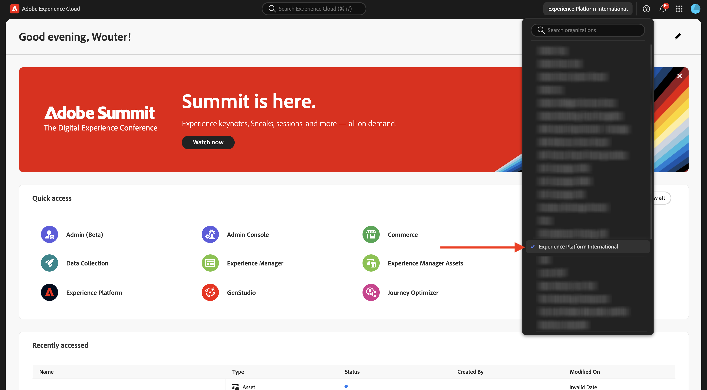
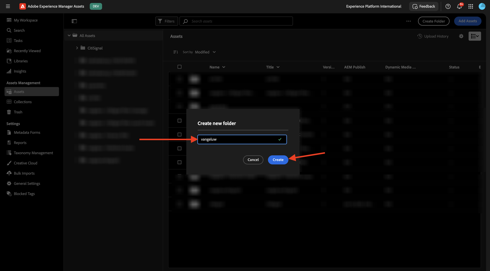

# 1.2.1 Erste Schritte mit AEM Assets

Navigieren Sie zu [https://experience.adobe.com/](https://experience.adobe.com/){target="_blank"}. Stellen Sie sicher, dass Sie sich in der richtigen Umgebung befinden, die `--aepImsOrgName--` benannt werden sollte.

Öffnen Sie **Adobe Experience Manager Assets**.

Wählen Sie die AEM Assets CS-Umgebung aus, die Ihnen zugewiesen ist. In diesem Fall ist die auszuwählende Umgebung `--aepUserLdap-- - CitiSignal dev author`.

Sie sollten das dann sehen. Zu **Assets**.

Sie sollten einen Ordner mit dem Namen `--aepUserLdap-- - CitiSignal Fiber Campaign` verwenden. Wenn es noch nicht vorhanden ist, klicken Sie auf **Ordner erstellen**.

Geben Sie den `--aepUserLdap--` für Ihren Ordner ein und klicken Sie auf **Erstellen**.

Öffnen Sie den neu erstellten Ordner. In einer der vorherigen Übungen haben Sie zwei Bilder erstellt, die `CitiSignal - Neon Rabbit - Get On Board Now!.png` und `CitiSignal - Neon Rabbit - Timetravel now!.png` heißen. Sie müssen diese Bilder jetzt in diesen Ordner hochladen, wenn sie noch nicht vorhanden sind.

Falls Sie diese Dateien nicht mehr haben, können Sie sie ([) &#x200B;](./images/CitiSignal_Neon_Rabbit.zip){target="_blank"}.

Klicken Sie **Assets hinzufügen**.

Wählen Sie die beiden oben genannten Bilder aus. Klicken Sie auf **Öffnen**.

Klicken Sie **Hochladen**.

Klicken Sie auf eines der Bilder, um es auszuwählen.

Klicken Sie auf **Details**.

Sie sehen jetzt die verfügbaren Metadaten der jeweiligen Datei.

Navigieren Sie im rechten Menü zu **Ausgabedarstellungen**. Anschließend sehen Sie eine Reihe vordefinierter Ausgabedarstellungen des ausgewählten Bildes mit der Möglichkeit, diese herunterzuladen.

Klicken Sie im rechten Menü auf das Symbol **Schere**. Es stehen eine Reihe von Bearbeitungsaktionen zur Verfügung, die von Adobe Express unterstützt werden. Klicken Sie **Hintergrund entfernen**.

Nach einigen Sekunden sollten Sie etwas Ähnliches sehen, mit der Möglichkeit, Ihre Änderungen entweder anzuwenden oder die neue Datei herunterzuladen. Schließen Sie das Popup.

Clip **Bild zuschneiden**.

Sie können einige Varianten verschiedener Zuschnittgrößen testen.

Gehen Sie im rechten Menü zu **Aufgaben**. Klicken Sie **Aufgaben zuweisen**.

Legen Sie den **Aufgabentitel** auf `Review image & approve` fest. Weisen Sie sich zu. Klicken Sie auf **Erstellen**.

Klicken Sie **der Benachrichtigung** Anzeigen“.

Aktualisieren Sie alternativ den Bildschirm, damit die neu erstellten Aufgaben in der Liste **Verwandte Aufgaben“ angezeigt**. Klicken Sie auf **Öffnen**, um die Details der Aufgabe anzuzeigen.

Sie sollten dann so etwas sehen. Klicken Sie **Genehmigen**.

Bestätigen Sie mit **Genehmigen**.

Ihr Asset ist jetzt in AEM Assets genehmigt.

Nächster Schritt: [Zusammenfassung und Vorteile](./summary.md){target="_blank"}

Zurück zu [Adobe Experience Manager Assets](./aemassets.md){target="_blank"}

[Zurück zu „Alle Module“](./../../../overview.md){target="_blank"}
