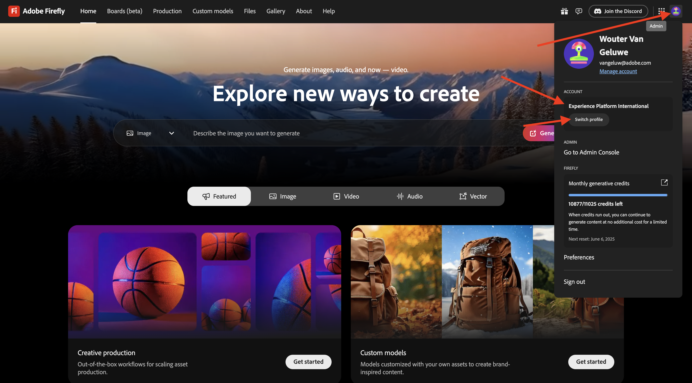
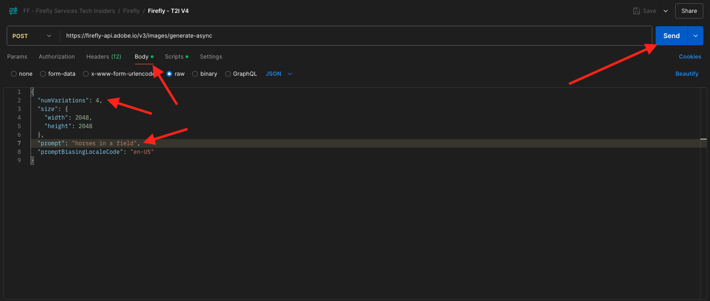
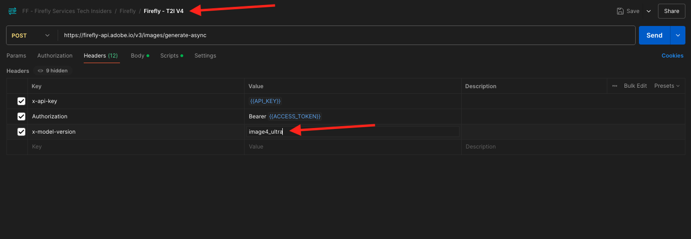

# 1.1.1 Erste Schritte mit Firefly Services

Erfahren Sie, wie Sie Postman und Adobe I/O verwenden, um Adobe Firefly Services-APIs abzufragen.

## Voraussetzungen für 1.1.1.1

Bevor Sie mit dieser Übung fortfahren, müssen Sie das Setup von [Ihr Adobe I/O-Projekt](./../../../modules/getting-started/gettingstarted/ex6.md) abgeschlossen haben. Außerdem müssen Sie eine Anwendung für die Interaktion mit APIs konfiguriert haben, z. B. [Postman](./../../../modules/getting-started/gettingstarted/ex7.md) oder [PostBuster](./../../../modules/getting-started/gettingstarted/ex8.md).

## 1.1.1.2 API-Grundlagen

Es gibt mehrere Arten von API-Anfragen:

- **GET**: Dies wird verwendet, wenn versucht wird, Informationen von einem API-Endpunkt abzurufen, z. B. wenn ein Statusbericht abgerufen wird
- **POST**: Dies wird verwendet, wenn etwas Neues getan werden muss, z. B. dass Adobe Firefly Services ein neues Bild generiert
- **PUT**: Damit werden vorhandene Daten vollständig aktualisiert
- **PATCH**: Damit werden bestehende Daten selektiv aktualisiert
- **DELETE**: Dies wird zum Löschen von Daten verwendet

Beim Arbeiten mit APIs werden Sie auch feststellen, dass von den verschiedenen API-Endpunkten Antwort-Codes zurückgegeben werden.

Es gibt 5 verschiedene Kategorien von Antworten, die Sie erwarten können:

- **1xx Informationsantwort**: Die Anfrage wurde empfangen, der Prozess wird fortgesetzt
- **2xx erfolgreich**: Die Anfrage wurde erfolgreich empfangen, verstanden und akzeptiert
- **3xx-Umleitung**: Es müssen weitere Maßnahmen ergriffen werden, um die Anfrage abzuschließen
- **4xx Client-Fehler**: Die Anfrage enthält eine fehlerhafte Syntax oder kann nicht ausgeführt werden
- **5xx Server-Fehler**: Der Server konnte eine scheinbar gültige Anfrage nicht erfüllen

Im Folgenden finden Sie ein Beispiel für häufig verwendete Antwort-Codes:

- **200 OK**: Diese Anfrage wurde erfolgreich abgeschlossen
- **201 Erstellt**: Dies ist gut. Beispielsweise wurde Ihr Bild erstellt
- **202 Akzeptiert**: Dies ist gut, Ihre Anfrage wird akzeptiert und verarbeitet
- **401 Nicht autorisiert**: Dies ist nicht gut, wahrscheinlich ist Ihr Zugriffs-Token ungültig
- **403 Verboten**: Dies ist nicht gut, Ihnen fehlen wahrscheinlich die erforderlichen Berechtigungen für die Aktion, die Sie ausführen möchten
- **404 Nicht gefunden**: Dies ist nicht gut, wahrscheinlich existiert die URL, die Sie erreichen möchten, nicht
- **429 Zu viele Anfragen**: Dies ist nicht gut, Sie haben wahrscheinlich in einem kurzen Zeitraum zu viele Anfragen gesendet. Versuchen Sie es später erneut.

## 1.1.1.3 Erkunden Sie firefly.adobe.com - Schritt 1

Beginnen wir mit der Erforschung von Adobe Firefly Services. Die Untersuchung beginnt mit einem Beispiel für die CitiSignal-Bilderstellung. Das CitiSignal-Designteam möchte eine Neonversion des CitiSignal-Markennamens generieren. Sie würden gerne Adobe Firefly Services nutzen, um das zu tun.

Das erste, was benötigt wird, um dies zu erreichen, ist eine Schwarz-Weiß-Version des CitiSignal Markennamen, etwas, das wie folgt aussieht:


### 1.1.1.3.1 Erstellen des Referenzbilds für die Komposition

Sie können [dieses Beispielbild](./images/CitiSignal.jpg) verwenden oder Ihren eigenen Text zum Experimentieren erstellen. Gehen Sie in Adobe Illustrator wie folgt vor, um Ihre eigene Bilddatei zu erstellen. Wenn Sie das vordefinierte Bild verwenden möchten, überspringen Sie den folgenden Abschnitt und fahren Sie direkt mit Schritt **1.1.1.2.2** Bild erstellen fort.

Öffnen Sie **Adobe Illustrator**. Klicken Sie auf **Neue Datei**.


Wählen Sie **Web-Large 1920 x 1080px**. Klicken Sie auf **Erstellen**.


Sie sollten dann diese haben. Klicken Sie auf das **T**-Textsymbol.


Sie sollten dann diese haben.


Ändern Sie den Schrifttyp in eine Schriftart Ihrer Wahl. In diesem Fall ist der Schrifttyp **Adobe Clean Bold**.


Ändern Sie die Schriftgröße in eine gewünschte Größe, in diesem Fall **250 pt**.


Sie sollten dann diese haben.


Ändern Sie den Text wie gewünscht, in diesem Fall **CitiSignal**.


Zentrieren Sie den Text in der Datei.


Navigieren Sie zu **Datei > Exportieren > Für Web speichern (alt)**


Sie sollten dann diese haben. Klicken Sie auf **Speichern**.


Benennen Sie Ihre Datei und speichern Sie sie auf Ihrem Desktop. Klicken Sie auf **Speichern**.


### 1.1.1.3.2 Bild erstellen

Navigieren Sie zu [https://firefly.adobe.com](https://firefly.adobe.com). Klicken Sie auf **Profil**-Symbol und stellen Sie sicher, dass Sie beim rechten **Konto** angemeldet sind, der `--aepImsOrgName--` werden sollte. Klicken Sie bei Bedarf auf **Profil wechseln**, um zu diesem Konto zu wechseln.



Geben Sie den `neon light lettering on a brick wall of a night club` ein. Klicken Sie **Generieren**.


Sie sollten dann etwas Ähnliches haben. Diese Bilder sind noch nicht nützlich. Klicken **unter** Komposition **auf „Bild hochladen**.


Wählen Sie das zuvor erstellte Bild aus, in diesem Fall &quot;**.jpg**. Klicken Sie auf **Öffnen** und dann auf **Generieren**.


Sie sollten dann etwas Ähnliches haben. Die Anwendung der Kompositionsreferenz ist noch nicht großartig. Um dies zu ändern, ändern Sie den **Stärke** auf den Maximalwert. Klicken Sie **erneut auf** Generieren“.


Sie haben jetzt mehrere Bilder, die eine Neonversion des CitiSignal-Markennamen zeigen, die Sie weiter durchlaufen können.


Sie haben jetzt gelernt, Firefly zu verwenden, um ein Design-Problem in wenigen Minuten zu lösen.

## 1.1.1.4 Erkunden Sie firefly.adobe.com - Schritt 2

Navigieren Sie zu [https://firefly.adobe.com/generate/image](https://firefly.adobe.com/generate/image). Sie sollten das dann sehen. Klicken Sie auf die **Modell** Dropdown-Liste. Sie werden feststellen, dass es 3 verfügbare Versionen von Adobe Firefly Services gibt:

- Firefly Image 3
- Firefly Image 4
- Firefly Image 4 Ultra


>[!NOTE]
>
>Firefly Image 3 und Image 4 sind für alle verfügbar, die Adobe Firefly Services verwenden, während Firefly Image 4 Ultra eine Firefly Pro-Lizenz erfordert.

Klicken Sie, um **Firefly Image 3** für diese Übung auszuwählen.


Geben Sie den `Horses in a field` ein und klicken Sie auf **Generieren**.


Sie sollten dann etwas Ähnliches sehen.


Öffnen Sie als Nächstes die **Entwickler-Tools** in Ihrem Browser.


Sie sollten das dann sehen. Wechseln Sie zur Registerkarte **Netzwerk**. Klicken Sie dann erneut **Generieren**.


Geben Sie den Suchbegriff &quot;**-async“**. Anschließend sollte eine Anfrage mit dem Namen &quot;**-async“**. Wählen Sie es aus und navigieren Sie **Payload**, wo Sie die Details der Anfrage sehen.


Die Anfrage, die Sie hier sehen, ist die Anfrage, die an das Server-seitige Backend von Firefly Services gesendet wird. Es enthält mehrere wichtige Parameter:

- **prompt**: Dies ist Ihre Eingabeaufforderung, in der Sie gefragt werden, welche Art von Bild Firefly generieren soll

- **seed**: Bei dieser Anfrage wurden die Testadressen nach dem Zufallsprinzip erzeugt. Wenn Firefly ein Bild generiert, beginnt der Prozess standardmäßig mit der Auswahl einer zufälligen Zahl, die als Seed bezeichnet wird. Diese zufällige Zahl trägt dazu bei, was jedes Bild einzigartig macht, was großartig ist, wenn Sie eine Vielzahl von Bildern generieren möchten. Es kann jedoch vorkommen, dass Sie Bilder generieren möchten, die über mehrere Anfragen hinweg einander ähnlich sind. Wenn Firefly beispielsweise ein Bild generiert, das Sie mit den anderen Optionen von Firefly ändern möchten (z. B. Stilvorgaben, Referenzbilder usw.), verwenden Sie den Seed dieses Bildes in zukünftigen HTTP-Anfragen, um die Zufälligkeit zukünftiger Bilder zu begrenzen und das gewünschte Bild zu präzisieren.


Sehen Sie sich die Benutzeroberfläche noch einmal an. Ändern Sie das **Seitenverhältnis** auf **Breitbild (16:9)**.


Scrollen Sie nach unten zu **Effekte**, gehen Sie zu **Designs** und wählen Sie einen Effekt wie **Art Deco** aus.


Stellen Sie sicher **dass** Entwickler-Tools“ noch in Ihrem Browser geöffnet ist. Klicken Sie dann auf **Generieren** und überprüfen Sie die gesendete Netzwerkanfrage.


Wenn Sie sich die Details der Netzwerkanfrage ansehen, sehen Sie Folgendes:

- **prompt** hat sich im Vergleich zur vorherigen Anfrage nicht geändert
- **Testadressen** haben sich im Vergleich zur vorherigen Anfrage geändert
- **size** hat sich geändert, basierend auf der Änderung im **Seitenverhältnis**.
- **styles** wurde hinzugefügt und verweist auf den ausgewählten **art_deco**-Effekt


Für die nächste Übung müssen Sie eine der **Seed** Zahlen verwenden. Notieren Sie sich eine Testnummer Ihrer Wahl.

>[!NOTE]
>
>Testadressen sind Zufallszahlen, die beim Klicken auf „Generieren **ausgewählt**. Wenn Sie ein einheitliches Erscheinungsbild für Ihr generiertes Bild über mehrere **Generate**-Anfragen hinweg wünschen, ist es wichtig, sich zu erinnern und die **Seed-Anzahl** in zukünftigen Anfragen anzugeben.

In der nächsten Übung machen Sie ähnliche Dinge mit Firefly Services, aber verwenden Sie dann die API anstelle der Benutzeroberfläche. In diesem Beispiel ist die Seed-Nummer für das erste Bild **142194**, das aus zwei Pferden besteht, die sich mit dem Kopf anschauen.

## 1.1.1.5 Adobe I/O - access_token

Wählen Sie in der Sammlung **Adobe IO - OAuth** die Anfrage mit dem Namen **POST - Zugriffstoken abrufen** und klicken Sie auf **Senden**. Die Antwort sollte ein neues &quot;**&quot;**.


## 1.1.1.6 Firefly Services-API, Text 2 Bild, Bild 3

Nachdem Sie nun über ein gültiges und neues Zugriffs-Token verfügen, können Sie Ihre erste Anfrage an Firefly Services-APIs senden.

Wählen Sie die Anfrage **POST - Firefly - T2I V3** aus der Sammlung **FF - Firefly Services Tech Insiders** aus. Wechseln Sie zum **Textkörper** und überprüfen Sie die Eingabeaufforderung. Klicken Sie auf **Senden**.

Die Anfrage, die Sie hier verwenden, ist eine **synchrone** Anfrage, die Ihnen innerhalb weniger Sekunden eine Antwort liefert, die das angeforderte Bild enthält.

>[!NOTE]
>
>Mit der Veröffentlichung von Firefly Image 4 und Image 4 Ultra werden synchrone Anfragen zugunsten asynchroner Anfragen eingestellt. Übungen zu asynchronen Anfragen finden Sie weiter unten in diesem Tutorial.


Kopieren Sie die Bild-URL aus der Antwort (oder klicken Sie darauf) und öffnen Sie sie in Ihrem Webbrowser, um das Bild anzuzeigen.


Sie sollten ein schönes Bild sehen, das `horses in a field` darstellt.


Fügen Sie im **Hauptteil** Ihrer Anfrage **POST - Firefly - T2I V3** Folgendes unter dem Feld `"promptBiasingLocaleCode": "en-US"` hinzu und ersetzen Sie die `XXX` durch eine der Seed-Nummern, die von der Firefly Services-Benutzeroberfläche zufällig verwendet wurden. In diesem Beispiel wird die **Seed**-Nummer `142194`.

```json
,
  "seeds": [
    XXX
  ]
```

Klicken Sie **Senden**. Sie erhalten dann eine Antwort mit einem neuen Bild, das von Firefly Services generiert wurde. Öffnen Sie das Bild, um es anzuzeigen.


Anschließend sollte ein neues Bild mit leichten Unterschieden angezeigt werden, das auf dem verwendeten **Seed** basiert. Die `142194` besaßen zwei Pferde, die sich mit dem Kopf anschauten.


Fügen Sie als Nächstes im **Hauptteil** Ihrer Anfrage **POST - Firefly - T2I V3** das folgende **styles**-Objekt unter das **seed**-Objekt ein. Dadurch wird der Stil des erzeugten Bildes in &quot;**_deco“**.

```json
,
  "contentClass": "art",
  "styles": {
    "presets": [
      "art_deco"
    ],
    "strength": 50
  }
```

Sie sollten dann diese haben. Klicken Sie auf **Senden**.


Klicken Sie auf die Bild-URL, um sie zu öffnen.


Ihr Bild hat sich jetzt etwas verändert. Beim Anwenden von Stilvorgaben wird das Seed-Bild nicht mehr auf die gleiche Weise wie zuvor angewendet. Insgesamt ist es bei generativer KI sehr schwer zu garantieren, dass dieselbe Kombination von Eingabeparametern dazu führt, dass dasselbe Bild generiert wird.


Entfernen Sie den Code für das **seed**-Objekt aus **body** Ihrer Anfrage. Klicken Sie **Senden** und dann auf die Bild-URL, die Sie aus der Antwort erhalten.

```json
,
  "seeds": [
    XXX
  ]
```


Ihr Bild hat sich jetzt wieder etwas verändert.


## 1.1.1.7 Firefly Services-API, Gen-Erweiterung

Wählen Sie die Anfrage **POST - Firefly - Gen Expand** aus der **FF - Firefly Services Tech Insiders**-Sammlung aus und navigieren Sie zum **Hauptteil** der Anfrage.

- **size**: Geben Sie die gewünschte Auflösung ein. Der hier eingegebene Wert sollte größer als die Originalgröße des Bildes sein und darf nicht größer als 3999 sein.
- **image.source.url**: Dieses Feld erfordert einen Link zu dem Bild, das erweitert werden muss. In diesem Beispiel wird eine Variable verwendet, um auf das in der vorherigen Übung generierte Bild zu verweisen.

- **horizontale Ausrichtung**: Akzeptierte Werte sind: `"center"`,`"left`, `"right"`.
- **Vertikale Ausrichtung**: Akzeptierte Werte sind: `"center"`,`"top`, `"bottom"`.


Klicken Sie auf die Bild-URL, die Teil der Antwort ist.


Sie sehen nun, dass das in der vorherigen Übung generierte Bild auf die Auflösung von 3999x3999 erweitert wurde.


Wenn Sie die Ausrichtung der Platzierung ändern, unterscheidet sich die Ausgabe ebenfalls geringfügig. In diesem Beispiel wird die Platzierung in &quot;**, unten“**. Klicken Sie auf **Senden** und dann auf , um die generierte Bild-URL zu öffnen.


Anschließend sollte man sehen, dass das Originalbild an einer anderen Stelle verwendet wird, was das gesamte Bild beeinflusst.


## 1.1.1.8 Firefly Services-API, Text 2 Bild, Bild 4 und Bild 4 Ultra

Mit der kürzlich veröffentlichten Version von Firefly Image Model 4 wurden mehrere Verbesserungen vorgenommen:

- Firefly Image Model 4 bietet 2K-Auflösungsausgabe mit verbesserter Auflösung und Detailgenauigkeit.
- Firefly Image Model 4 bietet signifikante Verbesserungen bei Text-Rendering, Menschen, Tieren und Architektur.
- Firefly Image Model 4 hält an Adobes Engagement für IP-freundliche, kommerziell sichere generative KI fest.

Mit Firefly Image Model 4 erhalten Sie außergewöhnliche Bilder von Menschen, Tieren und detaillierten Szenen. Mit Image Model 4 Ultra können Sie Bilder mit hyperrealistischen menschlichen Interaktionen, Architekturelementen und komplexen Landschaften erzeugen&#x200B;

### 1.1.1.8.1 image4_standard

Wählen Sie die Anfrage **POST - Firefly - T2I V4** aus der **FF - Firefly Services Tech Insiders**-Sammlung aus und navigieren Sie zu **Headers** der Anfrage.

Sie werden feststellen, dass sich die URL der Anfrage von der **Firefly Services-API, Text 2 Bild, Bild 3**-Anfrage unterscheidet, die **https://firefly-api.adobe.io/v3/images/generate** war. Diese URL verweist auf **https://firefly-api.adobe.io/v3/images/generate-async**. Das Hinzufügen von **-async** in der URL bedeutet, dass Sie den asynchronen Endpunkt verwenden.

In **Header**-Variablen fällt Ihnen eine neue Variable mit dem Namen **x-model-version** auf. Dies ist eine erforderliche Kopfzeile bei der Interaktion mit Firefly Image 4 und Image 4 Ultra. Um beim Generieren von Bildern Firefly Image 4 oder Image 4 Ultra zu verwenden, sollte der Wert der -Kopfzeile entweder auf `image4_standard` oder `image4_ultra` festgelegt werden. In diesem Beispiel verwenden Sie `image4_standard`.

Wenn Sie die **x-model-version** nicht auf `image4_standard` oder `image4_ultra` setzen, verwendet Firefly Services standardmäßig `image3`.


Navigieren Sie zum **Hauptteil** der Anfrage. Sie sollten sehen, dass im Hauptteil vier Bildvarianten angefordert werden. Die Eingabeaufforderung ist unverändert und fordert immer noch die Generierung von **Pferden auf einem Feld**. Klicken Sie auf **Senden**



Sie erhalten dann eine sofortige Antwort. Im Gegensatz zu den vorherigen synchronen Anfragen, die Sie verwendet haben, enthält diese Antwort keine Bild-URLs generierter Bilder. Er enthält eine URL des Statusberichts des von Ihnen ausgeführten Auftrags und eine weitere URL, mit der Sie den ausgeführten Auftrag abbrechen können.


Um den Statusbericht Ihres laufenden Auftrags zu überprüfen, wählen Sie die Anfrage mit dem Namen **GET - Firefly - Statusbericht abrufen** aus der Sammlung **FF - Firefly Services Tech Insiders** aus. Klicken Sie auf , um es zu öffnen, und klicken Sie dann auf **Senden**.


Anschließend wird der Statusbericht des gerade gestarteten Image-Generierungsvorgangs angezeigt. Überprüfen Sie das Feld **Status**, da es möglicherweise auf **Wird ausgeführt** festgelegt ist, was bedeutet, dass der Vorgang noch nicht abgeschlossen ist. In diesem Beispiel ist der Auftragsstatus auf **Erfolgreich** festgelegt, was bedeutet, dass die von Ihnen angeforderten Bilder generiert wurden.


Scrollen Sie in der Antwort etwas nach unten, und Sie sollten dann sehen, dass insgesamt 4 Bildvarianten von Adobe Firefly Services zurückgegeben werden. Klicken (oder kopieren) Sie die URL eines der Bilder und öffnen Sie sie in Ihrem Browser.


Dann sollte man ein hyperrealistisches Bild von **Pferden auf einem Feld** sehen.


### 1.1.1.8.2 image4_ultra

Kehren Sie zur Anfrage mit dem Namen **POST - Firefly - T2I V4** aus der **FF - Firefly Services Tech Insiders**-Sammlung zurück und navigieren Sie zu **Headers** der Anfrage.

Ändern Sie die Variable **x-model-version** in `image4_ultra`. In diesem Beispiel verwenden Sie `image4_standard`.



Navigieren Sie zum **Hauptteil** der Anfrage. Ändern Sie im Hauptteil die Anzahl der Bildvarianten in 1. Wie bei Firefly Image 4 Ultra kann nur 1 Bild gleichzeitig generiert werden. Die Eingabeaufforderung ist unverändert und fordert immer noch die Generierung von **Pferden auf einem Feld**. Klicken Sie auf **Senden**


Die Antwort enthält wiederum eine URL des Statusberichts des von Ihnen ausgeführten Auftrags und eine weitere URL, mit der Sie den ausgeführten Auftrag abbrechen können.


Um den Statusbericht Ihres laufenden Auftrags zu überprüfen, wählen Sie die Anfrage mit dem Namen **GET - Firefly - Statusbericht abrufen** aus der Sammlung **FF - Firefly Services Tech Insiders** aus. Klicken Sie auf , um es zu öffnen, und klicken Sie dann auf **Senden**.


Anschließend wird der Statusbericht des gerade gestarteten Image-Generierungsvorgangs angezeigt. Überprüfen Sie das Feld **Status**, da es möglicherweise auf **Wird ausgeführt** festgelegt ist, was bedeutet, dass der Vorgang noch nicht abgeschlossen ist. In diesem Beispiel ist der Auftragsstatus auf **Erfolgreich** festgelegt, was bedeutet, dass die von Ihnen angeforderten Bilder generiert wurden.


Dann sollte man ein hyperrealistisches Bild von **Pferden auf einem Feld** sehen.


## Nächste Schritte

Navigieren Sie zu [Optimieren Ihres Firefly-Prozesses mit Microsoft Azure und vordefinierten URLs](./ex2.md){target="_blank"}

Zurück zu [Übersicht über Adobe Firefly Services](./firefly-services.md){target="_blank"}

Zurück zu [Alle Module](./../../../overview.md){target="_blank"}
