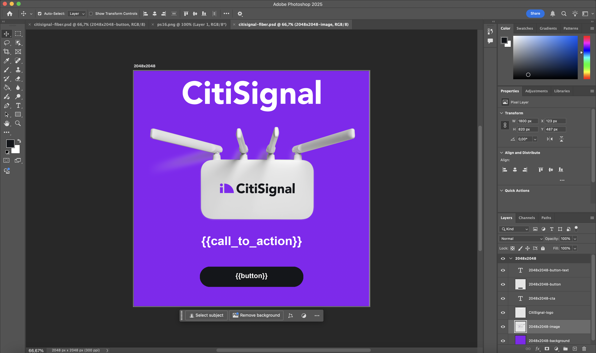
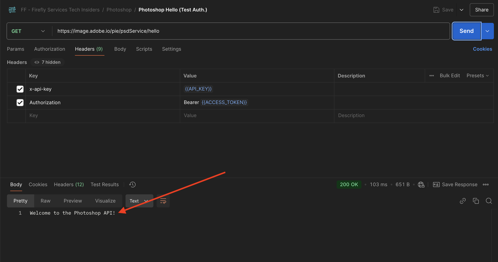
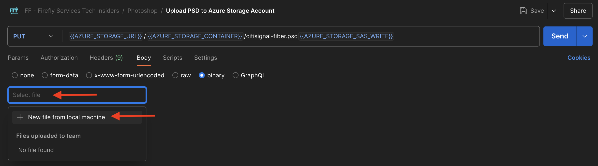
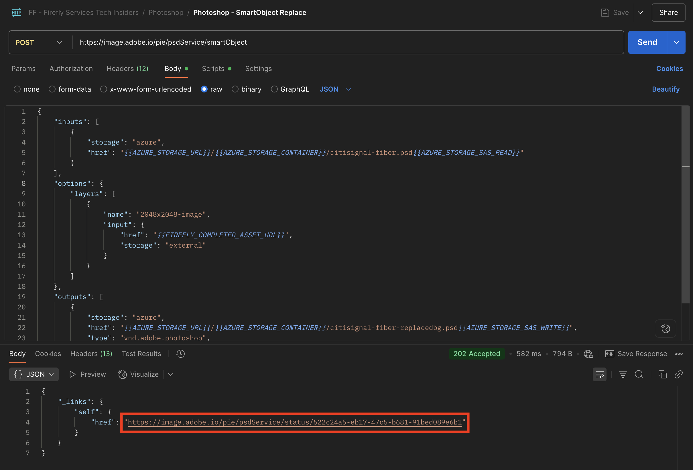

# 1.1.3 Arbeiten mit Photoshop-APIs

Erfahren Sie, wie Sie mit den Photoshop-APIs und Firefly Services arbeiten.

## Voraussetzungen für 1.1.3.1

Bevor Sie mit dieser Übung fortfahren, müssen Sie das Setup von [Ihr Adobe I/O-Projekt](./../../../modules/getting-started/gettingstarted/ex6.md) abgeschlossen haben. Außerdem müssen Sie eine Anwendung für die Interaktion mit APIs konfiguriert haben, z. B. [Postman](./../../../modules/getting-started/gettingstarted/ex7.md) oder [PostBuster](./../../../modules/getting-started/gettingstarted/ex8.md).

## 1.1.3.2 Adobe I/O - access_token

Wählen Sie in der Sammlung **Adobe IO - OAuth** die Anfrage mit dem Namen **POST - Zugriffstoken abrufen** und klicken Sie auf **Senden**. Die Antwort sollte ein neues &quot;**&quot;**.


## Programmgesteuerte Interaktion von 1.1.3.3 mit einer PSD-Datei

Laden Sie [Citisignal-fiber.psd](./../../../assets/ff/citisignal-fiber.psd){target="_blank"} auf Ihren Desktop herunter.

Öffnen Sie **Citisignal-fiber.psd** in Photoshop.



Im Bereich **Ebenen** hat der Designer der Datei jeder Ebene einen eindeutigen Namen gegeben. Sie können die Ebeneninformationen anzeigen, indem Sie die PSD-Datei in Photoshop öffnen. Sie können dies aber auch programmgesteuert tun.

Senden wir Ihre erste API-Anfrage an Photoshop-APIs.

### Photoshop-API - Hello World

Als Nächstes begrüßen wir Photoshop-APIs, um zu testen, ob alle Berechtigungen und der Zugriff richtig festgelegt sind.

Öffnen Sie in der Sammlung **Photoshop** die Anfrage **Photoshop Hello (Test Auth.)**. Wählen Sie **Senden** aus.


Sie sollten die Antwort erhalten &quot;**zur Photoshop-API!**.



Als Nächstes müssen Sie die PSD-Datei **Citisignal-fiber.psd** in Ihr -Speicherkonto hochladen, um programmatisch mit ihr zu interagieren. Sie können dies manuell tun, indem Sie es mit dem Azure Storage Explorer per Drag-and-Drop in Ihren Container ziehen. Diesmal sollten Sie es jedoch über die API tun.

### PSD in Azure hochladen

Öffnen Sie in Postman die Anfrage **PSD in Azure-Speicherkonto hochladen**. In der vorherigen Übung haben Sie diese Umgebungsvariablen in Postman konfiguriert, die Sie jetzt verwenden werden:

- `AZURE_STORAGE_URL`
- `AZURE_STORAGE_CONTAINER`
- `AZURE_STORAGE_SAS_READ`
- `AZURE_STORAGE_SAS_WRITE`

Wie Sie in der Anfrage **PSD in Azure-Speicherkonto hochladen** sehen können, ist die URL so konfiguriert, dass diese Variablen verwendet werden.


Wählen **in &quot;**&quot; die Datei **citsignal-fiber.psd** aus.



Ihr Bildschirm sollte wie folgt aussehen. Wählen Sie **Senden** aus.


Sie sollten diese leere Antwort von Azure zurückerhalten, was bedeutet, dass Ihre Datei in Ihrem Container in Ihrem Azure-Speicherkonto gespeichert ist.


Wenn Sie Azure Storage Explorer verwenden, um Ihre Datei zu überprüfen, müssen Sie Ihren Ordner aktualisieren.


### Photoshop-API - Manifest abrufen

Als Nächstes müssen Sie die Manifestdatei Ihrer PSD-Datei abrufen.

Öffnen Sie in Postman die Anfrage **Photoshop - PSD-Manifest abrufen**. Wechseln Sie zu **Textkörper**.

Der Textkörper sollte wie folgt aussehen:

```json
  {
    "inputs": [
      {
        "storage": "external",
        "href": "{{AZURE_STORAGE_URL}}/{{AZURE_STORAGE_CONTAINER}}/citisignal-fiber.psd{{AZURE_STORAGE_SAS_READ}}"
      }
    ],
    "options": {
      "thumbnails": {
        "type": "image/jpeg"
      }
    }
  }
```

Wählen Sie **Senden** aus.

In der Antwort wird jetzt ein Link angezeigt. Da es manchmal einige Zeit dauern kann, bis Vorgänge in Photoshop abgeschlossen sind, stellt Photoshop eine Statusdatei als Antwort auf die meisten eingehenden Anfragen bereit. Um zu verstehen, was mit Ihrer Anfrage passiert, müssen Sie die Statusdatei lesen.


Um die Statusdatei zu lesen, öffnen Sie die Anfrage **Photoshop - Get PS Status**. Sie können sehen, dass diese Anfrage eine Variable als URL verwendet. Dies ist eine Variable, die von der vorherigen Anfrage festgelegt wurde, die Sie gesendet haben: **Photoshop - PSD-Manifest abrufen**. Variablen werden in den **Skripten** jeder Anfrage festgelegt. Wählen Sie **Senden** aus.


Ihr Bildschirm sollte wie folgt aussehen. Derzeit ist der Status auf **Ausstehend** festgelegt, was bedeutet, dass der Prozess noch nicht abgeschlossen ist.


Wählen Sie Mehrere Male senden auf **Photoshop - PS-Status abrufen**, bis sich der Status auf &quot;**&quot;**. Dies kann einige Minuten dauern.

Wenn die Antwort verfügbar ist, können Sie sehen, dass die JSON-Datei Informationen zu allen Ebenen der PSD-Datei enthält. Dies ist eine nützliche Information, da Dinge wie der Ebenenname oder die Ebenenkennung identifiziert werden können.


Suchen Sie beispielsweise nach dem `2048x2048-cta`. Ihr Bildschirm sollte wie folgt aussehen:


### Photoshop-API - SmartObject-Ersetzung

Als Nächstes müssen Sie den Hintergrund der Datei „Citisignal-fiber.psd“ ändern, indem Sie das Bild verwenden, das Sie in einer der vorherigen Übungen mit Firefly generiert haben.

Öffnen Sie in Postman die Anfrage **Photoshop - SmartObject Replace** und navigieren Sie zu **body**.

Ihr Bildschirm sollte wie folgt aussehen:

- Zunächst wird eine Eingabedatei angegeben: `citisignal-fiber.psd`
- Zweitens wird die zu ändernde Ebene mit der neuen zu verwendenden Hintergrunddatei angegeben
- Drittens wird eine Ausgabedatei angegeben: `citisignal-fiber-replacedbg.psd`

```json
  {
    "inputs": [
        {
            "storage": "azure",
            "href": "{{AZURE_STORAGE_URL}}/{{AZURE_STORAGE_CONTAINER}}/citisignal-fiber.psd{{AZURE_STORAGE_SAS_READ}}"
        }
    ],
    "options": {
        "layers": [
            {
                "name": "2048x2048-image",
                "input": {
                    "href": "{{FIREFLY_COMPLETED_ASSET_URL}}",
                    "storage": "external"
                }
            }
        ]
    },
    "outputs": [
        {
            "storage": "azure",
            "href": "{{AZURE_STORAGE_URL}}/{{AZURE_STORAGE_CONTAINER}}/citisignal-fiber-replacedbg.psd{{AZURE_STORAGE_SAS_WRITE}}",
            "type": "vnd.adobe.photoshop",
            "overwrite": true
        }
    ]
}
```

Die Ausgabedatei hat einen anderen Namen, da die ursprüngliche Eingabedatei nicht überschrieben werden soll.

Wählen Sie **Senden** aus.


Wie zuvor enthält die Antwort einen Link, der auf die Statusdatei verweist, die den Fortschritt verfolgt.



Um die Statusdatei zu lesen, öffnen Sie die Anfrage **Photoshop - PS-Status abrufen** und wählen Sie **Senden**. Wenn der Status nicht sofort auf **Erfolgreich** festgelegt ist, warten Sie einige Sekunden und wählen Sie dann erneut **Senden** aus.

Wählen Sie die URL aus, um die Ausgabedatei herunterzuladen.


Öffnen Sie **citsignal-fiber-replaceBg.psd** nach dem Herunterladen der Datei auf Ihren Computer. Sie sollten sehen, dass sich das Hintergrundbild in ein ähnliches Bild wie unten gezeigt geändert hat:


Diese Datei wird auch in Ihrem Container mit dem Azure Storage-Explorer angezeigt.


### Photoshop-API - Text ändern

Als Nächstes müssen Sie den Text für die call to action mithilfe der APIs ändern.

Öffnen Sie in Postman die Anfrage **Photoshop - Text ändern** und navigieren Sie zu **Hauptteil**.

Ihr Bildschirm sollte wie folgt aussehen:

- Zunächst wird eine Eingabedatei angegeben: `citisignal-fiber-replacedbg.psd`. Dies ist die Datei, die im vorherigen Schritt generiert wurde, als Sie das Hintergrundbild geändert haben
- Zweitens wird die zu ändernde Ebene mit dem zu ändernden Text angegeben
- Drittens wird eine Ausgabedatei angegeben: `citisignal-fiber-changed-text.psd`

```json
  {
  "inputs": [
    {
      "storage": "external",
      "href": "{{AZURE_STORAGE_URL}}/{{AZURE_STORAGE_CONTAINER}}/citisignal-fiber-replacedbg.psd{{AZURE_STORAGE_SAS_READ}}"
    }
  ],
  "options": {
    "layers": [
      {
        "name": "2048x2048-cta",
        "text": {
          "content": "Get Fiber now!"
        }
      }
    ]
  },
  "outputs": [
    {
      "storage": "azure",
      "href": "{{AZURE_STORAGE_URL}}/{{AZURE_STORAGE_CONTAINER}}/citisignal-fiber-changed-text.psd{{AZURE_STORAGE_SAS_WRITE}}",
      "type": "vnd.adobe.photoshop",
      "overwrite": true
    }
  ]
}
```

Die Ausgabedatei hat einen anderen Namen, da die ursprüngliche Eingabedatei nicht überschrieben werden soll.

Wählen Sie **Senden** aus.


Wie zuvor enthält die Antwort einen Link, der auf die Statusdatei verweist, die den Fortschritt verfolgt.


Um die Statusdatei zu lesen, öffnen Sie die Anfrage **Photoshop - PS-Status abrufen** und wählen Sie **Senden**. Wenn der Status nicht sofort auf **Erfolgreich** festgelegt ist, warten Sie einige Sekunden und wählen Sie dann erneut **Senden** aus.

Wählen Sie die URL aus, um die Ausgabedatei herunterzuladen.


Öffnen Sie **citsignal-fiber-changed-text.psd** nach dem Herunterladen der Datei auf Ihren Computer. Sie sollten sehen, dass der Platzhalter für die call to action durch den Text &quot;**jetzt abrufen!** ersetzt wurde.


Diese Datei wird auch in Ihrem Container mit dem Azure Storage-Explorer angezeigt.


## Nächste Schritte

Zur [Firefly Custom Models-API](./ex4.md){target="_blank"}

Zurück zu [Übersicht über Adobe Firefly Services](./firefly-services.md){target="_blank"}

Zurück zu [Alle Module](./../../../overview.md){target="_blank"}