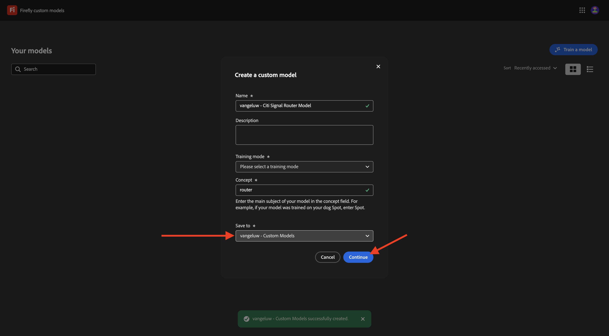
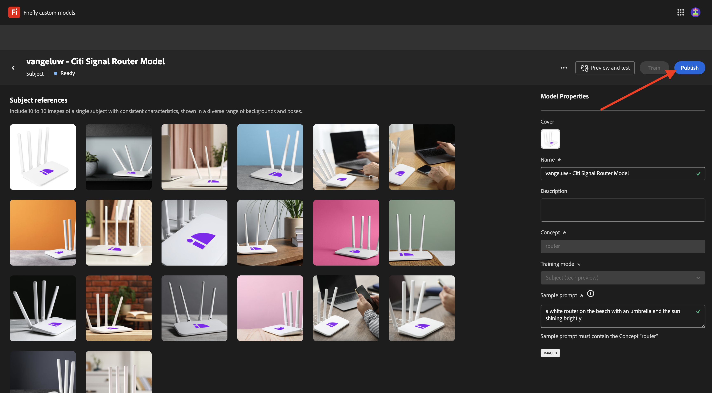
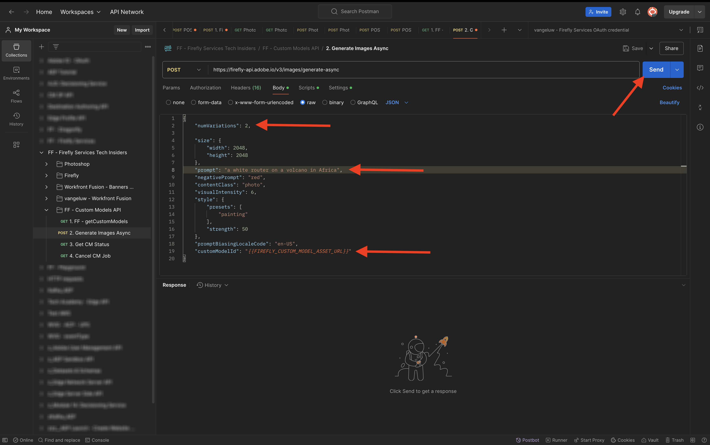

# 1.1.4 Firefly Custom Models-API

## Konfigurieren 1.1.4.1 benutzerdefinierten Modells

Navigieren Sie zu [https://firefly.adobe.com/](https://firefly.adobe.com/). Klicken Sie **Benutzerdefinierte Modelle**.

{zoomable="yes"}

Möglicherweise wird diese Meldung angezeigt. Klicken Sie in diesem Fall auf **Zustimmen**, um fortzufahren.

{zoomable="yes"}

Sie sollten das dann sehen. Klicken Sie **Modell trainieren**.

{zoomable="yes"}

Konfigurieren Sie die folgenden Felder:

- **Name**: `--aepUserLdap-- - Citi Signal Router Model` verwenden
- **Trainings-Modus**: Wählen Sie **Thema (technische Vorschau)**
- **Konzept**: `router` eingeben
- **Speichern unter**: Öffnen Sie die Dropdown-Liste und klicken Sie auf **+ Neues Projekt erstellen**

{zoomable="yes"}

Benennen Sie das neue Projekt wie folgt: `--aepUserLdap-- - Custom Models`. Klicken Sie auf **Erstellen**.

{zoomable="yes"}

Sie sollten das dann sehen. Klicken Sie auf **Erstellen**.

{zoomable="yes"}

Sie müssen jetzt die Referenzbilder für das zu trainierende benutzerdefinierte Modell bereitstellen. Klicken Sie **Bilder vom Computer auswählen**.

{zoomable="yes"}

Laden Sie die Referenzbilder [hier](https://tech-insiders.s3.us-west-2.amazonaws.com/CitiSignal_router.zip) herunter. Entpacken Sie die heruntergeladene Datei, die Ihnen dies geben sollte.

{zoomable="yes"}

Navigieren Sie zu dem Ordner, der die heruntergeladenen Grafikdateien enthält. Wählen Sie sie alle aus und klicken Sie auf **Öffnen**.

{zoomable="yes"}

Sie sehen dann, dass Ihre Bilder geladen werden.

{zoomable="yes"}

Nach einigen Minuten werden Ihre Bilder korrekt geladen. Möglicherweise sehen Sie, dass bei einigen Bildern ein Fehler auftritt. Dies liegt daran, dass die Bildbeschriftung nicht generiert wurde oder nicht lang genug ist. Überprüfen Sie jedes Bild mit einem Fehler und geben Sie eine Beschriftung ein, die die Anforderungen erfüllt und das Bild beschreibt.

{zoomable="yes"}

Sobald alle Bilder Beschriftungen haben, die den Anforderungen entsprechen, müssen Sie dennoch eine Eingabeaufforderung für ein Beispiel angeben. Geben Sie eine Eingabeaufforderung ein, die das Wort „Router“ enthält. Sobald Sie damit fertig sind, können Sie mit dem Training Ihres Modells beginnen. Klicken Sie **Trainieren**.

{zoomable="yes"}

Sie werden es dann sehen. Das Trainieren Ihres Modells kann 20-30 Minuten oder länger dauern.

{zoomable="yes"}

Nach 20-30 Minuten ist Ihr Modell jetzt trainiert und kann veröffentlicht werden. Klicken Sie auf **Veröffentlichen**.

{zoomable="yes"}

Klicken **erneut auf** Veröffentlichen“.

{zoomable="yes"}

Schließen Sie das Popup **Benutzerdefiniertes Modell freigeben**.

{zoomable="yes"}

## 1.1.4.2 Benutzerdefiniertes Modell in der Benutzeroberfläche verwenden

Navigieren Sie zu [https://firefly.adobe.com/cme/train](https://firefly.adobe.com/cme/train). Klicken Sie auf das benutzerdefinierte Modell, um es zu öffnen.

{zoomable="yes"}

Klicken Sie **Vorschau und Test**.

{zoomable="yes"}

Anschließend sehen Sie die Beispielaufforderung, die Sie vor der Ausführung eingegeben haben.

{zoomable="yes"}

## 1.1.4.3 Benutzerdefiniertes Modell für die Firefly Services-API für benutzerdefinierte Modelle aktivieren

Sobald Ihr benutzerdefiniertes Modell trainiert wurde, kann es auch über die API verwendet werden. In Übung 1.1.1 haben Sie Ihr Adobe I/O-Projekt bereits für die Interaktion mit Firefly Services über die API konfiguriert.

Navigieren Sie zu [https://firefly.adobe.com/cme/train](https://firefly.adobe.com/cme/train). Klicken Sie auf das benutzerdefinierte Modell, um es zu öffnen.

{zoomable="yes"}

Klicken Sie auf die 3 Punkte **…** und dann auf **Freigeben**.

{zoomable="yes"}

Um auf ein benutzerdefiniertes Firefly-Modell zugreifen zu können, muss das benutzerdefinierte Modell für die **ID des technischen Kontos** unseres Adobe I/O-Projekts freigegeben werden.

Um Ihre **ID des technischen Kontos** abzurufen, navigieren Sie zu [https://developer.adobe.com/console/projects](https://developer.adobe.com/console/projects). Klicken Sie, um Ihr Projekt mit dem Namen `--aepUserLdap-- Firefly` zu öffnen.

{zoomable="yes"}

Klicken Sie **OAuth Server-zu-Server**.

{zoomable="yes"}

Klicken Sie, um Ihre **ID des technischen Kontos** zu kopieren.

{zoomable="yes"}

Fügen Sie Ihre **ID des technischen Kontos** ein und klicken Sie auf **Zum Bearbeiten einladen**.

{zoomable="yes"}

Die **ID des technischen Kontos** sollte jetzt in der Lage sein, auf das benutzerdefinierte Modell zuzugreifen.

{zoomable="yes"}

## Interaktion 1.1.4.4 Firefly Services mit der API für benutzerdefinierte Modelle

In Übung 1.1.1 Erste Schritte mit Firefly Services haben Sie diese Datei ([postman-ff.zip](./../../../assets/postman/postman-ff.zip) auf Ihren lokalen Desktop heruntergeladen und anschließend diese Sammlung in Postman importiert.

Öffnen Sie Postman und wechseln Sie zum Ordner **FF - Custom Models API**.

{zoomable="yes"}

Öffnen Sie die Anfrage **1. FF - getCustomModels** und klicken Sie auf **Senden**.

{zoomable="yes"}

Sie sollten das zuvor erstellte benutzerdefinierte Modell, das `--aepUserLdap-- - Citi Signal Router Model` heißt, als Teil der Antwort sehen. Das Feld **assetId** ist die eindeutige Kennung Ihres benutzerdefinierten Modells, auf die bei der nächsten Anfrage verwiesen wird.

{zoomable="yes"}

Öffnen Sie die Anfrage **2. Bilder asynchron**. In diesem Beispiel fordern Sie zwei Varianten an, die auf Ihrem benutzerdefinierten Modell basieren. Sie können die Eingabeaufforderung aktualisieren, die in diesem Fall `a white router on a volcano in Africa` ist.

Klicken Sie auf **Senden**.

{zoomable="yes"}

Die Antwort enthält ein Feld **jobId**. Der Vorgang zum Generieren dieser beiden Bilder wird jetzt ausgeführt und Sie können den Status mit der nächsten Anfrage überprüfen.

{zoomable="yes"}

Öffnen Sie die Anfrage **3. CM-Status abrufen** auf **Senden** klicken. Anschließend sollten Sie sehen, dass der Status auf WIRD AUSGEFÜHRT steht.

{zoomable="yes"}

Klicken Sie nach einigen Minuten erneut **Senden** für die Anfrage **3. CM-Status**. Anschließend sollten Sie sehen, dass der Status in **Erfolgreich** geändert wurde, und Sie sollten zwei Bild-URLs als Teil der Ausgabe sehen. Klicken, um beide Dateien zu öffnen.

{zoomable="yes"}

Dies ist das erste Bild, das in diesem Beispiel generiert wurde.

{zoomable="yes"}

Dies ist das zweite Bild, das in diesem Beispiel generiert wurde.

{zoomable="yes"}

Sie haben jetzt diese Übung abgeschlossen.

## Nächste Schritte

Wechseln Sie zu [Zusammenfassung und Vorteile](./summary.md){target="_blank"}

Kehren Sie zurück zu [Arbeiten mit Photoshop-APIs](./ex3.md){target="_blank"}

Zurück zu [Übersicht über Adobe Firefly Services](./firefly-services.md){target="_blank"}
