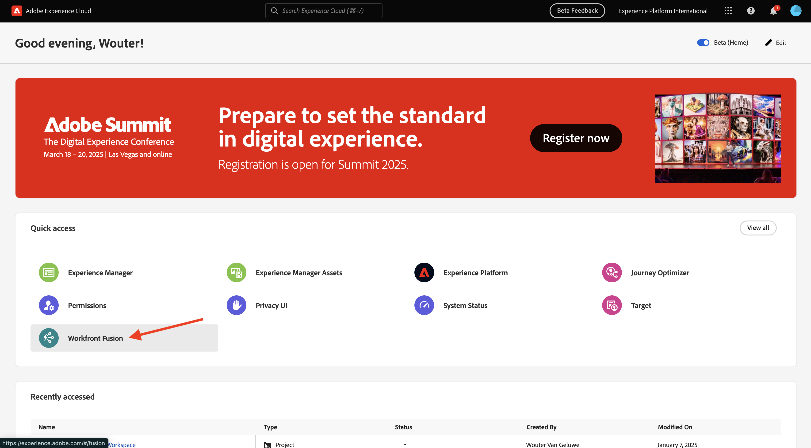
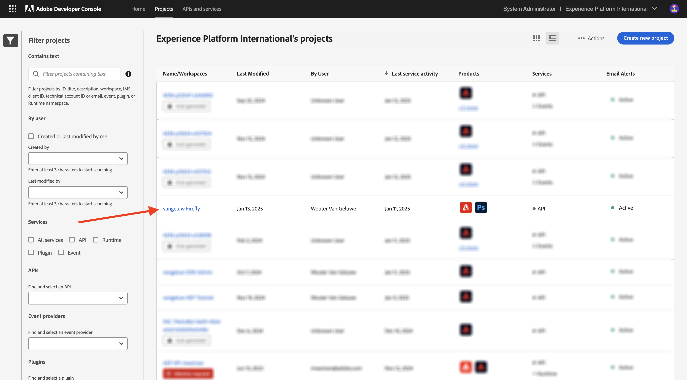

# 1.2.1 Erste Schritte mit Workfront Fusion

Erfahren Sie, wie Sie Workfront Fusion und Adobe I/O verwenden, um Adobe Firefly Services-APIs abzufragen.

## 1.2.1.1 Neues Szenario erstellen

1. Navigieren Sie zu [https://experience.adobe.com/](https://experience.adobe.com/). Öffnen Sie **Workfront Fusion**.

   

1. Navigieren Sie zu **Szenarien**.

   

1. Wählen Sie **Neues Szenario erstellen** aus.

   

1. Benennen Sie den Ordner `--aepUserLdap--` und wählen Sie **Speichern**.

   

1. Wählen Sie den Ordner aus und klicken Sie auf **Neues Szenario erstellen**.

   

1. Ein leeres Szenario wird angezeigt, wählen Sie **Tools** und dann **Mehrere Variablen festlegen** aus.

   

1. Verschieben Sie das **Uhr**-Symbol auf das neu hinzugefügte **Mehrere Variablen festlegen**.

   

   Ihr Bildschirm sollte wie folgt aussehen.

   

1. Klicken Sie mit der rechten Maustaste auf das Fragezeichen und wählen Sie **Modul löschen**.

   

1. Klicken Sie anschließend mit der rechten Maustaste auf **Mehrere Variablen festlegen** und wählen Sie **Einstellungen** aus.

   

## 1.2.1.2 Konfigurieren der Adobe I/O-Authentifizierung

Jetzt müssen Sie die Variablen konfigurieren, die zur Authentifizierung bei Adobe I/O erforderlich sind. In der vorherigen Übung haben Sie ein Adobe I/O-Projekt erstellt. Die Variablen dieses Adobe I/O-Projekts müssen jetzt in Workfront Fusion definiert werden.

Die folgenden Variablen müssen definiert werden:

| Schlüssel | Wert |
|:-------------:| :---------------:| 
| `CONST_client_id` | Ihre Adobe I/O-Projekt-Client-ID |
| `CONST_client_secret` | Ihr Adobe I/O-Projekt - Client-Geheimnis |
| `CONST_scope` | Ihr Adobe I/O-Projektumfang |

1. Suchen Sie diese Variablen, indem Sie zu [https://developer.adobe.com/console/projects wechseln ](https://developer.adobe.com/console/projects) Ihr Adobe I/O-Projekt mit dem Namen `--aepUserLdap-- Firefly` öffnen.

   

1. Wählen Sie in Ihrem Projekt **OAuth Server-zu-Server** aus, um die Werte für die oben genannten Schlüssel anzuzeigen.

   

1. Mithilfe der oben genannten Schlüssel und Werte können Sie das Objekt **Mehrere Variablen festlegen** konfigurieren. Wählen Sie **Element hinzufügen** aus.

   

1. Geben Sie den **Variablennamen**: **CONST_CLIENT_ID** und **Variablenwert** ein und wählen Sie **Hinzufügen**.

   

1. Wählen Sie **Element hinzufügen** aus.

   

1. Geben Sie **Variablenname**: **CONST_CLIENT_SECRET** und **Variablenwert** ein und wählen Sie **Hinzufügen**.

   

1. Wählen Sie **Element hinzufügen** aus.

   

1. Geben Sie **Variablenname**: **CONST_scope** und den **Variablenwert** ein und wählen Sie **Hinzufügen**.

   

1. Klicken Sie **OK**.

   

1. Bewegen Sie den Mauszeiger über **Mehrere Variablen festlegen** und wählen Sie das große **+**-Symbol aus, um ein weiteres Modul hinzuzufügen.

   

   Ihr Bildschirm sollte wie folgt aussehen.

   

1. Geben Sie in der Suchleiste &quot;**&quot;**. Wählen Sie **HTTP** aus, um es zu öffnen.

   

1. Wählen Sie **Anfrage stellen** aus.

   

   | Schlüssel | Wert |
   |:-------------:| :---------------:| 
   | `URL` | `https://ims-na1.adobelogin.com/ims/token/v3` |
   | `Method` | `POST` |
   | `Body Type` | `x-www-form-urlencoded` |

1. Wählen Sie **Element hinzufügen** aus.

   

1. Fügen Sie Elemente für jeden der folgenden Werte hinzu:

   | Schlüssel | Wert |
   |:-------------:| :---------------:| 
   | `client_id` | Ihre vordefinierte Variable für `CONST_client_id` |
   | `client_secret` | Ihre vordefinierte Variable für `CONST_client_secret` |
   | `scope` | Ihre vordefinierte Variable für `CONST_scope` |
   | `grant_type` | `client_credentials` |

1. Konfiguration für `client_id`:

   

1. Konfiguration für `client_secret`.

   

1. Konfiguration für `scope`.

   

1. Konfiguration für `grant_type`.

   

1. Scrollen Sie nach unten und aktivieren Sie das Kontrollkästchen für **Antwort analysieren**. Klicken Sie **OK**.

   

1. Ihr Bildschirm sollte wie folgt aussehen. Wählen Sie **Einmal ausführen** aus.

   

   Nach Ausführung des Szenarios sollte Ihr Bildschirm wie folgt aussehen:

   

1. Wählen Sie das **Fragezeichen** auf dem Objekt **Mehrere Variablen festlegen** um zu sehen, was bei der Ausführung dieses Objekts passiert ist.

   

1. Wählen Sie das Symbol **Fragezeichen** auf dem Objekt **HTTP -** erstellen) aus, um zu sehen, was bei der Ausführung dieses Objekts passiert ist. In **OUTPUT** wird das **access_token** von Adobe I/O zurückgegeben.

   

1. Bewegen Sie den Mauszeiger über **HTTP - Eine Anfrage stellen** und wählen Sie das Symbol **+** aus, um ein weiteres Modul hinzuzufügen.

   

1. Suchen Sie in der Suchleiste nach `tools`. Wählen Sie **Tools** aus.

   

1. Wählen Sie **Mehrere Variablen festlegen** aus.

   

1. Wählen Sie **Element hinzufügen** aus.

   

1. Legen Sie **Variablenname** auf `bearer_token` fest. Wählen Sie `access_token` als dynamischen **Variablenwert**. Wählen Sie **Hinzufügen** aus.

   

1. Ihr Bildschirm sollte wie folgt aussehen. Klicken Sie **OK**.

   

1. Wählen **erneut** Einmal ausführen“ aus.

   

1. Wählen Sie nach Ausführung des Szenarios das Symbol **Fragezeichen** im letzten Objekt **Mehrere Variablen festlegen** aus. Sie sollten sehen, dass das Zugriffstoken in der Variablen `bearer_token` gespeichert wird.

   

1. Klicken Sie anschließend mit der rechten Maustaste auf das erste Objekt **Mehrere Werte festlegen** und wählen Sie **Umbenennen**.

   

1. Legen Sie den Namen auf **Initialisierungskonstanten** fest. Klicken Sie **OK**.

   

1. Benennen Sie das zweite Objekt um **Authentifizieren bei Adobe I/O**. Klicken Sie **OK**.

   

1. Benennen Sie das dritte Objekt in &quot;**-Token“**. Klicken Sie **OK**.

   

   Ihr Bildschirm sollte wie folgt aussehen:

   

1. Ändern Sie als Nächstes den Namen Ihres Szenarios in `--aepUSerLdap-- - Adobe I/O Authentication`.

   

1. Wählen Sie **Speichern** aus.

   

## Nächste Schritte

Navigieren Sie zu [Verwenden von Adobe-APIs in Workfront Fusion](./ex2.md){target="_blank"}

Zurück zu [Automatisieren von Adobe Firefly-Services](./automation.md){target="_blank"}

Zurück zu [Alle Module](./../../../overview.md){target="_blank"}
