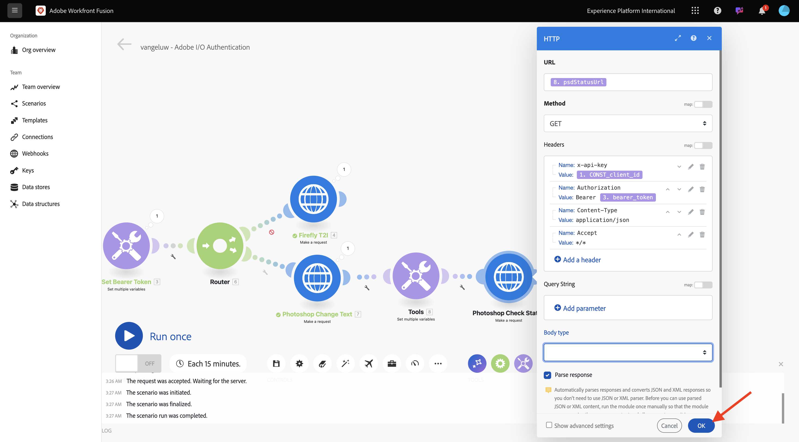
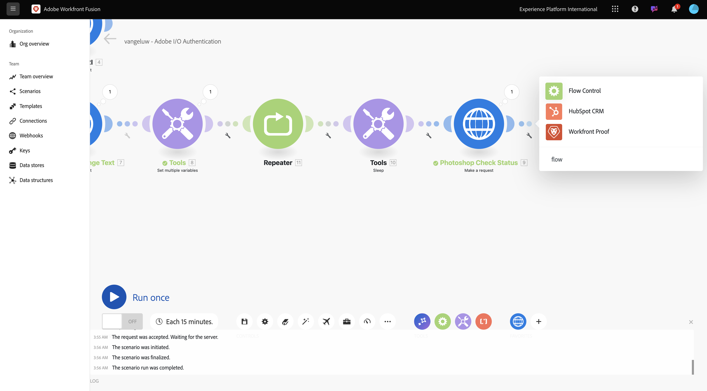

# 1.2.2 Verwenden von Adobe-APIs in Workfront Fusion

Erfahren Sie, wie Sie Adobe-APIs in Workfront Fusion verwenden.

## Verwenden 1.2.2.1 Firefly Text-to-Image-API mit Workfront Fusion

Bewegen Sie den Mauszeiger über den zweiten **mehrere Variablen festlegen**-Knoten und wählen Sie **+** aus, um ein weiteres Modul hinzuzufügen.


Suchen Sie nach **http** und wählen Sie **HTTP** aus.


Wählen Sie **Anfrage stellen** aus.


Wählen Sie diese Variablen aus:

- **URL**: `https://firefly-api.adobe.io/v3/images/generate`
- **Methode**: `POST`

Wählen Sie **hinzufügen einer Kopfzeile** aus.


Geben Sie die folgenden Kopfzeilen ein:

| Schlüssel | Wert |
|:-------------:| :---------------:| 
| `x-api-key` | Ihre gespeicherte Variable für `CONST_client_id` |
| `Authorization` | `Bearer ` + Ihre gespeicherte Variable für `bearer_token` |
| `Content-Type` | `application/json` |
| `Accept` | `*/*` |

Geben Sie die Details für `x-api-key` ein. Wählen Sie **Hinzufügen** aus.


Wählen Sie **Kopfzeile hinzufügen**.


Geben Sie die Details für `Authorization` ein. Wählen Sie **Hinzufügen** aus.


Wählen Sie **Kopfzeile hinzufügen**. Geben Sie die Details für `Content-Type` ein. Wählen Sie **Hinzufügen** aus.


Wählen Sie **Kopfzeile hinzufügen**. Geben Sie die Details für `Accept` ein. Wählen Sie **Hinzufügen** aus.


Legen Sie **Body-Typ** auf **Raw** fest. Wählen **für &quot;**&quot; die Option **JSON (application/json)**.


Fügen Sie diese Payload in das Feld **Inhalt anfragen** ein.

```json
{
	"numVariations": 1,
	"size": {
		"width": 2048,
      "height": 2048
    },
    "prompt": "Horses in a field",
    "promptBiasingLocaleCode": "en-US"
}
```

Aktivieren Sie das Kontrollkästchen für **Antwort analysieren**. Klicken Sie **OK**.


Wählen Sie **Einmal ausführen** aus.


Ihr Bildschirm sollte wie folgt aussehen.


Wählen Sie das **Symbol ?,** auf dem vierten Knoten, HTTP, um die Antwort anzuzeigen. In der Antwort sollte ein Grafikdatei angezeigt werden.


Kopie das Bild URL und öffnen Sie es in einem Browser-Fenster. Ihr Bildschirm sollte liken diesem aussehen:


Klicken Sie mit der rechten Maustaste **HTTP** und benennen Sie in **Firefly T2I** um.


Wählen Sie **Speichern** aus, um die Änderungen zu speichern.


## 1.2.2.2 Verwenden Photoshop-API mit Workfront Fusion

Wählen Sie **wrench** zwischen den Knoten **Set Bearer Token** und **Firefly T2I**. Wählen Sie **Router hinzufügen**.


Klicken Sie mit der rechten Maustaste auf das **Firefly T2I**-Objekt und wählen Sie **Klonen**.


Ziehen Sie das geklonte Objekt in die Nähe des **Router**-Objekts - es stellt automatisch eine Verbindung zum **her**. Ihr Bildschirm sollte wie folgt aussehen:


Sie verfügen jetzt über eine identische Kopie basierend auf der **Firefly T2I**-HTTP-Anfrage. Einige der Einstellungen der **Firefly T2I**-HTTP-Anfrage ähneln denen, die Sie für die Interaktion mit der **Photoshop-API** benötigen, was eine Zeitersparnis darstellt. Jetzt müssen Sie nur noch die Variablen ändern, die nicht identisch sind, wie die Anfrage-URL und die Payload.

Ändern Sie die **URL** in `https://image.adobe.io/pie/psdService/text`.


Ersetzen **Anfrageinhalt** durch die folgende Payload:

```json
  {
    "inputs": [
      {
        "storage": "external",
        "href": "{{AZURE_STORAGE_URL}}/{{AZURE_STORAGE_CONTAINER}}/citisignal-fiber.psd{{AZURE_STORAGE_SAS_READ}}"
      }
    ],
    "options": {
      "layers": [
        {
          "name": "2048x2048-button-text",
          "text": {
            "content": "Click here"
          }
        },
        {
          "name": "2048x2048-cta",
          "text": {
            "content": "Buy this stuff"
          }
        }
      ]
    },
    "outputs": [
      {
        "storage": "azure",
        "href": "{{AZURE_STORAGE_URL}}/{{AZURE_STORAGE_CONTAINER}}/citisignal-fiber-changed-text.psd{{AZURE_STORAGE_SAS_WRITE}}",
        "type": "vnd.adobe.photoshop",
        "overwrite": true
      }
    ]
  }
```


Damit dieser **Anfrageinhalt** ordnungsgemäß funktioniert, fehlen einige Variablen:

- `AZURE_STORAGE_URL`
- `AZURE_STORAGE_CONTAINER`
- `AZURE_STORAGE_SAS_READ`
- `AZURE_STORAGE_SAS_WRITE`

Gehen Sie zurück zu Ihrem ersten Knoten, wählen Sie **Konstanten initialisieren** und wählen Sie dann **Element hinzufügen** für jede dieser Variablen aus.


| Schlüssel | Beispiel Wert |
|:-------------:| :---------------:| 
| `AZURE_STORAGE_URL` | `https://vangeluw.blob.core.windows.net` |
| `AZURE_STORAGE_CONTAINER` | `vangeluw` |
| `AZURE_STORAGE_SAS_READ` | `?sv=2023-01-03&st=2025-01-13T07%3A36%3A35Z&se=2026-01-14T07%3A36%3A00Z&sr=c&sp=rl&sig=4r%2FcSJLlt%2BSt9HdFdN0VzWURxRK6UqhB8TEvbWkmAag%3D` |
| `AZURE_STORAGE_SAS_WRITE` | `?sv=2023-01-03&st=2025-01-13T17%3A21%3A09Z&se=2025-01-14T17%3A21%3A09Z&sr=c&sp=racwl&sig=FD4m0YyyqUj%2B5T8YyTFJDi55RiTDC9xKtLTgW0CShps%3D` |

Sie können Ihre Variablen suchen, indem Sie zu Postman zurückkehren und Ihren **Umgebung Variablen** öffnen.


Kopie diese Werte an Workfront Fusion weiter, und fügen Sie für jede dieser 4 Variablen ein neues Element hinzu.

Ihr Bildschirm sollte liken diesem aussehen. Klicken Sie **OK**.


Kehren Sie anschließend zur geklonten HTTP-Anfrage zurück, um den **Anfrageinhalt** zu aktualisieren. Beachten Sie die schwarzen Variablen im **Anfrageinhalt**. Dies sind die Variablen, die Sie aus Postman kopiert haben. Sie müssen zu den Variablen wechseln, die Sie gerade in Workfront Fusion definiert haben. Ersetzen Sie jede Variable einzeln, indem Sie den schwarzen Text löschen und durch die richtige Variable ersetzen.


Nehmen Sie diese 3 Änderungen im Abschnitt **Eingaben** vor. Klicken Sie **OK**.


Nehmen Sie diese 3 Änderungen im Abschnitt **Ausgänge** vor. Klicken Sie **OK**.


Klicken Sie mit der rechten Maustaste auf den geklonten Knoten und wählen Sie **Umbenennen**. Ändern Sie den Namen in **Photoshop-Änderungstext**.


Ihr Bildschirm sollte wie folgt aussehen:


Wählen Sie **Einmal ausführen** aus.


Wählen Sie das **search**-Symbol im Knoten **Photoshop-** aus, um die Antwort anzuzeigen. Sie sollten über eine Antwort verfügen, die wie folgt aussieht, mit einem Link zu einer Statusdatei.


Deaktivieren Sie vor dem Fortsetzen der Photoshop-API-Interaktionen die Route zum **Firefly T2I**-Knoten, um nicht benötigte API-Aufrufe an diesen API-Endpunkt zu senden. Wählen Sie das **Schraubenschlüssel**-Symbol aus und wählen Sie dann **Route deaktivieren**.


Ihr Bildschirm sollte wie folgt aussehen:


Fügen Sie als Nächstes einen weiteren Knoten **Mehrere Variablen festlegen** hinzu.


Platzieren Sie sie nach dem Knoten **Photoshop-**:


Wählen Sie die **Festlegen mehreren Variablen** Knoten und wählen Sie Element hinzufügen **aus**. Wählen Sie den Variable Wert aus der Antwort des vorherigen Anfrage aus.

| Variablenname | Variablenwert |
|:-------------:| :---------------:| 
| `psdStatusUrl` | `data > _links > self > href` |

Wählen Sie **Hinzufügen** aus.


Klicken Sie **OK**.


Klicken Sie mit der rechten Maustaste auf das **Photoshop ändern Text** Knoten und wählen Sie Klonen **aus**.


Ziehen Sie die geklonte HTTP-Anfrage hinter die Festlegen mehreren Variablen **, die** Sie soeben erstellt Knoten.


Klicken Sie mit der rechten Maustaste auf die geklonte HTTP-Anfrage, wählen Sie **Umbenennen** und ändern Sie den Namen in **Photoshop-Prüfungsstatus**.


Wählen Sie aus, um die HTTP-Anfrage zu öffnen. Ändern Sie die URL so, dass sie auf die Variable verweist, die Sie im vorherigen Schritt erstellt haben, und setzen Sie **Methode** auf **GET**.


Entfernen Sie den **Hauptteil**, indem Sie die leere Option auswählen.


Klicken Sie **OK**.



Wählen Sie **Einmal ausführen** aus.


Eine Antwort, die das Feld **status** mit dem Status **running“**. Photoshop braucht einige Sekunden, um den Vorgang abzuschließen.


Da Sie nun wissen, dass die Antwort etwas mehr Zeit benötigt, um abgeschlossen zu werden, kann es eine gute Idee sein, vor dieser HTTP-Anfrage einen Timer hinzuzufügen, damit sie nicht sofort ausgeführt wird.

Wählen Sie den Knoten **Tools** und dann **Sleep** aus.


Positionieren Sie den **Sleep**-Knoten zwischen **Mehrere Variablen festlegen** und **Photoshop-**. Festlegen die **Verzögerung** auf **5** Sekunden. Klicken Sie **OK**.


Ihr Bildschirm sollte liken diesem aussehen. Die Herausforderung bei der folgenden Konfiguration besteht darin, dass 5 Sekunden Wartezeit ausreichen können, aber vielleicht nicht ausreichen. In Wirklichkeit wäre es besser, eine intelligentere Lösung zu haben, liken eine... while-Schleife, die den Status alle 5 Sekunden überprüft, **bis der Status erfolgreich ist**. Sie können also eine solche Taktik in den nächsten Schritten implementieren.


Wählen Sie das **Schraubenschlüssel**-Symbol zwischen **Mehrere Variablen festlegen** und **Schlaf** aus. Wählen Sie **Modul hinzufügen** aus.


Suchen Sie nach `flow` und wählen Sie **Flusssteuerung** aus.


Wählen Sie **Repeater** aus.


Setzen Sie **repeat** auf **20**. Klicken Sie **OK**.


Wählen Sie als Nächstes **+** auf der **Photoshop-** aus, um ein weiteres Modul hinzuzufügen.


Search für **den Fluss** und wählen Sie **&quot;Fluss Control**&quot;.



Wählen Sie **Array Aggregator** aus.


**Festlegen Quelle Modul** an Repeater **&#x200B;**. Wählen Sie **OK**.


Ihr Bildschirm sollte liken diesem aussehen:


Wählen Sie das **Schraubenschlüsselsymbol** aus und wählen Sie hinzufügen **eine Modul**.


Suchen Sie nach **tools** und wählen Sie **Tools** aus.


Wählen Sie **Mehrere Variablen abrufen**.


Wählen Sie **+ Element hinzufügen** und setzen Sie **Variablenname** auf `done`.


Wählen Sie **OK**.


Wählen Sie den Knoten **Mehrere Variablen festlegen** den Sie zuvor konfiguriert haben. Um die Variable zu initialisieren **Done** müssen Sie sie hier auf `false` setzen. Wählen Sie **+ Element hinzufügen**.


`done` für den **Variablennamen** verwenden

Zum Festlegen des Status ist ein boolescher Wert erforderlich. Um den booleschen Wert zu finden, wählen Sie **gear** und dann aus `false`. Wählen Sie **hinzufügen**.


Wählen Sie **OK**.


Wählen Sie als Nächstes das **Schraubenschlüssel**-Symbol nach dem **Abrufen mehrerer**&quot;, den Sie konfiguriert haben.


Wählen Sie **Filter einrichten** aus. Jetzt müssen Sie den Wert der Variablen (**)**. Wenn dieser Wert auf **false** gesetzt ist, muss der nächste Teil der Schleife ausgeführt werden. Wenn der Wert auf **true** festgelegt ist, bedeutet dies, dass der Prozess bereits erfolgreich abgeschlossen wurde, sodass es nicht erforderlich ist, mit dem nächsten Teil der Schleife fortzufahren.


Verwenden Sie für die Bezeichnung **Sind wir fertig?**. Legen Sie die **Bedingung** mithilfe der bereits vorhandenen Variable **Done** fest. Der Operator sollte auf **Gleich** festgelegt werden und der Wert sollte die boolesche Variable `false` sein. Klicken Sie **OK**.


Nehmen Sie als Nächstes etwas Platz zwischen den Knoten **Photoshop-** und **Array-Aggregator**. Klicken Sie dann auf das Symbol **Schraubenschlüssel** und wählen Sie **Router hinzufügen** aus. Dies liegt daran, dass es nach der Überprüfung des Status der Photoshop-Datei zwei Pfade geben sollte. Wenn der Status `succeeded` ist, sollte die Variable **done** auf `true` gesetzt werden. Wenn der Status nicht gleich `succeeded` ist, sollte die Schleife fortgesetzt werden. Der Router ermöglicht es, dies zu überprüfen und einzustellen.


Klicken Sie nach dem Hinzufügen des Routers auf das Symbol **Schraubenschlüssel** und wählen Sie **Filter einrichten** aus.


Verwenden Sie für die Bezeichnung **Wir sind fertig**. Festlegen die **Bedingung**, die die Antwort aus dem **Photoshop Überprüfen Sie Status** Knoten verwenden, indem Sie das Resposne-Feld **data.outputs.status**&#x200B;[] wählen, sollte der Operator auf **Gleich und der Wert auf gesetzt** werden`succeeded`. Klicken Sie **OK**.


Wählen Sie Weiter das leere Knoten mit dem Fragezeichen aus und suchen Sie nach **Werkzeugen**. Wählen Sie dann Werkzeuge **aus**.


Wählen Sie **Mehrere Variablen festlegen** aus.


Wenn diese Verzweigung des Routers verwendet wird, bedeutet dies, dass der Status der Photoshop Dateierstellung erfolgreich abgeschlossen wurde. Das bedeutet, dass die... while-Schleife muss den Status in Photoshop nicht mehr mehr überprüfen, daher sollten Sie die Variable `done` auf `true`festlegen.

Verwenden Sie für den **Variable** Namen .`done`

Für den **Variable Wert** sollten Sie den booleschen Wert `true`verwenden. Wählen Sie das **Zahnradsymbol** und dann aus `true`. Wählen Sie **hinzufügen**.


Wählen Sie **OK**.


Klicken Sie Weiter rechten Maustaste auf die **Festlegen mehrere Variablen**, Knoten Sie gerade erstellt haben, und wählen Sie Klonen **aus**.


Ziehen Sie das geklonte Knoten so, dass es mit dem **Array Aggregator** verbunden wird. Klicken Sie dann mit der rechten Maustaste auf die Knoten, wählen Sie Umbenennen **und ändern Sie** den Namen in `Placeholder End`.


Entfernen die vorhandene Variable und wählen Sie + hinzufügen Element **aus**. Verwenden Sie für den **Variable** Namen , verwenden Sie `end` `placeholder`für den **Variable Wert**. Wählen Sie **hinzufügen** und dann OK **aus**.


Wählen Sie **Speichern** aus, um Ihr Szenario zu speichern. Wählen Sie Weiter einmal ausführen **aus**.


Ihr Szenario wird ausgeführt und sollte erfolgreich Beenden. Beachten Sie, dass... while-Schleife, die Sie konfiguriert haben, funktioniert einwandfrei. In der folgenden Ausführung können Sie sehen, dass der **Repeater** 20 Mal ausgeführt wurde, basierend auf der Blase im **Werkzeuge > Get multiple variables** Knoten. Nach diesem Knoten haben Sie einen Filter konfiguriert, der den Status überprüft, und nur wenn der Status nicht gleich **erfolgreich** war, wurden die nächsten Knoten ausgeführt. In diesem Durchgang wurde das Teil nach dem Filter nur einmal ausgeführt, da der Status bereits **ersten Durchgang** erfolgreich“ war.


Sie können den Erstellungsstatus Ihrer neuen Photoshop-Datei überprüfen, indem Sie auf die Schaltfläche für die **HTTP-Anfrage zur** des Photoshops klicken und nach unten zum Feld **status** bohren.


Sie haben jetzt die Basisversion eines wiederholbaren Szenarios konfiguriert, das eine Reihe von Schritten automatisiert. In der nächsten Übung werden Sie dies durchlaufen, indem Sie Komplexität hinzufügen.

## Nächste Schritte

OK zur [Prozessautomatisierung mit Workfront Fusion](./ex3.md){target="_blank"}

Zurück zur [Creative-Workflow-Automatisierung mit Workfront Fusion](./automation.md){target="_blank"}

Zurück zu [Alle Module](./../../../overview.md){target="_blank"}
