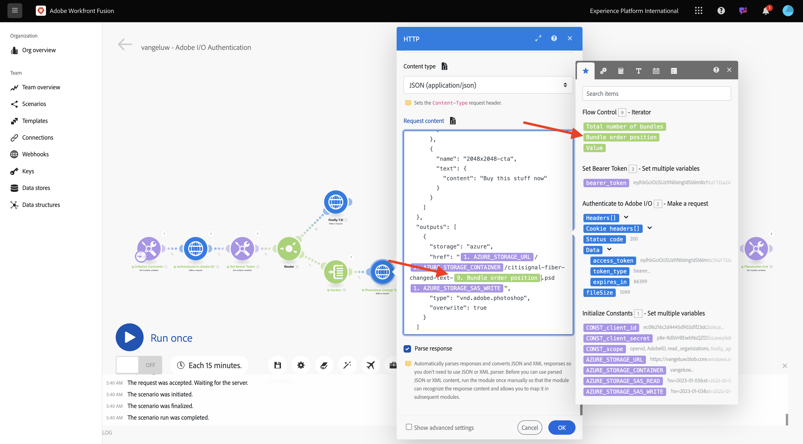
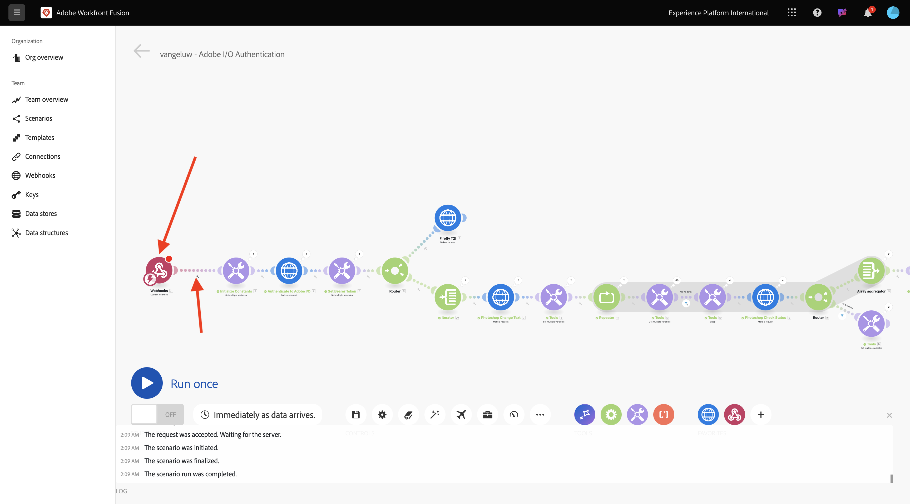
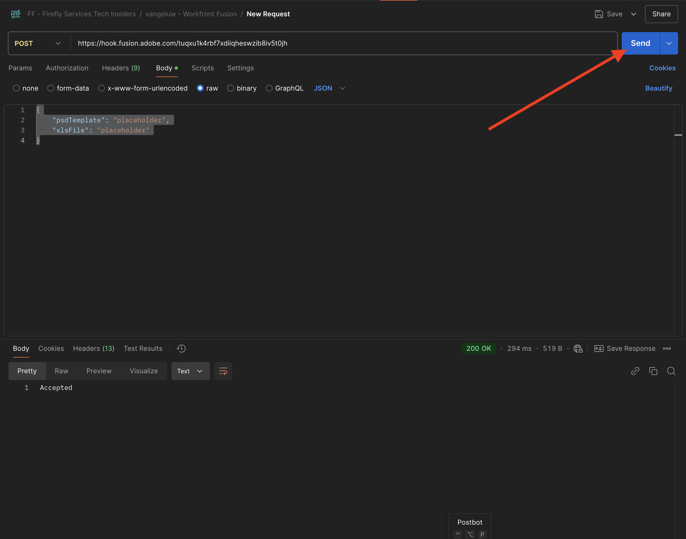

# 1.2.3 Prozessautomatisierung mit Workfront Fusion

Erfahren Sie, wie Sie die Automatisierung mit Workfront Fusion verarbeiten können.

## Iteration über mehrere Werte 1.2.3.1

Ihr Szenario sollte wie folgt aussehen:


Bisher haben Sie Text in einer Photoshop-Datei um einen statischen Wert geändert. Um Ihre Workflows zur Inhaltserstellung zu skalieren und zu automatisieren, müssen Sie eine Liste von Werten durchlaufen und diese Werte dynamisch in die Photoshop-Datei einfügen. In den nächsten Schritten fügen Sie hinzu, dass in Ihrem vorhandenen Szenario die Werte durchlaufen werden sollen.

1. Wählen Sie zwischen dem **Router**-Knoten und dem **Photoshop Change Text**-Knoten das Symbol **Schraubenschlüssel** aus und klicken Sie auf **Modul hinzufügen**.

   

1. Suchen Sie nach `flow` und wählen Sie **Flusssteuerung** aus.

   

1. Wählen Sie **Iterator** aus.

   

   Ihr Bildschirm sollte wie folgt aussehen:

   

   Es ist zwar möglich, Eingabedateien wie CSV-Dateien zu lesen, aber Sie müssen zunächst eine einfache Version einer CSV-Datei verwenden, indem Sie eine Textzeichenfolge definieren und diese Textdatei aufteilen.

1. Sie finden die Funktion **Aufspaltung** durch Auswahl des Symbols **T**, über das Sie alle verfügbaren Funktionen zum Bearbeiten von Textwerten sehen. Wählen Sie die **Aufspaltung**-Funktion aus, dann sollte dies angezeigt werden.

   

1. Die Aufspaltungsfunktion erwartet ein Array von Werten vor dem Semikolon und erwartet, dass Sie das Trennzeichen nach dem Semikolon angeben. Für diesen Test sollten Sie ein einfaches Array mit zwei Feldern verwenden: **Jetzt kaufen** und **Hier klicken** und das zu verwendende Trennzeichen ist **,**.

1. Geben Sie dies in das Feld **Array** ein, indem Sie die derzeit leere Funktion **split** ersetzen: `{{split("Buy now, Click here "; ",")}}`. Klicken Sie **OK**.

   


1. Wählen Sie **Photoshop-** aus, um für die Eingabe- und Ausgabefelder einige Variablen anstelle statischer Werte hinzuzufügen.

   

   In **Inhalt anfragen** ist der Text **Hier klicken**. Dieser Text muss durch die Werte aus Ihrem -Array ersetzt werden.

   

1. Löschen Sie den Text **Hier klicken** und ersetzen Sie ihn, indem Sie die Variable **Wert** im Knoten **Iterator** auswählen. Dadurch wird sichergestellt, dass der Text auf der Schaltfläche in Ihrem Photoshop-Dokument dynamisch aktualisiert wird.

   

   Sie müssen auch den Dateinamen aktualisieren, der zum Schreiben der Datei in Ihr Azure-Speicherkonto verwendet wird. Wenn der Dateiname statisch ist, überschreibt jede neue Iteration einfach die vorherige Datei und verliert daher die angepassten Dateien. Der aktuelle statische Dateiname lautet **Citisignal-Fibre-Changed-Text.psd**, und Sie müssen ihn jetzt aktualisieren.

1. Setzen Sie den Cursor hinter das Wort `text`.

   

1. Fügen Sie zunächst einen `-` mit Bindestrichen hinzu und wählen Sie dann den Wert **Bundle Order Position**. Dadurch wird sichergestellt, dass Workfront Fusion bei der ersten Iteration `-1` zum Dateinamen hinzufügt, bei der zweiten Iteration `-2`. Klicken Sie **OK**.

   

1. Speichern Sie das Szenario und wählen Sie **Einmal ausführen**.

   

   Sobald das Szenario ausgeführt wurde, kehren Sie zu Ihrem Azure Storage-Explorer zurück und aktualisieren Sie den Ordner . Anschließend sollten die beiden neu erstellten Dateien angezeigt werden.

   

1. Laden Sie jede Datei herunter und öffnen Sie sie. Sie sollten verschiedene Texte auf den Schaltflächen. Dies ist die Datei `citisignal-fiber-changed-text-1.psd`.

   

   Dies ist die Datei `citisignal-fiber-changed-text-2.psd`.

   

## 1.2.3.2 Aktivieren Ihres Szenarios mithilfe eines Webhooks

Bisher haben Sie Ihr Szenario zum Testen manuell ausgeführt. Aktualisieren wir nun Ihr Szenario mit einem Webhook, damit es von einer externen Umgebung aus aktiviert werden kann.

1. Wählen Sie **+** aus, suchen Sie nach **Webhook** und wählen Sie dann **Webhooks** aus.

   

1. Wählen Sie **Benutzerdefinierter Webhook** aus.

1. Ziehen Sie den Knoten **Benutzerdefinierter Webhook** und verbinden Sie ihn, sodass er eine Verbindung mit dem ersten Knoten auf der Arbeitsfläche herstellt, der **Initialisierungskonstanten“**.

   

1. Wählen Sie den Knoten **Benutzerdefinierter Webhook** aus. Wählen Sie dann **Hinzufügen** aus.

   

1. Legen Sie **Webhook-Name** auf `--aepUserLdap-- - Tutorial 1.2` fest.

   

1. Aktivieren Sie das Kontrollkästchen für **GET-Anfrage-Header**. Wählen Sie **Speichern** aus.

   

1. Ihre Webhook-URL ist jetzt verfügbar. Kopieren Sie die URL.

   

1. Öffnen Sie Postman und fügen Sie der Sammlung &quot;**- Firefly Services Tech Insiders“ einen neuen Ordner**.

   

1. Benennen Sie den Ordner `--aepUserLdap-- - Workfront Fusion`.

   

1. Wählen Sie in dem soeben erstellten Ordner die 3 Punkte **…** und dann **Anfrage hinzufügen**.

   

1. Legen Sie den **Methodentyp** auf **POST** fest und fügen Sie die URL Ihres Webhooks in die Adressleiste ein.

   

   Sie müssen einen benutzerdefinierten Hauptteil senden, damit die Variablenelemente von einer externen Quelle für Ihr Workfront Fusion-Szenario bereitgestellt werden können.

1. Wechseln Sie zu **Textkörper** und wählen Sie **Roh** aus.

   

1. Fügen Sie den folgenden Text in den Textkörper Ihrer Anfrage ein. Wählen Sie **Senden** aus.

   ```json
   {
       "psdTemplate": "placeholder",
       "xlsFile": "placeholder"
   }
   ```

   

1. Zurück in Workfront Fusion wird eine Meldung auf Ihrem benutzerdefinierten Webhook angezeigt, die lautet: **Erfolgreich ermittelt**.

   

1. Wählen Sie **Speichern** und dann **Einmal ausführen** aus. Ihr Szenario ist jetzt aktiv, wird aber erst ausgeführt, wenn Sie in Postman erneut **Senden** auswählen.

   

1. Wählen Sie in Postman **Senden** erneut aus.

   

   Ihr Szenario wird erneut ausgeführt und erstellt die zwei Dateien genau wie zuvor.

   

1. Ändern Sie den Namen Ihrer Postman-Anfrage in `POST - Send Request to Workfront Fusion Webhook`.

   

   Jetzt müssen Sie mit der Verwendung der Variablen **psdTemplate** beginnen. Anstatt den Speicherort der Eingabedatei im Knoten **Photoshop-Änderungstext** hartcodiert zu haben, verwenden Sie die eingehende Variable aus der Postman-Anfrage.

1. Öffnen Sie den Knoten **Photoshop**&#x200B;Änderungstext/ und wechseln Sie zu **Inhalt anfordern**. Wählen Sie den hartcodierten Dateinamen **citsignal-fiber.psd** unter **inputs** und löschen Sie ihn.

   

1. Wählen Sie die Variable **psdTemplate** aus. Wählen Sie **OK** und speichern Sie dann Ihr Szenario.

   

1. Wählen Sie **EIN** aus, um Ihr Szenario zu aktivieren. Ihr Szenario wird jetzt ununterbrochen ausgeführt.

   

1. Geben Sie zurück in Postman den Dateinamen `citisignal-fiber.psd` als Wert für die Variable **psdTemplate** ein und wählen Sie erneut **Senden** aus, um Ihr Szenario erneut auszuführen.

   

   Indem Sie die PSD-Vorlage als Variable angeben, die von einem externen System bereitgestellt wird, haben Sie jetzt ein wiederverwendbares Szenario erstellt.

   Jetzt haben Sie diese Übung abgeschlossen.

## Nächste Schritte

Wechseln Sie zu [Zusammenfassung und Vorteile von Firefly Services Automation](./summary.md){target="_blank"}

Zurück zu [Automatisieren von Adobe Firefly-Services](./automation.md){target="_blank"}

Zurück zu [Alle Module](./../../../overview.md){target="_blank"}
