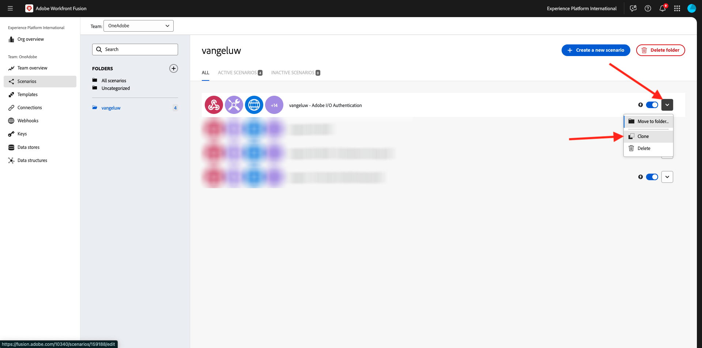
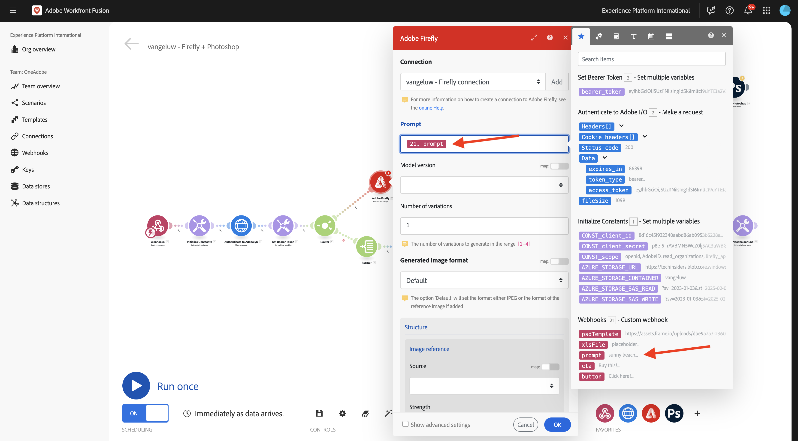
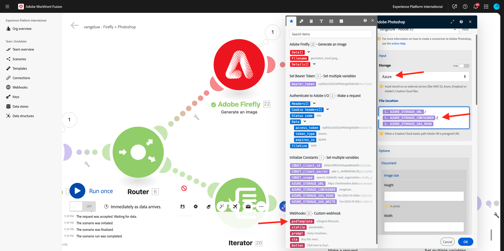
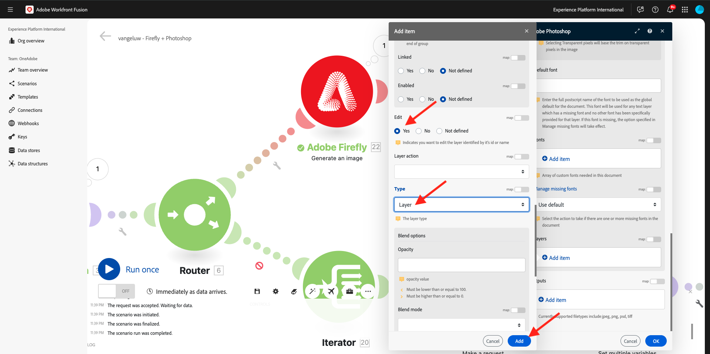
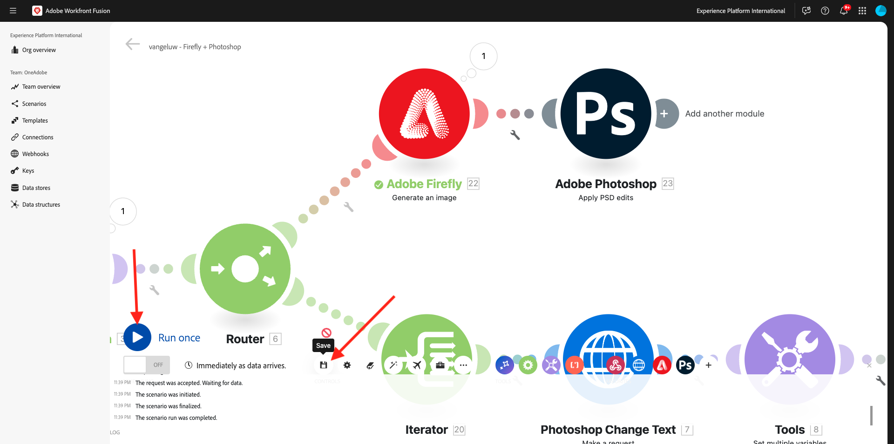
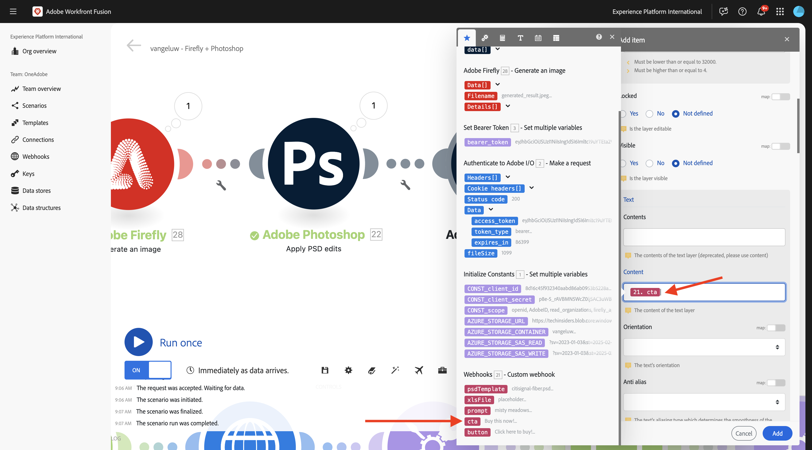

# 1.2.4 Automatisierung mithilfe von Connectoren

Sie verwenden jetzt die vordefinierten Connectoren in Workfront Fusion für Photoshop und verbinden die Firefly Text-2-Image-Anforderung und die Photoshop-Anforderungen in einem Szenario.

## 1.2.4.1 Duplizieren und Vorbereiten des Szenarios

Gehen Sie im linken Menü zu **Szenarien** und wählen Sie Ihre `--aepUserLdap--` aus. Anschließend sollte das zuvor erstellte Szenario mit dem Namen `--aepUSerLdap-- - Adobe I/O Authentication` angezeigt werden.


Klicken Sie auf den Pfeil, um das Dropdown-Menü zu öffnen, und wählen Sie **Klonen**.



Legen Sie **Name** des geklonten Szenarios auf `--aepUserLdap-- - Firefly + Photoshop` fest und wählen Sie das entsprechende **Target-Team**. Klicken Sie **Hinzufügen**, um einen neuen Webhook hinzuzufügen.


Legen Sie den **Webhook-Namen** auf `--aepUserLdap-- - Firefly + Photoshop Webhook` fest. Klicken Sie auf **Speichern**.


Sie sollten das dann sehen. Klicken Sie auf **Speichern**.


Sie sollten das dann sehen. Klicken Sie auf das **Webhook**-Modul.


Klicken Sie **Adresse in Zwischenablage kopieren** und dann auf **Datenstruktur neu bestimmen**.


Öffnen Sie Postman. Fügen Sie eine neue Anfrage in demselben Ordner hinzu, den Sie zuvor verwendet haben.


Stellen Sie sicher, dass die folgenden Einstellungen angewendet werden:

- Name der Anfrage: `POST - Send Request to Workfront Fusion Webhook Firefly + Photoshop`
- Anfragetyp: `POST`
- Anfrage-URL: Fügen Sie die URL ein, die Sie aus dem Webhook Ihres Workfront Fusion-Szenarios kopiert haben.

Wechseln Sie zu **body** und setzen Sie **body type** auf **raw** - **JSON**. Fügen Sie die folgende Payload in den **Hauptteil** ein.

```json
{
    "psdTemplate": "citisignal-fiber.psd",
    "xlsFile": "placeholder",
    "prompt":"misty meadows",
    "cta": "Buy this now!",
    "button": "Click here to buy!"
}
```

Diese neue Payload stellt sicher, dass alle Variableninformationen von außerhalb des Szenarios bereitgestellt werden, anstatt im Szenario hartcodiert zu werden. In einem Unternehmensszenario muss ein Szenario wiederverwendbar definiert werden, was bedeutet, dass eine Reihe von Variablen als Eingabevariablen bereitgestellt werden müssen, anstatt sie im Szenario hartcodiert zu haben.

Sie sollten dann diese haben. Klicken Sie auf **Senden**.


Der Workfront Fusion-Webhook wartet noch auf Eingabe.


Nachdem Sie auf **Senden** geklickt haben, sollte die Nachricht in **Erfolgreich ermittelt** geändert werden. Klicken Sie auf **OK**.


## 1.2.4.2 Aktualisieren des Firefly T2I-Moduls

Klicken Sie mit der rechten Maustaste auf das Modul **Firefly T2I** und wählen Sie **Modul löschen**.


Klicken Sie auf das Symbol **+**, geben Sie den Suchbegriff `firefly` ein und wählen Sie dann **Adobe Firefly** aus.


Wählen Sie **Bild erstellen** aus.


Ziehen Sie das Modul **Adobe Firefly** per Drag-and-Drop, sodass es eine Verbindung zum Modul **Router** herstellt.


Klicken Sie auf das **Adobe Firefly**-Modul, um es zu öffnen, und klicken Sie dann auf **Hinzufügen**, um eine neue Verbindung zu erstellen.


Füllen Sie die folgenden Felder aus:

- **Verbindungsname**: Verwenden Sie `--aepUserLdap-- - Firefly connection`.
- **Umgebung**: Verwenden Sie **Produktion**.
- **Type**: verwenden **Persönliches Konto**.
- **Client-ID**: Kopieren Sie die **Client-ID** aus Ihrem Adobe I/O-Projekt mit dem Namen `--aepUserLdap-- - One Adobe tutorial`.
- **Client-Geheimnis**: Kopieren Sie das **Client-Geheimnis** aus Ihrem Adobe I/O-Projekt mit dem Namen `--aepUserLdap-- - One Adobe tutorial`.

Die **Client-ID** und **Client-Geheimnis** Ihres Adobe I/O-Projekts finden Sie [hier](https://developer.adobe.com/console/projects.).


Nachdem Sie alle Felder ausgefüllt haben, klicken Sie auf **Weiter**. Ihre Verbindung wird dann automatisch validiert.


Wählen Sie als Nächstes die Variable **Eingabeaufforderung** aus, die dem Szenario vom eingehenden **benutzerdefinierten Webhook“ bereitgestellt**. Klicken Sie auf **OK**.



Bevor Sie fortfahren, müssen Sie im Szenario die alte Route deaktivieren. Für diese Übung verwenden Sie nur die neue Route, die Sie gerade konfigurieren. Klicken Sie dazu auf das **Schraubenschlüssel**-Symbol zwischen dem **Router**-Modul und dem **Iterator**-Modul und wählen Sie **Route deaktivieren**.


Klicken Sie auf **Speichern**, um Ihre Änderungen zu speichern, und klicken Sie dann auf **Einmal ausführen**, um Ihre Konfiguration zu testen.


Wechseln Sie zu Postman, überprüfen Sie die Eingabeaufforderung in Ihrer Anfrage und klicken Sie dann auf **Senden**.


Nachdem Sie auf Senden geklickt haben, gehen Sie zurück zu Workfront Fusion und klicken Sie auf das Blasensymbol im Modul **Adobe Firefly**, um die Details zu überprüfen.


Navigieren Sie **AUSGABE** zu **Details** > **url**, um die URL des von **Adobe Firefly generierten Bildes** finden.


Jetzt sollte ein Bild angezeigt werden, das die von der Postman-Anfrage gesendete Eingabeaufforderung darstellt, in diesem Fall **Misty Meadows**.


## 1.2.4.2 Ändern des Hintergrunds der PSD-Datei

Sie aktualisieren Ihr Szenario jetzt, um es durch die Verwendung von mehr vorkonfigurierten Connectoren intelligenter zu gestalten. Sie werden auch die Ausgabe von Firefly mit Photoshop verbinden, damit sich das Hintergrundbild der PSD-Datei dynamisch ändert, indem Sie die Ausgabe der Aktion &quot;Firefly-Bild generieren“ verwenden.

Sie sollten das dann sehen. Bewegen Sie als Nächstes den Mauszeiger über das Modul **Adobe Firefly** und klicken Sie auf das Symbol **+** .


Geben Sie im Suchmenü `Photoshop` ein und klicken Sie dann auf die Aktion **Adobe Photoshop**.


Wählen **PSD-Bearbeitungen anwenden**.


Sie sollten das dann sehen. Klicken Sie **Hinzufügen**, um eine neue Verbindung zu Adobe Photoshop hinzuzufügen.


Konfigurieren Sie Ihre Verbindung wie folgt:

- Verbindungstyp: **Adobe Photoshop (Server-zu-Server) auswählen**
- Verbindungsname: `--aepUserLdap-- - Adobe IO` eingeben
- Client ID: Fügen Sie Ihre Client ID ein.
- Client-Geheimnis: Fügen Sie Ihr Client-Geheimnis ein.

Klicken Sie auf **Weiter**.


Um Ihre **Client-ID** und Ihr **Client-Geheimnis** zu finden, navigieren Sie zu [https://developer.adobe.com/console/home](https://developer.adobe.com/console/home){target="_blank"} und öffnen Sie Ihr Adobe I/O-Projekt mit dem Namen `--aepUserLdap-- One Adobe tutorial`. Wechseln Sie zu **OAuth Server-zu-Server**, um Ihre Client-ID und Ihr Client-Geheimnis zu finden. Kopieren Sie diese Werte und fügen Sie sie in die Verbindungseinrichtung in Workfront Fusion ein.


Nachdem Sie auf **Weiter** geklickt haben, wird ein Popup-Fenster angezeigt, während Ihre Anmeldeinformationen überprüft werden. Sobald Sie fertig sind, sollten Sie dies sehen.


Jetzt müssen Sie den Dateispeicherort der PSD-Datei eingeben, mit der Fusion arbeiten soll. Wählen **für** Speicher **die Option Azure** und geben Sie für **Dateispeicherort** `{{1.AZURE_STORAGE_URL}}/{{1.AZURE_STORAGE_CONTAINER}}/{{1.AZURE_STORAGE_SAS_READ}}` ein. Platzieren Sie den Cursor neben die zweite `/`. Sehen Sie sich dann die verfügbaren Variablen an und scrollen Sie nach unten, um die Variable **psdTemplate** zu finden. Klicken Sie auf die Variable **psdTemplate**, um sie auszuwählen.



Sie sollten das dann sehen.


Scrollen Sie ganz nach unten, bis Sie „Ebenen **sehen**. Klicken Sie **Element hinzufügen**.


Sie sollten das dann sehen. Jetzt müssen Sie den Namen der Ebene in Ihrer Photoshop PSD-Vorlage eingeben, die für den Hintergrund der Datei verwendet wird.


In der Datei **citsignal-fiber.psd** finden Sie die Ebene, die für den Hintergrund verwendet wird. In diesem Beispiel erhält diese Ebene den Namen **2048x2048-background**.


Fügen Sie den Namen **2048x2048-background** in das Dialogfeld &quot;Workfront Fusion“ ein.


Scrollen Sie nach unten, bis Sie &quot;**&quot;**. Jetzt müssen Sie definieren, was in die Hintergrundebene eingefügt werden soll. In diesem Fall müssen Sie die Ausgabe des Moduls **Adobe Firefly** auswählen, das das dynamisch generierte Bild enthält.

Wählen **für** die Option **Extern** aus. Für **Dateispeicherort** kopieren Sie die `{{XX.details[].url}}` aus der Ausgabe des **Adobe Firefly**-Moduls und fügen Sie sie ein. Ersetzen Sie **XX** in der Variablen durch die Sequenznummer des **Adobe Firefly**-Moduls, in diesem Beispiel **22**.


Scrollen Sie dann nach unten, bis Sie **Bearbeiten** sehen. Legen Sie **Bearbeiten** auf **Ja** und **Typ** auf **Layer** fest. Klicken Sie auf **Hinzufügen**.



Sie sollten das dann sehen. Als Nächstes müssen Sie die Ausgabe der Aktion definieren. Klicken Sie **Element hinzufügen** unter **Ausgaben**.


Wählen Sie **Azure** für **Storage** aus, fügen Sie diesen `{{1.AZURE_STORAGE_URL}}/{{1.AZURE_STORAGE_CONTAINER}}/citisignal-fiber-replacedbg.psd{{1.AZURE_STORAGE_SAS_WRITE}}` unter **File Location** ein und wählen Sie **vnd.adobe.photoshop** unter **Type**. Klicken, um **Erweiterte Einstellungen anzeigen** zu aktivieren.


Wählen **unter „Erweiterte**&quot; die Option **Ja**, um Dateien mit demselben Namen zu überschreiben.
Klicken Sie auf **Hinzufügen**.


Sie sollten dann diese haben. Klicken Sie auf **OK**.


Klicken Sie auf **Speichern**, um Ihre Änderungen zu speichern, und klicken Sie dann auf **Einmal ausführen**, um Ihre Konfiguration zu testen.



Wechseln Sie zu Postman, überprüfen Sie die Eingabeaufforderung in Ihrer Anfrage und klicken Sie dann auf **Senden**.


Sie sollten das dann sehen. Klicken Sie auf den Kreis im Modul **Adobe Photoshop - PSD-Bearbeitungen anwenden**.


Sie können jetzt sehen, dass erfolgreich eine neue PSD-Datei generiert und in Ihrem Microsoft Azure-Speicherkonto gespeichert wurde.


## 1.2.4.3 Ändern der Textebenen einer PSD-Datei

### Aktionsaufruf-Text

Bewegen Sie als Nächstes den Mauszeiger über das Modul **Adobe Photoshop - PSD** Bearbeitungen anwenden und klicken Sie auf das Symbol **+** .


**Adobe Photoshop**.


Wählen Sie **Textebenen bearbeiten**.


Sie sollten das dann sehen. Wählen Sie zunächst die zuvor bereits konfigurierte Adobe Photoshop-Verbindung aus, die `--aepUserLdap-- Adobe IO` benannt werden soll.

Jetzt müssen Sie den Speicherort der **Eingabedatei** definieren, die die Ausgabe des vorherigen Schritts ist, und unter **Ebenen** müssen Sie den **Namen** der Textebene eingeben, die Sie ändern möchten.


Wählen Sie für **Eingabedatei** die Option **Azure** für **Eingabedateispeicherung** und stellen Sie sicher, dass Sie die Ausgabe aus der vorherigen Anforderung **Adobe Photoshop - PSD-Bearbeitungen anwenden** auswählen, die Sie hier übernehmen können: `data[]._links.renditions[].href`


Öffnen Sie die Datei **citsignal-fiber.psd**. In der Datei werden Sie feststellen, dass die Ebene, die den Aktionsaufruf enthält, **2048x2048-cta** heißt.


Geben Sie den Namen **2048x2048-cta** unter **Name** im Dialogfeld ein.


Scrollen Sie nach unten, bis **Text** > **Inhalt** angezeigt wird. Wählen Sie die Variable **cta** aus der Webhook-Payload aus.



Scrollen Sie nach unten, bis Sie **Ausgabe** sehen. Wählen Sie **Speicher** die Option **Azure** aus. Geben Sie **Dateispeicherort** den folgenden Speicherort ein. Beachten Sie, dass dem Dateinamen die Variable `{{timestamp}}` hinzugefügt wurde. Dadurch wird sichergestellt, dass jede generierte Datei einen eindeutigen Namen hat. Legen Sie außerdem **Type** auf &quot;**.adobe.photoshop** fest. Klicken Sie auf **OK**.

`{{1.AZURE_STORAGE_URL}}/{{1.AZURE_STORAGE_CONTAINER}}/citisignal-fiber-changed-text-{{timestamp}}.psd{{1.AZURE_STORAGE_SAS_WRITE}}`


### Schaltflächentext

Klicken Sie mit der rechten Maustaste auf das soeben erstellte Modul und wählen Sie **Klonen**. Dadurch wird ein zweites ähnliches Modul erstellt.


Verbinden Sie das geklonte Modul mit dem vorherigen Modul **Adobe Photoshop - Textebenen bearbeiten** .


Sie sollten das dann sehen. Wählen Sie zunächst die zuvor bereits konfigurierte Adobe Photoshop-Verbindung aus, die `--aepUserLdap-- Adobe IO` benannt werden soll.

Jetzt müssen Sie den Speicherort der **Eingabedatei** definieren, die die Ausgabe des vorherigen Schritts ist, und unter **Ebenen** müssen Sie den **Namen** der Textebene eingeben, die Sie ändern möchten.


Wählen Sie für **Eingabedatei** die Option **Azure** für **Eingabedateispeicherung** und stellen Sie sicher, dass Sie die Ausgabe aus der vorherigen Anforderung **Adobe Photoshop - Textebenen bearbeiten** auswählen, die Sie hier verwenden können: `data[]._links.renditions[].href`

Öffnen Sie die Datei **citsignal-fiber.psd**. In der Datei werden Sie feststellen, dass die Ebene, die den Aktionsaufruf enthält, **2048x2048-button-text** heißt.


Geben Sie den Namen **2048x2048-button-text** unter **Name** im Dialogfeld ein.


Scrollen Sie nach unten, bis **Text** > **Inhalt** angezeigt wird. Wählen Sie die Variable **Schaltfläche** aus der Webhook-Payload aus.


Scrollen Sie nach unten, bis Sie **Ausgabe** sehen. Wählen Sie **Speicher** die Option **Azure** aus. Geben Sie **Dateispeicherort** den folgenden Speicherort ein. Beachten Sie, dass dem Dateinamen die Variable `{{timestamp}}` hinzugefügt wurde. Dadurch wird sichergestellt, dass jede generierte Datei einen eindeutigen Namen hat. Legen Sie außerdem **Type** auf &quot;**.adobe.photoshop** fest. Klicken Sie auf **OK**.

`{{1.AZURE_STORAGE_URL}}/{{1.AZURE_STORAGE_CONTAINER}}/citisignal-fiber-changed-text-{{timestamp}}.psd{{1.AZURE_STORAGE_SAS_WRITE}}`


Klicken Sie **Speichern**, um Ihre Änderungen zu speichern.


## Webhook-Antwort 1.2.4.4

Nachdem Sie diese Änderungen auf Ihre Photoshop-Datei angewendet haben, müssen Sie jetzt eine „Webhook **Antwort“ konfigurieren** die an die Anwendung zurückgesendet wird, die dieses Szenario aktiviert hat.

Bewegen Sie den Mauszeiger über das Modul **Adobe Photoshop - Textebenen bearbeiten** klicken Sie auf das Symbol **+** .


Suchen Sie nach `webhooks` und wählen Sie **Webhook**.


Wählen Sie **Webhook-Antwort** aus.


Sie sollten das dann sehen. Fügen Sie die folgende Payload in &quot;**&quot;**.

```json
{
    "newPsdTemplate": ""
}
```


Kopieren Sie die Variable `{{XX.data[]._links.renditions[].href}}` und fügen Sie sie ein. Ersetzen **XX** durch die Sequenznummer des letzten **Adobe Photoshop -**-Moduls, in diesem Fall **25**. Aktivieren Sie das Kontrollkästchen für **Erweiterte Einstellungen anzeigen** und klicken Sie dann auf **Element hinzufügen**.


Geben Sie im Feld **Schlüssel** `Content-Type` ein. Geben Sie im Feld **Wert** `application/json` ein. Klicken Sie auf **Hinzufügen**.


Sie sollten dann diese haben. Klicken Sie auf **OK**.


Klicken Sie **Automatisch ausrichten**.


Sie sollten das dann sehen. Klicken Sie auf **Speichern**, um Ihre Änderungen zu speichern, und klicken Sie dann auf **Einmal ausführen**, um Ihr Szenario zu testen.


Gehen Sie zurück zu Postman und klicken Sie auf **Senden**. Die hier verwendete Eingabeaufforderung lautet **Misty Meadows**.


Anschließend wird das Szenario aktiviert und nach einiger Zeit wird in Postman eine Antwort angezeigt, die die URL der neu erstellten PSD-Datei enthält.


Zur Erinnerung: Sobald das Szenario in Workfront Fusion ausgeführt wurde, können Sie Informationen zu den einzelnen Modulen anzeigen, indem Sie auf die Sprechblase über jedem Modul klicken.


Mit Azure Storage Explorer können Sie dann die neu erstellte PSD-Datei suchen und öffnen, indem Sie in Azure Storage Explorer darauf doppelklicken.


Ihre Datei sollte dann wie folgt aussehen, mit dem Hintergrund, der durch einen Hintergrund mit &quot;**Wiesen“ ersetzt**.


Wenn Sie Ihr Szenario erneut ausführen und dann eine neue Anfrage aus Postman mit einer anderen Eingabeaufforderung senden, werden Sie sehen, wie einfach und wiederverwendbar Ihr Szenario geworden ist. In diesem Beispiel ist die neue Eingabeaufforderung (Sunny **)**.


Und ein paar Minuten später wurde eine neue PSD-Datei mit neuem Hintergrund erstellt.


## Nächste Schritte

Navigieren Sie zu [1.2.5 Frame.io und Workfront Fusion](./ex5.md){target="_blank"}

Zurück zur [Creative-Workflow-Automatisierung mit Workfront Fusion](./automation.md){target="_blank"}

Zurück zu [Alle Module](./../../../overview.md){target="_blank"}
