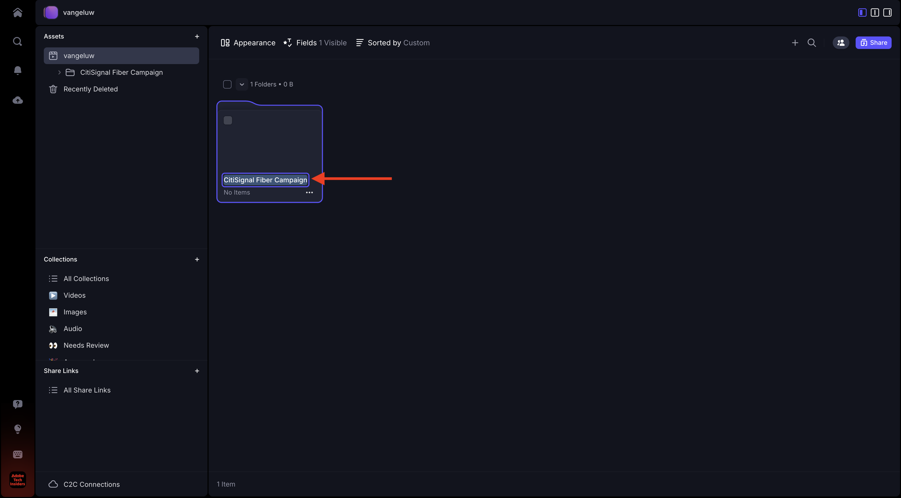
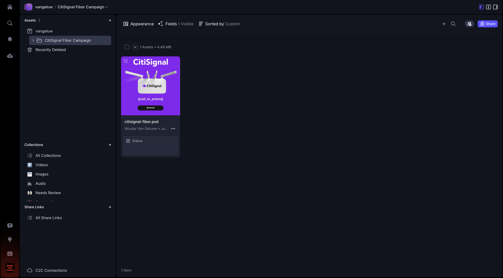
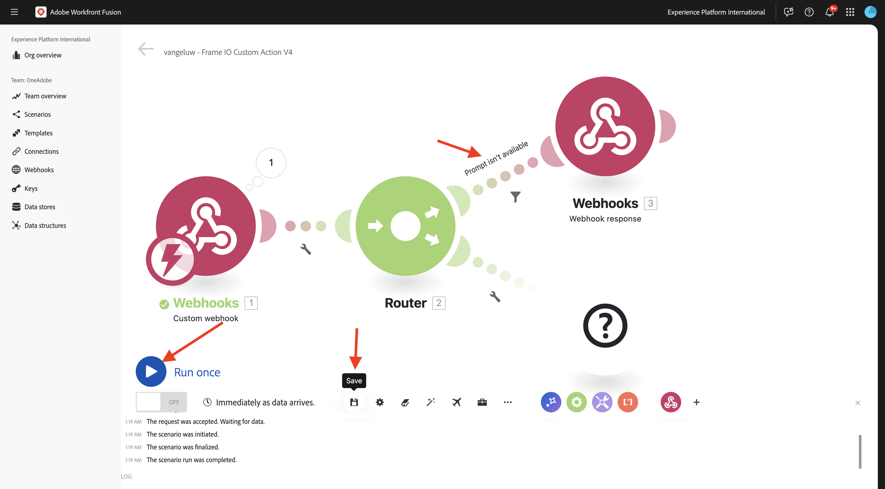
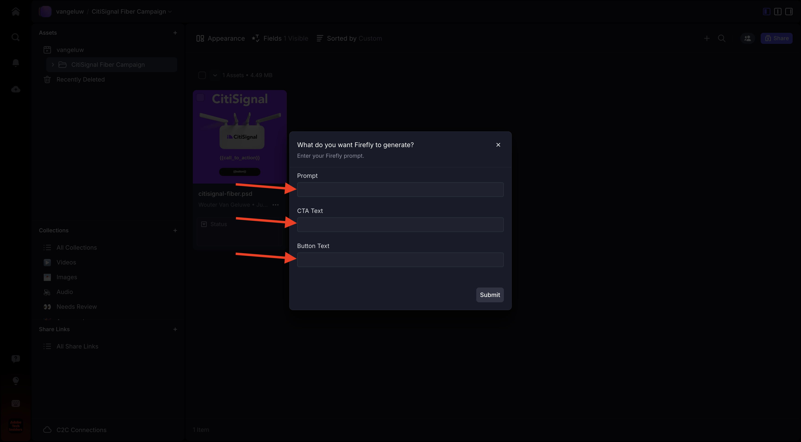
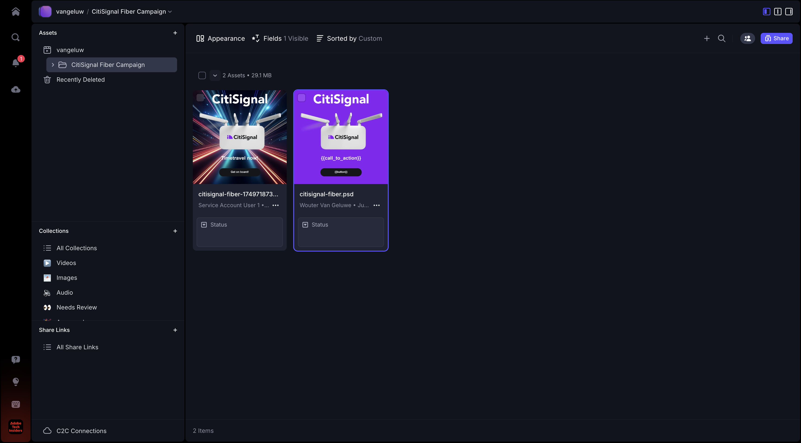

# 1.2.5 Frame.io und Workfront Fusion

In der vorherigen Übung haben Sie den Szenario-`--aepUserLdap-- - Firefly + Photoshop` konfiguriert und einen eingehenden Webhook konfiguriert, um das Szenario Trigger, und eine Webhook-Antwort, wenn das Szenario erfolgreich abgeschlossen wurde. Anschließend haben Sie Postman zum Trigger dieses Szenarios verwendet. Postman ist ein großartiges Tool zum Testen, aber in einem echten Geschäftsszenario würden Business-Anwender Postman nicht zum Trigger eines Szenarios verwenden. Stattdessen würden sie eine andere Anwendung verwenden und erwarten, dass diese andere Anwendung ein Szenario in Workfront Fusion aktiviert. In dieser Übung ist genau das, was Sie mit Frame.io tun werden.

>[!NOTE]
>
>Diese Übung wurde für Frame.io V4 erstellt. Einige der folgenden in der Übung verwendeten Funktionen befinden sich derzeit in der Alpha-Phase und sind noch nicht allgemein verfügbar.

## Voraussetzungen für 1.2.5.1

Bevor Sie mit dieser Übung fortfahren, müssen Sie die Einrichtung von [Ihrem Adobe I/O-Projekt](./../../../modules/getting-started/gettingstarted/ex6.md) einschließlich des Hinzufügens der **Frame.io-API** zu Ihrem Adobe I/O-Projekt abgeschlossen haben und außerdem eine Anwendung konfiguriert haben, die mit APIs interagiert, z. B. [Postman](./../../../modules/getting-started/gettingstarted/ex7.md) oder [PostBuster](./../../../modules/getting-started/gettingstarted/ex8.md).

## 1.2.5.2 Zugriff auf Frame.io

Navigieren Sie zu [https://next.frame.io/](https://next.frame.io/){target="_blank"}.


Überprüfen Sie, bei welcher Instanz Sie aktuell angemeldet sind, indem Sie auf das Instanzsymbol klicken. Wählen Sie die Instanz aus, auf die Sie Zugriff erhalten haben. Diese sollte `--aepImsOrgName--` werden.

Klicken Sie auf **+ Neues Projekt**, um in Frame.io ein eigenes Projekt zu erstellen.


Wählen Sie die Vorlage **leer** und geben Sie dann den `--aepUserLdap--` für Ihr Projekt ein. Klicken Sie **Neues Projekt erstellen**.


Anschließend wird Ihr Projekt im linken Menü angezeigt. Klicken Sie auf das Symbol **+** und wählen Sie dann **Neuer Ordner** aus.


Geben Sie den `CitiSignal Fiber Campaign` ein und doppelklicken Sie dann auf den Ordner, um ihn zu öffnen.



Klicken Sie **Hochladen**.


In einer der vorherigen Übungen haben Sie „Citisignal[fiber.psd“ &#x200B;](./../../../assets/ff/citisignal-fiber.psd){target="_blank"}. Wählen Sie diese Datei aus und klicken Sie auf **Öffnen**.


Die Datei **Citisignal-fiber.psd** steht dann in Ihrem neu erstellten Ordner zur Verfügung.



## 1.2.5.3 Workfront Fusion und Frame.io

In der vorherigen Übung haben Sie das Szenario `--aepUserLdap-- - Firefly + Photoshop` erstellt, das mit einem benutzerdefinierten Webhook begann und mit einer Webhook-Antwort endete. Die Verwendung der Webhooks wurde dann mit Postman getestet, aber offensichtlich soll ein solches Szenario von einer externen Anwendung aufgerufen werden. Wie bereits erwähnt, wird Frame.io diese Übung sein, aber zwischen Frame.io und dem `--aepUserLdap-- - Firefly + Photoshop` ist ein weiteres Workfront Fusion-Szenario erforderlich. Das Szenario wird jetzt konfiguriert.

Navigieren Sie zu [https://experience.adobe.com/](https://experience.adobe.com/){target="_blank"}. Öffnen Sie **Workfront Fusion**.


Gehen Sie im linken Menü zu **Szenarien** und wählen Sie Ihre `--aepUserLdap--` aus. Klicken Sie **Neues Szenario erstellen**.


Verwenden Sie den Namen `--aepUserLdap-- - Frame IO Custom Action V4`.


Klicken Sie auf **Arbeitsfläche auf** Fragezeichen-Objekt“. Geben Sie den `webhook` in das Suchfeld ein und klicken Sie auf **Webhooks**.


Klicken Sie auf **Benutzerdefinierter Webhook**.


Klicken Sie auf **Hinzufügen**, um eine neue Webhook-URL zu erstellen.


Verwenden Sie für **Webhook** Namen“ `--aepUserLdap-- - Frame IO Custom Action Webhook`. Klicken Sie auf **Speichern**.


Sie sollten das dann sehen. Lassen Sie diesen Bildschirm offen und unberührt, da Sie ihn in einem nächsten Schritt benötigen werden. Sie müssen in einem nächsten Schritt die Webhook-URL kopieren, indem Sie auf **Adresse in Zwischenablage kopieren** klicken.


## 1.2.5.4 Frame.io v4-API für benutzerdefinierte Aktionen

Wechseln Sie zu Postman und öffnen Sie die Anfrage **POST - Zugriffs-Token** in der Sammlung **Adobe IO - OAuth**. Überprüfen Sie das Feld **Umfang** unter **params**. Das Feld **Umfang** sollte die `frame.s2s.all` des Umfangs enthalten. Wenn sie fehlt, fügen Sie sie hinzu. Klicken Sie anschließend auf **Senden**, um ein neues **Zugriffs-Token** anzufordern.


Öffnen Sie als Nächstes die Anfrage **GET - Konten** in der Sammlung **Frame.io V4 - Tech Insiders**. Klicken Sie auf **Senden**.


Anschließend sollten Sie eine ähnliche Antwort sehen, die ein oder mehrere Konten enthält. Überprüfen Sie die Antwort und suchen Sie das Feld **id** für das von Ihnen verwendete Frame.io V4-Konto. Den Namen des Kontos finden Sie in der Benutzeroberfläche von Frame.io V4:


Kopieren Sie den Wert des Felds **id**.


Gehen Sie im linken Menü zu **Umgebungen** und wählen Sie die verwendete Umgebung aus. Suchen Sie die Variable **`FRAME_IO_ACCOUNT_ID`** und fügen Sie die **id**, die Sie aus der vorherigen Anfrage erhalten haben, sowohl in die Spalte **Anfangswert** als auch in die Spalte **Aktueller Wert** ein. Klicken Sie auf **Speichern**.


Gehen Sie im linken Menü zurück zu **Sammlungen**. Öffnen Sie die Anfrage **GET - Arbeitsbereiche auflisten** in der Sammlung **Frame.io V4 - Tech Insiders**. Klicken Sie auf **Senden**.


Anschließend sollten Sie eine ähnliche Antwort sehen, die ein oder mehrere Konten enthält. Überprüfen Sie die Antwort und suchen Sie das Feld **id** für die von Ihnen verwendete Frame.io V4-Workspace. Kopieren Sie den Wert des Felds **id**.


Gehen Sie im linken Menü zu **Umgebungen** und wählen Sie die verwendete Umgebung aus. Suchen Sie die Variable **`FRAME_IO_WORKSPACE_ID`** und fügen Sie die **id**, die Sie aus der vorherigen Anfrage erhalten haben, sowohl in die Spalte **Anfangswert** als auch in die Spalte **Aktueller Wert** ein. Klicken Sie auf **Speichern**.


Gehen Sie im linken Menü zurück zu **Sammlungen**. Öffnen Sie die Anfrage **POST - Benutzerdefinierte Aktion erstellen** in der Sammlung **Frame.io V4 - Tech Insiders** im Ordner **Benutzerdefinierte Aktionen**.

Navigieren Sie zum **Hauptteil** der Anfrage. Ändern Sie das Feld **name** in `--aepUserLdap--  - Frame.io Custom Action V4` und ändern Sie dann das Feld **url** in den Wert der Webhook-URL, die Sie aus Workfront Fusion kopiert haben.

Klicken Sie auf **Senden**.


Ihre benutzerdefinierte Frame.io V4-Aktion wurde jetzt erstellt.


Navigieren Sie zurück zu [https://next.frame.io/](https://next.frame.io/){target="_blank"} und zu dem Ordner **CitiSignal Fibre Campaign**, den Sie in Ihrem `--aepUserLdap--` erstellt haben. Aktualisieren Sie die Seite.


Nachdem Sie die Seite aktualisiert haben, klicken Sie auf die 3 Punkte **…** auf dem Asset **Citisignal-fiber.psd** und öffnen Sie das Menü **Benutzerdefinierte Aktionen**. Die zuvor erstellte benutzerdefinierte Aktion sollte dann im angezeigten Menü angezeigt werden. Klicken Sie auf die `--aepUserLdap-- - Frame IO Custom Action Fusion V4` Benutzerdefinierte Aktion .


Anschließend sollte ein ähnliches Popup **Benutzerdefinierte Aktion** angezeigt werden. Dieses Popup ist das Ergebnis der Kommunikation zwischen Frame.io und Workfront Fusion.


Wechseln Sie zurück zu Workfront Fusion. Im benutzerdefinierten Webhook **Objekt sollte jetzt &quot;** bestimmt“ angezeigt werden. Klicken Sie auf **OK**.


Klicken Sie **Einmal ausführen**, um den Testmodus zu aktivieren, und testen Sie die Kommunikation mit Frame.io erneut.


Gehen Sie zurück zu Frame.io und klicken Sie erneut auf die `--aepUserLdap-- - Frame IO Custom Action Fusion V4` der benutzerdefinierten Aktion.


Schalten Sie den Bildschirm wieder auf Workfront Fusion um. Jetzt sollte ein grünes Häkchen und eine Blase mit **1** angezeigt werden. Klicken Sie auf die Blase, um die Details anzuzeigen.


Die Detailansicht der Blase zeigt die Daten an, die von Frame.io empfangen wurden. Es sollten verschiedene IDs angezeigt werden. Beispielsweise zeigt das Feld **resource.id** die eindeutige ID in Frame.io des Assets **citsignal-fiber.psd**.


Nachdem die Kommunikation zwischen Frame.io und Workfront Fusion hergestellt wurde, können Sie Ihre Konfiguration fortsetzen.

## 1.2.5.5 Bereitstellen einer benutzerdefinierten Formularantwort für Frame.io

Wenn die benutzerdefinierte Aktion in Frame.io aufgerufen wird, erwartet Frame.io eine Antwort von Workfront Fusion. Wenn Sie an das Szenario denken, das Sie in der vorherigen Übung erstellt haben, ist eine Reihe von Variablen erforderlich, um die standardmäßige Photoshop PSD-Datei zu aktualisieren. Diese Variablen werden in der von Ihnen verwendeten Payload definiert:

```json
{
    "psdTemplate": "citisignal-fiber.psd",
    "xlsFile": "placeholder",
    "prompt":"misty meadows",
    "cta": "Buy this now!",
    "button": "Click here to buy!"
}
```

Damit das Szenario `--aepUserLdap-- - Firefly + Photoshop` erfolgreich ausgeführt werden kann, sind daher Felder wie **&#x200B;**, **cta**, **button** und **psdTemplate** erforderlich.

Die ersten drei Felder **Eingabeaufforderung**, **cta**, **button** erfordern Benutzereingaben, die in Frame.io erfasst werden müssen, wenn der Benutzer die benutzerdefinierte Aktion aufruft. Daher muss in Workfront Fusion zunächst überprüft werden, ob diese Variablen verfügbar sind. Ist dies nicht der Fall, sollte Workfront Fusion auf Frame.io zurückantworten, um die Eingabe dieser Variablen anzufordern. Dies erreichen Sie, indem Sie ein Formular in Frame.io verwenden.

Kehren Sie zu Workfront Fusion zurück und öffnen Sie Ihr Szenario `--aepUserLdap-- - Frame IO Custom Action`. Bewegen Sie den Mauszeiger über **Benutzerdefinierter Webhook**-Objekt und klicken Sie auf das Symbol **+** , um ein weiteres Modul hinzuzufügen.


Suchen Sie nach `Flow Control` und klicken Sie auf **Flusssteuerung**.


Klicken Sie auf **Router**.


Sie sollten das dann sehen.


Auf die **klicken?** -Objekt aus und klicken Sie dann auf **Webhooks**.


Wählen Sie **Webhook-Antwort** aus.


Sie sollten das dann sehen.


Kopieren Sie den folgenden JSON-Code und fügen Sie ihn in das Feld **body** ein.


```json
{
  "title": "What do you want Firefly to generate?",
  "description": "Enter your Firefly prompt.",
  "fields": [
    {
      "type": "text",
      "label": "Prompt",
      "name": "Prompt",
      "value": ""
    },
    {
      "type": "text",
      "label": "CTA Text",
      "name": "CTA Text",
      "value": ""
    },
    {
      "type": "text",
      "label": "Button Text",
      "name": "Button Text",
      "value": ""
    }
  ]
}
```

Klicken Sie auf das Symbol, um den JSON-Code zu bereinigen und zu verschönern. Klicken Sie dann auf **OK**.


Klicken Sie **Speichern**, um Ihre Änderungen zu speichern.


Als Nächstes müssen Sie einen Filter einrichten, um sicherzustellen, dass dieser Pfad des Szenarios nur ausgeführt wird, wenn keine Eingabeaufforderung verfügbar ist. Klicken Sie auf das **Schraubenschlüssel**-Symbol und wählen Sie **Filter einrichten** aus.


Konfigurieren Sie die folgenden Felder:

- **label**: Verwenden Sie `Prompt isn't available`.
- **Bedingung**: Verwenden Sie `{{1.data.Prompt}}`.
- **Standardoperatoren**: Wählen Sie **Nicht vorhanden**.

>[!NOTE]
>
>Variablen in Workfront Fusion können manuell mit der folgenden Syntax angegeben werden: `{{1.data.Prompt}}`. Die Zahl in der Variablen verweist auf das Modul im Szenario. In diesem Beispiel sehen Sie, dass das erste Modul im Szenario **Webhooks** heißt und die Sequenznummer **1 hat**. Das bedeutet, dass die Variable `{{1.data.Prompt}}` auf das Feld **data.Prompt** aus dem Modul mit der Sequenznummer 1 zugreift. Sequenznummern können manchmal unterschiedlich sein. Achten Sie daher beim Kopieren/Einfügen dieser Variablen darauf, dass die verwendete Sequenznummer immer die richtige ist.

Klicken Sie auf **OK**.


Sie sollten das dann sehen. Klicken Sie zuerst auf **Speichern** und dann auf **Einmal ausführen** um Ihr Szenario zu testen.



Sie sollten das dann sehen.


Gehen Sie zurück zu Frame.io und klicken Sie erneut auf die benutzerdefinierte `--aepUserLdap-- - Frame IO Custom Action Fusion` auf dem Asset **Citisignal-fiber.psd**.


Es sollte nun eine Eingabeaufforderung in Frame.io angezeigt werden. Füllen Sie die Felder noch nicht aus und senden Sie das Formular noch nicht ab. Diese Eingabeaufforderung wird basierend auf der Antwort von Workfront Fusion angezeigt, die Sie gerade konfiguriert haben.



Wechseln Sie zurück zu Workfront Fusion und klicken Sie auf die Blase im Modul **Webhook-Antwort**. Sie sehen unter &quot;**&quot; den** mit der JSON-Payload für das Formular. Klicken Sie **erneut auf &quot;** ausführen“.


Sie sollten das dann noch einmal sehen.


Gehen Sie zurück zu Frame.io und füllen Sie die Felder wie angegeben aus.

- **Prompt**: futuristische Laserstrahlen, die durch den Weltraum laufen
- **CTA**: Jetzt zeitlich reisen!
- **Schaltflächentext**: Steigen Sie ein!

Klicken Sie auf **Absenden**.


In Frame.io sollte dann ein Popup angezeigt werden, das wie folgt aussieht.


Wechseln Sie zurück zu Workfront Fusion und klicken Sie auf die Blase im Modul **Benutzerdefinierter Webhook**. In Vorgang 1 wird unter **OUTPUT** jetzt ein neues **data**-Objekt angezeigt, das Felder wie **Schaltflächentext**, **CTA Text** und **Prompt** enthält. Wenn diese Benutzereingabevariablen in Ihrem Szenario verfügbar sind, verfügen Sie über genügend , um mit der Konfiguration fortzufahren.


## 1.2.5.6 Dateispeicherort von Frame.io abrufen

Wie bereits erwähnt, werden Felder wie **prompt**, **cta**, **button** und **psdTemplate** benötigt, damit dieses Szenario funktioniert. Die ersten drei Felder sind bereits verfügbar, aber die **psdTemplate** , die verwendet werden soll, fehlt noch. Die **psdTemplate** verweist jetzt auf einen Frame.io-Speicherort, da die Datei **citsignal-fiber.psd** in Frame.io gehostet wird. Um den Speicherort dieser Datei abzurufen, müssen Sie die Frame.io-Verbindung in Workfront Fusion konfigurieren und verwenden.

Kehren Sie zu Workfront Fusion zurück und öffnen Sie Ihr Szenario `--aepUserLdap-- - Frame IO Custom Action V4`. Bewegen Sie den Mauszeiger über die **?Klicken Sie** Modul auf das Symbol **+** , um ein weiteres Modul hinzuzufügen, und suchen Sie nach `frame`. Klicken Sie auf **Frame.io**.


Klicken Sie auf **Frame.io**.


Klicken Sie **Benutzerdefinierten API-Aufruf durchführen**.


Um die Frame.io-Verbindung verwenden zu können, müssen Sie sie zunächst konfigurieren. Klicken Sie **Hinzufügen** um dies zu tun.


Wählen Sie **Verbindungstyp** &quot;**Server zu Server** aus und geben Sie den `--aepUserLdap-- - Adobe I/O - Frame.io S2S` ein.


Geben Sie anschließend die **Client-ID** und das **Client-Geheimnis** des Adobe I/O-Projekts ein, das Sie im Rahmen des Moduls **Erste Schritte** konfiguriert haben. Die **Client-ID** und **Client-Geheimnis** Ihres Adobe I/O-Projekts finden Sie [hier](https://developer.adobe.com/console/projects.){target="_blank"}.


Kehren Sie zu Ihrem Szenario in Workfront Fusion zurück. Fügen Sie die Werte von **Client-ID** und **Client-Geheimnis** in das entsprechende Feld im Fenster „Verbindungseinrichtung“ ein. Klicken Sie **Weiter**. Ihre Verbindung wird jetzt von Workfront Fusion getestet.


Wenn die Verbindung erfolgreich getestet wurde, wird sie automatisch unter **Verbindung** angezeigt. Sie haben jetzt eine erfolgreiche Verbindung, und Sie müssen die Konfiguration abschließen, um alle Asset-Details von Frame.io abzurufen, einschließlich des Dateispeicherorts. Dazu müssen Sie die „Ressourcen **ID“**.


Das Feld **Ressourcen-ID** wird von Frame.io im Rahmen der ersten **benutzerdefinierten Webhook“-** für Workfront Fusion freigegeben und befindet sich unter dem Feld **resource.id**.

Verwenden Sie für die Konfiguration des Moduls **Frame.io - Erstellen eines benutzerdefinierten API-**: `/v4/accounts/{{1.account_id}}/files/{{1.resource.id}}`.

>[!NOTE]
>
>Variablen in Workfront Fusion können manuell mit dieser Syntax angegeben werden: `{{1.account_id}}` und `{{1.resource.id}}`. Die Zahl in der Variablen verweist auf das Modul im Szenario. In diesem Beispiel sehen Sie, dass das erste Modul im Szenario **Webhooks** heißt und die Sequenznummer **1 hat**. Das bedeutet, dass die Variablen `{{1.account_id}}` und `{{1.resource.id}}` vom Modul mit der Sequenznummer 1 auf dieses Feld zugreifen. Sequenznummern können manchmal unterschiedlich sein. Achten Sie daher beim Kopieren/Einfügen dieser Variablen darauf, dass die verwendete Sequenznummer immer die richtige ist.

Klicken Sie anschließend auf **+ Element hinzufügen** unter **Abfragezeichenfolge**.


Geben Sie diese Werte ein und klicken Sie auf **Hinzufügen**.

| Schlüssel | Wert |
|:-------------:| :---------------:| 
| `include` | `media_links.original` |


Du solltest das jetzt haben. Klicken Sie auf **OK**.


Als Nächstes müssen Sie einen Filter einrichten, um sicherzustellen, dass dieser Pfad des Szenarios nur ausgeführt wird, wenn keine Eingabeaufforderung verfügbar ist. Klicken Sie auf das **Schraubenschlüssel**-Symbol und wählen Sie **Filter einrichten** aus.


Konfigurieren Sie die folgenden Felder:

- **label**: Verwenden Sie `Prompt is available`.
- **Bedingung**: Verwenden Sie `{{1.data.Prompt}}`.
- **Standardoperatoren**: Wählen Sie **Vorhanden**.

>[!NOTE]
>
>Variablen in Workfront Fusion können manuell mit der folgenden Syntax angegeben werden: `{{1.data.Prompt}}`. Die Zahl in der Variablen verweist auf das Modul im Szenario. In diesem Beispiel sehen Sie, dass das erste Modul im Szenario **Webhooks** heißt und die Sequenznummer **1 hat**. Das bedeutet, dass die Variable `{{1.data.Prompt}}` auf das Feld **data.Prompt** aus dem Modul mit der Sequenznummer 1 zugreift. Sequenznummern können manchmal unterschiedlich sein. Achten Sie daher beim Kopieren/Einfügen dieser Variablen darauf, dass die verwendete Sequenznummer immer die richtige ist.

Klicken Sie auf **OK**.


Sie sollten das jetzt sehen. Speichern Sie Ihre Änderungen und klicken Sie dann auf **Einmal ausführen**, um Ihr Szenario zu testen.


Gehen Sie zurück zu Frame.io und klicken Sie erneut auf die benutzerdefinierte `--aepUserLdap-- - Frame IO Custom Action Fusion V4` auf dem Asset **Citisignal-fiber.psd**.


Es sollte nun eine Eingabeaufforderung in Frame.io angezeigt werden. Füllen Sie die Felder noch nicht aus und senden Sie das Formular noch nicht ab. Diese Eingabeaufforderung wird basierend auf der Antwort von Workfront Fusion angezeigt, die Sie gerade konfiguriert haben.


Wechseln Sie zurück zu Workfront Fusion. Klicken Sie **erneut auf &quot;** ausführen“.


Gehen Sie zurück zu Frame.io und füllen Sie die Felder wie angegeben aus. Klicken Sie auf **Absenden**.

- **Prompt**: futuristische Laserstrahlen, die durch den Weltraum laufen
- **CTA**: Jetzt zeitlich reisen!
- **Schaltflächentext**: Steigen Sie ein!


Wechseln Sie zurück zu Workfront Fusion und klicken Sie auf die Sprechblase im Modul **Frame.io - Erstellen eines benutzerdefinierten API-Aufrufs**.


Unter **OUTPUT** > **Body** > **data** können Sie jetzt eine Vielzahl von Metadaten über das spezifische Asset sehen **Citisignal-fiber.psd**.


Die spezifische Information, die für diesen Anwendungsfall benötigt wird, ist die Standort-URL der Datei **Citisignal-fiber.psd**, die Sie finden können, indem Sie nach unten zum Feld **media_links** > **Original** > **download_url** scrollen.


Ihnen stehen jetzt alle Informationen (**prompt**, **cta**, **button** und **psdTemplate**) zur Verfügung, die für diesen Anwendungsfall erforderlich sind, um zu funktionieren.

## Workfront-Szenario 1.2.5.7 aufrufen

In der vorherigen Übung haben Sie das Szenario `--aepUserLdap-- - Firefly + Photoshop` konfiguriert. Jetzt müssen Sie an diesem Szenario eine geringfügige Änderung vornehmen.

Öffnen Sie die `--aepUserLdap-- - Firefly + Photoshop` Szenario in einer anderen Registerkarte und klicken Sie auf das erste **Modul Adobe Photoshop - PSD-Bearbeitungen**. Sie sollten jetzt sehen, dass die Eingabedatei für die Verwendung eines dynamischen Speicherorts in Microsoft Azure konfiguriert ist. Da für diesen Anwendungsfall die Eingabedatei nicht mehr in Microsoft Azure gespeichert wird, sondern stattdessen der Frame.io-Speicher verwendet wird, müssen Sie diese Einstellungen ändern.


Ändern Sie **Storage** in **External** und ändern Sie **File location**, sodass nur die **psdTemplate**-Variable verwendet wird, die aus dem eingehenden **Custom Webhook**-Modul übernommen wird. Klicken Sie **OK** und anschließend auf **Speichern**, um Ihre Änderungen zu speichern.


Klicken Sie auf das **Custom Webhook**-Modul und dann auf **Adresse in Zwischenablage kopieren**. Sie müssen die URL kopieren, da Sie sie in dem anderen Szenario verwenden müssen.


Gehen Sie zurück zu Ihrem Szenario `--aepUserLdap-- - Frame IO Custom Action V4`. Bewegen Sie den Mauszeiger über das **Frame.io - Erstellen eines benutzerdefinierten API** Aufrufs - Modul und klicken Sie auf das Symbol **+** .


Geben Sie `http` ein und klicken Sie dann auf **HTTP**.


Wählen Sie **Anfrage stellen** aus.


Fügen Sie die URL des benutzerdefinierten Webhooks in das Feld **URL** ein. Legen Sie **Methode** auf **POST** fest.


Legen Sie **Body type** auf **Raw** und **Content type** auf **JSON (application/json)** fest.
Fügen Sie die folgende JSON-Payload in das Feld **Inhalt anfragen** ein und aktivieren Sie das Kontrollkästchen für **Antwort analysieren**.

```json
{
    "psdTemplate": "citisignal-fiber.psd",
    "xlsFile": "placeholder",
    "prompt":"misty meadows",
    "cta": "Buy this now!",
    "button": "Click here to buy!"
}
```

Jetzt ist eine statische Payload konfiguriert, die jedoch mithilfe der zuvor erfassten Variablen dynamisch werden muss.


Ersetzen Sie für **Feld** psdTemplate) die statische Variable **citsignal-fiber.psd** durch die Variable **`Body > data > media_links > original > download_url`**.


Ersetzen Sie für die Felder **prompt**, **cta** und **button** die statischen Variablen durch die dynamischen Variablen, die durch die eingehende Webhook-Anfrage von Frame.io in das Szenario eingefügt wurden. Dies sind die Felder **data.Prompt**, **data.CTA Text** und **data.Button Text**.

Aktivieren Sie außerdem das Kontrollkästchen für **Antwort analysieren**.

Klicken Sie auf **OK**.


Klicken Sie **Speichern**, um Ihre Änderungen zu speichern.


## 1.2.5.8 Speichern eines neuen Assets in Frame.io

Nachdem das andere Workfront Fusion-Szenario aufgerufen wurde, ist das Ergebnis eine neue Photoshop PSD-Vorlage, die verfügbar ist. Diese PSD-Datei muss wieder in Frame.io gespeichert werden, was der letzte Schritt in diesem Szenario ist.

Bewegen Sie den Mauszeiger über **Modul „HTTP -**&quot; und klicken Sie auf das Symbol **+** .


Wählen Sie **Frame.io** aus.


Wählen **Benutzerdefinierten API-Aufruf durchführen**.


Ihre Frame.io-Verbindung wird automatisch ausgewählt.


Verwenden Sie für die Konfiguration des Moduls **Frame.io - Erstellen eines benutzerdefinierten API-**: `/v4/accounts/{{1.account_id}}/folders/{{4.body.data.parent_id}}/files/remote_upload`.

>[!NOTE]
>
>Wie bereits erwähnt, können Variablen in Workfront Fusion mithilfe der folgenden Syntax manuell angegeben werden: `{{1.account_id}}` und `{{4.body.data.parent_id}}`. Die Zahl in der Variablen verweist auf das Modul im Szenario.
>&#x200B;>In diesem Beispiel sehen Sie, dass das erste Modul im Szenario **Webhooks** heißt und die Sequenznummer **1 hat**. Das bedeutet, dass die Variable `{{1.account_id}}` auf dieses Feld aus dem Modul mit der Sequenznummer 1 zugreift.
>&#x200B;>In diesem Beispiel sehen Sie, dass das vierte Modul im Szenario **Frame.io - Erstellen eines benutzerdefinierten API-Aufrufs** heißt und die Sequenznummer **4** hat. Das bedeutet, dass die Variable `{{4.body.data.parent_id}}` auf dieses Feld aus dem Modul mit der Sequenznummer 4 zugreift.
>&#x200B;>Wenn die Sequenznummern Ihrer Module unterschiedlich sind, müssen Sie die Variablen in der obigen URL aktualisieren, um mit dem richtigen Modul verknüpft zu werden.


Ändern Sie das Feld **Methode** in **POST**.

Kopieren Sie das folgende JSON-Fragment und fügen Sie es in das Feld **Textkörper** ein.

```json
{
  "data": {
    "name": "citisignal-fiber-{{timestamp}}.psd",
    "source_url": "{{6.data.newPsdTemplate}}"
  }
}
```

>[!NOTE]
>
>Variablen in Workfront Fusion können manuell mit der folgenden Syntax angegeben werden: `{{6.data.newPsdTemplate}}`. Die Zahl in der Variablen verweist auf das Modul im Szenario. In diesem Beispiel sehen Sie, dass das sechste Modul im Szenario **HTTP - Eine Anfrage stellen“ heißt** eine Sequenznummer von **6** hat. Das bedeutet, dass die Variable `{{6.data.newPsdTemplate}}` auf das Feld **data.newPsdTemplate** aus dem Modul mit der Sequenznummer 6 zugreift.
>&#x200B;>Wenn die Sequenznummern Ihres Moduls unterschiedlich sind, müssen Sie die Variable in der obigen URL aktualisieren, um mit dem richtigen Modul verknüpft zu werden.

Klicken Sie auf **OK**.


Klicken Sie **Speichern**, um Ihre Änderungen zu speichern.


## 1.2.5.9 Testen des End-to-End-Anwendungsfalls

Klicken Sie **Ihrer `--aepUserLdap-- - Frame IO Custom Action` auf** Einmal ausführen“.


Gehen Sie zurück zu Frame.io und klicken Sie erneut auf die benutzerdefinierte `--aepUserLdap-- - Frame IO Custom Action Fusion V4` auf dem Asset **Citisignal-fiber.psd**.


Es sollte nun eine Eingabeaufforderung in Frame.io angezeigt werden. Füllen Sie die Felder noch nicht aus und senden Sie das Formular noch nicht ab. Diese Eingabeaufforderung wird basierend auf der Antwort von Workfront Fusion angezeigt, die Sie gerade konfiguriert haben.


Wechseln Sie zurück zu Workfront Fusion. Klicken Sie **Ihrer `--aepUserLdap-- - Frame IO Custom Action V4` auf** Einmal ausführen“.


Öffnen Sie in Workfront Fusion die `--aepUserLdap-- - Firefly + Photoshop` Szenario und klicken Sie in diesem Szenario **Einmal** Ausführen“.


Gehen Sie zurück zu Frame.io und füllen Sie die Felder wie angegeben aus. Klicken Sie auf **Absenden**.

- **Prompt**: futuristische Laserstrahlen, die durch den Weltraum laufen
- **CTA**: Jetzt zeitlich reisen!
- **Schaltflächentext**: Steigen Sie ein!


Nach 1-2 Minuten sollte ein neues Asset automatisch in Frame.io angezeigt werden. Doppelklicken Sie auf das neue Asset, um es zu öffnen.



Sie können jetzt deutlich sehen, dass alle Benutzereingabevariablen automatisch angewendet wurden.


Sie haben diese Übung jetzt erfolgreich abgeschlossen.

## Nächste Schritte

Gehen Sie zu [1.2.6 Frame.io zu Fusion zu AEM Assets](./ex6.md){target="_blank"}

Zurück zur [Creative-Workflow-Automatisierung mit Workfront Fusion](./automation.md){target="_blank"}

Zurück zu [Alle Module](./../../../overview.md){target="_blank"}

