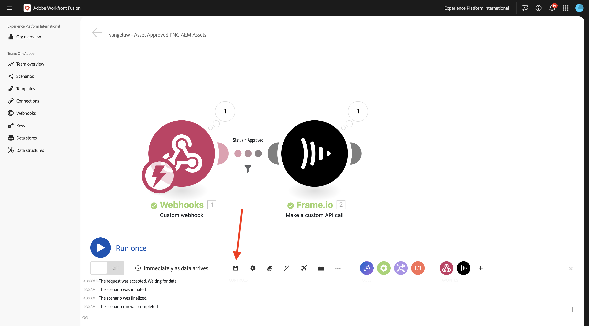
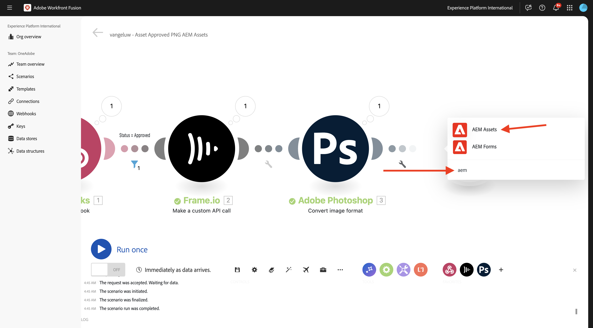
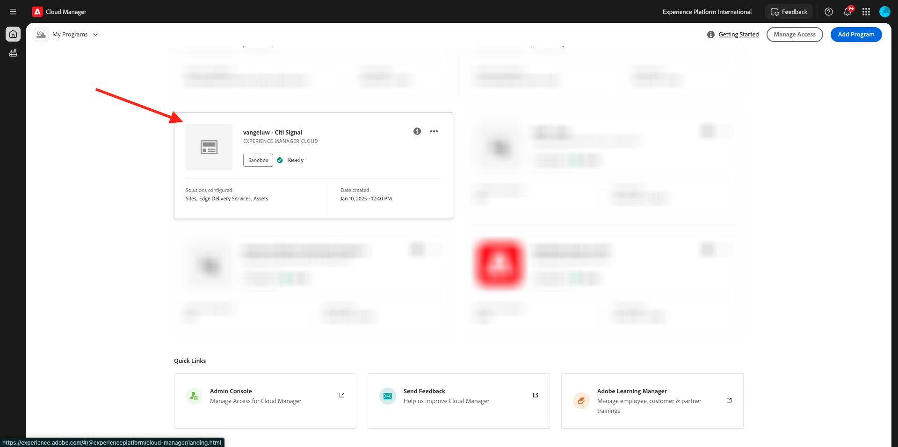
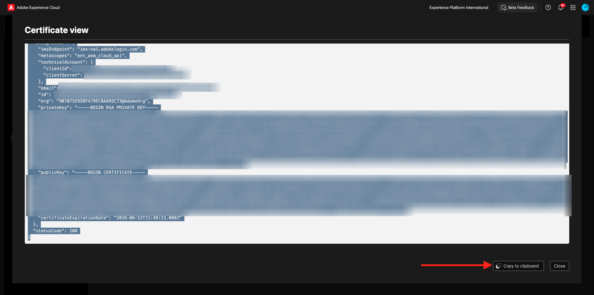
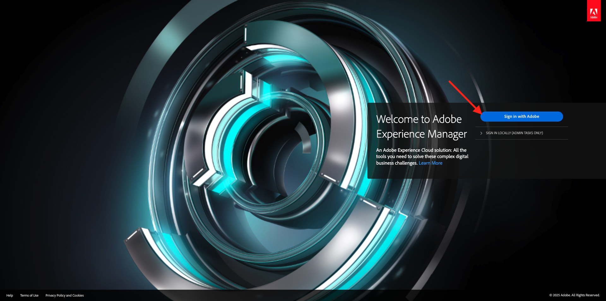

# 1.2.4 Frame I/O zu Workfront Fusion zu AEM Assets

>[!IMPORTANT]
>
>Um diese Übung abzuschließen, benötigen Sie Zugriff auf eine funktionierende AEM Assets CS Author-Umgebung. Wenn Sie der Übung [Adobe Experience Manager Cloud Service und Edge Delivery Services &#x200B;](./../../../modules/asset-mgmt/module2.1/aemcs.md){target="_blank"}, haben Sie Zugriff auf eine solche Umgebung.

>[!IMPORTANT]
>
>Wenn Sie zuvor ein AEM Assets CS-Programm mit einer Autorenumgebung konfiguriert haben, kann es sein, dass sich Ihre AEM CS-Sandbox im Ruhezustand befand. Da der Ruhezustand einer solchen Sandbox 10-15 Minuten dauert, ist es ratsam, den Ruhezustand jetzt zu deaktivieren, damit Sie nicht zu einem späteren Zeitpunkt hängen bleiben.

In der vorherigen Übung haben Sie ein Szenario konfiguriert, das mithilfe von Adobe Firefly, Photoshop-APIs und Workfront Fusion automatisch Varianten einer Adobe Photoshop PSD-Datei generiert. Die Ausgabe dieses Szenarios war eine neue Photoshop PSD-Datei.

Die Business-Teams benötigen jedoch keine PSD-Datei, sondern eine PNG-Datei oder eine JPG-Datei. In dieser Übung konfigurieren Sie eine neue Automatisierung, die dazu führt, dass eine PNG-Datei generiert wird, sobald das Asset in Frame I/O genehmigt wurde, und dass diese PNG-Datei automatisch in AEM Assets gespeichert wird.

## 1.2.4.1 Erstellen eines neuen Szenarios

Navigieren Sie zu [https://experience.adobe.com/](https://experience.adobe.com/){target="_blank"}. Öffnen Sie **Workfront Fusion**.

Gehen Sie im linken Menü zu **Szenarien** und wählen Sie Ihre `--aepUserLdap--` aus. Klicken Sie **Neues Szenario erstellen**.

Verwenden Sie den Namen `--aepUserLdap-- - Asset Approved PNG AEM Assets`. Klicken Sie als Nächstes auf die **?** Modul geben Sie den Suchbegriff `webhook` ein und klicken Sie dann auf **Webhooks**.

Klicken Sie auf **Benutzerdefinierter Webhook**.

Klicken Sie auf **Hinzufügen**, um einen neuen Webhook zu erstellen.

Verwenden Sie den Namen `--aepUserLdap-- - Frame.io Webhook`. Klicken Sie auf **Speichern**.

Sie sollten das dann sehen. Klicken Sie **Adresse in Zwischenablage kopieren**.

## 1.2.4.2 Webhook in Frame.io konfigurieren

Wechseln Sie zu Postman und öffnen Sie die Anfrage **POST - Zugriffs-Token** in der Sammlung **Adobe IO - OAuth**. Klicken Sie anschließend auf **Senden**, um ein neues **Zugriffs-Token** anzufordern.

Gehen Sie im linken Menü zurück zu **Sammlungen**. Öffnen Sie die Anfrage **POST - Webhook erstellen** in der Sammlung **Frame.io V4 - Tech Insiders** im Ordner **Webhooks**.

Navigieren Sie zum **Hauptteil** der Anfrage. Ändern Sie das Feld **name** in `--aepUserLdap--  - Fusion to AEM Assets` und ändern Sie dann das Feld **url** in den Wert der Webhook-URL, die Sie aus Workfront Fusion kopiert haben.

Klicken Sie auf **Senden**.

Ihre benutzerdefinierte Frame.io V4-Aktion wurde jetzt erstellt.

Wechseln Sie zu [https://next.frame.io/project](https://next.frame.io/project){target="_blank"} und gehen Sie zu dem zuvor erstellten Projekt, das den Namen `--aepUserLdap--` erhalten soll, und öffnen Sie den Ordner **CitiSignal Fibre Campaign**. Jetzt sollten die Assets angezeigt werden, die in der vorherigen Übung erstellt wurden.

Klicken Sie auf das **Status** und ändern Sie den Status in **In Bearbeitung**.

Wechseln Sie zurück zu Workfront Fusion. Sie sollten jetzt sehen, dass die Verbindung **Erfolgreich ermittelt** wurde.

Klicken Sie **Speichern**, um Ihre Änderungen zu speichern, und klicken Sie dann auf **Einmal ausführen**, um einen Schnelltest durchzuführen.

Wechseln Sie zurück zu Frame.io und klicken Sie auf das Feld **In Bearbeitung** und ändern Sie den Status in **Erforderliche Überprüfung**.

Wechseln Sie zurück zu Workfront Fusion und klicken Sie auf die Blase im Modul **Benutzerdefinierter Webhook**.

Die Detailansicht der Blase zeigt die Daten an, die von Frame.io empfangen wurden. Es sollten verschiedene IDs angezeigt werden. Beispielsweise zeigt das Feld **resource.id** die eindeutige ID in Frame.io des Assets **citsignal-fiber.psd**.

## 1.2.4.3 Asset-Details von Frame.io abrufen

Nachdem die Kommunikation zwischen Frame.io und Workfront Fusion über einen benutzerdefinierten Webhook hergestellt wurde, sollten Sie weitere Details zu dem Asset erhalten, für das die Statuskennzeichnung aktualisiert wurde. Dazu verwenden Sie in Workfront Fusion erneut den Frame.io-Connector, ähnlich wie in der vorherigen Übung.

Bewegen Sie den Mauszeiger über **Benutzerdefinierter Webhook**-Objekt und klicken Sie auf das Symbol **+** , um ein weiteres Modul hinzuzufügen.

Geben Sie den Suchbegriff `frame` ein. Klicken Sie auf **Frame.io**.

Klicken Sie auf **Frame.io**.

Klicken Sie **Benutzerdefinierten API-Aufruf durchführen**.

Stellen Sie sicher, dass für die Verbindung dieselbe Einstellung festgelegt ist wie in der vorherigen Übung, die `--aepUserLdap-- - Adobe I/O - Frame.io S2S` benannt werden sollte.

Verwenden Sie für die Konfiguration des Moduls **Frame.io - Erstellen eines benutzerdefinierten API-**: `/v4/accounts/{{1.account.id}}/files/{{1.resource.id}}`.

>[!NOTE]
>
>Variablen in Workfront Fusion können manuell mit dieser Syntax angegeben werden: `{{1.account.id}}` und `{{1.resource.id}}`. Die Zahl in der Variablen verweist auf das Modul im Szenario. In diesem Beispiel sehen Sie, dass das erste Modul im Szenario **Webhooks** heißt und die Sequenznummer **1 hat**. Das bedeutet, dass die Variablen `{{1.account.id}}` und `{{1.resource.id}}` vom Modul mit der Sequenznummer 1 auf dieses Feld zugreifen. Sequenznummern können manchmal unterschiedlich sein. Achten Sie daher beim Kopieren/Einfügen dieser Variablen darauf, dass die verwendete Sequenznummer immer die richtige ist.

Klicken Sie anschließend auf **+ Element hinzufügen** unter **Abfragezeichenfolge**.

Geben Sie diese Werte ein und klicken Sie auf **Hinzufügen**.

| Schlüssel | Wert |
|:-------------:| :---------------:| 
| `include` | `media_links.original` |

Du solltest das jetzt haben. Klicken Sie auf **OK**.

Klicken Sie auf **Speichern**, um Ihre Änderungen zu speichern, und klicken Sie dann auf **Einmal ausführen**, um Ihre Konfiguration zu testen.

Wechseln Sie zurück zu Frame.io und ändern Sie den Status in **In Bearbeitung**.

Gehen Sie zurück zu Workfront Fusion und klicken Sie auf die Blase im Modul **Frame.io -** eines benutzerdefinierten API-Aufrufs“. Sie sollten dann einen ähnlichen Überblick sehen.

Als Nächstes sollten Sie einen Filter einrichten, um sicherzustellen, dass nur für Assets mit dem Status **Genehmigt** eine PNG-Datei gerendert wird. Klicken Sie dazu auf das Symbol **Schraubenschlüssel** zwischen den Modulen **Benutzerdefinierter Webhook** und **Frame.io - Erstellen Sie einen benutzerdefinierten API-Aufruf** und wählen Sie dann **Filter einrichten**.

Konfigurieren Sie die folgenden Felder:

- **label**: Verwenden Sie `Status = Approved`.
- **condition**: `{{1.metadata.value[]}}`.
- **Standardoperatoren**: Wählen Sie **Gleich**.
- **Wert**: `Approved`.

Klicken Sie auf **OK**.

Sie sollten dann diese haben. Klicken Sie **Speichern**, um Ihre Änderungen zu speichern.

## 1.2.4.4 In PNG konvertieren

Bewegen Sie den Mauszeiger über das Modul **Frame.io - Erstellen Sie einen benutzerdefinierten API-Aufruf** und klicken Sie auf das Symbol **+** .

Geben Sie den Suchbegriff `photoshop` ein und klicken Sie dann auf **Adobe Photoshop**.

Klicken Sie **Bildformat konvertieren**.

Vergewissern Sie sich, **das Feld** Verbindung“ Ihre zuvor erstellte Verbindung verwendet, die `--aepUserLdap-- - Adobe IO` heißt.

Legen Sie unter **Input** das Feld **Storage** auf **External** fest und legen Sie **File Location** fest, um die Variable **Original** zu verwenden, die vom Modul **Frame.io - Erstellen eines benutzerdefinierten API-Aufrufs zurückgegeben wird**.

Klicken Sie anschließend auf **Element hinzufügen** unter **Ausgaben**.

Legen Sie für **Konfiguration** Ausgaben“ das Feld **Speicher** auf **Interner Speicher** und **Typ** auf **image/png** fest. Klicken Sie auf **Hinzufügen**.

Klicken Sie auf **OK**.

Klicken Sie auf **Speichern**, um Ihre Änderungen zu speichern, und klicken Sie dann auf **Einmal ausführen**, um Ihre Konfiguration zu testen.

Wechseln Sie zurück zu Frame.io, klicken Sie auf das Feld **In Bearbeitung** und ändern Sie den Status in **Genehmigt**.

Zurück zu Workfront Fusion. Sie sollten jetzt sehen, dass alle Module in Ihrem Szenario erfolgreich ausgeführt wurden. Klicken Sie auf den Kreis im Modul **Adobe Photoshop - Bildformat** .

In den Details der Ausführung des Moduls **Adobe Photoshop - Bildformat konvertieren** können Sie sehen, dass jetzt eine PNG-Datei generiert wurde. Der nächste Schritt besteht darin, diese Datei dann in AEM Assets CS zu speichern.

## PNG-Datei in AEM Assets CS 1.2.4.5

Bewegen Sie den Mauszeiger über das Modul **Adobe Photoshop - Bildformat** und klicken Sie auf das Symbol **+** .

Geben Sie den Suchbegriff `aem` ein und wählen Sie **AEM Assets**.

Klicken Sie **Asset hochladen**.

Jetzt müssen Sie Ihre Verbindung zu AEM Assets CS konfigurieren. Klicken Sie auf **Hinzufügen**.

Verwenden Sie die folgenden Einstellungen:

- **Verbindungstyp**: **AEM Assets as a Cloud Service**.
- **Verbindungsname**: `--aepUserLdap-- AEM Assets CS`.
- **Instanz-URL**: Kopieren Sie die Instanz-URL Ihrer AEM Assets CS-Autorenumgebung, die wie folgt aussehen sollte: `https://author-pXXXXX-eXXXXXXX.adobeaemcloud.com`.
- **Auffülloptionen für Zugriffsdetails**: Wählen Sie **JSON bereitstellen** aus.

Jetzt müssen Sie die Anmeldeinformationen für das **-Konto im JSON-Format**. Dazu müssen Sie mit AEM Cloud Manager eine Reihe von Schritten ausführen. Lassen Sie dabei diesen Bildschirm geöffnet.

Navigieren Sie zu [https://my.cloudmanager.adobe.com](https://my.cloudmanager.adobe.com){target="_blank"}. Die gewünschte Organisation ist `--aepImsOrgName--`. Sie werden dann so etwas sehen. Klicken Sie, um das Programm zu öffnen, das `--aepUserLdap-- - Citi Signal` benannt werden sollte.

Klicken Sie auf die **mit den drei Punkten…** und wählen Sie **Developer Console**.

Klicken Sie **Mit Adobe anmelden**.

Navigieren Sie **Tools** > **Integrationen**.

Klicken Sie **Neues technisches Konto erstellen**.

Sie sollten dann so etwas sehen. Öffnen Sie das neu erstellte technische Konto. Klicken Sie auf die 3 Punkte **…** und wählen Sie **Ansicht**.

Anschließend sollte eine ähnliche Payload für das Token des technischen Kontos angezeigt werden. Kopieren Sie die vollständige JSON-Payload in die Zwischenablage.

Gehen Sie zurück zu Workfront Fusion und fügen Sie die vollständige JSON-Payload in das Feld **Anmeldedaten des technischen Kontos im JSON-Format** ein. Klicken Sie auf **Fortfahren**.

Ihre Verbindung wird dann validiert. Nach erfolgreicher Authentifizierung wird Ihre Verbindung automatisch im AEM Assets-Modul ausgewählt. Als Nächstes müssen Sie einen Ordner konfigurieren. Im Rahmen der Übung sollten Sie einen neuen dedizierten Ordner erstellen.

Um einen neuen dedizierten Ordner zu erstellen, navigieren Sie zu [https://experience.adobe.com](https://experience.adobe.com/){target="_blank"}. Stellen Sie sicher, dass die richtige Experience Cloud-Instanz ausgewählt ist, die `--aepImsOrgName--` werden soll. Klicken Sie dann auf **Experience Manager Assets**.

Klicken **in** AEM Assets CS-Umgebung auf „Auswählen“, die `--aepUserLdap-- - Citi Signal dev` benannt werden sollte.

Gehen Sie zu **Assets** und klicken Sie auf **Ordner erstellen**.

Geben Sie den `--aepUserLdap-- - CitiSignal Fiber Campaign` ein und klicken Sie auf **Erstellen**.

Ihr Ordner wird dann erstellt.

Gehen Sie zurück zu Workfront Fusion, wählen Sie **Hier klicken, um Ordner auszuwählen** und wählen Sie dann den `--aepUserLdap-- - CitiSignal Fiber Campaign` aus.

Stellen Sie sicher, dass das Ziel auf `--aepUserLdap-- - CitiSignal Fiber Campaign` gesetzt ist. Wählen Sie dann unter **Source** die Option **Map** aus.

Wählen **unter „Dateiname** die Variable `{{3.filenames[1]}}`.

Wählen **unter &quot;**&quot; die Variable `{{3.files[1]}}`.

>[!NOTE]
>
>Variablen in Workfront Fusion können manuell mit der folgenden Syntax angegeben werden: `{{3.filenames[1]}}`. Die Zahl in der Variablen verweist auf das Modul im Szenario. In diesem Beispiel sehen Sie, dass das dritte Modul im Szenario **Adobe Photoshop - Bildformat konvertieren** eine Sequenznummer von **3&rbrace;**. Das bedeutet, dass die Variable `{{3.filenames[1]}}` auf das Feld **Dateinamen[]** aus dem Modul mit der Sequenznummer 3 zugreift. Sequenznummern können manchmal unterschiedlich sein. Achten Sie daher beim Kopieren/Einfügen dieser Variablen darauf, dass die verwendete Sequenznummer immer die richtige ist.

Klicken Sie auf **OK**.

Klicken Sie **Speichern**, um Ihre Änderungen zu speichern.

Als Nächstes müssen Sie bestimmte Berechtigungen für das soeben erstellte technische Konto festlegen. Als das Konto in **Developer Console** in **Cloud Manager** erstellt wurde, erhielt es **Lese**-Zugriffsrechte, aber für diesen Anwendungsfall sind **Schreib**-Zugriffsrechte erforderlich. Dies können Sie tun, indem Sie zu Ihrer AEM CS Author-Umgebung wechseln.

Navigieren Sie zu [https://my.cloudmanager.adobe.com](https://my.cloudmanager.adobe.com){target="_blank"}. Die gewünschte Organisation ist `--aepImsOrgName--`. Klicken Sie, um das Programm zu öffnen, das `--aepUserLdap-- - Citi Signal` benannt werden sollte. Sie werden dann so etwas sehen. Klicken Sie auf die Autoren-URL.

Klicken Sie **Mit Adobe anmelden**.

Navigieren Sie **Einstellungen** > **Sicherheit** > **Benutzer**.

Klicken Sie, um das Benutzerkonto des technischen Kontos zu öffnen.

Gehen Sie **Gruppen** und fügen Sie diesen Benutzer des technischen Kontos zur Gruppe **DAM-Users** hinzu.

Klicken Sie **Speichern und schließen**.

Zurück zu Workfront Fusion. Klicken Sie **Einmal ausführen**, um Ihr Szenario zu testen.

Wechseln Sie zurück zu Frame.io und stellen Sie sicher, dass der Status Ihres Assets erneut auf **Genehmigt** geändert wird.

>[!NOTE]
>
>Möglicherweise müssen Sie sie zunächst zurück in **In Bearbeitung** oder **Überprüfung erforderlich** ändern und dann wieder zurück in **Genehmigt**.

Ihr Workfront Fusio-Szenario wird dann aktiviert und sollte erfolgreich abgeschlossen werden. Wenn Sie die Informationen im Bubble im Modul **AEM Assets** anzeigen, können Sie bereits sehen, dass die PNG-Datei erfolgreich in AEM Assets CS gespeichert wurde.

Kehren Sie zu AEM Assets CS zurück und öffnen Sie die `--aepUserLdap-- - Frame.io PNG`. Jetzt sollte die PNG-Datei angezeigt werden, die im Rahmen des Workfront Fusion-Szenarios generiert wurde. Doppelklicken Sie auf die Datei, um sie zu öffnen.

Sie können jetzt weitere Details zu den Metadaten der generierten PNG-Datei sehen.

Sie haben diese Übung jetzt erfolgreich abgeschlossen.

## Nächste Schritte

Wechseln Sie zu [Zusammenfassung und Vorteile der Creative-Workflow-Automatisierung mit Workfront Fusion](./summary.md){target="_blank"}

Zurück zur [Creative-Workflow-Automatisierung mit Workfront Fusion](./automation.md){target="_blank"}

Zurück zu [Alle Module](./../../../overview.md){target="_blank"}
1,2,4