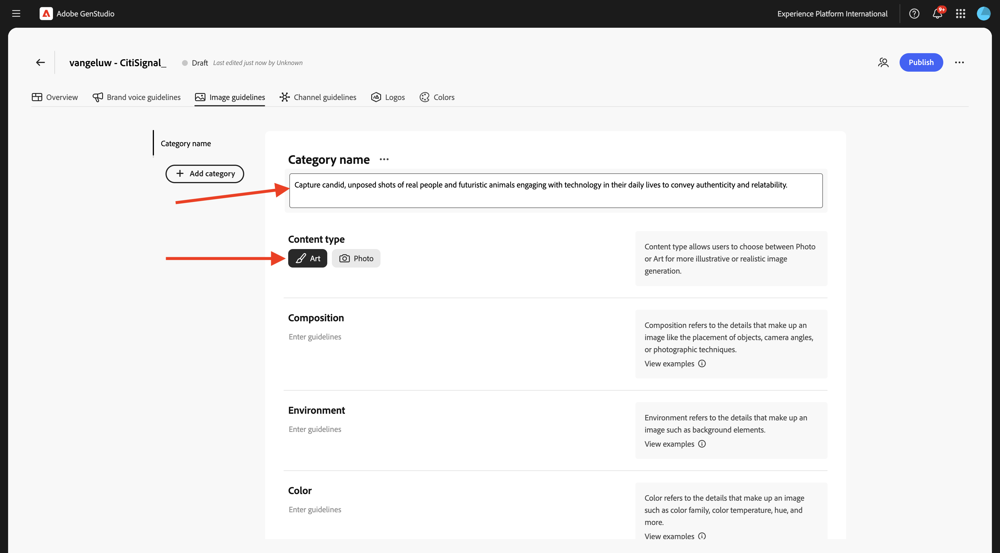
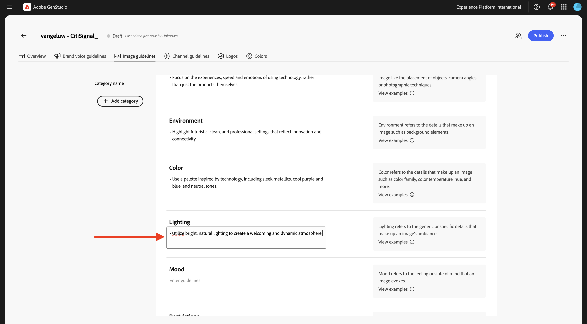
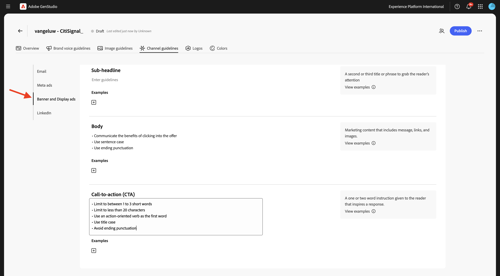
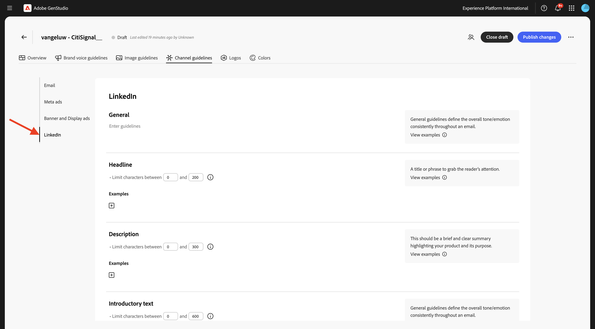

# 1.3.1 Konfiguration: Marke

Navigieren Sie zu [https://experience.adobe.com/](https://experience.adobe.com/){target="_blank"}. Öffnen Sie **GenStudio**.


Sie sollten das dann sehen.


Die erste Möglichkeit, GenStudio for Performance Marketing zu verwenden, besteht darin, Ihre Marke zu konfigurieren. Klicken Sie auf **Symbol** Marken“.


Klicken Sie auf **+ Marke hinzufügen**.


Geben Sie den `--aepUserLdap-- - CitiSignal` für Ihre Marke ein. Wählen Sie **Manuell hinzufügen** und klicken Sie dann auf **Marke hinzufügen**.


## 1.3.1.1

Sie sollten das dann sehen. Klicken Sie auf **Farben**.


Klicken Sie auf **+ Farbe hinzufügen**.


Es gibt 4 verschiedene Farben hinzuzufügen:

- `#8821F4`
- `#14161A`
- `#EEEEEE`
- `#FF006C`

Geben Sie den Hexadezimalcode für die `#8821F4` ein. Klicken Sie auf **Hinzufügen**.


Klicken Sie auf **+ Farbe hinzufügen**.


Geben Sie den Hexadezimalcode für die `#14161A` ein. Klicken Sie auf **Hinzufügen**.


Klicken Sie auf **+ Farbe hinzufügen**.


Geben Sie den Hexadezimalcode für die `#EEEEEE ` ein. Klicken Sie auf **Hinzufügen**.


Klicken Sie auf **+ Farbe hinzufügen**.


Geben Sie den Hexadezimalcode für die `#FF006C ` ein. Klicken Sie auf **Hinzufügen**.


Du solltest das jetzt haben.


## 1.3.1.2 Logos

Laden Sie die Datei [CitiSignal-GSPeM-assets.zip](../../../assets/gspem/CitiSignal-GSPeM-assets.zip) auf Ihren Desktop herunter und entpacken Sie sie.


Gehen Sie dann zu **Logos**. Klicken Sie auf **+ Logo**.


Klicken Sie auf **Durchsuchen**.


Gehen Sie zum Ordner **CitiSignal-GSPeM-assets** > **logos** und wählen Sie diese Dateien aus. Klicken Sie auf **Öffnen**.


Sie sollten dann diese haben. Klicken Sie **Logos hinzufügen**.


Sie sollten dann diese haben.


## 1.3.1.3 Richtlinien für Markenvoreinstellungen

Gehen Sie dann zu **Markenrichtlinien**.


Für **Tone &amp; Voice** verwenden Sie Folgendes:

```
• Convey a sense of exploration and adventure
• Be authentic and conversational
• Evoke excitement and curiosity
• Speak honestly and straightforwardly
• Be approachable and relatable
• Use everyday language
```


Verwenden Sie für **Markenwerte** Folgendes:

```
• Inspirational
• Sustainability
• Quality
• Durability
• Functionality
• Reliability
• Community-oriented
• Be inclusive and welcome diversity
• Encourage active lifestyles
• Promote discovery
```


Für **redaktionelle Richtlinien** verwenden Sie Folgendes:

```
• Keep sentences concise and impactful
• Use active voice
• Lists, bullets, and series should be consistent — either they all start with a noun, or they all start with a verb
• Use serial commas
```


Für **redaktionelle Einschränkungen** verwenden Sie Folgendes:

```
• Avoid activity-specific jargon unless it’s widely adopted
• Avoid promoting the skill level or experience level of the user of our outdoor equipment
• Avoid technical language or jargon
```


## 1.3.1.4 Richtlinien für Bilder

Gehen Sie dann zu **Bildrichtlinien**.


Legen Sie **Content-Typ** auf **Art** fest und verwenden Sie **Beschreibung** wie folgt:

```
Capture candid, unposed shots of real people and futuristic animals engaging with technology in their daily lives to convey authenticity and relatability.
```



Für **Komposition** verwenden Sie Folgendes:

```
Focus on the experiences, speed and emotions of using technology, rather than just the products themselves.
```


Verwenden **für &quot;**&quot; Folgendes:

```
Highlight futuristic, clean, and professional settings that reflect innovation and connectivity.
```


Verwenden Sie für **Color** Folgendes:

```
Use a palette inspired by technology, including sleek metallics, cool purple and blue, and neutral tones.
```


Verwenden **für &quot;**&quot; Folgendes:

```
Utilize bright, natural lighting to create a welcoming and dynamic atmosphere.
```



Verwenden Sie für **Mood** Folgendes:

```
Each image should evoke a feeling of speed, innovation and being part of the future.
```


Verwenden **für &quot;**&quot; Folgendes:

```
Avoid cluttered or busy backgrounds that detract from the main subject.
```


## Richtlinien für 1.3.1.4

Gehen Sie dann zu **Kanalrichtlinien**.


Verwenden **für** E-Mail) die folgenden Werte:

- **Allgemein**

```
• Use simple, short sentences
• Be clear and concise
• Invoke a sense of adventure and exploration
```

- **Betreffzeile**

```
• Limit to less than 8 words
• Provide specific details about what’s inside the email
• Use sentence case
• Do not use end punctuation
```

- **Preheader**

```
• Limit to less than 80 characters
• Provide specific details about what’s inside the email
• Use sentence case
• Use ending punctuation
```

- **Überschrift**

```
• Limit to less than 12 words
• Generate excitement through compelling and exciting statements
• Use sentence case
```

- **Unterüberschrift**: Leer lassen für den Moment

- **Textkörper**

```
• Limit to less than 120 words
• Use bullet points for lists containing more than 3 items
• Use between 0 to 4 headings within the body to separate main ideas
• Use sentence case
• Use ending punctuation
```

- **Call-to-action (CTA)**

```
• Limit to between 1 to 3 short words
• Limit to less than 20 characters
• Use an action-oriented verb as the first word and intended action the end-user should take
• Avoid ending punctuation
• Use title case
```


Verwenden **für**-Anzeigen die folgenden Werte:

- **Allgemein**

```
• Use simple, short sentences
• Be clear and concise
• Invoke a sense of adventure and exploration
• Make product names prominent
• Use community-building concepts and language
```

- **Überschrift**

```
• Limit  to less than 8 words
• Limit to less than 27 characters
• Make it clear what action the reader should take
• Use sentence case
• Avoid ending punctuation
```

- **Textkörper**

```
• Limit to less than 125 characters
• Use sentence case
• Use ending punctuation
```

- **Bei Bildtext**: vorerst leer lassen


Verwenden **für Banner- und** die folgenden Werte:

- **Allgemein**

```
• Make readers feel inspired, interested, and sure of the next step
• Avoid word repetition
• Make product names prominent
```

- **Überschrift**

```
• Clearly state the main benefit of the offer
• Use sentence case
• Use ending punctuation
• Limit to less than 60 characters
```

- **Unterüberschrift**: Leer lassen für den Moment

- **Textkörper**

```
• Communicate the benefits of clicking into the offer
• Use sentence case
• Use ending punctuation
```

- **Call-to-action (CTA)**

```
• Limit to between 1 to 3 short words
• Limit to less than 20 characters
• Use an action-oriented verb as the first word
• Use title case
• Avoid ending punctuation
```



Verwenden **für &quot;**&quot; die folgenden Werte:

- **Allgemein**: Leer lassen für den Moment

- **Überschrift**: Leer lassen für den Moment

- **Beschreibung**: Leer lassen für den Moment

- **Einführungstext**: Leer lassen für den Moment

- **Bei Bildtext**: vorerst leer lassen



Navigieren Sie abschließend zu **Übersicht**. Sie können jetzt einen Überblick über alles sehen, was Sie konfiguriert haben. Es gibt noch eine letzte Sache zu tun. Klicken Sie auf **+** unter **Wann diese Marke verwendet werden soll**.


Geben Sie den folgenden Text ein und klicken Sie auf **Änderungen speichern**.

```
This is the default brand for CitiSignal marketing campaign. Use the CitiSignal brand for all brand and product campaigns that don't require specific guidelines.
```


Klicken Sie auf **Veröffentlichen**.


Klicken **erneut auf** Veröffentlichen“.


Ihre Marke ist jetzt veröffentlicht und diese Marke kann jetzt zum Erstellen von markenspezifischen Inhalten verwendet werden. Klicken Sie auf **Fertig**.


## Nächste Schritte

Navigieren Sie zu [Konfiguration: Rollen, Produkte und Vorlagen](./ex2.md){target="_blank"}

Zurück zu [GenStudio for Performance Marketing](./genstudio.md){target="_blank"}

Zurück zu [Alle Module](./../../../overview.md){target="_blank"}
