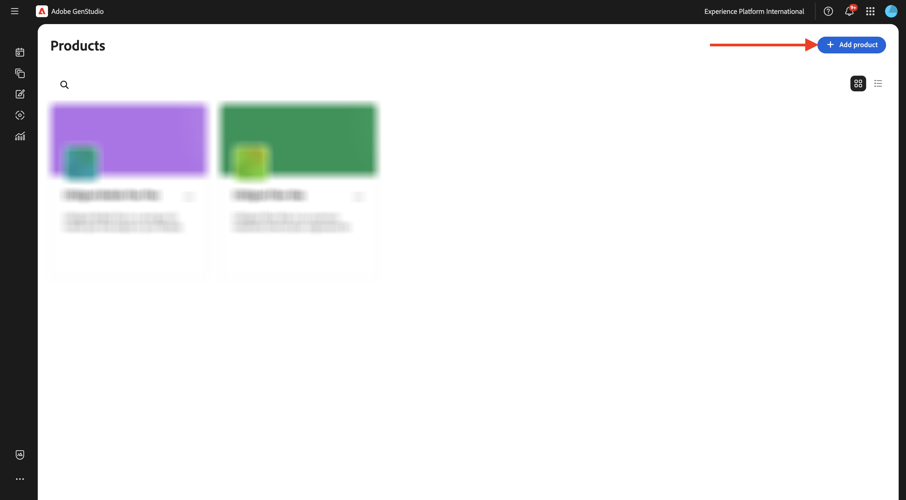
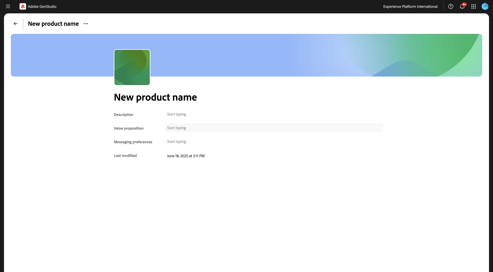
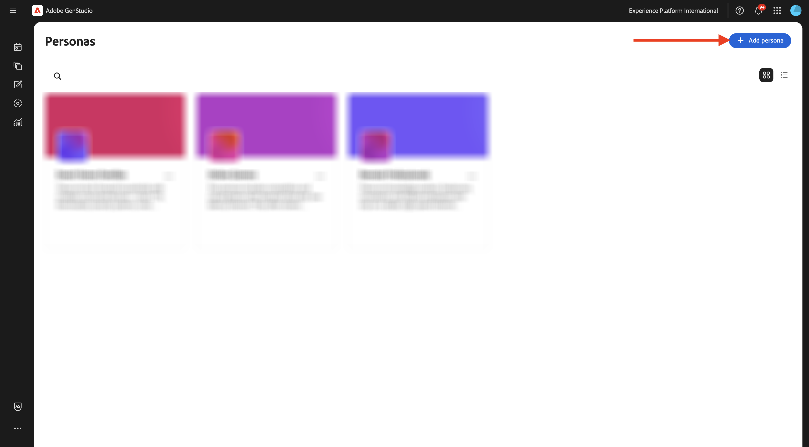
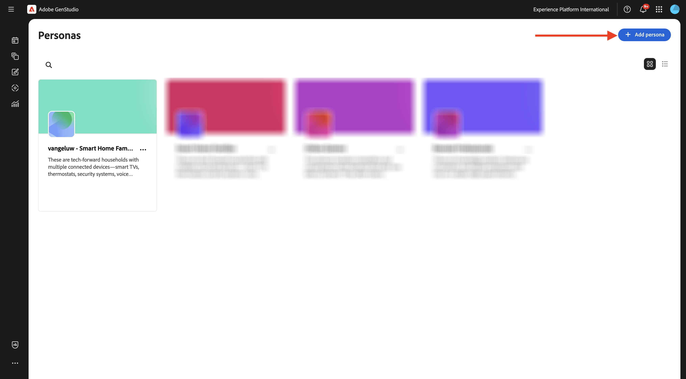
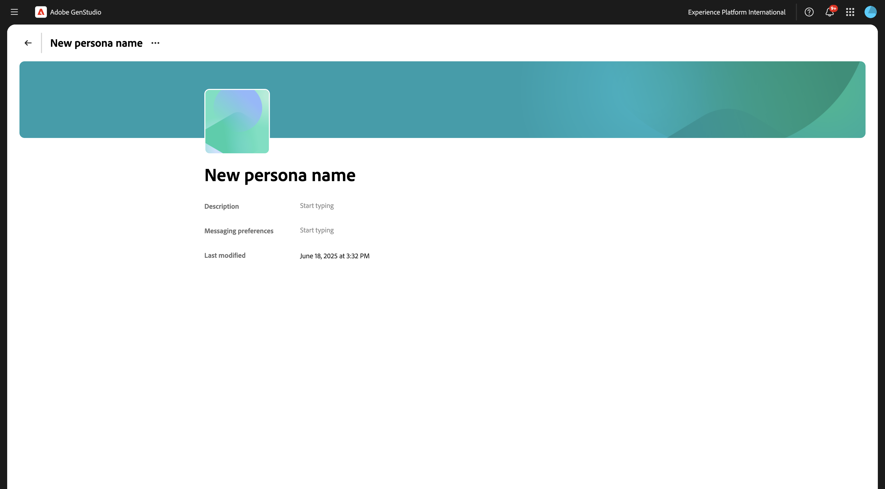
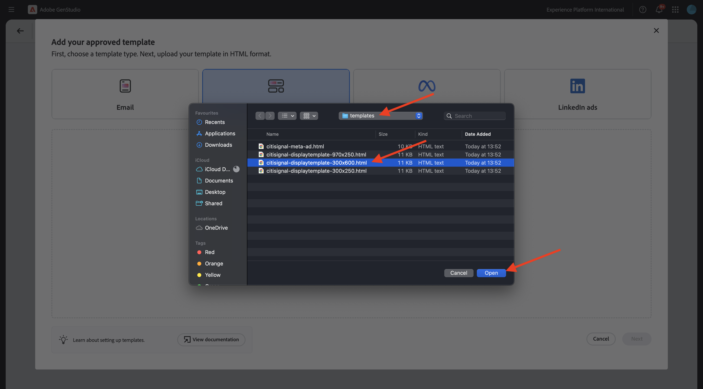
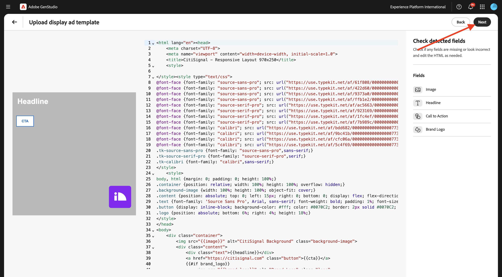
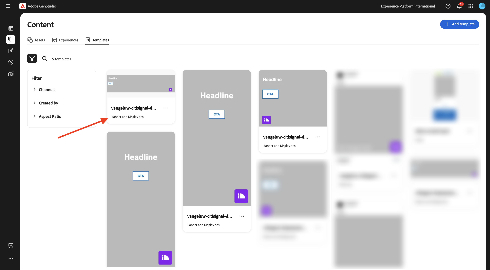

# 1.3.2 Konfiguration: Rollen, Produkte und Vorlagen

In dieser Übung konfigurieren Sie Rollen, Produkte und Vorlagen in GenStudio for Performance Marketing.

## 1.3.2.1 Produkte

Produkte in GenStudio for Performance Marketing nutzen ein umfassendes Verständnis von Produktspezifikationen, Vorteilen und Unterscheidungsfaktoren, um wirkungsvolle Inhalte zu generieren.

Produkte umfassen alle Elemente eines bestimmten Produkts, z. B. Bilder, Beschreibungen und Wertangebote, um eine kohärente Markendarstellung zu schaffen. Durch die Nutzung der fortschrittlichen KI-Technologie von Adobe arbeiten GenStudio for Performance Marketing-Richtlinien - Marken, Produkte und Rollen - zusammen, um überzeugende Inhalte zu generieren, die die Stärken Ihrer Produkte aufzeigen und Konsistenz über alle Messaging-Bereiche hinweg sicherstellen.

Um Ihre eigenen Produkte zu erstellen, klicken Sie auf die 3 Punkte **…** und wählen Sie **Produkte**.


Klicken Sie auf **+ Produkt hinzufügen**.



Wählen Sie **Manuell hinzufügen** aus und klicken Sie auf **Weiter**.


Sie sollten das dann sehen.


Für den Produktnamen verwenden Sie `--aepUserLdap-- - CitiSignal Mobile Flex Plan`.

Verwenden Sie für **Feld** Beschreibung) Folgendes:

```
CitiSignal Mobile Flex is a next-gen 5G mobile plan that adapts to your lifestyle. Choose from Unlimited, Family Share, or Data Saver tiers, with optional add-ons like international roaming, hotspot tethering, and SmartFamily™ parental controls. All plans include priority access to CitiSignal’s 5G UltraWide network and seamless integration with CitiSignal Fiber for unified billing, shared data pools, and SmartSwitch™ connectivity. 
```

Verwenden Sie für das Feld **Wertvorschlag** Folgendes:

```
A mobile plan that flexes with your life—fast, fair, and fully connected to your world.
```

Verwenden Sie für das Feld **Messaging-**) Folgendes:

```
Remote Professionals: “Work from anywhere with a mobile plan that’s as flexible as your schedule.”
Online Gamers: “Unlimited 5G. No throttling. Just pure performance—on the go.”
Smart Home Families: “One plan. One bill. One less thing to worry about.”
```

Ihre Produktkonfiguration sollte jetzt wie folgt aussehen. Klicken Sie auf das **Zurück**-Symbol.


Klicken Sie auf **+ Produkt hinzufügen**.


Wählen Sie **Manuell hinzufügen** aus und klicken Sie auf **Weiter**.


Sie sollten das dann sehen.



Für den Produktnamen verwenden Sie `--aepUserLdap-- - CitiSignal Fiber Max`.

Verwenden Sie für **Feld** Beschreibung) Folgendes:

```
CitiSignal Fiber Max is our premium residential internet plan, engineered for households that demand uncompromising speed, stability, and coverage. With symmetrical speeds up to 2 Gbps, it’s ideal for remote professionals juggling Zoom calls and cloud apps, gamers chasing millisecond precision, and families running dozens of smart devices. The plan includes a Wi-Fi 6E router, optional mesh extenders for whole-home coverage, and proactive network monitoring. 
```

Verwenden Sie für das Feld **Wertvorschlag** Folgendes:

```
Power your work, play, and home with the fastest, most reliable fiber internet—built for the way you live today and tomorrow.
```

Verwenden Sie für das Feld **Messaging-**) Folgendes:

```
Remote Professionals: “Stay connected, stay productive—no matter how many meetings or megabytes your day demands.”
Online Gamers: “Zero lag. Zero mercy. Dominate with 2 Gbps fiber and ultra-low ping.”
Smart Home Families: “Every room. Every device. Always on. Welcome to whole-home harmony.”
```

Ihre Produktkonfiguration sollte jetzt wie folgt aussehen. Klicken Sie auf das **Zurück**-Symbol.


Sie sollten dann die beiden Produkte sehen, die Sie konfiguriert haben.


## 1.3.2.2 Personas

Personas bieten eine authentische Darstellung Ihrer Kundensegmente, einschließlich Informationen, Interessen, Problembereichen, Voreinstellungen und Verhaltenseigenschaften.

GenStudio for Performance Marketing nutzt die Leistungsfähigkeit von Richtlinien - Marken, Produkte und Personas - sowie die generative KI-Technologie von Adobe, um personalisierte Marketing-Inhalte für Ihre Zielkunden zu kuratieren&#x200B;

Um mit der Erstellung Ihrer Personas zu beginnen, klicken Sie auf die 3 Punkte **…** und wählen Sie dann **Personas** aus.


Klicken Sie auf **+ Persona hinzufügen**.



Wählen Sie **Manuell hinzufügen** aus und klicken Sie auf **Weiter**.


Sie sollten das dann sehen.


Für den Personennamen `--aepUserLdap-- - Smart Home Families` Sie .

Verwenden Sie für **Feld** Beschreibung) Folgendes:

```
These are tech-forward households with multiple connected devices—smart TVs, thermostats, security systems, voice assistants, and more. They value convenience, automation, and seamless connectivity across the home. They often have children and are concerned about online safety, parental controls, and whole-home coverage.
```

Verwenden Sie für das Feld **Messaging-**) Folgendes:

```
Friendly, family-oriented tone
Visuals showing whole-home coverage and device compatibility
Messaging that highlights security, parental controls, and easy setup
Bundled offers (e.g., mesh Wi-Fi, smart home consultations)
How-to content or setup guides for non-tech-savvy users
```

Ihre persönliche Konfiguration sollte jetzt wie folgt aussehen. Klicken Sie auf das **Zurück**-Symbol.


Klicken Sie auf **+ Persona hinzufügen**.



Wählen Sie **Manuell hinzufügen** aus und klicken Sie auf **Weiter**.


Sie sollten das dann sehen.


Für den Personennamen `--aepUserLdap-- - Online Gamers` Sie .

Verwenden Sie für **Feld** Beschreibung) Folgendes:

```
This persona includes competitive and casual gamers who demand ultra-fast, low-latency internet. They often stream gameplay, participate in multiplayer matches, and use voice chat platforms. They are highly sensitive to lag, jitter, and packet loss, and they’re vocal about their experiences online. Many are early adopters of new tech and value performance above all else.
```

Verwenden Sie für das Feld **Messaging-**) Folgendes:

```
Bold, energetic tone with gaming lingo
Metrics like ping time, jitter, and upload/download speeds
Visuals showing latency improvements or side-by-side comparisons
Endorsements from gaming influencers or esports teams
Promotions tied to gaming platforms or bundles (e.g., free months of Xbox Game Pass)
```

Ihre persönliche Konfiguration sollte jetzt wie folgt aussehen. Klicken Sie auf das **Zurück**-Symbol.


Klicken Sie auf **+ Persona hinzufügen**.


Wählen Sie **Manuell hinzufügen** aus und klicken Sie auf **Weiter**.


Sie sollten das dann sehen.



Für den Personennamen `--aepUserLdap-- - Remote Professionals` Sie .

Verwenden Sie für **Feld** Beschreibung) Folgendes:

```
These are knowledge workers, freelancers, consultants, and hybrid employees who rely on a stable, high-speed internet connection to maintain productivity from home. Their workdays are filled with video calls, cloud-based collaboration, and large file transfers. They often use multiple devices simultaneously and expect seamless performance across all of them. Many are tech-savvy and value proactive customer support and service transparency.
```

Verwenden Sie für das Feld **Messaging-**) Folgendes:

```
Clear, professional tone with a focus on productivity and reliability
Testimonials or case studies from similar professionals
Visuals like speed comparison charts and uptime guarantees
Emphasis on 24/7 support and service-level agreements
Messaging that highlights “work-from-anywhere” flexibility
```

Ihre persönliche Konfiguration sollte jetzt wie folgt aussehen. Klicken Sie auf das **Zurück**-Symbol.


Sie sollten dann die drei von Ihnen konfigurierten Personas sehen.


## Vorlagen 1.3.2.3

GenStudio for Performance Marketing ermöglicht es Inhaltserstellern, anhand von Vorlagen schnell konsistente markeninterne Marketing-Inhalte zu erstellen. Eine Vorlage reduziert den Zeit- und Arbeitsaufwand für die Erstellung neuer Inhalte erheblich, indem sie einen Ausgangspunkt bereitstellt, der vorkonfigurierte Layouts und Design-Elemente umfasst.

GenStudio for Performance Marketing unterstützt zwar nicht die direkte Erstellung von Vorlagen innerhalb des Programms, aber Sie können Vorlagen einfach mit gängigen Design-Tools wie Adobe InDesign, Illustrator oder Express entwerfen und vorbereiten. Sobald Ihr Design abgeschlossen ist, können Sie es für die Verwendung in GenStudio for Performance Marketing anpassen. In dieser Übung importieren Sie eine Reihe vordefinierter Vorlagen in GenStudio for Performance Marketing.

In der vorherigen Übung haben Sie die Datei [CitiSignal-GSPeM-assets.zip](../../../assets/gspem/CitiSignal-GSPeM-assets.zip) auf Ihren Desktop heruntergeladen und entpackt. Dieser Ordner enthält vier Beispielvorlagen, die Sie jetzt in GenStudio importieren müssen.


Navigieren Sie **Inhalt** > **Vorlagen**. Klicken Sie auf **+ Vorlage hinzufügen**.


Wählen Sie **Meta-Anzeigen** und klicken Sie dann auf **Durchsuchen**.


Navigieren Sie im Ordner, der die heruntergeladenen **CitiSignal-GSPeM-assets**-Dateien enthält, zum Ordner **templates**. Wählen Sie die Datei **Citisignal-meta-ad.html** aus und klicken Sie auf **Öffnen**.


Sie sollten das dann sehen. Klicken Sie auf **Weiter**.


Klicken Sie auf **Weiter**.


Verwenden Sie dies für das Feld **Vorlagenname**:
`--aepUserLdap---citisignal-meta-ad` und setzen Sie das Seitenverhältnis auf **1:1**. Klicken Sie **Vorlage veröffentlichen**.


Ihre Vorlage wurde jetzt gespeichert und ist in der Vorlagenbibliothek verfügbar.


Klicken Sie auf **+ Vorlage hinzufügen**.


Wählen Sie **Banner und Display-Anzeigen** aus und klicken Sie dann auf **Durchsuchen**.


Navigieren Sie im Ordner, der die heruntergeladenen **CitiSignal-GSPeM-assets**-Dateien enthält, zum Ordner **templates**. Wählen Sie die Datei **Citisignal-displayTemplate-300x250.html** aus und klicken Sie auf **Öffnen**.


Sie sollten das dann sehen. Klicken Sie auf **Weiter**.


Klicken Sie auf **Weiter**.


Verwenden Sie dies für das Feld **Vorlagenname**:
`--aepUserLdap---citisignal-displaytemplate-300x250` und setzen Sie **Anzeigenbreite** und **Anzeigenhöhe** auf **300x250**. Klicken Sie **Vorlage veröffentlichen**.


Ihre Vorlage wurde jetzt gespeichert und ist in der Vorlagenbibliothek verfügbar.


Klicken Sie auf **+ Vorlage hinzufügen**.


Wählen Sie **Banner und Display-Anzeigen** aus und klicken Sie dann auf **Durchsuchen**.


Navigieren Sie im Ordner, der die heruntergeladenen **CitiSignal-GSPeM-assets**-Dateien enthält, zum Ordner **templates**. Wählen Sie die Datei **citsignal-displayTemplate-300x600.html** aus und klicken Sie auf **Öffnen**.



Sie sollten das dann sehen. Klicken Sie auf **Weiter**.


Klicken Sie auf **Weiter**.


Verwenden Sie dies für das Feld **Vorlagenname**:
`--aepUserLdap---citisignal-displaytemplate-300x600` und setzen Sie **Anzeigenbreite** und **Anzeigenhöhe** auf **300x600**. Klicken Sie **Vorlage veröffentlichen**.


Ihre Vorlage wurde jetzt gespeichert und ist in der Vorlagenbibliothek verfügbar.


Klicken Sie auf **+ Vorlage hinzufügen**.


Wählen Sie **Banner und Display-Anzeigen** aus und klicken Sie dann auf **Durchsuchen**.


Navigieren Sie im Ordner, der die heruntergeladenen **CitiSignal-GSPeM-assets**-Dateien enthält, zum Ordner **templates**. Wählen Sie die Datei **Citisignal-displayTemplate-970x250.html** aus und klicken Sie auf **Öffnen**.


Sie sollten das dann sehen. Klicken Sie auf **Weiter**.


Klicken Sie auf **Weiter**.



Verwenden Sie dies für das Feld **Vorlagenname**:
`--aepUserLdap---citisignal-displaytemplate-970x250` und setzen Sie **Anzeigenbreite** und **Anzeigenhöhe** auf **970x250**. Klicken Sie **Vorlage veröffentlichen**.


Ihre Vorlage wurde jetzt gespeichert und ist in der Vorlagenbibliothek verfügbar.



Sie haben jetzt die Vorlagen konfiguriert, die Sie für die nächste Übung benötigen.

## Nächste Schritte

Gehen Sie zu [Kampagnenaktivierung zu Meta](./ex3.md){target="_blank"}

Zurück zu [GenStudio for Performance Marketing](./genstudio.md){target="_blank"}

Zurück zu [Alle Module](./../../../overview.md){target="_blank"}
