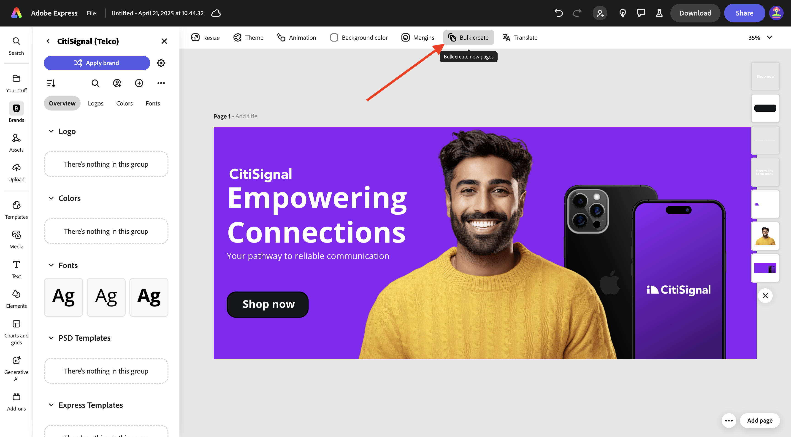
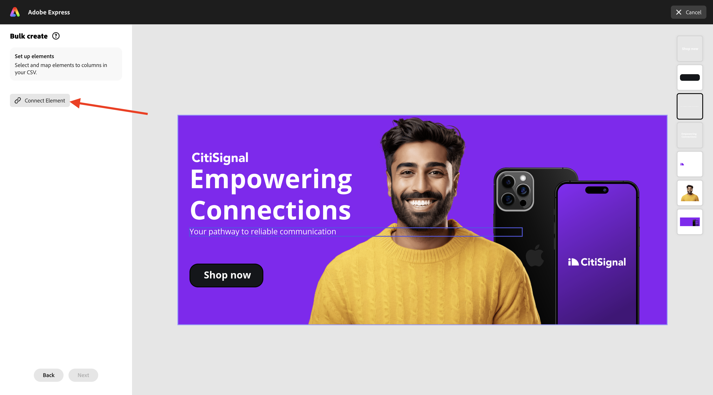
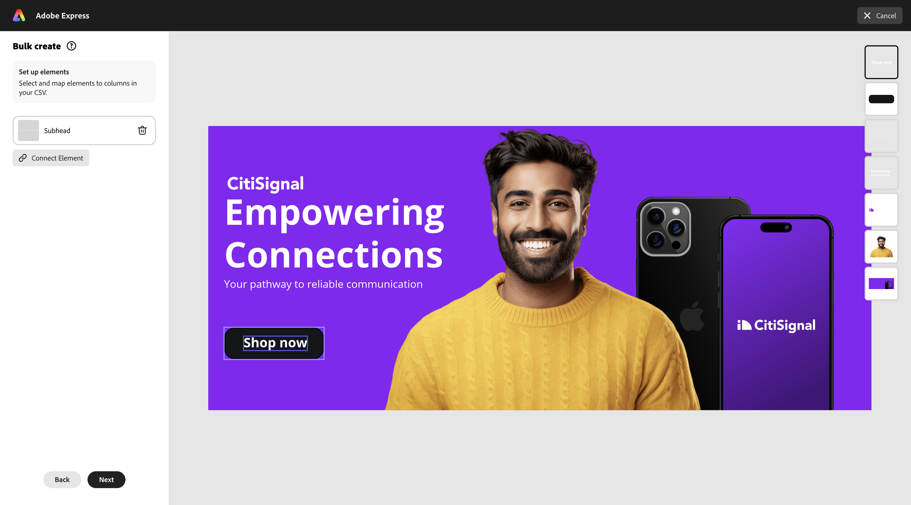
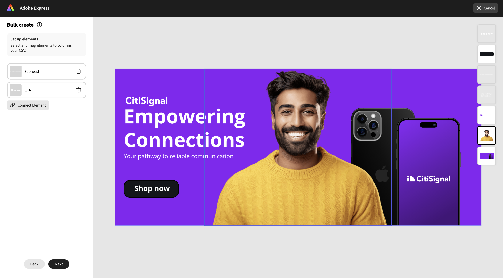

# 1.3.3 Massenproduktion von Assets in Adobe Express

Bevor Sie mit dieser Übung beginnen, laden Sie die erforderlichen Assets von [https://tech-insiders.s3.us-west-2.amazonaws.com/one-adobe/Adobe_Express.zip](https://tech-insiders.s3.us-west-2.amazonaws.com/one-adobe/Adobe_Express.zip){target="_blank"} herunter und entpacken Sie sie auf Ihrem Desktop.

## 1.3.3.1 Erstellen eines Basis-Assets

Navigieren Sie zu [https://new.express.adobe.com/](https://new.express.adobe.com/){target="_blank"}. Klicken Sie auf das Symbol **+** , um ein neues **Bild** zu erstellen.

Wählen Sie **Foto** und dann **Medien hochladen** aus.

Navigieren Sie zu Ihrem Desktop, zum Ordner **Adobe_Express** der die zuvor heruntergeladenen Assets enthält. Wählen Sie die Datei **banner.png** aus und klicken Sie auf **Öffnen**.

Sie sollten das dann sehen. Wählen Sie **Bild bearbeiten** aus.

Gehen Sie dann zu **Media** und wählen Sie **Bild hochladen** aus. Navigieren Sie zu Ihrem Desktop, zum Ordner **Adobe_Express** der die zuvor heruntergeladenen Assets enthält. Wählen Sie die Datei **man.png** und klicken Sie auf **Öffnen**.

Sie sollten das dann sehen.

Als Nächstes sollten Sie das **CitiSignal**-Logo hinzufügen. Gehen Sie zu **Marken** und wählen Sie das weiße CitiSignal-Logo aus. Klicken Sie auf die 3 Punkte **…** und wählen Sie **Ort**.

Passen Sie die Position des CitiSignal-Logobilds an, um dieselbe Position im folgenden Bild wiederzugeben.

Wechseln Sie zu **Text** und klicken Sie auf **Text hinzufügen**.

Fügen Sie im neuen Textfeld den `Empowering Connections` hinzu. Ziehen Sie das Textfeld an eine ähnliche Position, wie in der folgenden Abbildung dargestellt. Gehen Sie dann zu **Marken**, zu **Schriftarten**. Klicken Sie auf die 3 Punkte **…** auf der 3. Schriftart und klicken Sie auf **Anwenden**.

Ändern Sie anschließend die Schriftfarbe in **weiß**.

Wechseln Sie erneut **Text** und klicken Sie auf **Text hinzufügen**.

Geben Sie in das neue Textfeld den `Your pathway to reliable communication` ein. Passen Sie die Position des Textfelds so an, dass es sich unter dem vorherigen Textfeld befindet, ähnlich wie in der Abbildung unten.

Wechseln Sie zu **Marken**, zu **Schriftarten** und klicken Sie auf die 3 Punkte **…** auf der zweiten Schriftart. Klicken Sie dann auf **Übernehmen**.

Sie sollten dann diese haben. Gehen Sie dann zu **Elemente**, zu **Formen** und klicken Sie auf das abgerundete Rechteck-Shape.

Sie erhalten dann eine neue abgerundete Rechteckform auf Ihrem Bild. Passen Sie Größe und Position so an, dass sie wie eine Schaltfläche aussehen. Ändern Sie dann die Farbe des gerundeten Rechtecks in **schwarz**.

Wechseln Sie erneut **Text** und klicken Sie auf **Text hinzufügen**.

Geben Sie den `Shop now` in das neue Textfeld ein und ändern Sie die Position des Textfelds, sodass es auf der Schaltfläche zentriert ist. Wechseln Sie zu **Marken**, zu **Schriftarten** und klicken Sie auf die 3 Punkte **…** auf der dritten Schriftart. Klicken Sie dann auf **Übernehmen**.

Sie sollten das dann sehen.

## 1.3.3.2 Massenerstellung in Adobe Express

Klicken Sie anschließend auf **Massenerstellung**.

Sie sollten das dann sehen. Klicken Sie **Durchsuchen**.

Navigieren Sie zu Ihrem Desktop und wählen Sie den Ordner **Express Bulk Create** im Ordner **Adobe_Express** aus, der die zuvor heruntergeladenen Assets enthält. Wählen Sie die Datei **CTA-options.csv** aus und klicken Sie auf **Öffnen**.

Sie sollten das dann sehen. Klicken Sie auf **Weiter**.

Klicken Sie auf **Element verbinden**.

Wählen Sie das Textfeld aus, das den Text enthält **Ihr Weg zu zuverlässiger Kommunikation**. Klicken Sie dann auf **Element 1** und verknüpfen Sie sie mit einem Feld aus der CSV-Datei, in diesem Fall mit dem Feld **Untertitel**.

Wählen Sie anschließend das Textfeld aus, das den Text „Jetzt **&quot;**.

Klicken Sie dann auf **Element 1** und verknüpfen Sie sie mit einem Feld aus der CSV-Datei, in diesem Fall mit dem Feld **CTA**.

Sie sollten das dann sehen. Klicken Sie anschließend auf das Bild der Person.

Klicken Sie auf die Schaltfläche **Element 1**.

Dann sehen Sie dieses Popup. Klicken Sie **Durchsuchen**.

Navigieren Sie zu Ihrem Desktop und wählen Sie den Ordner **Express Bulk Create** im Ordner **Adobe_Express** aus, der die zuvor heruntergeladenen Assets enthält. Wählen Sie 6-7 Bilddateien aus und klicken Sie auf **Öffnen**.

Sie werden es dann sehen. Ziehen Sie für jede Variante des Assets ein anderes Bild per Drag-and-Drop hinüber. Klicken Sie auf **Fertig**

Sie sehen dann die Varianten des generierten Bildes. Klicken Sie **Seite(n) erstellen**.

Ihre Varianten sind jetzt bereit, und Sie können jede einzelne einzeln überprüfen, um sie zu überprüfen und zu validieren.

Sie haben jetzt diese Übung abgeschlossen.

## Nächste Schritte

Wechseln Sie zu [Zusammenfassung und Vorteile](./summary.md){target="_blank"}

Zurück zu [Adobe Express und Adobe Experience Cloud](./express.md){target="_blank"}

Zurück zu [Alle Module](./../../../overview.md){target="_blank"}