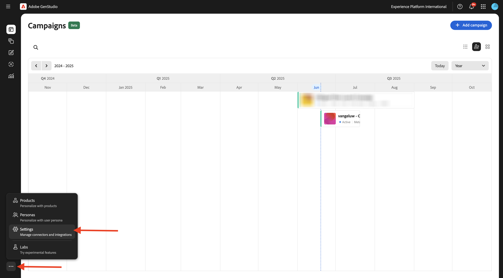
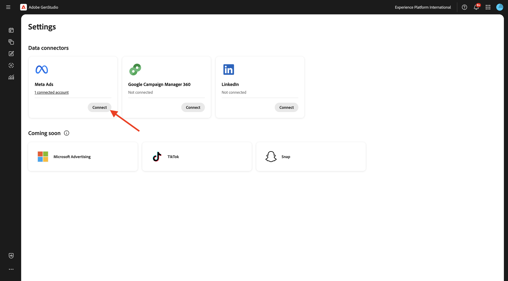
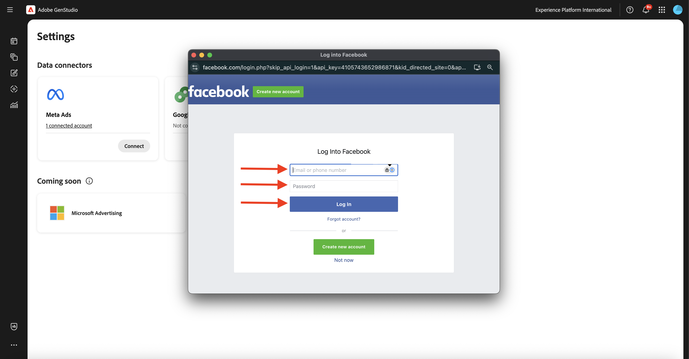
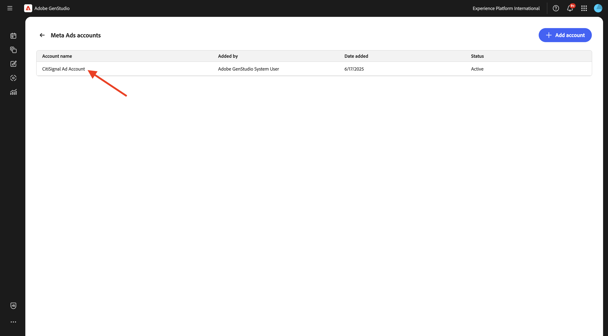
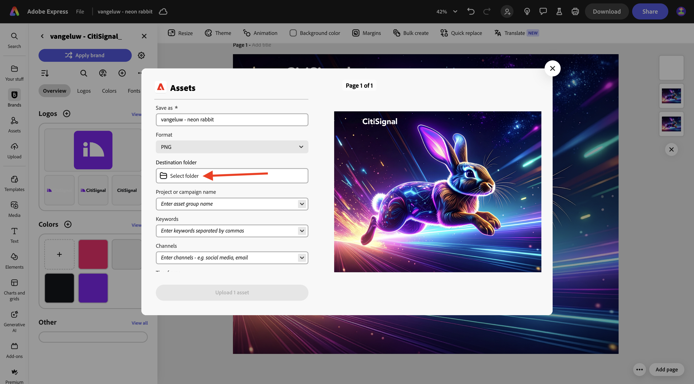
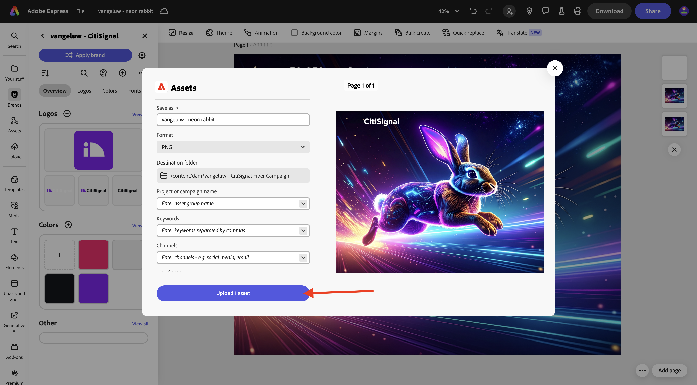
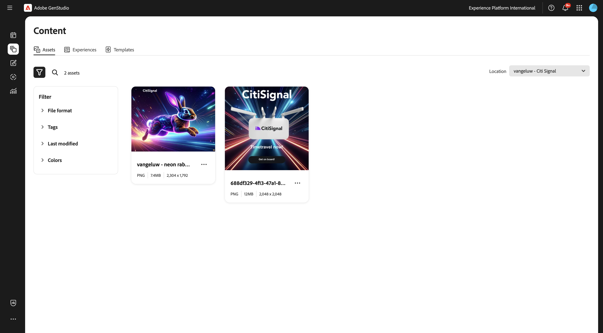

# 1.3.3 Kampagnenaktivierung für Meta

>[!IMPORTANT]
>
>Um diese Übung abzuschließen, benötigen Sie Zugriff auf eine funktionierende AEM Assets CS Author-Umgebung mit aktiviertem AEM Content Hub. Wenn Sie der Übung [Adobe Experience Manager Cloud Service und Edge Delivery Services ](./../../../modules/asset-mgmt/module2.1/aemcs.md){target="_blank"}, haben Sie Zugriff auf eine solche Umgebung.

>[!IMPORTANT]
>
>Wenn Sie zuvor ein AEM Assets CS-Programm mit einer Authoring- und AEM Assets-Umgebung konfiguriert haben, kann es sein, dass sich Ihre AEM CS-Sandbox im Ruhezustand befand. Da der Ruhezustand einer solchen Sandbox 10-15 Minuten dauert, ist es ratsam, den Ruhezustand jetzt zu beenden, damit Sie nicht zu einem späteren Zeitpunkt warten müssen.

## 1.3.3.1 Kampagne erstellen

GenStudio for Performance Marketing Navigieren Sie in **0** im **Menü auf der linken Seite zu „Kampagnen“.** Klicken Sie auf **+ Kampagne**.


Anschließend sollte eine leere Kampagnenübersicht angezeigt werden.


Verwenden Sie für den Feldnamen `--aepUserLdap-- - CitiSignal Fiber Launch Campaign`.

Verwenden Sie für **Feld** Beschreibung“ den folgenden Text.

```
The CitiSignal Fiber Launch campaign introduces CitiSignal’s flagship fiber internet service—CitiSignal Fiber Max—to key residential markets. This campaign is designed to build awareness, drive sign-ups, and establish CitiSignal as the go-to provider for ultra-fast, reliable, and future-ready internet. The campaign will highlight the product’s benefits for remote professionals, online gamers, and smart home families, using persona-driven messaging across digital and physical channels.
```

Verwenden Sie für **Feld „Ziel** den folgenden Text.

```
Generate brand awareness in target regions
Drive early sign-ups and pre-orders for CitiSignal Fiber Max
Position CitiSignal as a premium, customer-first fiber internet provider
Educate consumers on the benefits of fiber over cable or DSL
```

Verwenden Sie für das Feld **Key Messaging** den folgenden Text.

```
Supporting Points:
Symmetrical speeds up to 2 Gbps
Whole-home Wi-Fi 6E coverage
99.99% uptime guarantee
24/7 concierge support
No data caps or throttling
 Channels:
Digital Advertising: Google Display, YouTube pre-roll, Meta (Facebook/Instagram), TikTok (for gamers)
Email Marketing: Persona-segmented drip campaigns
Social Media: Organic and paid posts with testimonials, speed demos, and influencer partnerships
Out-of-Home (OOH): Billboards, transit ads in suburban commuter corridors
Local Events: Pop-up booths at tech expos, family festivals, and gaming tournaments
Direct Mail: Personalized flyers with QR codes for early sign-up discounts
 
Target Regions:
Primary Launch Markets:
Denver Metro Area, CO
Austin, TX
Raleigh-Durham, NC
Salt Lake City, UT
Demographic Focus:
Suburban neighborhoods with high remote work density
Areas with high smart home adoption
Zip codes with underserved or dissatisfied cable customers
```

Sie sollten dann Folgendes haben:


Scrollen Sie nach unten, um weitere Felder anzuzeigen:


Wählen Sie für **Feld** das heutige Datum aus.

Legen Sie für das Feld **Ende** das Datum in einem Monat fest.

Legen Sie für **Feld** Status“ auf **Aktiv** fest.

Legen Sie das Feld **Kanäle** auf **Meta**, **Email**, **Paid Media**, **Display** fest.

Wählen Sie für **Feld** Regionen“ eine Region Ihrer Wahl aus.

Für das Feld Für das Feld **Verweise** > **Produkte** wählen Sie die `--aepUserLdap-- - CitiSignal Fiber Max`.

**Verweise** > **Personas**: Wählen Sie die `--aepUserLdap-- - Remote Professionals`, `--aepUserLdap-- - Online Gamers`, `--aepUserLdap-- - Smart Home Families` aus

Sie sollten dies dann sehen:


Ihre Kampagne ist jetzt bereit. Klicken Sie auf den **Pfeil**, um zurückzukehren.


Ihre Kampagne wird dann in der Liste angezeigt. Klicken Sie auf das Symbol Kalenderansicht , um die Ansicht zum Kampagnenkalender zu ändern.


Anschließend sollte ein Kampagnenkalender angezeigt werden, der einen visuelleren Eindruck davon vermittelt, welche Kampagnen zu welchem Zeitpunkt aktiv sind.


## 1.3.3.2-Setup-Verbindung mit Meta

>[!IMPORTANT]
>
>Um Ihre Verbindung mit Meta einzurichten, benötigen Sie ein Meta-Benutzerkonto. Dieses Benutzerkonto muss einem Meta Business-Konto hinzugefügt werden.

Um die Verbindung zu Meta einzurichten, klicken Sie auf die 3 Punkte **…** und wählen Sie **Einstellungen**.



Klicken Sie auf **Verbinden** für **Meta-Anzeigen**.



Melden Sie sich mit Ihrem Meta-Konto an. Klicken Sie auf **Fortfahren**.



Wenn Ihr Konto mit einem Meta Business-Konto verknüpft ist, können Sie das in Meta konfigurierte Geschäftsportfolio auswählen.


Nachdem die Verbindung erfolgreich hergestellt wurde, klicken Sie auf die Zeile, in der **X verbundene(s) Konto(e)** steht.


Sie sollten dann die Details des Meta Business-Kontos sehen, das mit GenStudio for Performance Marketing verbunden ist.



## 1.3.3.3 Neues Asset erstellen

Navigieren Sie zu [https://firefly.adobe.com/](https://firefly.adobe.com/){target="_blank"}. Geben Sie den `a neon rabbit running very fast through space` ein und klicken Sie auf **Generieren**.


Anschließend werden mehrere Bilder generiert. Wählen Sie das Bild aus, das Ihnen am besten gefällt, klicken Sie auf das Symbol **Freigeben** auf dem Bild und wählen Sie dann **In Adobe Express öffnen**.


Anschließend wird das soeben generierte Bild in Adobe Express zur Bearbeitung verfügbar. Jetzt müssen Sie das CitiSignal-Logo auf dem Bild hinzufügen. Navigieren Sie dazu zu **Marken**.


Anschließend sollte die in GenStudio for Performance Marketing erstellte CitiSignal-Markenvorlage in Adobe Express angezeigt werden. Klicken Sie, um Ihre Markenvorlage auszuwählen, die `--aepUserLdap-- - CitiSignal` benannt werden soll.


Gehen Sie zu **Logos** und klicken Sie auf das **weiß** Citisignal-Logo, um es auf dem Bild abzulegen.


Positionieren Sie das CitiSignal-Logo oben links.


Klicken Sie anschließend auf **Freigeben**.


**AEM Assets**.


Klicken Sie **Ordner auswählen**.



Wählen Sie Ihr AEM Assets CS-Repository mit dem Namen `--aepUserLdap-- - CitiSignal` und dann die `--aepUserLdap-- - CitiSignal Fiber Campaign` aus. Klicken Sie auf **Auswählen**.


Sie sollten das dann sehen. Klicken Sie **1 Asset hochladen**. Ihr Bild wird jetzt in AEM Assets CS hochgeladen.



Navigieren Sie zu [https://experience.adobe.com/](https://experience.adobe.com/){target="_blank"}. Öffnen Sie **Experience Manager Assets**.


Wählen Sie Ihre AEM Assets CS-Umgebung aus, die `--aepUserLdap-- - CitiSignal dev` benannt werden soll.


Wechseln Sie zu **Assets** und doppelklicken Sie dann auf die `--aepUserLdap-- - CitiSignal Fiber Campaign`.


Sie sollten dann etwas Ähnliches sehen. Doppelklicken Sie auf die `--aepUserLdap-- - neon rabbit`.


Das `--aepUserLdap-- - neon rabbit` wird dann angezeigt. Ändern Sie **Status** in **Genehmigt** und klicken Sie dann auf **Speichern**

>[!IMPORTANT]
>
>Wenn der Status eines Bildes nicht auf **Genehmigt** festgelegt ist, ist das Bild in GenStudio for Performance Marketing nicht sichtbar. In GenStudio for Performance Marketing sind nur genehmigte Assets verfügbar.


Wechseln Sie zurück zu GenStudio for Performance Marketing. Wechseln Sie im linken Menü zu **Assets** und wählen Sie Ihr AEM Assets CS-Repository aus, das `--aepUserLdap-- - CitiSignal` benannt werden soll. Das soeben erstellte und genehmigte Bild wird dann in GenStudio for Performance Marketing verfügbar.



## 1.3.3.4 Erstellen und Genehmigen einer Meta-Anzeige

## 1.3.3.5 Anzeigen in Meta veröffentlichen

## Nächste Schritte

Wechseln Sie zu [Zusammenfassung und Vorteile](./summary.md){target="_blank"}

Zurück zu [GenStudio for Performance Marketing](./genstudio.md){target="_blank"}

Zurück zu [Alle Module](./../../../overview.md){target="_blank"}
