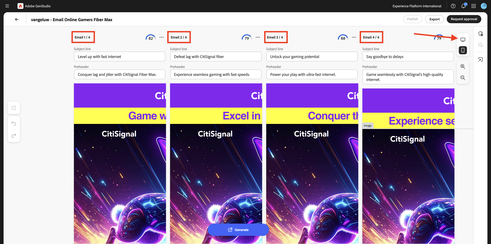
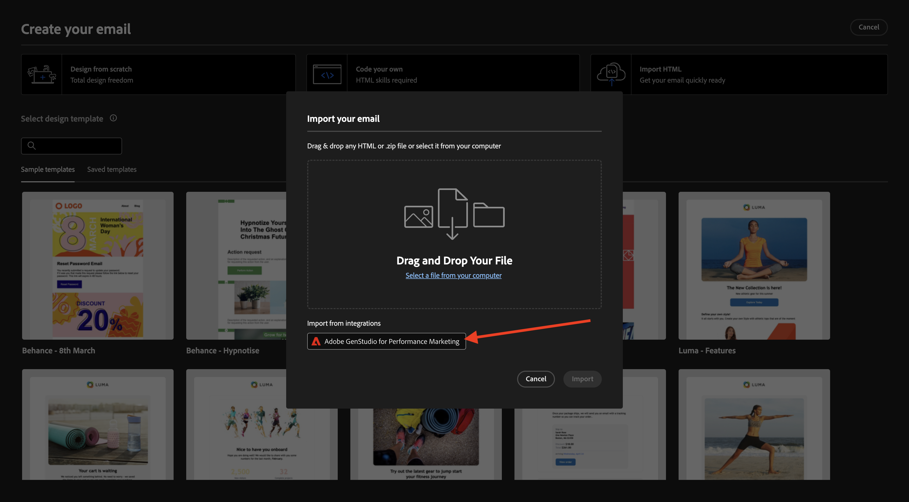
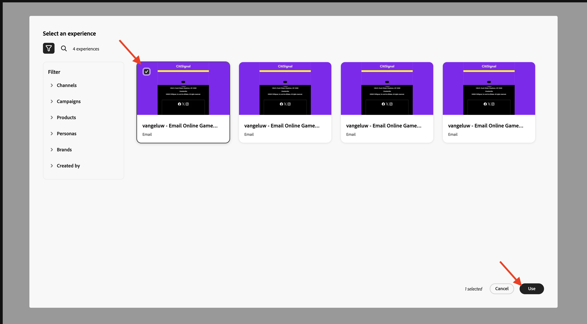

# 1.3.4 E-Mail-Erlebnis für AJO erstellen

>[!IMPORTANT]
>
>Um diese Übung abzuschließen, benötigen Sie Zugriff auf eine Adobe Journey Optimizer-Umgebung, die für die Integration mit GenStudio for Performance Marketing bereitgestellt wird, welche sich derzeit in der Beta-Phase befindet.

>[!IMPORTANT]
>
>Um alle Schritte in dieser Übung ausführen zu können, benötigen Sie Zugriff auf eine bestehende Adobe Workfront-Umgebung. In dieser Umgebung müssen Sie ein Projekt und einen Genehmigungs-Workflow erstellt haben. Wenn Sie die Übungen [Workflow-Verwaltung mit Adobe Workfront](./../../../modules/workflow-planning/module1.2/workfront.md){target="_blank"} befolgen, stehen Ihnen die erforderlichen Einstellungen zur Verfügung.

## E-Mail-Erlebnis 1.3.4.1 erstellen und genehmigen

Navigieren Sie im linken Menü zu **Erstellen**. Wählen Sie **E-Mail** aus.


Wählen Sie die **E-Mail**-Vorlage aus, die Sie zuvor importiert haben und die `--aepUserLdap---citisignal-email-template` heißt. Klicken Sie **Verwenden**.


Sie sollten das dann sehen. Ändern Sie den Namen Ihrer Anzeige in `--aepUserLdap-- - Email Online Gamers Fiber Max`.


Wählen **unter** die folgenden Optionen aus:

- **Marke**: `--aepUserLdap-- - CitiSignal`
- **language**: `English (US)`
- **Persona**: `--aepUserLdap-- - Online Gamers`
- **Produkt**: `--aepUserLdap-- - CitiSignal Fiber Max`

Klicken Sie **Aus Inhalt auswählen**.


Wählen Sie die Asset-`--aepUserLdap-- - neon rabbit.png` aus. Klicken Sie **Verwenden**.


Geben Sie den `convince online gamers to start playing online multiplayer games using CitiSignal internet` ein und klicken Sie auf **Generieren**.


Sie sollten dann so etwas wie das hier sehen, wobei vier E-Mail-Varianten generiert werden. Die Standardansicht zeigt die Ansicht **Mobiltelefon**. Sie können zur Desktopansicht wechseln, indem Sie auf das Symbol **Computer** klicken.



Für jede E-Mail wird automatisch ein Konformitätswert berechnet. Klicken Sie auf die Punktzahl, um weitere Details anzuzeigen.


Klicken Sie **Probleme anzeigen und beheben**.


Anschließend können Sie mehr Details dazu sehen, was Sie tun können, um den Kompatibilitätswert zu optimieren.


Klicken Sie anschließend auf **Genehmigung anfordern**, um eine Verbindung zu Adobe Workfront herzustellen.


Wählen Sie Ihr Adobe Workfront-Projekt aus, das `--aepUserLdap-- - CitiSignal Fiber Launch` benannt werden soll. Geben Sie unter **Personen einladen** Ihre eigene E-Mail-Adresse ein und stellen Sie sicher, dass Ihre Rolle auf &quot;**&quot;** ist.


Alternativ können Sie auch einen vorhandenen Genehmigungs-Workflow in Adobe Workfront verwenden. Klicken Sie dazu auf **Vorlage verwenden** und wählen Sie die `--aepuserLdap-- - Approval Workflow` aus. Klicken Sie auf **Senden**.


Klicken Sie **Kommentare in Workfront anzeigen**, um zur Benutzeroberfläche für den Adobe Workfront-Korrekturabzug weitergeleitet zu werden.


Klicken Sie in der Adobe Workfront-Benutzeroberfläche für Korrekturabzüge auf **Entscheidung treffen**.


Wählen Sie **Genehmigt** und klicken Sie auf **Entscheidung treffen**.


Klicken Sie auf **Veröffentlichen**.


Wählen Sie Ihre Campaign-`--aepUserLdap-- - CitiSignal Fiber Launch Campaign` aus und klicken Sie auf **Veröffentlichen**.


Klicken Sie **Im Inhalt öffnen**.


Die vier E-Mail-Erlebnisse sind jetzt unter **Inhalt** > **Erlebnisse** verfügbar.


## 1.3.4.2 Erstellen einer Kampagne in AJO

Melden Sie sich bei Adobe Journey Optimizer an, indem Sie zu [Adobe Experience Cloud wechseln](https://experience.adobe.com). Auf **Journey Optimizer**.


Sie werden zur Ansicht **Startseite** in Journey Optimizer weitergeleitet. Stellen Sie zunächst sicher, dass Sie die richtige Sandbox verwenden. Die zu verwendende Sandbox heißt `--aepSandboxName--`. Sie befinden sich dann in der **Startseite**-Ansicht Ihres Sandbox-`--aepSandboxName--`.


Im Folgenden erstellen Sie eine Kampagne. Im Gegensatz zum ereignisbasierten Journey der vorherigen Übung, das auf eingehenden Erlebnisereignissen oder Zielgruppeneintritten oder -austritten beruht, um eine Journey für einen bestimmten Kunden Trigger, richten sich Kampagnen mit einzigartigen Inhalten wie Newslettern, einmaligen Werbeaktionen oder allgemeinen Informationen oder regelmäßig mit ähnlichen Inhalten, die regelmäßig gesendet werden, wie z. B. Geburtstagskampagnen und Erinnerungen.

Gehen Sie im Menü zu **Kampagnen** und klicken Sie auf **Kampagne erstellen**.


Wählen Sie **Geplant - Marketing** und klicken Sie auf **Erstellen**.


Konfigurieren Sie im Bildschirm zur Kampagnenerstellung Folgendes:

- **Name**: `--aepUserLdap--  - Online Gamers CitiSignal Fiber Max`.
- **Beschreibung**: Glasfaser-Kampagne für Online-Gamer

Klicken Sie auf **Aktionen**.


Klicken Sie auf **+ Aktion hinzufügen** wählen Sie dann **E-Mail** aus.


Wählen Sie dann eine vorhandene **E-Mail-Konfiguration** und klicken Sie auf **Inhalt bearbeiten**.


Sie werden es dann sehen. Verwenden Sie für **Betreffzeile** Folgendes:

```
{{profile.person.name.firstName}}, say goodbye to delays!
```

Klicken Sie anschließend auf **Inhalt bearbeiten**.


Klicken Sie **HTML importieren**.


Klicken Sie anschließend auf die Schaltfläche für **Adobe GenStudio for Performance Marketing**.



Anschließend sollte ein Popup-Fenster mit allen in GenStudio for Performance Marketing veröffentlichten E-Mail-Erlebnissen angezeigt werden. Wählen Sie eines der verfügbaren E-Mail-Erlebnisse aus und klicken Sie auf **Verwenden**.



Wählen Sie Ihr eigenes AEM Assets CS-Repository mit dem Namen `--aepUserLdap-- - CitiSignal dev` aus und klicken Sie auf **Importieren**.


Sie sollten das dann sehen. Wählen Sie die Schaltfläche Fehlendes Bild aus und klicken Sie auf **Asset auswählen**.


Wechseln Sie zu dem Ordner, der wie folgt aussieht, beginnend mit **GenStudio.zip…..** und wählen Sie die `--aepUserLdap-- - neon rabbit.png` aus. Klicken Sie auf **Auswählen**


Sie sollten das dann sehen.


Scrollen Sie nach unten zur Fußzeile, wählen Sie das Wort **Abmelden** und klicken Sie auf das Symbol **Link**.


Legen Sie **Typ** auf **Externes Opt-out/Abmeldung** und die URL auf `https://techinsiders.org/unsubscribe.html` fest (es ist nicht zulässig, eine leere URL für den Abmelde-Link zu haben).

Klicken Sie **auf** und dann auf den **Pfeil** in der linken oberen Ecke Ihres Bildschirms, um zur Kampagnenkonfiguration zurückzukehren.


Navigieren Sie zu **Zielgruppe**.


Klicken Sie **Zielgruppe auswählen**.


Wählen Sie die Zielgruppe der Abonnement-Liste für Online-Gamer aus, die `--aepUserLdap--_SL_Interest_Online_Gaming` benannt werden soll. Klicken Sie auf **Speichern**.


Klicken Sie auf **Zum Aktivieren überprüfen**.


Wenn Ihre Kampagnenkonfiguration keine Probleme aufweist, können Sie auf &quot;**&quot;**.


Ihre Kampagne wird dann aktiviert, was einige Minuten dauert.


Nach einigen Minuten ist die Kampagne live und die E-Mail wird an die von Ihnen ausgewählte Abonnement-Liste gesendet.


Sie haben jetzt diese Übung abgeschlossen.

## Nächste Schritte

Wechseln Sie zu [Zusammenfassung und Vorteile](./summary.md){target="_blank"}

Zurück zu [GenStudio for Performance Marketing](./genstudio.md){target="_blank"}

Zurück zu [Alle Module](./../../../overview.md){target="_blank"}
