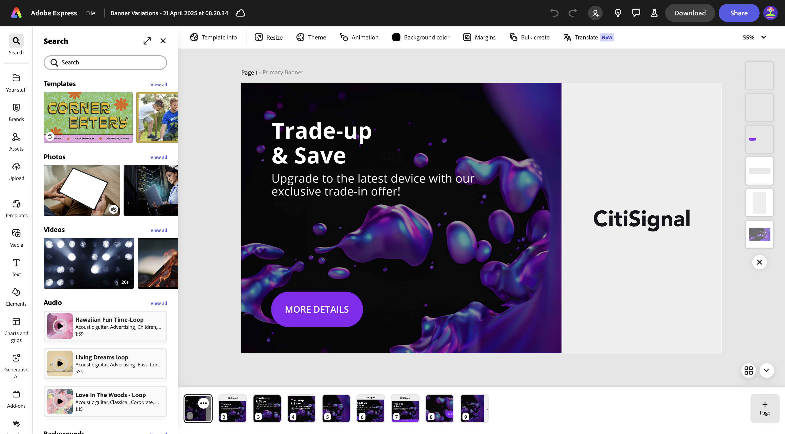
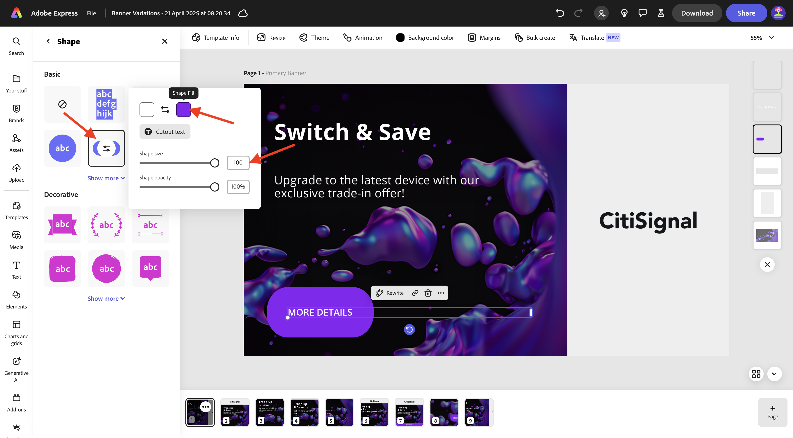
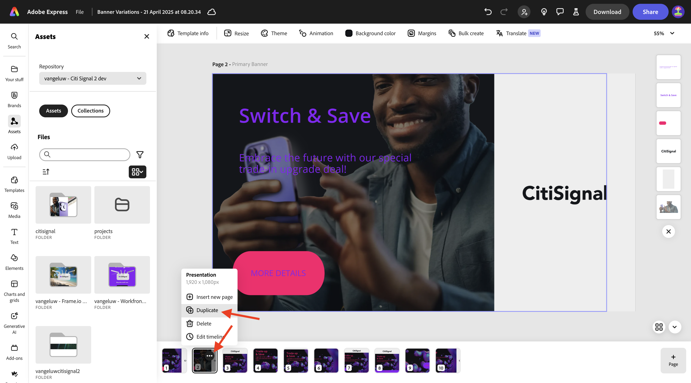
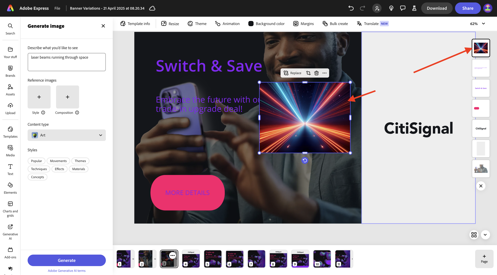
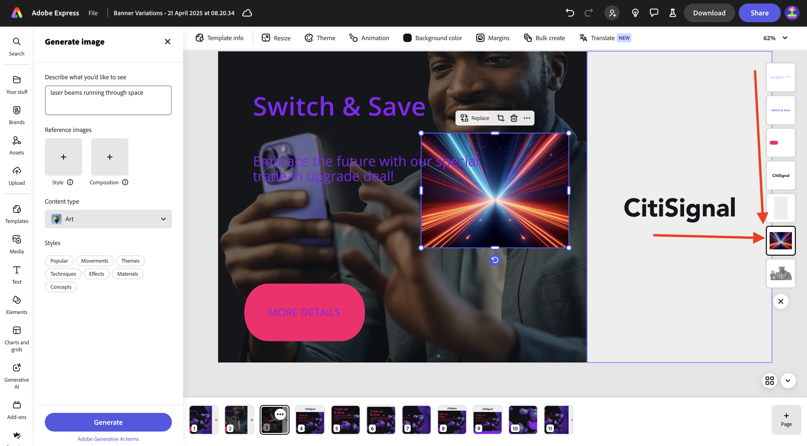
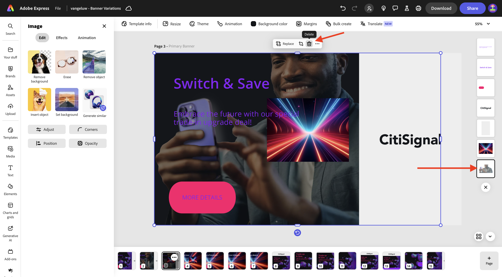
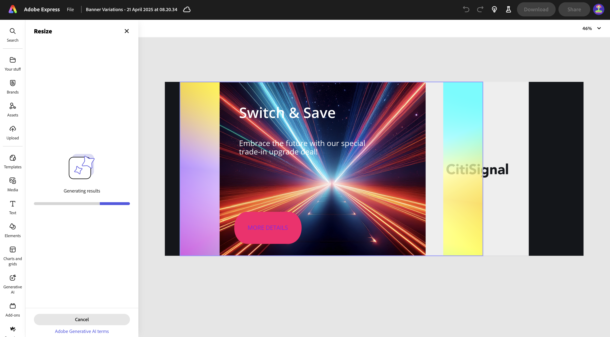
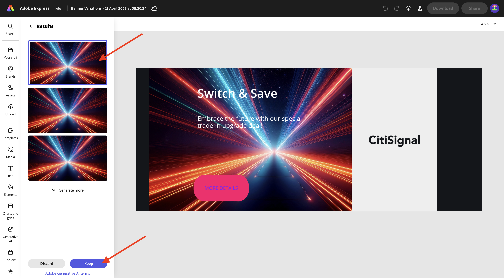
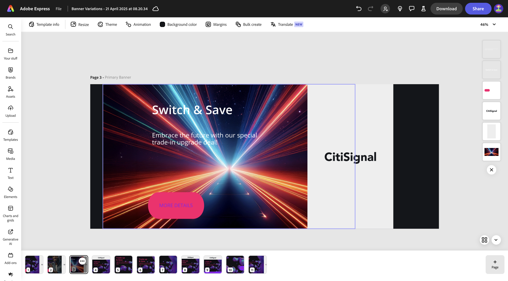

# 1.4.1 Erste Schritte mit Adobe Express

## 1.4.1.1 Anmelden bei Adobe Express

Öffnen Sie ein neues Inkognito-Browser-Fenster und navigieren Sie zu [https://www.adobe.com/home](https://www.adobe.com/home){target="_blank"}. Melden Sie sich mit Ihrem **Firmen- oder Schulkonto** an und wählen Sie dann die **`--aepImsOrgName--`** aus.

Adobe Express steht Ihnen als Teil der Lizenzen Ihres Unternehmens zur Verfügung. Um sicherzustellen, dass Sie Zugriff auf Adobe Express haben, müssen Sie sicherstellen, dass Sie bei der richtigen Organisation angemeldet sind. Klicken Sie dazu auf das Symbol **Profil** und überprüfen Sie, welches Konto aktiv ist. Das Konto, das Sie verwenden sollten, heißt `--aepImsOrgName--`.

Klicken Sie auf **Profil wechseln**, um das Konto zu ändern.

Wählen Sie das richtige Konto aus dem Menü aus, in diesem Fall **Experience Platform International** (aber das kann für Sie eine andere Organisation sein).

Sobald das rechte Konto aktiv ist, navigieren Sie zu **Apps** und klicken Sie auf **Erste Schritte** auf der Karte **Adobe Express**.

Sie sind jetzt bei **Adobe Express angemeldet**.

## 1.4.1.2 Erste Schritte mit einer Markenvorlage

Navigieren Sie in Adobe Express zu **Marken**. Ihre Markenvorlagenbibliothek ist derzeit wahrscheinlich leer. CitiSignal hat zuvor eine Markenvorlage definiert, und Sie sollten diese vorhandene Vorlage jetzt wiederverwenden.

Navigieren Sie dazu zu [https://www.adobe.com/files/link/1c2f92cf-17bc-4d11-6031-dbd251e6cb57](https://www.adobe.com/files/link/1c2f92cf-17bc-4d11-6031-dbd251e6cb57).

Sie sollten das dann sehen. Klicken Sie auf die 3 Punkte **…**.

Wählen Sie **Kopie erstellen** aus.

Nach etwa einer Minute sollte eine Meldung angezeigt werden, die bestätigt, dass Sie eine persönliche Kopie der Markenvorlage erstellt haben.

Kehren Sie zu Adobe Express und **Marken** zurück und aktualisieren Sie die Seite. Jetzt sollte die Markenvorlage **CitiSignal (Telco)** angezeigt werden. Klicken Sie hier, um die **CitiSignal (Telco)** zu öffnen.

Sie sollten dann eine Bibliothek mit Assets wie Logos, Schriftarten, Farben, Vorlagen usw. sehen.

Wechseln Sie zu **Express-Vorlagen** und klicken Sie, um die Vorlage &quot;**Varianten“** öffnen.

Klicken Sie **Neue Datei starten**.

Sie sollten das dann sehen.

Klicken Sie auf das Textfeld mit **Trade-up &amp; Save**. Wählen Sie anschließend **Neu schreiben** und wählen Sie einen Stil aus und klicken Sie dann auf **Generieren**.

Wählen Sie eine Variante aus und klicken Sie auf **Ersetzen**.

Anschließend sollte der aktualisierte Text angezeigt werden.

Klicken Sie anschließend auf den Text **WEITERE DETAILS**.

Wählen Sie **Effekte** aus.

Wechseln Sie zu **Form** und klicken Sie auf **Alle anzeigen**.

Klicken Sie auf **finetune**-Schaltfläche. Ändern Sie die **Shape-Größe** und klicken Sie dann auf die Farbschaltfläche.

Ändern Sie die Farbe, indem Sie eine andere Farbe aus dem **CitiSignal-Farbschema** auswählen.

Sie sollten dann die geänderte Schaltfläche sehen.

Gehen Sie dann zu **Marken** und klicken Sie auf **Marke anwenden**. Anschließend sollte das Erscheinungsbild der Bildänderung zu sehen sein.

Beachten Sie, dass Sie die Einstellungen unter **Marke anwenden** auch durch Klicken auf das Symbol **Zahnrad** detailliert festlegen können.

Klicken Sie anschließend auf die 3 Punkte **…** auf dem Bild, an dem Sie gerade arbeiten, und klicken Sie dann auf **Duplizieren**.

Anschließend sollte ein neues, identisches Bild angezeigt werden. Klicken Sie auf die Hintergrundebene auf der rechten Bildschirmseite.

>[!IMPORTANT]
>
>Um diese Übung abzuschließen, benötigen Sie Zugriff auf eine funktionierende AEM Assets CS Author-Umgebung. Wenn Sie der Übung [Adobe Experience Manager Cloud Service und Edge Delivery Services ](./../../../modules/asset-mgmt/module2.1/aemcs.md){target="_blank"}, haben Sie Zugriff auf eine solche Umgebung.

Wechseln Sie zu **Assets** Wählen Sie im linken Menü Ihr AEM Assets CS-Repository aus, das `--aepUserLdap-- - CitiSignal dev` benannt werden soll. Gehen Sie dann zum Ordner **Citisignal**.

Wählen Sie das Bild **homepage-hero-1.png** aus. Anschließend sollte sich die Hintergrundebene ändern.

Wählen Sie das Textfeld wie angegeben aus und klicken Sie auf **Neu schreiben**. Wählen Sie **Umformulieren** und dann einen bestimmten Stil aus. Klicken Sie **Generieren**.

Wählen Sie eine Variante aus und klicken Sie auf **Ersetzen**.

Sie sollten das dann sehen. Klicken Sie anschließend auf die 3 Punkte **…** unten auf der Seite und klicken Sie auf **Duplizieren**.

Wechseln Sie im neu erstellten Bild zu **media** und klicken Sie auf **Image erstellen**.

Wählen Sie **Querformat (4:3)**.

Geben Sie den `laser beams running through space` ein und klicken Sie auf **Generieren**.

Anschließend sollte ein von Adobe Firefly generiertes Bild angezeigt werden. Beachten Sie, dass sich die Ebene, in der das Bild generiert wurde, ganz oben befindet.

Verschieben Sie das neu generierte Bild nach unten und legen Sie es direkt über der vorherigen Hintergrundebene ab.

Entfernen Sie die alte Hintergrundebene, indem Sie darauf klicken und **Löschen** auswählen.

Passen Sie das Bild so an, dass es die gesamte Arbeitsfläche einnimmt.

Wählen Sie das Textfeld **Umschalten und Speichern** aus, um die Schriftfarbe in &quot;**&quot;** ändern.

Ändern Sie die Schriftfarbe in **weiß**.

Wählen Sie das andere Textfeld aus, um auch die Schriftfarbe in &quot;**&quot;** ändern.

Ändern Sie die Schriftfarbe in **weiß**.

Klicken Sie anschließend auf **Größe ändern** und geben Sie eine benutzerdefinierte Auflösung von **2600** x **1080)**. Stellen Sie sicher, dass das Kontrollkästchen für **Bild erweitern** aktiviert ist. Klicken Sie auf **Größe ändern**.

Sie sollten das dann sehen.

Nach einigen Minuten werden Sie einige neue Varianten des Bildes sehen. Wählen Sie eine aus und klicken Sie dann auf **Behalten**.

Sie sollten das dann sehen.

Verschieben Sie das Bild und passen Sie es an, sodass es den verfügbaren Platz ausfüllt.

Klicken Sie anschließend auf **Übersetzen**.

Wählen Sie einige Sprachen wie **Französisch**, **Niederländisch** und **Spanisch**. Stellen Sie sicher, dass nur die Seite ausgewählt ist, an der Sie gerade arbeiten. In diesem Fall ist dies **Seite 3**. Klicken Sie auf **Übersetzen**.

Anschließend werden Übersetzungen generiert.

Anschließend sollten Sie sehen, dass eine Reihe neuer Seiten erstellt werden. Klicken Sie auf **Schließen**-Symbol.

Überprüfen Sie die Übersetzungen und ändern Sie sie bei Bedarf, wie in diesem Beispiel, wo die Übersetzung nicht optimal ist.

Aktualisieren Sie den Text nach Bedarf.

Ihre Assets sind jetzt bereit.

## Nächste Schritte

Gehen Sie zu [Animation und Video in Adobe Express](./ex2.md){target="_blank"}

Zurück zu [Adobe Express und Adobe Experience Cloud](./express.md){target="_blank"}

Zurück zu [Alle Module](./../../../overview.md){target="_blank"}
