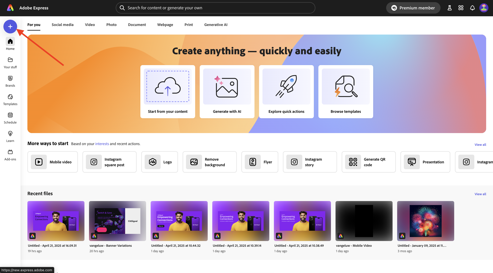
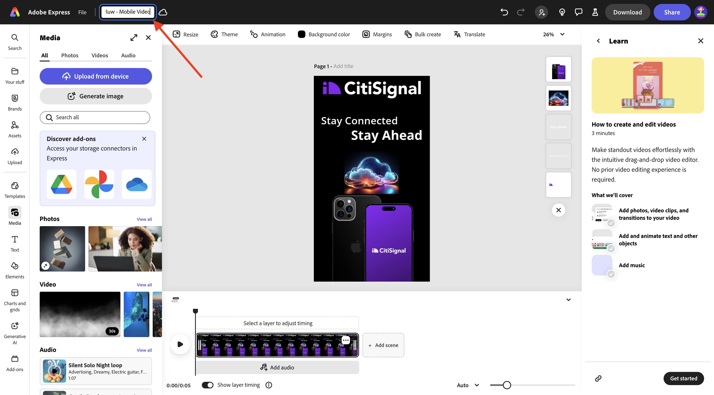
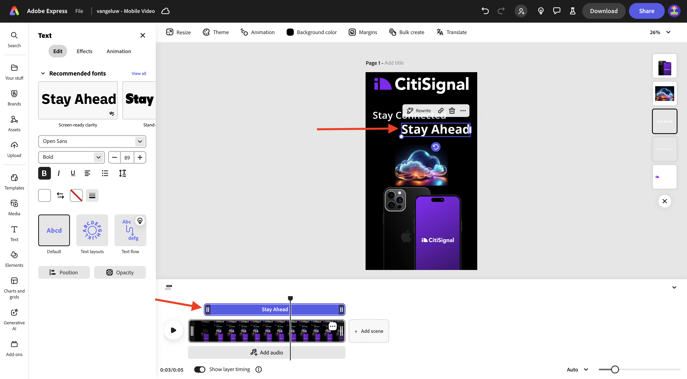
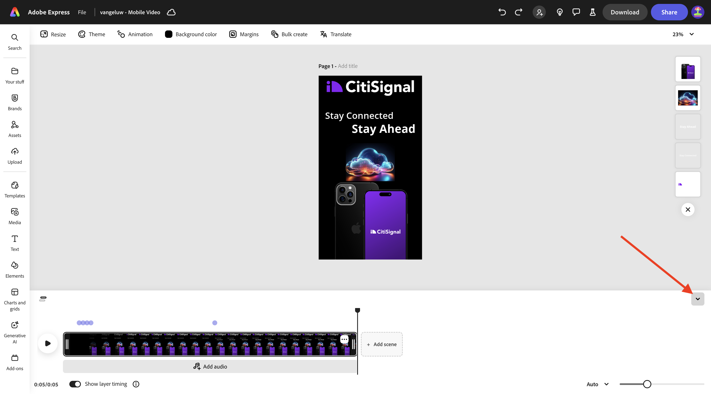
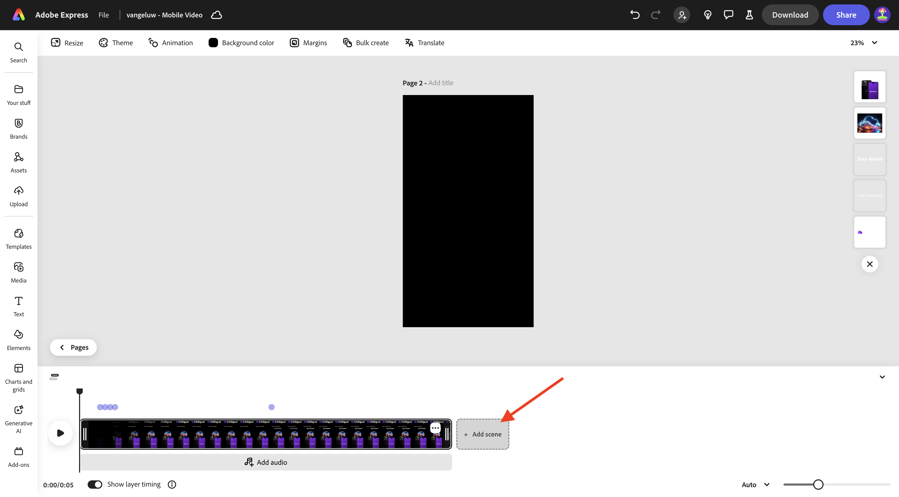
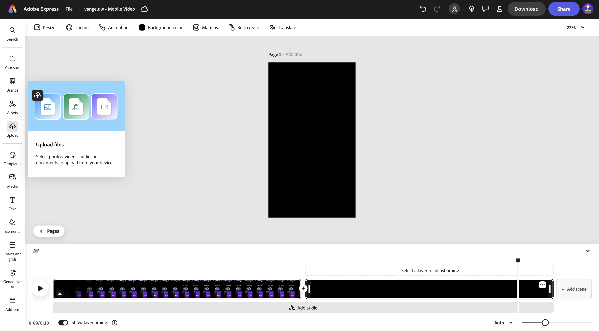
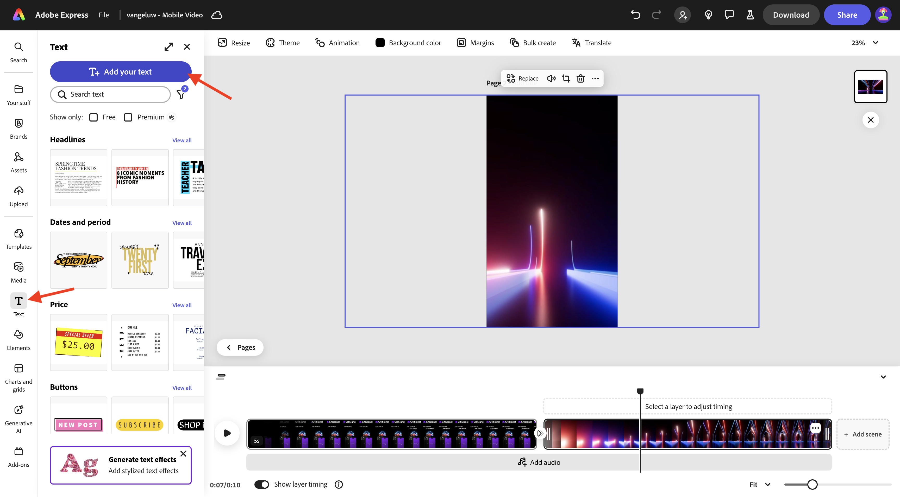
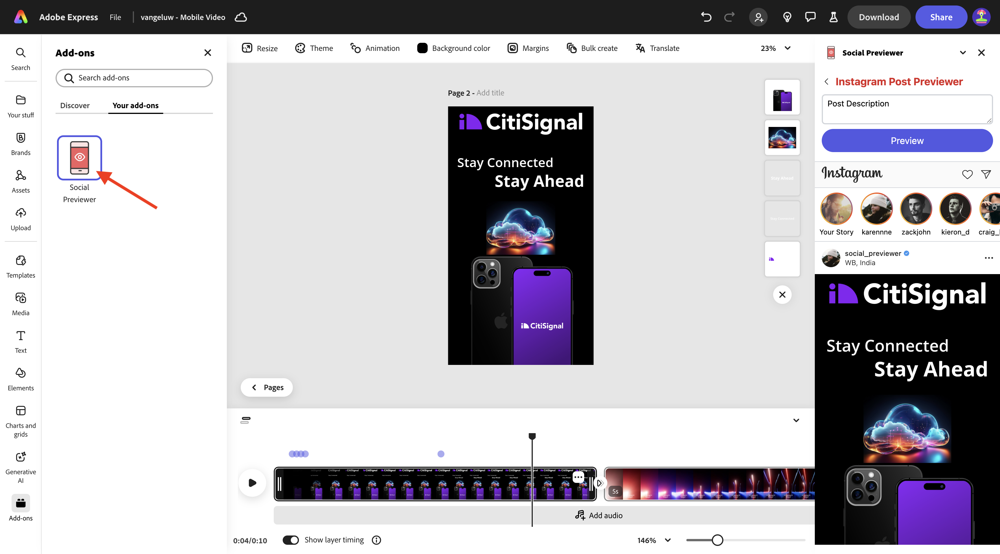
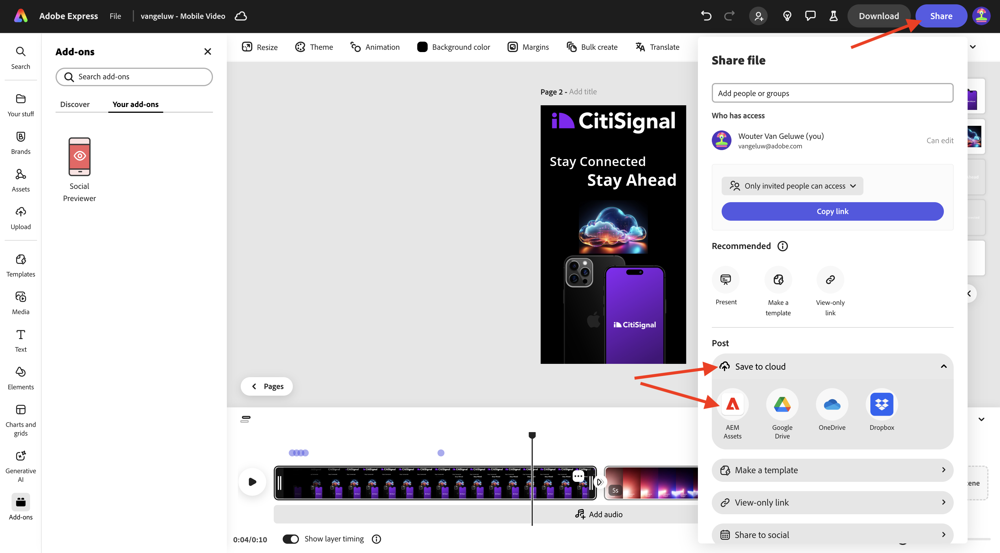

# 1.4.2 Animation und Video in Adobe Express

Bevor Sie mit dieser Übung beginnen, laden Sie die erforderlichen Assets von [https://one-adobe-tech-insiders.s3.us-west-2.amazonaws.com/one-adobe/Adobe_Express.zip](https://one-adobe-tech-insiders.s3.us-west-2.amazonaws.com/one-adobe/Adobe_Express.zip){target="_blank"} herunter und entpacken Sie sie auf Ihrem Desktop.

## 1.4.2.1 Video erstellen

Navigieren Sie zu [https://new.express.adobe.com/](https://new.express.adobe.com/){target="_blank"}. Klicken Sie auf das Symbol **+** , um ein neues **Bild** zu erstellen.

Gehen Sie zu **Video** und wählen Sie **Mobiles Video** aus.

Sie sollten das dann sehen.

Wählen Sie **Hintergrundfarbe** und dann **Schwarz** aus.

Als Nächstes sollten Sie das **CitiSignal**-Logo hinzufügen. Gehen Sie zu **Marken** und wählen Sie das weiße CitiSignal-Logo aus. Klicken Sie auf die 3 Punkte **…** und wählen Sie **Ort**.

Zentrieren Sie das CitiSignal-Logo oben im Bild.

Wechseln Sie zu **Text** und wählen Sie dann **Text hinzufügen** aus.

Geben Sie den `Stay Connected` ein und platzieren Sie das Textfeld an einer ähnlichen Position, wie in der folgenden Abbildung dargestellt.

Wechseln Sie zu **Text** und wählen Sie dann **Text hinzufügen** aus. Geben Sie den `Stay Ahead` ein.

Platzieren Sie das Textfeld an einer ähnlichen Position, wie in der folgenden Abbildung dargestellt.

Wählen Sie das erste Textfeld mit dem Text **Verbunden bleiben**. Gehen Sie zu **Marken**, zu **Schriftarten**. Klicken Sie auf die 3 Punkte **…** auf der 1. Schriftart und klicken Sie auf **Anwenden**.

Wählen Sie das zweite Textfeld mit dem Text &quot;**&quot;**. Gehen Sie zu **Marken**, zu **Schriftarten**. Klicken Sie auf die 3 Punkte **…** auf der 3. Schriftart und klicken Sie auf **Anwenden**.

Sie sollten das dann sehen. Wechseln Sie zu **Medien** und wählen Sie **Bild erstellen** aus.

Geben Sie den `futuristic looking transparent cloud on a black background` ein und klicken Sie auf **Generieren**.

Wählen Sie **Querformat (4:3)**.

Sie sollten das dann sehen. Wählen Sie eine der Varianten.

Zentriert das generierte Bild. Gehen Sie zu **Medien** und klicken Sie dann auf **Von Gerät hochladen**.

Navigieren Sie zu Ihrem Desktop, zum Ordner **Adobe_Express** der die zuvor heruntergeladenen Assets enthält. Wählen Sie die Datei **CitiSignalPhoneLogo.png** aus und klicken Sie auf **Öffnen**.

Sie sollten das dann sehen.

Ziehen Sie das Bild nach unten, sodass es dem unten stehenden Bild ähnelt.

Ändern Sie den Namen Ihres Projekts in `--aepUserLdap-- - Mobile Video`.

Gehen Sie zu **Animation** und klicken Sie dann auf die **Glide**-Animation.

Klicken Sie auf **Play**-Symbol, um Ihre Animation zu testen.

Wählen Sie das Textfeld **Weiter** aus.

Stellen Sie den Zeitleisten-Schieberegler für das Textfeld &quot;**&quot;**, sodass er auf halber Strecke beginnt.

Wählen Sie das **CitiSignal**-Logo aus.

Öffnen Sie die Detaileinstellungen der Aktion **Folie** und ändern Sie die Dauer in 2,5 Sekunden.

Klicken Sie anschließend auf **Herunterladen**. Wählen Sie **Dateiformat** **MP4** aus und setzen Sie **Videoauflösung** auf **1080p**. Klicken Sie **Herunterladen**.

Ihre Videodatei wird dann generiert und auf Ihren Computer heruntergeladen. Ihr erstes Video ist jetzt fertig.

## 1.4.2.2 Zum Video hinzufügen

Schließen Sie die **Zeitleiste**.

Klicken Sie auf die 3 Punkte **…** und wählen Sie **Duplizieren**.

Anschließend wird eine neue Seite generiert. Klicken Sie **Zeitleiste bearbeiten**, um mit der neuen Seite zu arbeiten.

Klicken Sie auf **+ Szene hinzufügen**.

Anschließend sollte eine neue Szene hinzugefügt werden.

Navigieren Sie zu Ihrem Desktop, zum Ordner **Adobe_Express** der die zuvor heruntergeladenen Assets enthält. Wählen Sie die **`AdobeStock_648887461_trimmed.mp4`** aus und klicken Sie auf **Öffnen**.

Ihre Videodatei wird dann der neuen Szene hinzugefügt.

Klicken Sie in die Mitte zwischen den zwei Szenen und wählen Sie dann **Transition hinzufügen**.

Klicken Sie auf **Zum Schwarzen wechseln**.

Ändern Sie **Dauer** auf 2 Sekunden. Klicken Sie auf die Schaltfläche **Play**, um Ihren Übergang zu testen.

Wechseln Sie zu **Text** und klicken Sie dann auf **Text hinzufügen**.

Geben Sie den `with lightning fast speed from CitiSignal` ein. Zentrieren Sie den Text, indem Sie auf **Zentrieren** klicken.

Ändern Sie die Schriftgröße in **60**.

## 1.4.2.3 Verwenden von Add-ons in Adobe Express

Gehen Sie zu **Add-ons** und suchen Sie nach dem Add-on **Social Previewer**.

Klicken Sie auf **+**, um das Add-on hinzuzufügen.

Wählen Sie das Add-on **Social Previewer** und klicken Sie auf die Option **Instagram Post** Vorschau . Sie können jetzt ganz einfach eine Vorschau davon anzeigen, wie Ihr Beitrag auf den gängigsten Social-Media-Plattformen aussehen wird.

## 1.4.2.4 Erstellen einer neuen Vorlage in Adobe Express

Klicken Sie anschließend auf die Schaltfläche **Freigeben** und wählen Sie **Vorlage erstellen** aus.

Verwenden Sie den `--aepUserLdap-- - Mobile Video`, wählen Sie die Marke **CitiSignal (Telco)** und klicken Sie dann auf **Vorlage speichern**.

Ihre Videovorlage wird jetzt in Ihrer Markenvorlage gespeichert.

## 1.4.2.5 Video in AEM Assets CS speichern

Klicken Sie erneut **Freigeben** und wählen Sie dann **In Cloud speichern** aus. **AEM Assets**.

Wählen Sie die **Aktuelle Seite** aus. Verwenden Sie den `--aepUserLdap-- - Mobile Video` und klicken Sie dann auf **Ordner auswählen**.

Wählen Sie die **`--aepUserLdap-- - Frame.io PNG`** aus und klicken Sie auf **Auswählen**.

Klicken Sie **1 Asset hochladen**.

Wechseln Sie zu [https://experience.adobe.com/](https://experience.adobe.com/){target="_blank"} und klicken Sie auf **Experience Manager Assets**.

Wählen Sie Ihre AEM Assets CS-Umgebung aus, die `--aepUserLdap-- - Citi Signal dev` benannt werden soll.

Navigieren Sie in **0}Assets** zum Ordner . **`--aepUserLdap-- - Frame.io PNG`** Doppelklicken Sie auf die Asset-**`--aepUserLdap-- - Mobile Video`**, um sie zu öffnen.

Ihr in Adobe Express erstelltes Video ist jetzt in Adobe Experience Manager Assets verfügbar.

## Nächste Schritte

Navigieren Sie zu [Massen-Assets in Adobe Express erstellen](./ex3.md){target="_blank"}

Zurück zu [Adobe Express und Adobe Experience Cloud](./express.md){target="_blank"}

Zurück zu [Alle Module](./../../../overview.md){target="_blank"}
